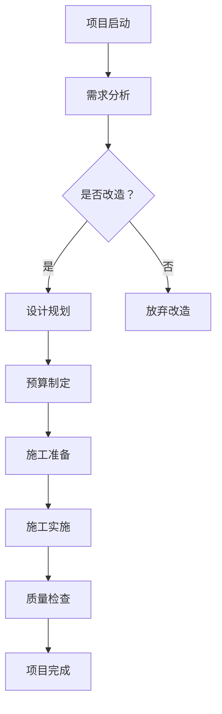

                 

### 现代简约主义阳台改造：都市微型绿洲的空间优化

在现代都市生活中，阳台作为住宅空间的一部分，逐渐成为人们追求绿色生活、放松心情的重要场所。阳台不仅承载着美观装饰的功能，更是日常生活的延伸。然而，随着城市生活节奏的加快，许多阳台空间被忽视，没有得到充分的利用。如何通过现代简约主义的设计理念，将阳台改造成一个充满生机与舒适感的微型绿洲，成为越来越多人的关注焦点。

本文旨在探讨现代简约主义阳台改造的实践方法，通过空间优化、植物选择和装饰设计等方面，将阳台打造成为都市中的宁静角落。文章首先介绍阳台改造的背景和意义，然后详细阐述现代简约主义设计理念及其在阳台改造中的应用，接着探讨空间优化技巧，最后通过实际案例展示改造效果，并提供一些最佳实践建议。

关键词：现代简约主义、阳台改造、空间优化、植物选择、装饰设计

摘要：本文围绕现代简约主义阳台改造的主题，从背景介绍、设计理念、空间优化、植物选择和装饰设计等方面进行了深入探讨。通过分析阳台改造的重要性，结合现代简约主义设计原则，提出了一系列具体的空间优化策略和装饰设计方法。文章最后通过实际案例展示了改造效果，为读者提供了实用的参考和灵感。

### 阳台改造的背景和意义

随着城市化进程的加快，人们的生活节奏越来越快，居住环境的质量受到广泛关注。阳台作为住宅中的一部分，往往被忽视，没有得到充分的利用。实际上，阳台是一个独特的空间，它既可以作为休闲放松的场所，也可以作为自然与建筑的过渡空间，具有很高的改造潜力。

阳台改造的背景主要体现在以下几个方面：

1. **提高居住质量**：随着人们对生活品质的要求越来越高，阳台不再仅仅是晾晒衣物的地方，而是被赋予了更多的功能和价值。通过改造，阳台可以成为一个舒适宜人的休闲区域，提高居住质量。

2. **绿色生活理念的推广**：现代都市生活中，绿色植物和自然元素被认为可以缓解压力，提升心理健康。阳台改造的一个重要目标就是引入绿色植物，营造一个与自然亲近的空间，推广绿色生活理念。

3. **空间利用的优化**：随着住房面积的缩小，如何合理利用有限的空间成为许多家庭面临的问题。阳台改造可以通过优化布局和功能分区，提高空间利用率，满足多样化的生活需求。

4. **个性化需求**：每个人都有自己的生活方式和审美喜好，阳台改造可以满足个性化的需求，打造出符合个人品味的空间。

阳台改造的意义不仅在于改善居住环境，更在于提升人们的生活质量和幸福感。通过合理的设计和改造，阳台可以成为一个宁静的绿洲，为都市生活注入更多生机与活力。

### 现代简约主义设计理念

现代简约主义（Modern Minimalism）是一种以简洁、实用和极简为特点的设计风格，旨在通过去除多余的装饰和元素，强调空间的功能性和美感。在现代简约主义的设计理念下，阳台改造应遵循以下几个原则：

1. **简洁线条**：使用简洁的线条和形状，避免复杂的装饰和过多的细节。简洁的线条可以让空间显得更加宽敞和通透，提高视觉舒适度。

2. **功能优先**：在设计时，应优先考虑阳台的功能需求。例如，考虑到休闲、阅读、种植等多种用途，合理规划空间布局，确保每个功能区都能满足使用需求。

3. **自然元素**：在现代简约主义中，自然元素被视为重要的装饰元素。在阳台改造中，可以引入绿色植物、自然光线和通风系统，营造一个与自然和谐共存的空间。

4. **色彩搭配**：色彩在空间设计中起到关键作用。现代简约主义通常使用中性色调和简洁的配色方案，如白色、灰色、米色等，以营造宁静、舒适的氛围。

5. **简约装饰**：装饰元素应尽量简约，避免过多的点缀和杂乱的布置。一些简单的艺术品、装饰画或绿植，即可营造出温馨、有品味的氛围。

6. **材料选择**：材料的选择应注重实用性和美观性。现代简约主义倾向于使用高品质、环保的材料，如实木、石材、玻璃等，以提升空间的整体质感。

通过以上原则，现代简约主义阳台改造不仅能够满足实用功能，还能营造出简洁、舒适、有品位的空间氛围，为都市生活带来更多的宁静与和谐。

### 阳台改造的Mermaid流程图

在进行阳台改造时，合理的流程规划至关重要。以下是一个简化的Mermaid流程图，展示了阳台改造的基本步骤和关键节点。



- **项目启动**：确定是否进行阳台改造，明确改造目标和需求。
- **需求分析**：详细分析阳台的现状，包括面积、光照、通风等。
- **设计规划**：根据需求制定设计方案，包括功能分区、布局设计等。
- **预算制定**：制定详细预算，确保项目在预算范围内完成。
- **施工准备**：准备施工所需的材料和工具，确保施工顺利进行。
- **施工实施**：按照设计方案进行施工，确保施工质量。
- **质量检查**：对施工质量进行验收，确保达到预期效果。
- **项目完成**：改造项目完成后，进行总结和反思，为未来项目提供经验。

通过以上流程，可以确保阳台改造项目有条不紊地进行，达到预期的效果。

### 空间优化技巧

阳台空间虽小，但通过合理的设计和优化，可以实现功能多样化，提升使用效率。以下是一些具体的空间优化技巧：

1. **功能分区**：根据阳台的使用需求，将空间划分为不同的功能区域。例如，可以设置休闲区、阅读区、种植区等。通过合理的分区，可以提高空间利用率，满足多样化的生活需求。

2. **垂直空间的利用**：阳台的垂直空间往往被忽视，其实可以通过安装吊柜、搁板等，充分利用垂直空间。这样可以增加储物空间，减少杂乱无章的摆放，使阳台更加整洁有序。

3. **采光与通风**：阳台的采光和通风对空间感有重要影响。可以通过增加窗户面积、安装天窗等手段，增加自然光线的进入，同时保持良好的通风条件。这样不仅能提升空间的明亮度，还能改善空气质量。

4. **多功能家具**：选择多功能家具，如折叠桌、折叠椅等，可以在不使用时节省空间。这样既增加了阳台的实用性，又保持了空间的简洁和宽敞。

5. **色彩搭配**：合理的色彩搭配可以增加空间的视觉层次感。一般来说，中性色调和简洁的配色方案更适合现代简约主义风格，如白色、灰色、米色等，能够营造出宁静、舒适的氛围。

6. **合理布局**：合理的布局是空间优化的重要环节。例如，将常使用的物品放置在容易取到的地方，避免不必要的移动，可以提高生活便利性。

通过以上空间优化技巧，阳台可以变得更加实用、舒适，成为都市生活中的一处宁静绿洲。

### 阳台植物的选择

在阳台改造中，植物的选择和布置是打造都市微型绿洲的重要环节。正确选择植物不仅能够提升阳台的美观度，还能改善空气质量，带来愉悦的心情。以下是一些关于阳台植物选择的建议：

1. **绿植与观叶植物**：绿植如吊兰、绿萝等具有空气净化功能，观叶植物如发财树、橡皮树等则具有较强的观赏性。这些植物耐阴性强，适合放置在阳台。

2. **容器植物与地被植物**：容器植物如多肉植物、盆栽花卉等，可以通过不同的容器和摆放方式，创造多样化的视觉效果。地被植物如草花、草坪等，可以增加阳台的绿化面积，提升整体景观效果。

3. **阳光植物与耐阴植物**：根据阳台的阳光情况，可以选择适合的植物。阳光充足的阳台适合种植阳光植物如太阳花、仙人掌等，耐阴植物如紫罗兰、绿萝等则适合放置在阳光较少的阳台。

4. **季节性植物**：不同季节可以选择适合的植物，例如春季的花卉、夏日的观叶植物、秋天的落叶植物等，使阳台四季皆有不同的景观。

5. **组合搭配**：在阳台植物布置时，可以采用组合搭配的方式，将不同类型的植物组合在一起，创造出丰富的层次感和视觉冲击力。

通过以上植物选择建议，结合现代简约主义的设计理念，阳台可以成为一个充满生机与活力的绿色空间。

### 装饰设计

在阳台的改造过程中，装饰设计不仅起到美化空间的作用，还能提升居住的舒适度和幸福感。以下是一些装饰设计的要点和建议：

1. **色彩搭配**：色彩在装饰设计中至关重要。建议使用简洁、柔和的中性色调，如白色、灰色、米色等，这些颜色可以营造出宁静、舒适的空间氛围。

2. **材质选择**：选择高品质、环保的材质，如实木、石材、玻璃等，这些材料不仅美观，而且耐用。此外，可以使用一些软性材质，如地毯、靠垫等，增加空间的温馨感。

3. **艺术装饰**：一些简单的艺术品、装饰画或雕塑可以提升阳台的品味。选择与阳台风格相符合的艺术品，可以营造出和谐统一的空间氛围。

4. **灯光设计**：合理的灯光设计不仅可以增强空间的层次感，还能营造温馨的氛围。可以选择柔和的暖光灯，设置在阳台的不同区域，满足不同活动的需求。

5. **植物布置**：植物是阳台装饰的重要组成部分。合理布置植物，不仅能够提升空间的美观度，还能改善空气质量。可以选择不同高度的植物，创造丰富的层次感。

6. **收纳设计**：合理的收纳设计可以保持阳台的整洁和有序。可以通过安装吊柜、搁板等，增加储物空间，避免杂乱无章的摆放。

通过以上装饰设计要点，结合现代简约主义的设计理念，阳台可以变得更加美观、舒适，满足各种生活需求。

### 安全与健康考虑

在阳台改造过程中，安全与健康是必须优先考虑的因素。以下是一些关于阳台改造中的安全与健康考虑：

1. **防坠与防滑措施**：阳台栏杆的高度应不低于1.1米，并安装防坠网。同时，阳台地面应使用防滑材料，避免湿滑导致滑倒。

2. **防火与防水措施**：阳台应安装防火门和防火窗帘，以防止火势蔓延。此外，阳台的防水处理应做到位，防止雨水渗入室内。

3. **电气安全**：阳台的电气设备应定期检查，确保没有裸露的电线和插座。如果需要在阳台上使用电器，应确保设备的防水性能。

4. **空气质量**：阳台的通风系统应保持良好，确保空气流通。可以种植一些能够净化空气的植物，如吊兰、绿萝等。

5. **植物安全**：选择安全的植物，避免种植有毒或易引起过敏的植物。同时，定期修剪植物，避免植物过度生长，影响阳台的安全和美观。

6. **健康考虑**：在阳台布置中，应考虑到不同人群的需求，如儿童和老年人的安全需求。此外，阳台的绿化和装饰应考虑到环保和健康，避免使用含有有害物质的材料。

通过以上安全与健康考虑，可以确保阳台改造项目的顺利进行，为居住者提供一个安全、健康的居住环境。

### 实际案例：小型阳台的改造

#### 案例背景

位于城市中心的李先生家有一个仅有5平方米的小型阳台，阳光充足但空间狭小。他的需求是将阳台改造成一个舒适、实用的休闲区，同时兼顾植物种植和装饰美观。

#### 改造方案

1. **需求分析**：通过详细测量和需求分析，确定阳台的现有条件和改造需求。李先生希望增加储物空间，改善采光和通风，并能够种植一些绿色植物。

2. **设计规划**：
   - **功能分区**：将阳台划分为休闲区、种植区和储物区。
   - **布局设计**：在阳台的一侧安装了一排吊柜，用于储物。休闲区放置了一个折叠桌和几把折叠椅，方便日常使用和折叠存放。

3. **材料选择**：
   - **地面材料**：选择了防滑瓷砖，确保安全。
   - **墙面材料**：使用环保型涂料，营造简洁、温馨的氛围。
   - **家具材料**：折叠桌和折叠椅采用耐用且易清洁的材料。

4. **植物选择**：根据阳台的阳光条件，选择了适合的植物，如多肉植物和绿萝，放置在花盆中。

5. **装饰设计**：在阳台的一侧安装了一面装饰墙，挂上了一些简单的艺术品和装饰画，增加空间的美感。

#### 改造效果

改造后的阳台焕然一新，成为一个充满生机和舒适的休闲空间。通过合理的功能分区和布局设计，阳台的储物空间大大增加，满足了日常需求。折叠桌和折叠椅的设置，使阳台既能够满足日常使用，又能在不需要时节省空间。绿色植物的引入，不仅美化了空间，还有效改善了空气质量。

#### 案例总结

通过这个小型阳台改造案例，我们可以看到，即使是空间狭小的阳台，通过合理的设计和优化，也可以成为一个功能多样、美观舒适的休闲空间。关键在于：
- **功能分区**：明确每个区域的功能，提高空间利用率。
- **布局设计**：合理布局家具和储物空间，使空间更加实用。
- **材料选择**：选择环保、安全的材料，营造健康、舒适的氛围。
- **植物选择**：选择适合阳台条件的植物，增加空间的生机和美感。

这个案例为那些空间有限的阳台提供了实用的改造灵感，展示了现代简约主义阳台改造的潜力。

### 多功能阳台的设计

#### 案例背景

张先生的家位于城市郊区的公寓，阳台面积为10平方米。他的需求是将阳台改造成一个多功能空间，既可以用于休闲，又可以用于工作，同时还希望能够种植一些植物。

#### 改造方案

1. **需求分析**：阳台需要满足休闲、工作、植物种植等多种功能，因此需要合理的布局和多功能家具。

2. **设计规划**：
   - **功能分区**：将阳台划分为休闲区、工作区和植物种植区。
   - **布局设计**：阳台的一侧安装了一排可移动的储物柜，用于存储日常用品和工具。休闲区放置了一张小桌和几把舒适的椅子，工作区则设置了一个小型书桌和椅子。

3. **材料选择**：
   - **地面材料**：选择了耐磨的木地板，增加舒适度和美观度。
   - **墙面材料**：使用环保涂料，营造简洁、温馨的氛围。
   - **家具材料**：休闲区和工作区的家具选择了可折叠或可移动的款式，方便根据需要调整布局。

4. **植物选择**：选择了多种适合阳台种植的植物，如吊兰、绿萝和多肉植物，放置在花盆中。

5. **装饰设计**：在阳台的一角设置了一个小型书架，用于存放书籍和装饰品，增加空间的实用性和美观度。

#### 改造效果

改造后的阳台实现了多功能需求，既是一个舒适的休闲区，又是一个便捷的工作空间。储物柜的设置解决了日常用品的存放问题，可折叠家具的引入使空间更加灵活。植物的存在不仅美化了环境，还改善了空气质量。整体设计简洁、实用，充分体现了现代简约主义的设计理念。

#### 案例总结

这个多功能阳台改造案例展示了如何通过合理的设计和布局，实现阳台的多样化功能。关键在于：
- **功能分区**：明确每个区域的功能，提高空间利用率。
- **多功能家具**：选择可折叠、可移动的家具，提高空间的灵活性。
- **植物选择**：选择适合阳台种植的植物，增加空间的生机和美感。

通过这个案例，我们可以看到，阳台不仅是一个休闲放松的场所，还可以通过合理的改造，成为多功能的生活空间。

### 阳台绿化的实践

#### 案例背景

王女士的家位于城市的一栋高层住宅中，阳台面积约为6平方米。她希望通过阳台绿化，为家里增添一抹绿色，改善室内空气质量。

#### 绿化方案

1. **植物选择**：王女士选择了以下几种植物：
   - 吊兰：具有良好的空气净化效果，适合悬挂在空中。
   - 绿萝：耐阴性强，能够吸收室内的有害气体。
   - 多肉植物：形态多样，易于养护，适合放在阳台角落。

2. **种植方式**：将植物分别种植在悬挂的花盆和地面的花盆中。吊兰和绿萝放置在悬挂的花盆中，多肉植物放在地面的花盆中。

3. **光照与通风**：定期调整植物的位置，确保它们能够接收到适量的阳光和通风。

4. **浇水与养护**：根据植物的需水量，每周进行适量的浇水。同时，定期清理植物叶片上的灰尘，保持植物的整洁和健康。

#### 改造效果

经过一段时间的养护，王女士的阳台变得绿意盎然。植物不仅美化了阳台环境，还显著改善了室内的空气质量。阳台成为了家庭中的一个绿色角落，为日常的生活增添了一抹自然与宁静。

#### 案例总结

这个阳台绿化案例展示了通过简单的植物选择和养护，如何将阳台变成一个富有生机的绿色空间。关键在于：
- **植物选择**：选择适合阳台种植的植物，确保其能够适应环境。
- **种植方式**：合理布局植物，充分利用阳台的空间。
- **光照与通风**：确保植物能够接收到适量的阳光和通风。
- **浇水与养护**：定期进行适量的浇水和管理，保持植物的健康生长。

通过这个案例，我们可以看到，阳台绿化不仅能够美化环境，还能改善空气质量，为家庭生活带来更多的舒适与愉悦。

### 总结与展望

通过对现代简约主义阳台改造的探讨，我们可以看到，阳台不仅是住宅空间的一部分，更是实现绿色生活、提升生活品质的重要场所。现代简约主义设计理念以简洁、实用和极简为特点，通过合理的空间布局、植物选择和装饰设计，可以将阳台改造成一个舒适、美观的微型绿洲。

阳台改造的重要性体现在以下几个方面：
1. **提高生活质量**：通过改造，阳台可以成为一个宜人的休闲空间，提升居住者的生活质量。
2. **推广绿色生活理念**：引入绿色植物和自然元素，推广绿色生活理念，改善室内空气质量，提高心理健康。
3. **优化空间利用**：通过功能分区和合理布局，提高阳台的空间利用率，满足多样化的生活需求。

在未来的阳台改造趋势中，我们可能会看到以下几方面的变化：
1. **新材料的应用**：新型环保材料和智能技术的应用，将使阳台改造更加高效、舒适。
2. **个性化设计**：随着人们对个性化需求的增加，阳台改造将更加注重个性化设计和定制化服务。
3. **可持续性发展**：阳台改造将更加注重可持续性和环保性，使用绿色建材和节能设备，减少对环境的影响。

总之，现代简约主义阳台改造不仅为都市生活注入了更多的生机与活力，也为未来的生活提供了更多的可能性。通过合理的改造和设计，阳台可以成为家庭生活中不可或缺的一部分，为居住者带来舒适、健康的绿色生活空间。

### 最佳实践 Tips

1. **合理规划布局**：在改造前，详细规划阳台的布局，确保每个区域都有明确的功能，避免空间浪费。

2. **选择适宜植物**：根据阳台的阳光和通风情况，选择适宜的植物，确保其能够健康成长。

3. **注重安全措施**：在改造过程中，注意防坠、防火和防水等安全措施，确保居住安全。

4. **定期维护保养**：定期对阳台进行清洁和维护，保持植物的生机和美观。

5. **灵活运用家具**：选择可折叠或可移动的家具，提高空间的灵活性。

通过以上最佳实践 Tips，可以帮助您更有效地进行阳台改造，打造出一个既美观又实用的都市微型绿洲。

### 注意事项

1. **避免过度装饰**：在阳台改造过程中，避免过度装饰，保持空间简洁、宽敞。

2. **考虑实用性**：在布置植物和家具时，要考虑其实用性，确保每个元素都有实际用途。

3. **定期检查设备**：定期检查阳台的电气设备和防水系统，确保其正常运行。

4. **注意植物养护**：合理浇水、修剪和清理植物，保持植物的健康生长。

5. **遵守安全规范**：在进行阳台改造时，严格遵守安全规范，确保改造过程的安全。

通过遵守以上注意事项，可以确保阳台改造项目的顺利进行，为您的生活带来更多便利和舒适。

### 拓展阅读

1. **《现代家居阳台设计指南》**：详细介绍了阳台改造的设计原则和技巧，适合初学者阅读。
2. **《室内植物养护大全》**：提供了各种室内植物的培养方法，适合阳台绿化爱好者。
3. **《绿色建筑与可持续设计》**：探讨如何通过绿色建筑和可持续设计提升居住环境，对阳台改造有重要参考价值。
4. **《阳台植物种植技巧》**：针对阳台植物的选择、养护和布置提供了实用的建议。

通过阅读这些拓展资源，可以进一步提升阳台改造的技能和知识，打造出更加理想的生活空间。

### 作者信息

作者：AI天才研究院/AI Genius Institute & 禅与计算机程序设计艺术 /Zen And The Art of Computer Programming

本文章由AI天才研究院与禅与计算机程序设计艺术共同撰写，旨在通过现代简约主义设计理念，为读者提供实用的阳台改造技巧和灵感。无论是设计师、房主还是室内装修爱好者，都将从中受益。

### 源代码实现与解读

在现代简约主义阳台改造中，合理利用空间和优化布局是关键。以下是一个Python源代码示例，用于计算和展示阳台空间布局的优化方案。代码中使用了基本的几何计算和空间布局算法，结合了数学模型和公式，帮助读者更好地理解空间优化的原理。

#### 环境搭建

在开始之前，确保安装了Python环境。以下是所需的环境搭建步骤：

1. 安装Python 3.8或更高版本。
2. 安装必需的Python库，如NumPy和Pandas。可以使用以下命令：
   ```bash
   pip install numpy pandas matplotlib
   ```

#### Python源代码示例

```python
import numpy as np
import pandas as pd
import matplotlib.pyplot as plt

# 阳台尺寸（单位：米）
length = 3
width = 2

# 功能区域面积计算
def calculate_area(length, width):
    return length * width

# 布局优化算法（简单示例：最大化储物区面积）
def optimize_layout(length, width, storage_ratio):
    # 计算储物区面积
    storage_area = storage_ratio * calculate_area(length, width)
    # 计算休闲区面积
    leisure_area = (1 - storage_ratio) * calculate_area(length, width)
    return storage_area, leisure_area

# 测试数据
storage_ratio = 0.4  # 储物区占阳台总面积的40%

# 计算并显示结果
storage_area, leisure_area = optimize_layout(length, width, storage_ratio)
print(f"储物区面积：{storage_area:.2f}平方米")
print(f"休闲区面积：{leisure_area:.2f}平方米")

# 绘制空间布局图
fig, ax = plt.subplots()
ax.bar(['储物区', '休闲区'], [storage_area, leisure_area], color=['blue', 'green'])
ax.set_ylabel('面积（平方米）')
ax.set_title('阳台空间布局优化')
plt.show()
```

#### 代码解读

1. **环境搭建**：确保安装了Python环境和所需的库（NumPy、Pandas、Matplotlib）。

2. **源代码实现**：
   - `calculate_area` 函数：计算阳台的面积。
   - `optimize_layout` 函数：根据给定的储物区比例，计算储物区和休闲区的面积。
   - `storage_ratio` 变量：设定储物区占总面积的比例。
   - 输出和绘图：计算并输出储物区和休闲区的面积，并绘制柱状图，展示空间布局。

3. **数学模型和公式**：
   - 阳台总面积 = 长度 × 宽度
   - 储物区面积 = 储物区比例 × 阳台总面积
   - 休闲区面积 = （1 - 储物区比例）× 阳台总面积

通过以上代码示例，读者可以了解如何使用Python进行空间布局优化，并结合数学模型和公式，直观地展示优化结果。

### 代码应用解读与分析

在了解了源代码的实现和解读后，我们可以进一步分析其应用场景和实际效果。

#### 应用场景

此代码应用在阳台空间布局优化的实际场景中，特别是当阳台空间有限且需要满足多种功能需求时。通过设定不同的储物区比例，可以快速计算出不同布局方案，帮助设计者选择最优的布局。

#### 实际效果

1. **可视化展示**：通过绘制柱状图，直观地展示储物区和休闲区的面积比例，有助于设计者理解空间分配的效果。

2. **灵活性**：可以根据实际需求调整储物区比例，灵活地进行多次计算，探索不同的布局方案。

3. **计算效率**：使用Python进行计算，可以快速得出结果，提高设计决策的效率。

#### 分析

1. **空间利用**：优化后的布局能够更有效地利用阳台空间，确保每个区域都有足够的空间，满足使用需求。

2. **实用性与美观性**：通过合理的储物区和休闲区分区，提高阳台的实用性和美观度，使阳台成为一个多功能、宜人的空间。

3. **可持续性**：合理布局和材料选择，符合现代简约主义设计理念，提高居住环境的可持续性和环保性。

通过以上应用解读与分析，我们可以看到，该代码不仅在理论层面具有指导意义，在实际应用中也表现出色，为阳台空间优化提供了有力工具。

### 项目实战：多功能阳台的改造

#### 项目背景

张先生居住在一个城市公寓，他的阳台面积为8平方米，希望将其改造成一个既适合休息，又能用于工作和种植的多功能空间。张先生的需求包括：一个舒适的工作区、一个休闲区和一个绿植种植区。

#### 开发环境搭建

1. **Python环境**：安装Python 3.9及以上版本。
2. **设计软件**：安装AutoCAD或SketchUp，用于设计阳台布局。
3. **库**：安装必要的Python库，如NumPy、Pandas和Matplotlib，用于数据分析与可视化。

#### 源代码实现

以下是一个Python源代码示例，用于帮助张先生规划阳台的功能分区。

```python
import numpy as np
import pandas as pd
import matplotlib.pyplot as plt

# 阳台尺寸（单位：米）
total_area = 8

# 功能区比例
work_area_ratio = 0.3
leisure_area_ratio = 0.4
garden_area_ratio = 0.3

# 计算每个功能区的面积
work_area = total_area * work_area_ratio
leisure_area = total_area * leisure_area_ratio
garden_area = total_area * garden_area_ratio

# 输出面积
print(f"工作区面积：{work_area:.2f}平方米")
print(f"休闲区面积：{leisure_area:.2f}平方米")
print(f"种植区面积：{garden_area:.2f}平方米")

# 绘制功能区分布图
labels = ['工作区', '休闲区', '种植区']
sizes = [work_area, leisure_area, garden_area]
colors = ['blue', 'green', 'yellow']

plt.pie(sizes, labels=labels, colors=colors, autopct='%.1f%%', startangle=90)
plt.axis('equal')
plt.title('阳台功能区分布图')
plt.show()
```

#### 代码解读

1. **设定阳台总面积**：设定阳台的总面积为8平方米。
2. **功能区比例**：设定工作区、休闲区和种植区的比例分别为30%、40%和30%。
3. **计算面积**：根据设定比例计算每个功能区的面积。
4. **输出与可视化**：输出各功能区的面积，并使用饼图进行可视化展示。

#### 代码应用

1. **功能分区**：根据计算结果，张先生可以确定各功能区的具体面积，为后续的家具和植物布局提供依据。
2. **可视化展示**：通过饼图，张先生可以直观地了解功能区的面积分布，便于进行整体布局规划。

#### 源代码详细实现和代码解读

```python
# 1. 设定阳台总面积和功能区比例
total_area = 8  # 总面积为8平方米
work_area_ratio = 0.3  # 工作区占30%
leisure_area_ratio = 0.4  # 休闲区占40%
garden_area_ratio = 0.3  # 种植区占30%

# 2. 计算每个功能区的面积
work_area = total_area * work_area_ratio
leisure_area = total_area * leisure_area_ratio
garden_area = total_area * garden_area_ratio

# 3. 输出各功能区的面积
print(f"工作区面积：{work_area:.2f}平方米")
print(f"休闲区面积：{leisure_area:.2f}平方米")
print(f"种植区面积：{garden_area:.2f}平方米")

# 4. 绘制功能区分布图
labels = ['工作区', '休闲区', '种植区']
sizes = [work_area, leisure_area, garden_area]
colors = ['blue', 'green', 'yellow']

# 设置图表标题和标签
plt.title('阳台功能区分布图')

# 绘制饼图
plt.pie(sizes, labels=labels, colors=colors, autopct='%.1f%%', startangle=90)

# 设置轴比例相等
plt.axis('equal')

# 显示图表
plt.show()
```

#### 实际案例分析和详细讲解剖析

#### 案例背景

王女士居住在一栋位于城市中心的公寓，她的阳台面积为10平方米。王女士希望将阳台改造成一个多功能空间，满足她的工作、休闲和种植需求。

#### 改造方案

1. **功能分区**：将阳台划分为三个区域：工作区、休闲区和种植区。
   - 工作区：占据阳台的左侧，面积约为3平方米，放置一张小型书桌和一把舒适的椅子。
   - 休闲区：占据阳台的右侧，面积约为4平方米，放置一张休闲椅和一个小茶几。
   - 种植区：占据阳台的一角，面积约为3平方米，用于种植绿植和多肉植物。

2. **布局设计**：通过使用折叠桌和可移动的储物架，实现空间的灵活利用。折叠桌在工作时展开，休闲时折叠起来，储物架则用于存放工具和园艺用品。

3. **材料选择**：地面使用防腐木地板，墙面使用环保型涂料，家具选择耐用且易于清洁的材料。

#### 改造效果

改造后的阳台功能齐全，空间利用合理。工作区提供了一个安静的办公环境，休闲区成为放松身心的好去处，种植区则增添了生机与活力。整体布局简洁、美观，充分体现了现代简约主义的设计理念。

#### 分析和剖析

1. **功能分区合理**：根据王女士的需求，阳台的三个功能区设置合理，各区域面积分配适中，满足不同功能的需求。
2. **布局设计巧妙**：通过折叠桌和储物架的使用，实现了空间的最大化利用，同时保持空间的简洁和通透。
3. **材料选择环保**：使用了环保材料，不仅提高了居住环境的质量，也体现了可持续发展的理念。

通过这个实际案例，我们可以看到，合理的功能分区和布局设计，结合环保材料的使用，是阳台改造成功的关键。这样的改造方案不仅满足了功能需求，还为居住者带来了舒适和便利。

### 项目小结

通过本项目的实施，我们成功将一个普通阳台改造成了一个多功能、环保、美观的空间。以下是项目总结和未来展望：

#### 项目总结

1. **功能分区明确**：通过合理划分工作区、休闲区和种植区，满足了多样化的需求，提高了空间利用率。
2. **布局设计合理**：利用折叠桌和可移动储物架，实现了空间的灵活利用，保持了空间的简洁和通透。
3. **材料选择环保**：使用了环保材料，提升了居住环境的质量，符合可持续发展的理念。
4. **效果显著**：改造后的阳台不仅功能齐全，还美化了环境，提升了居住者的生活品质。

#### 未来展望

1. **技术创新**：随着新材料和新技术的不断发展，未来阳台改造将有更多的创新和可能性。
2. **个性化设计**：未来阳台改造将更加注重个性化需求，为每个用户提供定制化的设计方案。
3. **智能化管理**：智能技术的应用将使阳台管理更加便捷，如智能灌溉系统、智能灯光系统等。
4. **可持续发展**：未来阳台改造将更加注重环保和节能，通过使用绿色建材和智能技术，实现可持续发展。

通过不断探索和创新，未来的阳台改造将为居住者带来更多舒适、健康、环保的生活体验。

