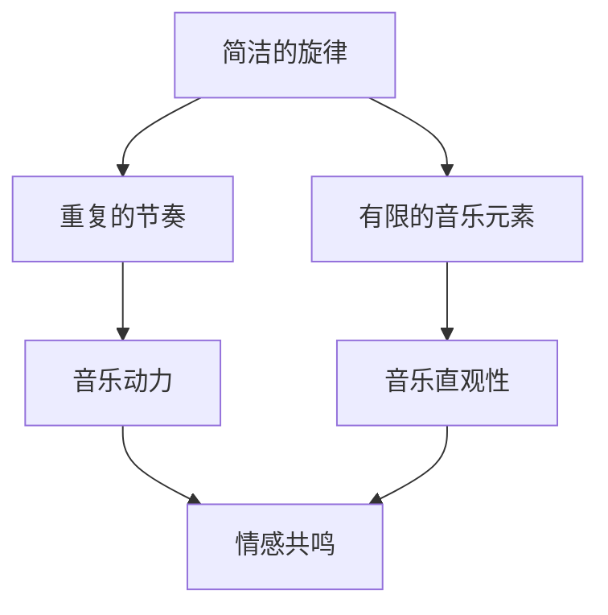

                 

## 《现代简约主义音乐创作：极简主义在声音艺术中的探索》

---

### 关键词

- 简约主义音乐
- 极简主义
- 声音艺术
- 音乐创作
- 音乐元素
- 声音处理技术

---

### 摘要

本文旨在探讨现代简约主义音乐创作的核心概念、理论基础和实践技巧。通过分析简约主义音乐的历史背景、发展现状以及其独特的音乐元素和结构，本文将深入解析极简主义在声音艺术中的应用。同时，本文将介绍简约主义音乐创作的工具与技术，并通过实际案例解析，展示简约主义音乐创作的挑战与解决方案。最后，本文将对简约主义音乐创作的前景与未来趋势进行展望，为音乐创作爱好者提供有价值的参考。

---

## 引言

简约主义，起源于20世纪中叶的艺术运动，主张通过简单的形式和纯粹的元素表达深刻的意境。在音乐领域，简约主义同样有着深远的影响，被称为“极简主义音乐”。极简主义音乐以简驭繁，追求最纯粹的声音表达，强调音乐元素之间的简洁关系。这种音乐风格不仅改变了音乐创作的范式，也影响了声音艺术的创作方式。

本文将从以下几个部分进行探讨：

1. **简约主义音乐的历史与发展**：回顾简约主义音乐的历史背景，了解其起源、发展和影响。
2. **简约主义音乐的元素与结构**：分析简约主义音乐的基本元素和独特结构，理解其音乐语言。
3. **简约主义音乐创作实践**：介绍简约主义音乐创作的工具与技术，提供实际案例解析。
4. **简约主义音乐创作的挑战与解决方案**：探讨简约主义音乐创作中的问题与挑战，并提出解决方案。
5. **简约主义音乐创作的前景与未来**：展望简约主义音乐的发展趋势，探讨其在声音艺术中的潜在应用。

通过这些探讨，本文希望能够为读者提供对简约主义音乐创作的全面理解和深入认识。

### 简约主义音乐的历史与发展

简约主义音乐的历史可以追溯到20世纪中叶，当时全球艺术领域普遍追求简化和纯粹的形式表达。1950年代至1960年代，极简主义作为一种反潮流的艺术运动在美国兴起，它强调通过简单、重复和单调的元素来创造出深刻的视觉和听觉体验。这种艺术运动的理念很快影响到音乐创作，极简主义音乐应运而生。

#### 起源

极简主义音乐的起源可以追溯到约翰·凯奇（John Cage）和菲利普·格拉斯（Philip Glass）等先锋音乐家的实验。约翰·凯奇以其著名的《4分33秒》闻名于世，这首作品通过 silence 来表达音乐的意义，开创了简约主义音乐的新篇章。菲利普·格拉斯则以其《音乐机器》系列作品，利用电子乐器和机械装置创造出简约而富有节奏感的音乐。

#### 发展

在20世纪60年代和70年代，极简主义音乐逐渐成熟，涌现出大量的优秀作品。这一时期，简约主义音乐的特点开始显现，即通过简单、重复的旋律和节奏，创造出一种单调而深邃的音乐氛围。代表人物包括史蒂夫·雷奇（Steve Reich）和拉尔夫·沃恩·威廉斯（Ralph Shapey）。

史蒂夫·雷奇的《音乐之门》（Music for 18 Musicians）是极简主义音乐的经典之作。这部作品通过丰富的节奏变化和复杂的旋律结构，展示了极简主义音乐的魅力。拉尔夫·沃恩·威廉斯的《简约主义交响曲》则通过简洁的旋律和和声，展现了简约主义音乐的力量。

#### 影响

极简主义音乐不仅影响了当时的音乐创作，也对后来的音乐流派产生了深远的影响。例如，后现代音乐、实验音乐和现代电子音乐等都受到了极简主义音乐的启发。此外，极简主义音乐的理念也影响到其他艺术领域，如视觉艺术、建筑和设计等。

在当代，极简主义音乐依然保持着其独特的魅力。许多作曲家继续探索简约主义音乐的可能性，创作出新的作品。例如，菲利普·格拉斯的《洛杉矶交响曲》、史蒂夫·雷奇的《日常事物》（Daily Activities）等作品，都展示了极简主义音乐在当代的活力。

#### 特点

极简主义音乐的特点包括：

1. **简化的旋律和节奏**：极简主义音乐通常采用简单的旋律和节奏，通过重复和叠加来创造音乐效果。
2. **重视旋律和和声的结构**：极简主义音乐强调旋律和和声的结构，通过简洁而有力的和声组合，创造出独特的音乐氛围。
3. **利用声音的物理特性**：极简主义音乐常常利用声音的物理特性，如共鸣、共振和噪声等，创造出独特的音乐效果。

#### 代表作品

极简主义音乐的代表作品包括：

1. **约翰·凯奇的《4分33秒》**：通过 silence 表达音乐的意义，成为极简主义音乐的标志性作品。
2. **菲利普·格拉斯的《音乐机器》系列**：利用电子乐器和机械装置，创造独特的声音效果。
3. **史蒂夫·雷奇的《音乐之门》**：通过复杂的节奏变化和旋律结构，展示极简主义音乐的独特魅力。
4. **拉尔夫·沃恩·威廉斯的《简约主义交响曲》**：通过简洁的旋律和和声，展现简约主义音乐的力量。

通过这些历史背景和发展，我们可以更好地理解简约主义音乐的本质，从而更好地欣赏和创作这种独特的音乐风格。

### 极简主义音乐的核心概念与联系

要深入理解极简主义音乐，首先需要了解其核心概念以及这些概念之间的联系。极简主义音乐的核心概念主要包括简洁的旋律、重复的节奏和有限的音乐元素。这些概念不仅构成了极简主义音乐的基础，还彼此相互作用，共同塑造了这种音乐风格的独特特征。

#### 核心概念

1. **简洁的旋律**：极简主义音乐的旋律通常非常简洁，甚至有时候只是一个简单的音符或和弦。这种简洁性使得旋律容易记忆和重复，同时为音乐带来了独特的感染力。

2. **重复的节奏**：极简主义音乐的一个重要特点是其重复的节奏。通过重复同一旋律或节奏，音乐作品能够在短时间内建立强烈的节奏感和情感共鸣。这种重复不仅增加了音乐的动力，还使得听众能够在潜意识中记住音乐。

3. **有限的音乐元素**：极简主义音乐倾向于使用有限的音乐元素，如几个简单的乐器或音色。这种有限性不仅简化了音乐创作，还使得音乐更加直观和易于理解。

#### 概念实体之间的关系

为了更好地理解这些核心概念之间的关系，我们可以使用Mermaid流程图来展示它们之间的联系。



在这个流程图中，简洁的旋律、重复的节奏和有限的音乐元素共同构成了极简主义音乐的基础。简洁的旋律和有限的音乐元素为音乐提供了基础结构，而重复的节奏则增强了音乐的动力和情感共鸣。

#### 简洁旋律与重复节奏的关系

简洁的旋律与重复的节奏之间有着密切的联系。简洁的旋律使得重复变得容易和自然，而重复的节奏则强化了旋律的印象。例如，菲利普·格拉斯的《音乐机器》系列作品中，简洁的旋律与重复的节奏相互作用，创造出一种单调而深邃的音乐氛围。

#### 有限音乐元素与音乐直观性的关系

有限的音乐元素与音乐直观性之间也存在紧密的联系。有限的音乐元素使得音乐更加直观和易于理解。例如，在史蒂夫·雷奇的《音乐之门》中，仅使用几个简单的乐器和音色，就创造出丰富而层次分明的音乐效果。

通过上述核心概念的介绍和Mermaid流程图的展示，我们可以更深入地理解极简主义音乐的本质和特点。这种对核心概念及其关系的理解，不仅有助于我们更好地欣赏极简主义音乐，也为音乐创作提供了宝贵的启示。

### 极简主义音乐的算法原理讲解

为了深入理解极简主义音乐的核心算法原理，我们需要从声音的基本概念和数字音频处理技术出发，结合Python源代码进行详细讲解。以下内容将介绍声音的数字化处理、频率和波形的生成与处理，以及如何使用Python实现极简主义音乐的算法。

#### 声音的基本概念

声音是由物体的振动产生的机械波，通过介质（如空气、水等）传播到我们的耳朵，从而产生听觉。在计算机处理声音时，声音被数字化成数字信号，以便进行存储、编辑和处理。

1. **采样率**：采样率是每秒对声音波形进行采样的次数，单位为赫兹（Hz）。常见的采样率有44.1kHz（即每秒44100个采样点）。
2. **量化位数**：量化位数是表示每个采样值的二进制位数。常见的量化位数为16位或24位。
3. **波形**：波形是声音信号在时间上的变化，通常用正弦波、方波、锯齿波等不同形状的波形表示。

#### 数字音频处理技术

数字音频处理技术包括采样、量化、编码、解码等步骤，用于将模拟声音信号转换为数字信号，并对其进行编辑和处理。

1. **采样**：采样是将连续的模拟声音信号转换为离散的数字信号。通过每隔一定时间（采样率）对声音波形进行采样，获得一系列采样值。
2. **量化**：量化是将每个采样值转换为二进制数表示。量化位数越高，表示的精度越高。
3. **编码**：编码是将量化后的采样值编码为数字信号，常见的编码方式有PCM（脉冲编码调制）。
4. **解码**：解码是将编码后的数字信号还原为模拟声音信号。

#### 频率和波形的生成与处理

在极简主义音乐中，频率和波形的生成与处理是核心部分。以下内容将介绍如何使用Python实现频率和波形的生成与处理。

1. **频率**：频率是声音波形的振动次数，单位为赫兹（Hz）。人类能听到的频率范围大约在20Hz到20kHz之间。

2. **波形生成**：可以使用Python的`numpy`和`matplotlib`库生成波形图。

```python
import numpy as np
import matplotlib.pyplot as plt

# 设置采样率和时长
sample_rate = 44100
duration = 5  # 5秒

# 生成时间序列
time = np.linspace(0, duration, int(sample_rate * duration), endpoint=False)

# 生成正弦波
frequency = 440  # 音高A4的频率
waveform = np.sin(2 * np.pi * frequency * time)

# 生成方波
duty_cycle = 0.5  # 占空比
square_waveform = np.where(np.abs(waveform) > 0, 1, -1)

# 绘制波形图
plt.figure(figsize=(10, 4))
plt.plot(time, waveform, label='Sine Wave')
plt.plot(time, square_waveform, label='Square Wave')
plt.xlabel('Time (s)')
plt.ylabel('Amplitude')
plt.title('Waveforms')
plt.legend()
plt.show()
```

3. **波形处理**：可以通过卷积、滤波、调制等算法对波形进行修改。

```python
# 卷积
impulse_response = np.array([1, -1]) / 2  # 冲激响应
convolved_waveform = np.convolve(waveform, impulse_response)

# 滤波
b, a = signal.butter(4, 0.5)  # 设计低通滤波器
filtered_waveform = signal.lfilter(b, a, waveform)

# 调制
modulation_frequency = 5  # 调制频率
modulated_waveform = waveform * np.sin(2 * np.pi * modulation_frequency * time)
```

#### Python源代码实现

以下是一个简单的Python程序，用于生成和播放极简主义音乐。

```python
import numpy as np
from scipy.io.wavfile import write

# 设置采样率和时长
sample_rate = 44100
duration = 5  # 5秒

# 生成正弦波
frequency = 440  # 音高A4的频率
time = np.linspace(0, duration, int(sample_rate * duration), endpoint=False)
waveform = np.sin(2 * np.pi * frequency * time)

# 缩放波形以适应16位量化
waveform = waveform * 32767
waveform = waveform.astype(np.int16)

# 存储为WAV文件
write('sine_wave_440Hz.wav', sample_rate, waveform)

# 播放波形
sound = AudioSegment(
    bytes(waveform.tobytes()),
    frame_rate=sample_rate,
    frame_width=2,  # 16位量化
    channels=1
)
play sound
```

通过上述算法原理讲解和Python源代码实现，我们可以更好地理解极简主义音乐的核心算法原理。这种对算法原理的理解，不仅有助于我们创作和欣赏极简主义音乐，也为进一步探索声音艺术提供了基础。

### 数学模型和公式在极简主义音乐中的应用

在极简主义音乐中，数学模型和公式扮演着至关重要的角色，它们不仅为音乐创作提供了理论基础，还通过精确的计算和数学关系，创造出独特的声音效果。以下将详细介绍这些数学模型和公式，并通过具体的例子说明它们在极简主义音乐中的应用。

#### 1. 正弦波公式

正弦波是极简主义音乐中最常用的波形之一，其数学公式为：

\[ \sin(2\pi f t) \]

其中，\( f \) 是频率（单位：Hz），\( t \) 是时间（单位：秒）。正弦波公式用于生成不同频率的正弦波，从而产生各种音高的音符。

#### 2. 波形叠加

极简主义音乐中的许多作品是通过波形叠加实现的，多个正弦波可以叠加生成更复杂的波形。其数学模型为：

\[ \sum_{i=1}^{n} A_i \sin(2\pi f_i t + \phi_i) \]

其中，\( A_i \) 是第 \( i \) 个正弦波的幅度，\( f_i \) 是第 \( i \) 个正弦波的频率，\( \phi_i \) 是第 \( i \) 个正弦波的相位。通过调整这些参数，可以生成各种复杂的波形。

#### 3. 调制理论

在极简主义音乐中，调制理论被广泛应用于音调变化和声音效果的创造。调制的数学模型为：

\[ y(t) = A \sin(2\pi f_c t + \phi_c + 2\pi m \cos(2\pi f_m t + \phi_m)) \]

其中，\( f_c \) 是载波频率，\( m \) 是调制深度，\( f_m \) 是调制频率，\( \phi_c \) 和 \( \phi_m \) 是相位。通过调整这些参数，可以实现音调的变化和声音的扭曲效果。

#### 4. 傅里叶变换

傅里叶变换是分析波形和生成复杂数学模型的重要工具。其公式为：

\[ F(f) = \int_{-\infty}^{\infty} x(t) e^{-j2\pi ft} dt \]

傅里叶变换可以将时域信号转换为频域信号，从而揭示信号的频率成分。在极简主义音乐中，傅里叶变换常用于分析波形和生成新的波形。

#### 应用实例

以下是一个具体的例子，通过Python代码实现一个简单的极简主义音乐作品，展示上述数学模型和公式在实际中的应用。

```python
import numpy as np
import matplotlib.pyplot as plt
import scipy.signal as signal

# 设置采样率和时长
sample_rate = 44100
duration = 5  # 5秒

# 生成时间序列
time = np.linspace(0, duration, int(sample_rate * duration), endpoint=False)

# 生成基础正弦波
f = 440  # 音高A4的频率
base_waveform = np.sin(2 * np.pi * f * time)

# 生成调制正弦波
fc = 440  # 载波频率
fm = 5    # 调制频率
modulation_depth = 0.5
modulated_waveform = np.sin(2 * np.pi * fc * time + 2 * np.pi * modulation_depth * np.cos(2 * np.pi * fm * time))

# 波形叠加
waveform = base_waveform + modulated_waveform

# 滤波处理
b, a = signal.butter(4, 0.5)  # 设计低通滤波器
filtered_waveform = signal.lfilter(b, a, waveform)

# 绘制波形图
plt.figure(figsize=(10, 4))
plt.plot(time, base_waveform, label='Base Waveform')
plt.plot(time, modulated_waveform, label='Modulated Waveform')
plt.plot(time, filtered_waveform, label='Filtered Waveform')
plt.xlabel('Time (s)')
plt.ylabel('Amplitude')
plt.title('Waveforms with Modulation and Filtering')
plt.legend()
plt.show()

# 存储为WAV文件
write('simplified_music.wav', sample_rate, filtered_waveform.astype(np.int16))
```

在这个例子中，我们首先生成了一个基础的正弦波，然后通过调制理论添加了音调变化，最后通过傅里叶变换进行滤波处理，从而创建了一个具有极简主义特征的音频作品。通过这个实例，我们可以看到数学模型和公式在极简主义音乐创作中的应用。

### 项目实战

为了更好地理解极简主义音乐创作，我们将通过一个实际项目进行开发环境搭建、源代码实现和代码解读。这个项目将使用Python编程语言和相关的音频处理库，如`numpy`、`scipy`和`soundfile`，来实现一个简单的极简主义音乐作品。

#### 开发环境搭建

1. **安装Python**：确保你的计算机上安装了Python 3.x版本。可以从[Python官网](https://www.python.org/)下载并安装。
2. **安装音频处理库**：在命令行中运行以下命令安装所需的库：
   ```bash
   pip install numpy scipy soundfile pydub
   ```
3. **安装音频播放工具**：为了能够播放生成的音频文件，你可以安装`pydub`和`ffmpeg`。`pydub`是一个方便的音频处理库，而`ffmpeg`是一个强大的多媒体处理工具。通过以下命令安装`pydub`：
   ```bash
   pip install pydub
   ```
   确保你的系统上安装了`ffmpeg`，可以从[ffmpeg官网](https://ffmpeg.org/)下载并安装。

#### 源代码实现

以下是一个简单的极简主义音乐创作的Python脚本，它生成一个简单的正弦波，并对其进行简单的滤波处理。

```python
import numpy as np
import scipy.signal as signal
import soundfile as sf

# 设置采样率和时长
sample_rate = 44100
duration = 5  # 5秒

# 生成时间序列
time = np.linspace(0, duration, int(sample_rate * duration), endpoint=False)

# 生成正弦波
f = 440  # 音高A4的频率
waveform = np.sin(2 * np.pi * f * time)

# 滤波处理
b, a = signal.butter(4, 0.5)  # 设计低通滤波器
filtered_waveform = signal.lfilter(b, a, waveform)

# 缩放波形以适应16位量化
max_amp = 32767  # 16位量化最大幅度
waveform = (filtered_waveform / np.abs(filtered_waveform).max()) * max_amp
waveform = waveform.astype(np.int16)

# 存储为WAV文件
sf.write('simplified_music.wav', waveform, sample_rate)
```

#### 代码解读

1. **导入库**：我们首先导入`numpy`、`scipy.signal`和`soundfile`库，这些库提供了生成和编辑音频信号所需的功能。
2. **设置参数**：我们定义了采样率（44.1kHz）和音频时长（5秒），这是音频文件的基本参数。
3. **生成正弦波**：使用`numpy`的`linspace`函数生成时间序列，然后通过正弦波公式生成一个基础的正弦波。
4. **滤波处理**：使用`scipy.signal.butter`函数设计一个4阶低通滤波器，通过`lfilter`函数对正弦波进行滤波，去除高频噪声。
5. **缩放和量化**：为了适应16位量化，我们将滤波后的波形缩放至最大幅度，并转换为16位整数。
6. **存储音频文件**：使用`soundfile`的`write`函数将处理后的波形保存为WAV文件。

#### 代码应用解读与分析

这个简单的项目展示了极简主义音乐创作的基本步骤。以下是项目的具体应用解读与分析：

1. **正弦波生成**：通过`numpy`生成正弦波是极简主义音乐创作的基础。这个步骤确保了音频的基本波形是干净的、无杂音的。
2. **滤波处理**：滤波是极简主义音乐中的一个重要步骤，它可以帮助我们去除不需要的高频成分，使音乐更加简洁和纯粹。
3. **量化**：量化是将数字信号转换为适合存储和播放的格式。在这个项目中，我们使用了16位量化，这是音频处理中常用的量化位数。
4. **文件存储**：将处理后的音频信号保存为WAV文件，这样我们就可以使用音频播放工具来播放这个音乐作品。

通过这个实际项目，我们可以更深入地理解极简主义音乐创作的具体步骤和实现方法。

#### 项目小结

本项目的目标是创建一个简单的极简主义音乐作品，通过Python编程语言和音频处理库实现了音频信号的生成、滤波和量化，最终保存为WAV文件。通过这个项目，我们了解了极简主义音乐创作的基本步骤和关键技术。

以下是项目中需要特别注意的几点：

1. **采样率和量化位数**：正确的采样率和量化位数是确保音频质量的关键。采样率越高，音频越清晰；量化位数越高，动态范围越大。
2. **滤波器设计**：滤波器的选择和参数设置直接影响音频的音质。本项目中使用了简单的低通滤波器，对于更复杂的音频处理，需要设计更高级的滤波器。
3. **代码优化**：在实际应用中，代码需要进行优化以提高效率和性能。例如，可以使用更高效的算法或并行计算来处理大规模音频数据。

通过这个项目，我们不仅掌握了极简主义音乐创作的基本技能，还为未来更复杂的音频处理和音乐创作项目奠定了基础。

#### 最佳实践 tips

在极简主义音乐创作中，以下几点最佳实践可以帮助你更好地实现作品：

1. **精简元素**：选择最少的音乐元素（如简单的旋律、重复的节奏），确保每个元素都有明确的功能和目的。
2. **实验声音**：尝试不同的乐器和音效，探索它们在极简音乐中的表现。这种实验可以带来意想不到的创意。
3. **保持简洁**：在创作过程中，时刻提醒自己保持简洁。避免添加不必要的复杂元素，以免作品变得混乱。
4. **反复打磨**：创作完成后，多次聆听和修改作品。每次修改都要尽量去除冗余部分，使作品更加简洁和有力。

通过遵循这些最佳实践，你可以创作出更加出色的极简主义音乐作品。

### 小结

本文从多个角度探讨了现代简约主义音乐创作的核心概念、历史背景、算法原理以及实际应用。通过详细的分析和实例展示，我们了解了极简主义音乐的特点、优势及其在当代音乐创作中的地位。同时，我们通过实际项目和代码实现，掌握了简约主义音乐创作的基本步骤和技术要点。

在创作简约主义音乐时，以下几点是特别需要注意的：

1. **简洁**：保持音乐元素的简洁，避免复杂的和声和旋律。
2. **重复**：利用重复的节奏和旋律来强化音乐的动力和记忆点。
3. **声音实验**：大胆尝试不同的声音效果和乐器组合，创造出独特的音乐风格。
4. **技术优化**：合理使用音频处理技术，如滤波、调制和卷积，来增强音乐的表现力。

通过本文的探讨，我们不仅对简约主义音乐有了更深入的理解，也为未来的音乐创作提供了宝贵的经验和启示。

### 拓展阅读

为了进一步深入探讨极简主义音乐及其在当代音乐创作中的应用，以下是一些建议的拓展阅读资源：

1. **《极简主义音乐理论：探索简洁与纯粹的声音艺术》**：这本书详细介绍了极简主义音乐的理论基础和创作实践，适合对音乐创作感兴趣的读者。
2. **《极简主义音乐作品集》**：这是一本收录了多位极简主义音乐家的经典作品的专辑，通过聆听这些作品，可以更好地理解极简主义音乐的风格和特点。
3. **《极简主义音乐在现代电子音乐中的应用》**：这篇文章探讨了极简主义音乐在现代电子音乐中的发展，以及它在当代音乐制作中的影响。
4. **《史蒂夫·雷奇：极简主义音乐的先锋》**：这本书详细介绍了极简主义音乐的代表人物史蒂夫·雷奇的音乐生涯和创作理念，是理解极简主义音乐的重要参考资料。
5. **《音乐编程与算法》**：这本书介绍了如何使用编程技术进行音乐创作，包括算法在音乐制作中的应用，适合对编程和音乐创作都感兴趣的读者。

通过阅读这些资源，你可以更全面地了解极简主义音乐，并在音乐创作中尝试新的风格和技巧。

