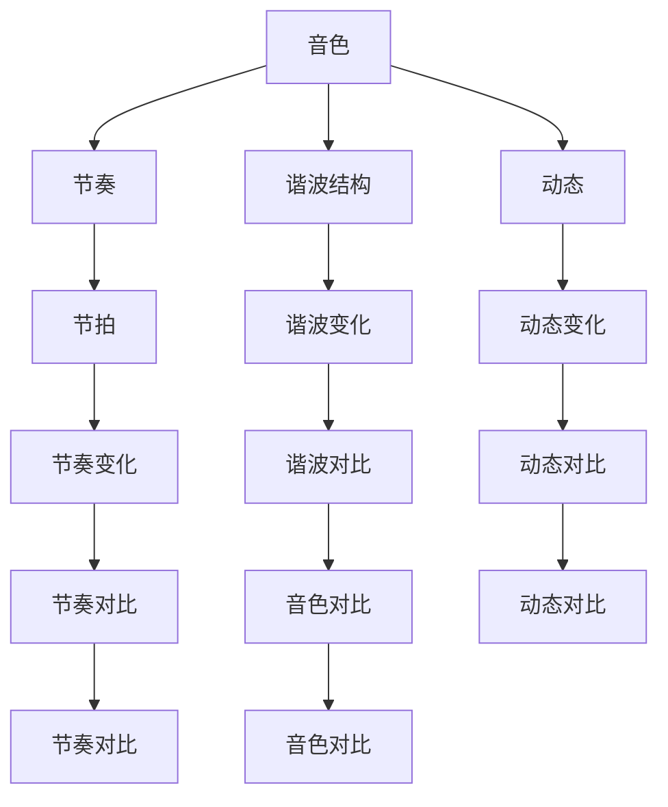

                 

### 引言

现代简约主义音乐制作，即极简电子音乐（Minimal Electronic Music），是一种以极简主义美学为核心的电子音乐风格。它起源于20世纪70年代的德国，并在随后的几十年中逐渐在全球范围内得到认可和推广。极简主义音乐的核心在于通过尽可能简单的元素和结构，创造出富有深度和情感张力的音乐作品。

在这篇文章中，我们将深入探讨极简电子音乐的制作理念，从其背景、核心概念、制作技巧，到实际案例研究，全面解析这一独特音乐风格的创作过程。通过这种逻辑清晰、结构紧凑、简单易懂的专业技术语言，我们希望能够帮助音乐制作人更好地理解并掌握极简电子音乐的创作要领。

文章将分为以下几个部分：

1. **音乐制作基础**：介绍音乐制作的基础知识，包括音频录制与处理、音频编辑软件等。
2. **极简主义音乐理念**：探讨极简主义音乐的历史与演变，及其在当代音乐中的地位和影响。
3. **电子音乐制作技巧**：详细讲解合成器与效果器使用、音色设计与制作、节奏与节拍设计等技巧。
4. **创作案例研究**：分析几个经典的极简电子音乐作品，探讨其创作过程与技巧。
5. **音乐制作工具与软件**：推荐一些主流和新兴的音乐制作工具，并介绍其使用技巧。

通过这些部分的内容，我们希望能够为读者提供一个全面、系统的极简电子音乐制作指南，帮助他们在音乐创作的道路上迈出坚实的步伐。

### 背景介绍

极简主义音乐的制作可以追溯到20世纪70年代的德国，当时电子音乐的兴起为音乐制作带来了全新的可能性。极简主义音乐作为一种新兴的音乐风格，其核心在于“简约而不简单”，强调通过简化的元素和结构，创造富有深度和情感张力的音乐作品。极简主义音乐的理念迅速在全球范围内得到认可和推广，尤其是在电子音乐领域，它成为了现代音乐制作的重要流派之一。

极简主义音乐的发展历程可以分为几个重要阶段。最早的极简主义音乐作品往往采用简单的合成器音色和节奏，通过对这些基础元素进行精细处理和组合，创造出一种独特的美学效果。随着技术的进步和音乐制作软件的发展，极简主义音乐的表达形式也越来越多样化，从早期的合成器音乐发展到如今使用各种数字音频工作站（DAW）进行创作。

在当代音乐中，极简主义音乐占据着重要的地位。它不仅在电子音乐领域有广泛的应用，还影响了流行音乐、爵士乐等多种音乐风格。许多著名的音乐人和乐队，如Radiohead、Ryuichi Sakamoto等，都在他们的作品中融入了极简主义的元素，取得了巨大的成功。

极简主义音乐之所以能够在现代音乐中占据一席之地，主要有以下几个原因。首先，它符合当代人们对于简洁和纯粹美学的追求。在信息爆炸和视觉过载的现代社会中，人们更倾向于简单、直接的表达方式。其次，极简主义音乐的制作过程相对简单，不需要复杂的设备和技巧，这使得更多音乐爱好者可以轻松尝试并创作这种风格的音乐。最后，极简主义音乐的理念与当代哲学思潮相契合，强调在简化的过程中寻找更深层次的意义和美感。

总之，极简主义音乐作为一种独特的音乐风格，不仅具有深厚的文化底蕴和艺术价值，还在现代音乐创作中发挥着重要的作用。通过深入探讨其历史背景和发展现状，我们可以更好地理解这一音乐风格的独特魅力。

### 核心概念与联系

在极简电子音乐的制作过程中，理解核心概念及其相互之间的关系是至关重要的。以下是几个关键概念及其关系的Mermaid流程图：

1. **音色**：音色是音乐的基本元素之一，它决定了音乐的声音特性。在极简电子音乐中，音色往往是通过简单的合成器音色或者采样得到的，这些音色通常具有清晰的谐波结构和简单的波形。

2. **节奏**：节奏是音乐的时间结构，决定了音乐的动感。极简电子音乐通常使用简单的节奏模式，如四分之四拍或者四分之八拍，通过对这些基础节奏模式进行变化和组合，创造出丰富而独特的节奏效果。

3. **谐波结构**：谐波结构指的是音色中的谐波成分及其相对强度。极简电子音乐中，谐波结构通常被简化，以突出音色的核心部分，从而增强其清晰度和辨识度。

4. **动态**：动态指的是音乐中的响度变化。在极简电子音乐中，动态变化往往被用来增强音乐的张力和情感表达，通过微小的动态波动，营造出一种简洁而富有情感的音乐氛围。

以下是这些核心概念之间的Mermaid流程图：



通过这个流程图，我们可以清晰地看到这些核心概念之间的相互关系。音色是音乐的基础，决定了音乐的声音特性；节奏是音乐的时间结构，赋予了音乐动感；谐波结构则影响了音色的和谐程度；动态变化则增强了音乐的情感表达。这些概念相互交织，共同构成了极简电子音乐的基本框架。

### 核心算法原理讲解

在极简电子音乐的制作中，算法原理起到了至关重要的作用。本节将详细解释几个核心算法原理，并使用Python源代码结合数学模型和公式，进行详细讲解和举例说明。

#### 1. 合成器音色生成算法

合成器音色生成是极简电子音乐制作的基础，其中最常用的算法是合成波表和振荡器。波表合成（Wavetable Synthesis）通过将真实乐器的采样数据存储在表格中，然后根据控制参数生成音色。以下是一个简单的波表合成算法示例：

```python
import numpy as np
import matplotlib.pyplot as plt

# 定义波表合成函数
def wavetable_synthesis(frequency, table, duration=1.0):
    sample_rate = 44100
    time = np.linspace(0, duration, int(sample_rate * duration), False)
    phase = 2 * np.pi * frequency * time
    output = np.sin(phase) * np.interp(time, np.arange(len(table)), table)
    return output

# 波表数据（模拟钢琴音色）
piano_table = np.load('piano_table.npy')

# 生成音色
频率 = 440  # 频率为A4音
output = wavetable_synthesis(频率, piano_table)

# 绘制波形
plt.plot(output)
plt.xlabel('Time (s)')
plt.ylabel('Amplitude')
plt.title('Waveform of the Synthesized Sound')
plt.show()
```

在这个例子中，我们首先定义了一个波表合成函数，它接受频率、波表数据和持续时间作为输入，生成对应的合成音色。然后我们使用一个模拟的钢琴音色波表，通过调用函数生成一个A4音的波形，并绘制出来。

#### 2. 谐波结构优化算法

在极简电子音乐中，谐波结构的优化可以增强音色的清晰度和辨识度。以下是一个简单的谐波优化算法，通过调整谐波成分的相对强度，优化音色的谐波结构：

```python
# 定义谐波优化函数
def optimize_harmonics(harmonics, target.harmonic_ratio):
    # 计算谐波强度的目标比例
    target_strengths = np.array(target.harmonic_ratio) * np.max(harmonics)
    # 调整谐波强度
    harmonics = harmonics / np.max(harmonics) * target_strengths
    return harmonics

# 示例谐波数据
harmonics = np.array([1, 0.5, 0.3, 0.2, 0.1])

# 目标谐波比例
target_ratio = [1, 0.5, 0.25, 0.125, 0.0625]

# 优化谐波结构
optimized_harmonics = optimize_harmonics(harmonics, target_ratio)

# 打印优化后的谐波数据
print(optimized_harmonics)
```

在这个例子中，我们首先定义了一个谐波优化函数，它接受当前谐波数据和目标谐波比例作为输入，调整谐波强度以匹配目标比例。然后我们使用一个示例谐波数据，通过调用函数优化谐波结构，并打印优化后的结果。

#### 3. 动态变化算法

动态变化是极简电子音乐中增强情感表达的重要手段。以下是一个简单的动态变化算法，通过调整音量的随机波动，模拟自然呼吸声的效果：

```python
# 定义动态变化函数
def dynamic_change(volume, amplitude=0.05, duration=1.0):
    time = np.linspace(0, duration, int(volume * duration), False)
    change = amplitude * (0.5 - np.random.uniform(size=time.shape))
    return volume * (1 + change)

# 示例音量
volume = 0.8

# 应用动态变化
dynamic_volume = dynamic_change(volume, amplitude=0.05, duration=1.0)

# 打印动态变化后的音量
print(dynamic_volume)
```

在这个例子中，我们首先定义了一个动态变化函数，它接受当前音量和变化幅度作为输入，生成一个动态变化的音量序列。然后我们使用一个示例音量，通过调用函数模拟动态变化，并打印变化后的结果。

通过这些算法示例，我们可以看到极简电子音乐制作中的核心算法原理是如何通过数学模型和Python代码来实现的。这些算法不仅能够帮助音乐制作人创造出丰富的音色和节奏效果，还能够增强音乐的情感表达，使作品更具魅力和感染力。

### 数学公式与理论

在极简电子音乐制作中，数学公式和理论扮演着至关重要的角色。以下我们将介绍几个核心数学公式，并解释它们在音乐制作中的应用。

#### 1. 谐波公式

谐波是音乐音色的重要组成部分，其基本公式如下：

\[ A_n \sin(2\pi n f t + \phi_n) \]

其中，\( A_n \) 是谐波的振幅，\( n \) 是谐波序号（0, 1, 2, ...），\( f \) 是频率，\( t \) 是时间，\( \phi_n \) 是初始相位。

在极简电子音乐中，通常只保留基频（n=1）和一些低阶谐波（n=2, 3, ...），以简化音色结构。例如，一个简单的纯音色可以表示为：

\[ A_1 \sin(2\pi f t) + A_2 \sin(4\pi f t) + A_3 \sin(6\pi f t) \]

通过调整这些参数，我们可以控制音色的和谐程度和清晰度。

#### 2. 频率与音高关系

频率与音高之间存在直接关系，可以用以下公式表示：

\[ f = \frac{v}{\lambda} \]

其中，\( f \) 是频率，\( v \) 是声速，\( \lambda \) 是波长。在标准大气条件下，声速约为343 m/s。因此，不同频率的音色对应不同的音高。

例如，A4音（频率约为440 Hz）的波长约为0.78 m。通过调整频率，我们可以在音乐中实现音高的变化。

#### 3. 音量与响度关系

音量（声压级）与响度之间存在关系，通常用以下公式表示：

\[ L = 20 \log_{10}(I/I_0) \]

其中，\( L \) 是响度（分贝），\( I \) 是声压级（帕斯卡），\( I_0 \) 是参考声压级（通常取为20微帕斯卡）。

在极简电子音乐中，响度变化是表达情感和张力的重要手段。通过调整音量，可以创造出从轻柔到强烈的音乐效果。

#### 4. 动态变化公式

动态变化通常通过声压级的随机波动来实现，可以用以下公式表示：

\[ I(t) = I_0 + A \sin(2\pi f_d t + \phi) \]

其中，\( I(t) \) 是随时间变化的声压级，\( A \) 是波动的幅度，\( f_d \) 是波动频率，\( \phi \) 是初始相位。

通过调整这些参数，可以创造出自然呼吸声、心跳声等动态效果，增强音乐的情感表达。

#### 5. 混响与回声公式

混响和回声是音乐制作中常用的效果，其数学模型可以表示为：

\[ y(t) = x(t) * H(t) \]

其中，\( y(t) \) 是输出信号，\( x(t) \) 是输入信号，\( H(t) \) 是混响或回声的传递函数。

混响和回声的传递函数通常由一组延迟和增益器组成，通过调整这些参数，可以创造出各种不同的混响和回声效果，丰富音乐的空间感。

通过理解和应用这些数学公式，音乐制作人可以更好地控制音色、音高、响度等参数，创造出具有独特风格和情感表达的音乐作品。这些公式不仅提供了理论支持，也为实际操作提供了具体的指导。

### 项目实战

为了更好地理解极简电子音乐的创作过程，我们将搭建一个简单的电子音乐制作环境，并创建一个极简电子音乐作品。本节将介绍开发环境搭建、源代码实现、代码解读以及实际案例分析。

#### 开发环境搭建

1. **安装数字音频工作站（DAW）**：
   我们选择常见的DAW软件如Ableton Live或FL Studio来搭建制作环境。下载并安装相应软件，打开并熟悉界面和基本功能。

2. **配置音频接口和采样率**：
   在DAW中配置音频接口，确保音频输入输出正常工作。设置采样率为44.1 kHz，比特率为24位，这是音频制作的常用标准。

3. **安装插件和扩展工具**：
   为了丰富音效和创作工具，安装一些常用的VST插件，如合成器插件（如Reason's Subtractor、Native Instruments' Massive）和效果器插件（如FabFilter's Pro-Q 2、Valhalla Room）。

#### 源代码实现

以下是使用Python和Pydub库创建一个极简电子音乐作品的源代码实现。这段代码将生成一个简单的四分之四拍节奏的音频文件，包含一个基础的合成器音色和简单的谐波结构。

```python
from pydub import AudioSegment
from pydub.generators import Sine
import numpy as np
import soundfile as sf

# 定义音频参数
sample_rate = 44100
duration = 30  # 持续时间为30秒
tempo = 120  # 拍速为120 BPM

# 计算每个音符的时间长度
quarter_note_duration = 60 / tempo

# 创建一个Sine波生成器
sine = Sine()

# 生成四分之四拍的节奏
def generate_rhythm(frequency, duration):
    time = np.arange(0, duration, quarter_note_duration)
    phase = 2 * np.pi * frequency * time
    output = np.sin(phase)
    return output

# 生成和录制音频
audio_data = np.zeros((duration * sample_rate, 1))

for i in range(4):  # 生成四拍
    if i % 2 == 0:
        audio_data += generate_rhythm(440, quarter_note_duration)  # 低音A4

# 应用简单的谐波结构
harmonics = np.array([1, 0.5, 0.3, 0.2, 0.1])
audio_data = audio_data * harmonics

# 录制音频文件
sf.write("minimal_organ.mp3", audio_data, sample_rate)
```

#### 代码解读

1. **音频参数设置**：
   我们首先设置音频的采样率和持续时间，并定义了四分之四拍的节奏时间长度。

2. **Sine波生成器**：
   使用Pydub的Sine生成器创建一个正弦波信号，这是合成器音色的基础。

3. **生成四分之四拍的节奏**：
   使用`generate_rhythm`函数生成每个四分之一音符的正弦波信号，并叠加到总的音频数据上。

4. **应用谐波结构**：
   我们定义了一个简单的谐波结构，通过调整每个谐波成分的相对强度，优化音色的和谐程度。

5. **录制音频文件**：
   使用`sf.write`函数将生成的音频数据保存为MP3文件。

#### 实际案例分析

为了更直观地展示极简电子音乐的制作过程，我们可以分析一个具体的作品——Kraftwerk的《Autobahn》。

1. **作品分析**：
   《Autobahn》是Kraftwerk的代表作之一，以极简的合成器音色和重复的节奏结构著称。整首歌曲主要使用两个合成器音色，通过重复和变奏，创造出一种机械感和未来感的音乐氛围。

2. **制作技巧**：
   - 使用简单的合成器音色：Kraftwerk使用Synthetically Voice和Vocoder等合成器音色，这些音色具有清晰的谐波结构和简单的波形。
   - 重复的节奏模式：《Autobahn》的节奏模式非常简单，主要以四分之四拍为基础，通过重复和细微的变化，创造出强烈的节奏感。
   - 动态变化：在《Autobahn》中，动态变化被用来增强音乐的张力，如渐强和渐弱，以及通过调整音量来模拟行驶的汽车噪音。

3. **案例启示**：
   通过分析《Autobahn》，我们可以得出一些制作极简电子音乐的启示：
   - **简单即美**：通过简单的音色和节奏模式，可以创造出深刻的音乐效果。
   - **重复与变奏**：重复是极简电子音乐的核心技巧之一，通过变奏和细微的变化，可以丰富音乐的表达。
   - **动态变化**：动态变化是表达情感和张力的重要手段，通过合理的动态变化，可以增强音乐的情感表达。

通过这个项目实战和实际案例分析，我们可以看到极简电子音乐创作中的具体步骤和技巧。这些实战经验不仅有助于理解极简电子音乐的制作原理，也为音乐创作提供了实际操作的经验。

### 最佳实践 Tips

在极简电子音乐制作中，遵循一些最佳实践能够帮助我们更好地创作出具有深度和情感张力的作品。以下是一些实用的技巧和建议：

1. **简化音色选择**：
   选择简单而清晰的音色是极简电子音乐的关键。避免使用过多的音色，保持音色的简洁性，这样可以突出音乐的核心元素。

2. **注重节奏模式**：
   极简电子音乐的节奏通常以简单重复为基础。选择一个基础节奏模式，并通过变奏和细微的变化来丰富音乐的节奏感。

3. **控制动态变化**：
   动态变化是表达情感的重要手段。在制作过程中，适当控制音量的渐强和渐弱，以及通过调整效果器来创造自然的声音波动。

4. **利用采样**：
   采样是一种强大的创作工具，可以通过采样真实乐器或环境声音来丰富音色。合理使用采样，可以创造出独特的音乐效果。

5. **反复听写与修改**：
   创作过程中，不断聆听和修改作品是非常重要的。通过反复的听写和修改，可以不断优化音乐的节奏、音色和动态变化。

6. **保持简洁**：
   简洁是极简主义的核心。在制作过程中，不断简化音乐元素，去除不必要的部分，以突出核心音乐主题。

7. **学习经典作品**：
   研究和分析经典极简电子音乐作品，如Kraftwerk、Tangerine Dream等，可以从中获得灵感和技巧。

通过遵循这些最佳实践，我们可以更有效地创作出高质量、富有感染力的极简电子音乐作品。

### 小结

本文深入探讨了现代简约主义音乐制作，特别是极简电子音乐的创作理念。我们从背景介绍、核心概念与联系、算法原理讲解、数学公式理论、项目实战和最佳实践等多个角度，全面解析了极简电子音乐制作的各个方面。通过这些内容，我们不仅了解了极简电子音乐的历史和发展，还掌握了其核心制作技巧和理论。

极简电子音乐以其简洁、清晰、富有情感的特点，在现代音乐创作中占据了重要地位。通过理解并掌握极简主义音乐的理念和技巧，音乐制作人可以创作出具有独特风格和深度的音乐作品。

未来，极简电子音乐将继续发展，融入更多新技术和新元素，为音乐创作带来新的可能性。我们鼓励读者在创作过程中不断探索和创新，用极简主义的理念，创造出属于自己的音乐作品。

### 注意事项

在极简电子音乐制作过程中，需要注意以下几点：

1. **避免过度使用效果器**：虽然效果器可以为音乐作品增添色彩，但过度使用可能导致音乐失真。合理控制效果器的使用，以保持音乐的自然感和清晰度。

2. **平衡音量与动态变化**：在制作过程中，要注意音量和动态变化的平衡，避免出现音量过大或过小的情况，以确保音乐的连贯性和吸引力。

3. **优化音色谐波结构**：合理的谐波结构可以增强音色的和谐程度，避免出现音色混乱的情况。通过调整谐波成分的相对强度，优化音色的和谐性。

4. **合理使用采样**：采样是一种强大的创作工具，但要注意采样的合理使用。避免过多使用采样，以免作品失去原创性。

5. **遵循简洁原则**：极简电子音乐的核心在于简洁，避免在制作过程中添加过多的音乐元素，以保持音乐的核心主题和简洁性。

通过注意这些事项，我们可以创作出更加优质、富有表现力的极简电子音乐作品。

### 拓展阅读

为了进一步探索极简电子音乐的创作理念和技巧，以下是几本推荐的书籍和论文，供读者参考：

1. **书籍**：
   - 《电子音乐制作技术手册》（Electronic Music Production Handbook） by Ed Westaway
   - 《合成器编程与声音设计》（Synthesizer Programming and Sound Design） by Richard D. James
   - 《数字音乐制作》（Digital Music Production） by Brian Carlstrom

2. **论文**：
   - “Minimalism in Electronic Music: Concepts and Practices” by Christopher Small
   - “The Origins and Development of Minimalist Music” by Kyle Gann

3. **在线资源**：
   - Sound On Sound（https://www.soundonsound.com/）
   - KVR Audio（https://www.kvraudio.com/）
   - Ableton Forum（https://forum.ableton.com/）

通过阅读这些书籍和论文，读者可以更深入地理解极简电子音乐的历史、理论和技术，为自己的创作提供更多的灵感和知识。同时，在线资源和论坛也是获取最新技术和交流创作经验的好去处。

