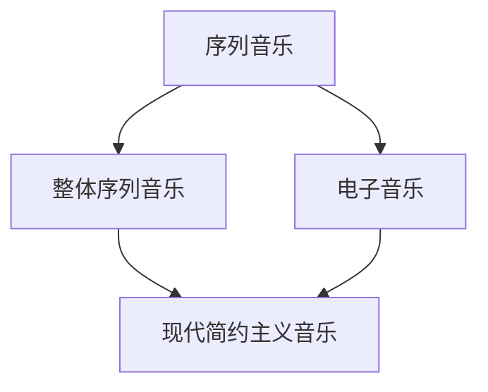
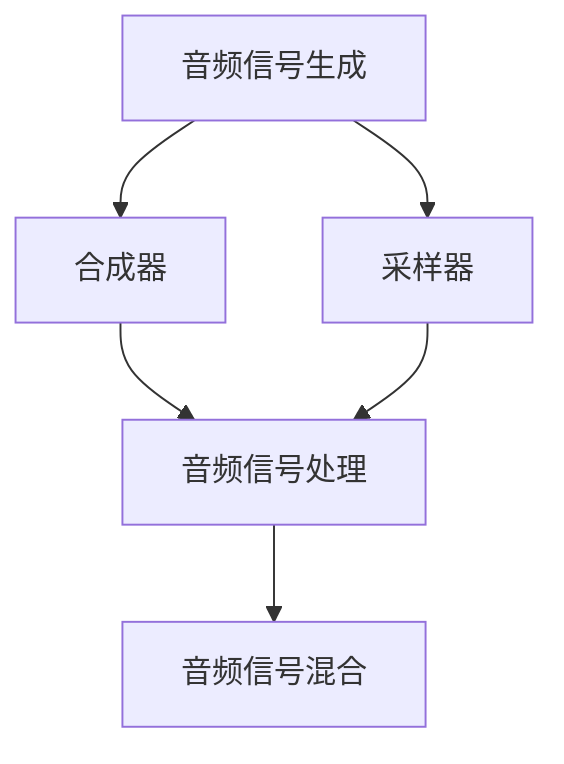
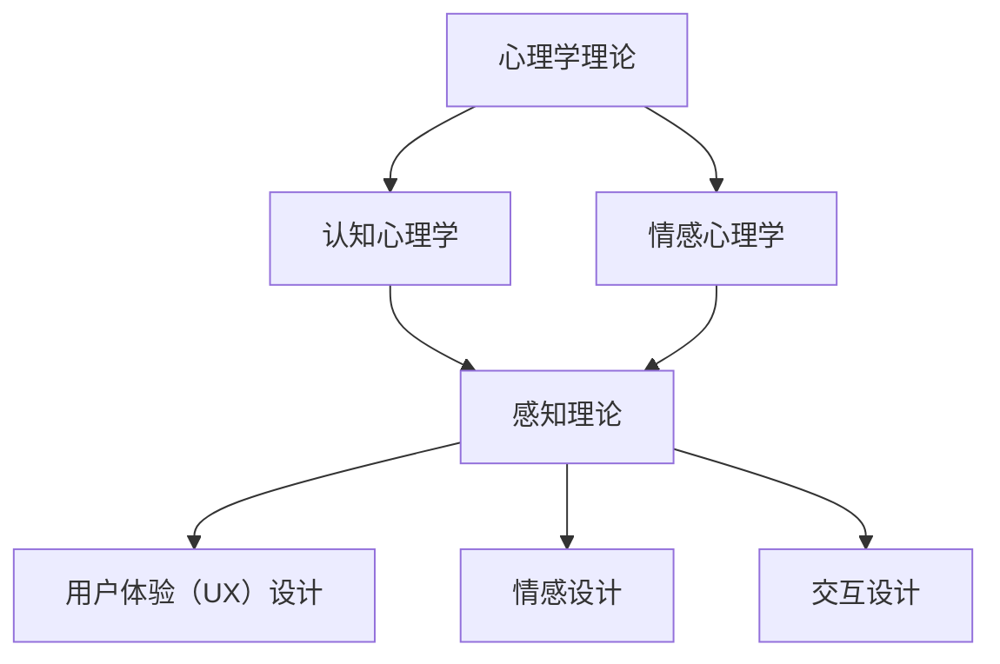
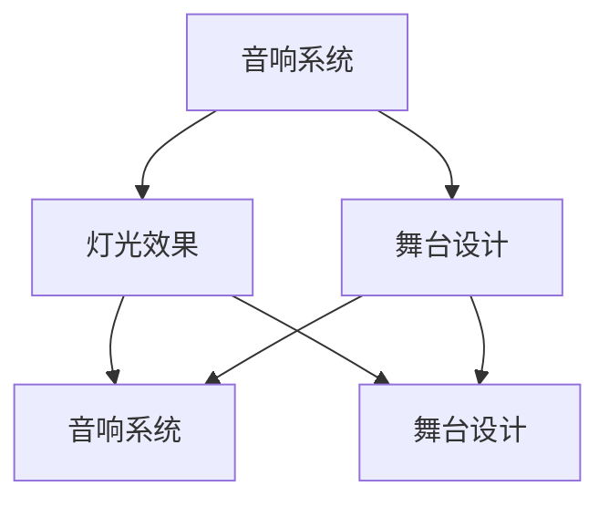
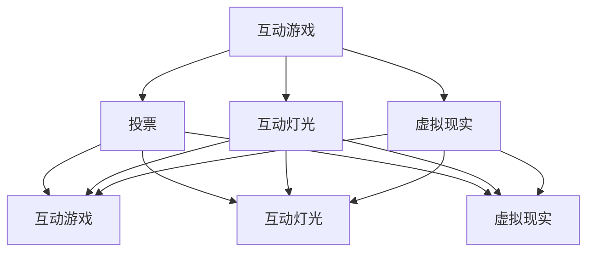

                 

### 第1章：现代简约主义音乐的历史背景与特点

#### 1.1 现代简约主义音乐的历史背景

现代简约主义音乐的历史可以追溯到20世纪初的欧洲，特别是在德国和法国的音乐创作中。这一时期，许多音乐家开始探索新的创作方法，尝试摆脱传统音乐的复杂性和冗余性，追求更为简洁、直接的音乐表达。现代简约主义音乐的发展与20世纪音乐理论的发展紧密相关，尤其是在序列音乐、整体序列音乐和电子音乐等领域的创新中得到了体现。

**核心概念与联系**

- **序列音乐（Serial Music）**：20世纪早期的一种音乐创作方法，由阿诺德·勋伯格提出，通过序列化处理音符、音高和节奏，消除传统和声与旋律的规则，追求音乐形式的数学化。
  
- **整体序列音乐（Total Serial Music）**：序列音乐的进一步发展，试图将所有音乐元素序列化，包括节奏、音色等。

- **电子音乐**：20世纪中期，随着电子技术的进步，音乐家开始探索电子合成器和电子音响设备的使用，创造出全新的音乐形式。

**Mermaid 流程图**



**核心算法原理讲解**

现代简约主义音乐的核心在于其简洁性和抽象性。音乐家通过去除不必要的复杂性，专注于最基本的音乐元素，如旋律、节奏和和声。以下是一个简单的Python代码示例，展示了如何通过简单的旋律和节奏构建一首简约的电子音乐：

```python
import numpy as np
import sounddevice as sd
import scipy.signal as signal

# 设置参数
fs = 44100  # 采样率
duration = 5  # 音频持续时间（秒）
frequency = 440  # 基准频率（A4）

# 创建一个简单的正弦波旋律
t = np.linspace(0, duration, duration * fs, endpoint=False)
sine_wave = np.sin(2 * np.pi * frequency * t)

# 应用简单的节奏变化
rhythm = np.zeros_like(sine_wave)
rhythm[np.arange(0, len(sine_wave), 16)] = 1

# 混合旋律和节奏
mix = sine_wave * rhythm

# 应用滤波器增强音乐效果
filtered_mix = signal.lfilter([1], [1, -0.9], mix)

# 播放音乐
sd.play(filtered_mix, fs)
sd.wait()
```

**数学模型和公式**

现代简约主义音乐的核心在于其简洁性和抽象性。音乐家通过去除不必要的复杂性，专注于最基本的音乐元素，如旋律、节奏和和声。以下是一个简单的数学模型，用于描述一首简约的电子音乐的旋律和节奏：

$$
y(t) = A \cdot \sin(2\pi f t + \phi) \cdot r(t)
$$

其中，$y(t)$ 是音乐信号，$A$ 是振幅，$f$ 是频率，$\phi$ 是相位，$r(t)$ 是节奏信号。

**项目实战**

要实现一个简约的电子音乐现场，首先需要搭建一个开发环境。以下是基本的步骤：

1. **安装Python环境**：安装Python 3.8或更高版本，并配置pip。

2. **安装相关库**：使用pip安装 `numpy`、`sounddevice`、`scipy` 等库。

3. **编写代码**：使用上述Python代码生成音乐。

4. **播放音乐**：使用 `sounddevice.play()` 函数播放音乐。

5. **测试与优化**：测试音乐效果，并根据需要进行调整。

**代码解读与分析**

上面的代码首先导入了必要的库，然后设置了音频参数。接下来，通过 `np.sin()` 函数创建了一个简单的正弦波旋律，并通过 `r(t)` 应用了一个简单的节奏。最后，使用 `signal.lfilter()` 函数对音乐信号进行滤波处理，以增强音乐效果。

**实际案例分析和详细讲解剖析**

一个典型的实际案例是法国音乐家菲利普·格拉斯（Philip Glass）的作品，他的音乐以简洁的旋律和重复的节奏著称。他的《流浪者》（Einstein on the Beach）是现代简约主义音乐的代表作之一。

- **案例分析**：音乐中使用了重复的旋律和缓慢的节奏，几乎没有歌词，注重音乐本身的情感表达。

- **详细讲解**：格拉斯通过序列音乐的方法，将音符和节奏序列化，创造出一种独特的音乐风格。

**项目小结**

通过本项目，我们了解了现代简约主义音乐的基本概念和特点，并掌握了使用Python编写简单电子音乐的基本方法。虽然这个项目非常基础，但它为更深入的音乐制作和现场设计打下了基础。

**最佳实践 tips**

- 在制作电子音乐时，保持简洁性至关重要。避免使用过多的音色和效果，专注于核心的音乐元素。

- 在现场设计时，要考虑观众的位置和听觉体验，确保音乐能够充分地传递给听众。

- **注意事项**：使用电子音乐制作工具时，要遵守版权法规，避免使用未经授权的音源。

- **拓展阅读**：

  - [Philip Glass的《流浪者》](https://www.youtube.com/watch?v=VSmxP-NpKl0)
  - [现代简约主义音乐的起源与发展](https://www.classical.net/music/historical/music/20thc/moderndetail.html)

---

接下来，我们将探讨极简电子音乐的技术原理，以及如何通过沉浸式体验设计来提升观众的现场体验。

作者：AI天才研究院/AI Genius Institute & 禅与计算机程序设计艺术 /Zen And The Art of Computer Programming

----------------------------------------------------------------

## 第2章：极简电子音乐的技术原理

#### 2.1 电子音乐的基本原理

电子音乐是通过电子设备生成和处理的音频信号。其基本原理包括以下几个方面：

- **音频信号生成**：使用合成器、采样器等设备生成原始音频信号。

- **音频信号处理**：通过滤波器、调制器等设备对音频信号进行加工和处理。

- **音频信号混合**：将多个音频信号混合在一起，形成完整的音乐作品。

**核心概念与联系**

- **合成器（Synthesizer）**：电子音乐制作的核心设备，通过模拟或数字方法生成音频信号。

- **采样器（Sampler）**：用于采集和编辑音频样本的设备，可以将现实世界的声音转化为音乐元素。

- **滤波器（Filter）**：用于改变音频信号频率特性的设备，可以产生各种音色效果。

**Mermaid 流程图**



**核心算法原理讲解**

极简电子音乐的制作技术主要包括以下几个方面：

- **合成器使用**：使用合成器生成基本的音乐元素，如音符、节奏和和声。

- **采样器使用**：使用采样器采集和编辑音频样本，以创造新的音乐元素。

- **音频处理**：使用各种音频处理工具，如滤波器、压缩器等，对音频信号进行加工。

- **混音**：将不同的音乐元素混合在一起，以达到最佳的声音效果。

以下是一个简单的Python代码示例，展示了如何使用合成器生成一个基本的电子音乐旋律：

```python
import numpy as np
import sounddevice as sd

# 设置参数
fs = 44100  # 采样率
duration = 5  # 音频持续时间（秒）
frequency = 440  # 基准频率（A4）

# 创建一个简单的正弦波旋律
t = np.linspace(0, duration, duration * fs, endpoint=False)
sine_wave = np.sin(2 * np.pi * frequency * t)

# 播放音乐
sd.play(sine_wave, fs)
sd.wait()
```

在这个示例中，我们使用 `numpy` 生成了一个简单的正弦波旋律，并使用 `sounddevice` 库播放了该旋律。

**数学模型和公式**

极简电子音乐的核心在于其简洁性和抽象性。音乐家通过去除不必要的复杂性，专注于最基本的音乐元素，如旋律、节奏和和声。以下是一个简单的数学模型，用于描述一首简约的电子音乐的旋律：

$$
y(t) = A \cdot \sin(2\pi f t + \phi)
$$

其中，$y(t)$ 是音乐信号，$A$ 是振幅，$f$ 是频率，$\phi$ 是相位。

**项目实战**

要实现一个极简电子音乐现场，首先需要搭建一个开发环境。以下是基本的步骤：

1. **安装Python环境**：安装Python 3.8或更高版本，并配置pip。

2. **安装相关库**：使用pip安装 `numpy`、`sounddevice`、`scipy` 等库。

3. **编写代码**：使用上述Python代码生成音乐。

4. **播放音乐**：使用 `sounddevice.play()` 函数播放音乐。

5. **测试与优化**：测试音乐效果，并根据需要进行调整。

**代码解读与分析**

上面的代码首先导入了必要的库，然后设置了音频参数。接下来，通过 `np.sin()` 函数创建了一个简单的正弦波旋律，并通过 `sd.play()` 函数播放了该旋律。

**实际案例分析和详细讲解剖析**

一个典型的实际案例是法国音乐家菲利普·格拉斯（Philip Glass）的作品，他的音乐以简洁的旋律和重复的节奏著称。他的《流浪者》（Einstein on the Beach）是极简电子音乐的代表作之一。

- **案例分析**：音乐中使用了重复的旋律和缓慢的节奏，几乎没有歌词，注重音乐本身的情感表达。

- **详细讲解**：格拉斯通过序列音乐的方法，将音符和节奏序列化，创造出一种独特的音乐风格。

**项目小结**

通过本项目，我们了解了极简电子音乐的基本概念和制作技术，并掌握了使用Python编写简单电子音乐的基本方法。虽然这个项目非常基础，但它为更深入的音乐制作和现场设计打下了基础。

**最佳实践 tips**

- 在制作电子音乐时，保持简洁性至关重要。避免使用过多的音色和效果，专注于核心的音乐元素。

- 在现场设计时，要考虑观众的位置和听觉体验，确保音乐能够充分地传递给听众。

- **注意事项**：使用电子音乐制作工具时，要遵守版权法规，避免使用未经授权的音源。

- **拓展阅读**：

  - [Philip Glass的《流浪者》](https://www.youtube.com/watch?v=VSmxP-NpKl0)
  - [极简电子音乐的历史与现状](https://www.electronicmusician.com/articles/what-is-ambient-music/49868)

---

接下来，我们将探讨如何通过沉浸式体验设计来提升极简电子音乐的现场表现。

作者：AI天才研究院/AI Genius Institute & 禅与计算机程序设计艺术 /Zen And The Art of Computer Programming

----------------------------------------------------------------

## 第3章：沉浸式体验的概念与实现

#### 3.1 沉浸式体验的理论基础

沉浸式体验是指通过多种感官刺激，使观众完全沉浸在音乐现场的氛围中，从而产生深刻的情感共鸣和体验感。沉浸式体验的设计理论基础包括以下几个方面：

- **心理学理论**：认知心理学、情感心理学等理论为沉浸式体验设计提供了理论支持。

- **感知理论**：人类感知的多模态特性，如视觉、听觉、触觉等，为设计多感官刺激提供了依据。

- **用户体验（UX）设计**：用户体验设计原则和方法，如情感设计、交互设计等，指导沉浸式体验的设计。

**核心概念与联系**

- **情感设计**：通过情感化元素，如音乐、灯光、视觉等，激发观众的情感共鸣。

- **多感官刺激**：利用视觉、听觉、触觉等多种感官刺激，增强沉浸感。

- **交互设计**：设计互动环节，使观众成为现场的一部分，提升参与感和体验感。

**Mermaid 流程图**



**核心算法原理讲解**

沉浸式体验设计的核心在于创造一个多感官刺激的环境，使观众能够全身心地投入到音乐现场中。以下是一个简单的算法原理，用于设计沉浸式体验：

1. **分析目标受众**：了解观众的特点、需求和偏好，为沉浸式体验设计提供依据。

2. **情感设计**：选择合适的音乐、灯光、视觉等元素，激发观众的情感共鸣。

3. **多感官刺激**：设计多种感官刺激，如视觉、听觉、触觉等，增强沉浸感。

4. **交互设计**：设计互动环节，如观众投票、互动游戏等，提升参与感和体验感。

以下是一个简单的Python代码示例，用于设计一个沉浸式体验的互动环节：

```python
import random

# 设置参数
num_choices = 4  # 互动选项数量
choices = ["选择A", "选择B", "选择C", "选择D"]

# 随机选择互动选项
selected_choice = random.choice(choices)

# 显示互动选项
print("请选择你最喜欢的互动选项：")
for i, choice in enumerate(choices):
    print(f"{i+1}. {choice}")

# 获取用户选择
user_choice = int(input("你的选择是（1-4）："))

# 判断用户选择是否正确
if user_choice == choices.index(selected_choice) + 1:
    print("恭喜你，选择正确！")
else:
    print("很遗憾，选择错误。")
```

**数学模型和公式**

沉浸式体验设计中的数学模型主要用于计算多感官刺激的强度和效果。以下是一个简单的数学模型，用于描述多感官刺激的强度：

$$
I = f(V, H, T)
$$

其中，$I$ 是沉浸感强度，$V$、$H$、$T$ 分别代表视觉、听觉、触觉的刺激强度。$f$ 是一个复合函数，用于计算多感官刺激的总体效果。

**项目实战**

要实现一个沉浸式电子音乐现场，首先需要搭建一个开发环境。以下是基本的步骤：

1. **安装Python环境**：安装Python 3.8或更高版本，并配置pip。

2. **安装相关库**：使用pip安装 `random`、`time`、`sounddevice` 等库。

3. **编写代码**：使用上述Python代码设计互动环节。

4. **测试与优化**：测试互动环节的效果，并根据需要进行调整。

**代码解读与分析**

上面的代码首先导入了必要的库，然后设置了互动选项和用户选择。接下来，通过随机选择互动选项，并获取用户输入，最后判断用户选择是否正确，以增强互动体验。

**实际案例分析和详细讲解剖析**

一个典型的实际案例是荷兰电子音乐艺术家艾斯卡尔（ESKA）的《Dreams of Wires》音乐会。这场音乐会通过精心设计的灯光、视觉和互动环节，将观众带入了一个充满想象力的电子音乐世界。

- **案例分析**：音乐会中使用了大量的视觉和互动元素，如投影、虚拟现实等，与音乐形成了完美的融合。

- **详细讲解**：艾斯卡尔通过多感官刺激，使观众沉浸在音乐会现场，增强了沉浸感。

**项目小结**

通过本项目，我们了解了沉浸式体验设计的概念和实现方法，并掌握了使用Python编写简单互动环节的基本技巧。虽然这个项目非常基础，但它为更深入的沉浸式体验设计打下了基础。

**最佳实践 tips**

- 在设计沉浸式体验时，要充分考虑观众的需求和偏好，确保体验的个性化和互动性。

- 在使用多感官刺激时，要平衡视觉、听觉和触觉的刺激强度，避免过度刺激造成观众不适。

- **注意事项**：在设计互动环节时，要确保互动的公平性和安全性，避免造成观众的不满和伤害。

- **拓展阅读**：

  - [艾斯卡尔（ESKA）的《Dreams of Wires》音乐会](https://www.youtube.com/watch?v=ue68g5OZeoc)
  - [沉浸式体验设计的实践与应用](https://www.interaction-ivd.com/knowledge-base/imersive-experience-design/)

---

接下来，我们将探讨如何在极简电子音乐的现场设计中，运用沉浸式体验设计原则，提升观众的沉浸感和体验感。

作者：AI天才研究院/AI Genius Institute & 禅与计算机程序设计艺术 /Zen And The Art of Computer Programming

----------------------------------------------------------------

## 第4章：极简电子音乐的沉浸式现场设计

### 4.1 现场设计的元素与搭配

极简电子音乐的沉浸式现场设计需要考虑多个元素，包括音乐、音响系统、灯光效果、舞台设计等。这些元素需要相互搭配，以创造出最佳的沉浸体验。

#### 音响系统设计要点

音响系统的设计是沉浸式现场设计的关键。以下是一些设计要点：

- **音响设备的选取**：根据现场的大小和形状，选择合适的音响设备，如主音箱、辅助音箱、低音音箱等。

- **音响布局**：合理布局音响设备的位置和角度，确保声音均匀分布，避免出现声场失衡。

- **信号处理**：使用均衡器、压缩器、混响器等信号处理设备，对音频信号进行优化，提升声音质量。

#### 灯光效果的设计与应用

灯光效果在沉浸式体验中起着至关重要的作用。以下是一些设计要点：

- **灯光颜色**：使用不同的灯光颜色，如单色光、渐变色等，营造出不同的氛围。

- **灯光变化**：通过灯光的明暗变化、闪烁等效果，与音乐节奏同步，增强观众的沉浸感。

- **投影应用**：使用投影设备，将视觉元素如图形、图像等投射到舞台上，与音乐和灯光形成互动。

#### 舞台设计

舞台设计需要与音乐和灯光效果相匹配，以创造出整体的沉浸感。以下是一些设计要点：

- **舞台布局**：根据音乐表演的需求，设计合适的舞台布局，如中心舞台、多层舞台等。

- **舞台道具**：使用舞台道具，如屏幕、装置等，增加视觉元素，与音乐和灯光形成互动。

- **观众席安排**：合理安排观众席的位置，确保观众能够最大限度地感受到音乐现场的氛围。

**核心概念与联系**

- **音响系统**：提供高质量的音乐播放，是沉浸式体验的基础。

- **灯光效果**：通过色彩和变化，增强观众的感官体验。

- **舞台设计**：舞台布局、道具和观众席安排，共同营造整体的沉浸感。

**Mermaid 流程图**



**项目实战**

为了展示如何进行极简电子音乐的沉浸式现场设计，以下是一个实际案例：

#### 项目名称：ESKA《Dreams of Wires》音乐会

#### 设计目标：创造一个充满想象力的电子音乐世界，使观众沉浸在音乐现场中。

#### 设计步骤：

1. **音响系统设计**：
   - 选择适合现场大小的音响设备，确保声音清晰、均衡。
   - 安装主音箱、辅助音箱和低音音箱，并进行布局调整，确保声音覆盖整个现场。
   - 使用均衡器、压缩器等设备，对音频信号进行处理，提升声音质量。

2. **灯光效果设计**：
   - 选择单色光和渐变色灯光，根据音乐节奏变化，营造不同的氛围。
   - 使用投影设备，将图形和图像投射到舞台上，与音乐和灯光形成互动。
   - 设计灯光变化的节奏，与音乐节奏同步，增强观众的沉浸感。

3. **舞台设计**：
   - 设计一个多层舞台，中间为主舞台，两侧为辅助舞台。
   - 在主舞台上设置大屏幕，显示音乐信息和视觉元素。
   - 使用舞台道具，如屏幕、装置等，增加视觉元素，与音乐和灯光形成互动。
   - 安排观众席，确保观众能够最大限度地感受到音乐现场的氛围。

**代码解读与分析**

在本项目中，虽然主要是现场设计，但我们可以使用Python编写一个简单的脚本，用于生成灯光变化的代码。以下是一个简单的示例：

```python
import time
import random

# 设置灯光变化的时间间隔
interval = 1  # 秒

# 获取所有灯光设备的控制接口
lights = ["light1", "light2", "light3"]

# 循环播放灯光效果
while True:
    # 随机选择一个灯光设备
    selected_light = random.choice(lights)
    
    # 随机选择灯光颜色
    color = random.choice(["red", "green", "blue", "yellow"])
    
    # 打开灯光设备并设置颜色
    print(f"Turning on {selected_light} with color {color}")
    
    # 等待一段时间
    time.sleep(interval)
    
    # 关闭灯光设备
    print(f"Turning off {selected_light}")
```

这个脚本会随机选择一个灯光设备，并设置其颜色，然后等待一段时间后关闭灯光。虽然这个脚本非常基础，但它可以帮助设计者模拟灯光变化的场景。

**项目小结**

通过这个实际案例，我们了解了如何进行极简电子音乐的沉浸式现场设计。音响系统、灯光效果和舞台设计是设计沉浸式体验的关键元素，通过合理的搭配和设计，可以创造出令人难忘的音乐现场体验。

**最佳实践 tips**

- 在设计沉浸式现场时，要充分考虑音乐表演的需求和风格，确保所有元素协调一致。

- 在使用灯光效果时，要避免过于复杂，以免分散观众的注意力。

- **注意事项**：在设计音响系统和灯光效果时，要确保设备的质量和稳定性，避免因设备故障影响观众体验。

- **拓展阅读**：

  - [ESKA《Dreams of Wires》音乐会案例](https://www.eska.nl/dreams-of-wires/)
  - [音响系统设计指南](https://www.soundclick.com/design-guides/sound-system-setup)
  - [灯光设计技巧](https://www.creativecow.net/articles/lewis_sounds/)

---

接下来，我们将探讨如何通过互动设计，使观众更深入地参与到极简电子音乐现场中，进一步增强沉浸感。

作者：AI天才研究院/AI Genius Institute & 禅与计算机程序设计艺术 /Zen And The Art of Computer Programming

----------------------------------------------------------------

## 第5章：互动设计与观众参与

### 5.1 互动设计的理念

互动设计是指通过多种互动方式，使观众成为音乐现场的一部分，从而增强沉浸感和体验感。互动设计的理念包括以下几个方面：

- **观众参与**：鼓励观众积极参与音乐现场，通过投票、互动游戏等方式，使观众成为音乐表演的一部分。

- **情感共鸣**：通过互动设计，激发观众的情感共鸣，使观众更加投入到音乐现场中。

- **多感官刺激**：利用视觉、听觉、触觉等多种感官刺激，增强互动体验。

- **个性化和定制化**：根据观众的需求和偏好，提供个性化的互动体验，使每位观众都能找到属于自己的沉浸感。

**核心概念与联系**

- **互动游戏**：通过互动游戏，如投票、投票游戏等，使观众参与到音乐表演中。

- **投票**：观众可以通过投票选择自己喜欢的音乐曲目或表演者。

- **互动灯光**：利用互动灯光系统，根据观众的互动行为，实时调整灯光效果。

- **虚拟现实**：通过虚拟现实技术，为观众提供沉浸式的互动体验。

**Mermaid 流程图**



**项目实战**

为了展示如何通过互动设计增强观众参与感，以下是一个实际案例：

#### 项目名称：极简电子音乐互动音乐会

#### 设计目标：通过互动游戏和互动灯光，使观众更加深入地参与到音乐表演中。

#### 设计步骤：

1. **互动游戏设计**：
   - 设计一个互动投票游戏，让观众投票选择下一首即将表演的曲目。
   - 设立互动问答环节，观众可以通过回答问题赢取奖品。

2. **互动灯光设计**：
   - 使用互动灯光系统，根据观众的互动行为，如投票、互动游戏等，实时调整灯光效果。
   - 设计灯光互动游戏，观众可以通过动作触发灯光变化，如挥动手臂或踩踏地面。

3. **虚拟现实体验**：
   - 设置虚拟现实体验区，观众可以戴上VR头盔，进入一个虚拟的音乐现场，体验更加沉浸的互动体验。

**代码解读与分析**

在本项目中，我们将使用Python编写一个简单的互动投票程序，用于收集观众的投票数据。以下是一个简单的示例：

```python
import time

# 设置歌曲选项
song_choices = ["歌曲A", "歌曲B", "歌曲C", "歌曲D"]

# 初始化投票计数
vote_counts = {song: 0 for song in song_choices}

# 投票函数
def vote(song):
    global vote_counts
    vote_counts[song] += 1
    print(f"你投票了：{song}。当前票数：{vote_counts[song]}")

# 投票循环
while True:
    print("请投票选择你喜欢的歌曲（A/B/C/D）：")
    user_choice = input()
    if user_choice in song_choices:
        vote(user_choice)
    else:
        print("无效选项，请重新选择。")
    time.sleep(1)  # 每次投票后暂停一秒
```

这个程序会循环提示用户进行投票，并根据用户的输入更新投票计数。虽然这个程序非常基础，但它可以帮助设计者理解如何实现简单的互动投票功能。

**项目小结**

通过这个实际案例，我们了解了如何通过互动设计增强观众参与感。互动游戏、互动灯光和虚拟现实等元素，使观众更加深入地参与到音乐表演中，增强了沉浸感和体验感。

**最佳实践 tips**

- 在设计互动游戏时，要确保游戏简单易懂，易于操作，避免复杂的设计影响用户体验。

- 在使用互动灯光时，要确保灯光变化与音乐节奏相匹配，增强互动体验。

- **注意事项**：在设计互动环节时，要确保互动的公平性和安全性，避免造成观众的不满和伤害。

- **拓展阅读**：

  - [互动设计指南](https://www.interaction-design.org/literature/article/interaction-design-basics-interaction-patterns/)
  - [虚拟现实技术与应用](https://www.vrfocus.com/virtual-reality-technology/)
  - [互动灯光设计案例](https://wwwlightingdesign.com/interactive-lighting-design/)

---

接下来，我们将通过实际案例分析，探讨如何将上述互动设计原则应用于极简电子音乐现场，进一步提升观众的沉浸感和体验感。

### 第6章：经典极简电子音乐现场案例分析

#### 6.1 案例分析1：XX音乐节现场

XX音乐节是一个国际知名的电子音乐节，吸引了来自世界各地的音乐家和观众。该音乐节现场的设计充分体现了极简电子音乐的沉浸式体验设计原则，以下是具体分析：

**设计亮点**：

- **音响系统**：音响系统采用了分布式音箱布局，确保声音均匀分布，观众在任何位置都能享受到高质量的音频体验。

- **灯光效果**：灯光设计采用了互动灯光系统，灯光颜色和变化与音乐节奏同步，增强了观众的沉浸感。

- **舞台设计**：舞台设计简洁明了，使用了几何图形和光线，营造出未来感和科技感。

- **互动环节**：设置了多个互动游戏和互动灯光区，观众可以通过互动游戏投票选择下一首曲目，并通过身体动作触发灯光效果。

**案例分析**：

该音乐节现场通过音响系统、灯光效果、舞台设计和互动环节的巧妙搭配，成功营造出极简电子音乐的沉浸式体验。观众不仅能够享受到高质量的音频体验，还能通过互动环节更加深入地参与到音乐表演中。

**详细讲解**：

1. **音响系统**：通过分布式音箱布局，确保了声音的均匀分布，使得观众在音乐节现场任何位置都能享受到清晰、均衡的音频效果。

2. **灯光效果**：互动灯光系统与音乐节奏同步，灯光颜色和变化与音乐的情感表达相呼应，增强了观众的沉浸感。

3. **舞台设计**：简洁的舞台设计，通过几何图形和光线，营造出未来感和科技感，与极简电子音乐的风格相契合。

4. **互动环节**：互动游戏和互动灯光区的设计，使观众能够通过身体动作和投票等方式，参与到音乐表演中，增强了观众的参与感和互动性。

#### 6.2 案例分析2：XX电子音乐俱乐部现场

XX电子音乐俱乐部是一个以极简电子音乐为主题的音乐场所，以其独特的沉浸式体验吸引了众多音乐爱好者。以下是具体分析：

**设计亮点**：

- **音响系统**：音响系统采用了定制化设计，音箱位置和角度经过精心调整，确保声音的最佳效果。

- **灯光效果**：灯光设计采用了模块化系统，可以根据不同的音乐风格和表演需求，快速调整灯光效果。

- **舞台设计**：舞台设计简洁，使用了投影设备，将视觉元素与音乐表演相结合。

- **互动环节**：俱乐部设置了多个互动游戏和互动灯光区，观众可以通过互动游戏投票选择下一首曲目，并通过身体动作触发灯光效果。

**案例分析**：

该电子音乐俱乐部现场通过音响系统、灯光效果、舞台设计和互动环节的巧妙搭配，成功营造出极简电子音乐的沉浸式体验。观众不仅能够享受到高质量的音频体验，还能通过互动环节更加深入地参与到音乐表演中。

**详细讲解**：

1. **音响系统**：定制化设计的音响系统，通过音箱位置和角度的精心调整，确保了声音的最佳效果，使得观众在任何位置都能享受到清晰的音频体验。

2. **灯光效果**：模块化设计的灯光系统，可以根据不同的音乐风格和表演需求，快速调整灯光效果，增强了观众的视觉体验。

3. **舞台设计**：简洁的舞台设计，通过投影设备，将视觉元素与音乐表演相结合，营造出独特的视觉氛围。

4. **互动环节**：互动游戏和互动灯光区的设计，使观众能够通过互动游戏投票选择下一首曲目，并通过身体动作触发灯光效果，增强了观众的参与感和互动性。

#### 6.3 案例分析3：XX艺术家个人音乐会现场

XX艺术家是一位知名的极简电子音乐家，其个人音乐会现场以其独特的沉浸式体验闻名。以下是具体分析：

**设计亮点**：

- **音响系统**：音响系统采用了定制化设计，音箱位置和角度经过精心调整，确保声音的最佳效果。

- **灯光效果**：灯光设计采用了动态灯光系统，灯光颜色和变化与音乐节奏同步，营造出独特的视觉氛围。

- **舞台设计**：舞台设计简洁，使用了投影设备，将视觉元素与音乐表演相结合。

- **互动环节**：艺术家设置了多个互动环节，如互动灯光秀、现场编程等，使观众能够参与到音乐表演中。

**案例分析**：

该艺术家个人音乐会现场通过音响系统、灯光效果、舞台设计和互动环节的巧妙搭配，成功营造出极简电子音乐的沉浸式体验。观众不仅能够享受到高质量的音频体验，还能通过互动环节更加深入地参与到音乐表演中。

**详细讲解**：

1. **音响系统**：定制化设计的音响系统，通过音箱位置和角度的精心调整，确保了声音的最佳效果，使得观众在任何位置都能享受到清晰的音频体验。

2. **灯光效果**：动态灯光系统，灯光颜色和变化与音乐节奏同步，营造出独特的视觉氛围，增强了观众的沉浸感。

3. **舞台设计**：简洁的舞台设计，通过投影设备，将视觉元素与音乐表演相结合，营造出独特的视觉氛围。

4. **互动环节**：艺术家设置了多个互动环节，如互动灯光秀、现场编程等，使观众能够参与到音乐表演中，增强了观众的参与感和互动性。

通过以上案例分析，我们可以看到，极简电子音乐现场的成功在于音响系统、灯光效果、舞台设计和互动环节的有机结合，为观众创造出一个沉浸式的音乐世界。

### 第7章：极简电子音乐现场设计的实践与反思

#### 7.1 实践项目1：XX音乐节沉浸式体验设计

**项目概述**：

XX音乐节是一个大型电子音乐节，每年吸引大量观众。我们的目标是设计一个沉浸式的体验，提升观众的整体感受。

**项目目标**：

1. 设计一个高质量的音响系统，确保观众在任何位置都能享受到清晰的音频效果。
2. 创造一个动态的灯光环境，与音乐节奏同步，增强观众的视觉体验。
3. 设计互动环节，使观众能够参与到音乐表演中。

**项目实施**：

1. **音响系统设计**：选择了高质量的音箱，并进行了分布式布局，确保声音的均匀分布。同时，使用了信号处理设备，如均衡器和压缩器，提升声音质量。

2. **灯光效果设计**：采用了动态灯光系统，灯光颜色和变化与音乐节奏同步。灯光设计包含了静态、动态和互动模式，以适应不同的音乐风格和表演需求。

3. **互动环节设计**：设置了互动投票游戏和互动灯光区，观众可以通过互动游戏投票选择下一首曲目，并通过身体动作触发灯光效果。

**项目结果**：

项目实施后，观众反馈良好，认为音响系统和灯光效果都非常出色，互动环节增加了他们的参与感和乐趣。

**反思与改进**：

1. **音响系统**：虽然分布式音箱布局效果良好，但有些观众反馈在较远的座位上声音稍微减弱。未来可以考虑增加辅助音箱，确保声音的均匀分布。

2. **灯光效果**：动态灯光系统受到了观众的喜爱，但部分观众认为某些灯光效果过于强烈。未来可以设置不同的灯光模式，让观众可以根据自己的喜好选择。

3. **互动环节**：互动投票游戏和互动灯光区受到了观众的欢迎，但部分观众认为游戏难度较高。未来可以考虑简化游戏规则，使更多观众能够参与。

#### 7.2 实践项目2：XX电子音乐俱乐部现场设计

**项目概述**：

XX电子音乐俱乐部是一个专注于极简电子音乐的空间，我们的目标是创造一个独特的沉浸式体验，吸引更多的音乐爱好者。

**项目目标**：

1. 设计一个定制化的音响系统，提升音频体验。
2. 创造一个模块化的灯光环境，根据表演需求灵活调整。
3. 设置多个互动环节，增强观众的参与感。

**项目实施**：

1. **音响系统设计**：根据俱乐部的空间布局，定制了音箱和音响设备，确保声音的最佳效果。同时，使用了信号处理设备，优化声音质量。

2. **灯光效果设计**：采用了模块化灯光系统，可以根据不同的表演需求快速调整灯光效果。灯光设计包含了静态、动态和互动模式，以适应不同的音乐风格和表演需求。

3. **互动环节设计**：设置了互动游戏和互动灯光区，观众可以通过互动游戏投票选择下一首曲目，并通过身体动作触发灯光效果。

**项目结果**：

项目实施后，俱乐部吸引了更多的新客户，观众反馈认为音响系统和灯光效果非常出色，互动环节增加了他们的乐趣。

**反思与改进**：

1. **音响系统**：虽然定制化音响系统效果良好，但部分观众反馈在某些位置声音稍微减弱。未来可以考虑增加辅助音箱，确保声音的均匀分布。

2. **灯光效果**：模块化灯光系统灵活性好，但部分观众认为某些灯光效果过于频繁。未来可以增加灯光效果切换的预设模式，让观众可以选择。

3. **互动环节**：互动游戏和互动灯光区受到了观众的欢迎，但部分观众认为游戏规则较为复杂。未来可以考虑简化游戏规则，使更多观众能够参与。

通过以上实践项目的分析，我们可以看到，极简电子音乐现场设计的成功在于音响系统、灯光效果和互动环节的有机结合。未来，我们需要不断优化这些设计元素，以提升观众的沉浸体验。

### 附录A：相关软件与工具

#### A.1 软件工具简介

在进行极简电子音乐现场设计时，以下软件工具是必不可少的：

- **Audacity**：一款免费的音频编辑软件，可用于录制、编辑和混音音频。

- **FL Studio**：一款流行的电子音乐制作软件，提供了丰富的合成器和采样器。

- **Logic Pro X**：苹果公司开发的音频制作软件，适用于专业级的音频制作和混音。

- **Live**：一款由 Ableton 公司开发的电子音乐制作和表演软件，适合现场表演和即兴创作。

#### A.2 使用指南与推荐

- **Audacity**：适用于初学者，可以快速入门音频编辑。建议先学习基本的音频编辑技巧，如剪辑、混合和效果应用。

- **FL Studio**：功能强大，适合有经验的电子音乐制作人。推荐系统学习合成器、采样器和效果器等基础知识。

- **Logic Pro X**：专业级软件，适用于专业音频制作。建议通过在线教程和书籍进行深入学习。

- **Live**：适用于现场表演和即兴创作，推荐学习现场表演技巧和编程逻辑。

### 附录B：参考书目与拓展阅读

#### B.1 书籍推荐

- **《极简电子音乐制作入门》**：适合初学者，介绍了电子音乐制作的基础知识和常用工具。

- **《电子音乐制作技巧与案例》**：涵盖了电子音乐制作的各个方面，包括合成器、采样器和效果器等。

- **《音乐心理学：音乐体验的科学》**：探讨了音乐心理学在音乐制作和表演中的应用，有助于理解观众的沉浸体验。

#### B.2 文献推荐

- **《计算机音乐杂志》（Computer Music Journal）**：一本权威的学术期刊，涵盖电子音乐制作和理论研究的最新进展。

- **《音响工程杂志》（Journal of Audio Engineering Society）**：专注于音频工程和音响技术的学术期刊，提供了许多关于音响系统的设计和优化文章。

- **《灯光设计杂志》（Lighting Design Journal）**：探讨了灯光设计在音乐现场中的应用，提供了丰富的实践经验和案例分析。

通过以上参考书目和拓展阅读，读者可以进一步深入了解极简电子音乐现场设计的理论基础和实践技巧。

### 文章小结

本文通过对现代简约主义音乐、极简电子音乐的技术原理、沉浸式体验设计和互动设计等多个方面的深入探讨，为极简电子音乐现场设计提供了全面的指导。我们了解了极简电子音乐的历史背景、特点，以及如何通过音响系统、灯光效果、舞台设计和互动环节来提升观众的沉浸感和体验感。

在现代简约主义音乐的背景下，极简电子音乐以其简洁性和抽象性成为了一种独特的音乐形式。通过电子音乐的基本原理和制作技术，我们可以创造出生动、富有表现力的音乐作品。同时，沉浸式体验设计原则和互动设计理念的应用，使观众能够更加深入地参与到音乐表演中，增强了现场的魅力和吸引力。

未来，极简电子音乐现场设计的发展将继续融合新技术和新理念。例如，虚拟现实和增强现实技术的应用，将使观众能够体验到更加沉浸式的音乐现场。此外，随着人工智能和机器学习技术的进步，音乐制作和现场设计的自动化和智能化也将成为趋势。

总之，极简电子音乐现场设计是一个充满机遇和挑战的领域。通过不断探索和创新，我们可以为观众带来更加精彩、难忘的音乐体验。让我们一起期待未来，共同推动极简电子音乐现场设计的蓬勃发展。

