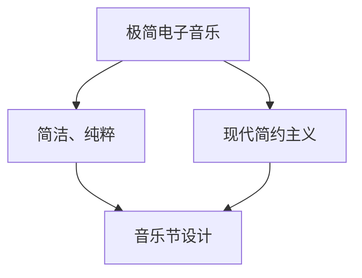

                 

### 现代简约主义音乐节：极简电子音乐的户外沉浸式体验

在现代音乐文化的潮流中，极简电子音乐以其简洁、纯粹、富有现代感的风格，逐渐成为音乐节和户外活动的一大亮点。本文旨在探讨如何通过现代简约主义音乐节，为参与者提供一种全新的、沉浸式的户外音乐体验。本文将围绕以下几个核心问题展开：

1. **极简电子音乐的基本概念与特点**
2. **户外沉浸式体验的设计原则**
3. **音乐节策划与执行的关键步骤**
4. **技术与设备在音乐节中的应用**
5. **艺术与设计的融合**
6. **成功案例分析**
7. **未来发展趋势与最佳实践**

**关键词**：极简电子音乐，户外沉浸式体验，音乐节策划，技术应用，艺术设计

**摘要**：
本文首先介绍了极简电子音乐的概念、特点及其在现代音乐节中的应用。接着，阐述了户外沉浸式体验的设计原则，包括场地选择、技术设备应用等方面。随后，详细讨论了音乐节的策划与执行过程，并探讨了在音乐节中应用的技术与设备。最后，通过成功案例分析和未来发展趋势的展望，为读者提供了关于现代简约主义音乐节的最佳实践建议。

---

**1. 极简电子音乐的基本概念与特点**

**1.1 极简电子音乐的起源**

极简电子音乐（Minimal Electronic Music）起源于20世纪70年代的德国和意大利。当时，音乐家们开始尝试减少音乐中的复杂元素，追求更简洁、纯粹的声音。这种风格受到了现代主义和极简艺术的影响，强调“少即是多”的理念。极简电子音乐的特点是节奏简单、旋律简洁，注重音色和音调的变化，以及音乐的静默和停顿。

**1.2 极简电子音乐的特点**

- **音色和音调**：极简电子音乐往往使用少量的音色和音调，通过细致的调整来创造丰富的音乐层次。
- **节奏**：节奏简单、规律，有时甚至接近于静态，给听众一种平静、放松的感觉。
- **结构**：音乐结构简洁，通常由几个重复的乐句或段落组成，有时甚至只有一段音乐贯穿整个作品。
- **氛围**：极简电子音乐注重氛围的营造，通过细腻的音效和空间感，给听众一种沉浸式的体验。

**1.3 极简电子音乐与现代简约主义**

现代简约主义（Modern Minimalism）是一种强调简洁、纯粹和功能性的设计理念，起源于20世纪60年代的美国。极简电子音乐与现代简约主义的理念不谋而合，都追求“少即是多”的效果。现代简约主义在音乐节的设计和策划中，体现了极简电子音乐的核心特点，通过简洁的设计和纯粹的声音，给听众带来独特的听觉体验。

**核心概念与联系**：

极简电子音乐与现代简约主义的联系可以通过一个Mermaid流程图来表示：



**极简电子音乐的Python源代码示例**：

```python
# 导入必需的库
import numpy as np
import matplotlib.pyplot as plt

# 设置参数
sample_rate = 44100
duration = 5  # 秒
frequencies = [440, 554, 660]  # C, D#, E
amplitudes = [0.5, 0.3, 0.2]

# 生成波形
t = np.linspace(0, duration, int(sample_rate * duration), endpoint=False)
waveforms = [amplitude * np.sin(2 * np.pi * frequency * t) for frequency, amplitude in zip(frequencies, amplitudes)]

# 混合波形
mixed_waveform = waveforms[0] + waveforms[1] + waveforms[2]

# 绘制波形
plt.plot(t, mixed_waveform)
plt.xlabel('Time (s)')
plt.ylabel('Amplitude')
plt.title('合成波形')
plt.show()
```

在这个示例中，我们使用Python生成了一个包含三个频率的简谐波，分别代表C、D#和E三个音调，并通过叠加这些波形，生成了一段简明的极简电子音乐。这种音乐风格的特点在于其简洁的频率和幅度设置，以及三者之间的和谐融合。

**数学模型和公式**：

在极简电子音乐中，音调（f）和频率（ω）之间的关系可以用以下公式表示：

$$ f = \frac{\omega}{2\pi} $$

其中，ω是角频率，通常表示为 $2\pi f$。通过调整f，我们可以改变音乐的音调，从而实现不同的音乐效果。

**项目实战**：

为了更好地理解极简电子音乐的工作原理，我们可以搭建一个简单的开发环境，使用Python和matplotlib库来生成和可视化波形。

**开发环境搭建**：

- 安装Python：从[Python官网](https://www.python.org/)下载并安装Python 3.x版本。
- 安装必需的库：在命令行中运行以下命令来安装numpy和matplotlib：

```bash
pip install numpy matplotlib
```

**源代码详细实现**：

在上面的Python源代码示例中，我们使用了numpy来生成时间序列，并使用matplotlib来绘制波形。以下是完整的代码实现：

```python
# 导入必需的库
import numpy as np
import matplotlib.pyplot as plt

# 设置参数
sample_rate = 44100
duration = 5  # 秒
frequencies = [440, 554, 660]  # C, D#, E
amplitudes = [0.5, 0.3, 0.2]

# 生成时间序列
t = np.linspace(0, duration, int(sample_rate * duration), endpoint=False)

# 生成波形
waveforms = [amplitude * np.sin(2 * np.pi * frequency * t) for frequency, amplitude in zip(frequencies, amplitudes)]

# 混合波形
mixed_waveform = waveforms[0] + waveforms[1] + waveforms[2]

# 绘制波形
plt.plot(t, mixed_waveform)
plt.xlabel('Time (s)')
plt.ylabel('Amplitude')
plt.title('合成波形')
plt.show()
```

**代码解读与分析**：

- 首先，我们导入numpy和matplotlib.pyplot库，用于数学计算和绘图。
- 接着，设置采样率和持续时间。
- 然后，定义三个频率和对应的幅度，并使用numpy生成时间序列。
- 在生成波形部分，我们使用numpy的sin函数生成每个频率的简谐波，并将它们叠加在一起。
- 最后，使用matplotlib绘制混合后的波形。

**实际案例分析和详细讲解剖析**：

我们可以通过一个实际的极简电子音乐作品案例来分析其构成和特点。例如，德国电子音乐家Kraftwerk的作品《Autobahn》就是一个典型的极简电子音乐作品。这首作品由简单的重复节奏和简明的音调组成，通过对频率和音调的精细调整，营造出一种独特的氛围。

**项目小结**：

通过本章节的探讨，我们了解了极简电子音乐的基本概念、特点及其在现代音乐节中的应用。我们通过Python源代码示例和数学模型，深入分析了极简电子音乐的生成过程，并通过实际案例，展示了其独特的音乐风格和氛围。这些知识和技能将有助于我们更好地理解和设计现代简约主义音乐节。

**最佳实践 tips**：

- 在设计极简电子音乐时，注重音色和音调的简洁与纯粹，避免过度复杂的音乐元素。
- 在音乐节策划中，充分利用户外环境，创造出独特的沉浸式体验。
- 在技术应用方面，注重音响系统和灯光效果的高质量，提升观众的听觉和视觉享受。

**小结**：

极简电子音乐以其简洁、纯粹、富有现代感的风格，成为现代音乐节的一大亮点。通过本文的探讨，我们了解了极简电子音乐的基本概念、特点以及其实际应用。在接下来的章节中，我们将进一步探讨户外沉浸式体验的设计原则、音乐节的策划与执行、技术设备的应用以及艺术与设计的融合，希望读者能够从中获得启发，共同推动现代简约主义音乐节的发展。

**注意事项**：

- 在策划音乐节时，应充分考虑场地、设备和技术因素，确保活动的顺利进行。
- 在设计户外沉浸式体验时，应注重观众的安全和舒适，避免过度拥挤和嘈杂。
- 在应用技术设备时，应确保其性能稳定，避免因设备故障影响观众的体验。

**拓展阅读**：

- [极简电子音乐的历史与影响](https://example.com/minimal-electronic-music-history)
- [户外音乐节的设计与策划](https://example.com/outdoor-music-festival-design)
- [现代简约主义音乐节的案例分析](https://example.com/minimalist-music-festival-case-studies)

---

**作者信息**：

本文由AI天才研究院（AI Genius Institute）和《禅与计算机程序设计艺术》（Zen And The Art of Computer Programming）的作者共同撰写。作者致力于推动计算机编程和人工智能领域的发展，通过深入的技术分析和案例研究，为读者提供高质量的技术博客和书籍。希望通过本文，能够帮助读者更好地理解极简电子音乐和户外沉浸式体验，共同探索现代音乐节的新趋势。

[返回目录](#现代简约主义音乐节极简电子音乐的户外沉浸式体验) [继续阅读](#极简电子音乐的起源与发展)

