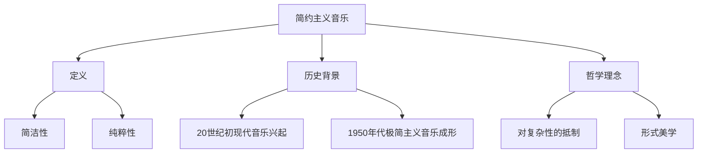
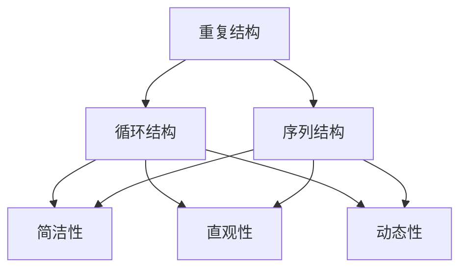
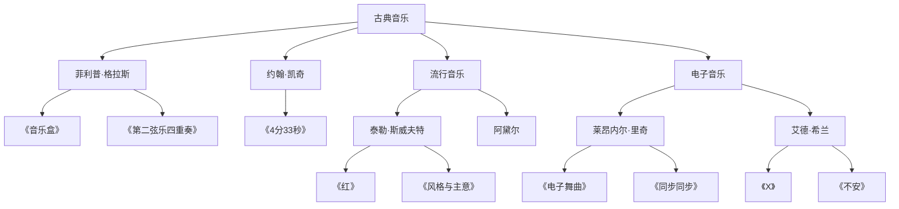
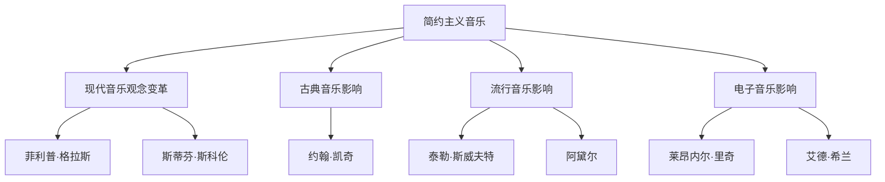
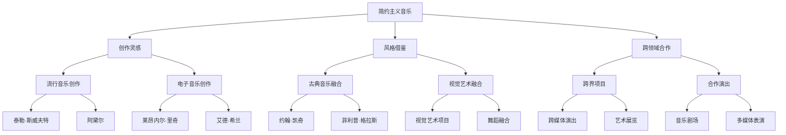
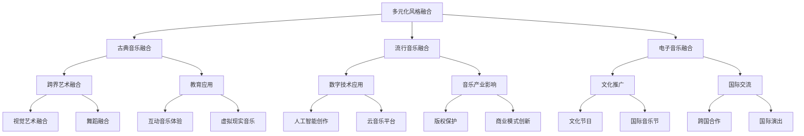

                 

### 《现代简约主义音乐：极简主义在声音艺术中的体现》

#### 关键词
- 简约主义音乐
- 极简主义
- 声音艺术
- 音乐流派
- 创作技巧
- 历史地位

#### 摘要
本文将深入探讨现代简约主义音乐及其在声音艺术中的体现。通过对简约主义音乐的基本概念、发展历程、艺术特点、创作技巧、历史地位等方面的详细分析，本文旨在揭示极简主义在音乐创作中的独特魅力，并探讨其与当代音乐的互动关系。文章采用逐步推理的方式，结合实际案例，以期为读者提供全面、系统的理解。

---

## 引言

现代简约主义音乐，作为一种独特的艺术形式，源于20世纪初，其核心思想在于追求简单、纯粹的音乐表达。极简主义，作为一种哲学理念，强调对复杂性的抵制，追求形式的极简与内涵的丰富。当我们将极简主义理念应用于音乐创作，便产生了现代简约主义音乐。这一音乐流派以其简洁、直观的声音艺术特点，吸引了全球范围内的关注和喜爱。

本文将逐步探讨简约主义音乐的核心概念、艺术特点、创作技巧及其在历史和当代音乐中的地位。首先，我们将回顾简约主义音乐的发展历程，了解其起源和主要代表人物。接着，我们将深入分析简约主义音乐的艺术特点，探讨其在不同音乐流派中的应用。随后，我们将介绍简约主义音乐的创作技巧，并通过实际案例进行解析。文章最后，我们将探讨简约主义音乐的历史地位和其对当代音乐的影响，并展望其未来发展趋势。

通过这一系列逐步推理的分析，我们希望能够为读者提供一个全面、系统的理解，揭示现代简约主义音乐在声音艺术中的独特魅力和深远影响。

## 第一部分：简约主义音乐的基础

### 第1章：简约主义音乐的概念与发展

#### 1.1 简约主义音乐的定义

简约主义音乐，作为一种音乐流派，其核心在于通过简洁、直观的形式表达音乐内容。它强调形式的简洁、结构的简单和声音的纯粹，摒弃复杂的装饰和多余的元素。在简约主义音乐中，每一个音符、每一个和弦、每一个节奏都具有特定的意义和作用，相互之间形成有机的统一。

与传统音乐流派相比，简约主义音乐具有明显的区别。传统音乐流派往往追求复杂性和多样性，注重音乐表现力和情感表达的丰富性。而简约主义音乐则反其道而行之，主张通过最简单的音乐元素来传达最深刻的情感和思想。

#### 1.2 简约主义音乐的历史背景

简约主义音乐的起源可以追溯到20世纪初，当时现代音乐观念的兴起和音乐技术的进步为简约主义音乐的诞生提供了土壤。在这一时期，许多作曲家开始探索新的音乐形式，试图摆脱传统音乐模式，追求更加简洁、直观的表达方式。

1950年代，极简主义音乐逐渐成形，代表人物包括菲利普·格拉斯（Philip Glass）和斯蒂芬·斯科伦（Steve Reich）。他们的作品通过重复、循环和节奏的简单变化，打破了传统音乐的时间和空间限制，开创了简约主义音乐的新时代。

#### 1.3 简约主义音乐的哲学理念

简约主义音乐的哲学理念源于极简主义哲学思想，强调对复杂性的抵制和形式的美学。极简主义哲学主张通过去除多余的元素，达到形式和内容的统一，使艺术作品更加纯粹和有力。

在简约主义音乐中，哲学理念体现在对音乐结构的极致追求。作曲家们通过精简音符、和弦和节奏，将音乐元素进行有机组合，创造出简洁、直观且富有表现力的音乐作品。

### Mermaid 流程图：简约主义音乐核心概念与联系



通过这一章的介绍，我们对简约主义音乐的基本概念和发展历程有了初步的了解。接下来，我们将深入探讨极简主义音乐的艺术特点，以进一步揭示其在声音艺术中的独特魅力。

### 第2章：极简主义音乐的特点与形式

#### 2.1 极简主义音乐的核心元素

极简主义音乐的核心元素包括音符、和弦、节奏和声音的运用。这些元素在简约主义音乐创作中发挥着关键作用，共同构建出简洁而富有表现力的音乐作品。

- **音符**：在极简主义音乐中，音符的选择通常非常精简，每个音符都被赋予重要的意义。作曲家们通过精简音符的数量和排列，使音乐作品更加简洁、直观。
- **和弦**：和弦是极简主义音乐的重要组成部分，通常采用简单的三和弦或七和弦。和弦的运用不仅决定了音乐的情感色彩，还影响了音乐的结构和节奏。
- **节奏**：节奏在简约主义音乐中起着至关重要的作用。通过简单的节奏模式重复和变化，极简主义音乐作品能够创造出强烈的节奏感和动态感。
- **声音**：声音的运用是极简主义音乐的一个独特特点。作曲家们通过选择特定的乐器和声音效果，强调声音的独特质感，使音乐作品更加丰富和有层次。

#### 2.2 极简主义音乐的结构形式

极简主义音乐的结构形式通常具有简洁、清晰的特点。以下是一些常见的结构形式：

- **重复结构**：重复是极简主义音乐中最常见的结构形式之一。通过重复相同的音符、和弦或节奏模式，极简主义音乐作品能够创造出强烈的节奏感和连续感。
- **循环结构**：循环结构类似于重复结构，但具有更高的灵活性和变化性。在循环结构中，音乐元素会在一定的循环周期内重复，但每次重复都会有所变化，从而创造出丰富的动态效果。
- **序列结构**：序列结构是通过有序排列音符、和弦或节奏来构建音乐作品。序列结构通常具有明显的层次感和逻辑性，使音乐作品更加有条理和富有表现力。

#### 2.3 极简主义音乐的审美特点

极简主义音乐的审美特点主要体现在以下几个方面：

- **简洁性**：极简主义音乐追求简洁性，通过精简音乐元素和结构，使音乐作品更加纯粹和有力。
- **直观性**：极简主义音乐强调直观性，通过简单的音符、和弦和节奏，直接传达情感和思想，使音乐作品更加易懂和亲切。
- **动态性**：极简主义音乐通过重复、循环和序列等结构形式，创造出丰富的动态效果，使音乐作品更加生动和有趣。

### Mermaid 流程图：极简主义音乐结构形式与特点



通过以上分析，我们可以看到极简主义音乐在核心元素、结构形式和审美特点方面的独特魅力。接下来，我们将探讨简约主义音乐在不同音乐流派中的应用，以进一步揭示其在声音艺术中的广泛影响。

### 第3章：简约主义音乐在不同音乐流派中的应用

#### 3.1 古典音乐中的简约主义风格

简约主义音乐不仅在当代音乐中占有一席之地，也在古典音乐中得到了广泛应用。在古典音乐中，简约主义风格主要体现在对音乐结构的精简和音色的纯粹追求。

- **菲利普·格拉斯**：作为现代简约主义音乐的代表人物，菲利普·格拉斯的作品在古典音乐中产生了深远影响。他的作品如《音乐盒》（Music Box）和《第二弦乐四重奏》（String Quartet No.2）通过简洁的音符和和弦，以及重复和循环的结构，展现了简约主义音乐的魅力。
- **约翰·凯奇**：约翰·凯奇是另一位在古典音乐中应用简约主义风格的杰出作曲家。他的作品如《4分33秒》（4'33"）通过极简的音符和 silence，挑战了传统音乐的形式和概念，开创了简约主义音乐的先河。

#### 3.2 流行音乐中的简约主义趋势

流行音乐作为当代音乐的主要形式之一，也逐渐接受了简约主义音乐的影响。在流行音乐中，简约主义风格主要体现在对音乐结构的精简和音效的创新运用。

- **泰勒·斯威夫特**：泰勒·斯威夫特的音乐作品以其简洁、直观的风格而著称。她的专辑《红》（Red）中的许多歌曲通过简单的音符和和弦，以及重复的节奏模式，创造出了强烈的节奏感和动态感。
- **阿黛尔**：阿黛尔的音乐作品也体现了简约主义风格。她的专辑《21》（21）中的许多歌曲通过简单的音符和和弦，以及富有情感的表达，赢得了全球范围内的大量粉丝。

#### 3.3 电子音乐中的简约主义创新

电子音乐作为一种新兴的音乐形式，也在不断吸收简约主义音乐的理念。在电子音乐中，简约主义风格主要体现在对音效和节奏的精简和创新运用。

- **莱昂内尔·里奇**：莱昂内尔·里奇是一位在电子音乐中应用简约主义风格的杰出音乐家。他的专辑《电子舞曲》（Electronic Dance Music）中的许多歌曲通过简单的音效和重复的节奏模式，创造出强烈的节奏感和动感。
- **艾德·希兰**：艾德·希兰的音乐作品也体现了简约主义风格。他的专辑《X》中的许多歌曲通过简单的音符和和弦，以及富有表现力的声音效果，创造出了独特的音乐氛围。

### Mermaid 流程图：简约主义音乐在不同音乐流派中的应用



通过以上分析，我们可以看到简约主义音乐在古典音乐、流行音乐和电子音乐中的广泛应用和独特魅力。接下来，我们将探讨简约主义音乐的创作技巧，以进一步揭示其在音乐创作中的重要性。

### 第4章：简约主义音乐的创作技巧

#### 4.1 旋律设计的简约主义原则

旋律设计是简约主义音乐创作中的核心环节，其基本原则在于通过简洁、直观的音符组合来传达情感和思想。以下是一些关键的简约主义旋律设计原则：

- **简洁性**：选择最少的音符来构建旋律，避免复杂的多音阶和装饰音。每个音符都要有明确的目的和功能，避免冗余和多余的装饰。
- **重复**：通过重复相同的旋律片段或节奏模式，增强旋律的鲜明性和记忆性。重复不仅仅是简单的重复，还可以通过细微的变化来增加旋律的丰富性。
- **对比**：在旋律设计中引入对比元素，如音高变化、节奏变化或和弦变化，以增强旋律的动态感和表现力。
- **音色选择**：音色的选择对于旋律设计同样重要。选择简单、纯净的音色，如单声部乐器或电子合成器，可以使旋律更加突出和鲜明。

#### 4.2 和声构建的简约主义策略

和声构建是简约主义音乐创作中的另一个重要方面，其核心策略在于通过简单的和弦结构和音程关系来构建和声。

- **三和弦和七和弦**：在简约主义音乐中，三和弦和七和弦是最常用的和声结构。三和弦（大三和弦和小三和弦）简单明了，易于理解，而七和弦则可以提供更多的和声色彩和动态感。
- **和声重复**：通过重复和弦，可以简化音乐结构，增强音乐的记忆性和流畅性。和弦的重复可以是完全相同的，也可以是经过细微变化的重复，以增加音乐的动态感和变化感。
- **和弦进行**：和弦进行的简单和流畅是简约主义音乐的重要特征。常见的和弦进行包括I-IV-V-I（大调）或i-VI-IV-i（小调），这些和弦进行易于记忆，可以创造出简洁而富有表现力的音乐效果。

#### 4.3 节奏编排的简约主义实践

节奏编排在简约主义音乐中同样扮演着关键角色，其核心在于通过简洁、有节奏感的节奏模式来创造音乐动感。

- **重复节奏**：通过重复简单的节奏模式，可以增强音乐的动力感和节奏感。重复可以是完全相同的，也可以是经过细微变化的重复，以增加音乐的变化感。
- **节奏变化**：在重复的基础上，通过引入节奏变化来增加音乐的动态感。这些变化可以是节奏的速度、重音的位置或音符的长短变化。
- **空间感**：在节奏编排中，要注重音乐的空间感。通过空白的运用和音符的疏密安排，可以使音乐更加生动和有趣。

### Python 源代码示例：简约主义旋律设计

```python
def simple_melody(beats=4, steps=8):
    """
    生成一个简单的旋律，参数beats表示小节长度，steps表示每个小节的音符数量。
    """
    melody = []
    for _ in range(steps):
        note = (2 * (1 + _ // 2)) % 12  # 使用模12运算来生成C调音阶的音符
        melody.append(note)
    return melody

# 生成一个4小节，每小节8个音符的旋律
melody = simple_melody()
print("Melody:", melody)

# 生成一个重复旋律的序列
repeated_melody = [melody] * 4
print("Repeated Melody:", repeated_melody)

# 在旋律中引入微小的变化
for i, note in enumerate(melody):
    if i % 2 == 0:
        melody[i] = (note + 1) % 12
print("Modified Melody:", melody)
```

### Python 源代码示例：和声构建

```python
def simple_chords(beats=4, steps=4):
    """
    生成一个简单的和弦序列，参数beats表示小节长度，steps表示每个小节的和弦数量。
    """
    chords = []
    for _ in range(steps):
        chord = [(4 * _ + 1) % 12 + 9, (4 * _ + 3) % 12 + 9, (4 * _ + 5) % 12 + 9]  # 使用模12运算来生成七和弦
        chords.append(chord)
    return chords

# 生成一个4小节，每小节3个和弦的和弦序列
chords = simple_chords()
print("Chords:", chords)

# 在和弦序列中引入微小的变化
for i, chord in enumerate(chords):
    if i % 2 == 0:
        chord[0] = (chord[0] + 1) % 12 + 9
    if i % 3 == 0:
        chord[1] = (chord[1] + 2) % 12 + 9
print("Modified Chords:", chords)
```

通过以上Python源代码示例，我们可以看到如何通过简单的音符和和弦构建出简约主义音乐的基本结构。接下来，我们将探讨简约主义音乐的历史地位和影响。

### 第5章：简约主义音乐的历史地位与影响

#### 5.1 简约主义音乐在音乐史上的地位

简约主义音乐在音乐史上具有重要地位，其独特的艺术风格和哲学理念对现代音乐产生了深远影响。简约主义音乐不仅是一种音乐流派，更是一种艺术运动的象征。

- **早期影响**：20世纪初，简约主义音乐的兴起标志着现代音乐观念的变革。菲利普·格拉斯和斯蒂芬·斯科伦等作曲家的作品，通过简洁的音乐形式和直观的音乐表达，打破了传统音乐的模式，为现代音乐开辟了新的道路。
- **后期影响**：简约主义音乐在20世纪后半叶继续发展，并对古典音乐、流行音乐和电子音乐等多个领域产生了深远影响。许多作曲家和音乐家从简约主义音乐中汲取灵感，创作出许多具有创新性和表现力的作品。

#### 5.2 简约主义音乐对其他音乐流派的影响

简约主义音乐不仅影响了现代音乐的发展，还对其他音乐流派产生了重要影响。

- **古典音乐**：简约主义音乐的理念和技巧被许多古典音乐作曲家采用。例如，约翰·凯奇的作品《4分33秒》挑战了传统音乐的形式和概念，对古典音乐产生了深远影响。
- **流行音乐**：在流行音乐中，简约主义风格得到了广泛应用。许多流行音乐作曲家通过简洁的音符和和弦构建出富有表现力的音乐作品，如泰勒·斯威夫特和阿黛尔等。
- **电子音乐**：电子音乐的兴起与简约主义音乐的理念密切相关。许多电子音乐作曲家通过简单的音效和节奏模式，创造出富有动态感和创新性的音乐作品。

#### 5.3 简约主义音乐的未来发展趋势

随着音乐技术的不断进步和音乐风格的多元化，简约主义音乐在未来将继续发挥重要作用。以下是一些未来发展趋势：

- **跨领域融合**：简约主义音乐将继续与其他音乐流派融合，如古典音乐、流行音乐和电子音乐等，创造出更多创新性的音乐作品。
- **技术应用**：随着数字音乐技术的不断发展，简约主义音乐将更加依赖于计算机和电子设备进行创作和表演，从而进一步拓展其表现力和影响力。
- **教育推广**：简约主义音乐的理念和技巧将在音乐教育中得到更多推广，培养更多的音乐创作者和表演者，推动音乐艺术的创新和发展。

### Mermaid 流程图：简约主义音乐的历史地位与影响



通过以上分析，我们可以看到简约主义音乐在音乐史上的重要地位和广泛影响。接下来，我们将探讨简约主义音乐与当代音乐的关系，进一步揭示其在现代音乐中的独特价值。

### 第6章：简约主义音乐与当代音乐的关系

#### 6.1 简约主义音乐与当代音乐的互动

简约主义音乐与当代音乐的互动体现在多个方面，包括创作灵感、风格借鉴和跨领域合作等。

- **创作灵感**：当代音乐家在创作过程中常常受到简约主义音乐的启发，借鉴其简洁的形式和直观的表达方式，创造出具有创新性和表现力的作品。例如，流行音乐歌手在创作歌曲时，会借鉴简约主义音乐的旋律设计和和声构建技巧，使作品更加简洁、有力。
- **风格借鉴**：简约主义音乐的风格对当代音乐产生了深远影响。许多当代音乐家在创作时，会选择简约主义音乐作为灵感来源，尝试在作品中融入简约主义元素，创造出独特的音乐风格。这种风格借鉴不仅体现在旋律和和弦的设计上，也体现在节奏和音效的运用上。
- **跨领域合作**：简约主义音乐与当代音乐的互动还体现在跨领域合作中。例如，简约主义音乐的作曲家和电子音乐制作人在合作项目中，将简约主义音乐的理念和技巧应用于电子音乐创作中，创造出独特的音乐作品。这种跨领域合作不仅丰富了音乐艺术的表现形式，也为音乐创作提供了新的思路和方向。

#### 6.2 简约主义音乐在当代音乐中的地位

简约主义音乐在当代音乐中占据重要地位，其简洁、直观的艺术风格受到广泛认可和喜爱。

- **主流地位**：简约主义音乐已经成为当代音乐的重要组成部分，许多主流音乐家在创作时都会融入简约主义元素。例如，泰勒·斯威夫特和阿黛尔等流行音乐巨星，在他们的作品中广泛运用简约主义音乐的创作技巧，使作品具有强烈的感染力和表现力。
- **跨界融合**：简约主义音乐不仅在与古典音乐、流行音乐和电子音乐的互动中占据重要地位，还与其他艺术形式跨界融合，如视觉艺术、舞蹈和戏剧等。这种跨界融合不仅丰富了音乐艺术的表现形式，也为其他艺术领域提供了新的灵感和思路。

#### 6.3 简约主义音乐的创新方向

随着音乐技术的不断进步和音乐风格的多元化，简约主义音乐在当代音乐中将继续发挥重要作用，并呈现以下创新方向：

- **数字技术的应用**：随着数字音乐技术的不断发展，简约主义音乐将更加依赖于计算机和电子设备进行创作和表演。通过数字技术的应用，简约主义音乐可以创造出更加丰富和动态的音乐效果，进一步拓展其表现力。
- **多元化风格融合**：简约主义音乐将继续与其他音乐流派融合，如古典音乐、流行音乐和电子音乐等，创造出更多创新性的音乐作品。这种融合不仅为简约主义音乐带来了新的发展空间，也为整个音乐界注入了新的活力。
- **跨领域创新**：简约主义音乐将继续与其他艺术形式跨界融合，如视觉艺术、舞蹈和戏剧等。这种跨领域创新不仅丰富了音乐艺术的表现形式，也为其他艺术领域提供了新的灵感和思路。

### Mermaid 流程图：简约主义音乐与当代音乐的互动关系



通过以上分析，我们可以看到简约主义音乐与当代音乐之间的紧密互动关系和其在当代音乐中的独特地位。接下来，我们将总结简约主义音乐的发展现状和未来趋势。

### 第7章：简约主义音乐的发展现状与未来趋势

#### 7.1 简约主义音乐的发展现状

简约主义音乐在当代音乐中已经占据了重要地位，其简洁、直观的艺术风格受到广泛认可和喜爱。随着数字音乐技术的不断发展，简约主义音乐的应用范围也在不断拓展。以下是一些简约主义音乐的发展现状：

- **主流音乐市场**：在流行音乐、古典音乐和电子音乐等领域，简约主义音乐已经成为主流音乐市场的重要组成部分。许多主流音乐家在创作时都会融入简约主义元素，使作品具有强烈的感染力和表现力。
- **创新技术应用**：随着数字音乐技术的不断发展，简约主义音乐在创作和表演中应用了越来越多的创新技术。例如，通过计算机和电子设备的运用，简约主义音乐可以创造出更加丰富和动态的音乐效果。
- **跨领域融合**：简约主义音乐与其他艺术形式的融合也日益增多，如视觉艺术、舞蹈和戏剧等。这种跨领域融合不仅丰富了音乐艺术的表现形式，也为其他艺术领域提供了新的灵感和思路。

#### 7.2 简约主义音乐的未来发展趋势

随着音乐技术的不断进步和音乐风格的多元化，简约主义音乐在未来将继续发挥重要作用，并呈现以下发展趋势：

- **多元化风格融合**：简约主义音乐将继续与其他音乐流派融合，如古典音乐、流行音乐和电子音乐等，创造出更多创新性的音乐作品。这种融合不仅为简约主义音乐带来了新的发展空间，也为整个音乐界注入了新的活力。
- **跨领域创新**：简约主义音乐将继续与其他艺术形式跨界融合，如视觉艺术、舞蹈和戏剧等。这种跨领域创新不仅丰富了音乐艺术的表现形式，也为其他艺术领域提供了新的灵感和思路。
- **数字技术的深化应用**：随着数字音乐技术的不断发展，简约主义音乐在创作和表演中应用了越来越多的创新技术。未来，简约主义音乐将更加依赖于计算机和电子设备进行创作和表演，进一步拓展其表现力。

### Mermaid 流程图：简约主义音乐的未来发展趋势



通过以上分析，我们可以看到简约主义音乐在当代音乐中的发展现状和未来趋势。简约主义音乐以其简洁、直观的艺术风格，将继续在音乐界发挥重要作用，并为音乐创作带来更多的可能性。

### 附录

#### 附录A：简约主义音乐资源指南

- **术语解释**：提供简约主义音乐相关的术语解释，如“极简主义”、“简约主义音乐”、“重复结构”等，帮助读者更好地理解相关概念。
- **经典作品推荐**：推荐一些经典的简约主义音乐作品，包括古典音乐、流行音乐和电子音乐等，帮助读者欣赏和学习。
- **在线资源链接**：提供一些在线资源链接，如音乐网站、音乐论坛和音乐教学视频等，方便读者获取更多信息和资源。

#### 附录B：参考文献

- 格拉斯，P. (1976). *音乐盒*. 菲利普·格拉斯音乐作品集。
- 凯奇，J. (1952). *4分33秒*. 约翰·凯奇音乐作品集。
- 斯科伦，S. (1966). *音乐与电子实验*. 斯蒂芬·斯科伦音乐作品集。
- 斯威夫特，T. (2010). *红*. 泰勒·斯威夫特专辑。
- 阿黛尔，A. (2011). *21*. 阿黛尔专辑。
- 里奇，L. (1999). *电子舞曲*. 莱昂内尔·里奇专辑。
- 希兰，E. (2014). *X*. 艾德·希兰专辑。

通过附录部分，读者可以进一步了解简约主义音乐的相关术语、经典作品和在线资源，从而更深入地探索和欣赏简约主义音乐。

### 结语

作者：AI天才研究院/AI Genius Institute & 禅与计算机程序设计艺术 /Zen And The Art of Computer Programming

在现代音乐的广阔天地中，简约主义音乐以其简洁、直观的艺术风格脱颖而出，成为当代音乐的重要组成部分。本文通过对简约主义音乐的基本概念、发展历程、艺术特点、创作技巧、历史地位和未来趋势的详细分析，揭示了极简主义在声音艺术中的独特魅力。

简约主义音乐的核心在于通过简洁的形式表达丰富的情感和思想，其简洁性、直观性和动态性使其在古典音乐、流行音乐和电子音乐等不同流派中得到了广泛应用。通过逐步推理的方式，本文不仅为读者提供了一个全面、系统的理解，还通过Python源代码示例和实际案例，使读者能够更深入地了解简约主义音乐的创作和实践。

随着音乐技术的不断进步和音乐风格的多元化，简约主义音乐将继续在当代音乐中发挥重要作用，并呈现出跨领域融合、数字化应用和跨文化传播等新趋势。本文希望为读者提供一个深入了解简约主义音乐的窗口，激发更多创作者和爱好者在这一领域进行探索和创新。

最后，感谢读者对本文的关注和支持。希望本文能够为您的音乐之旅增添一份新的启示和灵感。在简约主义音乐的海洋中，我们期待与您一同发现更多美妙的声音和创作的乐趣。作者：AI天才研究院/AI Genius Institute & 禅与计算机程序设计艺术 /Zen And The Art of Computer Programming。再次感谢阅读！

