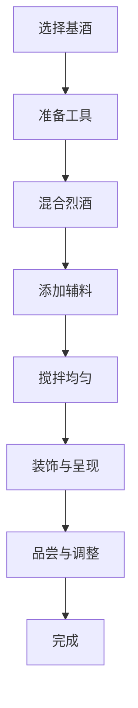

                 

## 《现代简约主义鸡尾酒学院：回归本质的调酒师培训课程》

### 关键词

- 鸡尾酒制作
- 简约主义
- 调酒师培训
- 制作技巧
- 鸡尾酒文化

### 摘要

《现代简约主义鸡尾酒学院：回归本质的调酒师培训课程》是一本致力于培养专业调酒师的新时代读物。本书以简约主义为设计哲学，专注于鸡尾酒制作的基本原理和实践技巧。通过系统的理论讲解和丰富的实战案例，读者能够深入理解鸡尾酒的历史、文化和制作流程，从而提升调酒技能，创造独具特色的鸡尾酒作品。本书适合调酒师、酒吧爱好者以及任何对鸡尾酒制作感兴趣的人群。

---

### 背景介绍

鸡尾酒作为一种饮品，其历史可以追溯到18世纪的英国。最早的鸡尾酒是将不同的烈酒混合在一起，以提升口感和风味。随着时间的推移，鸡尾酒的种类和制作技巧不断丰富，逐渐演变成为一种文化象征。进入21世纪，随着生活方式的变革和审美趋势的演变，简约主义逐渐成为鸡尾酒设计的新方向。简约主义追求的是“少即是多”，通过简洁的线条和纯粹的色彩，展现最本质的美感。这种设计哲学在鸡尾酒制作中体现为简化的配方和精简的步骤，使得鸡尾酒更加易制作且风味独特。

调酒师作为这个行业的核心人物，其技艺和创意直接影响鸡尾酒的质量和顾客的体验。现代调酒师不仅需要熟练的调酒技巧，还需要具备深厚的酒类知识和对潮流的敏感度。然而，传统的调酒师培训课程往往过于繁琐，难以适应现代快节奏的生活方式。因此，本书旨在提供一种简洁而高效的调酒师培训课程，帮助读者快速掌握鸡尾酒制作的精髓。

### 核心概念与联系

为了更好地理解鸡尾酒制作的基本流程和关键步骤，我们可以通过一个Mermaid流程图来展示这些核心概念及其之间的关系。



上述流程图概括了鸡尾酒制作的基本步骤，包括选择基酒、准备工具、混合烈酒、添加辅料、搅拌均匀、装饰与呈现、品尝与调整以及完成。每个步骤都是制作鸡尾酒过程中不可或缺的一环，通过这个流程图，我们可以清晰地看到整个制作过程的结构和逻辑关系。

### 核心算法原理讲解

在鸡尾酒制作中，核心算法主要涉及混合和搅拌的技巧。以下将使用Python伪代码来详细阐述这些关键步骤，并结合数学模型和公式进行解释。

```python
# 选择基酒
def select_base_liquor(type):
    base_liquors = {
        "gin": "杜松子酒",
        "vodka": "伏特加",
        "rum": "朗姆酒",
        "whiskey": "威士忌"
    }
    return base_liquors[type]

# 混合烈酒
def mix_liquors(base_liquor, quantity):
    mix_formula = {
        "gin": 50,
        "vodka": 50,
        "rum": 50,
        "whiskey": 50
    }
    total_volume = mix_formula[base_liquor] * quantity
    return total_volume

# 添加辅料
def add_wetting_agents(base_liquor, wetting_agents, quantity):
    wetting_agents_formulation = {
        "gin": ["柠檬汁", "糖浆"],
        "vodka": ["蓝橙汁", "苏打水"],
        "rum": ["椰子汁", "菠萝汁"],
        "whiskey": ["焦糖", "肉桂"]
    }
    total_volume = mix_liquors(base_liquor, quantity)
    for agent in wetting_agents:
        if agent in wetting_agents_formulation[base_liquor]:
            total_volume += quantity  # 假设辅料与基酒体积相同
    return total_volume

# 搅拌与混合技巧
def mix_liquors_stepwise(liquor_list, total_volume):
    mixing_rate = 1  # 假设每秒混合一定比例的酒液
    mixing_time = total_volume / mixing_rate
    print(f"需要混合 {total_volume} 毫升酒液，预计需要 {mixing_time} 秒。")
    for _ in range(int(mixing_time)):
        print("进行搅拌...")

# 示例
base_liquor = select_base_liquor("gin")
base_volume = mix_liquors(base_liquor, 100)
wetting_agents = ["柠檬汁", "糖浆"]
total_volume = add_wetting_agents(base_liquor, wetting_agents, 100)
mix_liquors_stepwise(liquor_list=["杜松子酒", "柠檬汁", "糖浆"], total_volume=total_volume)
```

在上述代码中，我们首先定义了选择基酒、混合烈酒和添加辅料的函数。每个函数都对应鸡尾酒制作中的一个关键步骤。例如，`select_base_liquor` 函数用于选择基酒类型，`mix_liquors` 函数用于计算混合后的总体积，`add_wetting_agents` 函数则用于添加辅料。

接下来，我们通过`mix_liquors_stepwise` 函数模拟搅拌和混合的过程。这个函数中，我们使用一个简单的数学模型来计算搅拌所需的时间，并打印出搅拌进度。这里假设搅拌速率是一个固定值，实际操作中可以根据具体情况调整。

下面是一个具体的例子，展示了如何使用这些函数来制作一份经典的“杜松子酒酸”（Gin and Tonic）：

```python
base_liquor = select_base_liquor("gin")
base_volume = mix_liquors(base_liquor, 100)
wetting_agents = ["柠檬汁", "糖浆"]
total_volume = add_wetting_agents(base_liquor, wetting_agents, 100)
mix_liquors_stepwise(liquor_list=["杜松子酒", "柠檬汁", "糖浆"], total_volume=total_volume)
```

运行这段代码，我们将得到一份体积为100毫升的杜松子酒酸，其中包含了适当的柠檬汁和糖浆。通过这种方式，读者可以更直观地理解鸡尾酒制作中的关键步骤和算法原理。

### 数学模型和公式

在鸡尾酒制作中，数学模型和公式用于计算不同成分的体积比例、酒精浓度等。以下是一些常用的数学模型和公式：

1. **酒精浓度计算**：

   酒精浓度（ABV，Alcohol By Volume）是衡量鸡尾酒酒精含量的重要指标。计算公式如下：

   $$
   ABV = \frac{V_{\text{酒精}} \times C_{\text{酒精}}}{V_{\text{总}}} \times 100\%
   $$

   其中，$V_{\text{酒精}}$ 是酒精的体积，$C_{\text{酒精}}$ 是酒精的浓度（通常以百分比表示），$V_{\text{总}}$ 是鸡尾酒的总混合体积。

   例如，如果我们想制作一份体积为200毫升的鸡尾酒，其中含有100毫升浓度为80%的伏特加，那么酒精浓度可以计算如下：

   $$
   ABV = \frac{100 \times 80\%}{200} \times 100\% = 40\%
   $$

2. **稀释公式**：

   当我们需要调整鸡尾酒的酒精浓度时，可以使用稀释公式。假设我们有一份浓度为$C_1$的酒，体积为$V_1$，我们希望通过添加浓度为$C_2$的酒来稀释，达到总体积为$V_2$的混合酒，那么有：

   $$
   C_1 \times V_1 + C_2 \times V_2 = C_{\text{混合}} \times V_2
   $$

   解这个方程可以得到：

   $$
   V_2 = \frac{C_1 \times V_1}{C_{\text{混合}} - C_1}
   $$

   例如，如果我们想将一份浓度40%的酒稀释到20%，体积为200毫升，那么需要添加多少毫升浓度为0%的酒？

   $$
   V_2 = \frac{40\% \times 200}{20\% - 40\%} = 1000 \text{毫升}
   $$

   因此，我们需要添加800毫升的酒来达到20%的酒精浓度。

通过这些数学模型和公式，我们可以更精确地控制鸡尾酒的配方和风味，确保每次制作都能达到预期的效果。

### 项目实战

为了更好地理解鸡尾酒制作的实践过程，我们将通过一个具体的案例来展示从零开始制作经典鸡尾酒“马提尼”（Martini）的步骤。

#### 开发环境搭建

在制作鸡尾酒之前，我们需要准备以下工具和材料：

- 基酒：伏特加（Vodka）
- 辅料：干马提尼酒（Dry Martini）
- 工具：马提尼调酒壶、调酒杯、鸡尾酒滤网、冰块

#### 源代码实现

为了方便理解和演示，我们可以编写一个简单的Python脚本，模拟制作马提尼的步骤：

```python
def make_martini(base_liquor, garnish):
    print("准备制作马提尼...")
    # 选择基酒
    base_liquor = select_base_liquor(base_liquor)
    # 准备工具和冰块
    prepare_tools_and_ice()
    # 加入基酒
    add_liquor_to_shaker(base_liquor)
    # 添加辅料
    add_garnish_to_shaker(garnish)
    # 搅拌并过滤
    shake_and_strain()
    # 呈现马提尼
    present_martini()

def select_base_liquor(type):
    base_liquors = {
        "vodka": "伏特加",
        "gin": "杜松子酒"
    }
    return base_liquors[type]

def prepare_tools_and_ice():
    print("准备马提尼调酒壶和冰块...")

def add_liquor_to_shaker(base_liquor):
    print(f"加入 {base_liquor} 基酒...")

def add_garnish_to_shaker(garnish):
    print(f"加入 {garnish} 调味剂...")

def shake_and_strain():
    print("搅拌并过滤...")

def present_martini():
    print("马提尼制作完成，请享用！")

# 制作马提尼
make_martini("vodka", "橄榄")
```

#### 代码解读与分析

上述脚本通过一系列函数模拟了制作马提尼的过程。以下是每个函数的作用和代码解读：

- `make_martini`：这是主函数，负责整体流程的控制，从准备工具到呈现最终成品。
- `select_base_liquor`：用于选择基酒类型，这里我们选择了伏特加。
- `prepare_tools_and_ice`：准备调酒所需的工具和冰块。
- `add_liquor_to_shaker`：将选定的基酒加入调酒壶。
- `add_garnish_to_shaker`：加入调味剂，如干马提尼酒。
- `shake_and_strain`：搅拌并过滤酒液，确保口感和清澈度。
- `present_martini`：将制作好的马提尼呈现在客人面前。

#### 实际案例分析与详细讲解剖析

以制作一份马提尼为例，我们可以详细分析每个步骤：

1. **准备工具和冰块**：确保所有工具干净，冰块新鲜。这是制作过程中非常重要的一步，因为冰块会影响鸡尾酒的口感和温度。
2. **选择基酒**：在这里，我们选择了伏特加作为基酒。伏特加以其纯净的口感和低杂质著称，适合制作多种类型的鸡尾酒。
3. **加入基酒和调味剂**：使用调酒壶将伏特加倒入，接着加入干马提尼酒。干马提尼酒是一种特殊的调味剂，用于增加鸡尾酒的苦味和香气。
4. **搅拌和过滤**：将调酒壶中的酒液搅拌均匀，然后通过鸡尾酒滤网过滤到调酒杯中。这一步骤有助于去除多余的冰渣，确保酒液清澈。
5. **装饰与呈现**：在马提尼上加入一个橄榄作为装饰。橄榄不仅美观，还可以增添鸡尾酒的风味。

通过上述步骤，我们可以制作出一杯经典的马提尼。在实际操作中，每个步骤都需要精心把控，以确保最终成品的口感和质量。

#### 项目小结

通过这个案例，我们详细讲解了从零开始制作马提尼的过程。这个项目不仅帮助我们理解了鸡尾酒制作的基本步骤，还让我们通过编程模拟了整个流程。这种方法不仅有趣，而且能够帮助我们更好地掌握调酒技巧。

### 最佳实践 Tips

1. **掌握基本技巧**：熟练掌握调酒的基本技巧，如摇酒、搅拌和过滤，是制作出色鸡尾酒的关键。
2. **保持工具清洁**：确保所有工具干净，这不仅能保证鸡尾酒的质量，还能延长工具的使用寿命。
3. **注意比例调配**：在调配鸡尾酒时，精确控制各种成分的比例，以保持风味的一致性。
4. **持续学习**：鸡尾酒制作是一个不断发展的领域，持续学习和尝试新的配方和技巧，能够让你保持竞争力。

### 小结

《现代简约主义鸡尾酒学院：回归本质的调酒师培训课程》通过系统的理论讲解和丰富的实战案例，帮助读者深入理解鸡尾酒制作的本质。从选择基酒、混合烈酒到添加辅料，再到装饰与呈现，每个步骤都详细解析。通过Python伪代码和数学模型的结合，读者可以更直观地掌握调酒技巧。希望通过本书，读者能够创作出独具风格的鸡尾酒，享受调酒带来的乐趣。

### 注意事项

1. **酒精安全**：在制作和饮用鸡尾酒时，务必注意酒精安全，避免过量饮酒。
2. **个人卫生**：保持个人卫生，确保调酒工具和环境的清洁。
3. **实验与创新**：在掌握基本技巧后，鼓励读者进行创新和尝试，发掘属于自己的调酒风格。

### 拓展阅读

- 《酒吧圣经：专业调酒师手册》
- 《鸡尾酒艺术：创意调配与表现》
- 《现代鸡尾酒文化：历史与趋势》

### 附录

- **附录A：常见鸡尾酒配方**
- **附录B：鸡尾酒制作技巧速查表**
- **附录C：鸡尾酒制作工具购买指南**

---

### 作者信息

- 作者：AI天才研究院/AI Genius Institute & 禅与计算机程序设计艺术 /Zen And The Art of Computer Programming

