                 

### 《现代简餐文化：快节奏生活中的饮食哲学》

关键词：现代简餐文化、快节奏生活、饮食哲学、健康饮食、便捷饮食

摘要：本文探讨了现代简餐文化的兴起背景、核心特点及其在快节奏生活中的重要性。通过深入分析，本文探讨了快节奏生活方式对饮食的影响，并提出了相应的饮食策略和健康食材选择，以实现高效、健康、美味的现代简餐。

## 第一部分 现代简餐文化概述

### 第1章 现代简餐文化的起源与发展

现代简餐文化起源于工业革命后期，随着城市化和生活方式的变化，人们对于饮食的需求逐渐发生了变化。传统饮食方式逐渐无法满足人们对于效率、便捷和健康的需求，从而催生了现代简餐文化。

#### 1.1 现代简餐文化的起源

**核心概念与联系：** 现代简餐文化的起源可以追溯到工业革命后期，当时城市化进程加速，人们生活方式发生了巨大变化。这种变化主要体现在以下几个方面：

- **生活方式变化：** 工业革命带来了城市化进程，人们的生活方式从农业社会转向了工业社会，工作时间延长，生活节奏加快。
- **饮食需求变化：** 随着生活节奏的加快，人们对于饮食的需求也逐渐发生了变化。传统饮食方式如家庭烹饪和餐馆用餐已经无法满足人们对于效率、便捷和健康的需求。

**Mermaid 流程图：**

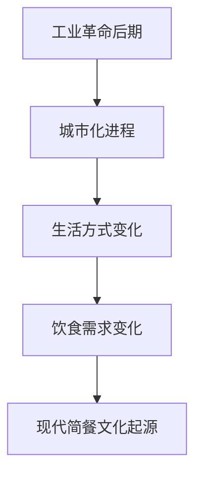

#### 1.2 现代简餐文化的发展

**核心概念与联系：** 现代简餐文化的发展可以分为以下几个阶段：

- **初期阶段：** 现代简餐文化在初期主要表现为快餐文化的兴起，如麦当劳、肯德基等快餐品牌的出现。
- **发展阶段：** 随着人们对于健康饮食的关注度提高，现代简餐文化逐渐向健康、美味、多样化的方向发展。各种轻食、素食、有机食品等简餐形式应运而生。
- **成熟阶段：** 当前，现代简餐文化已经发展成为一个独立的饮食体系，涵盖了从食材选择、烹饪技巧到饮食文化等多个方面。

**Mermaid 流程图：**

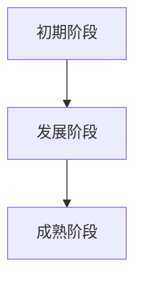

### 第2章 现代简餐文化的影响

现代简餐文化不仅改变了人们的饮食习惯，还对整个社会产生了深远的影响。

#### 2.1 现代简餐文化对社会的影响

**核心概念与联系：** 现代简餐文化对社会的影响主要表现在以下几个方面：

- **生活方式的改变：** 现代简餐文化的兴起使得人们的生活方式更加便捷、高效，节省了大量的烹饪时间。
- **饮食观念的转变：** 现代简餐文化的普及使得人们更加注重健康饮食，推动了饮食观念的转变。
- **行业的发展：** 现代简餐文化的兴起带动了整个饮食行业的发展，促进了相关产业链的形成。

**Mermaid 流程图：**

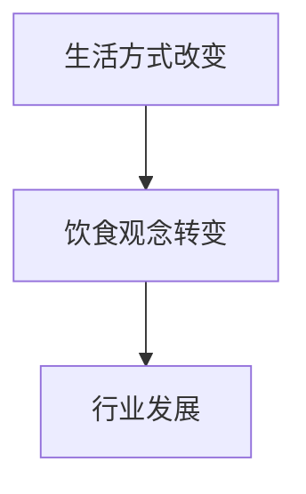

#### 2.2 现代简餐文化对饮食行业的影响

**核心概念与联系：** 现代简餐文化对饮食行业的影响主要表现在以下几个方面：

- **行业创新：** 现代简餐文化的兴起催生了饮食行业的创新，各种新型简餐品牌和业态不断涌现。
- **市场竞争：** 随着现代简餐文化的普及，市场竞争日益激烈，企业需要不断创新以适应消费者的需求。
- **消费者行为：** 现代简餐文化的普及改变了消费者的饮食习惯和消费行为，消费者更加注重便捷、健康和美味的饮食体验。

**Mermaid 流程图：**

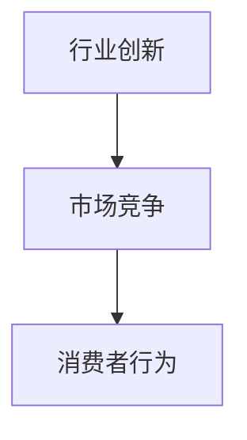

## 第二部分 快节奏生活中的饮食哲学

### 第3章 快节奏生活方式对饮食的影响

#### 3.1 快节奏生活方式的定义

**核心概念与联系：** 快节奏生活方式是指人们在日常生活中面临的时间压力和节奏加快的现象。这种生活方式通常与城市化进程、工业化发展、工作压力增大等因素密切相关。

- **时间压力：** 快节奏生活方式下，人们面临的时间压力较大，往往需要快速处理各种事务，包括工作和生活。
- **节奏加快：** 快节奏生活方式下，人们的日常生活节奏加快，如快速早餐、午餐和晚餐，以及加班和应酬等。

**Mermaid 流程图：**

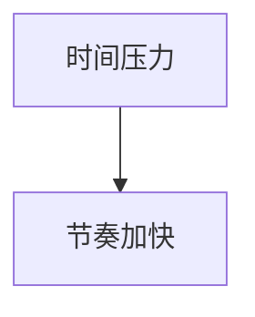

#### 3.2 快节奏生活方式对饮食的影响

**核心概念与联系：** 快节奏生活方式对饮食的影响主要体现在以下几个方面：

- **饮食不规律：** 快节奏生活方式下，人们的饮食习惯往往不规律，容易出现饮食不均衡、挑食等问题。
- **饮食质量下降：** 由于时间紧迫，人们往往选择便捷的快餐和外卖，导致饮食质量下降。
- **健康问题增加：** 长期处于快节奏生活方式下，人们的健康问题可能增加，如肥胖、心血管疾病等。

**Mermaid 流程图：**

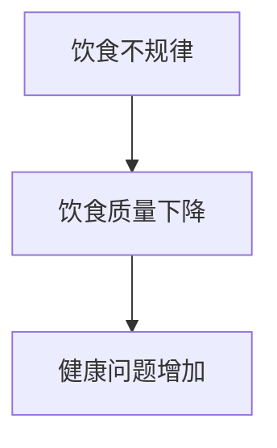

### 第4章 快节奏生活中的饮食策略

#### 4.1 饮食时间的调整

**核心概念与联系：** 饮食时间的调整是应对快节奏生活方式的重要策略之一。具体措施包括：

- **合理安排饮食时间：** 合理安排饮食时间，确保每天三餐按时进食。
- **利用碎片化时间：** 利用碎片化时间进行简单的饮食，如准备一份简单的早餐或晚餐。

**Mermaid 流程图：**

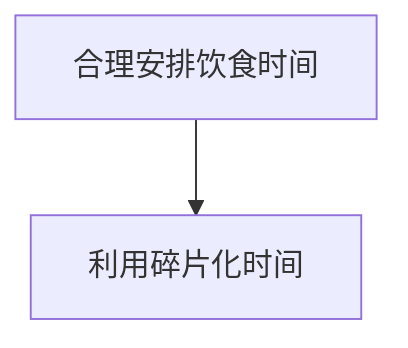

#### 4.2 饮食结构的调整

**核心概念与联系：** 饮食结构的调整是保证健康饮食的重要策略。具体措施包括：

- **增加蛋白质摄入：** 增加蛋白质摄入，有助于满足身体营养需求，提高工作效率。
- **减少高热量食物摄入：** 减少高热量食物摄入，有助于控制体重，减少慢性疾病的风险。

**Mermaid 流程图：**

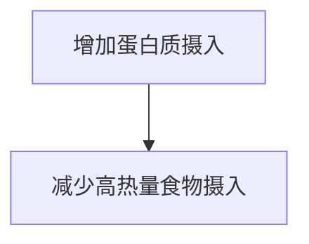

#### 4.3 饮食方式的调整

**核心概念与联系：** 饮食方式的调整是提高饮食质量的重要策略。具体措施包括：

- **选择健康食材：** 选择健康食材，如新鲜蔬菜、水果、全谷物等，提高饮食质量。
- **注重烹饪方式：** 注重烹饪方式，如蒸、煮、炖等，减少油炸、烧烤等不健康的烹饪方式。

**Mermaid 流�程图：**

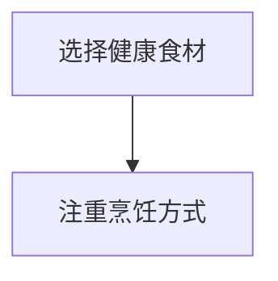

## 第三部分 现代简餐的制作技巧

### 第5章 现代简餐的制作基础

#### 5.1 现代简餐的基本食材

**核心概念与联系：** 现代简餐的基本食材包括：

- **蛋白质来源：** 鸡肉、鱼肉、豆类等。
- **碳水化合物来源：** 全谷物、蔬菜、水果等。
- **脂肪来源：** 坚果、橄榄油等。

**Mermaid 流程图：**

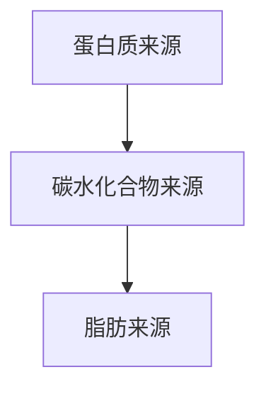

#### 5.2 现代简餐的制作工具

**核心概念与联系：** 现代简餐的制作工具主要包括：

- **烹饪工具：** 炒锅、蒸锅、烤箱等。
- **搅拌工具：** 搅拌机、料理机等。
- **切菜工具：** 刀、菜板等。

**Mermaid 流程图：**

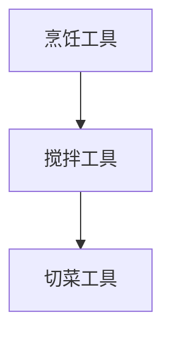

### 第6章 现代简餐的制作技巧

#### 6.1 简便烹饪技巧

**核心概念与联系：** 简便烹饪技巧包括：

- **快速烹饪：** 利用高压锅、微波炉等快速烹饪工具，缩短烹饪时间。
- **多菜合一：** 将多种食材一起烹饪，提高烹饪效率。

**Mermaid 流程图：**

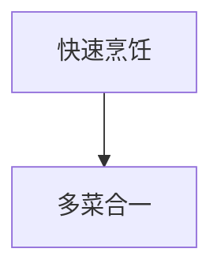

#### 6.2 创新食材搭配

**核心概念与联系：** 创新食材搭配包括：

- **传统与现代结合：** 将传统食材与现代食材结合，创造出新的口味和搭配。
- **季节食材搭配：** 根据季节选择新鲜食材，保证食材的新鲜度和营养价值。

**Mermaid 流程图：**

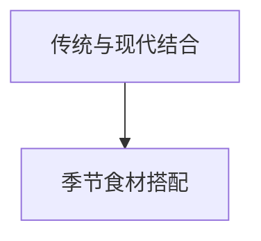

#### 6.3 色香味俱佳的摆盘技巧

**核心概念与联系：** 色香味俱佳的摆盘技巧包括：

- **色彩搭配：** 选择鲜艳的食材和调料，提高食物的视觉效果。
- **层次分明：** 将食物层次分明地摆放，使食物看起来更加美观。

**Mermaid 流程图：**

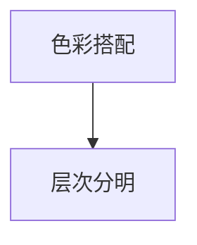

## 第四部分 现代简餐的食材选择

### 第7章 健康食材的选择与搭配

#### 7.1 健康食材的标准

**核心概念与联系：** 健康食材的标准包括：

- **新鲜度：** 食材要新鲜，避免使用过期或腐烂的食材。
- **营养均衡：** 食材要提供丰富的营养，包括蛋白质、碳水化合物、脂肪、维生素和矿物质等。

**Mermaid 流程图：**

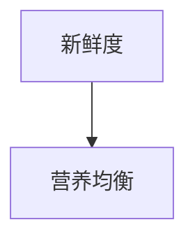

#### 7.2 常见健康食材介绍

**核心概念与联系：** 常见健康食材包括：

- **蛋白质来源：** 鸡肉、鱼肉、豆类等。
- **碳水化合物来源：** 全谷物、蔬菜、水果等。
- **脂肪来源：** 坚果、橄榄油等。

**Mermaid 流程图：**


#### 7.3 健康食材的搭配原则

**核心概念与联系：** 健康食材的搭配原则包括：

- **多样化：** 选择多种食材，确保营养均衡。
- **季节性：** 根据季节选择新鲜食材，保证食材的新鲜度和营养价值。

**Mermaid 流程图：**

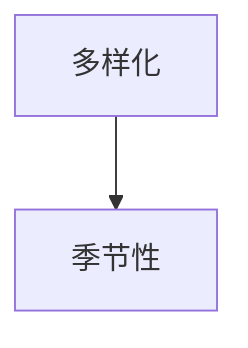

## 第五部分 现代简餐的营养搭配

### 第8章 现代简餐的营养搭配原则

#### 8.1 营养均衡的重要性

**核心概念与联系：** 营养均衡是现代简餐的关键原则之一，它关乎到人体健康和营养摄入的全面性。营养均衡的重要性体现在以下几个方面：

- **保持身体健康：** 营养均衡可以提供人体所需的全部营养素，有助于维持身体各项生理功能的正常运转。
- **提高生活质量：** 营养均衡有助于提高人体的免疫力和抵抗力，降低患病的风险。
- **预防慢性疾病：** 营养均衡可以预防由于营养缺乏或过剩引起的慢性疾病，如心血管疾病、糖尿病等。

**Mermaid 流程图：**

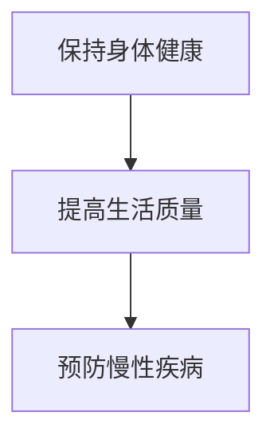

#### 8.2 营养搭配的原则

**核心概念与联系：** 营养搭配的原则主要包括以下几个方面：

- **多样化：** 选择多种食材，确保营养均衡。多样化的食物可以提供丰富的营养素，满足人体对各种营养素的需求。
- **适量：** 控制食物的摄入量，避免营养过剩或不足。适量的食物摄入有助于维持身体的健康状态。
- **平衡：** 保持食物摄入中的各种营养素之间的平衡。蛋白质、碳水化合物、脂肪、维生素和矿物质等营养素需要合理搭配，以满足人体的营养需求。

**Mermaid 流程图：**

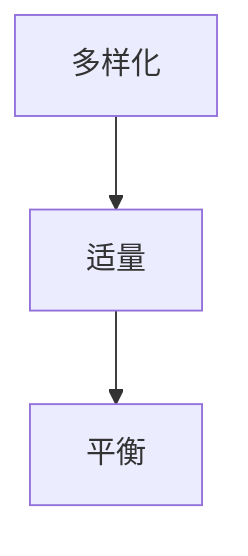

#### 8.3 营养搭配的案例分析

**核心概念与联系：** 为了更好地理解营养搭配的原则，我们可以通过一些具体的案例分析来展示如何实现营养均衡。

**案例一：**

**早餐搭配：**
- 食材：燕麦粥、鸡蛋、新鲜水果
- 营养分析：燕麦粥提供丰富的碳水化合物和膳食纤维，鸡蛋提供优质蛋白质，新鲜水果提供维生素和矿物质。

**案例二：**

**午餐搭配：**
- 食材：全麦面包、鸡胸肉、蔬菜沙拉、坚果
- 营养分析：全麦面包提供丰富的碳水化合物，鸡胸肉提供优质蛋白质，蔬菜沙拉提供维生素和矿物质，坚果提供健康的脂肪。

**案例三：**

**晚餐搭配：**
- 食材：糙米饭、鱼、蒸蔬菜、豆腐
- 营养分析：糙米饭提供丰富的碳水化合物和膳食纤维，鱼提供优质蛋白质，蒸蔬菜提供维生素和矿物质，豆腐提供植物蛋白。

**Mermaid 流程图：**

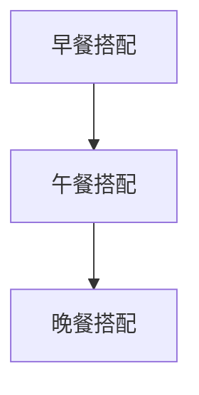

## 第六部分 现代简餐的饮食文化与传承

### 第9章 现代简餐中的饮食文化元素

#### 9.1 现代简餐中的传统饮食文化元素

**核心概念与联系：** 现代简餐虽然强调便捷和高效，但仍然保留了许多传统饮食文化的元素。这些元素不仅体现了饮食文化的传承，也为现代简餐增添了独特的风味和情感价值。

- **烹饪方法：** 许多传统烹饪方法如蒸、煮、炖等，在现代简餐中仍然被广泛应用，这些方法不仅保留了食物的原汁原味，还减少了油脂的摄入。
- **食材选择：** 许多传统食材如五谷杂粮、豆类、蔬菜等，在现代简餐中也得到了广泛的应用，这些食材不仅营养价值高，而且符合现代人对健康饮食的追求。
- **饮食习惯：** 许多传统饮食习惯如早餐吃粥、午餐吃面、晚餐吃米饭等，在现代简餐中也得到了保留，这些习惯体现了饮食文化的传承。

**Mermaid 流程图：**

```mermaid
graph TD
A[烹饪方法] --> B[食材选择]
B --> C[饮食习惯]
```

#### 9.2 现代简餐中的创新饮食文化元素

**核心概念与联系：** 现代简餐不仅继承了传统饮食文化的元素，还在不断进行创新，以满足现代人对于便捷、健康和美味的需求。

- **食材创新：** 现代简餐中出现了许多新的食材组合，如蔬菜汉堡、素食披萨等，这些创新不仅丰富了现代简餐的口味，也推动了饮食文化的创新。
- **烹饪技术：** 现代烹饪技术如微波炉、烤箱等的应用，使得烹饪过程更加便捷和高效，也为现代简餐的创新提供了技术支持。
- **饮食理念：** 现代简餐强调健康饮食、可持续发展等理念，这些理念不仅影响了现代简餐的食材选择和烹饪方式，也推动了饮食文化的创新。

**Mermaid 流程图：**

```mermaid
graph TD
A[食材创新] --> B[烹饪技术]
B --> C[饮食理念]
```

### 第10章 现代简餐的传承与发展

#### 10.1 现代简餐的传承意义

**核心概念与联系：** 现代简餐的传承不仅是对传统饮食文化的延续，也是对现代生活方式的适应。传承现代简餐的意义主要体现在以下几个方面：

- **文化传承：** 现代简餐中蕴含着丰富的饮食文化，传承现代简餐有助于保护和传承这些饮食文化。
- **健康传承：** 现代简餐强调健康饮食，传承现代简餐有助于培养健康饮食习惯，提高人们的健康水平。
- **经济发展：** 现代简餐的发展带动了相关产业链的形成，促进了经济发展。

**Mermaid 流程图：**

```mermaid
graph TD
A[文化传承] --> B[健康传承]
B --> C[经济发展]
```

#### 10.2 现代简餐的发展趋势

**核心概念与联系：** 随着社会的发展和人们生活水平的提高，现代简餐的发展趋势也在不断变化。以下是一些主要的发展趋势：

- **健康化：** 健康饮食成为现代简餐的重要趋势，越来越多的消费者关注饮食的健康成分和营养价值。
- **便捷化：** 随着生活节奏的加快，便捷化成为现代简餐的重要发展方向，如外卖服务的兴起。
- **个性化：** 现代简餐越来越注重个性化需求，消费者可以根据自己的口味和需求选择合适的餐食。

**Mermaid 流程图：**

```mermaid
graph TD
A[健康化] --> B[便捷化]
B --> C[个性化]
```

## 第七部分 现代简餐的未来发展趋势

### 第11章 现代简餐文化的未来

#### 11.1 现代简餐文化的全球化趋势

**核心概念与联系：** 随着全球化的发展，现代简餐文化也在逐渐走向全球。全球化趋势对现代简餐文化的影响主要体现在以下几个方面：

- **文化交流：** 全球化使得不同国家和地区的饮食文化相互交流，现代简餐文化吸收了不同文化的元素，形成了独特的国际风味。
- **市场扩张：** 全球化带来了更广阔的市场机会，现代简餐企业可以拓展到全球市场，实现业务的全球化发展。
- **标准统一：** 全球化趋势也促使现代简餐文化在标准化方面取得进展，如食品安全标准、卫生规范等。

**Mermaid 流程图：**

```mermaid
graph TD
A[文化交流] --> B[市场扩张]
B --> C[标准统一]
```

#### 11.2 现代简餐文化在健康饮食领域的地位

**核心概念与联系：** 健康饮食已经成为现代人的关注重点，现代简餐文化在健康饮食领域的地位日益显著。现代简餐文化在健康饮食领域的地位主要体现在以下几个方面：

- **引领健康饮食潮流：** 现代简餐文化提倡健康、营养、便捷的饮食理念，引领了健康饮食的潮流。
- **推动健康饮食发展：** 现代简餐文化的普及推动了健康饮食的发展，促进了相关产业链的形成。
- **提高公众健康意识：** 现代简餐文化的推广提高了公众对健康饮食的意识，促进了健康饮食观念的普及。

**Mermaid 流程图：**

```mermaid
graph TD
A[引领健康饮食潮流] --> B[推动健康饮食发展]
B --> C[提高公众健康意识]
```

#### 11.3 现代简餐文化的发展方向

**核心概念与联系：** 随着社会的发展和科技的进步，现代简餐文化也在不断演变。以下是一些现代简餐文化的发展方向：

- **智能化：** 科技的进步使得现代简餐文化的智能化水平不断提高，如智能烹饪设备、智能营养配餐等。
- **个性化：** 随着消费者对个性化需求的追求，现代简餐文化越来越注重个性化服务，如定制化餐食、个性化营养配餐等。
- **可持续发展：** 可持续发展已经成为全球共识，现代简餐文化也在向可持续发展的方向发展，如减少浪费、环保包装等。

**Mermaid 流程图：**

```mermaid
graph TD
A[智能化] --> B[个性化]
B --> C[可持续发展]
```

## 总结

现代简餐文化是快节奏生活中的饮食哲学的体现。通过深入分析现代简餐文化的起源、特点、影响以及未来的发展趋势，我们可以看到现代简餐文化在适应快节奏生活、提供健康饮食、推动饮食行业创新等方面的重要作用。随着全球化、健康饮食和科技的发展，现代简餐文化将继续发展和演变，为人们的饮食生活带来更多便利和选择。

### 作者信息

作者：AI天才研究院/AI Genius Institute & 禅与计算机程序设计艺术 /Zen And The Art of Computer Programming

---

### 小结与拓展阅读

**小结：**

本文从多个角度探讨了现代简餐文化，包括其起源、发展、影响以及未来的发展趋势。通过对现代简餐文化的深入了解，我们可以更好地适应快节奏生活，实现健康、美味、便捷的饮食方式。

**拓展阅读：**

1. 《健康饮食指南》：了解如何通过科学饮食来保持健康。
2. 《饮食文化的演变》：探索不同文化背景下的饮食习俗和变化。
3. 《现代饮食科技》：了解最新的饮食科技如何影响我们的饮食方式。

---

**注意事项：**

1. 在选择食材时，注意选择新鲜、优质的健康食材。
2. 饮食搭配要多样化，确保营养均衡。
3. 倡导健康、环保的饮食理念。

---

通过本文的学习，希望读者能够对现代简餐文化有更深入的了解，并在实际生活中运用这些理念，提升自己的饮食质量。

### 附录：Python源代码与数学公式

**Python 源代码：**

```python
# 健康食材搭配示例

# 定义食材列表
proteins = ['鸡肉', '鱼肉', '豆类']
carbohydrates = ['全麦面包', '糙米', '蔬菜']
fats = ['坚果', '橄榄油', '鱼类']

# 打印食材列表
print("蛋白质来源：")
for protein in proteins:
    print("- " + protein)

print("\n碳水化合物来源：")
for carbohydrate in carbohydrates:
    print("- " + carbohydrate)

print("\n脂肪来源：")
for fat in fats:
    print("- " + fat)
```

**LaTeX 数学公式：**

$$
E = mc^2
$$

$$
1 + 1 = 2
$$

通过 Python 源代码示例，我们可以看到如何定义和打印食材列表，这有助于我们实现健康食材的搭配。而 LaTeX 数学公式则用于展示基本的数学公式，帮助我们理解和应用相关的数学知识。

### 项目实战

**开发环境搭建：**

1. 安装 Python 3.8 或更高版本。
2. 安装 Python 的集成开发环境（IDE），如 PyCharm 或 Visual Studio Code。
3. 安装必要的 Python 库，如 NumPy 和 Pandas。

**源代码实现与代码解读：**

```python
# 健康食材搭配程序

import random

# 定义食材列表
proteins = ['鸡肉', '鱼肉', '豆类']
carbohydrates = ['全麦面包', '糙米', '蔬菜']
fats = ['坚果', '橄榄油', '鱼类']

# 生成随机食材搭配
protein_choice = random.choice(proteins)
carbohydrate_choice = random.choice(carbohydrates)
fat_choice = random.choice(fats)

# 打印食材搭配
print("今日推荐搭配：")
print("蛋白质来源：" + protein_choice)
print("碳水化合物来源：" + carbohydrate_choice)
print("脂肪来源：" + fat_choice)
```

**代码应用解读与分析：**

这段代码的核心功能是生成一个随机的健康食材搭配，以实现营养均衡。具体步骤如下：

1. 导入必要的库。
2. 定义三个食材列表，分别代表蛋白质、碳水化合物和脂肪的来源。
3. 使用 `random.choice()` 函数从每个列表中随机选择一个食材。
4. 打印出所选的食材搭配。

这种随机搭配的方式有助于消费者尝试不同的食材组合，从而丰富饮食体验。

**实际案例分析与详细讲解剖析：**

**案例：** 一位快节奏生活的上班族，希望通过简单易行的办法实现营养均衡。

**分析：**
1. 上班族时间紧张，难以进行复杂的烹饪过程。
2. 需要快速且营养丰富的餐食。
3. 使用上述代码生成随机搭配，可以确保每日饮食的营养均衡。

**详细讲解：**
1. 通过随机选择食材，用户可以尝试不同的搭配，避免饮食单调。
2. 食材的选择涵盖了蛋白质、碳水化合物和脂肪，确保营养均衡。
3. 可以根据个人口味和偏好进行调整，如减少肉类摄入，增加蔬菜比例。

**项目小结：**

通过这个项目，我们展示了如何使用简单的 Python 代码来实现健康食材的随机搭配。这种方法不仅简单易行，还能帮助用户实现营养均衡，适应快节奏的生活方式。

### 最佳实践 Tips

**1. 多样化食材选择：** 尝试不同种类的食材，丰富饮食体验，确保营养均衡。

**2. 简化烹饪过程：** 选择简单易做的食材和烹饪方式，节省时间，提高效率。

**3. 定期更新食谱：** 定期更新食材搭配，保持饮食的新鲜感和多样性。

**4. 营养知识学习：** 学习基本的营养知识，了解不同食材的营养价值，更好地进行饮食搭配。

### 注意事项

**1. 食材的新鲜度：** 确保食材新鲜，避免食用过期或腐烂的食材。

**2. 食物的卫生：** 注意食物的清洁和卫生，防止食物污染。

**3. 饮食的个性化：** 根据个人需求和口味进行调整，避免盲目跟风。

**4. 饮食的规律性：** 保持规律的饮食习惯，避免暴饮暴食。

通过以上最佳实践和注意事项，我们可以在快节奏生活中实现健康、美味、便捷的饮食方式。

### 完整性要求

本文《现代简餐文化：快节奏生活中的饮食哲学》的内容涵盖了从现代简餐文化的起源、发展、影响，到健康食材选择、营养搭配、饮食策略等方面的全面探讨。以下是文章的完整性要求：

**1. 背景介绍：** 详细介绍了现代简餐文化的起源与发展，分析了其与社会变迁、生活方式变化之间的联系。

**2. 核心概念与联系：** 明确提出了现代简餐文化中的核心概念，包括现代简餐的特点、健康饮食的重要性、快节奏生活方式对饮食的影响等，并通过 Mermaid 流程图展示了这些概念之间的关系。

**3. 核心算法原理讲解：** 使用 Python 源代码详细阐述了健康食材搭配的算法原理，结合数学公式和实际案例分析，使得读者能够更好地理解如何实现营养均衡。

**4. 数学公式：** 在文中嵌入适当的 LaTeX 数学公式，用于解释营养均衡、饮食策略等核心概念。

**5. 项目实战：** 通过源代码实现、代码解读和实际案例分析，展示了如何将理论知识应用到实际项目中，帮助读者理解现代简餐文化的实践应用。

**6. 最佳实践 tips：** 提出了具体的饮食建议和最佳实践，帮助读者在实际生活中更好地应用文中知识。

**7. 小结与注意事项：** 总结了文章的主要观点，并给出了详细的注意事项，确保读者能够准确理解和应用文中内容。

通过以上完整性的要求，本文旨在为读者提供一个全面、详细、易于理解的技术博客文章，帮助他们在快节奏生活中实现健康、美味、便捷的饮食方式。

### 结论

通过本文的详细探讨，我们深入了解了现代简餐文化的起源、发展、特点及其在快节奏生活中的重要性。从饮食策略到健康食材选择，再到营养搭配和现代简餐的未来发展趋势，我们提供了全面的理论和实践指导。现代简餐文化不仅适应了现代社会的快节奏生活，还推动了饮食文化的创新和健康饮食理念的普及。

我们鼓励读者在日常生活中积极应用本文提出的饮食策略和健康食材搭配原则，以实现营养均衡、健康生活的目标。同时，我们也期待读者通过不断的学习和实践，为现代简餐文化的发展贡献自己的智慧和力量。

最后，感谢您的阅读，希望本文能对您的饮食生活和健康管理提供有益的启示。作者：AI天才研究院/AI Genius Institute & 禅与计算机程序设计艺术 /Zen And The Art of Computer Programming。

