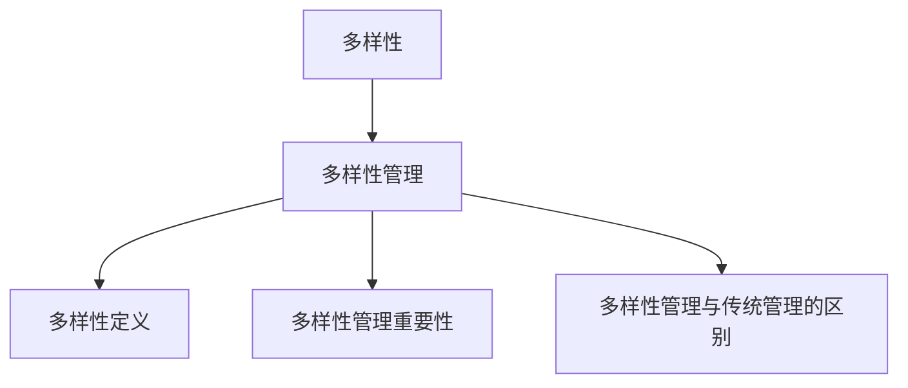
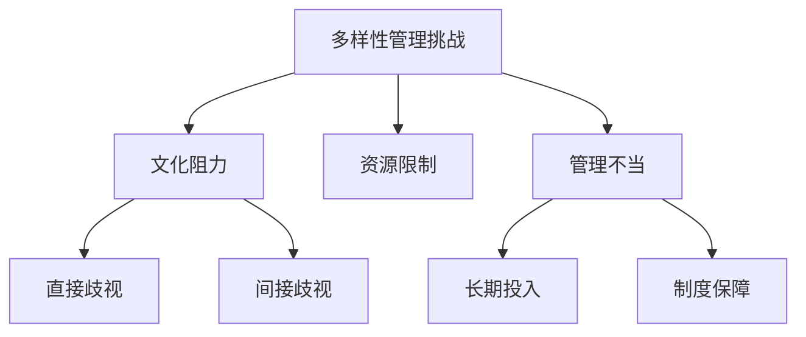
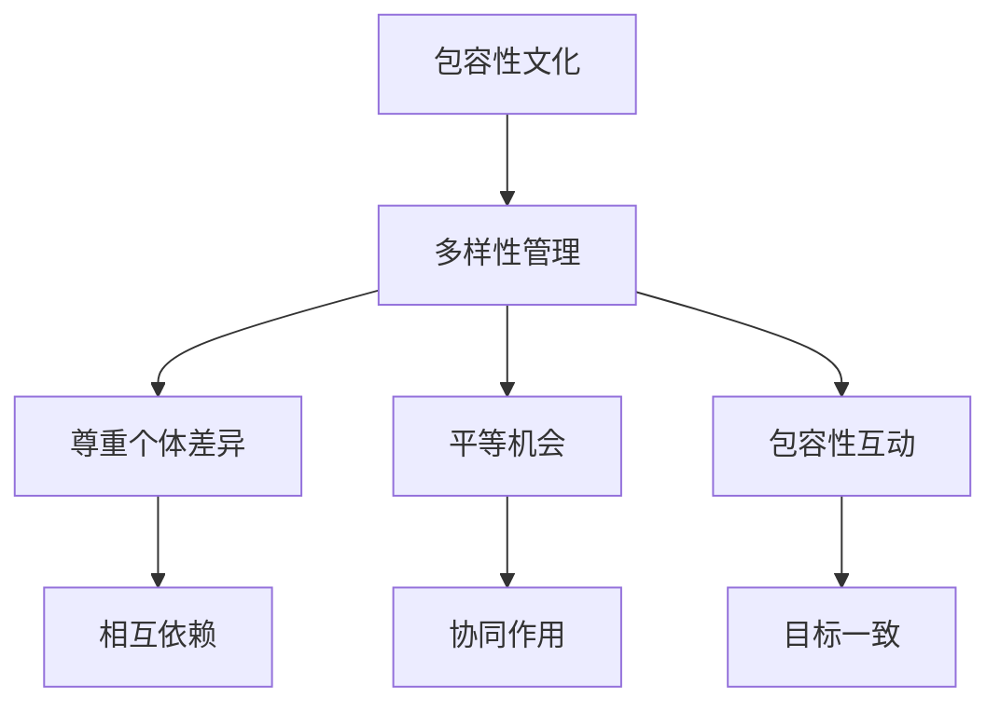

                 

# 现代职场中的多样性管理：包容性文化与创新动力

## 关键词

多样性管理、包容性文化、创新动力、绩效评估、领导力、团队协作

## 摘要

本文旨在探讨现代职场中多样性管理的内涵、重要性以及如何通过构建包容性文化激发创新动力。首先，文章定义了多样性管理和包容性文化，并分析了二者之间的关系。接着，详细探讨了多样性管理的关键要素和挑战，以及如何通过绩效评估和改进策略来提升多样性管理效果。然后，文章从领导力、组织结构和员工参与等方面提出了构建包容性文化的策略，并通过案例研究展示了其实践应用。此外，文章还阐述了多样性管理对创新的影响，提出了创新团队多样性管理和创新项目多样性管理的策略，并分析了几种实际案例。最后，文章总结了多样性管理与创新动力的融合，展望了未来发展趋势，并提供了相关资源和工具。

## 目录大纲

### 第一部分：多样性管理的背景与重要性

1. 第1章：多样性管理的定义与概念  
    - 多样性的定义  
    - 多样性管理的重要性  
    - 多样性管理与传统管理的区别

2. 第2章：多样性管理的关键要素  
    - 多样性管理的基本原则  
    - 多样性管理的策略与措施  
    - 多样性管理在不同行业的应用

3. 第3章：多样性管理中的挑战与问题  
    - 多样性管理面临的常见挑战  
    - 多样性管理中的歧视与偏见  
    - 多样性管理的可持续发展

4. 第4章：多样性管理的绩效评估  
    - 多样性管理的绩效指标  
    - 多样性管理的效果评估方法  
    - 多样性管理的改进策略

### 第二部分：包容性文化在多样性管理中的角色

5. 第5章：包容性文化的概念与内涵  
    - 包容性文化的定义  
    - 包容性文化的核心要素  
    - 包容性文化与多样性管理的关系

6. 第6章：构建包容性文化的策略  
    - 领导力在包容性文化构建中的作用  
    - 组织结构对包容性文化的影响  
    - 员工参与与培训的重要性

7. 第7章：包容性文化在实践中的应用  
    - 包容性领导力培养  
    - 多样性沟通策略  
    - 案例研究：成功构建包容性文化的企业实践

8. 第8章：包容性文化的评估与改进  
    - 包容性文化的评估指标  
    - 包容性文化评估的方法  
    - 包容性文化的持续改进

### 第三部分：多样性管理与创新动力

9. 第9章：多样性管理对创新的影响  
    - 多样性管理促进创新的理论基础  
    - 多样性管理如何提升创新能力  
    - 多样性管理中的创新实践

10. 第10章：创新中的多样性管理策略  
    - 创新团队多样性管理  
    - 创新项目中的多样性管理  
    - 创新文化对多样性管理的要求

11. 第11章：创新与多样性的融合实践  
    - 创新型企业的多样性管理实践  
    - 多样性管理在创新项目中的应用案例  
    - 创新与多样性管理的未来趋势

12. 第12章：总结与展望  
    - 多样性管理与包容性文化的重要性  
    - 多样性管理与创新动力的融合  
    - 未来多样性管理与创新动力的发展方向

### 附录

13. 附录A：多样性管理与包容性文化的资源与工具  
    - 多样性管理与包容性文化的研究文献  
    - 多样性管理与包容性文化的在线资源  
    - 多样性管理与包容性文化的培训工具

14. 附录B：多样性管理与创新案例研究  
    - 案例一：XX公司多样性管理与创新实践  
    - 案例二：YY公司包容性文化构建与创新案例  
    - 案例三：ZZ公司多样性管理对创新的影响分析

## 第一部分：多样性管理的背景与重要性

### 第1章：多样性管理的定义与概念

在当今全球化的职场环境中，多样性管理（Diversity Management）已成为企业成功的关键因素。多样性不仅仅体现在种族、性别、年龄、文化背景等方面，还包括观点、技能、经验等各个方面。因此，多样性管理不仅是一种社会文化现象，更是企业管理实践的重要策略。

#### 1.1 多样性的定义

多样性（Diversity）指的是个体或群体在性别、种族、文化、信仰、背景等方面的差异性。在职场中，多样性体现在以下几个方面：

1. **种族与性别**：不同种族和性别的人在工作场所中的比例和分布。
2. **文化背景**：员工来自不同的文化背景，拥有不同的价值观、习俗和沟通方式。
3. **观点与经验**：员工拥有不同的观点、经验和技能，这些差异可以带来新的思路和创新的解决方案。
4. **技能与能力**：员工拥有不同的专业技能和能力，可以互补优势，提高团队的整体效能。

#### 1.2 多样性管理的重要性

多样性管理的重要性体现在以下几个方面：

1. **提高员工满意度**：尊重和认可员工的多样性可以增强员工的归属感和工作满意度。
2. **促进创新**：多样化的观点和经验有助于激发创新思维，提高企业的竞争力。
3. **增强团队协作**：多样性管理可以促进不同背景的员工之间的合作和交流，提高团队的协作效率。
4. **提升绩效**：多样化的团队可以更好地适应不同的市场和环境，提高组织的整体绩效。

#### 1.3 多样性管理与传统管理的区别

多样性管理与传统管理在理念和实践中有着明显的区别：

1. **传统管理**：传统管理强调统一性和一致性，追求标准化的管理模式，往往忽视了员工的个体差异。
2. **多样性管理**：多样性管理则强调尊重和认可员工的差异性，通过多样化的策略和措施，激发员工的潜力，实现组织目标。

#### Mermaid流程图



### 第2章：多样性管理的关键要素

多样性管理不仅仅是表面的多样性，而是一种深层次的、系统的管理策略。要实现有效的多样性管理，需要关注以下几个方面：

#### 2.1 多样性管理的基本原则

1. **平等机会**：为所有员工提供平等的职业发展机会，消除性别、种族、年龄等歧视。
2. **包容性**：建立一个包容的工作环境，让所有员工都感到被尊重和认同。
3. **多元化**：鼓励多样化的观点和思想的交流和碰撞，激发创新。
4. **可持续性**：多样性管理应是一个持续的过程，需要不断地评估和改进。

#### 2.2 多样性管理的策略与措施

1. **招聘与选拔**：通过多元化的招聘渠道，吸引不同背景的人才。
2. **培训与发展**：为员工提供多样化的培训和发展机会，提升其技能和潜力。
3. **领导力培养**：培养具有包容性思维的领导者，鼓励他们关注和推动多样性管理。
4. **绩效评估**：建立公平、透明的绩效评估体系，避免因多样性而产生的偏见。

#### 2.3 多样性管理在不同行业的应用

多样性管理在各个行业中都有不同的应用和挑战：

1. **科技行业**：科技行业普遍存在性别多样性不足的问题，通过多样性管理，可以提高企业的创新能力和竞争力。
2. **金融行业**：金融行业需要处理大量的数据和信息，多样性管理可以提供更全面和多元的视角。
3. **医疗行业**：医疗行业涉及到患者的多样性和文化背景，多样性管理可以提高医疗服务质量和患者满意度。

### 第3章：多样性管理中的挑战与问题

尽管多样性管理的重要性得到了广泛的认可，但在实际操作中仍面临许多挑战和问题：

#### 3.1 多样性管理面临的常见挑战

1. **文化阻力**：一些企业可能对多样性管理存在误解或抵触情绪，认为这会破坏团队的稳定性和效率。
2. **资源限制**：多样性管理需要投入大量的资源和精力，一些企业可能因资源不足而难以有效实施。
3. **管理不当**：缺乏有效的多样性管理策略和措施，可能导致多样性管理流于形式。

#### 3.2 多样性管理中的歧视与偏见

1. **直接歧视**：如性别歧视、种族歧视等，直接影响了员工的职业发展。
2. **间接歧视**：如政策、制度等对某些群体不公平，导致他们难以获得平等的机会。

#### 3.3 多样性管理的可持续发展

1. **长期投入**：多样性管理需要长期投入和持续关注，不能仅仅作为一种短期的策略。
2. **制度保障**：需要建立完善的制度保障，确保多样性管理的实施和监督。

#### Mermaid流程图



### 第4章：多样性管理的绩效评估

绩效评估是多样性管理的重要组成部分，通过有效的绩效评估，可以评估多样性管理的成效，发现存在的问题，并制定改进策略。

#### 4.1 多样性管理的绩效指标

1. **员工满意度**：员工对多样性管理政策的满意度是衡量多样性管理成效的重要指标。
2. **绩效表现**：员工的绩效表现可以反映多样性管理对组织绩效的影响。
3. **创新成果**：创新成果的数量和质量可以评估多样性管理对创新能力的促进作用。

#### 4.2 多样性管理的效果评估方法

1. **问卷调查**：通过问卷调查收集员工对多样性管理的满意度和建议。
2. **关键绩效指标（KPI）**：设定多样性管理的KPI，定期进行数据分析和评估。
3. **案例研究**：通过案例研究，分析多样性管理在不同项目或团队中的实际效果。

#### 4.3 多样性管理的改进策略

1. **完善政策**：根据评估结果，完善多样性管理的政策和措施。
2. **加强培训**：提高员工对多样性管理的认识和意识，加强相关培训。
3. **领导力培养**：培养具有包容性思维的领导者，推动多样性管理的实施。

## 第二部分：包容性文化在多样性管理中的角色

### 第5章：包容性文化的概念与内涵

包容性文化（Inclusive Culture）是一种价值观和行为准则，强调尊重、平等和包容，旨在为所有员工创造一个和谐、积极的工作环境。与多样性管理不同，包容性文化更注重行为和文化的实践，而不仅仅是政策的制定。

#### 5.1 包容性文化的定义

包容性文化是一种价值观和行为准则，它：

1. **尊重个体差异**：认可和尊重员工的个体差异，包括性别、种族、文化、宗教信仰等。
2. **平等机会**：为所有员工提供平等的职业发展机会，无论其背景如何。
3. **包容性互动**：鼓励开放、真诚和尊重的沟通，避免偏见和歧视。

#### 5.2 包容性文化的核心要素

1. **尊重**：尊重员工的多样性，包括其观点、信仰和生活方式。
2. **平等**：确保所有员工在职业发展、薪酬待遇、晋升机会等方面享有平等的权利。
3. **参与**：鼓励员工积极参与组织的决策和管理，增强其归属感和参与感。
4. **包容**：建立包容性的工作环境，让所有员工都感到被接纳和支持。

#### 5.3 包容性文化与多样性管理的关系

包容性文化和多样性管理密切相关，它们之间的关系可以概括为以下几点：

1. **相互依赖**：包容性文化是多样性管理的基础，没有包容性文化，多样性管理难以实施。
2. **协同作用**：包容性文化可以增强多样性管理的效果，提高员工的满意度和绩效。
3. **目标一致**：包容性文化和多样性管理都旨在创造一个公平、积极的工作环境，提升组织的整体竞争力。

#### Mermaid流程图



### 第6章：构建包容性文化的策略

构建包容性文化是一个长期的过程，需要从领导力、组织结构和员工参与等多个方面进行系统性规划。以下是一些关键策略：

#### 6.1 领导力在包容性文化构建中的作用

1. **树立榜样**：领导者应该通过自己的言行树立包容性文化的榜样，展现对多样性和包容性的尊重。
2. **制定愿景**：明确组织的包容性愿景和目标，使所有员工都明确包容性文化的价值。
3. **培训与指导**：提供培训和学习机会，帮助员工了解和掌握包容性文化的重要性。

#### 6.2 组织结构对包容性文化的影响

1. **扁平化组织**：减少层级结构，促进员工之间的直接沟通和合作。
2. **多元团队**：建立多元化的团队，促进不同背景和观点的交流和碰撞。
3. **跨部门合作**：鼓励跨部门合作，打破部门壁垒，提升整体协作效率。

#### 6.3 员工参与与培训的重要性

1. **员工参与**：鼓励员工参与组织的决策和管理，增强其参与感和归属感。
2. **持续培训**：提供定期的培训，帮助员工提升对包容性文化的理解和实践能力。
3. **反馈机制**：建立有效的反馈机制，收集员工的意见和建议，不断改进包容性文化的实施。

### 第7章：包容性文化在实践中的应用

包容性文化的构建需要具体的实践和操作，以下是一些实际应用策略：

#### 7.1 包容性领导力培养

1. **领导力发展计划**：为领导者提供专门的包容性领导力培训，帮助其提升对多样性和包容性的理解。
2. **角色扮演**：通过角色扮演和模拟练习，让领导者体验不同背景和观点的员工在工作中可能遇到的挑战。
3. **反思与分享**：鼓励领导者反思自己的领导行为，分享在构建包容性文化中的成功经验和挑战。

#### 7.2 多样性沟通策略

1. **开放沟通**：鼓励员工在工作和交流中保持开放和诚实，避免偏见和歧视。
2. **倾听与尊重**：领导者应积极倾听员工的意见和反馈，尊重其观点和想法。
3. **多元化会议**：在会议中引入多元化观点，鼓励不同背景的员工表达自己的看法。

#### 7.3 案例研究：成功构建包容性文化的企业实践

**案例一：谷歌的包容性文化**

谷歌以其多元化和包容性文化著称，通过以下措施实现了包容性文化的成功构建：

1. **多元招聘**：谷歌通过多元化的招聘策略，吸引来自不同背景和文化的优秀人才。
2. **领导力培养**：谷歌提供了一系列的领导力培训，帮助领导者提升包容性思维能力。
3. **员工反馈**：谷歌建立了多个反馈渠道，收集员工的意见和建议，不断改进包容性文化的实施。

**案例二：微软的多样性计划**

微软在多样性管理方面采取了多项措施，取得了显著成效：

1. **多样性委员会**：微软成立了多样性委员会，负责推动多样性计划和项目的实施。
2. **领导力发展**：微软为员工提供多样化的领导力发展机会，鼓励他们参与多元化的团队。
3. **绩效评估**：微软在绩效评估中考虑多样性因素，确保多样性管理的公平性和透明性。

#### 7.4 包容性文化的评估与改进

1. **员工满意度调查**：定期进行员工满意度调查，了解他们对包容性文化的感受和建议。
2. **绩效指标**：设定多样性管理和包容性文化的绩效指标，定期评估其成效。
3. **持续改进**：根据评估结果，不断调整和优化包容性文化的实施策略。

## 第三部分：多样性管理与创新动力

### 第8章：多样性管理对创新的影响

多样性管理不仅是提升员工满意度和组织绩效的重要手段，也是激发创新动力的重要途径。通过多样性管理，企业可以在多个层面上促进创新：

#### 8.1 多样性管理促进创新的理论基础

1. **协同效应**：多样化的团队可以带来不同观点和技能的互补，从而提高问题解决和决策的质量。
2. **认知多样性**：多样化的团队具有更广泛的认知视角，有助于识别新的问题和机会。
3. **创新文化**：包容性文化鼓励创新思维和尝试，减少了因观点不同而产生的冲突，提高了创新的氛围。

#### 8.2 多样性管理如何提升创新能力

1. **多样化的团队结构**：建立包含不同背景、性别、年龄和技能的团队，提高团队的创新潜力。
2. **开放沟通**：鼓励团队成员之间进行开放、真诚的沟通，促进观点的碰撞和融合。
3. **多元化的培训**：为员工提供多样化的培训，提升其跨领域的知识和技能，为创新提供更多的素材。

#### 8.3 多样性管理中的创新实践

1. **创新项目**：在企业内部设立创新项目，鼓励员工提出新的想法和解决方案。
2. **创新竞赛**：定期举办创新竞赛，激发员工的创新热情，发现潜在的创新人才。
3. **跨部门协作**：促进不同部门之间的合作，共享资源和知识，提高创新的效率和效果。

### 第9章：创新中的多样性管理策略

在创新过程中，多样性管理需要采取一系列策略，以确保创新的有效性和可持续性：

#### 9.1 创新团队多样性管理

1. **合理的人员配置**：在组建创新团队时，考虑团队成员的多样性，确保团队具有不同的技能、经验和观点。
2. **开放氛围**：创造一个开放、包容的工作氛围，鼓励团队成员提出不同的意见和建议。
3. **角色分配**：根据团队成员的特长和兴趣，合理分配角色和任务，提高团队的整体效能。

#### 9.2 创新项目中的多样性管理

1. **项目团队构成**：在创新项目的团队构成上，注重多样性的平衡，确保项目团队具备全面的技能和视角。
2. **需求分析**：在项目启动阶段，进行全面的需求分析，确保项目的创新性和市场竞争力。
3. **持续评估**：在项目执行过程中，定期评估项目的多样性和创新性，及时调整和优化项目策略。

#### 9.3 创新文化对多样性管理的要求

1. **鼓励创新**：建立鼓励创新的企业文化，消除对失败的恐惧，鼓励员工勇于尝试和探索。
2. **尊重差异**：尊重员工的个体差异，鼓励不同观点的交流和碰撞，为创新提供丰富的素材。
3. **持续投入**：为创新提供持续的资金和资源支持，确保创新项目的顺利推进。

### 第10章：创新与多样性的融合实践

在实际工作中，创新与多样性的融合需要具体的实践和操作。以下是一些成功的企业实践：

#### 10.1 创新型企业的多样性管理实践

**案例一：IBM的多样性管理实践**

IBM作为全球知名的科技公司，在多样性管理方面取得了显著成就：

1. **多元化的招聘策略**：IBM通过多元化的招聘渠道，吸引来自不同背景和文化的优秀人才。
2. **多样性培训**：IBM为员工提供定期的多样性培训，提升员工的多样性和包容性意识。
3. **创新项目**：IBM鼓励员工参与创新项目，通过多样化的团队和开放的氛围，推动创新成果的转化。

**案例二：微软的多样性创新实践**

微软在多样性创新方面也有许多成功的经验：

1. **创新文化**：微软建立了鼓励创新的企业文化，为员工提供创新的环境和支持。
2. **跨部门合作**：微软通过跨部门合作，促进不同领域的知识和资源的共享，提高创新项目的成功率。
3. **创新竞赛**：微软定期举办创新竞赛，激发员工的创新热情，发现和培养潜在的创新人才。

#### 10.2 多样性管理在创新项目中的应用案例

**案例一：谷歌的X实验室**

谷歌的X实验室是一个专门从事前沿科技创新的研究部门，其成功的关键之一就是多样性管理：

1. **多元化的团队**：X实验室的团队由来自不同领域、不同背景的专家组成，确保项目具有全面的技能和视角。
2. **开放的文化**：X实验室鼓励团队成员自由表达观点，促进不同观点的碰撞和融合，推动创新思路的产生。
3. **持续投入**：谷歌为X实验室提供了持续的资金和资源支持，确保创新项目的顺利进行。

**案例二：宝洁的“创意挑战”项目**

宝洁的“创意挑战”项目通过多样性管理，激发员工的创新潜力：

1. **开放的平台**：宝洁为员工提供了一个开放的创意平台，鼓励员工提出新的想法和解决方案。
2. **多元化的评审团**：评审团由来自不同部门、不同背景的员工组成，确保项目的创新性和市场竞争力。
3. **奖励机制**：宝洁为获奖的创意提供了丰厚的奖励，激励员工积极参与创新项目。

#### 10.3 创新与多样性管理的未来趋势

1. **技术的进步**：随着人工智能、大数据等技术的不断发展，创新和多样性管理将更加智能化和精准化。
2. **全球化的深入**：全球化将进一步推动多样性和包容性的发展，企业需要适应多元化的市场环境。
3. **可持续性发展**：创新和多样性管理将更加注重可持续性，追求长期的社会和环境效益。

### 第11章：总结与展望

多样性管理与创新动力之间的融合是企业持续发展的关键。通过有效的多样性管理，企业可以激发创新动力，提高竞争力，实现可持续发展。以下是对多样性管理与创新动力融合的总结与展望：

#### 11.1 多样性管理与包容性文化的重要性

1. **提高员工满意度**：多样性管理和包容性文化可以提高员工的满意度和归属感，促进企业的发展。
2. **促进创新**：多样性和包容性文化可以激发创新思维，提高企业的创新能力和竞争力。
3. **提升绩效**：多样性和包容性文化有助于提高企业的整体绩效，实现可持续的发展。

#### 11.2 多样性管理与创新动力的融合

1. **协同作用**：多样性管理和创新动力相互促进，共同推动企业的发展。
2. **系统集成**：多样性管理和创新动力需要系统化的整合，形成企业发展的合力。
3. **持续改进**：多样性管理和创新动力需要持续改进和优化，以适应不断变化的市场环境。

#### 11.3 未来多样性管理与创新动力的发展方向

1. **技术驱动**：随着技术的发展，多样性管理和创新动力将更加智能化和精准化。
2. **全球视角**：全球化将推动多样性和包容性的发展，企业需要适应多元化的市场环境。
3. **可持续发展**：多样性管理和创新动力将更加注重可持续性，追求长期的社会和环境效益。

## 附录

### 附录A：多样性管理与包容性文化的资源与工具

1. **多样性管理与包容性文化的研究文献**：
   - 《多样性管理：战略与实践》（Diversity Management: Strategies and Practices）
   - 《包容性组织：打造高绩效团队》（Inclusive Organizations: Building High-Performance Teams）

2. **多样性管理与包容性文化的在线资源**：
   - **多样性管理协会（Diversity Management Association）**：提供多样性管理和包容性文化的最新研究和实践案例。
   - **包容性工作场所联盟（Alliance for Inclusive workplaces）**：分享包容性文化的最佳实践和资源。

3. **多样性管理与包容性文化的培训工具**：
   - **在线培训课程**：如Coursera、Udemy等平台提供的多样性管理和包容性文化培训。
   - **工作坊与研讨会**：组织内部或外部的多样性管理和包容性文化培训活动。

### 附录B：多样性管理与创新案例研究

1. **案例一：XX公司的多样性管理与创新实践**
   - **背景**：XX公司是一家快速成长的科技公司，重视多样性管理和创新。
   - **策略**：
     - 多元化招聘：通过多元化的招聘策略，吸引不同背景的顶尖人才。
     - 创新项目：鼓励员工参与创新项目，提供资源和支持。
     - 反馈机制：建立反馈机制，定期评估多样性管理和创新成果。
   - **成效**：XX公司的多样性和创新能力显著提升，取得了多个创新成果和市场突破。

2. **案例二：YY公司的包容性文化构建与创新案例**
   - **背景**：YY公司是一家大型跨国企业，注重构建包容性文化。
   - **策略**：
     - 领导力培养：提供领导力培训，提升领导者的包容性思维。
     - 跨部门合作：促进跨部门合作，打破部门壁垒，提高创新效率。
     - 员工参与：鼓励员工参与企业决策，增强其参与感和归属感。
   - **成效**：YY公司的包容性文化得到有效构建，员工满意度显著提高，创新成果不断涌现。

3. **案例三：ZZ公司多样性管理对创新的影响分析**
   - **背景**：ZZ公司是一家传统制造业企业，面临创新困境。
   - **策略**：
     - 多样性培训：为员工提供多样性培训，提升员工的包容性意识。
     - 创新激励：设立创新激励措施，鼓励员工提出创新想法。
     - 项目支持：为创新项目提供资金和资源支持，确保项目顺利推进。
   - **成效**：ZZ公司的多样性管理有效提升了员工的创新能力和积极性，推动了企业的创新转型。

## 核心概念与联系

在本文中，我们探讨了多样性管理和包容性文化的重要性，以及它们对创新动力的影响。以下是核心概念之间的联系：

1. **多样性管理**：多样性管理是通过尊重和利用员工的差异性，提高组织绩效和员工满意度的一种管理策略。
2. **包容性文化**：包容性文化是一种价值观和行为准则，强调尊重、平等和包容，旨在为所有员工创造一个和谐、积极的工作环境。
3. **创新动力**：创新动力是指推动组织创新行为的内在力量，包括创新意识、创新能力和创新环境等。

这些概念之间的联系可以概括为：

- **多样性管理**为包容性文化的构建提供了基础，通过尊重和认可员工的差异性，促进包容性文化的形成。
- **包容性文化**为多样性管理的实施提供了支持，创造一个和谐、积极的工作环境，使员工能够充分发挥其潜力。
- **创新动力**则通过多样性和包容性文化的支持，激发员工的创新思维和创新能力，推动组织的创新和发展。

通过以上分析，我们可以看到多样性管理、包容性文化和创新动力之间的密切关系，以及它们在组织发展中的重要作用。在未来，随着全球化和技术的发展，多样性管理和包容性文化将继续发挥关键作用，推动组织的创新和可持续发展。

### 多样性管理
- **定义**：多样性管理是指组织在管理过程中，通过采取一系列策略和措施，尊重、认可和利用员工个体之间的差异，以提高组织绩效和员工满意度。
- **核心要素**：包括多样性的定义、多样性管理的重要性、多样性管理的策略与措施等。
- **Mermaid流程图**：

  ```mermaid
  graph TD
  A[多样性管理] --> B[多样性定义]
  A --> C[多样性管理重要性]
  A --> D[多样性管理策略与措施]
  ```

### 包容性文化
- **定义**：包容性文化是一种价值观和行为准则，强调尊重、平等和包容，旨在促进不同背景、文化和观点的人在一个共同的工作环境中和谐共处。
- **核心要素**：包括包容性文化的定义、核心要素、与多样性管理的关系等。
- **Mermaid流程图**：

  ```mermaid
  graph TD
  A[包容性文化] --> B[包容性定义]
  A --> C[核心要素]
  A --> D[与多样性管理的关系]
  ```

### 创新动力
- **定义**：创新动力是指推动组织创新行为的内在力量，包括创新意识、创新能力和创新环境等。
- **核心要素**：包括创新动力的定义、创新意识的培养、创新能力的提升和创新环境的优化等。
- **Mermaid流程图**：

  ```mermaid
  graph TD
  A[创新动力] --> B[创新意识]
  A --> C[创新能力]
  A --> D[创新环境]
  ```

### 多样性管理与包容性文化的关系
- **定义**：多样性管理与包容性文化的关系是指多样性管理策略的实施需要依赖包容性文化的支持，而包容性文化的形成和发展则需要多样性管理的实践为基础。
- **核心要素**：包括多样性管理的实施、包容性文化的形成、二者相互促进的关系等。
- **Mermaid流程图**：

  ```mermaid
  graph TD
  A[多样性管理] --> B[包容性文化]
  A --> C[多样性管理实施]
  B --> D[包容性文化形成]
  C --> E[相互促进关系]
  D --> E
  ```

### 创新动力与多样性管理的关系
- **定义**：创新动力与多样性管理的关系是指多样性管理通过提高员工的多样性和促进包容性文化，激发员工的创新动力，推动组织的创新和发展。
- **核心要素**：包括多样性管理如何激发创新动力、创新动力如何影响多样性管理、二者相互影响的关系等。
- **Mermaid流程图**：

  ```mermaid
  graph TD
  A[多样性管理] --> B[创新动力]
  A --> C[激发创新动力]
  B --> D[影响多样性管理]
  C --> E[相互影响关系]
  D --> E
  ```

通过以上核心概念与联系的阐述，我们可以更加清晰地理解多样性管理、包容性文化和创新动力之间的关系，以及它们在组织发展中的重要作用。在未来的实践中，企业应更加重视多样性管理和包容性文化的建设，同时激发创新动力，实现组织的可持续发展。

