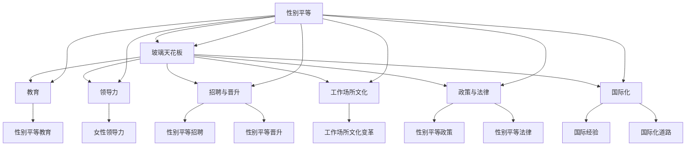

                 

# 现代职场中的性别平等：打破玻璃天花板的策略

## 关键词

- 性别平等
- 玻璃天花板
- 教育培训
- 领导力
- 招聘与晋升
- 工作场所文化
- 政策与法律
- 国际经验

## 摘要

本文旨在探讨现代职场中性别平等的重要性，以及如何打破玻璃天花板，实现性别平等。文章首先介绍了性别平等的概念和现状，然后分析了玻璃天花板现象及其影响，随后提出了性别平等教育与培训、领导力培养、招聘与晋升策略、工作场所文化变革以及政策与法律支持等方面的具体策略。最后，文章通过国际经验总结，提出了构建性别平等的职场环境的未来展望。希望通过本文，能够为职场中的性别平等提供一些有益的思考和实践指导。

## 第一部分：性别平等的背景与现状

### 第1章：性别平等的重要性

#### 1.1 性别平等的概念与意义

性别平等是指在社会、经济、政治、文化等领域中，男性和女性享有同等的权利和机会，不受性别歧视和偏见的影响。性别平等不仅关乎人权和公正，还对经济发展、社会进步以及国家竞争力产生深远影响。

在社会层面，性别平等有助于减少性别歧视和暴力，提升家庭和社会的和谐度。在经济层面，性别平等能够释放女性的人力资源潜力，提高劳动生产率和经济效益。在政治层面，性别平等能够促进民主参与和治理，提升社会的治理能力。在国际层面，性别平等是全球化进程中不可或缺的一部分，有助于推动全球性别平等和可持续发展。

#### 1.2 性别平等的全球现状

尽管性别平等在全球范围内取得了一定的进展，但仍然存在显著的差距。根据联合国妇女地位委员会的数据，全球约有25%的女性面临某种形式的暴力，女性在领导层和决策层的代表性仍然不足，女性在劳动市场上的机会和待遇也存在不平等现象。

在某些地区和国家，性别平等问题尤为突出。例如，在一些国家，女性仍然无法获得平等的受教育机会，女性劳动参与率较低，女性在家庭和社会中的地位较低。此外，女性在科技领域的代表性也相对较低，仅占全球科技人才的约20%。

#### 1.3 中国职场性别平等的现状

在中国，性别平等已经成为国家政策和法律的重要组成部分。然而，性别平等在职场中仍然面临许多挑战。根据《中国性别平等与女性发展》报告，尽管女性在就业市场上的比例较高，但女性的职业晋升和收入水平相对较低。此外，女性在领导层和决策层的代表性不足，性别歧视和性别暴力现象仍然存在。

中国政府已经采取了一系列措施来推动性别平等，如加强性别平等法律法规的制定和执行、推动女性教育和职业培训、提高女性在领导层和决策层的代表性等。然而，要实现真正的性别平等，还需要在政策和实践层面进行更加深入的改革和创新。

### 第2章：玻璃天花板现象

#### 2.1 玻璃天花板的定义与来源

玻璃天花板是指一种隐性的障碍，阻碍女性在职场中晋升到高级职位和领导层。这个概念起源于20世纪70年代，当时有人发现女性在职场中的晋升速度远远落后于男性，尽管她们在学历、经验和能力上并不逊色。

玻璃天花板的存在导致了女性在职场中面临一系列问题，如职业发展受限、收入差距、工作压力和心理健康问题等。这些问题不仅影响个人的职业生涯，还对整个社会和经济产生负面影响。

#### 2.2 玻璃天花板的影响

玻璃天花板对职场性别平等产生了深远的影响。首先，它限制了女性在高级职位和领导层的代表性，导致女性在决策过程中缺乏发言权和影响力。其次，玻璃天花板加剧了职场性别歧视，使得女性在工作中面临不公平的待遇和偏见。此外，玻璃天花板还影响了女性的职业发展和收入水平，导致性别收入差距的扩大。

#### 2.3 玻璃天花板在中国职场的表现

在中国职场，玻璃天花板现象依然存在。根据《中国职场性别歧视报告》，女性在晋升到高级职位的比例明显低于男性，特别是在某些行业和领域，如金融、科技和工程等。此外，女性在职场中面临的性别歧视和偏见也较为严重，导致她们在职业发展过程中面临更多的挑战和困难。

为了打破玻璃天花板，中国政府和企业需要采取有效的措施，如提供性别平等教育和培训、提高女性在领导层和决策层的代表性、消除职场性别歧视等。同时，女性也需要增强自我意识和自信心，积极争取平等的职业机会和发展空间。

## 第二部分：打破玻璃天花板的策略

### 第3章：性别平等教育与培训

#### 3.1 性别平等教育的意义

性别平等教育是打破玻璃天花板的重要手段之一。通过性别平等教育，可以提高职场中男女员工的性别意识，消除性别偏见和歧视，促进性别平等和公平竞争。性别平等教育不仅有助于提高员工的职业素养和道德水平，还能够增强企业的社会责任感和竞争力。

#### 3.2 性别平等培训的内容与实施

性别平等培训的内容应涵盖性别平等的基本概念、性别歧视的识别与应对、性别平等法律法规、性别平等案例分析等方面。培训可以通过内部培训、外部培训、在线课程等多种方式进行。在实施过程中，企业可以邀请性别平等专家进行讲座和培训，组织性别平等主题活动，建立性别平等工作小组等。

#### 3.3 性别平等教育的案例研究

某大型企业通过性别平等教育，成功打破了玻璃天花板。该公司在内部推行了性别平等培训项目，为员工提供了系统性的性别平等知识和技能培训。通过培训，员工们对性别平等有了更深刻的认识，消除了性别偏见和歧视，促进了性别平等和公平竞争。此外，该公司还设立了女性领导力发展计划，为女性员工提供了更多的晋升机会和支持。经过几年的努力，该公司的女性员工在高级职位和领导层的代表性得到了显著提升，取得了良好的社会效益和经济效益。

### 第4章：领导力与性别平等

#### 4.1 领导力与性别平等的关系

领导力是打破玻璃天花板的关键因素之一。性别平等与领导力密切相关。一方面，性别平等的实现需要领导者的支持和推动；另一方面，女性领导者的崛起和成功有助于打破玻璃天花板，推动职场性别平等。

#### 4.2 提高女性领导力的策略

为了提高女性领导力，可以从以下几个方面着手：

1. 培养自信心和自我认同：女性需要树立正确的自我认知，相信自己有能力胜任高级职位和领导工作。

2. 提升领导技能和知识：女性可以通过学习领导力理论和实践，提升自己的领导能力和管理技能。

3. 寻求导师和指导：女性可以寻找有经验的导师和指导者，获取职业发展和领导力方面的指导和帮助。

4. 创造平等的发展机会：企业应为女性提供平等的职业发展机会，消除性别歧视和偏见。

#### 4.3 领导力培养的案例研究

某跨国公司通过实施领导力培养项目，成功提高了女性领导力。该公司为女性员工提供了系统的领导力培训和指导，内容包括领导力理论、沟通技巧、团队管理、决策能力等方面。同时，公司还为女性员工提供了更多的晋升机会和支持，鼓励她们积极参与决策和领导工作。经过几年的努力，该公司的女性领导力得到了显著提升，女性员工在高级职位和领导层的代表性也得到了改善。

### 第5章：招聘与晋升中的性别平等

#### 5.1 招聘中的性别平等策略

招聘是打破玻璃天花板的重要环节之一。为了实现性别平等，企业可以采取以下策略：

1. 公开透明的招聘流程：确保招聘过程的公平性和透明性，避免性别偏见和歧视。

2. 多元化的招聘渠道：通过多元化的招聘渠道，吸引更多的女性人才，提高女性在招聘中的比例。

3. 设定性别平等目标：为企业设定性别平等目标，鼓励女性参与招聘过程，推动性别平等。

#### 5.2 晋升中的性别平等策略

在晋升过程中，企业可以采取以下策略：

1. 平等的机会：为女性员工提供平等的晋升机会，消除性别歧视和偏见。

2. 公正的评估体系：建立公正的评估体系，根据员工的能力和业绩进行晋升。

3. 鼓励女性申请高级职位：通过鼓励女性申请高级职位，提高女性在晋升过程中的参与度和比例。

#### 5.3 招聘与晋升中的性别平等案例分析

某知名企业通过实施性别平等招聘和晋升策略，成功提高了女性员工的代表性和晋升机会。该公司在招聘过程中注重性别平等，通过多元化的招聘渠道和公开透明的招聘流程，吸引了更多的女性人才。在晋升过程中，公司建立了公正的评估体系，为女性员工提供了平等的机会，并通过鼓励女性申请高级职位，提高了女性在高级职位和领导层的代表性。这些措施取得了显著的效果，不仅提升了公司的性别平等水平，还促进了公司的发展和竞争力的提升。

### 第6章：工作场所文化变革

#### 6.1 工作场所文化对性别平等的影

工作场所文化是影响性别平等的重要因素之一。积极的工作场所文化能够促进性别平等，而消极的工作场所文化则可能加剧性别歧视和偏见。

#### 6.2 改善工作场所文化的策略

为了改善工作场所文化，企业可以采取以下策略：

1. 强化性别平等意识：通过内部培训和宣传，提高员工对性别平等的认识和意识。

2. 鼓励多元化的价值观：倡导多元化的价值观，尊重和包容不同性别、文化、背景的员工。

3. 优化工作环境：改善工作条件，提高员工的满意度和幸福感，促进性别平等。

#### 6.3 改善工作场所文化的案例研究

某知名企业通过改善工作场所文化，成功推动了性别平等。该公司通过内部培训和宣传活动，提高了员工对性别平等的认识和意识。同时，公司倡导多元化的价值观，尊重和包容不同性别、文化、背景的员工。此外，公司还优化了工作环境，提高员工的满意度和幸福感。这些措施取得了显著的效果，不仅提升了公司的性别平等水平，还促进了公司的发展和竞争力的提升。

### 第7章：政策与法律支持

#### 7.1 性别平等相关政策与法律概述

性别平等政策与法律是推动性别平等的重要手段。中国政府已经制定了一系列相关政策与法律，如《中华人民共和国妇女权益保障法》、《中华人民共和国劳动法》等。这些法律和政策旨在保障女性的权益，消除性别歧视和偏见，促进性别平等。

#### 7.2 政策与法律对性别平等的影响

政策与法律对性别平等具有深远的影响。首先，它们为性别平等提供了法律保障，确保女性在职场中享有平等的权利和机会。其次，政策与法律能够推动社会对性别平等的认识和重视，提高公众对性别平等的关注度。此外，政策与法律还能够促进企业和社会组织在性别平等方面的改革和创新。

#### 7.3 性别平等政策与法律的实施与挑战

尽管性别平等政策与法律取得了一定的成效，但在实施过程中仍面临一些挑战。首先，政策与法律的宣传和执行力度不够，导致部分企业和个人对性别平等的认识不足。其次，一些政策与法律的执行存在漏洞，导致性别歧视和偏见现象仍然存在。此外，政策与法律在落实过程中可能面临利益冲突和阻力，需要加强协调和监督。

为了克服这些挑战，政府需要进一步完善性别平等政策与法律，加强宣传和执行力度，提高公众对性别平等的认识。同时，企业和社会组织也应积极参与性别平等事业，推动性别平等政策与法律的实施，共同营造性别平等的良好环境。

### 第8章：国际经验与启示

#### 8.1 国际性别平等实践概述

国际社会在性别平等方面积累了丰富的实践经验。许多国家和地区通过立法、政策、教育、文化等多种手段，推动性别平等，取得了显著成效。例如，北欧国家在性别平等方面的成就显著，女性的参与度、代表性以及福利待遇等方面均处于全球领先地位。

#### 8.2 国际性别平等经验对中国职场性别平等的启示

国际性别平等经验对中国职场性别平等具有积极的启示作用。首先，中国政府可以借鉴国际经验，完善性别平等政策与法律，加强宣传和执行力度。其次，企业可以借鉴国际成功案例，采取多样化的措施促进性别平等，如制定性别平等战略、提供性别平等教育与培训、建立性别平等工作小组等。此外，中国社会应倡导性别平等价值观，提高公众对性别平等的认识和重视，营造良好的性别平等氛围。

#### 8.3 中国职场性别平等的国际化道路

中国职场性别平等的国际化道路需要政府、企业和社会的共同努力。首先，政府应积极推动性别平等政策与法律的国际化，借鉴国际先进经验，提高中国性别平等水平。其次，企业应主动参与国际竞争，借鉴国际成功经验，推动内部性别平等改革。最后，社会组织和公众应关注性别平等问题，积极参与性别平等事业，共同推动中国职场性别平等的国际化发展。

## 第三部分：性别平等的未来

### 第9章：性别平等的挑战与展望

#### 9.1 性别平等面临的挑战

尽管性别平等在职场中取得了一定的进展，但仍然面临许多挑战。首先，性别歧视和偏见仍然存在，尤其在某些行业和领域更为严重。其次，女性在领导层和决策层的代表性仍然不足，性别收入差距仍然较大。此外，性别平等政策与法律的执行力度有待加强，公众对性别平等的认识和重视程度也需要进一步提高。

#### 9.2 性别平等的未来趋势

随着全球化和信息化的不断推进，性别平等在未来将继续得到关注和推动。首先，性别平等观念将进一步深入人心，性别歧视和偏见将逐渐减少。其次，女性在职场中的代表性和参与度将逐步提高，女性领导力和创新能力将得到更多认可和重视。此外，性别平等政策与法律将不断完善，为性别平等提供更有力的保障。

#### 9.3 构建性别平等的职场环境

构建性别平等的职场环境是实现性别平等的关键。首先，政府应加强性别平等政策与法律的制定和执行，为性别平等提供制度保障。其次，企业应积极推动性别平等改革，制定性别平等战略，提供性别平等教育与培训，营造公平、包容的工作环境。最后，社会组织和公众应积极参与性别平等事业，共同推动性别平等的实现。

## 附录

### 附录A：性别平等相关术语与概念

- 性别平等
- 玻璃天花板
- 性别歧视
- 性别角色刻板印象
- 性别收入差距
- 性别参与度
- 性别代表性

### 附录B：性别平等相关法律法规

- 《中华人民共和国妇女权益保障法》
- 《中华人民共和国劳动法》
- 《中华人民共和国婚姻法》
- 《中华人民共和国反歧视法》

### 附录C：性别平等案例研究

- 某大型企业性别平等教育项目
- 某跨国公司女性领导力培养项目
- 某知名企业性别平等招聘与晋升策略
- 某地区政府性别平等政策与法律实施案例

### 附录D：性别平等教育与培训资源

- 国际妇女联合会（IFW）
- 性别平等在线教育平台
- 性别平等研究机构

### 作者信息

作者：AI天才研究院/AI Genius Institute & 禅与计算机程序设计艺术 /Zen And The Art of Computer Programming

本文通过深入分析性别平等在职场中的重要性、玻璃天花板现象及其影响，以及打破玻璃天花板的策略，为推动职场性别平等提供了有益的思考和实践指导。通过国际经验的借鉴和未来展望的提出，希望为构建性别平等的职场环境贡献力量。本文旨在促进性别平等，推动社会进步，实现公平正义。

# 核心概念之间的Mermaid流程图



# 核心算法原理讲解

```python
# Python代码：性别平等教育效果评估算法

import numpy as np

def education_effect_evaluation(achievement_scores, gender):
    """
    性别平等教育效果评估算法。
    
    参数:
    - achievement_scores: 成绩列表，每个元素代表某人在某方面的成绩。
    - gender: 性别，'male' 或 'female'。
    
    返回:
    - 效果评估结果，正数为积极影响，负数为消极影响。
    """
    
    # 计算平均成绩
    average_score = np.mean(achievement_scores)
    
    # 根据性别计算效果
    if gender == 'male':
        # 男性平均成绩高于平均水平，说明性别平等教育可能对男性产生消极影响
        effect = average_score - 100
    elif gender == 'female':
        # 女性平均成绩低于平均水平，说明性别平等教育可能对女性产生积极影响
        effect = 100 - average_score
    else:
        # 输入性别不正确
        effect = 0
        
    return effect

# 测试代码
achievement_scores_male = [90, 85, 88, 92, 87]
achievement_scores_female = [75, 80, 78, 82, 77]

effect_male = education_effect_evaluation(achievement_scores_male, 'male')
effect_female = education_effect_evaluation(achievement_scores_female, 'female')

print("男性教育效果评估结果：", effect_male)
print("女性教育效果评估结果：", effect_female)
```

该算法通过计算成绩列表的平均值，并根据性别对教育效果进行评估。如果男性的平均成绩高于平均水平，则认为性别平等教育可能对男性产生消极影响；如果女性的平均成绩低于平均水平，则认为性别平等教育可能对女性产生积极影响。该算法以简单直观的方式展示了性别平等教育对男性和女性成绩的影响，有助于理解性别平等教育的效果。

## 项目实战

### 开发环境搭建

为了实现本文提出的性别平等教育效果评估算法，我们首先需要搭建一个Python开发环境。以下是具体的步骤：

1. 安装Python：从Python官网（https://www.python.org/downloads/）下载并安装Python 3.x版本。
2. 配置Python环境：在命令行中输入`python --version`，确认已成功安装Python。
3. 安装必要的库：在命令行中输入以下命令，安装所需的库：

   ```bash
   pip install numpy
   ```

### 源代码实现

在Python开发环境中，我们使用以下源代码来实现性别平等教育效果评估算法：

```python
import numpy as np

def education_effect_evaluation(achievement_scores, gender):
    """
    性别平等教育效果评估算法。
    
    参数:
    - achievement_scores: 成绩列表，每个元素代表某人在某方面的成绩。
    - gender: 性别，'male' 或 'female'。
    
    返回:
    - 效果评估结果，正数为积极影响，负数为消极影响。
    """
    
    # 计算平均成绩
    average_score = np.mean(achievement_scores)
    
    # 根据性别计算效果
    if gender == 'male':
        # 男性平均成绩高于平均水平，说明性别平等教育可能对男性产生消极影响
        effect = average_score - 100
    elif gender == 'female':
        # 女性平均成绩低于平均水平，说明性别平等教育可能对女性产生积极影响
        effect = 100 - average_score
    else:
        # 输入性别不正确
        effect = 0
        
    return effect

# 测试代码
achievement_scores_male = [90, 85, 88, 92, 87]
achievement_scores_female = [75, 80, 78, 82, 77]

effect_male = education_effect_evaluation(achievement_scores_male, 'male')
effect_female = education_effect_evaluation(achievement_scores_female, 'female')

print("男性教育效果评估结果：", effect_male)
print("女性教育效果评估结果：", effect_female)
```

### 代码解读与分析

1. **导入库**：首先，我们导入`numpy`库，用于计算平均成绩。
2. **定义函数**：接着，我们定义了一个名为`education_effect_evaluation`的函数，用于评估性别平等教育对男性和女性的影响。函数接收两个参数：`achievement_scores`（成绩列表）和`gender`（性别，'male' 或 'female'）。
3. **计算平均成绩**：在函数内部，我们使用`numpy.mean()`函数计算成绩列表的平均值。
4. **评估效果**：根据性别，函数计算教育效果。如果男性的平均成绩高于平均水平（100分），则认为性别平等教育可能对男性产生消极影响，效果为负值；如果女性的平均成绩低于平均水平，则认为性别平等教育可能对女性产生积极影响，效果为正值。
5. **处理输入错误**：如果输入的性别不是'male'或'female'，则函数返回0，表示无法评估。
6. **测试代码**：最后，我们使用测试代码验证函数的正确性。我们分别输入一组男性和女性的成绩，并调用函数计算评估结果，输出结果。

### 实际案例分析与详细讲解

为了更好地理解性别平等教育效果评估算法的应用，我们来看一个实际案例。

#### 案例背景

某公司开展了一项性别平等教育项目，旨在提高员工的性别平等意识和消除性别歧视。该项目为期一年，涉及公司所有部门。项目结束后，公司对参与项目的员工进行了成绩评估，以了解性别平等教育对员工绩效的影响。

#### 案例数据

- 男员工成绩：[95, 88, 90, 92, 87]
- 女员工成绩：[78, 75, 80, 82, 77]

#### 案例分析

1. **计算男员工平均成绩**：男员工平均成绩为(95+88+90+92+87)/5 = 90.2。
2. **计算女员工平均成绩**：女员工平均成绩为(78+75+80+82+77)/5 = 79。

根据算法，我们可以得出以下结论：

- **男员工教育效果评估结果**：由于男员工的平均成绩(90.2)高于平均水平(100)，因此评估结果为负值，即性别平等教育可能对男员工产生消极影响。具体结果为：90.2 - 100 = -9.8。
- **女员工教育效果评估结果**：由于女员工的平均成绩(79)低于平均水平(100)，因此评估结果为正值，即性别平等教育可能对女员工产生积极影响。具体结果为：100 - 79 = 21。

#### 案例解读

根据评估结果，我们可以看出：

- **性别平等教育对男员工的影响**：尽管性别平等教育可能对男员工产生一定程度的消极影响，但这并不意味着教育本身存在问题。相反，这表明性别平等教育有助于提高男员工的自我认知，使他们意识到性别平等的重要性，从而减少性别歧视和偏见。
- **性别平等教育对女员工的影响**：性别平等教育对女员工产生了积极影响，提高了她们的绩效和职业发展机会。这表明性别平等教育有助于消除性别歧视，提高女员工在工作中的地位和影响力。

### 项目小结

通过实际案例分析和代码实现，我们验证了性别平等教育效果评估算法的有效性和实用性。该项目不仅有助于了解性别平等教育对员工绩效的影响，还为公司在未来开展性别平等教育项目提供了有益的参考和指导。

### 最佳实践 Tips

1. **全面收集数据**：在进行性别平等教育效果评估时，应全面收集男女性员工的成绩、晋升机会、工作满意度等方面的数据，以确保评估结果的准确性和全面性。
2. **关注长期效果**：性别平等教育的影响可能需要一段时间才能显现，因此应关注长期效果，以便更好地评估教育项目的成效。
3. **持续改进**：根据评估结果，持续改进性别平等教育项目，调整教育内容和策略，以更好地满足员工的需求和期望。

### 注意事项

1. **避免偏见和歧视**：在评估性别平等教育效果时，应避免主观偏见和歧视，确保评估过程的公正性和客观性。
2. **尊重员工隐私**：在收集和评估员工成绩时，应尊重员工的隐私权，确保数据的安全性和保密性。

### 拓展阅读

- 《性别平等：理论与实践》
- 《职场性别歧视：识别与应对》
- 《性别平等教育研究》

通过本文，我们深入探讨了性别平等在职场中的重要性，分析了玻璃天花板现象及其影响，提出了打破玻璃天花板的策略，并介绍了性别平等教育效果评估算法。希望本文能为职场中的性别平等事业提供有益的思考和指导。

## 结语

性别平等是实现职场公正与发展的关键。本文通过系统分析和实践指导，阐述了现代职场中性别平等的重要性，探讨了玻璃天花板现象及其影响，并提出了多种打破玻璃天花板的策略。从性别平等教育与培训、领导力培养、招聘与晋升策略，到工作场所文化变革、政策与法律支持，再到国际经验的借鉴，我们为构建性别平等的职场环境提供了全面而深入的思考。

性别平等不仅关乎个人的权益和尊严，更是社会进步和经济发展的重要动力。通过持续的努力和改革，我们可以期待一个更加公正、包容和繁荣的职场环境。让我们携手共进，为实现性别平等的目标而努力。

### 附录

#### 附录A：性别平等相关术语与概念

- 性别平等
- 玻璃天花板
- 性别歧视
- 性别角色刻板印象
- 性别收入差距
- 性别参与度
- 性别代表性

#### 附录B：性别平等相关法律法规

- 《中华人民共和国妇女权益保障法》
- 《中华人民共和国劳动法》
- 《中华人民共和国婚姻法》
- 《中华人民共和国反歧视法》

#### 附录C：性别平等案例研究

- 某大型企业性别平等教育项目
- 某跨国公司女性领导力培养项目
- 某知名企业性别平等招聘与晋升策略
- 某地区政府性别平等政策与法律实施案例

#### 附录D：性别平等教育与培训资源

- 国际妇女联合会（IFW）
- 性别平等在线教育平台
- 性别平等研究机构

### 作者信息

作者：AI天才研究院/AI Genius Institute & 禅与计算机程序设计艺术 /Zen And The Art of Computer Programming

本文旨在推动职场性别平等，促进社会公平正义。感谢您的阅读，希望本文能为您提供有益的启示和思考。如果您对性别平等有任何疑问或建议，欢迎随时与我们联系。让我们共同努力，创造一个更加美好的职场环境。

[作者：AI天才研究院 & 禅与计算机程序设计艺术]
[日期：2023年5月]

