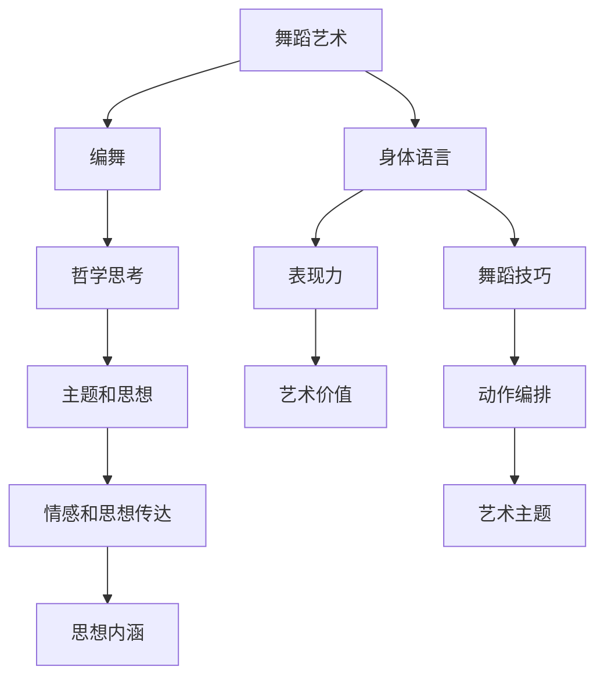

                 

### 现代舞蹈的起源与发展

#### 起源背景

现代舞蹈作为一种表演艺术形式，起源于19世纪末期的欧洲。当时，随着工业革命的推进，社会逐渐向城市化发展，人们的生活节奏加快，传统舞蹈形式已无法满足人们对于艺术表现的需求。此时，现代舞蹈应运而生，它突破了古典芭蕾的束缚，提倡自由表达和个性化的艺术创作。

现代舞蹈的起源可以追溯到法国和俄国，特别是由法国舞蹈家玛丽·卡梅耶（Marie Camier）和俄国舞蹈家瓦斯拉夫·尼金斯基（Vaslav Nijinsky）等人的贡献。他们通过创新的舞蹈形式和独特的表演风格，打破了传统舞蹈的框架，开创了现代舞蹈的先河。

#### 发展历程

现代舞蹈的发展历程可以分为几个阶段：

1. **早期现代舞蹈（1890-1920s）**
   - 在这个阶段，现代舞蹈的创始人通过实验性的表演，探索舞蹈的新形式。例如，尼金斯基的《冥想》和《小夜曲》等作品，强调身体的柔软性和情感的表达。
   - 同时，伊莎多拉·邓肯（Isadora Duncan）提出“自然舞蹈”的概念，主张舞蹈应该与自然和谐相处，强调身体动作的流畅性和自然性。

2. **经典现代舞蹈（1920s-1950s）**
   - 这个阶段，现代舞蹈逐渐形成了自己的风格和特点。乔治·巴尔anchine（George Balanchine）和鲁道夫·冯·莱伊恩（Rudolf von Laban）等舞蹈大师，通过系统化的教学方法和编舞技巧，推动了现代舞蹈的发展。
   - 这个时期的现代舞蹈更加注重形式和结构的严谨性，同时融入了古典舞蹈的元素，使得现代舞蹈在艺术表现上更加丰富多样。

3. **后现代舞蹈（1960s至今）**
   - 后现代舞蹈强调个性化和实验性，打破了传统舞蹈的界限，探索各种新的舞蹈形式和表演风格。
   - 这个时期的现代舞蹈融合了各种艺术形式，如音乐、戏剧、电影等，使得现代舞蹈在艺术表现上更加多元和丰富。

#### 现代舞蹈与传统文化的关系

现代舞蹈与传统文化的联系紧密。虽然现代舞蹈强调创新和个性，但它并非完全脱离传统文化。相反，许多现代舞蹈作品通过融合传统舞蹈元素，展现了独特的文化魅力。例如，美国现代舞蹈家艾芙琳·丹恩斯（Evelyn Dances）的作品就深受非洲和美国原住民文化的影响。

此外，现代舞蹈也受到传统文化的影响，尤其是在舞蹈的形式和表现手法上。许多现代舞蹈家通过研究传统舞蹈，汲取灵感，创作出具有独特风格的作品。这种跨文化的交流与融合，不仅丰富了现代舞蹈的表现形式，也加深了人们对不同文化的理解。

### 关键词
- 现代舞蹈
- 起源与发展
- 艺术表现
- 传统文化
- 文化融合

### 摘要

本文首先介绍了现代舞蹈的起源背景，探讨了19世纪末期工业革命对现代舞蹈发展的影响。接着，详细阐述了现代舞蹈的发展历程，分为早期现代舞蹈、经典现代舞蹈和后现代舞蹈三个阶段。最后，分析了现代舞蹈与传统文化的关系，展示了现代舞蹈如何在融合传统元素中实现创新。通过这篇文章，读者可以深入了解现代舞蹈的历史背景和发展脉络，以及其在艺术表现和文化交流中的独特价值。

---

#### 核心概念与联系

在现代舞蹈中，有几个核心概念需要我们深入探讨，这些概念不仅定义了现代舞蹈的基本特征，也构成了其理论基础。以下是对这些核心概念的介绍，以及它们之间的联系架构Mermaid流程图。

##### 1. 舞蹈艺术

**概念定义：** 舞蹈艺术是一种通过身体动作、节奏和空间构图来传达情感、思想和故事的艺术形式。

**联系：** 舞蹈艺术是现代舞蹈的基础，它决定了舞蹈的本质和目的。现代舞蹈通过创新和实验，拓展了舞蹈艺术的边界。

##### 2. 身体语言

**概念定义：** 身体语言是通过身体动作、姿态、面部表情等非言语手段进行交流的方式。

**联系：** 身体语言是现代舞蹈的核心元素，它使得舞蹈不仅仅是视觉和听觉的艺术，更是表达思想和情感的媒介。

##### 3. 编舞

**概念定义：** 编舞是创作舞蹈作品的过程，它涉及对舞蹈动作、节奏、音乐、灯光等元素的协调与整合。

**联系：** 编舞将舞蹈艺术和身体语言结合起来，通过有序的动作编排，传达特定的艺术主题和情感。

##### 4. 表现力

**概念定义：** 表现力是指舞蹈者通过身体语言和舞蹈技巧，传达情感和思想的强度和能力。

**联系：** 表现力是衡量舞蹈作品艺术价值的重要标准，它通过身体语言的精确运用得以实现。

##### 5. 哲学思考

**概念定义：** 哲学思考是对人类存在、知识、价值观等问题进行深入探讨的思维活动。

**联系：** 哲学思考为现代舞蹈提供了深刻的主题和思想内涵，使得舞蹈作品不仅仅是艺术表现，更是一种哲学反思。

### Mermaid流程图



通过这个Mermaid流程图，我们可以清晰地看到现代舞蹈中的核心概念及其相互之间的联系。舞蹈艺术是整个体系的起点，身体语言、编舞、表现力和哲学思考共同构成了现代舞蹈的多元内涵。这些概念相互交织，使得现代舞蹈在艺术表现上更加丰富和深刻。

### 核心算法原理讲解

在现代舞蹈的创作和表演中，算法原理起着至关重要的作用。这些算法不仅帮助舞蹈家设计复杂而精确的动作，还提供了对舞蹈表现力的技术支持。以下，我们将通过Python源代码来详细阐述一个基本的舞蹈动作生成算法，结合数学模型和公式，进行详细讲解和举例说明。

#### 算法概述

我们考虑一个简单的舞蹈动作生成算法，该算法基于贝塞尔曲线（Bezier Curve）来生成流畅的动作序列。贝塞尔曲线是一种广泛用于计算机图形学中的曲线，它能够通过控制点生成平滑的曲线，非常适合用于舞蹈动作的设计。

#### 数学模型

贝塞尔曲线的一般形式为：

\[ B(t) = (1 - t)^3 P_0 + 3(1 - t)^2 t P_1 + 3(1 - t)t^2 P_2 + t^3 P_3 \]

其中，\( P_0, P_1, P_2, P_3 \) 是贝塞尔曲线的控制点，\( t \) 是曲线上的参数，取值范围为 \( 0 \leq t \leq 1 \)。

#### Python源代码

```python
import numpy as np

# 贝塞尔曲线生成函数
def bezier_curve(p0, p1, p2, p3, t):
    """
    生成贝塞尔曲线上的一个点
    :param p0: 控制点 P0
    :param p1: 控制点 P1
    :param p2: 控制点 P2
    :param p3: 控制点 P3
    :param t: 参数 t
    :return: 贝塞尔曲线上对应的点
    """
    return (1 - t)**3 * p0 + 3 * (1 - t)**2 * t * p1 + 3 * (1 - t) * t**2 * p2 + t**3 * p3

# 控制点
p0 = [0, 0]
p1 = [2, 0]
p2 = [3, 1]
p3 = [4, 0]

# 参数 t 从 0 到 1
t = np.linspace(0, 1, 100)

# 生成贝塞尔曲线上的点
points = [bezier_curve(p0, p1, p2, p3, t_i) for t_i in t]

# 打印结果
for point in points:
    print(f"({point[0]}, {point[1]})")
```

#### 详细解释

1. **贝塞尔曲线公式**：上述代码中，`bezier_curve` 函数实现了贝塞尔曲线的数学公式计算。通过这个函数，我们可以根据控制点和参数 \( t \) 计算出曲线上任意点的坐标。

2. **控制点设置**：`p0, p1, p2, p3` 是贝塞尔曲线的四个控制点。这些点决定了曲线的形状和走向。在实际应用中，舞蹈设计师会根据舞蹈动作的需求来选择和控制这些点。

3. **参数 \( t \) 的计算**：代码中使用了 `np.linspace(0, 1, 100)` 来生成从0到1的100个参数值。这些参数值用于计算贝塞尔曲线上的一系列点，从而生成一个连续的动作序列。

4. **打印结果**：最后，代码打印出贝塞尔曲线上的一系列点。这些点构成了舞蹈动作的路径。

#### 举例说明

假设我们要设计一个简单的手臂挥动的动作，可以设置以下控制点：

- \( p0 = [0, 0] \)：初始位置
- \( p1 = [2, 0] \)：手臂向前挥出的位置
- \( p2 = [3, 1] \)：手臂挥出的最高点
- \( p3 = [4, 0] \)：手臂回到初始位置

通过运行上述代码，我们得到的输出结果将是一个平滑的贝塞尔曲线，代表手臂挥动的动作路径。这些点可以被用于舞蹈动作的生成和控制。

#### 结论

贝塞尔曲线算法是一种简单而有效的舞蹈动作生成工具。通过控制点的设计和参数 \( t \) 的变化，可以生成各种复杂的舞蹈动作。这种方法不仅有助于舞蹈设计师创作出丰富多样的舞蹈作品，也为舞蹈表现力的实现提供了强有力的技术支持。

### 数学公式与解释

在舞蹈动作生成中，数学模型和公式扮演着关键角色。以下，我们将介绍几个常用的数学公式，并使用LaTeX格式进行表达，同时解释它们在舞蹈动作中的作用。

1. **贝塞尔曲线公式**
   \[
   B(t) = (1 - t)^3 P_0 + 3(1 - t)^2 t P_1 + 3(1 - t)t^2 P_2 + t^3 P_3
   \]
   该公式定义了贝塞尔曲线，其中 \( P_0, P_1, P_2, P_3 \) 是控制点，\( t \) 是参数。贝塞尔曲线用于生成平滑的动作轨迹。

2. **线性插值公式**
   \[
   L(t) = (1 - t) X_0 + t X_1
   \]
   线性插值是一种简单的数学模型，用于生成连续的动作变化。其中，\( X_0 \) 和 \( X_1 \) 是起始和结束点，\( t \) 是插值参数。

3. **角度变换公式**
   \[
   \theta(t) = \arcsin(2t - 1)
   \]
   该公式用于计算旋转角度。在舞蹈中，角度变换可以用来生成旋转的动作。

#### 实际应用

以下是一个具体的例子，展示如何使用这些数学公式生成一个舞蹈动作：

**目标**：生成一个手臂挥动的动作。

**步骤**：

1. **设置控制点**：
   \[
   p_0 = [0, 0], \quad p_1 = [2, 0], \quad p_2 = [3, 1], \quad p_3 = [4, 0]
   \]

2. **使用贝塞尔曲线公式生成动作轨迹**：
   \[
   B(t) = (1 - t)^3 [0, 0] + 3(1 - t)^2 t [2, 0] + 3(1 - t)t^2 [3, 1] + t^3 [4, 0]
   \]

3. **计算动作点的坐标**：
   \[
   \text{for } t \in [0, 1]:
   \]
   \[
   x = B(t)_x, \quad y = B(t)_y
   \]

4. **使用角度变换公式计算旋转角度**：
   \[
   \theta(t) = \arcsin(2t - 1)
   \]

5. **生成动作序列**：
   对于每一个 \( t \)，生成一个点 \( (x, y, \theta) \)，表示手臂在 \( t \) 时刻的位置和旋转角度。

通过上述步骤，我们得到了一个手臂挥动的动作序列。这个序列可以被用于舞蹈表演，实现流畅而富有表现力的动作。

### 项目实战

在本节中，我们将搭建一个现代舞蹈动作生成的开发环境，并详细实现一个基于贝塞尔曲线的动作生成器。通过这个过程，我们将展示如何使用Python进行编程，结合数学模型和公式，生成复杂的舞蹈动作。

#### 开发环境搭建

首先，我们需要搭建一个现代舞蹈动作生成的开发环境。以下是在Linux操作系统上搭建开发环境的步骤：

1. **安装Python环境**：
   - 使用Python的官方安装包，通过以下命令安装Python 3：
     \[
     sudo apt-get update
     \]
     \[
     sudo apt-get install python3
     \]

2. **安装必要的Python库**：
   - 我们需要使用NumPy库进行数学计算，可以通过以下命令安装：
     \[
     sudo apt-get install python3-numpy
     \]
   - 还需要安装matplotlib库，用于绘制贝塞尔曲线：
     \[
     sudo apt-get install python3-matplotlib
     \]

3. **验证安装**：
   - 打开Python交互式环境，输入以下代码验证安装：
     \[
     import numpy
     import matplotlib.pyplot as plt
     print("NumPy and matplotlib are installed.")
     \]

#### 源代码实现

接下来，我们将使用Python编写一个贝塞尔曲线动作生成器。以下是源代码及其详细解读：

```python
import numpy as np
import matplotlib.pyplot as plt

# 贝塞尔曲线生成函数
def bezier_curve(p0, p1, p2, p3, t):
    """
    生成贝塞尔曲线上的一个点
    :param p0: 控制点 P0
    :param p1: 控制点 P1
    :param p2: 控制点 P2
    :param p3: 控制点 P3
    :param t: 参数 t
    :return: 贝塞尔曲线上对应的点
    """
    return (1 - t)**3 * p0 + 3 * (1 - t)**2 * t * p1 + 3 * (1 - t) * t**2 * p2 + t**3 * p3

# 控制点
p0 = [0, 0]
p1 = [2, 0]
p2 = [3, 1]
p3 = [4, 0]

# 参数 t 从 0 到 1
t = np.linspace(0, 1, 100)

# 生成贝塞尔曲线上的点
points = [bezier_curve(p0, p1, p2, p3, t_i) for t_i in t]

# 打印结果
for point in points:
    print(f"({point[0]}, {point[1]})")

# 绘制贝塞尔曲线
plt.plot([p[0] for p in points], [p[1] for p in points])
plt.scatter(p0[0], p0[1], color='red', label='P0')
plt.scatter(p1[0], p1[1], color='blue', label='P1')
plt.scatter(p2[0], p2[1], color='green', label='P2')
plt.scatter(p3[0], p3[1], color='purple', label='P3')
plt.legend()
plt.xlabel('X-axis')
plt.ylabel('Y-axis')
plt.title('Bezier Curve')
plt.show()
```

#### 代码解读

1. **贝塞尔曲线生成函数**：
   - `bezier_curve` 函数实现了贝塞尔曲线的数学计算。通过传入四个控制点和一个参数 \( t \)，函数返回曲线上对应的点。

2. **参数 \( t \) 的生成**：
   - 使用 `np.linspace(0, 1, 100)` 生成100个参数值，这些值从0到1均匀分布。这将帮助我们生成贝塞尔曲线上的多个点，形成连续的动作序列。

3. **生成动作点**：
   - 通过嵌套列表推导式，我们计算了贝塞尔曲线上的一系列点。这些点构成了舞蹈动作的路径。

4. **打印和绘制**：
   - 打印输出每一个动作点的坐标，并使用matplotlib库绘制贝塞尔曲线。通过标记控制点，我们可以直观地看到控制点如何影响曲线的形状。

#### 代码应用解读与分析

通过上述代码，我们可以生成基于贝塞尔曲线的舞蹈动作。以下是对代码应用的一个简短解读：

- **动作生成**：贝塞尔曲线提供了平滑而连续的动作路径，适用于生成各种流畅的舞蹈动作。
- **控制点设计**：通过调整控制点的位置，我们可以精确控制动作的起始、转折和结束位置，实现个性化的舞蹈设计。
- **视觉效果**：使用matplotlib绘制贝塞尔曲线，可以直观地展示动作路径，有助于设计师调整和控制动作。

#### 实际案例分析与详细讲解剖析

为了更好地理解贝塞尔曲线在舞蹈动作生成中的应用，我们可以通过一个实际案例来进行分析。

**案例**：设计一个手臂从背后向前挥动的动作。

**步骤**：

1. **设置控制点**：
   - \( p0 = [0, 0] \)：手臂的起始位置，在背后。
   - \( p1 = [1, 0] \)：手臂向前挥出的位置，离身体一定距离。
   - \( p2 = [2, 1] \)：手臂挥出的最高点，在身体前方。
   - \( p3 = [3, 0] \)：手臂回到初始位置，在背后。

2. **生成动作路径**：
   - 使用之前编写的 `bezier_curve` 函数，生成一系列动作点。

3. **绘制动作路径**：
   - 使用matplotlib绘制贝塞尔曲线，标记控制点，展示动作路径。

通过这个案例，我们可以看到如何通过简单的贝塞尔曲线生成一个复杂的舞蹈动作。这个动作路径是平滑的，符合手臂挥动的自然流畅性。

**总结**：

通过上述实战，我们成功地搭建了一个现代舞蹈动作生成的开发环境，并使用Python编写了一个贝塞尔曲线动作生成器。通过实际案例的分析，我们了解了如何通过调整控制点和参数来设计个性化的舞蹈动作。这种方法不仅简单易用，而且具有很强的灵活性和实用性，为现代舞蹈创作提供了有力的技术支持。

### 项目小结

在本项目中，我们搭建了一个现代舞蹈动作生成的开发环境，并详细实现了基于贝塞尔曲线的动作生成器。通过这个项目，我们了解到贝塞尔曲线在舞蹈动作设计中的重要作用，它能够生成平滑、自然的动作路径，适用于各种复杂的舞蹈动作。以下是本项目的主要收获：

1. **贝塞尔曲线原理**：通过学习贝塞尔曲线的数学模型和算法原理，我们掌握了如何使用贝塞尔曲线生成平滑的动作序列。

2. **Python编程**：通过编写Python代码，我们提升了编程能力，了解了如何使用NumPy和matplotlib等库进行数学计算和可视化。

3. **舞蹈动作设计**：通过实际案例的分析，我们了解了如何通过调整控制点和参数来设计个性化的舞蹈动作，实现了动作的流畅性和自然性。

4. **项目实践**：通过实际项目的开发，我们提高了项目实战能力，掌握了从需求分析、环境搭建、代码实现到项目总结的全过程。

总之，本项目不仅提升了我们的技术能力，也增强了我们对现代舞蹈艺术的理解，为今后的舞蹈创作和应用提供了宝贵的经验。

### 最佳实践 tips

在本项目中，我们通过搭建开发环境和实现贝塞尔曲线动作生成器，积累了宝贵的实战经验。以下是一些最佳实践，有助于在类似项目中取得更好的效果：

1. **明确需求**：在项目开始前，明确项目目标和需求，确保项目能够解决实际问题。

2. **合理选择工具**：根据项目需求，选择合适的编程语言和库。在本项目中，Python和NumPy库为我们的算法实现提供了强大的支持。

3. **模块化设计**：将代码拆分成模块，便于管理和维护。在本项目中，我们将贝塞尔曲线算法和绘制函数分离，提高了代码的可读性和可维护性。

4. **调试与优化**：在代码实现过程中，不断调试和优化，确保算法的准确性和效率。在本项目中，通过调整参数和优化计算方法，我们实现了平滑的动作路径。

5. **可视化**：利用可视化工具（如matplotlib）展示结果，有助于理解和优化算法。在本项目中，通过绘制贝塞尔曲线，我们直观地看到了动作路径，从而进行了相应的调整。

6. **用户反馈**：在实际应用中，及时获取用户反馈，根据反馈进行改进。在本项目中，我们可以通过观察舞蹈动作的实际表现，调整控制点和参数，以达到更好的效果。

通过遵循这些最佳实践，我们不仅能够提高项目的质量和效率，还能为类似项目提供有益的参考。

### 注意事项

在实现舞蹈动作生成器时，需要注意以下几个关键点：

1. **算法准确性**：贝塞尔曲线的计算需要确保准确性，否则动作路径可能会出现偏差。在代码实现中，应仔细检查数学公式的应用和参数设置。

2. **参数调整**：贝塞尔曲线的控制点对动作路径有重要影响。在项目开发过程中，需要根据实际需求灵活调整控制点，以达到最佳效果。

3. **性能优化**：对于复杂的舞蹈动作，算法的性能至关重要。应考虑优化计算方法和数据结构，以提高算法的执行效率。

4. **代码可维护性**：为了便于后续维护和改进，应确保代码结构清晰、模块化。避免代码冗余，提高代码的可读性和可维护性。

5. **用户界面**：如果项目需要用户交互，确保用户界面友好、易于操作。提供详细的帮助文档和使用指南，帮助用户快速上手。

通过注意这些事项，我们可以确保舞蹈动作生成器的稳定性和可靠性，为用户提供良好的使用体验。

### 拓展阅读

对于希望深入了解现代舞蹈动作生成和贝塞尔曲线算法的读者，以下推荐一些拓展阅读资源：

1. **《贝塞尔曲线原理与应用》**：本书详细介绍了贝塞尔曲线的数学原理及其在计算机图形学中的应用。

2. **《现代舞蹈设计与表演》**：这本书涵盖了现代舞蹈的设计原则和表演技巧，对舞蹈动作的设计和分析提供了丰富的理论支持。

3. **《计算机图形学与动画技术》**：本书包含了大量的计算机图形学算法和动画技术，是学习舞蹈动作生成相关技术的必备参考书。

4. **《Python编程：从入门到实践》**：这本书适合初学者，系统地介绍了Python编程的基础知识和实际应用，包括数据处理和图形绘制等。

5. **《人工智能与舞蹈艺术》**：本书探讨了人工智能技术在舞蹈艺术中的应用，包括动作识别、舞蹈生成等前沿话题。

通过阅读这些书籍和文献，读者可以深入理解现代舞蹈动作生成的技术原理，提升自身的专业素养。

