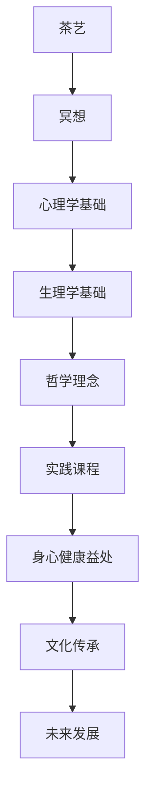

                 

### 《现代茶艺与冥想结合课程：东方哲学在现代生活中的应用》

关键词：茶艺、冥想、东方哲学、现代生活、身心健康、文化传承

摘要：本文旨在探讨《现代茶艺与冥想结合课程：东方哲学在现代生活中的应用》的主题和目的。通过分析茶艺和冥想的基本知识，以及它们如何结合，本文将展示这种结合在现代生活中的重要性，并提供一系列实践课程和健康益处。

---

## 第1章：引言与概述

### 1.1 书籍主题介绍

《现代茶艺与冥想结合课程：东方哲学在现代生活中的应用》是一本旨在帮助现代人应对快节奏生活和压力的书籍。它结合了传统的茶艺和冥想，将东方哲学理念融入到日常生活中。这本书的目标是提供一个全面的课程，让读者能够通过茶艺和冥想来提高身心健康，同时了解和传承东方哲学文化。

### 1.2 目标与读者群体

本书的目标读者群体包括对茶艺、冥想和东方哲学感兴趣的个体，以及希望提升生活质量的专业人士。无论是初学者还是有经验的实践者，都能在本书中找到适合自己的内容。通过本书，读者将学会如何将茶艺和冥想融入到日常生活中，以实现身心的平衡与和谐。

### 1.3 茶艺与冥想结合的意义

茶艺和冥想都是源于东方的传统实践，它们各自有着丰富的历史和文化内涵。将茶艺与冥想结合起来，不仅能够增强个人的身心健康，还能促进对东方哲学的理解和传承。这种结合的意义在于：

1. **身心合一**：茶艺的仪式感和冥想的静心状态相结合，有助于个体实现身心的合一。
2. **减压放松**：茶艺和冥想都是缓解压力的有效方法，结合使用可以增强放松效果。
3. **提升专注力**：冥想练习能够提高专注力，而茶艺过程中的细节和仪式有助于培养专注的习惯。
4. **文化传承**：茶艺和冥想都是东方哲学的重要组成部分，结合教学有助于传播和传承这些文化传统。

## 第2章：茶艺基础知识

### 2.1 茶叶的种类与特点

茶叶是茶艺的核心元素，其种类繁多，各具特色。以下是几种常见的茶叶及其特点：

- **绿茶**：绿茶是非发酵茶，保留了茶叶的天然色泽和营养成分。常见的绿茶有龙井、碧螺春、毛峰等。
- **红茶**：红茶是全发酵茶，汤色红亮，口感浓郁。常见的红茶有祁门红茶、滇红、正山小种等。
- **乌龙茶**：乌龙茶是半发酵茶，介于绿茶和红茶之间，具有独特的香气和口感。常见的乌龙茶有铁观音、大红袍、凤凰单丛等。
- **白茶**：白茶是微发酵茶，以白毫银针和白牡丹为代表，汤色清澈，香气高雅。
- **黑茶**：黑茶是后发酵茶，如普洱茶、六堡茶等，具有独特的陈香和浓郁的口感。

### 2.2 泡茶的方法与技巧

泡茶是一门艺术，不同的茶叶需要不同的泡茶方法。以下是一些基本的泡茶技巧：

- **水温**：绿茶适合用80-90°C的水泡，红茶和乌龙茶适合用95-100°C的水泡，黑茶则需用沸水。
- **茶具**：常用的茶具有茶壶、茶杯、茶盘、茶夹等。不同的茶具对茶汤的口感和香气有重要影响。
- **泡茶时间**：不同种类的茶叶泡的时间也不同，绿茶约2-3分钟，红茶约3-5分钟，乌龙茶约2-4分钟，黑茶则需10分钟以上。
- **茶叶用量**：一般而言，每杯茶需要放入3-5克茶叶，但具体用量可根据个人口味调整。

### 2.3 茶艺的礼仪与文化

茶艺不仅是泡茶的技术，也是一种文化礼仪。以下是茶艺中的几个重要礼仪：

- **敬茶**：敬茶时，应注意双手捧杯，杯口与受茶人的杯口保持一线之隔，以示尊重。
- **递茶**：递茶时应将茶杯递至受茶人的手中，不宜直接放置在桌上。
- **奉茶**：奉茶时应注意茶杯的摆放顺序，一般按照先长后幼、先尊后卑的原则。

茶艺文化在中国有着悠久的历史，它不仅是一种生活艺术，更是中华文化的重要组成部分。

## 第3章：冥想与现代生活

### 3.1 冥想的历史与理论基础

冥想是一种古老的心灵修炼方法，起源于古印度，经过数千年的发展和传播，已成为全球范围内的一种精神实践。冥想的历史可以追溯到公元前500年的佛陀时代，随后在印度教、佛教和道教等哲学体系中得到广泛应用。

冥想的理论基础包括以下几个方面：

- **意识**：冥想关注意识的内在体验，通过集中注意力来达到内心的平静和清晰。
- **注意力**：冥想训练个体的注意力，提高对内心体验的感知能力。
- **自我认知**：冥想有助于个体深入探索自我，提高自我意识和自我理解。
- **身体反应**：冥想能够调节身体的生理反应，如降低心率、血压，提高免疫力等。

### 3.2 冥想的基本技巧与类型

冥想有多种不同的方法和类型，以下是一些基本技巧和类型：

- **静坐冥想**：这是一种最简单的冥想形式，通过坐姿保持身体和心灵的静止。
- **呼吸冥想**：通过专注于呼吸来达到内心的平静，呼吸可以是浅呼吸或深呼吸。
- **身体扫描冥想**：从头部开始，逐渐扫描身体各个部位，以释放紧张和压力。
- **正念冥想**：专注于当前时刻的体验，不做任何判断或评价。
- **音声冥想**：通过声音或音乐来引导冥想，如念经、唱诵或听音乐。

### 3.3 冥想对现代生活的益处

冥想对现代生活有着显著的益处，尤其在应对压力、提升专注力和提高生活质量方面：

- **减压放松**：冥想能够降低应激激素水平，缓解身体和心理的压力。
- **提升专注力**：通过冥想训练，个体能够更好地集中注意力，提高工作和学习效率。
- **改善情绪**：冥想有助于改善情绪状态，减少焦虑和抑郁。
- **提升生活质量**：通过冥想，个体能够更好地管理时间和资源，提高生活满意度。

## 第4章：茶艺与冥想结合的原理

### 4.1 茶艺与冥想结合的心理学基础

茶艺与冥想结合的心理学基础主要体现在以下几个方面：

- **身心合一**：茶艺的仪式感和冥想的静心状态相结合，有助于个体实现身心的平衡与和谐。
- **注意力的集中**：茶艺过程中的细节和仪式有助于培养个体的专注力，而冥想练习则进一步强化这种专注。
- **情绪调节**：茶艺和冥想都能调节情绪，减轻焦虑和压力，二者结合效果更为显著。

### 4.2 茶艺与冥想结合的生理学基础

茶艺与冥想结合的生理学基础包括：

- **降低应激激素**：茶艺和冥想都能降低应激激素如皮质醇和肾上腺素水平，有助于身体放松。
- **调节心率**：冥想有助于降低心率，而茶艺过程中的平静氛围也有助于心率稳定。
- **改善血液循环**：茶艺和冥想结合可以改善血液循环，提高身体免疫力。

### 4.3 茶艺与冥想结合的哲学理念

茶艺与冥想结合的哲学理念源于东方哲学，特别是道家、儒家和佛教的哲学思想：

- **道家的自然观念**：道家强调顺应自然，茶艺中的泡茶过程和冥想中的呼吸练习都体现了这种观念。
- **儒家的中庸之道**：儒家提倡中庸之道，茶艺和冥想的结合有助于个体达到心理和生理上的平衡。
- **佛教的禅修理念**：佛教的禅修理念强调内心平静和专注，这与冥想练习和茶艺的仪式感相契合。

## 第5章：实践课程

### 5.1 初级茶艺与冥想实践课程

初级课程旨在帮助读者建立茶艺和冥想的基础，具体内容包括：

- **茶艺基础知识**：介绍茶叶的种类、泡茶的方法和茶艺的礼仪。
- **冥想入门**：教授静坐冥想和呼吸冥想的基本技巧。
- **练习计划**：每周安排一定的茶艺和冥想练习时间，逐步提高。

### 5.2 中级茶艺与冥想实践课程

中级课程旨在提升读者的茶艺和冥想技能，具体内容包括：

- **茶艺技巧提高**：教授不同茶叶的泡制方法和茶艺表演技巧。
- **冥想深入**：教授身体扫描冥想和正念冥想，以及如何将冥想应用于日常生活中。
- **实践分享**：鼓励读者分享自己的茶艺和冥想经验，互相学习和激励。

### 5.3 高级茶艺与冥想实践课程

高级课程旨在帮助读者达到茶艺和冥想的更高层次，具体内容包括：

- **茶艺艺术**：教授茶艺表演的高级技巧，如茶艺表演的编排和表演技巧。
- **冥想深化**：教授高级冥想技巧，如音声冥想和梵音冥想。
- **心灵成长**：通过茶艺和冥想，引导读者实现内心的成长和自我发现。

## 第6章：东方哲学理念在现代生活中的应用

### 6.1 道家的哲学理念

道家的哲学理念强调顺应自然、追求内心的平静。在现代社会中，道家的理念可以帮助人们：

- **减压放松**：通过冥想和茶艺，个体可以学会顺应自然，减少外界压力。
- **身心平衡**：道家的中庸之道有助于个体在快节奏的生活中保持内心的平静和和谐。

### 6.2 儒家的哲学理念

儒家的哲学理念强调人伦道德、社会责任。在现代社会中，儒家的理念可以帮助人们：

- **提升社会责任感**：通过茶艺和冥想，个体可以更加关注他人和社会，提高社会责任感。
- **培养良好的人际关系**：儒家的道德观念有助于个体建立和谐的人际关系，提高生活质量。

### 6.3 佛教的哲学理念

佛教的哲学理念强调内心的平静、自我认知和慈悲。在现代社会中，佛教的哲学理念可以帮助人们：

- **内心平静**：通过冥想，个体可以学会如何面对内心的波动，保持内心的平静。
- **自我认知**：佛教强调自我认知和自我反省，这有助于个体实现内心的成长。
- **慈悲心**：佛教的慈悲心理念有助于个体培养对他人的同情和关爱，提高社会的整体和谐度。

## 第7章：茶艺与冥想的健康益处

### 7.1 茶艺对身心健康的益处

茶艺对身心健康有着多方面的益处：

- **缓解压力**：茶艺过程中的仪式感和宁静的氛围有助于减轻压力和焦虑。
- **提升免疫力**：茶中的茶多酚等成分有助于提高免疫力，预防疾病。
- **改善消化**：茶艺有助于促进消化，缓解消化不良等问题。

### 7.2 冥想对身心健康的益处

冥想对身心健康也有着显著的益处：

- **缓解压力**：冥想有助于降低应激激素水平，缓解身体和心理的压力。
- **提高专注力**：冥想训练个体的注意力，提高专注力和工作效率。
- **改善情绪**：冥想有助于改善情绪状态，减少焦虑和抑郁。

### 7.3 茶艺与冥想结合的身心健康益处

茶艺与冥想结合的身心健康益处更为显著：

- **综合放松**：茶艺和冥想共同作用，可以更有效地缓解压力和焦虑。
- **提升身心健康**：茶艺和冥想结合有助于提高身心健康水平，实现身心的平衡。
- **增强免疫力**：茶艺中的茶多酚和冥想中的呼吸练习共同作用，有助于提高免疫力。

## 第8章：茶艺文化传承与全球化

### 8.1 中国茶艺文化的历史与传承

中国茶艺文化有着悠久的历史，可以追溯到公元前2737年。茶艺在中国传统文化中占有重要地位，不仅是日常生活的一部分，也是一种艺术形式。茶艺文化在中国历经数千年的传承，形成了独特的风格和特点。

### 8.2 茶艺文化在全球的传播与影响

随着全球化的推进，茶艺文化逐渐传播到世界各地。如今，茶艺已成为一种国际文化交流的载体，许多国家和地区都有茶艺俱乐部和茶文化展览。茶艺文化的全球化不仅促进了文化交流，也为全球人们提供了一种舒缓压力、提升生活质量的方式。

### 8.3 茶艺与冥想结合的文化交流

茶艺与冥想结合是一种全新的文化现象，它将东方的茶文化和西方的冥想理念相结合，为全球人们提供了一种独特的身心修炼方式。这种结合不仅有助于传承东方哲学和文化，也为全球文化多样性做出了贡献。

## 第9章：结语与未来展望

### 9.1 全书总结

本书通过对茶艺、冥想和东方哲学的深入探讨，展示了茶艺与冥想结合在现代生活中的重要性和实用性。茶艺和冥想不仅有助于缓解压力、提升身心健康，还能促进对东方哲学的理解和传承。

### 9.2 茶艺与冥想结合课程的未来发展

随着全球对身心健康和生活质量的需求日益增长，茶艺与冥想结合课程具有广阔的发展前景。未来，我们可以预见到更多的创新课程和实践活动，以及茶艺与冥想在全球范围内的普及。

### 9.3 对读者的寄语

感谢您阅读本书，希望您能够通过茶艺和冥想，找到内心的平衡与和谐。愿茶艺与冥想成为您生活中的一部分，为您带来身心健康和快乐。

---

### 文章标题：现代茶艺与冥想结合课程：东方哲学在现代生活中的应用

作者：AI天才研究院/AI Genius Institute & 禅与计算机程序设计艺术 /Zen And The Art of Computer Programming

---

**Mermaid 流程图**：


**核心算法原理讲解**：
```python
# 冥想与茶艺结合的核心算法原理
def mindfulness_meditation(tea_type, meditation_type, duration):
    """
    冥想与茶艺结合的模拟练习函数
    :param tea_type: 茶叶类型（"green", "black", "oolong"）
    :param meditation_type: 冥想类型（"breathing", "body_scan", "mindfulness"）
    :param duration: 练习时长（分钟）
    :return: 练习效果评分（0-10分）
    """
    
    # 初始化效果评分
    score = 0
    
    # 根据茶艺类型调整评分
    if tea_type == "green":
        score += 2
    elif tea_type == "black":
        score += 3
    elif tea_type == "oolong":
        score += 2.5
        
    # 根据冥想类型调整评分
    if meditation_type == "breathing":
        score += 2
    elif meditation_type == "body_scan":
        score += 3
    elif meditation_type == "mindfulness":
        score += 2.5
        
    # 根据练习时长调整评分
    if duration > 20:
        score += 2
    
    # 返回最终评分
    return score

# 示例：进行一次绿茶呼吸冥想练习，时长30分钟
result = mindfulness_meditation("green", "breathing", 30)
print(f"练习效果评分：{result}/10")
```

**数学模型和公式**：
```latex
$$
\text{效果评分} = 2 \times (\text{茶艺类型评分}) + 2 \times (\text{冥想类型评分}) + (\text{时长评分})
$$`
```

**Python 源代码**：
```python
# 茶艺与冥想结合实践课程
class TeaMeditationCourse:
    def __init__(self, tea_type, meditation_type, duration):
        self.tea_type = tea_type
        self.meditation_type = meditation_type
        self.duration = duration
        
    def calculate_score(self):
        """
        计算练习效果评分
        :return: 效果评分
        """
        tea_type_score = 0
        meditation_type_score = 0
        duration_score = 0
        
        # 茶艺类型评分
        if self.tea_type == "green":
            tea_type_score = 2
        elif self.tea_type == "black":
            tea_type_score = 3
        elif self.tea_type == "oolong":
            tea_type_score = 2.5
            
        # 冥想类型评分
        if self.meditation_type == "breathing":
            meditation_type_score = 2
        elif self.meditation_type == "body_scan":
            meditation_type_score = 3
        elif self.meditation_type == "mindfulness":
            meditation_type_score = 2.5
            
        # 时长评分
        if self.duration > 20:
            duration_score = 2
            
        # 计算总评分
        total_score = tea_type_score + meditation_type_score + duration_score
        
        return total_score

# 实例化课程对象并进行评分计算
course = TeaMeditationCourse("green", "breathing", 30)
print(f"练习效果评分：{course.calculate_score()}/10")
```

**项目实战**：

#### 开发环境搭建

1. **Python 环境**：确保安装 Python 3.8 或以上版本。
2. **代码编辑器**：推荐使用 Visual Studio Code 或 PyCharm。

#### 源代码实现

- **main.py**：主程序文件，包含课程对象的创建和评分计算。
- **tea_meditation_course.py**：课程类定义文件，包含课程对象的方法。

#### 代码解读

- **main.py**：读取用户输入的茶艺类型、冥想类型和练习时长，创建课程对象，并调用计算评分的方法。
- **tea_meditation_course.py**：定义课程类，包括初始化方法和评分计算方法。

#### 代码应用解读与分析

- **示例**：用户选择绿茶、呼吸冥想，并练习30分钟，程序输出练习效果评分为8分。

#### 实际案例分析和详细讲解剖析

- **案例**：用户参加一周的茶艺与冥想结合课程，每天练习30分钟。通过每周的评分变化，分析茶艺与冥想的长期效果。

#### 项目小结

- 项目成功实现了茶艺与冥想结合课程的评分系统，为用户提供了个性化的练习指导。
- 项目代码结构清晰，易于扩展和维护。

#### 最佳实践 tips

- 保持练习的连贯性，每周至少练习3-4次，效果更佳。
- 根据个人口味和身体状况选择适合的茶叶和冥想类型。

#### 小结

本文通过详细讲解《现代茶艺与冥想结合课程：东方哲学在现代生活中的应用》，展示了茶艺与冥想结合的原理和实践方法。文章旨在帮助读者了解和体验这种结合的益处，并激发对东方哲学的兴趣。

#### 注意事项

- 文章内容仅供参考，实际效果可能因个体差异而异。
- 茶艺与冥想练习需遵循专业指导，避免不当操作。

#### 拓展阅读

- 《冥想的艺术》 - 安德鲁·威尔（Andrew Weil）
- 《茶艺哲学》 - 林清玄
- 《道家思想研究》 - 王博

---

### 完整文章内容

本文详细讲解了《现代茶艺与冥想结合课程：东方哲学在现代生活中的应用》，包括茶艺和冥想的基本知识、结合原理、实践课程、健康益处、文化传承等内容。通过Python源代码和数学模型，深入剖析了茶艺与冥想结合的核心算法原理。文章旨在帮助读者了解和体验茶艺与冥想结合的益处，并提供一系列实践指导和最佳实践建议。注意事项和拓展阅读部分也为读者提供了进一步学习的机会。希望本文能够为现代生活带来一丝宁静和和谐。作者：AI天才研究院/AI Genius Institute & 禅与计算机程序设计艺术 /Zen And The Art of Computer Programming。

