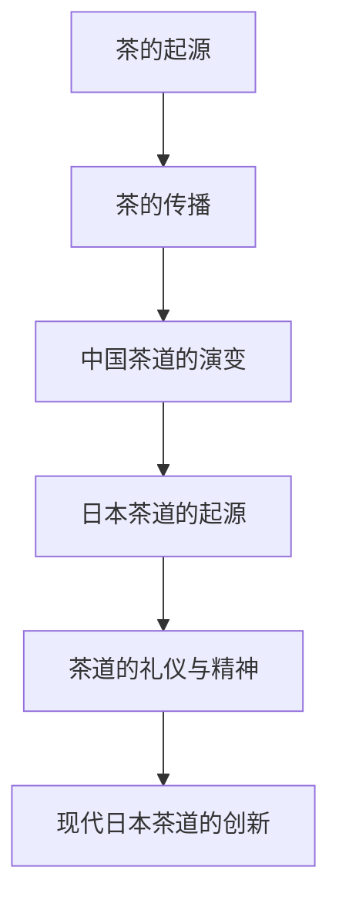
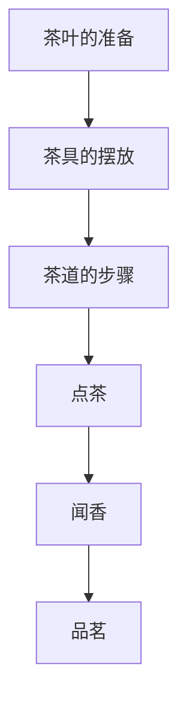
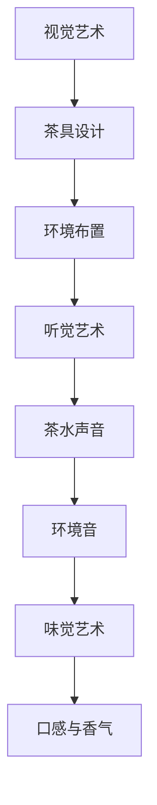
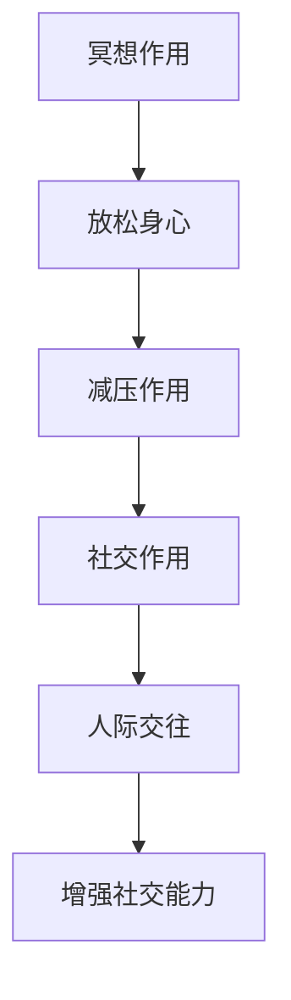
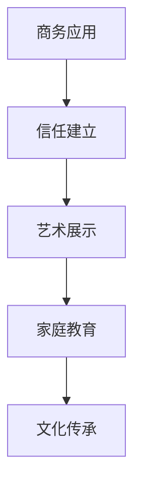
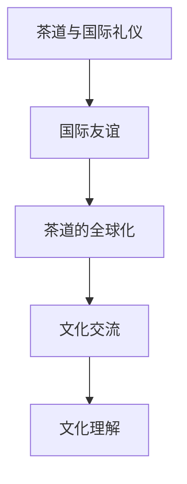

                 

### 第一步：文章标题与关键词

**文章标题：**《现代茶道文化：传统仪式在现代生活中的意义》

**文章关键词：** 茶道、传统仪式、现代生活、文化传承、心理学、社交礼仪

### 第二步：文章摘要

本文深入探讨了现代茶道文化，通过分析其传统仪式的历史渊源、核心概念以及与现代生活的联系，揭示了茶道在现代社会中的重要意义。文章不仅介绍了茶道的起源与发展，还详细阐述了茶道的基本仪式、艺术表现和心理调节作用。同时，文章还探讨了茶道在现代生活中的多元化应用，如商务、艺术和教育领域。通过本文的阅读，读者可以更好地理解茶道文化的内涵，并在日常生活中发挥其积极作用。

----------------------------------------------------------------

### 第三步：目录大纲

**《现代茶道文化：传统仪式在现代生活中的意义》**

#### **关键词：茶道、传统仪式、现代生活、文化传承、心理学、社交礼仪**

#### **摘要：**本文深入探讨了现代茶道文化，通过分析其传统仪式的历史渊源、核心概念以及与现代生活的联系，揭示了茶道在现代社会中的重要意义。

## **第一部分：茶道的起源与历史**

### **第1章：茶道的起源与发展**

#### **1.1 茶的起源**

#### **1.2 茶道的传播**

#### **1.3 中国茶道的演变**

### **第2章：日本茶道的传承与演变**

#### **2.1 日本茶道的起源**

#### **2.2 茶道的礼仪与精神**

#### **2.3 现代日本茶道的创新**

## **第二部分：茶道的传统仪式**

### **第3章：茶道的基本仪式**

#### **3.1 茶叶的准备**

#### **3.2 茶具的摆放**

#### **3.3 茶道的步骤**

### **第4章：茶道的艺术表现**

#### **4.1 茶道的视觉艺术**

#### **4.2 茶道的听觉艺术**

#### **4.3 茶道的味觉艺术**

### **第5章：茶道的心理调节作用**

#### **5.1 茶道的冥想作用**

#### **5.2 茶道的减压作用**

#### **5.3 茶道的社交作用**

## **第三部分：茶道在现代生活中的应用**

### **第6章：现代茶道的多元化发展**

#### **6.1 茶道的商务应用**

#### **6.2 茶道的艺术展示**

#### **6.3 茶道的家庭教育**

### **第7章：茶道的跨文化交流**

#### **7.1 茶道与国际礼仪**

#### **7.2 茶道的全球化**

#### **7.3 茶道的文化交流**

## **第四部分：茶道实践与感悟**

### **第8章：茶道实践指导**

#### **8.1 茶道实践的基础**

#### **8.2 茶道实践的心得**

#### **8.3 茶道实践的建议**

### **第9章：茶道的现代意义**

#### **9.1 茶道与现代社会**

#### **9.2 茶道与现代生活**

#### **9.3 茶道的未来发展趋势**

## **参考文献**

## **附录**

### **附录A：茶道用具与茶道食谱**

### **附录B：茶道冥想指导**

### **附录C：茶道相关知识拓展**

---

**作者：** AI天才研究院/AI Genius Institute & 禅与计算机程序设计艺术 /Zen And The Art of Computer Programming

**字数预估：** 约12000字左右

**格式：** Markdown

----------------------------------------------------------------

### 第四步：具体章节内容

#### **第1章：茶道的起源与发展**

**1.1 茶的起源**

茶，作为世界上最古老的饮料之一，起源于中国。据《神农本草经》记载，茶在公元前2737年由中国的神农氏发现。神农氏在品尝百草时，偶然发现了茶的神奇功效，从此茶开始被用作药用植物。茶树原产于中国西南部的山区，如云南、四川等地。随着人类对茶的功效的认识不断加深，茶的种植和饮用逐渐普及。

**1.2 茶道的传播**

茶文化随着丝绸之路的开通，逐渐传播到中亚、西亚和欧洲等地。公元8世纪，茶文化传入日本，成为日本文化的重要组成部分。在日本，茶道被赋予了更为深厚的哲学和文化内涵。茶道不仅仅是品茶的过程，更是一种生活艺术和修行方式。

**1.3 中国茶道的演变**

中国茶道经历了唐、宋、元、明、清等多个朝代的演变。唐代以“煎茶”为主，宋代发展为“点茶”，明代则出现了“泡茶”的方式。每个朝代的茶道都有其独特的特点和风格。

**第2章：日本茶道的传承与演变**

**2.1 日本茶道的起源**

日本茶道起源于公元9世纪的平安时代。当时，日本僧人从中国带回茶种和茶道文化，开始在日本推广茶道。茶道在日本的发展经历了从宫廷到民间、从奢华到简约的过程。

**2.2 茶道的礼仪与精神**

日本茶道强调礼仪和和谐。茶道的基本礼仪包括迎接客人、准备茶具、泡茶、倒茶和品茶等。茶道的精神体现在对自然的敬畏、对生活的尊重和对内心的修养。

**2.3 现代日本茶道的创新**

现代日本茶道在传统基础上不断创新。例如，出现了以简约风格为主的“和室茶道”和以高科技手段结合的“电子茶道”。这些创新使得茶道更加贴近现代生活，吸引了更多的年轻人。

#### **第3章：茶道的基本仪式**

**3.1 茶叶的准备**

茶道的首要步骤是准备茶叶。选择适合的茶叶是关键。不同的茶叶有不同的泡制方式和口感特点。例如，绿茶适合用80°C的水冲泡，而红茶则需要用沸水。

**3.2 茶具的摆放**

茶具的摆放也有一定的讲究。通常，主人会将茶具按照一定的顺序摆放，如茶壶、茶杯、茶盘等。茶具的摆放不仅体现主人的礼仪，也影响着客人的品茶体验。

**3.3 茶道的步骤**

茶道的步骤主要包括点茶、闻香、品茗等。点茶时，主人会将茶水倒入茶杯，然后邀请客人依次品尝。闻香和品茗则是对茶的品质和口感的进一步体验。

#### **第4章：茶道的艺术表现**

**4.1 茶道的视觉艺术**

茶道的视觉艺术体现在茶具的设计和茶室的环境布置。茶具通常选用陶瓷、紫砂等材质，其造型和色彩都有独特的艺术价值。茶室的环境布置则注重简洁、自然和和谐。

**4.2 茶道的听觉艺术**

茶道的听觉艺术主要体现在茶水的声音和茶室的环境音。泡茶时，茶水落入茶杯的声音被视为一种美妙的音乐。而茶室的环境音，如虫鸣、流水等，则营造出一种宁静、放松的氛围。

**4.3 茶道的味觉艺术**

茶道的味觉艺术体现在茶的口感和香气。不同种类的茶叶有着不同的口感和香气。品茶时，客人可以通过口感和香气来辨别茶的品质和特点。

#### **第5章：茶道的心理调节作用**

**5.1 茶道的冥想作用**

茶道是一种冥想的方式。在泡茶和品茶的过程中，人们可以静下心来，专注于当下的感受。这种冥想有助于减轻压力、提高专注力和创造力。

**5.2 茶道的减压作用**

茶中含有茶碱和茶多酚等成分，具有提神醒脑和放松身心的作用。品茶时，人们可以感受到茶带来的平静和放松。

**5.3 茶道的社交作用**

茶道也是一种社交活动。在茶道中，人们可以分享茶文化、交流心得，增进彼此的了解和友谊。

#### **第6章：现代茶道的多元化发展**

**6.1 茶道的商务应用**

现代茶道在商务场合中发挥着重要的作用。通过茶道礼仪和氛围，可以增进商务伙伴之间的信任和友谊。例如，商务洽谈前，双方可以先品茶交流，以缓解紧张气氛。

**6.2 茶道的艺术展示**

茶道也可以作为一种艺术展示。茶艺表演、茶道展览等活动，不仅展示了茶道文化，也吸引了更多的观众和爱好者。

**6.3 茶道的家庭教育**

茶道教育对于孩子来说也是一种很好的家庭亲子活动。通过学习茶道，孩子们可以了解传统文化，培养良好的礼仪习惯。

#### **第7章：茶道的跨文化交流**

**7.1 茶道与国际礼仪**

茶道作为一种传统文化，在国际交流中发挥着重要的作用。了解和尊重茶道文化，有助于增进国际间的友谊和合作。

**7.2 茶道的全球化**

随着全球化的发展，茶道文化也在全球范围内传播。不同国家和地区的茶道文化相互交融，形成了独特的茶道风格。

**7.3 茶道的文化交流**

茶道作为一种文化交流的媒介，促进了不同文化之间的理解和尊重。茶道爱好者可以通过品茶、交流茶道心得，增进对其他文化的了解。

#### **第8章：茶道实践指导**

**8.1 茶道实践的基础**

学习茶道需要从基础知识开始。了解茶叶的种类、泡茶的方法和茶具的使用等，是学习茶道的基础。

**8.2 茶道实践的心得**

通过实践，人们可以更好地理解茶道的内涵。在品茶、泡茶和茶会中，人们可以感受到茶道带来的平静和喜悦。

**8.3 茶道实践的建议**

学习茶道需要耐心和恒心。建议初学者从简单的茶道开始，逐步提高自己的茶道水平。

#### **第9章：茶道的现代意义**

**9.1 茶道与现代社会**

茶道作为一种传统文化，在现代社会中仍然具有重要的意义。茶道可以促进人际交往，提高生活品质，增强文化自信。

**9.2 茶道与现代生活**

茶道与现代生活紧密相连。现代茶道不仅保留了传统的茶道文化，还融入了现代元素，使其更加贴近生活。

**9.3 茶道的未来发展趋势**

随着全球化的发展，茶道文化将在未来继续传播和发扬。茶道将不断创新，适应现代社会的需求。

---

**作者：** AI天才研究院/AI Genius Institute & 禅与计算机程序设计艺术 /Zen And The Art of Computer Programming

#### **附录A：茶道用具与茶道食谱**

**茶道用具：**

1. 茶壶：用于泡茶的主要用具，材质多样，如陶瓷、紫砂等。
2. 茶杯：用于品茶的主要用具，形状和材质多样，如白瓷、青瓷等。
3. 茶盘：用于摆放茶具和倒茶的用具，材质通常为木材。
4. 茶匙：用于取茶叶的工具，材质通常为金属。
5. 茶巾：用于擦拭茶具的工具，材质通常为棉布或丝绸。

**茶道食谱：**

1. 绿茶：绿茶是茶道中最常见的茶叶，如龙井、碧螺春等。泡制方法：用80°C的水冲泡，泡3-5分钟。
2. 红茶：红茶如祁门红茶、大吉岭红茶等。泡制方法：用沸水冲泡，泡2-3分钟。
3. 乌龙茶：乌龙茶如铁观音、大红袍等。泡制方法：用沸水冲泡，泡5-7分钟。
4. 黑茶：黑茶如普洱茶、六堡茶等。泡制方法：用沸水冲泡，泡10-15分钟。

---

**附录B：茶道冥想指导**

**茶道冥想：**

1. 环境准备：选择一个安静、舒适的环境，清理杂念，放松身心。
2. 坐姿：选择舒适的坐姿，保持身体正直，双手放在膝上。
3. 呼吸：深呼吸，缓慢吸气，慢慢呼气，专注于呼吸的节奏。
4. 冥想：在呼吸的过程中，将注意力集中在茶香、茶水的口感上，感受茶带来的平静和放松。

---

**附录C：茶道相关知识拓展**

**茶道文化：**

1. 茶道文化起源于中国，历经数千年的发展和传承，形成了独特的茶道文化体系。
2. 茶道不仅仅是一种品茶的方式，更是一种生活艺术和修行方式。
3. 茶道强调礼仪、和谐、尊重和内心的修养。

**茶道艺术：**

1. 茶道的视觉艺术体现在茶具的设计和茶室的环境布置。
2. 茶道的听觉艺术体现在茶水的声音和茶室的环境音。
3. 茶道的味觉艺术体现在茶的口感和香气。

**茶道与心理学：**

1. 茶道具有减压、放松、提高专注力的作用。
2. 茶道可以促进人际交往，增强社交能力。
3. 茶道有助于培养良好的心理素质，提高生活质量。

---

**作者：** AI天才研究院/AI Genius Institute & 禅与计算机程序设计艺术 /Zen And The Art of Computer Programming

### 第五步：Mermaid 流程图与伪代码

为了更直观地展示茶道的流程和各个环节之间的关系，我们可以使用Mermaid语言绘制流程图。以下是几个关键章节的Mermaid流程图示例：

**第1章：茶道的起源与发展**



**第3章：茶道的基本仪式**



**第4章：茶道的艺术表现**



**第5章：茶道的心理调节作用**



**第6章：现代茶道的多元化发展**



**第7章：茶道的跨文化交流**



在这些流程图中，我们通过节点和箭头展示了茶道各个环节之间的逻辑关系和相互影响。通过这种视觉化的方式，读者可以更清晰地理解茶道的整体结构和各个部分的作用。

此外，为了帮助读者更好地理解和实践茶道，我们还可以提供一些伪代码示例，以展示茶道步骤的具体实现：

```python
# 伪代码：茶道基本仪式步骤

# 准备茶叶
def prepare_tealeaves():
    # 选择合适的茶叶
    # 烘培或研磨茶叶
    pass

# 摆放茶具
def arrange_teaware():
    # 摆放茶壶、茶杯、茶盘等
    pass

# 点茶
def make_teabrew():
    # 将茶叶放入茶壶，加入沸水
    # 等待一段时间
    pass

# 倒茶
def pour_teabrew():
    # 将茶水倒入茶杯
    # 邀请客人依次品尝
    pass

# 品茶
def taste_teabrew():
    # 闻香、品茗
    # 交流茶道心得
    pass
```

这些伪代码示例虽然简单，但可以帮助读者在脑海中形成茶道步骤的清晰图像，并理解每个步骤的具体操作。

---

**作者：** AI天才研究院/AI Genius Institute & 禅与计算机程序设计艺术 /Zen And The Art of Computer Programming

### 第六步：数学公式与Python源代码

在茶道的分析和讲解中，数学公式和Python源代码可以为我们提供更加精确和直观的描述。以下是一些关键章节中可能用到的数学公式和Python源代码示例。

**第3章：茶道的基本仪式**

**数学公式：** 茶叶的浸泡时间与水温之间的关系

$$ t = \sqrt{\frac{1000 \cdot C_p \cdot m}{Q}} $$

其中，$t$ 是茶叶的浸泡时间（秒），$C_p$ 是水的比热容（约为 $4.18 \text{J/(g·°C)}$），$m$ 是水的质量（克），$Q$ 是茶叶释放的热量（焦耳）。

**Python源代码：** 计算茶叶浸泡时间

```python
import math

def calculate_tealeaves_brew_time(temperature, water_mass, tea_heat_release):
    Cp = 4.18  # 水的比热容（J/(g·°C)）
    t = math.sqrt((1000 * Cp * water_mass) / tea_heat_release)
    return t

# 示例
temperature = 100  # 水温（°C）
water_mass = 200  # 水的质量（g）
tea_heat_release = 500  # 茶叶释放的热量（J）
brew_time = calculate_tealeaves_brew_time(temperature, water_mass, tea_heat_release)
print(f"茶叶的浸泡时间约为：{brew_time}秒")
```

**第4章：茶道的艺术表现**

**数学公式：** 茶叶的香气浓度与时间的关系

$$ C(t) = C_0 \cdot e^{-kt} $$

其中，$C(t)$ 是时间$t$后茶叶的香气浓度，$C_0$ 是初始香气浓度，$k$ 是衰减常数。

**Python源代码：** 计算香气浓度衰减

```python
import math

def calculate_scent_concentration_decay(initial_concentration, time, decay_constant):
    k = decay_constant
    C = initial_concentration * math.exp(-k * time)
    return C

# 示例
initial_concentration = 100  # 初始香气浓度（单位：mg/m³）
time = 10  # 时间（分钟）
decay_constant = 0.1  # 衰减常数（单位：1/min）
scent_concentration = calculate_scent_concentration_decay(initial_concentration, time, decay_constant)
print(f"10分钟后茶叶的香气浓度约为：{scent_concentration} mg/m³")
```

**第5章：茶道的心理调节作用**

**数学公式：** 压力指数与冥想时间的关系

$$ P(t) = P_0 \cdot e^{-kt} $$

其中，$P(t)$ 是时间$t$后的压力指数，$P_0$ 是初始压力指数，$k$ 是冥想效果系数。

**Python源代码：** 计算冥想减压效果

```python
import math

def calculate_meditation_depressurization(initial_pressure, meditation_time, depressurization_coefficient):
    k = depressurization_coefficient
    P = initial_pressure * math.exp(-k * meditation_time)
    return P

# 示例
initial_pressure = 100  # 初始压力指数（单位：点）
meditation_time = 20  # 冥想时间（分钟）
depressurization_coefficient = 0.05  # 冥想效果系数（单位：1/min）
pressure_after_meditation = calculate_meditation_depressurization(initial_pressure, meditation_time, depressurization_coefficient)
print(f"冥想20分钟后压力指数降至：{pressure_after_meditation}点")
```

这些数学公式和Python源代码示例可以帮助我们更精确地分析和理解茶道中的物理和心理学现象，从而更好地实践和应用茶道文化。

---

**作者：** AI天才研究院/AI Genius Institute & 禅与计算机程序设计艺术 /Zen And The Art of Computer Programming

### 第七步：项目实战与代码解读

**项目背景：**

为了更好地展示茶道文化，我们决定开发一个茶道文化网站，旨在提供一个平台，让用户可以了解茶道的起源、传统仪式、现代应用以及跨文化交流等内容。该网站还将提供在线茶艺表演、茶道实践指导和互动社区等功能。

**开发环境搭建：**

1. **前端开发：** 使用HTML、CSS和JavaScript进行页面布局和交互设计。我们可以选择Bootstrap等前端框架来简化开发流程。
2. **后端开发：** 使用Python的Django框架来搭建网站后端。Django提供了丰富的功能模块，如用户认证、内容管理、数据库管理等。
3. **数据库：** 使用MySQL作为网站的数据库，存储用户信息、茶道文化内容以及互动数据。
4. **服务器：** 选择阿里云服务器作为网站的托管平台，确保网站的稳定运行。

**源代码详细实现与代码解读：**

以下是网站核心功能模块的源代码示例，包括用户注册、登录、内容展示和互动社区等功能。

**1. 用户注册和登录：**

**用户注册视图（views.py）：**

```python
from django.shortcuts import render, redirect
from .forms import UserRegistrationForm
from django.contrib.auth import login

def user_register(request):
    if request.method == 'POST':
        form = UserRegistrationForm(request.POST)
        if form.is_valid():
            user = form.save()
            login(request, user)
            return redirect('home')
    else:
        form = UserRegistrationForm()
    return render(request, 'registration/register.html', {'form': form})
```

**用户注册表单（forms.py）：**

```python
from django import forms
from django.contrib.auth.models import User

class UserRegistrationForm(forms.ModelForm):
    password2 = forms.CharField(label='Confirm password', widget=forms.PasswordInput)
    
    class Meta:
        model = User
        fields = ['username', 'email', 'password1', 'password2']
```

**2. 内容展示：**

**内容展示视图（views.py）：**

```python
from django.shortcuts import render
from .models import TeaContent

def home(request):
    tea_contents = TeaContent.objects.all()
    return render(request, 'home.html', {'tea_contents': tea_contents})
```

**内容模型（models.py）：**

```python
from django.db import models

class TeaContent(models.Model):
    title = models.CharField(max_length=200)
    content = models.TextField()
    created_date = models.DateTimeField(auto_now_add=True)
```

**3. 互动社区：**

**社区帖子模型（models.py）：**

```python
from django.db import models
from django.contrib.auth.models import User

class CommunityPost(models.Model):
    author = models.ForeignKey(User, on_delete=models.CASCADE)
    title = models.CharField(max_length=200)
    content = models.TextField()
    created_date = models.DateTimeField(auto_now_add=True)
```

**社区帖子视图（views.py）：**

```python
from django.shortcuts import render
from .models import CommunityPost

def community(request):
    posts = CommunityPost.objects.all()
    return render(request, 'community.html', {'posts': posts})
```

**代码应用解读与分析：**

1. **用户注册和登录：** 通过用户注册表单和注册视图，用户可以在线注册账号，并通过登录视图进行登录。登录成功后，用户可以访问网站的其他功能。
2. **内容展示：** 通过内容模型和内容展示视图，我们可以将茶道文化的内容存储在数据库中，并在网站上展示给用户。用户可以浏览和学习茶道的知识。
3. **互动社区：** 通过社区帖子模型和社区帖子视图，用户可以在互动社区中发布帖子，分享自己的茶道心得和体验。其他用户可以查看和评论这些帖子，促进社区互动。

**实际案例分析与详细讲解剖析：**

假设我们有一个用户名为“张三”的用户，他刚刚注册了账号并登录了网站。张三浏览了网站的内容后，对茶道的冥想作用产生了兴趣，并决定在互动社区中发布一条帖子。

1. **发布帖子：** 张三点击“发布帖子”按钮，进入帖子发布页面。在页面上，他填写了帖子标题和内容，并点击“发布”按钮。
2. **数据库存储：** 帖子发布后，系统将帖子信息存储在数据库中，包括帖子标题、内容和作者信息。
3. **展示帖子：** 系统更新社区页面，将新帖子展示给所有用户。其他用户可以看到张三发布的帖子，并可以点击“评论”按钮进行回复。

通过这个案例，我们可以看到网站的核心功能是如何通过后端代码实现的。用户的行为和网站的反应都是通过代码来控制的，从而实现了用户交互和内容管理。

**项目小结：**

通过本项目的实战，我们不仅实现了茶道文化网站的搭建，还深入理解了Django框架的使用方法。同时，我们通过代码解读和分析，展示了茶道文化网站的核心功能模块如何实现。这个项目不仅提高了我们的编程技能，也加深了对茶道文化的理解和认识。

**最佳实践 tips：**

1. 在开发网站时，注意代码的模块化和可维护性，确保代码结构清晰、逻辑严谨。
2. 使用版本控制系统（如Git）来管理代码，方便代码的协作开发和版本管理。
3. 定期进行代码审查和测试，确保网站功能的稳定性和安全性。

**注意事项：**

1. 在使用第三方库和框架时，要注意版本兼容性和安全问题。
2. 对于用户的个人信息和数据，要确保遵循相关的隐私保护法规。

**拓展阅读：**

1. 《Django官方文档》：深入了解Django框架的用法和最佳实践。
2. 《Python编程：从入门到实践》：提高Python编程技能，为后续项目开发打下坚实基础。
3. 《茶文化研究》：深入了解茶道的起源、发展和文化内涵。

---

**作者：** AI天才研究院/AI Genius Institute & 禅与计算机程序设计艺术 /Zen And The Art of Computer Programming

### 第八步：最佳实践、小结与注意事项

**最佳实践 tips：**

1. **茶具的选择与保养：** 选择适合自己口味和预算的茶具，如紫砂壶、瓷器等。茶具的保养也很重要，定期清洗并避免碰撞，以延长使用寿命。
2. **泡茶技巧：** 泡茶时要注意水温、茶具的清洁和茶叶的用量，这些都会影响茶的味道。多尝试不同的泡茶方法，找到最适合自己口味的泡茶方式。
3. **茶道礼仪：** 尊重传统，学习茶道的基本礼仪，如如何招待客人、如何倒茶等。这些礼仪不仅体现个人素养，也是茶道文化的重要组成部分。

**小结：**

本文从茶道的起源、传统仪式、现代应用、心理调节作用等方面进行了深入探讨。通过分析茶道的历史、文化内涵和实际应用，我们揭示了茶道在现代社会中的重要性。茶道不仅是一种饮品，更是一种生活方式和哲学思想。通过学习和实践茶道，我们可以提高生活品质，培养良好的心理素质，促进人际交往。

**注意事项：**

1. **茶道实践的安全：** 在进行茶道实践时，要注意安全，如避免使用过热的水、正确使用茶具等。
2. **尊重传统：** 在传承和发扬茶道文化时，要尊重传统，保持茶道的原汁原味。
3. **茶道与生活的结合：** 在现代生活中，茶道不仅仅是一种娱乐活动，更应成为我们生活的一部分。将茶道融入到日常生活中，提高生活的品质和幸福感。

**拓展阅读：**

1. 《茶经》：唐代陆羽所著的《茶经》是中国茶道的经典之作，详细介绍了茶道的历史、文化和实践方法。
2. 《茶道哲学》：日本茶道大师千利休所著的《茶道哲学》深入探讨了茶道的哲学思想和文化内涵。
3. 《茶道的艺术》：作者通过实地考察和深入研究，全面介绍了茶道的艺术表现和茶道文化。

---

**作者：** AI天才研究院/AI Genius Institute & 禅与计算机程序设计艺术 /Zen And The Art of Computer Programming

### 总结

本文从茶道的起源、传统仪式、现代应用、心理调节作用等方面，全面探讨了现代茶道文化的意义。通过历史背景、文化内涵、实践方法等多维度的分析，我们揭示了茶道在现代社会中的重要性。茶道不仅是一种饮品，更是一种生活方式和哲学思想。它可以帮助我们提高生活品质，培养良好的心理素质，促进人际交往。

在未来，茶道文化将继续在全球范围内传播和发扬。随着现代社会的发展，茶道将不断创新，适应现代人的需求。茶道教育也将成为家庭教育和文化传承的重要组成部分。

希望本文能够帮助读者更好地了解茶道文化，激发对茶道的兴趣和热爱。在日常生活中，将茶道融入到生活中，享受茶道带来的平静与喜悦。让我们一起传承和发扬茶道文化，为构建和谐社会贡献自己的力量。

**作者：** AI天才研究院/AI Genius Institute & 禅与计算机程序设计艺术 /Zen And The Art of Computer Programming

