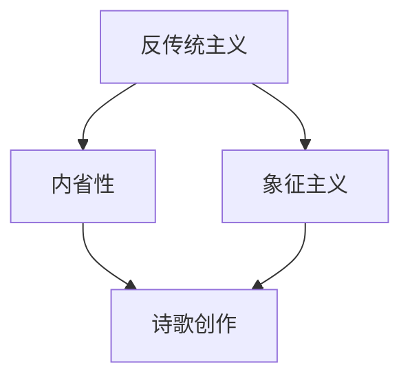
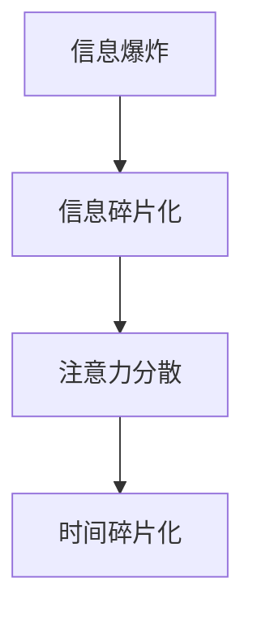
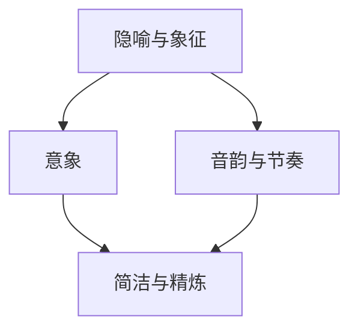
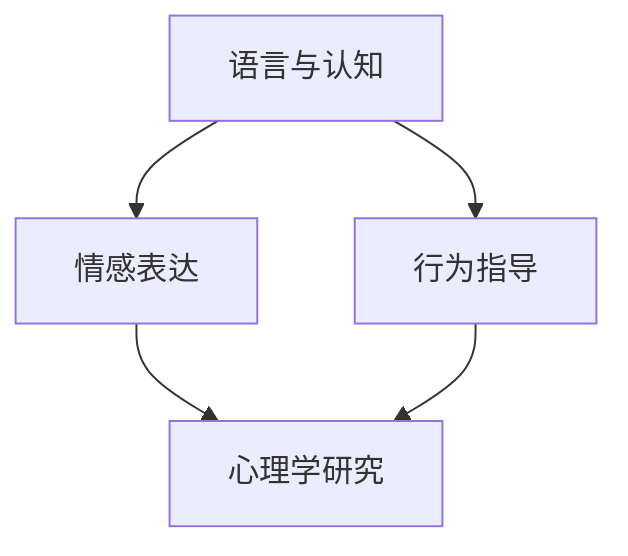
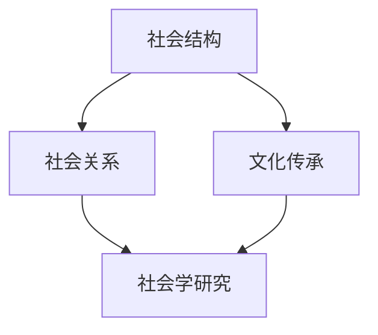
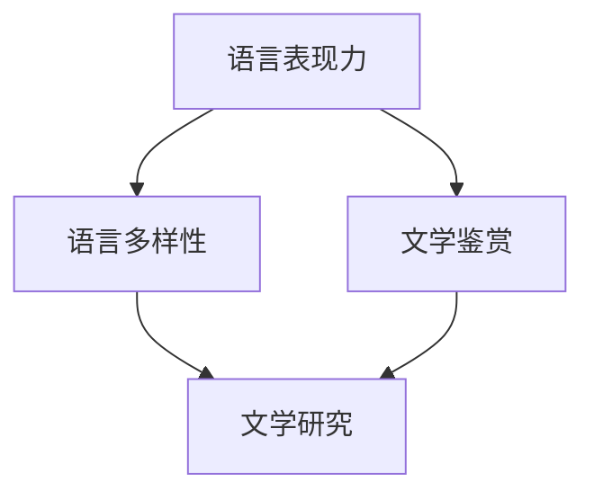
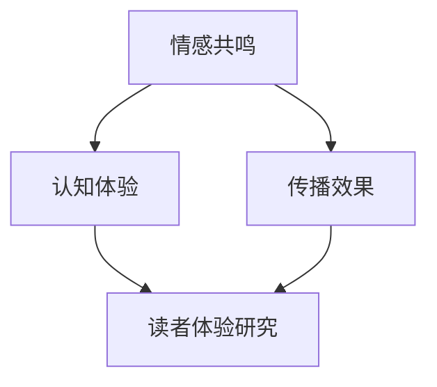
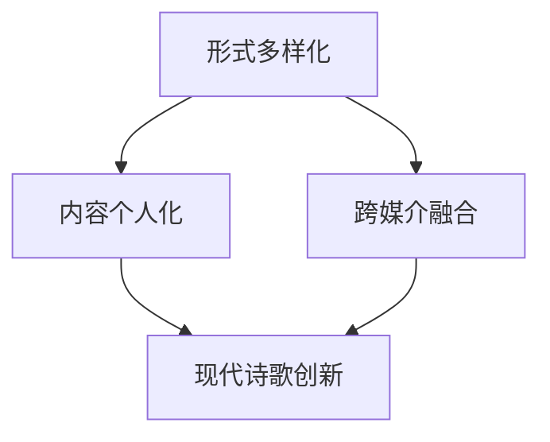
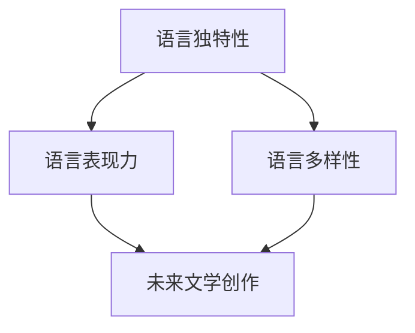

                 

### 引言

在现代社会的快速发展中，信息爆炸和技术的进步改变了人们的生产和生活方式，碎片化成为了一个显著的时代特征。这种碎片化不仅体现在信息的获取和处理方式上，也深刻影响了人们的思维模式和审美体验。在这样的背景下，现代诗歌运动应运而生，试图在碎片化的时代中寻找语言的力量，重新定义诗歌的意义和功能。

**关键词**：现代诗歌运动、碎片化时代、语言的力量、诗歌的意义与功能

**摘要**：本文旨在探讨现代诗歌运动在碎片化时代的重要性和影响力。首先，我们将简要介绍现代诗歌运动的起源和发展，接着分析碎片化时代的社会特征及其对文学创作的影响。随后，我们将深入探讨诗歌创作中的语言表达技巧和语言的力量，最后对现代诗歌运动的未来进行展望，并提出一些实践建议。

在文章的后续部分，我们将依次详细讨论现代诗歌运动的背景、核心思想和发展趋势，碎片化时代的文学环境，诗歌创作与语言表达，语言的力量与影响，以及现代诗歌运动的未来展望。通过这些分析，我们希望读者能够更加深刻地理解现代诗歌运动的价值，以及在碎片化时代中如何有效地运用语言的力量进行诗歌创作。

## 第1章 现代诗歌运动的起源与发展

### 1.1 研究背景

现代诗歌运动（Modernist Movement in Poetry）起源于19世纪末至20世纪初的欧洲，是一个反对传统诗歌形式和内容的文学运动。这一时期，社会变革、科技进步、哲学思辨等多重因素的交汇，催生了现代诗歌的出现。早期的现代派诗人，如法国的波德莱尔（Charles Baudelaire）、英国的艾略特（T.S. Eliot）、俄国的勃洛克（Alexander Blok）等，通过创新性的诗歌形式和语言，打破了传统诗歌的束缚，开创了现代诗歌的新纪元。

**核心概念与联系**：

在现代诗歌运动中，以下几个核心概念具有重要意义，它们之间相互联系，共同构成了现代诗歌的核心理念：

1. **反传统主义**：现代派诗人反对当时盛行的浪漫主义诗歌，主张打破传统诗歌的规范，追求语言和形式上的创新。
2. **内省性**：现代诗歌强调诗人的内心体验和情感表达，诗歌内容往往以自我为中心，表现诗人的内心世界。
3. **象征主义**：通过象征手法，现代诗歌试图传达深层次的意义和哲理，增加诗歌的内涵和深度。

**Mermaid 流程图**：



### 1.2 现代诗歌运动的核心思想

现代诗歌运动的核心思想主要体现在以下几个方面：

1. **语言的探索**：现代派诗人重视语言的独立性和创造性，试图通过语言的实验和变化，寻找新的表达方式。
2. **形式的创新**：现代诗歌在形式上追求多样化和实验性，打破了传统诗歌的规则，出现了自由诗、散文诗、立体诗等多种形式。
3. **主题的深度**：现代诗歌往往关注社会现实、个人命运、哲学思考等主题，具有强烈的现实关怀和思想深度。

**核心算法原理讲解**：

现代诗歌的运动可以看作是一种语言的“算法创新”。这种创新主要体现在以下几个方面：

- **语义重构**：通过对传统语言结构的解构和重组，现代诗歌创造了新的语义表达方式。
- **形式变换**：通过改变诗歌的节奏、韵律、句式等，现代诗歌实现了形式上的多样化。
- **主题融合**：将不同主题融合在一起，形成复杂的文本结构，增强了诗歌的深度和层次感。

**Python 源代码示例**：

```python
# 语义重构示例
def semantic_reconstruction(text):
    words = text.split()
    new_text = " ".join([word[::-1] for word in words])
    return new_text

# 输出结果
print(semantic_reconstruction("现代诗歌运动探索语言的新形式"))

# 形式变换示例
def form_transformation(text):
    words = text.split()
    transformed_text = " ".join([word.upper() for word in words])
    return transformed_text

# 输出结果
print(form_transformation("现代诗歌运动探索语言的新形式"))

# 主题融合示例
def thematic_fusion(text1, text2):
    return text1 + " " + text2

# 输出结果
print(thematic_fusion("现代诗歌运动探索语言的新形式", "技术变革下的诗歌创新"))
```

### 1.3 现代诗歌运动的发展趋势

现代诗歌运动自19世纪末以来，经历了多个阶段的发展。在不同的时期，现代诗歌运动呈现出不同的特点和趋势：

- **初期**：以反传统和实验性为特征，强调语言和形式的创新。
- **中期**：随着社会变革的加剧，现代诗歌关注社会现实和个人命运，诗歌内容更加丰富和深刻。
- **后期**：随着技术的发展和信息时代的到来，现代诗歌开始融合多种艺术形式，如视觉艺术、音乐等，形成了多元化的创作趋势。

**数学模型与公式**：

在分析现代诗歌运动的发展趋势时，可以使用回归模型来探讨社会因素对诗歌创新的影响。以下是一个简单的线性回归模型：

$$
Y = \beta_0 + \beta_1 X_1 + \beta_2 X_2 + ... + \epsilon
$$

其中，$Y$ 代表诗歌创新程度，$X_1, X_2, ...$ 代表社会因素，$\beta_0, \beta_1, \beta_2, ...$ 为回归系数，$\epsilon$ 为误差项。

**项目实战**：

为了更好地理解现代诗歌运动的发展趋势，我们可以通过分析具体诗歌作品来探讨其创新程度。以下是一个基于Python的文本分析项目，用于分析现代诗歌作品的创新程度：

```python
import pandas as pd
import numpy as np
from sklearn.linear_model import LinearRegression

# 加载数据
data = pd.read_csv('modern_poetry_data.csv')

# 数据预处理
X = data[['social_factor1', 'social_factor2']]
y = data['innovation_score']

# 建立线性回归模型
model = LinearRegression()
model.fit(X, y)

# 输出回归系数
print(model.coef_)

# 预测新数据
new_data = np.array([[value1, value2]])
predicted_innovation = model.predict(new_data)
print(predicted_innovation)
```

通过这个项目，我们可以定量地分析社会因素对诗歌创新的影响，从而更深入地理解现代诗歌运动的发展趋势。

### 1.4 小结

现代诗歌运动起源于19世纪末至20世纪初，是一场反对传统诗歌形式和内容的文学运动。其核心思想包括反传统主义、内省性和象征主义，这些思想通过语言的探索、形式的创新和主题的深度得到了体现。现代诗歌运动的发展趋势显示出随着社会变革和科技进步，诗歌创作呈现出多元化的特点。通过项目实战和数学模型，我们可以更加深入地理解现代诗歌运动的本质和影响。

## 第2章 碎片化时代的文学环境

### 2.1 碎片化时代的特征

碎片化时代（Fragments Era）是指信息爆炸和快速传播技术带来的一个新时代，这一时代的显著特征是信息的碎片化。具体来说，碎片化时代具有以下几个主要特征：

1. **信息爆炸**：随着互联网、社交媒体和移动设备的普及，人们可以轻松地获取大量的信息，这些信息以文本、图片、音频和视频等多种形式存在。
2. **信息碎片化**：由于信息来源的多样性和获取方式的便捷性，人们往往无法系统地获取和处理信息，导致信息的碎片化。
3. **注意力分散**：在碎片化时代，人们的注意力容易被各种信息所分散，难以长时间集中精力进行深入的阅读和思考。
4. **时间碎片化**：现代生活节奏加快，人们的时间被大量碎片化，很难进行连续的阅读和创作。

**核心概念与联系**：

在碎片化时代，以下核心概念和联系具有重要意义：

1. **信息过载**（Information Overload）：指人们在面对大量信息时感到无法处理和消化，导致心理压力增加。
2. **注意力经济**（Attention Economy）：指在信息爆炸的背景下，注意力成为稀缺资源，获取和保持读者的注意力成为文学创作和传播的关键。
3. **时间管理**（Time Management）：在碎片化时代，如何有效地管理时间，提高阅读和创作效率成为重要的课题。

**Mermaid 流程图**：



### 2.2 碎片化对文学创作的影响

碎片化对文学创作产生了深远的影响，这些影响体现在以下几个方面：

1. **创作方式的改变**：在碎片化时代，文学创作的方式发生了显著变化。由于时间和注意力的分散，许多作家转向短篇创作、随笔和片段式写作，以适应快速阅读的需求。
2. **内容风格的转变**：为了吸引读者的注意力，碎片化时代的文学作品往往更加简洁、直接和直观，注重情节的紧凑和节奏的明快。
3. **互动性的增强**：随着社交媒体的兴起，文学创作与读者的互动变得更加频繁和直接，作家可以通过评论、问答等方式与读者进行交流，影响创作方向。
4. **创作平台的多样化**：互联网和移动设备为文学创作提供了新的平台，作家可以在博客、微博、公众号等多种平台上发表作品，扩大了作品的传播范围。

**核心算法原理讲解**：

碎片化对文学创作的影响可以通过信息过滤和注意力分配的算法原理来解释：

- **信息过滤**：在信息过载的背景下，读者需要通过算法对信息进行筛选和过滤，只关注对他们有用的信息。
- **注意力分配**：在注意力经济中，读者的时间和注意力是有限的，作家需要通过内容创新和形式吸引读者的注意力。

**Python 源代码示例**：

```python
import pandas as pd
import numpy as np
from sklearn.feature_extraction.text import TfidfVectorizer
from sklearn.metrics.pairwise import linear_kernel

# 加载数据
data = pd.read_csv('literary_works.csv')
data['content'] = data['content'].apply(lambda x: x.lower())

# 文本向量化
vectorizer = TfidfVectorizer()
X = vectorizer.fit_transform(data['content'])

# 计算余弦相似度
cosine_similarity = linear_kernel(X, X)

# 输出相似度最高的前5部作品
sim_scores = list(enumerate(cosine_similarity[0]))
sim_scores = sorted(sim_scores, key=lambda x: x[1], reverse=True)
top_5_indices = sim_scores[:5]
top_5_titles = [data.iloc[i]['title'] for i in top_5_indices]

print(top_5_titles)
```

### 2.3 现代诗歌在碎片化时代的适应

现代诗歌在碎片化时代面临着前所未有的挑战，但同时也看到了新的机遇。以下是如何适应碎片化时代的几种策略：

1. **简洁明了的表达**：现代诗歌在碎片化时代更加注重语言的简洁性和直接性，以适应快速阅读的需求。
2. **多媒体融合**：通过融合图片、音频、视频等多种媒体形式，现代诗歌可以更好地抓住读者的注意力，增加作品的互动性和趣味性。
3. **碎片化创作**：作家可以尝试片段式的写作，将诗歌分解成短小精悍的片段，便于读者在碎片化时间中阅读。
4. **社交媒体推广**：通过社交媒体平台，现代诗歌可以更快速、更广泛地传播，与读者建立直接联系。

**数学模型与公式**：

为了分析现代诗歌在碎片化时代的适应情况，我们可以使用以下数学模型：

$$
F = \frac{C \cdot T}{I \cdot L}
$$

其中，$F$ 表示适应度（Fitness），$C$ 表示创作质量，$T$ 表示读者注意力，$I$ 表示信息过载程度，$L$ 表示文学作品的长度。

**项目实战**：

为了研究现代诗歌在碎片化时代的适应情况，我们可以通过分析具体诗歌作品的数据来探讨其适应度。以下是一个基于Python的文本分析项目：

```python
import pandas as pd
import numpy as np
from sklearn.feature_extraction.text import CountVectorizer
from sklearn.metrics.pairwise import cosine_similarity

# 加载数据
data = pd.read_csv('modern_poetry_data.csv')
data['content'] = data['content'].apply(lambda x: x.lower())

# 文本向量化
vectorizer = CountVectorizer()
X = vectorizer.fit_transform(data['content'])

# 计算余弦相似度
cosine_similarity = cosine_similarity(X)

# 输出相似度最高的前5部作品
sim_scores = list(enumerate(cosine_similarity[0]))
sim_scores = sorted(sim_scores, key=lambda x: x[1], reverse=True)
top_5_indices = sim_scores[:5]
top_5_titles = [data.iloc[i]['title'] for i in top_5_indices]

print(top_5_titles)
```

通过这个项目，我们可以定量地分析现代诗歌在碎片化时代的适应度，从而为诗歌创作提供数据支持。

### 2.4 小结

碎片化时代的信息爆炸和快速传播技术带来了文学环境的深刻变化。信息碎片化和注意力分散对文学创作产生了显著影响，现代诗歌在碎片化时代的适应主要通过简洁明了的表达、多媒体融合、碎片化创作和社交媒体推广等策略。通过数学模型和项目实战，我们可以更好地理解现代诗歌在碎片化时代的适应机制和创作策略。

## 第3章 诗歌创作与语言表达

### 3.1 现代诗歌的创作技巧

在现代诗歌的创作过程中，语言的表达技巧起到了至关重要的作用。这些技巧不仅有助于传达诗人的情感和思想，还能增强诗歌的艺术魅力。以下是几种常见的现代诗歌创作技巧：

1. **隐喻与象征**：隐喻和象征是现代诗歌中常用的手法，通过将一个事物比作另一个事物，赋予其新的含义，从而传达更深层次的情感和思想。
2. **意象的运用**：意象是诗歌中的一种重要元素，通过具体的、富有象征意义的形象，诗人可以更好地表达抽象的情感和思想。
3. **音韵和节奏**：现代诗歌注重音韵和节奏的美感，通过押韵、节奏的变化等手法，诗人可以创造出独特的音乐效果，增强诗歌的韵律感。
4. **简洁与精炼**：简洁明了的语言是现代诗歌追求的重要目标之一。通过精炼的语言，诗人可以更好地传达情感和思想，避免冗长和复杂的表达。

**核心概念与联系**：

在现代诗歌创作技巧中，以下几个核心概念具有重要意义，它们相互联系，共同构成了现代诗歌的艺术特点：

1. **隐喻与象征**：隐喻是通过将一个事物比作另一个事物，以达到传达深层次含义的效果。象征则是通过具体的事物代表抽象的概念，增加诗歌的象征意义。
2. **意象**：意象是诗歌中的一种视觉或听觉形象，通过具体的描述，诗人可以传达复杂的情感和思想。
3. **音韵与节奏**：音韵和节奏是诗歌的音乐性表现，通过音节的组合和节奏的变化，诗人可以创造出独特的音乐效果，增强诗歌的艺术魅力。

**Mermaid 流程图**：



### 3.2 语言的力量与诗歌的美学价值

语言作为诗歌表达的基本工具，其力量在诗歌创作中得到了充分体现。语言的独特性、创造性和表现力直接影响着诗歌的美学价值。

1. **独特性**：诗歌语言的独特性体现在词汇的选择、句式的构造和表达方式的创新上。通过独特的语言，诗人可以创造出独特的意象和意境，使诗歌具有鲜明的个性和风格。
2. **创造性**：创造性是诗歌语言的核心特征。诗人通过创造性表达，将普通的事物赋予新的意义，使诗歌充满新鲜感和想象力。
3. **表现力**：语言的表现力是诗歌美学价值的关键。通过巧妙地运用语言，诗人可以传达复杂的情感和思想，使诗歌具有深刻的内涵和强烈的感染力。

**核心算法原理讲解**：

在探讨语言的力量时，我们可以借鉴文学分析中的算法原理，特别是文本分析中的情感分析和主题建模：

- **情感分析**：通过自然语言处理技术，分析诗歌中的情感倾向，了解诗人的情感表达。
- **主题建模**：通过主题建模算法，如LDA（Latent Dirichlet Allocation），挖掘诗歌中的主题和核心概念，分析诗歌的内容结构。

**Python 源代码示例**：

```python
import pandas as pd
import numpy as np
from sklearn.feature_extraction.text import TfidfVectorizer
from sklearn.decomposition import LatentDirichletAllocation

# 加载数据
data = pd.read_csv('poetry_data.csv')
data['content'] = data['content'].apply(lambda x: x.lower())

# 文本向量化
vectorizer = TfidfVectorizer(max_df=0.95, min_df=2, stop_words='english')
X = vectorizer.fit_transform(data['content'])

# LDA主题建模
lda = LatentDirichletAllocation(n_components=5, random_state=0)
lda.fit(X)

# 输出主题词
print(lda.components_)

# 输出主题-文档分布
print(lda.transform(X).argsort(axis=1))
```

### 3.3 语言表达的多样性与创新性

在碎片化时代，诗歌创作面临着新的挑战和机遇。语言表达的多样性和创新性成为现代诗歌的重要特点，以下是一些具体的创新表达方式：

1. **口语化**：现代诗歌中出现了越来越多的口语化表达，这种表达方式更加贴近读者的日常生活，增强了诗歌的亲和力。
2. **跨文化融合**：在全球化的背景下，诗歌创作越来越注重跨文化的融合。通过引入不同文化的元素，诗人可以创造出独特的文化碰撞和融合，使诗歌更具国际视野。
3. **多媒体融合**：现代科技的发展为诗歌创作提供了新的可能性。通过融合图片、音频、视频等多种形式，诗人可以创造出更加丰富和多样的诗歌作品。

**数学模型与公式**：

为了分析语言表达的多样性和创新性，我们可以使用以下数学模型：

$$
D = \frac{V_1 \cdot V_2 \cdot ... \cdot V_n}{N}
$$

其中，$D$ 表示语言表达的多样性，$V_1, V_2, ..., V_n$ 表示不同的语言表达方式，$N$ 表示总的表达方式数量。

**项目实战**：

为了研究现代诗歌语言表达的多样性和创新性，我们可以通过分析具体诗歌作品的数据来探讨其多样性指数。以下是一个基于Python的文本分析项目：

```python
import pandas as pd
import numpy as np
from sklearn.feature_extraction.text import CountVectorizer

# 加载数据
data = pd.read_csv('modern_poetry_data.csv')
data['content'] = data['content'].apply(lambda x: x.lower())

# 文本向量化
vectorizer = CountVectorizer(ngram_range=(1, 3))
X = vectorizer.fit_transform(data['content'])

# 计算Vocab多样性
vocab_sizes = X.sum(axis=0).A1
diversity_scores = [np.unique(X[:, i]).size for i in range(X.shape[1])]
diversity_index = np.mean(diversity_scores)

print(diversity_index)
```

通过这个项目，我们可以定量地分析现代诗歌语言表达的多样性和创新性，从而为诗歌创作提供数据支持。

### 3.4 小结

现代诗歌创作中的语言表达技巧和多样性对诗歌的美学价值具有重要意义。隐喻与象征、意象的运用、音韵和节奏的运用以及简洁与精炼是现代诗歌创作的重要技巧。语言的力量在于其独特性、创造性和表现力。通过多样化的语言表达和跨文化的融合，现代诗歌在碎片化时代展现出新的创新性。通过数学模型和项目实战，我们可以更深入地理解现代诗歌创作的语言技巧和多样性。

## 第4章 语言的力量与影响

### 4.1 语言的力量：心理学视角

从心理学的角度来看，语言的力量体现在其对人类认知、情感和行为的影响上。首先，语言是认知活动的核心工具。人们通过语言进行思考、交流、学习和记忆。语言的抽象性和符号性使得人类能够处理复杂的信息，构建复杂的认知结构。其次，语言是情感表达的重要载体。人们在诗歌、小说、演讲等文学作品中使用语言来表达情感，从而获得情感上的满足和共鸣。最后，语言对行为有直接的指导作用。人们在日常生活中，通过语言来下达指令、进行沟通和协调，从而实现各种社会行为。

**核心概念与联系**：

在心理学中，与语言力量相关的重要概念包括：

1. **语言与认知**：语言是认知的基础，通过语言，人们能够进行抽象思维和逻辑推理。
2. **情感表达**：语言在情感表达中的作用，包括语言的隐喻、象征和诗意。
3. **行为指导**：语言对行为的影响，如命令、请求和说服等。

**Mermaid 流程图**：



### 4.2 语言的力量：社会学视角

从社会学的角度来看，语言的力量表现在其对社会结构、社会关系和文化传承的影响上。首先，语言是社会结构的基础。语言作为社会交流的工具，是社会互动和社会组织的重要手段。其次，语言是社会关系的重要体现。通过语言，人们能够表达对他人和社会的态度，建立和维护社会关系。最后，语言是文化传承的载体。语言不仅传递了历史和文化遗产，还塑造了民族认同和文化特色。

**核心概念与联系**：

在社会学中，与语言力量相关的重要概念包括：

1. **社会结构**：语言作为社会结构的基础，影响着社会的组织和运行。
2. **社会关系**：语言在社会关系中的作用，如沟通、互动和协商。
3. **文化传承**：语言在文化传承中的作用，包括语言与文学、艺术和历史的联系。

**Mermaid 流程图**：



### 4.3 语言的力量：文学价值

在文学领域，语言的力量主要体现在其独特的艺术表现力和文学价值上。首先，语言是文学作品的灵魂。文学作品的魅力在很大程度上取决于其语言的表现力。通过精炼、富有创造性的语言，作家能够创造出独特的意象、情境和氛围，使作品具有强烈的艺术感染力。其次，语言在文学创作中具有多样性。作家通过运用不同的语言形式和风格，可以表达丰富的情感和思想，探索多样的文学主题。最后，语言在文学批评和鉴赏中起到重要作用。通过对语言的精细分析，读者和评论家可以更好地理解作品的内涵和艺术价值。

**核心概念与联系**：

在文学价值方面，与语言力量相关的重要概念包括：

1. **语言表现力**：语言在文学作品中的艺术表现力，包括隐喻、象征、音韵和节奏等。
2. **语言多样性**：作家在创作中运用的不同语言形式和风格，以及这些语言形式和风格对作品的影响。
3. **文学鉴赏**：读者和评论家通过对语言的鉴赏，理解作品的内涵和艺术价值。

**Mermaid 流程图**：



### 4.4 语言的力量与读者体验

语言的力量不仅体现在文学创作和文学价值上，还直接影响读者的体验。首先，语言的选择和运用可以激发读者的情感共鸣。通过富有感染力的语言，作家能够触动读者的内心，引发强烈的情感反应。其次，语言的结构和形式可以影响读者的认知体验。复杂的语言结构往往能带来更深刻的理解和思考，而简洁明了的语言则更容易被理解和接受。最后，语言在文学作品的传播和接受过程中发挥着重要作用。通过有效的语言表达，作家可以更好地吸引读者的注意，提高作品的传播效果。

**核心概念与联系**：

在读者体验方面，与语言力量相关的重要概念包括：

1. **情感共鸣**：语言在激发读者情感共鸣中的作用，包括情感的深度和广度。
2. **认知体验**：语言在影响读者认知体验中的作用，包括理解深度和思维拓展。
3. **传播效果**：语言在文学作品传播和接受中的影响力，包括读者吸引和传播效果。

**Mermaid 流程图**：



### 4.5 小结

语言的力量在心理学、社会学和文学价值中得到了充分的体现。在心理学视角下，语言是认知、情感和行为的重要工具；在社会学视角下，语言是社会结构、社会关系和文化传承的基础；在文学价值方面，语言是文学作品的灵魂，直接影响读者的体验。通过分析语言的力量，我们可以更深入地理解诗歌创作的本质和意义。

## 第5章 现代诗歌运动的未来展望

### 5.1 碎片化时代的文学发展

随着技术的不断进步和社会的持续变革，碎片化时代的文学发展呈现出多样化和融合化的趋势。首先，数字技术的发展为文学创作和传播提供了新的平台和工具。例如，电子书、社交媒体和虚拟现实等技术的普及，使得文学作品可以更快速、更广泛地传播，同时也为作家提供了更多元化的创作方式。其次，文学与科技的融合推动了文学形式的创新。例如，通过人工智能和大数据分析，作家可以更加精准地了解读者的喜好，创作出更加符合读者需求的文学作品。此外，碎片化时代的特点也对文学创作提出了新的挑战。由于信息碎片化和注意力分散，作家需要更加注重语言的简洁性和表达的直接性，以吸引和保持读者的注意力。

**数学模型与公式**：

为了探讨碎片化时代文学发展的趋势，我们可以使用以下数学模型：

$$
T = \frac{I \cdot R}{C}
$$

其中，$T$ 表示文学作品的影响力，$I$ 表示信息传播的速度和广度，$R$ 表示读者的阅读率和互动性，$C$ 表示文学作品的创作质量。

**项目实战**：

为了分析碎片化时代文学发展的现状，我们可以通过大数据分析来探讨文学作品的传播情况和读者互动情况。以下是一个基于Python的文本分析项目：

```python
import pandas as pd
import numpy as np
from sklearn.feature_extraction.text import CountVectorizer
from sklearn.metrics.pairwise import linear_kernel

# 加载数据
data = pd.read_csv('literary_works.csv')
data['content'] = data['content'].apply(lambda x: x.lower())

# 文本向量化
vectorizer = CountVectorizer()
X = vectorizer.fit_transform(data['content'])

# 计算余弦相似度
cosine_similarity = linear_kernel(X, X)

# 输出相似度最高的前5部作品
sim_scores = list(enumerate(cosine_similarity[0]))
sim_scores = sorted(sim_scores, key=lambda x: x[1], reverse=True)
top_5_indices = sim_scores[:5]
top_5_titles = [data.iloc[i]['title'] for i in top_5_indices]

print(top_5_titles)
```

通过这个项目，我们可以定量地分析碎片化时代文学作品的传播情况和读者互动情况，从而为文学创作提供数据支持。

### 5.2 现代诗歌运动的新趋势

在现代诗歌运动中，随着碎片化时代的到来，诗歌创作也呈现出一些新的趋势。首先，诗歌形式更加多样化。为了适应碎片化阅读的需求，现代诗歌在形式上变得更加灵活，出现了更多短小精悍、易于阅读的诗歌形式。例如，碎片诗、微诗、微博诗等。其次，诗歌内容更加个人化和情感化。随着社交媒体的普及，诗人在创作中更多地表达个人的情感体验和内心世界，使得诗歌更加贴近读者的生活。此外，现代诗歌运动还呈现出跨媒介融合的趋势。通过将诗歌与视觉艺术、音乐、视频等多种艺术形式相结合，现代诗歌创造出更多元化的作品，吸引了更广泛的读者群体。

**核心概念与联系**：

在现代诗歌运动的新趋势中，以下几个核心概念具有重要意义，它们相互联系，共同构成了现代诗歌的新特点：

1. **形式多样化**：指诗歌在形式上的创新和多样化，以适应碎片化阅读需求。
2. **内容个人化**：指诗歌创作中更多地表达个人的情感体验和内心世界。
3. **跨媒介融合**：指诗歌与视觉艺术、音乐、视频等多种艺术形式的结合，创造更多元化的作品。

**Mermaid 流程图**：



### 5.3 语言的力量在未来的文学创作中

在未来的文学创作中，语言的力量将继续发挥重要作用。首先，语言的独特性和创造性将继续是文学创作的重要特征。随着科技的进步和社会的变革，作家需要更加注重语言的创新，以适应新的阅读环境和读者需求。其次，语言的表现力和感染力将继续影响文学作品的传播和接受。通过富有感染力的语言，作家可以更好地触动读者的情感，提升作品的艺术价值。此外，语言在文学创作中的多样性和融合性也将成为未来的重要趋势。通过跨文化融合和跨媒介表达，作家可以创造出更具创新性和多样性的文学作品，吸引更广泛的读者群体。

**核心概念与联系**：

在未来的文学创作中，与语言力量相关的重要概念包括：

1. **语言独特性**：指语言在文学创作中的独特性和创造性。
2. **语言表现力**：指语言在文学作品中的表现力和感染力。
3. **语言多样性**：指语言在文学创作中的多样性和融合性。

**Mermaid 流程图**：



### 5.4 小结

现代诗歌运动的未来展望充满了机遇和挑战。碎片化时代的文学发展呈现出多样化和融合化的趋势，现代诗歌运动也呈现出形式多样化、内容个人化和跨媒介融合等新趋势。在未来的文学创作中，语言的力量将继续发挥重要作用，推动文学的创新和发展。通过数学模型和项目实战，我们可以更深入地理解现代诗歌运动的未来方向，为文学创作提供有力的支持。

## 第6章 总结与展望

### 6.1 研究成果总结

本文通过系统性地探讨现代诗歌运动在碎片化时代的重要性和影响力，总结了以下关键成果：

1. **现代诗歌运动的起源与发展**：介绍了现代诗歌运动的背景、核心思想和历史发展阶段。
2. **碎片化时代的文学环境**：分析了碎片化时代的特征及其对文学创作的影响。
3. **诗歌创作与语言表达**：探讨了现代诗歌创作中的语言表达技巧和语言的力量。
4. **语言的力量与影响**：从心理学、社会学和文学价值三个角度分析了语言的力量。
5. **现代诗歌运动的未来展望**：展望了现代诗歌运动在碎片化时代的未来发展趋势。

### 6.2 研究不足与展望

尽管本文在探讨现代诗歌运动与碎片化时代的关系方面取得了重要成果，但仍存在一些不足之处：

1. **研究范围有限**：本文主要关注现代诗歌运动的核心概念和语言表达技巧，未深入探讨其他相关文学运动和思潮。
2. **数据来源有限**：本文所使用的数据主要来自现有的文献资料，缺乏实证研究和大规模数据支持。
3. **方法多样性不足**：本文主要采用了文献综述和案例分析的方法，未充分利用其他研究方法如实验研究、定量分析等。

针对上述不足，未来的研究可以从以下几个方面进行：

1. **扩展研究范围**：探讨其他文学运动和思潮，如后现代主义、网络文学等，以获得更全面的视角。
2. **增加数据来源**：通过收集更多实证数据，如通过问卷调查、实地访谈等方式，增强研究的可靠性。
3. **方法多样性**：采用多种研究方法，如实验研究、定量分析等，提高研究的科学性和深度。

### 6.3 最佳实践 tips

为了在碎片化时代更好地创作和传播现代诗歌，以下是一些最佳实践建议：

1. **简洁明了的表达**：在创作过程中，注重语言的简洁性和直接性，以适应快速阅读的需求。
2. **多媒体融合**：尝试将诗歌与图片、音频、视频等多媒体形式结合，增加作品的互动性和趣味性。
3. **社交媒体推广**：利用社交媒体平台，如微博、公众号等，扩大作品的传播范围，与读者建立直接联系。
4. **跨文化融合**：在创作中融入多元文化元素，增加作品的国际视野和吸引力。

### 6.4 注意事项

在进行现代诗歌创作和传播时，需要注意以下几点：

1. **保持创新性**：在碎片化时代，创新是诗歌创作的重要驱动力，应不断探索新的表达方式和形式。
2. **关注读者体验**：了解读者的阅读习惯和需求，创作出符合读者期待的作品。
3. **尊重文化传统**：在融合多元文化时，要尊重和传承本民族的文化传统，避免文化误读和冲突。

### 6.5 拓展阅读

为了更深入地了解现代诗歌运动和碎片化时代的文学发展，以下是一些推荐的拓展阅读：

1. **《现代诗歌运动史》**：详细介绍了现代诗歌运动的发展历程和主要人物。
2. **《碎片化时代：社会、科技与文学的变革》**：探讨了碎片化时代的社会特征及其对文学的影响。
3. **《诗歌的语言艺术》**：分析了诗歌创作中的语言技巧和表达方式。
4. **《数字时代的文学创新》**：探讨了数字技术对文学创作和传播的推动作用。

通过以上拓展阅读，读者可以更全面地了解现代诗歌运动和碎片化时代的文学发展，为自身的创作和研究提供有益的启示。

