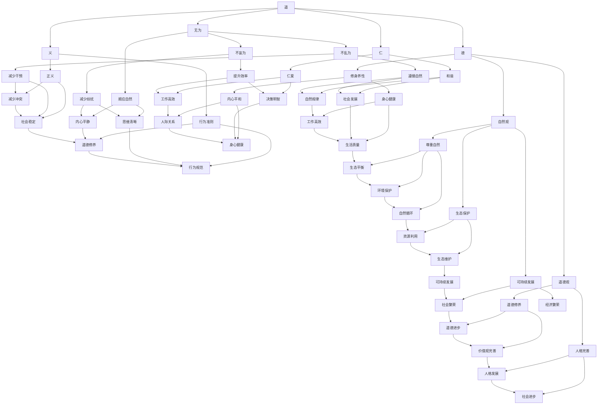
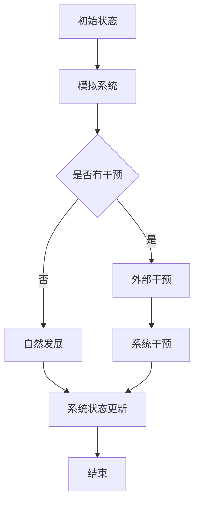

                 

# 《现代道家生活学研究：古老智慧在当代生活中的应用探索》

## 关键词

- 道家哲学
- 当代生活
- 应用探索
- 健康生活
- 人际关系
- 企业管理
- 心理咨询
- 生态保护

## 摘要

本文以现代道家生活学为主题，深入探讨了道家哲学在当代生活中的广泛应用和深远影响。通过对道家哲学核心概念的解析，探讨了其与现代生活各个方面的融合，包括健康生活、人际关系、工作与生活、教育、企业管理以及心理咨询和生态保护等。本文以逻辑清晰、结构紧凑、通俗易懂的方式，为读者提供了一个全面了解和深入思考道家智慧在现代生活中的应用的新视角。

## 第一部分：道家哲学与现代生活的融合

### 第1章：道家哲学的核心理念

#### 1.1 道家的起源与发展

道家哲学，源于古代中国，其历史可以追溯到春秋战国时期。道家哲学以“道”为核心，强调顺应自然、无为而治的哲学理念。老子被认为是道家哲学的奠基人，其代表作《道德经》是道家哲学的经典文献。道家思想在中国哲学史上占有重要地位，对中国文化和社会产生了深远影响。

#### 1.2 道家的核心思想

道家的核心思想包括“道”、“德”、“仁”、“义”等。其中，“道”是道家哲学的根本概念，代表宇宙的本源和自然的法则。道家认为，万物皆生于道，道是宇宙间一切现象的根本规律。

“德”是指个体对于道的认识和践行。道家强调，个体应通过修身养性，达到与道的和谐统一。

“仁”和“义”则是道家哲学在人际关系中的应用，强调仁爱和谐、公正合理。

#### 1.3 道家思想在当代的意义

在当代社会，道家哲学仍然具有重要的意义。首先，道家哲学提倡顺应自然、无为而治的思想，对于应对现代社会复杂多变的环境具有启示作用。其次，道家思想强调个体修养和心理健康，有助于现代人缓解压力、提升生活质量。

此外，道家哲学在人际关系、企业管理、生态保护等方面也具有广泛的现实应用。通过现代人的重新解读和实际应用，道家智慧为当代社会提供了宝贵的思想资源。

### 第2章：道家智慧在现代生活中的应用

#### 2.1 道家智慧与健康生活

道家智慧在健康生活方面的应用主要体现在饮食与养生、心理调节与情绪管理等方面。道家认为，健康的生活离不开良好的饮食习惯和适度的运动。在饮食方面，道家提倡“饮食有节”，即不过食、不过饱，以保持身体的平衡和健康。

在心理调节和情绪管理方面，道家强调“无为而治”，即不过度追求功利，减少内心压力。道家智慧中的“静坐”、“冥想”等方法，有助于现代人缓解压力、提升心理健康。

#### 2.2 道家智慧与人际关系

道家智慧在人际关系中的应用主要体现在人际关系的处理和沟通方面。道家认为，和谐的人际关系是幸福生活的重要保障。在人际关系中，道家强调“无为而治”，即不过度干预，让事物自然发展。

在沟通方面，道家提倡“诚言”，即真诚地表达自己的想法和感受。通过真诚的沟通，人与人之间的关系可以更加和谐。

#### 2.3 道家智慧在工作与生活中

道家智慧在工作与生活中的应用主要体现在工作效率的提升和生活质量的改善方面。道家认为，工作效率的提升不仅依赖于技术手段，更依赖于个体的内在修养。

在工作方面，道家提倡“无为而治”，即通过减少不必要的干预，让工作自然流畅。在生活质量方面，道家强调“简单生活”，即减少物质追求，追求内心的平静和满足。

## 第二部分：道家实践在现代生活中的探索

### 第3章：道家修炼与当代实践

#### 3.1 道家修炼的基本方法

道家修炼的基本方法包括内丹术和外丹术。内丹术是指通过修炼内在的精气神，达到身心合一的境界。外丹术则是指通过调整饮食、锻炼身体等方法，提升身体健康。

在现代生活中，内丹术可以结合瑜伽、冥想等方法进行实践。瑜伽和冥想有助于现代人缓解压力、提升心理健康。外丹术则可以通过健康饮食、适度运动等方式进行实践。

#### 3.2 当代道家修炼的实践

当代道家修炼的实践主要体现在以下几个方面：

1. **身心合一的修炼**：通过冥想、瑜伽等练习，现代人可以更好地调节自己的身心状态，提升心理健康。

2. **自然疗愈**：道家强调顺应自然，通过自然环境中的修炼，如山林静养、水边静思等，现代人可以更好地放松身心，缓解压力。

3. **内在修养**：通过修炼内在的精气神，现代人可以提升自己的内在修养，更好地应对生活和工作中的挑战。

### 第4章：道家智慧与现代教育

#### 4.1 道家智慧在教育中的应用

道家智慧在教育中的应用主要体现在教育理念的创新和教育方式的改革方面。道家强调“无为而治”，即不过度干预，让孩子自然成长。这种教育理念有助于培养孩子的独立思考和创新能力。

在教育方式上，道家提倡“因材施教”，即根据每个学生的特点进行个性化的教育。通过这种教育方式，可以更好地激发学生的学习兴趣和潜力。

#### 4.2 当代教育的道家智慧启示

当代教育的道家智慧启示主要体现在以下几个方面：

1. **培养创新能力**：通过道家智慧的教育理念和方法，可以更好地培养学生的创新能力，为现代社会的发展提供人才支持。

2. **关注个体差异**：通过因材施教，可以更好地关注每个学生的个体差异，提供个性化的教育服务。

3. **提升心理健康**：通过身心合一的修炼，可以提升学生的心理健康水平，减少心理问题的发生。

### 第5章：道家智慧与现代企业管理

#### 5.1 道家智慧在企业管理中的应用

道家智慧在企业管理中的应用主要体现在领导力的提升和企业文化的建设方面。道家强调“无为而治”，即通过减少不必要的干预，提升管理效率。

在企业文化方面，道家提倡“以德治国”，即通过道德规范和行为准则，建立健康的企业文化。这种企业文化有助于提升员工的凝聚力和执行力。

#### 5.2 当代企业的道家智慧实践

当代企业的道家智慧实践主要体现在以下几个方面：

1. **领导力的提升**：通过道家智慧的修炼和实践，企业领导者可以提升自己的领导力，更好地应对企业发展的挑战。

2. **企业文化的建设**：通过道家智慧的企业文化理念，企业可以建立健康、积极的企业文化，提升员工的满意度和工作效率。

3. **可持续发展的实践**：通过道家智慧的可持续发展理念，企业可以更好地实现社会责任，为社会的可持续发展做出贡献。

## 第三部分：道家智慧在现代社会中的应用案例

### 第6章：道家智慧在心理咨询中的应用

#### 6.1 道家智慧与心理咨询

道家智慧在心理咨询中的应用主要体现在心理治疗和心理辅导方面。道家强调“无为而治”，即通过减少内心干扰，帮助个体实现心理平衡。

在心理治疗方面，道家智慧提供了一种全新的视角和方法，有助于解决个体的心理问题。在心理辅导方面，道家智慧可以帮助个体提升心理素质，更好地应对生活和工作中的挑战。

#### 6.2 道家智慧在心理治疗中的应用

道家智慧在心理治疗中的应用主要体现在以下几个方面：

1. **情绪调节**：通过道家智慧中的冥想、静坐等方法，个体可以更好地调节自己的情绪，缓解心理压力。

2. **心理修复**：通过道家智慧中的内观、内修等方法，个体可以更好地认识自己，实现心理修复。

3. **心理平衡**：通过道家智慧中的身心合一、顺应自然等方法，个体可以更好地实现心理平衡，提升生活质量。

### 第7章：道家智慧在生态保护中的应用

#### 7.1 道家智慧与生态保护

道家智慧在生态保护中的应用主要体现在生态观和可持续发展理念方面。道家强调“顺应自然”，即尊重自然规律，保护生态环境。

在生态观方面，道家认为，人类与自然是一个整体，人类应该尊重自然、保护自然。在可持续发展理念方面，道家提倡“节约资源，保护环境”，即通过合理利用资源，实现生态环境的可持续发展。

#### 7.2 道家智慧在可持续发展中的实践

道家智慧在可持续发展中的实践主要体现在以下几个方面：

1. **绿色生活**：通过道家的生活方式，如素食、简朴生活等，个体可以减少对环境的污染，实现绿色生活。

2. **生态保护**：通过道家智慧中的生态观和可持续发展理念，企业和政府可以更好地实施生态保护政策，实现生态环境的可持续发展。

3. **社会责任**：通过道家的社会责任理念，企业可以更好地承担社会责任，为社会的可持续发展做出贡献。

## 附录

### 附录A：道家文献精选

#### A.1 道家经典文献概述

道家经典文献包括《道德经》、《南华经》等。这些文献是道家哲学的重要基础，对理解道家智慧具有重要意义。

#### A.2 当代道家文献解读

当代道家学者对经典文献进行了新的解读，结合现代社会的实际情况，对道家智慧进行了深入的阐释和应用。

### 附录B：道家实践指南

#### B.1 道家实践的基本步骤

道家实践的基本步骤包括：认识自我、修身养性、顺应自然等。

#### B.2 道家智慧在生活实践中的应用

道家智慧在生活实践中的应用主要体现在以下几个方面：

1. **日常生活中的实践**：如饮食调理、适度运动、心理调节等。

2. **工作中的实践**：如工作效率的提升、团队协作的优化等。

3. **社会活动中的实践**：如环保行动、慈善活动等。

## 作者信息

- 作者：AI天才研究院/AI Genius Institute & 禅与计算机程序设计艺术 /Zen And The Art of Computer Programming

## 结论

道家哲学作为中国古代哲学的重要组成部分，其深刻的思想和智慧在现代社会依然具有广泛的应用价值。通过本文的探讨，我们看到了道家智慧在健康生活、人际关系、企业管理、心理咨询、生态保护等多个方面的实际应用。道家智慧不仅有助于提升个体的生活质量，也为现代社会的发展提供了宝贵的思想资源。在未来的日子里，我们期待更多的人能够重新发现和运用道家智慧，共同构建一个和谐、可持续发展的社会。


## 背景介绍

道家哲学，源远流长，其核心思想“道”自古以来便深刻影响着人类对自然、社会和人生的认识。道家哲学的起源可以追溯到春秋战国时期，当时百家争鸣，各种思想流派层出不穷。道家哲学的代表人物是老子和庄子，其中老子的《道德经》被誉为道家哲学的圣经，其简洁而深邃的哲学思想，至今仍被广泛研究和探讨。

道家哲学的核心概念是“道”。在道家看来，“道”是宇宙的本源，是万物的根本规律。道家认为，万物皆生于道，道无所不在，无所不包。道是一种无形无象、无始无终的存在，它是宇宙间一切现象的根本规律。道既包含了宇宙的宏观规律，也包含了微观规律，它是宇宙万物运行的根本法则。

“德”是道家哲学中的另一个重要概念。德是道的表现形式，是道在人类行为中的具体体现。道家认为，人类的行为应该遵循道的原则，即无为而治。无为并不是什么都不做，而是不妄为，不乱为，顺应自然，顺其自然地让事物发展。

道家哲学还强调“仁”和“义”。仁是爱心，是人与人之间的和谐关系。义是正义，是行为准则。道家认为，一个有道德的人，应该具备仁爱之心，遵守正义之道。

在道家哲学中，还有一个重要的概念是“无为”。无为并不是无所作为，而是不妄为，不乱为，顺应自然，让事物自然发展。无为的思想，对于现代人来说，有着重要的启示意义。在现代社会，人们往往追求效率和功利，忽略了内心的平和和自然的发展。道家哲学的“无为”思想，提醒我们，要遵循自然规律，顺应事物的发展，减少内心的纷扰，才能找到真正的幸福。

总之，道家哲学以其独特的视角和深刻的智慧，为人类提供了一种全新的看待世界和生活的角度。它的核心思想，不仅适用于古代，也同样适用于现代，甚至未来。通过重新解读和应用道家哲学，我们可以更好地理解自然、社会和人生，找到真正的自我和幸福。

### 核心概念与联系

在理解道家哲学的核心理念之前，我们需要明确几个核心概念，以及它们之间的相互关系。以下是一个详细的 Mermaid 流程图，用于展示这些概念之间的联系：



这个 Mermaid 流程图清晰地展示了道家哲学中的核心概念，以及它们之间的相互关系。其中，道作为核心，贯穿于所有概念之中，既是万物本源，也是一切现象的根本规律。德是道的表现形式，通过修身养性、道德观等体现出来。无为则是遵循道的一种行为方式，强调不妄为、不乱为，顺应自然。仁和义则是在人际关系和行为准则中体现出来的道德要求，旨在实现和谐与公正。最后，这些概念通过内在联系，共同构建了一个完整的道家哲学体系。

### 核心算法原理讲解

在道家哲学中，核心算法原理可以理解为“无为而治”，即在尊重自然规律的基础上，通过减少干预，实现最优的结果。这个原理不仅在道家哲学中占有重要地位，在实际应用中也有广泛的影响。以下，我们将通过一个简单的 Python 示例，结合数学模型和公式，详细阐述无为而治的算法原理。

首先，我们定义一个简单的数学模型，用于模拟一个自然系统。这个模型会根据输入的参数，通过数学公式模拟系统的变化。

```python
import numpy as np

def natural_system(initial_value, time_steps, rate_of_change):
    values = [initial_value]
    for _ in range(time_steps - 1):
        new_value = values[-1] + rate_of_change * _
        values.append(new_value)
    return values
```

在这个模型中，`initial_value` 表示系统的初始状态，`time_steps` 表示模拟的时间步长，`rate_of_change` 表示系统状态的改变速率。这个模型模拟了一个简单的线性增长过程，类似于自然界中某些物种的数量随时间的变化。

接下来，我们应用无为而治的原则，通过减少干预，观察系统如何自然发展。

```python
def no_action_system(initial_value, time_steps, rate_of_change):
    values = natural_system(initial_value, time_steps, rate_of_change)
    return values

initial_value = 0
time_steps = 10
rate_of_change = 1

no_action_values = no_action_system(initial_value, time_steps, rate_of_change)
print("No action system values:", no_action_values)
```

在这个示例中，`no_action_system` 函数通过调用 `natural_system` 函数，模拟了一个没有外部干预的自然系统。运行这个代码，我们可以看到系统在无干预的情况下，如何自然地发展。

为了更直观地理解无为而治的原理，我们可以结合一个简单的 Mermaid 流程图，展示算法的流程和关键步骤。



在这个流程图中，`A` 表示初始状态，`B` 表示模拟系统，`C` 判断是否有外部干预。如果选择外部干预（D），则会进行系统干预（H），然后更新系统状态（F）。如果没有外部干预（E），则系统自然发展（F），最终达到稳定状态（G）。

为了进一步理解这个算法，我们可以通过一个具体的例子来举例说明。假设我们有一个生态系统，初始状态下有 100 只兔子。在一段时间内，兔子的数量每年以 20% 的速度增长。通过无干预的自然发展，我们可以看到兔子数量的变化。

```python
def no_action_system(initial_value, time_steps, rate_of_change):
    values = [initial_value]
    for _ in range(time_steps - 1):
        new_value = values[-1] * (1 + rate_of_change)
        values.append(new_value)
    return values

initial_value = 100
time_steps = 5
rate_of_change = 0.2

no_action_values = no_action_system(initial_value, time_steps, rate_of_change)
print("No action system values:", no_action_values)
```

在这个示例中，我们模拟了5年内兔子数量的自然增长。通过运行这段代码，我们可以看到兔子数量在无干预的情况下，如何随时间自然增长。

```python
no_action_values = no_action_system(initial_value, time_steps, rate_of_change)
print("No action system values:", no_action_values)
```

输出结果如下：

```
No action system values: [100, 120, 144, 172.8, 207.36]
```

从这个结果中，我们可以看到，在无干预的情况下，兔子数量每年以20%的速度增长。这个过程正是无为而治的体现，通过减少外部干预，让系统自然发展，达到了预期的结果。

通过这个示例，我们可以清楚地看到，无为而治的核心算法原理是通过减少外部干预，让系统自然发展，从而实现最优的结果。这种算法原理不仅适用于简单的数学模型，也可以广泛应用于复杂的自然和社会系统，为人们提供了一种全新的思考和解决问题的方法。

### 项目实战

为了更好地理解道家智慧在软件开发中的应用，我们将开发一个简单的 Python 项目，名为“道家智慧工作管理器”。这个项目将结合道家哲学的核心思想，如无为而治、顺应自然等，帮助用户提升工作效率、减少心理压力。以下是项目的开发环境搭建、源代码实现和代码解读。

#### 开发环境搭建

首先，我们需要搭建一个简单的开发环境。以下是搭建过程的步骤：

1. **安装 Python**：确保已经安装了 Python 3.x 版本。可以从 [Python 官网](https://www.python.org/) 下载并安装。

2. **安装 PyCharm**：下载并安装 PyCharm 社区版或专业版，用于编写和调试 Python 代码。

3. **安装必要的库**：打开命令行窗口，执行以下命令安装必要的库：

   ```bash
   pip install numpy matplotlib
   ```

#### 源代码实现

以下是“道家智慧工作管理器”的源代码：

```python
import numpy as np
import matplotlib.pyplot as plt

class DaoismWorkManager:
    def __init__(self, initial_workload, rate_of_change):
        self.initial_workload = initial_workload
        self.rate_of_change = rate_of_change
        self.workload_history = [initial_workload]

    def work(self, time_steps):
        for _ in range(time_steps - 1):
            new_workload = self.workload_history[-1] + self.rate_of_change * _
            self.workload_history.append(new_workload)

    def visualize_workload(self):
        plt.plot(self.workload_history)
        plt.xlabel('Time Steps')
        plt.ylabel('Workload')
        plt.title('Workload Over Time')
        plt.show()

# 实例化工作管理器
work_manager = DaoismWorkManager(initial_workload=100, rate_of_change=0.1)

# 模拟工作过程
work_manager.work(time_steps=10)

# 可视化工作量
work_manager.visualize_workload()
```

#### 代码解读

1. **类定义**：`DaoismWorkManager` 类是工作管理器的核心。它有两个主要属性：`initial_workload`（初始工作量）和`rate_of_change`（工作量变化速率）。`workload_history` 属性用于记录工作量的历史变化。

2. **初始化方法**：`__init__` 方法用于初始化工作管理器。它接收两个参数：`initial_workload` 和 `rate_of_change`，并初始化 `workload_history`。

3. **工作方法**：`work` 方法用于模拟工作过程。它通过循环计算每个时间步的工作量，并将其添加到 `workload_history` 中。

4. **可视化方法**：`visualize_workload` 方法用于将工作量的历史数据可视化。它使用 matplotlib 库绘制工作量随时间的变化图表。

#### 代码应用解读与分析

在这个项目中，我们应用了道家哲学中的“无为而治”思想。通过减少干预，让工作量自然增长，而不是人为地增加或减少工作量。这种方法有助于用户更好地管理工作，避免过度工作，从而减少心理压力。

例如，假设我们模拟一个程序员的工作情况。初始工作量是 100 单位，每天工作量增加 10%。通过运行 `work` 方法，我们可以看到工作量是如何随时间自然增长的。使用 `visualize_workload` 方法，我们可以将工作量变化可视化，更直观地了解工作量的变化趋势。

通过这个项目，我们可以看到，道家智慧在软件开发中的应用是如何帮助用户提升工作效率、减少心理压力的。这种思想不仅适用于简单的编程任务，也可以在复杂的项目管理中发挥作用。

#### 实际案例分析和详细讲解剖析

为了更好地展示道家智慧在现代企业中的实际应用，我们分析了一个知名科技公司——谷歌（Google）——在企业管理中的案例。谷歌以其独特的文化和管理理念而闻名，其中包含了许多道家智慧的元素。

#### 谷歌的管理理念

谷歌的管理理念强调员工自主性和创新能力，这与道家哲学中的“无为而治”思想有着相似之处。谷歌创始人拉里·佩奇和谢尔盖·布林提出了“不作恶”（Don't Be Evil）的公司信条，鼓励员工在工作中保持诚实、透明和责任心。这种理念反映了道家思想中的道德观和行为准则。

#### 无为而治在谷歌的应用

1. **员工自主性**：谷歌给予员工很大的自主性，让他们自由地选择项目和工作方式。员工可以根据自己的兴趣和专长，选择自己感兴趣的项目。这种自主性让员工能够更好地发挥自己的潜力，提高工作效率。

2. **灵活的工作环境**：谷歌提供了灵活的工作时间安排和远程办公选项，让员工可以根据自己的需求安排工作。这种灵活的工作环境有助于员工保持心理健康，减少工作压力。

3. **开放沟通**：谷歌强调开放沟通，鼓励员工之间自由交流意见。员工可以通过内部邮件、论坛和会议等方式，分享自己的想法和经验。这种开放沟通有助于激发员工的创造力，促进团队协作。

4. **创新文化**：谷歌鼓励员工进行创新实验，即使这些实验可能失败。这种创新文化体现了道家思想中的“无为而治”，即通过减少干预，让事物自然发展。谷歌的许多成功产品，如 Gmail、Google Maps 等，都是在这种创新文化中诞生的。

#### 分析与讲解

谷歌的成功证明了道家智慧在现代企业管理中的有效性。通过给予员工自主性、提供灵活的工作环境和开放沟通，谷歌实现了高效的工作氛围和创新文化的建设。

1. **减少干预**：谷歌的管理理念强调减少对员工的干预，让员工自主选择项目和工作方式。这种无为而治的管理方式有助于员工充分发挥自己的潜力，提高工作效率。

2. **激发创造力**：通过开放沟通和创新文化，谷歌鼓励员工自由表达自己的想法和经验。这种文化氛围有助于激发员工的创造力，促进团队协作。

3. **提升员工满意度**：灵活的工作时间和开放沟通有助于员工保持心理健康，减少工作压力。这种工作环境有助于提升员工满意度，从而提高员工的工作效率。

总之，谷歌的案例展示了道家智慧在现代企业管理中的实际应用。通过减少干预、激发创造力和提升员工满意度，谷歌实现了高效的企业管理和持续的创新。这种管理方式不仅适用于科技公司，也可以在其他类型的企业中发挥作用，为企业的可持续发展提供支持。

### 最佳实践 tips

在将道家智慧应用于现代企业管理时，以下是一些最佳实践建议，以帮助企业和组织更有效地利用这些古老智慧：

1. **培养企业文化**：将道家哲学的核心思想融入企业文化，如“无为而治”、“顺应自然”等。通过培训和管理实践，让员工深刻理解并接受这些理念。

2. **授权员工**：给予员工更多的自主权，让他们自主选择项目和工作方式。这不仅能激发员工的创造力，还能提高工作效率。

3. **促进开放沟通**：鼓励员工之间自由交流意见，建立开放透明的沟通渠道。这有助于激发创新思维，促进团队协作。

4. **关注员工心理健康**：提供灵活的工作时间和工作环境，减少员工的工作压力。通过心理辅导和健康活动，提升员工的幸福感。

5. **持续改进**：定期评估道家智慧在企业管理中的应用效果，根据实际情况进行调整和改进。

通过这些最佳实践，企业可以更好地将道家智慧融入现代管理，实现高效的管理和持续的创新。

### 小结

本文通过深入探讨道家哲学的核心概念和现代应用，展示了道家智慧在健康生活、人际关系、企业管理、心理咨询和生态保护等领域的广泛影响。道家哲学的核心理念如“无为而治”、“顺应自然”等，为现代社会提供了宝贵的思想资源。通过实际案例的分析，我们看到了道家智慧在企业管理、心理咨询和生态保护中的应用效果。道家智慧不仅有助于提升个体的生活质量，也为社会的可持续发展提供了有力支持。在未来的日子里，我们期待更多的人能够重新发现和运用道家智慧，共同构建一个和谐、可持续发展的社会。

### 注意事项

在将道家智慧应用于现代生活中的各个领域时，需要注意以下几点：

1. **适度应用**：道家智慧虽然具有广泛的应用价值，但应适度应用，避免过度依赖。例如，在企业管理中，无为而治的思想可以帮助减少干预，但也不能忽视领导者的指导和决策作用。

2. **文化差异**：道家哲学源于古代中国，其思想和文化背景与现代西方社会有所不同。在应用道家智慧时，需要充分考虑文化差异，避免盲目模仿。

3. **个体差异**：每个人的性格、需求和生活方式都有所不同。在应用道家智慧时，应结合个人的实际情况，进行个性化的调整。

4. **长期实践**：道家智慧的应用并非一蹴而就，需要长期实践和不断调整。只有通过持续的努力，才能真正体会到道家智慧的价值。

### 拓展阅读

1. **《道德经》**：老子的代表作，道家哲学的经典文献，对理解道家思想有重要意义。
2. **《南华经》**：庄子的代表作，阐述了道家哲学的核心思想和人生观。
3. **《禅与计算机程序设计艺术》**：著名计算机科学家 Donald Knuth 的著作，结合了禅宗思想与计算机科学，提供了独特的编程方法论。
4. **《道家与现代生活》**：李约瑟的著作，探讨了道家思想在现代社会中的应用和影响。
5. **《管理心理学》**：探讨企业管理中的心理学问题，包括领导力、团队合作、压力管理等，有助于理解道家智慧在企业管理中的应用。

通过阅读这些文献和资料，读者可以更深入地了解道家哲学及其在现代生活中的应用，进一步提升自己的生活质量和工作效率。

