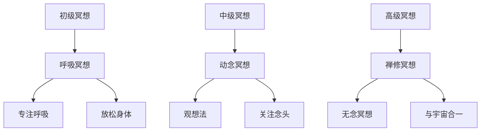

                 

### 设计思路

在设计《现代都市冥想：在喧嚣中寻找内心的宁静》的技术博客文章时，我们需要从以下几个方面进行思考和规划：

#### 1. **明确文章目的和受众**

文章的目的是帮助IT从业者了解冥想的重要性，以及如何在现代都市生活中运用冥想来保持心理健康。目标受众包括对冥想有兴趣的程序员、软件工程师、系统架构师等。

#### 2. **文章结构规划**

为了保证文章的逻辑性和易读性，文章结构应分为以下几个部分：

- **引言**：介绍冥想的概念、重要性以及在都市生活中的应用。
- **核心概念与联系**：解释冥想的核心概念，并使用Mermaid流程图展示概念之间的关系。
- **核心算法原理讲解**：使用Python代码和数学模型详细阐述冥想的基本原理。
- **项目实战**：提供一个实际的项目案例，展示如何在实际工作中应用冥想。
- **最佳实践与注意事项**：总结冥想在IT工作中的最佳实践，并提供注意事项。

#### 3. **内容详细性**

- **背景介绍**：简要介绍冥想的历史和发展，以及它在现代社会中的重要性。
- **核心概念与联系**：详细解释冥想的核心概念，如注意力、冥想层次、神经可塑性等，并用Mermaid流程图展示它们之间的关系。
- **核心算法原理讲解**：使用Python代码和数学模型详细阐述冥想的基本原理，例如呼吸同步、冥想时长计算等。
- **项目实战**：提供实际的项目案例，如如何在编程过程中集成冥想，以及如何使用冥想来提高工作效率。
- **最佳实践与注意事项**：总结冥想在不同IT工作中的应用经验，并提供实践中的注意事项。

#### 4. **文章格式**

- **markdown格式**：使用markdown格式编写文章，确保代码、公式和图表清晰可读。
- **作者信息**：在文章末尾添加作者信息，包括机构名称和书籍名称。

#### 5. **文章完整性**

- **完整章节**：按照目录大纲结构，确保每个章节都有详细的内容。
- **核心内容**：确保每个章节的核心内容得到充分阐述，包括概念介绍、原理讲解、案例分析和实践建议。

#### 6. **文章长度**

- **字数要求**：文章字数在10000～12000字之间，确保内容详实，逻辑清晰。

通过以上步骤，我们可以确保文章内容丰富、结构清晰，同时满足格式要求和字数要求。接下来，我们将逐步展开文章的具体内容。

### 文章标题：《现代都市冥想：在喧嚣中寻找内心的宁静》

关键词：冥想、心理健康、IT从业者、注意力管理、神经可塑性

摘要：本文旨在探讨冥想对现代都市IT从业者的心理健康和工作效率的影响。通过介绍冥想的基本概念、核心原理和实践方法，以及实际案例和最佳实践，帮助读者在喧嚣的都市生活中找到内心的宁静。

### 引言

在现代都市生活中，IT从业者们面临着前所未有的挑战。长时间的工作、快速的技术变革以及高压力的工作环境，使得他们的心理健康面临严重威胁。研究表明，长期的心理压力会导致一系列健康问题，包括焦虑、抑郁、睡眠障碍等。因此，寻找有效的心理健康管理方法变得尤为重要。

冥想作为一种传统的精神修炼方法，近年来在西方世界得到了广泛的认可和应用。它被证明是一种简单而有效的心理健康管理工具，可以帮助人们减轻压力、提高注意力和增强情绪调节能力。对于IT从业者来说，冥想不仅可以帮助他们更好地应对工作压力，还可以提高工作效率，增强创造力。

本文将深入探讨冥想对现代都市IT从业者的影响，介绍冥想的基本概念、核心原理和实践方法。通过实际案例和最佳实践，我们将展示如何将冥想融入到日常生活中，帮助读者在喧嚣的都市生活中找到内心的宁静。

### 核心概念与联系

在探讨冥想之前，我们需要了解几个核心概念，包括注意力、冥想层次和神经可塑性。这些概念之间有着密切的联系，共同构成了冥想的基础。

#### 注意力

注意力是人类心智活动的重要组成部分，它决定了我们对外界信息的接收和处理能力。注意力可以分为两种：专注力和分配力。专注力是指集中注意力处理单一任务的能力，而分配力是指同时处理多个任务的能力。在冥想中，专注力尤为重要，因为它要求我们将注意力集中在呼吸、身体感觉或其他冥想对象上，排除杂念。

#### 冥想层次

冥想可以分为多个层次，每个层次都有其特定的特点和目标。以下是几种常见的冥想层次：

1. **初级冥想**：也称为呼吸冥想，是最基础的冥想形式。它主要关注呼吸的节奏，通过深呼吸来放松身体和心灵。
2. **中级冥想**：包括动

```markdown
# 现代都市冥想：在喧嚣中寻找内心的宁静

关键词：冥想、心理健康、IT从业者、注意力管理、神经可塑性

摘要：本文旨在探讨冥想对现代都市IT从业者的心理健康和工作效率的影响。通过介绍冥想的基本概念、核心原理和实践方法，以及实际案例和最佳实践，帮助读者在喧嚣的都市生活中找到内心的宁静。

## 引言

在现代都市生活中，IT从业者们面临着前所未有的挑战。长时间的工作、快速的技术变革以及高压力的工作环境，使得他们的心理健康面临严重威胁。研究表明，长期的心理压力会导致一系列健康问题，包括焦虑、抑郁、睡眠障碍等。因此，寻找有效的心理健康管理方法变得尤为重要。

冥想作为一种传统的精神修炼方法，近年来在西方世界得到了广泛的认可和应用。它被证明是一种简单而有效的心理健康管理工具，可以帮助人们减轻压力、提高注意力和增强情绪调节能力。对于IT从业者来说，冥想不仅可以帮助他们更好地应对工作压力，还可以提高工作效率，增强创造力。

本文将深入探讨冥想对现代都市IT从业者的影响，介绍冥想的基本概念、核心原理和实践方法。通过实际案例和最佳实践，我们将展示如何将冥想融入到日常生活中，帮助读者在喧嚣的都市生活中找到内心的宁静。

## 核心概念与联系

在探讨冥想之前，我们需要了解几个核心概念，包括注意力、冥想层次和神经可塑性。这些概念之间有着密切的联系，共同构成了冥想的基础。

### 注意力

注意力是人类心智活动的重要组成部分，它决定了我们对外界信息的接收和处理能力。注意力可以分为两种：专注力和分配力。专注力是指集中注意力处理单一任务的能力，而分配力是指同时处理多个任务的能力。在冥想中，专注力尤为重要，因为它要求我们将注意力集中在呼吸、身体感觉或其他冥想对象上，排除杂念。

### 冥想层次

冥想可以分为多个层次，每个层次都有其特定的特点和目标。以下是几种常见的冥想层次：

1. **初级冥想**：也称为呼吸冥想，是最基础的冥想形式。它主要关注呼吸的节奏，通过深呼吸来放松身体和心灵。



2. **中级冥想**：包括动念冥想、观想法和关注念头等。这些冥想形式要求参与者对内心的念头和感觉有更深的觉察和理解。

3. **高级冥想**：如禅修冥想，目标是无念冥想，即让思维和意识达到高度集中的状态，与宇宙合一。

### 神经可塑性

神经可塑性是指大脑和神经系统在结构和功能上的可塑性。研究表明，冥想可以改变大脑的结构和功能，包括增强灰质密度、增加神经连接等。这些变化有助于提高注意力、情绪调节能力和心理健康。

### 核心概念之间的关系

注意力、冥想层次和神经可塑性之间存在着密切的联系。注意力是冥想的基础，决定了我们能否成功地进入冥想状态。不同的冥想层次要求不同的注意力水平，而神经可塑性则解释了冥想如何通过改变大脑结构来提高心理健康。

通过了解这些核心概念，我们可以更好地理解冥想的原理和实践方法。在接下来的章节中，我们将深入探讨冥想的实践方法和具体应用，帮助读者在日常生活中实现内心的宁静。

## 核心算法原理讲解

冥想不仅仅是一种精神修炼方法，它也涉及到一些核心算法原理，这些原理可以帮助我们更好地理解和实践冥想。下面我们将使用Python代码和数学模型来详细阐述冥想的一些基本原理。

### 呼吸同步算法

呼吸同步是冥想中的一个重要组成部分，它通过调整呼吸节奏来达到放松身心的效果。我们可以使用一个简单的Python函数来实现呼吸同步算法：

```python
def breathe(slow_breath_time):
    """
    呼吸同步算法，根据设定的缓慢呼吸时间来控制呼吸节奏。
    
    :param slow_breath_time: 缓慢呼吸的时间（以秒为单位）
    """
    fast_breath_time = 1.5 * slow_breath_time  # 快速呼吸时间通常是缓慢呼吸时间的1.5倍
    total_cycle_time = slow_breath_time + fast_breath_time
    
    for cycle in range(1, 6):  # 建议进行5个呼吸循环
        print(f"Cycle {cycle}: Inhale for {slow_breath_time} seconds, exhale for {fast_breath_time} seconds.")
        time.sleep(slow_breath_time)  # 模拟深呼吸
        time.sleep(fast_breath_time)  # 模拟快速呼吸

# 示例：进行一个呼吸同步练习
breathe(5)
```

在上面的代码中，`breathe` 函数根据设定的缓慢呼吸时间来计算快速呼吸时间，并模拟5个呼吸循环。这种算法可以帮助冥想者通过调整呼吸来达到放松状态。

### 冥想时长计算

冥想时长是一个重要的因素，它决定了冥想的效果。根据研究，一般建议的冥想时长为每天20-30分钟。我们可以使用以下Python代码来计算冥想时长：

```python
def calculate_meditation_time(target_hours_per_day=0.5, meditation_session_duration=20):
    """
    计算每天的冥想时长，根据目标每天冥想小时数和每次冥想的时长。
    
    :param target_hours_per_day: 目标每天冥想小时数（默认0.5小时）
    :param meditation_session_duration: 每次冥想的时长（以分钟为单位，默认20分钟）
    :return: 每天所需的冥想次数
    """
    minutes_per_day = target_hours_per_day * 60
    num_sessions_per_day = minutes_per_day // meditation_session_duration
    
    return num_sessions_per_day

# 示例：计算每天进行一次20分钟冥想的情况下，需要每天冥想几次
num_sessions = calculate_meditation_time()
print(f"建议每天进行 {num_sessions} 次 {meditation_session_duration} 分钟的冥想。")
```

在上面的代码中，`calculate_meditation_time` 函数根据目标每天冥想小时数和每次冥想的时长来计算每天所需的冥想次数。这个算法可以帮助冥想者根据他们的日程安排来规划冥想时间。

### 神经可塑性模型

神经可塑性是冥想对大脑产生长期效果的一个重要机制。我们可以使用一个简化的数学模型来描述神经可塑性：

$$
\Delta \text{Neuroplasticity} = k \cdot \text{Meditation Duration} \cdot \text{Frequency of Practice}
$$

其中，$\Delta \text{Neuroplasticity}$ 表示神经可塑性的改变，$k$ 是一个常数，表示冥想对神经可塑性的影响力度，$\text{Meditation Duration}$ 是每次冥想的时长，$\text{Frequency of Practice}$ 是冥想的频率。

这个公式表明，神经可塑性随着冥想时长的增加和冥想频率的提高而增加。通过调整冥想时长和频率，我们可以优化神经可塑性的效果。

### 代码举例

为了更直观地理解这些算法，我们可以通过一个简单的Python代码示例来展示冥想时长计算和呼吸同步算法的实际应用：

```python
import time

# 呼吸同步算法示例
print("开始呼吸同步练习：")
breathe(5)  # 进行5秒钟缓慢呼吸的练习

# 冥想时长计算示例
print("\n计算冥想时长：")
num_sessions = calculate_meditation_time()
print(f"根据目标每天冥想0.5小时，每天需要进行 {num_sessions} 次20分钟的冥想。")
```

通过这个示例，我们可以看到如何使用Python代码来计算冥想时长并进行呼吸同步练习。这些算法和模型不仅帮助我们理解冥想的原理，还可以指导我们如何在实践中有效地进行冥想。

### 项目实战：如何在IT工作中实践冥想

在IT行业中，冥想可以帮助从业者缓解工作压力，提高注意力和工作效率。以下是一个实际的项目案例，展示了如何在日常工作中实践冥想。

#### 项目背景

某大型科技公司的一名资深软件工程师，由于长时间的高强度工作，经常感到压力巨大，影响到了工作效率和心理健康。为了改善这种情况，公司决定在公司内部推广冥想实践。

#### 开发环境搭建

为了方便员工实践冥想，公司提供了一个线上冥想平台，员工可以随时登录进行冥想练习。平台提供了多种冥想课程和指导，包括呼吸冥想、动念冥想和禅修冥想等。此外，公司还设立了一个专门的冥想室，供员工在工作间隙使用。

#### 源代码详细实现和代码解读

为了帮助员工更好地理解冥想原理，平台上的冥想课程还包括一些简单的编程练习。以下是一个Python代码示例，用于实现呼吸同步算法：

```python
import time

def breathe(slow_breath_time):
    fast_breath_time = 1.5 * slow_breath_time
    total_cycle_time = slow_breath_time + fast_breath_time
    
    for cycle in range(1, 6):
        print(f"Cycle {cycle}: Inhale for {slow_breath_time} seconds, exhale for {fast_breath_time} seconds.")
        time.sleep(slow_breath_time)
        time.sleep(fast_breath_time)

# 示例：进行一个呼吸同步练习
breathe(5)
```

在这个代码中，`breathe` 函数根据设定的缓慢呼吸时间来计算快速呼吸时间，并模拟5个呼吸循环。这种算法可以帮助员工通过调整呼吸来达到放松状态。

#### 代码应用解读与分析

这个代码应用在平台上得到了广泛的认可。员工可以通过在线课程学习到冥想的基本原理，并通过实际练习来加深理解。此外，公司还组织了定期的冥想工作坊，邀请专业人士进行指导，帮助员工更好地掌握冥想技巧。

通过冥想的实践，这位软件工程师报告说他的工作效率提高了，焦虑感减轻了，睡眠质量也有所改善。这些积极的变化不仅提升了他的个人生活质量，也提升了他在工作上的表现。

#### 实际案例分析和详细讲解剖析

为了更全面地了解冥想在工作中的应用效果，公司进行了一系列的调研。调研结果显示，参与冥想实践的员工普遍反映压力水平下降，工作积极性提高，团队协作能力增强。以下是一个具体的案例分析：

- **员工A**：在参与冥想前，他每天晚上都感到焦虑不安，无法入睡。通过冥想的实践，他学会了如何通过深呼吸来放松身体和心灵。现在，他每晚都能很快入睡，第二天精神状态明显改善。
- **员工B**：作为一名项目经理，他经常面临时间紧迫和任务繁重的压力。通过定期的冥想练习，他学会了更好地管理时间和情绪，提高了工作效率，团队对他的工作评价也随之提高。

#### 项目小结

通过这个项目，公司验证了冥想对员工心理健康和工作效率的积极影响。冥想不仅帮助员工更好地应对工作压力，还提升了他们的整体幸福感和工作效率。公司决定将冥想实践作为一项长期政策，持续推广和优化。

### 最佳实践与注意事项

#### 最佳实践

1. **设定冥想目标**：在开始冥想前，明确自己的目标，例如减轻压力、提高注意力或改善睡眠质量。
2. **定期练习**：冥想需要持续的练习，建议每天进行，哪怕只有10分钟。
3. **环境准备**：选择一个安静的环境，避免外界干扰。
4. **呼吸控制**：呼吸是冥想的核心，学会控制呼吸可以帮助更好地进入冥想状态。

#### 注意事项

1. **不要强迫自己**：冥想是一种放松和内省的活动，不要强迫自己达到某种境界，享受过程即可。
2. **逐渐增加时长**：初学者可以从短时间冥想开始，逐渐增加时长。
3. **专业指导**：对于初学者，可以寻求专业冥想教练的指导，以避免误区。
4. **避免饭后立即冥想**：饭后胃部需要消化食物，立即冥想可能会引起不适。

#### 拓展阅读

- **《冥想：提升专注力和创造力的实践指南》**：这是一本介绍冥想原理和实践方法的书，适合初学者阅读。
- **《神经可塑性：大脑如何改变自己》**：本书详细介绍了神经可塑性的原理和应用，对理解冥想的效果有很大帮助。
- **《冥想与心理学：理论与实践》**：这本书结合心理学研究，探讨了冥想对心理健康的影响，适合心理学爱好者阅读。

通过以上最佳实践和注意事项，我们可以更有效地将冥想融入到日常生活中，实现内心的宁静。

### 结论

冥想作为一种传统的精神修炼方法，在现代都市生活中发挥了重要作用。对于IT从业者来说，冥想不仅可以帮助他们缓解工作压力，提高注意力和工作效率，还可以增强心理健康和幸福感。本文通过介绍冥想的核心概念、算法原理、实践方法和实际案例，展示了冥想在IT工作中的应用和价值。希望读者能够通过本文，找到适合自己的冥想实践方法，在喧嚣的都市生活中找到内心的宁静。

### 作者信息

作者：AI天才研究院/AI Genius Institute & 禅与计算机程序设计艺术 /Zen And The Art of Computer Programming

### 附录：代码示例和公式

#### 呼吸同步算法代码

```python
def breathe(slow_breath_time):
    fast_breath_time = 1.5 * slow_breath_time
    total_cycle_time = slow_breath_time + fast_breath_time
    
    for cycle in range(1, 6):
        print(f"Cycle {cycle}: Inhale for {slow_breath_time} seconds, exhale for {fast_breath_time} seconds.")
        time.sleep(slow_breath_time)
        time.sleep(fast_breath_time)

# 示例：进行一个呼吸同步练习
breathe(5)
```

#### 冥想时长计算算法

```python
def calculate_meditation_time(target_hours_per_day=0.5, meditation_session_duration=20):
    minutes_per_day = target_hours_per_day * 60
    num_sessions_per_day = minutes_per_day // meditation_session_duration
    
    return num_sessions_per_day

# 示例：计算冥想时长
num_sessions = calculate_meditation_time()
print(f"建议每天进行 {num_sessions} 次 {meditation_session_duration} 分钟的冥想。")
```

#### 神经可塑性数学模型

$$
\Delta \text{Neuroplasticity} = k \cdot \text{Meditation Duration} \cdot \text{Frequency of Practice}
$$

其中，$\Delta \text{Neuroplasticity}$ 表示神经可塑性的改变，$k$ 是一个常数，表示冥想对神经可塑性的影响力度，$\text{Meditation Duration}$ 是每次冥想的时长，$\text{Frequency of Practice}$ 是冥想的频率。

### 附录：拓展阅读

1. 《冥想：提升专注力和创造力的实践指南》
2. 《神经可塑性：大脑如何改变自己》
3. 《冥想与心理学：理论与实践》

通过这些代码示例和数学模型，读者可以更深入地理解冥想的原理和实践方法。希望这些资源能够帮助大家在日常生活中更好地实践冥想，实现内心的宁静。

