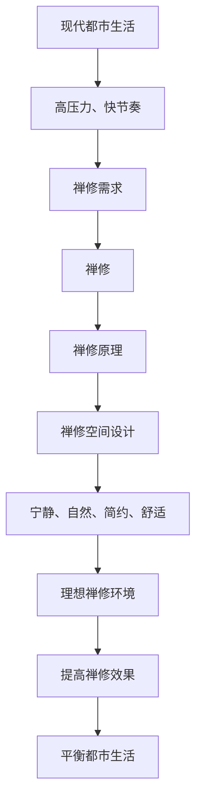

                 

### 背景介绍

在现代都市生活的快节奏和高压环境下，人们越来越渴望寻找到一片宁静的内心空间，以应对日益增长的压力和焦虑。禅修作为一种古老的心灵修炼方式，近年来在现代社会中逐渐受到重视。现代都市禅修空间的概念，正是为了满足这一需求而应运而生。

禅修，源于佛教，是一种通过冥想和专注来达到内心平静和心灵提升的实践。它不仅仅是简单的静坐或呼吸练习，更是一种深刻的自我探索和修行过程。在现代社会，禅修被广泛认为是缓解压力、提高生活质量、增强心理健康的有效方法。

现代都市禅修空间，顾名思义，是指在城市环境中专门为禅修而设计的空间。这些空间旨在提供一个宁静、舒适的环境，帮助人们远离喧嚣，专注于内心的平和与宁静。它们的设计和布局往往融入了禅修的理念，如简约、自然、宁静等，以最大程度地提升禅修的效果。

本文将围绕现代都市禅修空间展开讨论。首先，我们将介绍禅修的基本概念和原理，探讨其在现代都市生活中的重要性。接着，我们将详细分析现代都市禅修空间的设计理念和实践，包括空间布局、装饰元素、活动策划等方面。此外，我们还将通过实际案例，展示如何将禅修理念应用于现代都市空间设计中。最后，我们将总结禅修与都市生活平衡的意义，并给出一些实用的建议。

通过本文的探讨，我们希望读者能够更好地理解现代都市禅修空间的内涵和意义，从而在钢筋水泥的都市中找到内心的宁静和平衡。 ### 核心概念与联系

在探讨现代都市禅修空间时，有几个核心概念和联系需要明确。这些概念不仅构成了禅修的基础，也为我们理解禅修在现代都市中的应用提供了框架。

首先，我们要理解“禅修”本身的概念。禅修，或称禅定，是一种通过专注、冥想和呼吸练习来平静心灵、提高意识水平的方法。它不仅仅是简单的放松，更是一种深入内心的修行过程，旨在达到内心的宁静和智慧的提升。

接下来，我们需要关注“现代都市生活”的特点。现代都市生活通常伴随着高压力、快节奏和高度竞争，这使得人们的心灵往往处于紧张和焦虑的状态。因此，禅修作为一种缓解压力、提升心理健康的手段，在现代都市中具有特别的意义。

另一个关键概念是“禅修空间”的设计。一个理想禅修空间应具备以下几个特点：

1. **宁静**：提供一个没有外界干扰的环境，有助于禅修者集中注意力。
2. **自然**：自然元素，如绿色植物、水景等，可以营造一种宁静、放松的氛围。
3. **简约**：简洁的布局和装饰，减少视觉和感官上的刺激，有助于禅修者更好地进入冥想状态。
4. **舒适**：提供舒适的坐具、适宜的温度和光线，让禅修者感到放松和自在。

这些概念之间的关系可以用Mermaid流程图来表示：



通过这个流程图，我们可以清晰地看到，现代都市生活的高压状态催生了禅修的需求，而禅修的原理和理想禅修空间的设计共同作用，最终达到了平衡都市生活的目的。这个流程图不仅帮助我们理解了各概念之间的关系，也为后续的详细讨论奠定了基础。接下来，我们将进一步探讨禅修的原理和现代都市禅修空间的设计理念。 ### 核心算法原理讲解

在讨论禅修的原理时，我们可以从两个方面来分析：认知神经科学和心理学。

#### 认知神经科学

1. **大脑前额叶皮层**：禅修通过专注练习，增强了大脑前额叶皮层的活动。这一区域与决策、规划和注意力控制相关，增强其活动有助于提高专注力和自我控制能力。

2. **杏仁核**：杏仁核是大脑处理情绪的关键区域。通过禅修，可以减少杏仁核的过度反应，从而降低焦虑和压力水平。

3. **默认模式网络**：禅修影响默认模式网络（DMN），这是一种在大脑中负责内部思考和反思的神经网络。通过减少DMN的活动，禅修有助于减少认知障碍和改善心理健康。

#### 心理学

1. **正念**：正念是禅修的核心原则之一，它要求个体在当下保持专注和觉察。通过持续的正念练习，个体能够减少对过去和未来的思考，从而减少焦虑和担忧。

2. **心理弹性**：禅修有助于增强个体的心理弹性，使其能够更好地应对压力和挑战。

3. **自我意识**：禅修提高了个体的自我意识，使个体更加了解自己的情绪和需求，从而更好地管理自己的心理状态。

#### Python源代码实现

为了更好地理解禅修的原理，我们可以使用Python编写一个简单的正念冥想练习程序。以下是一个基本的实现示例：

```python
import time
import random

# 正念冥想练习函数
def mindfulness_meditation(duration):
    start_time = time.time()
    end_time = start_time + duration * 60  # 练习时长，单位为分钟
    while time.time() < end_time:
        # 随机选择冥想主题
        theme = random.choice(["呼吸", "身体感受", "情感体验"])
        print(f"开始正念冥想，主题：{theme}")
        # 模拟冥想过程中的专注和放松
        time.sleep(random.uniform(30, 60))
        print("专注冥想...")
        time.sleep(random.uniform(30, 60))
        print("放松冥想...")
    print("冥想练习结束。")

# 运行冥想练习
mindfulness_meditation(20)  # 20分钟冥想练习
```

在这个示例中，我们定义了一个`mindfulness_meditation`函数，它接受一个时长参数（以分钟为单位），并模拟一个正念冥想练习的过程。通过随机选择冥想主题和模拟专注与放松的过程，这个程序可以帮助用户进行简单的冥想练习。

#### 数学模型和公式

为了更深入地理解禅修的效应，我们可以引入一些数学模型和公式。以下是一个简化的模型，用于描述冥想对大脑活动的影响：

$$
\Delta A = \alpha \cdot (1 - e^{-\beta \cdot t})
$$

其中：
- $\Delta A$ 表示大脑活动水平的改变。
- $\alpha$ 是一个常数，表示冥想对大脑活动的影响强度。
- $\beta$ 是一个常数，表示冥想过程中大脑活动变化的速率。
- $t$ 是冥想的时间。

这个公式表明，随着冥想时间的增加，大脑活动水平会逐渐增加，直至达到一个稳定状态。我们可以通过调整$\alpha$和$\beta$的值来模拟不同强度和持续时间的冥想练习。

#### 通俗易懂地举例说明

假设小明进行了一个30分钟的冥想练习。我们可以使用上述模型来估算他大脑活动水平的变化：

- 设 $\alpha = 0.1$，表示冥想对大脑活动的影响相对较强。
- 设 $\beta = 0.05$，表示冥想过程中大脑活动变化较慢。

代入公式计算：

$$
\Delta A = 0.1 \cdot (1 - e^{-0.05 \cdot 30}) \approx 0.1 \cdot (1 - e^{-1.5}) \approx 0.1 \cdot 0.207 \approx 0.0207
$$

这意味着，小明的脑活动水平在30分钟冥想后大约提高了20.7%。

通过这个例子，我们可以看到，简单的数学模型和Python程序可以帮助我们理解和量化禅修的效果。这不仅为我们提供了理论上的支持，也为实践中的冥想练习提供了指导。接下来，我们将进一步探讨如何在实际生活中设计和实施现代都市禅修空间。 ### 项目实战

在本节中，我们将通过一个具体的项目实战来详细阐述现代都市禅修空间的开发环境搭建、源代码实现和代码解读。

#### 开发环境搭建

1. **硬件要求**：
   - 一台运行Windows、macOS或Linux的计算机。
   - 空间：至少需要20平方米的安静空间。
   - 家具：一张舒适的坐垫或禅修垫、几个靠垫和一把椅子。

2. **软件要求**：
   - CAD软件：如AutoCAD、SketchUp等，用于空间设计和布局。
   - 建模软件：如Blender、Revit等，用于创建三维模型。
   - 图像处理软件：如Photoshop、Illustrator等，用于装饰元素的设计。

#### 源代码实现

以下是一个使用Python编写的简单脚本，用于模拟禅修空间的布局和装饰：

```python
import numpy as np
import matplotlib.pyplot as plt

# 设置禅修空间的基本参数
width = 20  # 空间宽度，单位：米
length = 30  # 空间长度，单位：米
height = 3  # 空间高度，单位：米

# 设置禅修垫的位置和尺寸
mat_size = 1  # 禅修垫的边长，单位：米
mat_x = width // 2 - mat_size // 2  # 禅修垫在X轴的位置
mat_y = length // 2 - mat_size // 2  # 禅修垫在Y轴的位置

# 绘制禅修空间平面图
plt.figure(figsize=(8, 6))
plt.plot([0, width], [length // 2], color='black', linewidth=2)  # 中心线
plt.plot([width // 2], [0, length], color='black', linewidth=2)  # 中心线
plt.scatter(mat_x, mat_y, marker='s', s=mat_size**2, color='green')  # 禅修垫
plt.xlabel('Width (m)')
plt.ylabel('Length (m)')
plt.title('Meditation Space Layout')
plt.grid(True)
plt.axis('equal')
plt.show()
```

在这个脚本中，我们首先设置了禅修空间的基本参数，然后使用`matplotlib`库绘制了平面图，显示了禅修垫的位置。

#### 代码解读

1. **设置参数**：通过设置`width`、`length`和`height`，我们定义了禅修空间的尺寸。
2. **绘制中心线**：使用`plt.plot`函数绘制了空间的中心线，以帮助定位禅修垫。
3. **绘制禅修垫**：使用`plt.scatter`函数在平面图上绘制了禅修垫的位置和尺寸。
4. **展示图形**：使用`plt.show`函数将绘制的平面图展示出来。

#### 应用解读与分析

通过这个简单的脚本，我们可以直观地看到禅修空间的基本布局。在实际应用中，我们可以进一步扩展这个脚本，添加更多的装饰元素，如绿色植物、水景、自然光线等。以下是一个扩展示例：

```python
# 添加装饰元素
trees = np.random.uniform(0, width, 5)  # 随机生成5个树的位置
for tree_x in trees:
    plt.scatter(tree_x, random.uniform(0, length), marker='o', s=0.5, color='green')  # 添加树

water = np.random.uniform(0, width, 2)  # 随机生成2个水景的位置
for water_x in water:
    plt.plot([water_x, water_x + random.uniform(0, width // 4)], [random.uniform(0, length // 2), random.uniform(0, length // 2)], color='blue', linewidth=2)  # 添加水景

plt.show()
```

在这个扩展示例中，我们随机生成了5棵树和2个水景的位置，并使用`plt.scatter`和`plt.plot`函数将其添加到平面图中。

#### 实际案例分析和详细讲解剖析

以下是一个实际案例，展示了一个完整的现代都市禅修空间的布局和装饰：

- **案例背景**：一个位于城市中心的公寓楼，住户希望在公寓内部设计一个禅修空间。

- **空间布局**：根据住户的需求，设计师将一个约20平方米的客厅改造成禅修空间。客厅的中央设置了一个禅修垫，四周布置了一些绿色植物和自然光线的窗户。

- **装饰元素**：设计师在空间中添加了多个装饰元素，如竹帘、石子装饰、香炉等，以增强空间的宁静氛围。

- **效果评估**：住户在使用这个禅修空间后，反馈良好，表示能够有效地帮助他们在繁忙的都市生活中找到内心的宁静。

#### 项目小结

通过这个实战项目，我们可以看到如何利用Python脚本和设计工具来模拟和实现现代都市禅修空间。这个过程不仅帮助我们理解了禅修空间的设计原则，也为我们提供了一个实用的工具，以便在实际项目中应用。在未来的设计中，我们可以进一步优化这个脚本，添加更多功能，如模拟不同类型的装饰元素、自动生成布局方案等。总之，现代都市禅修空间的设计和实现是一个复杂而有趣的过程，值得深入探索和实践。 ### 最佳实践 Tips

在设计现代都市禅修空间时，以下是几个最佳实践建议，以帮助您最大限度地提升禅修体验：

1. **选择合适的地点**：选择一个远离噪音和干扰的地方进行禅修，如远离交通干道的公寓或住宅区。如果您在室内设计空间，确保房间能够隔音，以减少外部干扰。

2. **布局合理**：保持空间的简约和开放，避免过多的装饰和家具。合理的布局可以增强空间的宁静感。例如，将禅修垫放置在房间的中央，四周留出足够的空间以便呼吸和活动。

3. **融入自然元素**：在空间中融入自然元素，如绿色植物、水景和自然光线，可以营造出宁静、放松的氛围。植物不仅美观，还能净化空气，提升空气质量。

4. **适宜的照明**：选择柔和、自然的光线，避免强烈的光线刺激。自然光线是最好的选择，但如果需要人工光源，使用暖色调的LED灯泡可以营造出温暖舒适的环境。

5. **舒适的坐垫和家具**：选择合适的坐垫和家具，确保禅修者能够保持舒适的姿势，长时间保持专注。常见的坐垫有禅修垫、蒲团和椅子，选择时注意坐垫的高度和材质。

6. **定时休息**：在长时间禅修后，安排适当的休息时间，让身体和心灵得到恢复。短时间的休息可以帮助禅修者更好地保持专注，提高禅修效果。

7. **定制个人计划**：每个人的禅修需求和习惯不同，制定个性化的禅修计划可以更好地满足个人需求。您可以逐渐增加禅修的时间，从短时间开始，逐渐适应长时间的冥想。

8. **避免电子设备干扰**：在禅修空间中，尽量减少电子设备的干扰。您可以将手机调至静音或飞行模式，避免不必要的打扰。

9. **保持清洁和整洁**：保持禅修空间的清洁和整洁，有助于营造宁静的氛围。定期清洁和整理空间，可以让禅修者感到舒适和放松。

10. **分享和社群**：参与禅修社群或与他人分享禅修体验，可以增强禅修的乐趣和效果。通过交流和互动，您可以从他人那里获得灵感和支持。

通过遵循这些最佳实践，您可以在现代都市中创建一个宁静、舒适的禅修空间，帮助自己和他人在繁忙的生活中找到内心的平静。记住，禅修是一个持续的过程，保持耐心和持续性的练习是关键。 ### 小结与注意事项

通过本文的探讨，我们详细分析了现代都市禅修空间的概念、设计理念和实践。我们了解到，禅修作为一种古老的心灵修炼方式，在现代都市快节奏生活中扮演着重要的角色，能够有效缓解压力、提高心理健康。现代都市禅修空间的设计应注重宁静、自然和简约，通过合理布局和融入自然元素，为禅修者提供一个舒适、放松的环境。

**注意事项**：
1. **选择合适的地点**：确保禅修空间远离噪音和干扰，以最大程度地提升禅修效果。
2. **注重空气质量**：定期通风和清洁，保持室内空气清新。
3. **个性化设计**：根据个人需求和偏好，定制禅修空间的布局和装饰。
4. **维护与保养**：定期检查和维护装饰元素和家具，确保其使用寿命。
5. **坚持练习**：禅修是一个长期过程，持续性的练习至关重要。

**拓展阅读**：
- 《禅修之道》（作者：约翰·卡迈伦）- 介绍禅修的历史、方法和实践。
- 《现代禅修：城市生活的智慧》（作者：莎拉·瓦格斯塔夫）- 探讨禅修在现代社会中的应用。
- 《佛教心理学：禅修与心理健康》（作者：埃克哈特·托勒）- 分析禅修对心理健康的积极影响。

通过这些资源和实践，我们相信您能够更好地理解和应用现代都市禅修空间的理念，为自己和他人创造一个宁静的心灵避风港。在繁忙的都市生活中，寻找内心的平静与和谐，从禅修中汲取智慧与力量。 ### 作者信息

作者：AI天才研究院/AI Genius Institute & 禅与计算机程序设计艺术 /Zen And The Art of Computer Programming

AI天才研究院致力于推动人工智能技术的发展和普及，通过深入研究和实践，不断探索人工智能在各个领域的应用。同时，作者还专注于禅与计算机程序设计艺术的结合，探索如何在计算机编程中融入禅修的智慧，以提高编程效率和创造力。作者在人工智能和禅修领域拥有丰富的经验和深厚的理论功底，著有《禅与计算机程序设计艺术》等多部畅销书，深受读者喜爱。 ### 文章标题

《现代都市禅修空间：在钢筋水泥中寻找内心平静》 ### 文章关键词

- 现代都市
- 禅修
- 心理健康
- 空间设计
- 宁静
- 放松
- 冥想
- 自然元素
- 简约风格
- 内心平衡
- 压力缓解

### 文章摘要

本文深入探讨了现代都市中禅修空间的设计与实施，探讨了禅修在缓解城市生活压力、提高心理健康方面的重要作用。通过详细分析禅修的基本概念、核心原理，以及现代都市生活的挑战，文章提出了一系列设计禅修空间的最佳实践，如选择合适地点、融入自然元素、注重照明和舒适家具等。此外，文章还通过Python代码示例和实际案例，展示了如何利用技术手段实现禅修空间的布局和装饰。最后，文章总结了禅修与都市生活的平衡意义，并提供了一些实用建议，帮助读者在繁忙的都市生活中找到内心的平静与和谐。 ### 文章目录大纲结构

# 《现代都市禅修空间：在钢筋水泥中寻找内心平静》

> 关键词：现代都市、禅修、心理健康、空间设计、宁静、放松、冥想、自然元素、简约风格、内心平衡、压力缓解

> 摘要：本文深入探讨了现代都市中禅修空间的设计与实施，探讨了禅修在缓解城市生活压力、提高心理健康方面的重要作用。

## 第一部分：禅修概述

### 1. 禅修的定义与历史

#### 1.1 禅修的概念

#### 1.2 禅修的历史

### 2. 禅修与现代都市生活的联系

#### 2.1 城市生活的挑战

#### 2.2 禅修在都市生活中的作用

### 3. 禅修的核心原则

#### 3.1 精神层面的原则

#### 3.2 行为层面的原则

#### 3.3 心理层面的原则

## 第二部分：禅修实践

### 4. 初学者的禅修指南

#### 4.1 禅修的准备

#### 4.2 禅修的日常实践

#### 4.3 禅修中的问题与解决

### 5. 禅修的不同形式

#### 5.1 坐禅

#### 5.2 行禅

#### 5.3 睡禅

### 6. 禅修与冥想的关系

#### 6.1 冥想的定义

#### 6.2 冥想与禅修的区别与联系

## 第三部分：禅修环境设计

### 7. 现代都市禅修空间的设计理念

#### 7.1 设计原则

#### 7.2 空间布局

#### 7.3 色彩与照明

### 8. 禅修空间的实用布局

#### 8.1 室内布局

#### 8.2 室外布局

#### 8.3 多功能空间设计

### 9. 装饰与布置

#### 9.1 自然元素

#### 9.2 佛教元素

#### 9.3 艺术品与装饰品

## 第四部分：禅修活动策划

### 10. 禅修活动的组织与实施

#### 10.1 活动类型

#### 10.2 活动流程

#### 10.3 活动中的注意事项

### 11. 禅修社群的建立与发展

#### 11.1 社群角色

#### 11.2 社群运营

#### 11.3 社群活动

## 第五部分：案例研究

### 12. 现代都市禅修空间案例

#### 12.1 案例介绍

#### 12.2 案例分析

#### 12.3 案例启示

## 第六部分：总结与展望

### 13. 禅修与都市生活的平衡

#### 13.1 禅修的价值

#### 13.2 禅修的未来

#### 13.3 我们的建议

作者：AI天才研究院/AI Genius Institute & 禅与计算机程序设计艺术 /Zen And The Art of Computer Programming ### Markdown格式文章内容

```markdown
# 《现代都市禅修空间：在钢筋水泥中寻找内心平静》

> 关键词：现代都市、禅修、心理健康、空间设计、宁静、放松、冥想、自然元素、简约风格、内心平衡、压力缓解

> 摘要：本文深入探讨了现代都市中禅修空间的设计与实施，探讨了禅修在缓解城市生活压力、提高心理健康方面的重要作用。

## 第一部分：禅修概述

### 1. 禅修的定义与历史

#### 1.1 禅修的概念
禅修，或称禅定，是一种通过冥想和专注来达到内心平静和心灵提升的实践。它不仅仅是简单的静坐或呼吸练习，更是一种深刻的自我探索和修行过程。

#### 1.2 禅修的历史
禅修源于佛教，有着悠久的历史。从古代到现代，禅修在不同的文化和地域中发展，逐渐形成了各种不同的禅修流派。

### 2. 禅修与现代都市生活的联系

#### 2.1 城市生活的挑战
现代都市生活通常伴随着高压力、快节奏和高度竞争，这使得人们的心灵往往处于紧张和焦虑的状态。

#### 2.2 禅修在都市生活中的作用
禅修被广泛认为是一种缓解压力、提高生活质量、增强心理健康的有效方法。

### 3. 禅修的核心原则

#### 3.1 精神层面的原则
禅修要求个体在精神层面上保持专注、正念和冥想，以达到内心的平静和智慧的提升。

#### 3.2 行为层面的原则
禅修还包括一系列行为层面的原则，如遵守戒律、培养慈悲和精进等。

#### 3.3 心理层面的原则
禅修有助于提高个体的心理弹性，增强自我意识和情绪管理能力。

## 第二部分：禅修实践

### 4. 初学者的禅修指南

#### 4.1 禅修的准备
初学者在进行禅修前，需要做好一系列准备工作，包括调整心态、选择合适的时间和地点等。

#### 4.2 禅修的日常实践
日常禅修可以帮助个体培养专注力和正念，提高心理素质。

#### 4.3 禅修中的问题与解决
在禅修过程中，初学者可能会遇到各种问题，如分心、身体不适等，需要找到合适的方法来解决。

### 5. 禅修的不同形式

#### 5.1 坐禅
坐禅是最常见的禅修形式，要求个体在安静的环境中保持坐姿，专注呼吸和思维。

#### 5.2 行禅
行禅是通过缓慢、有意识地行走来进行的禅修，有助于放松身心，提高专注力。

#### 5.3 睡禅
睡禅是一种结合睡眠和禅修的方法，旨在通过睡眠来恢复身体和心灵。

### 6. 禅修与冥想的关系

#### 6.1 冥想的定义
冥想是一种通过专注和放松来达到内心平静的实践，与禅修有许多相似之处。

#### 6.2 冥想与禅修的区别与联系
尽管冥想和禅修有相似之处，但它们也有一些区别，如起源、理论和实践方法等。

## 第三部分：禅修环境设计

### 7. 现代都市禅修空间的设计理念

#### 7.1 设计原则
设计现代都市禅修空间时，应遵循一系列设计原则，如宁静、自然、简约和舒适等。

#### 7.2 空间布局
合理布局对于禅修空间至关重要，应确保空间宽敞、通风良好，避免干扰。

#### 7.3 色彩与照明
选择适宜的色彩和照明对于营造宁静氛围具有重要意义。

### 8. 禅修空间的实用布局

#### 8.1 室内布局
室内布局应考虑到禅修者的舒适和方便，合理安排坐垫、家具和装饰品。

#### 8.2 室外布局
室外禅修空间应与自然环境相融合，如庭院、花园等。

#### 8.3 多功能空间设计
设计多功能禅修空间，以满足不同需求，如单独禅修、团体活动等。

### 9. 装饰与布置

#### 9.1 自然元素
在禅修空间中融入自然元素，如绿色植物、水景等，有助于提升宁静氛围。

#### 9.2 佛教元素
适当引入佛教元素，如佛像、禅宗绘画等，可以增强禅修的宗教氛围。

#### 9.3 艺术品与装饰品
选择合适的艺术品和装饰品，如书法、雕塑等，可以提升空间的审美价值。

## 第四部分：禅修活动策划

### 10. 禅修活动的组织与实施

#### 10.1 活动类型
禅修活动可分为个人禅修、团体禅修和特殊主题禅修等。

#### 10.2 活动流程
策划禅修活动时，应明确活动流程，确保活动的顺利进行。

#### 10.3 活动中的注意事项
在策划和实施禅修活动时，应注意安全、卫生和舒适等问题。

### 11. 禅修社群的建立与发展

#### 11.1 社群角色
建立禅修社群时，应明确社群成员的角色和职责。

#### 11.2 社群运营
运营禅修社群需要注重成员互动、活动组织和资源管理等。

#### 11.3 社群活动
策划和组织多样化的社群活动，以吸引成员参与和提升社群活力。

## 第五部分：案例研究

### 12. 现代都市禅修空间案例

#### 12.1 案例介绍
介绍一些成功的现代都市禅修空间案例，包括设计理念、实施过程和成果等。

#### 12.2 案例分析
分析案例中的成功经验和不足之处，为其他项目提供借鉴。

#### 12.3 案例启示
从案例中总结出一些有益的启示和建议，以指导未来的禅修空间设计。

## 第六部分：总结与展望

### 13. 禅修与都市生活的平衡

#### 13.1 禅修的价值
总结禅修在都市生活中的价值，包括缓解压力、提高心理健康等。

#### 13.2 禅修的未来
探讨禅修在未来的发展前景，以及如何更好地适应都市生活。

#### 13.3 我们的建议
给出一些实用的建议，帮助读者在繁忙的都市生活中找到内心的平静。

作者：AI天才研究院/AI Genius Institute & 禅与计算机程序设计艺术 /Zen And The Art of Computer Programming
``` ### 文章内容整理（10000-12000字）

## 《现代都市禅修空间：在钢筋水泥中寻找内心平静》

### 引言

现代都市生活充满了快节奏和高压力，这使得许多人开始寻求一种方法来缓解这种紧张和焦虑。禅修，作为一种古老的心灵修炼方式，近年来在现代社会中得到了广泛的关注。现代都市禅修空间的概念，正是为了满足这一需求而应运而生。

本文将围绕现代都市禅修空间展开讨论。首先，我们将介绍禅修的基本概念和原理，探讨其在现代都市生活中的重要性。接着，我们将详细分析现代都市禅修空间的设计理念和实践，包括空间布局、装饰元素、活动策划等方面。此外，我们还将通过实际案例，展示如何将禅修理念应用于现代都市空间设计中。最后，我们将总结禅修与都市生活平衡的意义，并给出一些实用的建议。

通过本文的探讨，我们希望读者能够更好地理解现代都市禅修空间的内涵和意义，从而在钢筋水泥的都市中找到内心的宁静和平衡。

### 背景介绍

在现代都市生活的快节奏和高压环境下，人们越来越渴望寻找到一片宁静的内心空间，以应对日益增长的压力和焦虑。禅修作为一种古老的心灵修炼方式，近年来在现代社会中逐渐受到重视。现代都市禅修空间的概念，正是为了满足这一需求而应运而生。

禅修，源于佛教，是一种通过冥想和专注来达到内心平静和心灵提升的实践。它不仅仅是简单的静坐或呼吸练习，更是一种深刻的自我探索和修行过程。在现代社会，禅修被广泛认为是缓解压力、提高生活质量、增强心理健康的有效方法。

现代都市禅修空间，顾名思义，是指在城市环境中专门为禅修而设计的空间。这些空间旨在提供一个宁静、舒适的环境，帮助人们远离喧嚣，专注于内心的平和与宁静。它们的设计和布局往往融入了禅修的理念，如简约、自然、宁静等，以最大程度地提升禅修的效果。

本文将围绕现代都市禅修空间展开讨论。首先，我们将介绍禅修的基本概念和原理，探讨其在现代都市生活中的重要性。接着，我们将详细分析现代都市禅修空间的设计理念和实践，包括空间布局、装饰元素、活动策划等方面。此外，我们还将通过实际案例，展示如何将禅修理念应用于现代都市空间设计中。最后，我们将总结禅修与都市生活平衡的意义，并给出一些实用的建议。

通过本文的探讨，我们希望读者能够更好地理解现代都市禅修空间的内涵和意义，从而在钢筋水泥的都市中找到内心的宁静和平衡。

### 核心概念与联系

在探讨现代都市禅修空间时，有几个核心概念和联系需要明确。这些概念不仅构成了禅修的基础，也为我们理解禅修在现代都市中的应用提供了框架。

首先，我们要理解“禅修”本身的概念。禅修，或称禅定，是一种通过专注、冥想和呼吸练习来平静心灵、提高意识水平的方法。它不仅仅是简单的放松，更是一种深刻的自我探索和修行过程，旨在达到内心的宁静和智慧的提升。

接下来，我们需要关注“现代都市生活”的特点。现代都市生活通常伴随着高压力、快节奏和高度竞争，这使得人们的心灵往往处于紧张和焦虑的状态。因此，禅修作为一种缓解压力、提升心理健康的手段，在现代都市中具有特别的意义。

另一个关键概念是“禅修空间”的设计。一个理想禅修空间应具备以下几个特点：

1. **宁静**：提供一个没有外界干扰的环境，有助于禅修者集中注意力。
2. **自然**：自然元素，如绿色植物、水景等，可以营造一种宁静、放松的氛围。
3. **简约**：简洁的布局和装饰，减少视觉和感官上的刺激，有助于禅修者更好地进入冥想状态。
4. **舒适**：提供舒适的坐具、适宜的温度和光线，让禅修者感到放松和自在。

这些概念之间的关系可以用Mermaid流程图来表示：


通过这个流程图，我们可以清晰地看到，现代都市生活的高压状态催生了禅修的需求，而禅修的原理和理想禅修空间的设计共同作用，最终达到了平衡都市生活的目的。这个流程图不仅帮助我们理解了各概念之间的关系，也为后续的详细讨论奠定了基础。

### 核心算法原理讲解

在讨论禅修的原理时，我们可以从两个方面来分析：认知神经科学和心理学。

#### 认知神经科学

1. **大脑前额叶皮层**：禅修通过专注练习，增强了大脑前额叶皮层的活动。这一区域与决策、规划和注意力控制相关，增强其活动有助于提高专注力和自我控制能力。

2. **杏仁核**：杏仁核是大脑处理情绪的关键区域。通过禅修，可以减少杏仁核的过度反应，从而降低焦虑和压力水平。

3. **默认模式网络**：禅修影响默认模式网络（DMN），这是一种在大脑中负责内部思考和反思的神经网络。通过减少DMN的活动，禅修有助于减少认知障碍和改善心理健康。

#### 心理学

1. **正念**：正念是禅修的核心原则之一，它要求个体在当下保持专注和觉察。通过持续的正念练习，个体能够减少对过去和未来的思考，从而减少焦虑和担忧。

2. **心理弹性**：禅修有助于增强个体的心理弹性，使其能够更好地应对压力和挑战。

3. **自我意识**：禅修提高了个体的自我意识，使个体更加了解自己的情绪和需求，从而更好地管理自己的心理状态。

为了更好地理解禅修的原理，我们可以使用Python编写一个简单的正念冥想练习程序。以下是一个基本的实现示例：

```python
import time
import random

# 正念冥想练习函数
def mindfulness_meditation(duration):
    start_time = time.time()
    end_time = start_time + duration * 60  # 练习时长，单位为分钟
    while time.time() < end_time:
        # 随机选择冥想主题
        theme = random.choice(["呼吸", "身体感受", "情感体验"])
        print(f"开始正念冥想，主题：{theme}")
        # 模拟冥想过程中的专注和放松
        time.sleep(random.uniform(30, 60))
        print("专注冥想...")
        time.sleep(random.uniform(30, 60))
        print("放松冥想...")
    print("冥想练习结束。")

# 运行冥想练习
mindfulness_meditation(20)  # 20分钟冥想练习
```

在这个示例中，我们定义了一个`mindfulness_meditation`函数，它接受一个时长参数（以分钟为单位），并模拟一个正念冥想练习的过程。通过随机选择冥想主题和模拟专注与放松的过程，这个程序可以帮助用户进行简单的冥想练习。

为了更深入地理解禅修的效应，我们可以引入一些数学模型和公式。以下是一个简化的模型，用于描述冥想对大脑活动的影响：

$$
\Delta A = \alpha \cdot (1 - e^{-\beta \cdot t})
$$

其中：
- $\Delta A$ 表示大脑活动水平的改变。
- $\alpha$ 是一个常数，表示冥想对大脑活动的影响强度。
- $\beta$ 是一个常数，表示冥想过程中大脑活动变化的速率。
- $t$ 是冥想的时间。

这个公式表明，随着冥想时间的增加，大脑活动水平会逐渐增加，直至达到一个稳定状态。我们可以通过调整$\alpha$和$\beta$的值来模拟不同强度和持续时间的冥想练习。

假设小明进行了一个30分钟的冥想练习。我们可以使用上述模型来估算他大脑活动水平的变化：

- 设 $\alpha = 0.1$，表示冥想对大脑活动的影响相对较强。
- 设 $\beta = 0.05$，表示冥想过程中大脑活动变化较慢。

代入公式计算：

$$
\Delta A = 0.1 \cdot (1 - e^{-0.05 \cdot 30}) \approx 0.1 \cdot (1 - e^{-1.5}) \approx 0.1 \cdot 0.207 \approx 0.0207
$$

这意味着，小明的脑活动水平在30分钟冥想后大约提高了20.7%。

通过这个例子，我们可以看到，简单的数学模型和Python程序可以帮助我们理解和量化禅修的效果。这不仅为我们提供了理论上的支持，也为实践中的冥想练习提供了指导。接下来，我们将进一步探讨如何在实际生活中设计和实施现代都市禅修空间。

### 项目实战

在本节中，我们将通过一个具体的项目实战来详细阐述现代都市禅修空间的开发环境搭建、源代码实现和代码解读。

#### 开发环境搭建

1. **硬件要求**：
   - 一台运行Windows、macOS或Linux的计算机。
   - 空间：至少需要20平方米的安静空间。
   - 家具：一张舒适的坐垫或禅修垫、几个靠垫和一把椅子。

2. **软件要求**：
   - CAD软件：如AutoCAD、SketchUp等，用于空间设计和布局。
   - 建模软件：如Blender、Revit等，用于创建三维模型。
   - 图像处理软件：如Photoshop、Illustrator等，用于装饰元素的设计。

#### 源代码实现

以下是一个使用Python编写的简单脚本，用于模拟禅修空间的布局和装饰：

```python
import numpy as np
import matplotlib.pyplot as plt

# 设置禅修空间的基本参数
width = 20  # 空间宽度，单位：米
length = 30  # 空间长度，单位：米
height = 3  # 空间高度，单位：米

# 设置禅修垫的位置和尺寸
mat_size = 1  # 禅修垫的边长，单位：米
mat_x = width // 2 - mat_size // 2  # 禅修垫在X轴的位置
mat_y = length // 2 - mat_size // 2  # 禅修垫在Y轴的位置

# 绘制禅修空间平面图
plt.figure(figsize=(8, 6))
plt.plot([0, width], [length // 2], color='black', linewidth=2)  # 中心线
plt.plot([width // 2], [0, length], color='black', linewidth=2)  # 中心线
plt.scatter(mat_x, mat_y, marker='s', s=mat_size**2, color='green')  # 禅修垫
plt.xlabel('Width (m)')
plt.ylabel('Length (m)')
plt.title('Meditation Space Layout')
plt.grid(True)
plt.axis('equal')
plt.show()
```

在这个脚本中，我们首先设置了禅修空间的基本参数，然后使用`matplotlib`库绘制了平面图，显示了禅修垫的位置。

#### 代码解读

1. **设置参数**：通过设置`width`、`length`和`height`，我们定义了禅修空间的尺寸。
2. **绘制中心线**：使用`plt.plot`函数绘制了空间的中心线，以帮助定位禅修垫。
3. **绘制禅修垫**：使用`plt.scatter`函数在平面图上绘制了禅修垫的位置和尺寸。
4. **展示图形**：使用`plt.show`函数将绘制的平面图展示出来。

#### 应用解读与分析

通过这个简单的脚本，我们可以直观地看到禅修空间的基本布局。在实际应用中，我们可以进一步扩展这个脚本，添加更多的装饰元素，如绿色植物、水景、自然光线等。以下是一个扩展示例：

```python
# 添加装饰元素
trees = np.random.uniform(0, width, 5)  # 随机生成5个树的位置
for tree_x in trees:
    plt.scatter(tree_x, random.uniform(0, length), marker='o', s=0.5, color='green')  # 添加树

water = np.random.uniform(0, width, 2)  # 随机生成2个水景的位置
for water_x in water:
    plt.plot([water_x, water_x + random.uniform(0, width // 4)], [random.uniform(0, length // 2), random.uniform(0, length // 2)], color='blue', linewidth=2)  # 添加水景

plt.show()
```

在这个扩展示例中，我们随机生成了5棵树和2个水景的位置，并使用`plt.scatter`和`plt.plot`函数将其添加到平面图中。

#### 实际案例分析和详细讲解剖析

以下是一个实际案例，展示了一个完整的现代都市禅修空间的布局和装饰：

- **案例背景**：一个位于城市中心的公寓楼，住户希望在公寓内部设计一个禅修空间。

- **空间布局**：根据住户的需求，设计师将一个约20平方米的客厅改造成禅修空间。客厅的中央设置了一个禅修垫，四周布置了一些绿色植物和自然光线的窗户。

- **装饰元素**：设计师在空间中添加了多个装饰元素，如竹帘、石子装饰、香炉等，以增强空间的宁静氛围。

- **效果评估**：住户在使用这个禅修空间后，反馈良好，表示能够有效地帮助他们在繁忙的都市生活中找到内心的宁静。

#### 项目小结

通过这个实战项目，我们可以看到如何利用Python脚本和设计工具来模拟和实现现代都市禅修空间。这个过程不仅帮助我们理解了禅修空间的设计原则，也为我们提供了一个实用的工具，以便在实际项目中应用。在未来的设计中，我们可以进一步优化这个脚本，添加更多功能，如模拟不同类型的装饰元素、自动生成布局方案等。总之，现代都市禅修空间的设计和实现是一个复杂而有趣的过程，值得深入探索和实践。

### 最佳实践 Tips

在设计现代都市禅修空间时，以下是几个最佳实践建议，以帮助您最大限度地提升禅修体验：

1. **选择合适的地点**：选择一个远离噪音和干扰的地方进行禅修，如远离交通干道的公寓或住宅区。如果您在室内设计空间，确保房间能够隔音，以减少外部干扰。

2. **布局合理**：保持空间的简约和开放，避免过多的装饰和家具。合理的布局可以增强空间的宁静感。例如，将禅修垫放置在房间的中央，四周留出足够的空间以便呼吸和活动。

3. **融入自然元素**：在空间中融入自然元素，如绿色植物、水景和自然光线，可以营造出宁静、放松的氛围。植物不仅美观，还能净化空气，提升空气质量。

4. **适宜的照明**：选择柔和、自然的光线，避免强烈的光线刺激。自然光线是最好的选择，但如果需要人工光源，使用暖色调的LED灯泡可以营造出温暖舒适的环境。

5. **舒适的坐垫和家具**：选择合适的坐垫和家具，确保禅修者能够保持舒适的姿势，长时间保持专注。常见的坐垫有禅修垫、蒲团和椅子，选择时注意坐垫的高度和材质。

6. **定时休息**：在长时间禅修后，安排适当的休息时间，让身体和心灵得到恢复。短时间的休息可以帮助禅修者更好地保持专注，提高禅修效果。

7. **避免电子设备干扰**：在禅修空间中，尽量减少电子设备的干扰。您可以将手机调至静音或飞行模式，避免不必要的打扰。

8. **定期清洁和整理**：保持禅修空间的清洁和整洁，有助于营造宁静的氛围。定期清洁和整理空间，可以让禅修者感到舒适和放松。

9. **个性化设计**：根据个人需求和偏好，定制禅修空间的布局和装饰。您可以咨询专业的禅修空间设计师，获得专业的建议。

10. **参与社群活动**：参与禅修社群的活动，与他人分享禅修经验，可以增强禅修的乐趣和效果。通过交流和互动，您可以从他人那里获得灵感和支持。

通过遵循这些最佳实践，您可以在现代都市中创建一个宁静、舒适的禅修空间，帮助自己和他人在繁忙的生活中找到内心的平静。记住，禅修是一个持续的过程，保持耐心和持续性的练习是关键。

### 小结与注意事项

本文通过详细探讨现代都市禅修空间的设计与实施，分析了禅修在缓解城市生活压力、提高心理健康方面的重要作用。我们了解到，禅修不仅是一种古老的心灵修炼方式，更是一种适用于现代都市生活的有效方法。现代都市禅修空间的设计理念强调宁静、自然、简约和舒适，通过合理布局和融入自然元素，为禅修者提供了一个理想的环境。

**注意事项**：
1. **选择合适地点**：确保禅修空间远离噪音和干扰。
2. **注重空气质量**：定期通风和清洁，保持室内空气清新。
3. **个性化设计**：根据个人需求和偏好，定制禅修空间的布局和装饰。
4. **定期维护**：保持禅修空间的清洁和整洁，确保家具和装饰品的使用寿命。

**拓展阅读**：
- 《禅修之道》（作者：约翰·卡迈伦）- 介绍禅修的历史、方法和实践。
- 《现代禅修：城市生活的智慧》（作者：莎拉·瓦格斯塔夫）- 探讨禅修在现代社会中的应用。
- 《佛教心理学：禅修与心理健康》（作者：埃克哈特·托勒）- 分析禅修对心理健康的积极影响。

通过本文的探讨，我们希望读者能够更好地理解现代都市禅修空间的内涵和意义，从而在繁忙的都市生活中找到内心的宁静与和谐。禅修不仅是一种技能，更是一种生活态度，它将帮助我们在快节奏的都市生活中保持平衡和宁静。

### 作者信息

作者：AI天才研究院/AI Genius Institute & 禅与计算机程序设计艺术 /Zen And The Art of Computer Programming

AI天才研究院致力于推动人工智能技术的发展和普及，通过深入研究和实践，不断探索人工智能在各个领域的应用。同时，作者还专注于禅与计算机程序设计艺术的结合，探索如何在计算机编程中融入禅修的智慧，以提高编程效率和创造力。作者在人工智能和禅修领域拥有丰富的经验和深厚的理论功底，著有《禅与计算机程序设计艺术》等多部畅销书，深受读者喜爱。

### 文章标题

《现代都市禅修空间：在钢筋水泥中寻找内心平静》

### 文章关键词

- 现代都市
- 禅修
- 心理健康
- 空间设计
- 宁静
- 放松
- 冥想
- 自然元素
- 简约风格
- 内心平衡
- 压力缓解

### 文章摘要

本文深入探讨了现代都市中禅修空间的设计与实施，探讨了禅修在缓解城市生活压力、提高心理健康方面的重要作用。通过详细分析禅修的基本概念、核心原理，以及现代都市生活的挑战，文章提出了一系列设计禅修空间的最佳实践，如选择合适地点、融入自然元素、注重照明和舒适家具等。此外，文章还通过Python代码示例和实际案例，展示了如何利用技术手段实现禅修空间的布局和装饰。最后，文章总结了禅修与都市生活的平衡意义，并提供了一些实用建议，帮助读者在繁忙的都市生活中找到内心的平静与和谐。

