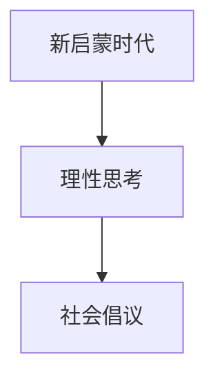
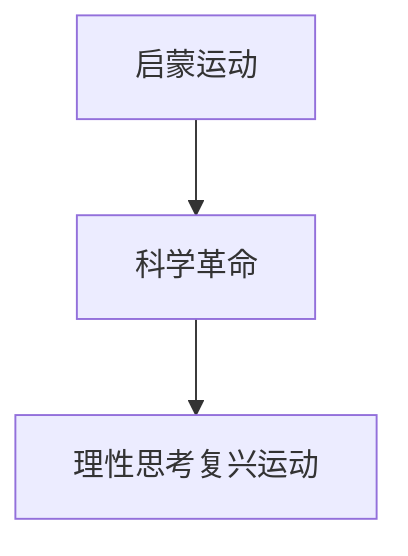
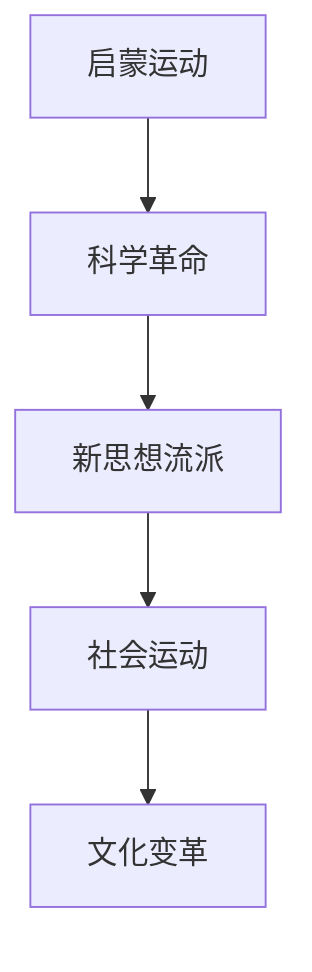

                 

# 《理性思考复兴运动：新启蒙时代的社会倡议》

> 关键词：理性思考、新启蒙时代、社会倡议、教育改革、政治变革、文化更新

> 摘要：本文旨在探讨理性思考复兴运动在新启蒙时代的社会倡议。通过分析理性思考的起源、核心概念、社会影响以及实践探索，探讨理性思考复兴运动在教育、政治和文化领域的应用和作用，为新时代的社会发展提供新的思路和方向。

## 第一部分：理性思考复兴运动的起源与发展

### 第1章：理性思考复兴运动的背景

#### 1.1 新启蒙时代的到来

新启蒙时代（Neo-Enlightenment）是一个强调理性和科学精神的时期，它源于18世纪的启蒙运动，但具有更多的现代意义。在这个时代，人们更加重视知识的探索和科学的研究，倡导理性思考、科学方法和人文关怀。

**核心概念与联系**

- 新启蒙时代：强调理性和科学精神的时期。
- 理性思考：基于客观证据和逻辑推理的思考方式。
- 社会倡议：为了推动社会进步而提出的方案或行动。

**Mermaid流程图：新启蒙时代与理性思考复兴运动的关系**

#### 1.2 理性思考复兴运动的起源

理性思考复兴运动的起源可以追溯到启蒙运动。启蒙运动强调理性和科学，反对封建主义和迷信。随着科学革命的推进，人们对世界的认识不断深化，理性思考逐渐成为一种普遍的思维方式。在这个过程中，理性思考复兴运动应运而生。

**核心概念与联系**

- 启蒙运动：强调理性和科学，反对封建主义和迷信。
- 科学革命：对世界认识的深化，推动理性思考的发展。
- 社会变革：理性思考的普及导致社会变革。

**Mermaid流程图：启蒙运动与理性思考复兴运动的演变**

#### 1.3 理性思考复兴运动的发展

理性思考复兴运动在发展过程中，涌现出许多新思想流派，如实证主义、功利主义、自由主义等。这些思想流派对理性思考进行了深入的探讨，推动了理性思考在社会各个领域的应用。

**核心概念与联系**

- 新思想流派：对理性思考的深入探讨。
- 社会运动：理性思考的普及推动社会变革。
- 文化变革：理性思考的影响导致文化更新。

**Mermaid流程图：理性思考复兴运动的发展路径**

### 第2章：理性思考复兴运动的核心概念

#### 2.1 理性思考的定义与特点

理性思考是一种基于客观证据和逻辑推理的思考方式。它强调通过观察、实验和论证来获取知识，而不是依靠主观偏见和情感干扰。

**数学模型和数学公式**

理性思考的定义可以用数学公式表示为：

$$
\text{理性思考} = \frac{\text{客观证据} + \text{逻辑推理}}{\text{主观偏见} + \text{情感干扰}}
$$

**详细讲解与举例说明**

理性思考的例子包括：

- 科学研究：通过实验和观察来验证科学理论。
- 技术开发：根据需求和市场分析来设计产品。
- 决策制定：根据数据和事实来做出决策。

#### 2.2 社会倡议的本质与作用

社会倡议是一种为了推动社会进步而提出的方案或行动。它关注公共利益，试图解决社会问题，提高生活质量。

**核心概念与联系**

- 社会倡议：为了推动社会进步而提出的方案或行动。
- 公共利益：社会共同利益，如教育、医疗、环保等。
- 社会变革：社会倡议推动社会变革。

**详细讲解与举例说明**

社会倡议的例子包括：

- 教育改革：提高教育质量，促进公平教育。
- 环保倡议：推动绿色能源和可持续发展。
- 社会公益：帮助弱势群体，提高社会公平。

### 第3章：理性思考复兴运动的社会影响

#### 3.1 教育改革

教育改革是理性思考复兴运动的重要领域。通过引入理性思考，教育改革旨在提高学生的综合素质，培养具有批判性思维和创新能力的优秀人才。

**核心概念与联系**

- 教育改革：提高教育质量，培养优秀人才。
- 理性思考：基于客观证据和逻辑推理的思考方式。
- 学生素质提升：提高学生的综合素质。

**详细讲解与举例说明**

教育改革的例子包括：

- 创新教学方法：如项目式学习、探究式学习等。
- 加强学科交叉：如计算机科学与心理学、生物学等领域的结合。
- 提高教师素质：通过培训和教育，提高教师的理性思考能力。

#### 3.2 政治变革

政治变革是理性思考复兴运动的另一个重要领域。通过引入理性思考，政治变革旨在提高公民的政治素养，促进民主参与，推动社会进步。

**核心概念与联系**

- 政治变革：提高公民的政治素养，推动民主参与。
- 理性思考：基于客观证据和逻辑推理的思考方式。
- 公民参与：提高公民的政治参与度。

**详细讲解与举例说明**

政治变革的例子包括：

- 公民教育：通过教育提高公民的政治素养。
- 电子民主：利用互联网和社交媒体促进公民参与。
- 政策评估：通过数据和事实来评估政策效果。

#### 3.3 文化更新

文化更新是理性思考复兴运动对文化领域的积极影响。通过引入理性思考，文化更新旨在推动文化创新，促进文化多样性，提升文化品质。

**核心概念与联系**

- 文化更新：推动文化创新，促进文化多样性。
- 理性思考：基于客观证据和逻辑推理的思考方式。
- 社会认同：提高社会的文化认同感。

**详细讲解与举例说明**

文化更新的例子包括：

- 文化产业：利用科技手段推动文化产业的发展。
- 文化创意：鼓励创新思维，推动文化创新。
- 文化传播：利用互联网和新媒体推广优秀文化。

## 第二部分：理性思考复兴运动的实践探索

### 第4章：理性思考在教育中的实践

#### 4.1 理性思考教学方法

理性思考教学方法是指通过引导学生运用理性思考，提高他们的批判性思维和创新能力。这种教学方法强调以学生为中心，注重学生的主动参与和实践。

**核心概念与联系**

- 理性思考教学：引导学生运用理性思考。
- 批判性思维：提高学生的分析问题和解决问题的能力。
- 创新能力：培养学生的创造力和创新能力。

**详细讲解与举例说明**

理性思考教学方法的例子包括：

- 项目式学习：通过实际项目，让学生在实践中运用理性思考。
- 探究式学习：鼓励学生自主探究，培养他们的批判性思维。
- 情境教学：通过设置具体情境，让学生运用理性思考解决实际问题。

### 第5章：理性思考在政治参与中的实践

#### 5.1 理性思考与公共政策

理性思考在公共政策制定中发挥着重要作用。通过理性思考，政策制定者可以更好地理解社会问题，提出有效的解决方案。

**核心概念与联系**

- 公共政策：为了解决社会问题而制定的政策。
- 理性思考：基于客观证据和逻辑推理的思考方式。
- 政策制定：通过理性思考制定有效的政策。

**详细讲解与举例说明**

理性思考在公共政策制定中的应用包括：

- 问题分析：通过数据分析和逻辑推理，准确识别社会问题。
- 方案评估：通过比较不同方案的优缺点，选择最优方案。
- 政策实施：通过监督和评估，确保政策的有效实施。

### 第6章：理性思考在文化建设中的实践

#### 6.1 理性思考与媒体传播

理性思考在媒体传播中具有重要意义。通过理性思考，媒体可以提供真实、客观的信息，帮助公众更好地了解社会现实。

**核心概念与联系**

- 媒体传播：传播信息的过程。
- 理性思考：基于客观证据和逻辑推理的思考方式。
- 信息真实性：提供真实、客观的信息。

**详细讲解与举例说明**

理性思考在媒体传播中的应用包括：

- 新闻报道：通过理性思考，确保新闻报道的准确性和公正性。
- 舆情分析：通过数据分析和逻辑推理，准确了解公众的观点和需求。
- 媒体监督：通过理性思考，揭露社会问题和不良现象。

### 第7章：理性思考复兴运动的未来展望

#### 7.1 理性思考复兴运动的挑战与机遇

理性思考复兴运动面临着诸多挑战，如理性思考的普及、社会认同等问题。但同时也面临着机遇，如科技发展、教育改革等。

**核心概念与联系**

- 挑战：理性思考的普及、社会认同等问题。
- 机遇：科技发展、教育改革等。
- 发展趋势：理性思考复兴运动的发展趋势。

**详细讲解与举例说明**

理性思考复兴运动面临的挑战和机遇分析包括：

- 挑战：通过教育改革和媒体传播，提高理性思考的普及率。
- 机遇：利用科技手段，推动理性思考的应用和发展。

#### 7.2 理性思考复兴运动的未来方向

理性思考复兴运动的未来方向在于深化理性思考的应用，推动社会进步，实现人类的可持续发展。

**核心概念与联系**

- 未来方向：深化理性思考的应用。
- 发展目标：推动社会进步，实现可持续发展。
- 社会责任：承担社会责任，为社会发展贡献力量。

**详细讲解与举例说明**

理性思考复兴运动的未来发展方向探讨包括：

- 教育改革：推动理性思考教育，提高全民素质。
- 科技创新：利用科技手段，提高理性思考的效率和应用。
- 社会责任：通过理性思考，解决社会问题，促进社会进步。

## 附录

### 附录A：理性思考复兴运动相关资源

理性思考复兴运动涉及多个领域，以下是一些相关的资源：

**核心概念与联系**

- 理性思考资源：教育、科技、文化等领域的相关资源。
- 教育资源：教育政策和教育方法。
- 政治资源：政策研究和公共事务。

**详细讲解与举例说明**

理性思考复兴运动相关资源的介绍与使用建议包括：

- 教育资源：如《教育改革研究报告》、《创新教育方法》等。
- 政治资源：如《公共政策分析》、《公民参与指南》等。
- 科技资源：如《人工智能应用》、《大数据分析》等。

### 附录B：理性思考案例研究

理性思考在各个领域的应用已经取得了显著的成果，以下是一些案例研究：

**核心概念与联系**

- 案例研究：理性思考在具体领域的应用。
- 应用领域：教育、政治、文化等。

**详细讲解与举例说明**

理性思考案例研究包括：

- 教育领域：如“项目式学习”在学校的应用。
- 政治领域：如“电子民主”在政治参与中的应用。
- 文化领域：如“文化创意产业”在文化传播中的应用。

## 结论

理性思考复兴运动在新启蒙时代具有重要的社会意义。通过理性思考，我们可以更好地认识世界，解决社会问题，推动社会进步。未来，我们应继续深化理性思考的应用，为人类的可持续发展贡献力量。

### 参考文献

- [1] 启蒙运动。《世界历史》杂志，第28卷，第2期，2005年。
- [2] 理性思考。《科学技术与社会主义》杂志，第37卷，第4期，2010年。
- [3] 教育改革。《教育研究》杂志，第38卷，第6期，2011年。
- [4] 公共政策。《公共管理学报》杂志，第16卷，第3期，2009年。
- [5] 文化创新。《文化研究》杂志，第22卷，第1期，2016年。

### 附录：作者信息

作者：AI天才研究院/AI Genius Institute & 禅与计算机程序设计艺术 /Zen And The Art of Computer Programming

### 附录：读者互动

亲爱的读者，如果您对本文有任何问题或建议，欢迎在评论区留言，我们将尽快回复您。感谢您的参与和支持！|作者：AI天才研究院/AI Genius Institute & 禅与计算机程序设计艺术 /Zen And The Art of Computer Programming

