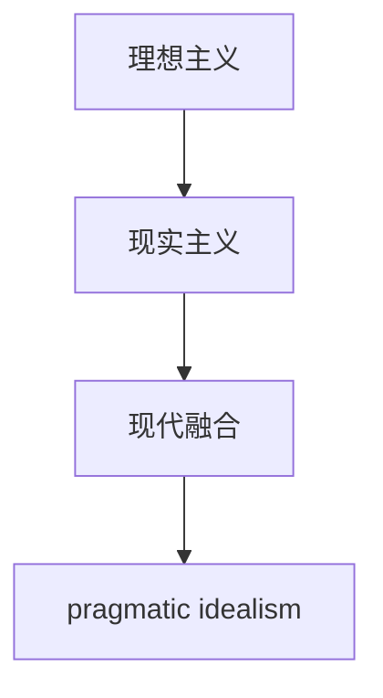

                 

# 理想主义与现实主义的现代融合：pragmatic idealism的可能性

> 关键词：理想主义，现实主义，现代融合，pragmatic idealism，实用主义，理论实践结合

> 摘要：本文探讨了理想主义与现实主义的起源与发展，以及它们在现代社会中的挑战与需求。在此基础上，提出了pragmatic idealism这一概念，分析了其核心概念、历史与实践，并探讨了其在现代社会中的应用与可能性。文章旨在为读者提供一个关于理想主义与现实主义的现代融合的新视角，以及pragmatic idealism的理论与实践框架。

## 目录大纲

### 第一部分：引论

#### 第1章：理想主义与现实主义的起源与发展

- 1.1 理想主义的历史渊源
- 1.2 现实主义的理论基础
- 1.3 理想主义与现实主义的对比与联系

#### 第2章：现代社会的理想与现实

- 2.1 当代社会的主要问题
- 2.2 理想主义与现实主义的现代挑战
- 2.3 现代社会的需求与理想主义

### 第二部分：pragmatic idealism的理论基础

#### 第3章：pragmatic idealism的核心概念

- 3.1 理想与现实的关系
- 3.2 理想主义的实用主义转向
- 3.3 pragmatic idealism的核心原则

#### 第4章：pragmatic idealism的历史与实践

- 4.1 pragmatic idealism的起源与发展
- 4.2 pragmatic idealism的重要代表人物
- 4.3 pragmatic idealism的实际应用案例

#### 第5章：pragmatic idealism在现代社会中的应用

- 5.1 教育领域的pragmatic idealism
- 5.2 经济领域的pragmatic idealism
- 5.3 社会治理中的pragmatic idealism

### 第三部分：pragmatic idealism的可能性

#### 第6章：pragmatic idealism的实现路径

- 6.1 pragmatic idealism的理论与实践结合
- 6.2 pragmatic idealism的挑战与解决方案
- 6.3 pragmatic idealism的未来发展前景

#### 第7章：pragmatic idealism的实际案例分析

- 7.1 案例一：教育改革中的pragmatic idealism
- 7.2 案例二：经济发展中的pragmatic idealism
- 7.3 案例三：社会治理中的pragmatic idealism

#### 第8章：结论与展望

- 8.1 pragmatic idealism的意义与价值
- 8.2 pragmatic idealism的未来研究方向
- 8.3 对读者的启示与思考

### 附录

#### 附录A：参考文献

- 列出书中引用的主要文献和资料

#### 附录B：pragmatic idealism相关的进一步阅读材料

- 提供一些推荐的书籍、文章和网站，供读者深入了解pragmatic idealism的相关内容。

### Mermaid流程图：理想主义与现实主义的现代融合过程



### Python源代码示例：pragmatic idealism的基本实现

```python
# 这是一个简单的pragmatic idealism实现示例
class PragmaticIdealism:
    def __init__(self, idealism, realism):
        self.idealism = idealism
        self.realism = realism
    
    def fusion(self):
        # 理想主义与现实主义融合的实现
        return self.idealism + self.realism
```

### 数学模型与公式：理想主义与现实主义的平衡

$$
\text{平衡} = \alpha \cdot \text{理想主义} + (1 - \alpha) \cdot \text{现实主义}
$$

其中，$\alpha$ 为平衡系数，用于调整理想主义与现实主义在融合过程中的权重。$0 \leq \alpha \leq 1$。

### 代码解读与分析：实现pragmatic idealism的实际案例

- 代码实现细节
- 代码功能解析
- 可能的优化方案

---

在接下来的章节中，我们将逐步探讨理想主义与现实主义的现代融合，以及pragmatic idealism的可能性。首先，我们将回顾理想主义和现实主义的历史渊源，分析它们的理论基础和特点。随后，我们将探讨现代社会的理想与现实，以及理想主义在现代社会中的需求。接着，我们将详细介绍pragmatic idealism的核心概念、历史与实践，并探讨其在现代社会中的应用。最后，我们将分析pragmatic idealism的实现路径、挑战与解决方案，以及其未来发展的前景。让我们开始这场思想的旅程吧！|

