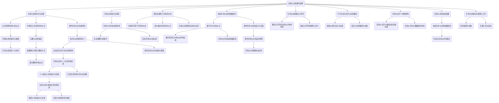

                 

### 引言

在现代社会中，生命仪式这一概念逐渐从传统的宗教和文化遗产中走向日常生活。生命仪式，广义上指的是那些旨在赋予生命以意义和价值的活动或典礼。它不仅包括宗教仪式，还涵盖了个人成长、家庭团聚、节日庆典等各式各样的活动。随着社会的发展和文化的变迁，生命仪式的形式和意义也在不断演变。本文将探讨生命仪式的历史与演变、现代意义与实践、社会功能、跨文化视角以及未来发展趋势。

生命仪式的历史可以追溯到古代文明。在原始社会，仪式活动是人们与自然界沟通的重要方式。随着时间的推移，这些仪式逐渐融入宗教信仰，成为宗教活动的重要组成部分。中世纪和近代，宗教仪式进一步发展和多样化，成为了社会生活的一部分。而现代社会，随着全球化和社会变迁，生命仪式也呈现出多元化和现代化的趋势。

本文将首先回顾古代文明中的生命仪式，了解它们的形成和发展。接着，我们将探讨中世纪与近代的生命仪式，特别是宗教仪式的演变。然后，我们将分析现代生命仪式的多样性和意义。在实践与应用方面，本文将讨论生命仪式在个人生活中的应用，并探讨其社会功能。随后，我们将从跨文化视角出发，研究全球化背景下的生命仪式。最后，本文将展望生命仪式的未来发展趋势，探讨科技与生命仪式的结合。

本文旨在通过系统性地分析和讨论，揭示生命仪式在现代生活中的重要性，并为其设计和实践提供指导。希望通过本文的探讨，读者能够对生命仪式有更深入的理解，从而在日常生活中找到更多的意义和价值。

### 关键词

- 生命仪式
- 宗教仪式
- 社会变迁
- 文化融合
- 现代化
- 个人成长
- 家庭团聚
- 节日庆典
- 象征与符号
- 社会功能
- 跨文化视角
- 未来发展趋势

### 摘要

本文旨在探讨生命仪式的历史与演变、现代意义与实践、社会功能、跨文化视角以及未来发展趋势。通过回顾古代文明中的生命仪式，分析中世纪与近代的生命仪式演变，以及探讨现代生命仪式的多样性和意义，本文揭示了生命仪式在现代生活中的重要性。同时，本文还探讨了生命仪式在个人生活中的应用和社会功能，并从跨文化视角出发，研究了全球化背景下的生命仪式。最后，本文展望了生命仪式的未来发展趋势，特别是科技与生命仪式的结合。希望通过本文的探讨，读者能够对生命仪式有更深入的理解，并能够在日常生活中找到更多的意义和价值。

## 第一部分：生命仪式的历史与演变

### 第1章：古代文明中的生命仪式

#### 1.1 原始社会的生命仪式

在原始社会，生命仪式最早可以追溯到人类与自然界的关系。原始人类通过仪式活动与自然界沟通，以祈求好运、避灾免难。这些仪式通常围绕自然界中的重要事件展开，如播种、收割、季节变化等。早期仪式的形成与发展，是人类社会文明的重要标志。

在原始社会，生命仪式主要表现为集体活动，人们通过舞蹈、音乐、绘画等艺术形式来表达对自然和生命的崇拜。这些仪式活动不仅是一种精神上的信仰，更是社会团结和认同的重要手段。例如，在非洲的某些部落中，年长的族人会通过传授传统仪式来传承文化，同时增强社区的凝聚力。

#### 1.1.1 早期仪式的形成与发展

早期仪式的形成与发展与人类社会的发展紧密相关。随着农业的出现，人类开始定居生活，仪式活动也逐渐从自然崇拜转向对农业生产和生命的崇拜。例如，播种仪式和丰收仪式成为许多原始社会的重要活动。这些仪式不仅是对自然的感恩，也是祈求来年丰收的重要手段。

在早期社会中，仪式活动通常由部落领袖或宗教祭司主持。他们通过特殊的仪式和道具，如面具、法杖等，来传达神灵的旨意。这些仪式活动不仅具有宗教意义，还具有法律和道德规范的作用，帮助社会成员遵守传统和行为准则。

#### 1.1.2 生命仪式的意义与作用

早期生命仪式的意义和作用是多方面的。首先，它们是人们与自然界沟通的重要途径，通过仪式活动，人们可以祈求自然界的恩赐，如丰收、健康和平安。其次，仪式活动是文化传承的重要手段，通过仪式的传授，文化知识得以代代相传。此外，仪式活动还有助于社会团结和认同，通过共同的仪式活动，人们能够增强对社区的归属感和认同感。

总的来说，早期生命仪式是原始社会文明的重要组成部分，它们不仅反映了人类社会对自然和生命的崇拜，也体现了社会成员之间的相互关系和合作精神。通过这些仪式活动，原始社会的人们找到了一种与自然界和谐相处的方式，同时也为后来的宗教和文化遗产奠定了基础。

### 第2章：中世纪与近代的生命仪式

#### 2.1 宗教仪式的演变

中世纪和近代是宗教仪式发展的重要时期，各种宗教仪式在这一时期得到了显著的发展和多样化。宗教仪式不仅是对神灵的崇拜和祈祷，更是宗教信仰和道德教化的体现。不同宗教的仪式各有特色，但它们在形式和内容上都有一定的共同点。

首先，基督教仪式在中世纪得到了极大的发展。基督教仪式主要包括洗礼、圣餐、告解和弥撒等。洗礼象征着信徒的重生，圣餐则是纪念耶稣的最后晚餐，告解是信徒忏悔和求得宽恕的过程，弥撒则是整个基督教仪式的核心，包含了祈祷、诵读圣经和唱歌等环节。

伊斯兰教的仪式也具有丰富的内涵。伊斯兰教的五功是每个穆斯林必须履行的义务，包括念诵清真言、礼拜、斋戒、天课和朝觐。其中，朝觐是穆斯林最重要的宗教仪式，每年数百万穆斯林都会前往麦加朝觐，以表达对真主的虔诚信仰。

#### 2.1.1 基督教与伊斯兰教的仪式

基督教与伊斯兰教的仪式在形式和内容上都有显著差异。基督教仪式注重个人与上帝的关系，强调信仰和忏悔，而伊斯兰教仪式则更注重集体礼拜和社区的团结。例如，基督教的洗礼仪式通常是个别进行的，而伊斯兰教的礼拜则是集体活动。

此外，基督教的仪式时间固定，每周一次的弥撒是固定的宗教活动，而伊斯兰教的礼拜则根据时间计算，每天五次。这种灵活的礼拜时间安排，使得穆斯林能够在日常工作中找到合适的时间进行宗教活动。

#### 2.1.2 犹太教的传统仪式

犹太教的传统仪式同样丰富多彩，包括割礼、安息日、节期等。割礼是犹太人的传统仪式，男婴在出生后第八天进行割礼，象征着他们成为神的子民。安息日是犹太人的神圣日子，每天从日落开始，持续到次日日落，期间禁止工作和其他娱乐活动。节期则是犹太教的重要庆典，如逾越节、五旬节和住棚节等，这些节期不仅纪念历史事件，也表达了对未来的希望。

犹太教的仪式强调律法和传统的重要性，通过这些仪式，犹太人得以保持对历史的记忆和对未来的期待。这些传统仪式不仅是宗教活动的形式，更是犹太文化的重要组成部分。

总的来说，中世纪和近代的生命仪式在宗教的框架下得到了丰富和发展。不同宗教的仪式各有特色，但它们都反映了人类对生命、信仰和道德的追求。这些仪式不仅具有宗教意义，也对社会的稳定和文化的传承起到了重要作用。

### 第3章：现代生命仪式的多样性

#### 3.1 生命礼仪的现代意义

进入现代社会，生命仪式的多样性和意义得到了进一步扩展。现代生命礼仪不再局限于宗教领域，而是渗透到了个人成长、家庭团聚、节日庆典等多个方面。这些仪式不仅是对生命事件的纪念，更是对生命意义的探讨和追求。

首先，个人成长仪式在现代社会中越来越受到重视。这些仪式通常是为了标志个人的重要成长节点，如出生、成年、毕业等。例如，成年仪式在许多国家被视为重要的仪式，通过庆祝成年，年轻人正式成为社会成员，承担起更多的责任和义务。毕业仪式则是对学生学业的肯定和鼓励，标志着他们从学校走向社会。

家庭团聚仪式也是现代生命仪式的重要组成部分。这些仪式通常是为了庆祝家庭的重要时刻，如婚礼、生日、家庭聚会等。通过这些仪式，家庭成员能够加强彼此之间的联系和感情，共同创造美好的回忆。

节日庆典仪式则是对文化传统的继承和弘扬。不同国家和民族有着各自的节日庆典，如春节、圣诞节、感恩节等。这些节日不仅具有丰富的文化内涵，也是人们表达情感和团结互助的重要时刻。

#### 3.1.1 社会变迁对生命仪式的影响

社会变迁对生命仪式的影响是显而易见的。首先，全球化使得不同文化之间的交流更加频繁，生命仪式也呈现出跨文化的特点。例如，在一些国家，传统的宗教仪式逐渐融入了其他文化的元素，形成了独特的仪式形式。这种文化融合不仅丰富了生命仪式的内涵，也促进了不同文化之间的理解和尊重。

其次，科技进步也改变了生命仪式的形式。例如，互联网和社交媒体的发展使得远程参与生命仪式成为可能，人们可以通过网络直播和视频通话参加婚礼、葬礼等重要仪式。这种远程参与的方式不仅方便了人们的生活，也使得生命仪式的覆盖面更广。

此外，社会变迁还带来了价值观的变化，对生命仪式的意义和内容产生了深远影响。例如，随着社会对个人自由的重视，一些传统的生命仪式得到了重新审视和改造，更加注重个人的选择和表达。

#### 3.1.2 现代生命仪式的创新与发展

现代生命仪式的创新与发展体现在多个方面。首先，生命仪式的形式更加多样，不仅包括传统的宗教仪式，还包括个性化、创意化的仪式形式。例如，一些婚礼仪式采用了主题婚礼、户外婚礼等形式，使得婚礼更加独特和有意义。

其次，现代生命仪式更加注重参与性和互动性。例如，一些家庭聚会和节日庆典采用了互动游戏、角色扮演等形式，增加了参与者的参与感和乐趣。

此外，现代生命仪式还注重环保和可持续性。例如，一些婚礼和节庆活动采用了绿色环保的元素，如使用可降解的材料、减少废弃物等，体现了现代社会对环境保护的关注。

总的来说，现代生命仪式的多样性和意义不仅反映了社会变迁的影响，也展现了人们对生命意义的追求和对未来的期待。通过不断创新和发展，生命仪式将继续在现代社会中发挥重要作用，成为人们表达情感和传承文化的重要方式。

### 第4章：现代生命仪式的实践与应用

#### 4.1 生命仪式在个人生活中的应用

在现代个人生活中，生命仪式扮演着不可或缺的角色，它们不仅是纪念生命重要时刻的仪式，更是个人成长和社会认同的标志。以下将详细探讨几种常见的个人生命仪式及其设计与应用。

##### 4.1.1 个人成长仪式的设计与实施

个人成长仪式通常是为了标志个人在成长过程中达到某一重要阶段，如出生、成年、毕业、结婚等。这些仪式的设计与实施应考虑到个人身份、家庭背景和文化传统。

- **出生仪式**：出生仪式通常包括命名仪式、洗礼或祈福仪式等。命名仪式是对新生儿身份的确认，可以通过家庭成员共同商讨命名，结合家族传统和文化背景。洗礼或祈福仪式则由宗教领袖或家庭长辈主持，祈求新生儿健康成长和幸福。

- **成年仪式**：成年仪式标志着年轻人正式成为成年人，承担更多的社会责任。成年仪式的设计可以结合文化传统和个人喜好，例如，可以通过传统的庆祝活动，如舞会、晚宴，或更个性化的方式，如个人宣言或仪式旅行。

- **毕业仪式**：毕业仪式是对个人学业成就的肯定，通常包括颁奖典礼、毕业典礼等环节。毕业仪式的设计应体现学校特色，可以通过演讲、颁奖、校歌演唱等形式，激励毕业生追求更高的目标。

##### 4.1.2 日常生活中的生命仪式实践

日常生活中的生命仪式实践更多地体现在家庭和个人日常活动中，这些仪式有助于增强家庭凝聚力和个人幸福感。

- **家庭聚会**：家庭聚会是一种常见的日常生命仪式，通过共同庆祝生日、节日等，家庭成员能够加深彼此的情感联系。家庭聚会的设计可以注重参与性和互动性，如家庭游戏、美食分享、集体活动等。

- **日常习惯仪式**：日常习惯仪式如早晨的祈祷、晚安故事等，有助于培养良好的生活习惯和心理状态。这些仪式的设计应简洁实用，易于坚持，如通过定时的祷告、阅读或睡前谈话，营造温馨的家庭氛围。

- **节日庆典**：节日庆典是生命仪式的重要组成部分，通过庆祝传统节日，如春节、圣诞节、感恩节等，人们能够传承文化、表达情感。节日庆典的设计应注重文化特色和参与感，如制作节日食品、装饰家庭、举办节日活动等。

##### 4.1.3 个人成长仪式的实例与案例分析

以下是一些个人成长仪式的实例，以展示生命仪式在实际生活中的应用：

- **大学毕业典礼**：某大学的毕业典礼设计包括校长致辞、教师颁奖、学生代表发言等环节。在仪式中，学生们身着学位服，依次上台领取学位证书，象征着他们学业有成，正式步入社会。

- **家庭婚礼**：某对新人在婚礼仪式中结合了中西方传统元素。仪式开始时，新娘穿着传统汉服，由新郎的父母引领入场；随后，进行了西式的教堂婚礼仪式，包括交换戒指、宣誓等环节。这种结合展现了新人对传统与现代文化的尊重和融合。

- **家庭生日派对**：在一个家庭的生日派对中，家庭成员们提前准备了生日蛋糕和礼物，为寿星举办了一场主题生日派对。派对期间，大家一起玩游戏、唱歌、分享生日愿望，创造了一个欢乐和温馨的氛围。

通过这些实例，我们可以看到生命仪式在个人生活中的重要性和多样性。这些仪式不仅为个人成长和重要时刻留下了美好的回忆，也增强了家庭和社会的凝聚力，丰富了人们的生活体验。

### 第5章：生命仪式的社会功能

#### 5.1 生命仪式对社会的影响

生命仪式在社会中的作用不可忽视，它们不仅是个人成长和社会认同的标志，更是社会稳定和文化传承的重要手段。通过生命仪式，社会成员能够在特定的文化和社会背景下找到归属感和认同感，从而增强社会凝聚力。

首先，生命仪式有助于提升社会凝聚力。通过共同的仪式活动，社会成员能够加强彼此之间的联系，建立共同的文化认同。例如，在传统节日如春节、国庆节等，人们通过庆祝活动，表达对祖国的热爱和对文化传统的尊重，这种共同的情感纽带有助于增强社会的凝聚力。

其次，生命仪式是文化传承的重要途径。通过仪式的传授，传统文化和价值观得以代代相传。例如，在婚礼、葬礼等仪式中，传统习俗和礼仪被一代代地传承下来，成为社会文化的重要组成部分。这些仪式不仅是对过去的纪念，更是对未来文化的延续。

此外，生命仪式还能够调节社会秩序，维护社会稳定。在一些社会中，生命仪式具有法律和道德规范的作用，通过仪式的执行，社会成员能够明确行为准则和道德标准。例如，婚礼仪式中的誓言和承诺，不仅是对婚姻的庄严承诺，也是对社会责任的承担。

#### 5.1.1 社会凝聚力的提升

生命仪式在提升社会凝聚力方面发挥着重要作用。通过共同的仪式活动，社会成员能够建立共同的文化认同和价值观。例如，在宗教仪式中，信徒们通过祷告、诵读圣经等活动，表达对宗教信仰的虔诚，这种共同的信仰和价值观有助于增强信徒之间的联系和团结。

此外，一些传统节日和庆典活动也是社会凝聚力的重要体现。在这些活动中，人们通过共同参与，庆祝节日，表达对文化的尊重和对社会的热爱。例如，在春节、圣诞节等节日中，人们通过聚会、赠送礼物、观看演出等活动，加强彼此之间的情感联系，这种情感纽带有助于提升社会凝聚力。

#### 5.1.2 文化传承与价值认同

生命仪式在文化传承和价值认同方面也发挥着重要作用。通过仪式的执行，传统文化和价值观得以传承和弘扬。例如，在婚礼、葬礼等仪式中，传统习俗和礼仪被一代代地传承下来，成为社会文化的重要组成部分。这些仪式不仅是对过去的纪念，更是对未来文化的延续。

此外，生命仪式还是价值认同的重要途径。通过仪式的执行，社会成员能够明确自己的行为准则和道德标准。例如，在婚礼仪式中，新人的誓言和承诺不仅是对婚姻的庄严承诺，也是对社会责任和道德规范的表达。这种价值认同有助于社会成员在日常生活中遵守道德规范，维护社会秩序。

总的来说，生命仪式在社会中具有多重功能，它们不仅能够提升社会凝聚力，传承文化，还能够调节社会秩序，维护社会稳定。通过生命仪式，社会成员能够在特定的文化和社会背景下找到归属感和认同感，从而增强社会的整体稳定性。

### 第6章：跨文化视角下的生命仪式

#### 6.1 全球化背景下的生命仪式

全球化对生命仪式的影响是深远而广泛的。在全球化背景下，不同文化之间的交流和互动日益频繁，生命仪式也呈现出多样化和融合化的趋势。全球化不仅改变了生命仪式的形式，还对其意义和内容产生了深远影响。

首先，全球化促进了不同文化之间的生命仪式交流。随着跨国界交流的增加，不同文化中的生命仪式得以相互传播和借鉴。例如，基督教婚礼仪式在全球范围内广泛流行，许多非基督教国家也开始采用基督教婚礼的元素，如交换戒指、誓言等。同样，儒家婚礼仪式中的传统元素如“六礼”也在一些国家和地区得到推广。

其次，全球化推动了生命仪式的创新与发展。在全球化背景下，生命仪式不再局限于传统的形式，而是融合了多种文化元素，形成了独具特色的新形式。例如，一些现代婚礼仪式结合了中西方传统，不仅保留了中式婚礼的礼服、茶礼等传统元素，还融入了西式婚礼的教堂仪式和婚纱。

此外，全球化还使得生命仪式的传播和参与更加便捷。通过互联网和社交媒体，人们可以远程参与生命仪式，如观看婚礼直播、参与在线纪念活动等。这种远程参与的方式不仅方便了人们的社交活动，也使得生命仪式的覆盖面更广。

#### 6.1.1 文化融合中的生命仪式

文化融合是全球化背景下的重要趋势，生命仪式也在这一过程中得到了丰富和发展。文化融合不仅体现在不同文化之间的交流与互动，还体现在生命仪式的内容和形式上。

在文化融合中，生命仪式不仅保留了各自的特色，还融合了其他文化的元素，形成了新的仪式形式。例如，在一些国际婚姻中，新人们通常会结合双方的传统文化，设计出独特的婚礼仪式。这种融合不仅体现了对各自文化的尊重，也为生命仪式注入了新的活力。

此外，文化融合还促进了生命仪式的创新。通过借鉴其他文化的元素，生命仪式可以更加丰富和多样化。例如，一些现代婚礼仪式不仅保留了传统的花童、捧花等元素，还加入了舞狮、舞蹈等具有地方特色的表演，使得婚礼更加精彩和有意义。

#### 6.1.2 生命仪式的国际比较与交流

生命仪式的国际比较与交流是全球化背景下文化融合的重要表现形式。通过比较和交流，不同文化可以相互借鉴，共同发展。

在国际比较中，不同文化的生命仪式各有特色。例如，西方婚礼仪式强调浪漫和仪式感，注重交换戒指和誓言等环节；而东方婚礼仪式则更注重传统和礼仪，如“六礼”和婚礼宴席等。通过比较，人们可以更好地了解和理解不同文化中的生命仪式，促进文化之间的理解和尊重。

国际交流则为生命仪式的创新提供了契机。例如，一些国际婚姻中的新人们可以通过交流，结合双方的文化，设计出独特的婚礼仪式。这种国际交流不仅丰富了生命仪式的形式和内容，也促进了不同文化之间的融合和互动。

总的来说，全球化背景下的生命仪式呈现出多样化和融合化的趋势。通过文化融合和国际交流，生命仪式不仅得到了丰富和发展，也为不同文化之间的理解和尊重提供了平台。随着全球化的进一步发展，生命仪式将继续在全球范围内传播和交流，为人类社会带来更多的文化活力和意义。

### 第7章：未来生命仪式的发展趋势

#### 7.1 数字化与生命仪式

随着科技的快速发展，生命仪式也在不断地适应和变革。数字化技术的广泛应用，特别是互联网和人工智能，正在深刻改变生命仪式的形式和内容。数字化与生命仪式的结合，不仅为传统仪式注入了新的活力，也为现代生活带来了前所未有的便利。

首先，互联网的普及使得生命仪式的参与更加便捷。通过视频直播和社交媒体，人们可以远程参与婚礼、葬礼等重要的仪式活动。这不仅解决了地理距离带来的困扰，也让无法到场的人能够通过虚拟方式分享庆祝或悼念的气氛。例如，许多新人选择通过互联网直播婚礼，让全球的亲朋好友都能参与其中，共享这份喜悦。

其次，人工智能技术在生命仪式中的应用也在逐渐普及。智能助手和虚拟现实（VR）技术的结合，使得生命仪式更加个性化。例如，一些婚礼策划公司已经开始使用人工智能助手来设计婚礼流程和推荐仪式内容，根据新人和宾客的喜好和需求，提供定制化的婚礼体验。而虚拟现实技术则允许人们在虚拟环境中体验宗教仪式或文化庆典，即使身处异地也能感受到现场的气氛。

此外，数字化技术还改变了生命仪式的记录和传承方式。通过高清摄影和视频录制，仪式的每一个瞬间都可以被永久保存。数字化的记录不仅方便了家庭和社区的分享，也为未来的研究提供了宝贵的资料。例如，一些博物馆和文化机构已经开始收集和展示数字化仪式记录，以传承和弘扬文化传统。

#### 7.1.1 数字技术在生命仪式中的应用

数字技术不仅在生命仪式的参与和体验上有所应用，还在仪式的设计和实施过程中发挥了重要作用。

- **虚拟现实（VR）技术**：通过VR技术，人们可以在虚拟环境中体验宗教仪式或文化庆典，如虚拟寺庙的佛教仪式或虚拟舞台的音乐节。这种沉浸式的体验不仅增强了仪式的参与感，也打破了空间的限制。

- **社交媒体应用**：社交媒体平台如Facebook、Instagram和微信等，成为生命仪式信息传播和互动的重要工具。通过这些平台，人们可以分享仪式的照片、视频和故事，增强社区的凝聚力和归属感。

- **智能设备**：智能设备如智能手机、平板电脑和可穿戴设备，也被广泛应用于生命仪式。例如，智能手表可以记录参与者的实时心率，用于宗教冥想或瑜伽仪式。而智能手机应用程序则可以提供仪式指南、音乐和祈祷文本等，帮助参与者更好地参与仪式。

#### 7.1.2 生命仪式的未来发展趋势

随着数字技术的不断进步，生命仪式的未来发展趋势也变得愈加清晰。

- **个性化和定制化**：未来的生命仪式将更加注重个性化和定制化。通过大数据和人工智能技术，生命仪式的设计和内容可以根据参与者的偏好和需求进行个性化定制。例如，定制化的婚礼仪式可以包括个性化的音乐、照片和视频，甚至可以根据新人的故事和经历设计独特的仪式环节。

- **虚拟与现实的融合**：虚拟现实和增强现实（AR）技术将进一步融合到生命仪式中，提供更加丰富的体验。例如，虚拟现实婚礼可以让新人和宾客在虚拟环境中共同庆祝，而增强现实技术则可以将虚拟元素叠加到现实场景中，创造更加神奇和难忘的仪式体验。

- **互动性和参与性**：未来的生命仪式将更加注重互动性和参与性。通过虚拟互动和社交媒体平台，参与者可以实时互动，分享感受和祝福，共同创造仪式的氛围。

总的来说，数字化技术为生命仪式带来了前所未有的变革和创新。通过数字化与生命仪式的结合，未来的生命仪式将更加便捷、个性化和有意义。随着科技的不断进步，生命仪式将继续发展，为人们的生活带来更多的惊喜和美好。

### 第8章：现代生命仪式的设计与实施

#### 8.1 现代生命仪式的设计原则

在现代生活中，设计一个有意义且具有吸引力的生命仪式，需要遵循一系列原则，以确保仪式不仅符合个人和家庭的期望，还能在精神和文化层面上产生深远影响。以下是一些关键的设计原则：

##### 8.1.1 现代生命仪式的要素与结构

一个成功的现代生命仪式应包括以下几个核心要素：

- **主题**：仪式的主题是整个活动的核心，应与个人或家庭的文化背景、价值观和情感需求相契合。主题可以是传统的，如“家庭团聚”、“感恩庆典”，也可以是现代的，如“自然仪式”、“艺术庆典”。

- **参与者**：参与者的选择和参与方式对仪式的成功至关重要。参与者不仅包括家庭成员和亲朋好友，还可以包括宗教领袖、艺术家、社区成员等。每个参与者都有其独特的角色和职责，他们的参与能够增加仪式的丰富性和互动性。

- **仪式流程**：仪式流程应精心设计，确保每个环节都能流畅地进行。流程应包括欢迎、主题展示、核心活动（如祈祷、演讲、表演）、互动环节、结束等部分。每个环节的时间分配也应合理，以保持仪式的连贯性和紧张感。

- **象征与符号**：象征和符号在生命仪式中具有深刻的意义，它们可以传达情感、价值观和文化认同。例如，鲜花、烛光、音乐、绘画等都是常见的象征和符号。

##### 8.1.2 现代生命仪式的设计流程

设计一个现代生命仪式通常需要以下步骤：

1. **需求分析**：首先，需要明确仪式的目的和目标群体。了解参与者的需求和期望，包括仪式的主题、地点、时间和预算等。

2. **主题确定**：根据需求分析的结果，确定仪式的主题。主题应与仪式的目的和参与者的价值观相契合。

3. **元素选择**：选择适当的象征和符号，以及与主题相关的音乐、艺术作品等元素。这些元素应能够传达仪式的核心价值和情感。

4. **流程设计**：设计仪式的具体流程，包括每个环节的内容和持续时间。确保流程连贯、紧凑，并能够引起参与者的共鸣。

5. **预算规划**：根据需求和主题，制定详细的预算计划，确保仪式的顺利进行。

6. **沟通协调**：与参与者、供应商和其他相关人员沟通协调，确保他们了解仪式的安排和职责。

7. **执行准备**：在仪式前进行充分的准备，包括场地布置、道具准备、音乐和表演的调试等。

8. **仪式实施**：按照设计好的流程进行仪式，确保每个环节都按照计划进行。

9. **反馈收集**：仪式结束后，收集参与者的反馈，了解他们对仪式的感受和建议，为未来的设计提供参考。

通过遵循这些设计原则和流程，可以设计出既符合个人需求，又具有深远文化意义的现代生命仪式。

### 第9章：生命仪式中的象征与符号

#### 9.1 象征与符号在生命仪式中的作用

象征与符号在生命仪式中扮演着至关重要的角色，它们不仅是仪式的视觉和情感元素，更是传达深层次意义和文化价值的重要工具。在生命仪式中，象征与符号的选择和运用，能够深刻影响参与者的体验和情感共鸣。

首先，象征与符号有助于传达仪式的主题和核心价值。例如，在婚礼仪式中，鲜花通常象征着爱情和纯洁，而烛光则象征着光明和希望。通过选择和运用这些象征与符号，婚礼不仅是对婚姻的庆祝，更是对美好价值观的传递和肯定。

其次，象征与符号在生命仪式中具有情感调节的作用。在仪式的高潮时刻，如祷告、承诺或感恩，象征与符号可以激发参与者的情感共鸣，增强仪式的感染力和参与感。例如，在葬礼中，花圈和烛光不仅是对逝者的纪念，也是对生者情感的安抚和慰藉。

此外，象征与符号还承担着文化传承的功能。许多生命仪式中的符号，如十字架、莲花、圆圈等，都有着深厚的文化背景和传统意义。通过这些符号的使用，生命仪式不仅是对个人和家庭的纪念，更是对整个社会和文化传统的传承和弘扬。

#### 9.1.1 象征与符号的类型与意义

生命仪式中的象征与符号多种多样，它们可以大致分为以下几类：

- **自然符号**：自然符号来源于自然界，如植物、动物、天空、水体等。例如，松树象征着长寿和坚韧，彩虹象征着希望和好运。这些自然符号常常用于表达对自然界的敬畏和感激。

- **宗教符号**：宗教符号是特定宗教信仰的象征，如十字架、佛像、圣经等。这些符号不仅代表宗教信仰，还承载着宗教教义和价值观。例如，基督教中的十字架象征着救赎和信仰，佛教中的佛像象征着智慧和慈悲。

- **文化符号**：文化符号是特定文化传统和习俗的象征，如服饰、音乐、舞蹈、仪式用品等。例如，中国传统婚礼中的红色象征着喜庆和好运，而西方婚礼中的婚纱则象征着纯洁和浪漫。

- **个人符号**：个人符号与个人身份和经历相关，如姓名、图案、纪念品等。这些符号可以用于表达个人情感和价值观。例如，一些人会在婚礼戒指上刻上彼此的名字或寓意深长的图案，以纪念他们的重要时刻。

#### 9.1.2 象征与符号的解读与应用

在生命仪式中，正确解读和应用象征与符号至关重要。以下是一些建议：

- **选择合适的符号**：根据仪式的主题和目的，选择具有象征意义的符号。例如，在婚礼中，选择鲜花、烛光和音乐等能够表达爱情和美好的符号。

- **明确符号意义**：确保参与者和观众能够理解符号的意义。在仪式中，可以通过解释或展示符号的含义，增强其象征效果。

- **符号的多样性**：在设计中使用多种类型的符号，可以增强仪式的丰富性和深度。例如，在葬礼中，可以结合自然符号（如花朵）、宗教符号（如十字架）和文化符号（如传统服饰），以表达对逝者的敬意和怀念。

- **符号的互动性**：鼓励参与者在仪式中使用和分享象征与符号，增强他们的参与感和归属感。例如，在家庭聚会中，每个人可以带来代表个人和家庭的符号，共同布置仪式场地。

通过正确解读和应用象征与符号，生命仪式不仅能够传达深层次的意义，还能增强参与者的情感共鸣和文化认同。

### 第10章：现代生命仪式的现代诠释

#### 10.1 现代视角下的生命仪式

在现代社会，生命仪式不再仅仅局限于传统和宗教范畴，而是得到了全新的诠释和多样化的表达。现代视角下的生命仪式，强调个性化和意义感，不仅反映了个人和社会的价值观，还融合了科技进步和多元文化元素。

首先，现代生命仪式强调个性化和意义感。与传统仪式相比，现代仪式更加注重个体的需求和情感体验。新人在设计婚礼、成人礼或其他重要仪式时，会更加关注自己的独特经历和价值观，以创造一个真正属于自己的仪式。这种个性化趋势不仅体现在仪式的内容和形式上，还体现在参与者之间的互动和交流中。

其次，现代生命仪式融合了科技进步和多元文化元素。数字化技术为生命仪式带来了前所未有的创新和便利。例如，通过虚拟现实（VR）和增强现实（AR）技术，参与者可以身临其境地体验远在他乡的仪式，甚至可以在虚拟环境中共同庆祝。此外，社交媒体和互联网的普及，使得生命仪式的信息传播更加迅速和广泛，人们可以通过直播、视频和照片，实时分享仪式的喜悦和感动。

多元文化元素也极大地丰富了现代生命仪式的内涵。全球化背景下，不同文化之间的交流和融合日益增多，现代生命仪式不再局限于单一文化背景。例如，一些新人在婚礼中结合了中西元素，既有传统的中式礼服和茶礼，又有西式的教堂仪式和交换戒指环节。这种多元文化的融合不仅展现了个人对多样性的尊重，也为仪式赋予了新的意义。

#### 10.1.1 现代生命仪式的核心价值

现代生命仪式的核心价值在于其对个体和社会的积极影响。首先，它为个人提供了表达自我和情感共鸣的途径。通过参与仪式，个体能够回顾自己的成长历程，庆祝重要时刻，并展望未来。这种情感共鸣不仅增强了个体对生活的满意度和幸福感，也促进了心理健康的提升。

其次，现代生命仪式对社会具有深远的影响。它不仅强化了家庭和社会的凝聚力，还促进了文化传承和价值观的传播。通过共同的仪式活动，社会成员能够加深彼此之间的情感联系，增强社区的归属感和认同感。此外，现代生命仪式还提供了一个平台，让不同文化和社会背景的人们能够相互理解和尊重，促进社会和谐与进步。

#### 10.1.2 现代生命仪式的创新与实践

现代生命仪式的创新和实践体现在多个方面，以下是一些典型案例：

- **个性化婚礼**：一些新人选择根据自己的兴趣和经历，设计独特的婚礼主题。例如，有一对新人在婚礼上结合了音乐和艺术，邀请朋友们表演乐器和舞蹈，创造了一个充满音乐和艺术气息的婚礼现场。

- **环保婚礼**：随着环保意识的提高，一些新人在婚礼中采用了环保元素。他们使用可降解的材料、减少废弃物，甚至选择户外婚礼，以减少对环境的影响。这种环保婚礼不仅体现了新人对地球的责任感，也为其他新人提供了借鉴。

- **虚拟仪式**：在疫情影响下，虚拟仪式成为了一种新兴的趋势。通过视频直播和在线平台，新人和宾客可以远程参与婚礼和庆典活动。虽然无法亲自到场，但虚拟仪式依然能够传达仪式的意义和情感。

- **多元文化融合**：一些生命仪式结合了多种文化元素，展现了多元文化的魅力。例如，在中西合并的婚礼中，新人不仅穿着中式礼服，还进行了西式的教堂仪式，通过这样的融合，仪式不仅具有独特性，也更加丰富多彩。

总的来说，现代生命仪式以其个性化、意义感和创新性，为个人和社会带来了深远的影响。通过不断探索和实践，现代生命仪式将继续发展，为人们的生活增添更多的色彩和意义。

### 第11章：平凡生活与生命仪式的融合

#### 11.1 生命仪式在日常生活中的应用

在现代社会，生命仪式不仅局限于特定的场合，如婚礼、葬礼和宗教庆典，它们逐渐渗透到人们的日常生活中，成为生活的一部分。通过将生命仪式融入日常生活，人们可以更好地表达情感、庆祝重要时刻，并在平凡生活中找到更多的意义和价值。

##### 11.1.1 家庭仪式的设计与实施

家庭仪式是一种将生命仪式理念融入日常生活的有效方式。这些仪式可以是简单的家庭聚会、庆祝生日或节日，也可以是更有仪式感的活动，如家庭感恩仪式或家庭成长仪式。

1. **家庭聚会**：家庭聚会是一种常见的家庭仪式，通过定期聚会，家庭成员可以增进感情，分享生活中的喜悦和挑战。聚会可以设置固定的日期和时间，如每周五晚上或每月的第一个周末。在聚会中，家庭成员可以一起做饭、聊天、玩游戏，或者举办主题派对，如“怀旧派对”、“游戏之夜”等。

2. **庆祝生日**：为家庭成员庆祝生日是一种重要的家庭仪式。可以通过举办生日派对、准备生日蛋糕、赠送礼物等方式，表达对生日者的爱和祝福。家庭生日派对不仅可以增加家庭的凝聚力，还可以培养孩子的感恩和分享精神。

3. **节日庆祝**：节日是家庭仪式的重要环节，如春节、中秋节、圣诞节等。在这些节日里，家庭成员可以一起准备节日食品、装饰家庭、参与传统活动，如包饺子、赏月、装饰圣诞树等。节日庆祝不仅是对传统文化的传承，也是家庭情感交流的宝贵时刻。

##### 11.1.2 社区仪式的策划与组织

社区仪式是连接个人和家庭与社会的重要纽带，通过社区仪式，居民可以共同庆祝重要时刻，增强社区的凝聚力和归属感。

1. **社区节日庆典**：社区节日庆典是社区成员共同参与的盛大活动，如社区春节晚会、中秋晚会、社区运动会等。这些活动不仅为居民提供了一个交流的平台，也促进了社区文化的传承和发展。

2. **社区纪念仪式**：社区纪念仪式是对重大事件或重要人物的纪念，如社区英雄纪念仪式、社区建交纪念日等。通过这些仪式，社区成员可以共同缅怀历史，传承精神。

3. **社区互助仪式**：社区互助仪式是培养社区成员互助精神和团结意识的重要方式。例如，社区义工活动、慈善义卖等。这些活动不仅帮助了需要帮助的人，也增强了社区的凝聚力。

##### 11.1.3 生命仪式在日常生活中的作用

将生命仪式融入日常生活，具有多重作用：

1. **增强情感联系**：家庭和社区仪式为家庭成员和社区成员提供了一个交流和互动的机会，增强了彼此之间的情感联系。

2. **促进文化传承**：通过仪式，传统文化和价值观得以传承和弘扬，如传统节日、家庭习俗等。

3. **提升生活质量**：仪式活动为人们的生活增添了仪式感和意义感，提高了生活质量和幸福感。

4. **增强社区凝聚力**：社区仪式不仅增强了社区成员的归属感，也促进了社区的和谐与发展。

总的来说，生命仪式在日常生活中的应用，不仅丰富了人们的生活体验，也促进了个人成长和社会发展。通过精心设计和实施家庭和社区仪式，人们可以在平凡生活中找到更多的意义和价值。

### 第12章：生命仪式对个体的影响

#### 12.1 生命仪式对个体成长的促进作用

生命仪式在个体成长过程中发挥着重要作用，它们不仅是纪念重要时刻的仪式，更是促进个体心理和社会发展的催化剂。通过参与生命仪式，个体能够增强自我认同感、培养责任感和提升情感智力。

首先，生命仪式能够增强个体的自我认同感。例如，在成年仪式中，青年人通过宣誓和承诺，正式成为成年人，承担起更多的社会责任。这一仪式不仅是对个体身份的转变，更是对自我认同的强化。通过这一过程，个体能够更好地认识自己，明确自己的角色和责任。

其次，生命仪式有助于培养个体的责任感。例如，在婚礼仪式中，新人的誓言和承诺，不仅是对彼此的爱情承诺，也是对家庭和社会的责任承担。这种责任感的培养，使个体在日常生活中更加注重家庭和社区的利益，从而促进社会的稳定和发展。

此外，生命仪式对个体的情感智力也有显著的促进作用。通过参与仪式，个体能够学会表达和处理情感。例如，在葬礼仪式中，个体通过悼念逝者，表达对生命的敬畏和对死亡的接受。这种情感的体验和表达，有助于个体理解生命的意义和价值，提升情感智力。

#### 12.1.1 生命仪式对心理健康的作用

生命仪式不仅在个体成长中发挥作用，还对心理健康具有积极影响。首先，仪式活动为个体提供了一个安全、有意义的平台，使个体能够表达和处理情感。例如，在宗教仪式中，个体通过祷告、忏悔和祈祷，释放内心的压力，获得精神上的慰藉。

其次，生命仪式有助于建立积极的情感支持网络。在参与仪式的过程中，个体能够与家人、朋友和社区成员建立深厚的情感联系。这种联系不仅为个体提供了情感支持，还增强了个体应对生活挑战的能力。

此外，生命仪式还具有心理治疗的作用。例如，在某些仪式中，通过音乐、舞蹈和艺术表达，个体能够释放内心的负面情绪，提高心理健康水平。例如，在一些治愈性仪式中，个体通过歌唱、舞蹈和绘画，表达内心的痛苦和悲伤，从而获得心理上的治愈和释放。

总的来说，生命仪式对个体心理健康具有显著的促进作用。通过增强自我认同感、培养责任感和提升情感智力，生命仪式不仅有助于个体心理和社会的健康发展，也为个体提供了一个表达和处理情感的宝贵平台。

### 第13章：生命仪式的未来发展

#### 13.1 生命仪式的未来趋势

随着科技的不断进步和社会的持续发展，生命仪式的未来发展趋势呈现出多元化、个性化和科技化的特点。这些趋势不仅改变了生命仪式的形式和内容，也为其带来了新的机遇和挑战。

首先，个性化将成为生命仪式的重要趋势。在未来，生命仪式将更加注重满足个体的独特需求和偏好。通过个性化定制，新人和家庭可以设计出完全符合自己风格和价值观的仪式。例如，使用虚拟现实（VR）和增强现实（AR）技术，新人可以创造一个完全虚拟的婚礼场景，或是在现实生活中融入更多的创意元素。

其次，科技化将为生命仪式注入新的活力。随着人工智能、大数据和物联网等技术的发展，生命仪式将变得更加智能化和便捷化。例如，智能助手可以协助策划和执行仪式，提供个性化的建议和方案。而物联网技术则可以实现仪式现场的实时监控和管理，确保仪式的顺利进行。

此外，跨文化交流也将成为生命仪式的重要趋势。全球化背景下，不同文化之间的交流和融合日益增多，生命仪式将吸收更多多元文化的元素。例如，在中西合并的婚礼中，新人们可以结合中式和西式的传统仪式，创造出一个独特的仪式体验。这不仅展现了个人对多样性的尊重，也为仪式赋予了新的意义。

#### 13.1.1 科技与生命仪式的结合

科技与生命仪式的结合，不仅为传统仪式注入了新的活力，也为现代生活带来了更多的可能性和便利。以下是一些具体的应用案例：

1. **虚拟现实（VR）和增强现实（AR）**：通过VR和AR技术，人们可以在虚拟环境中体验宗教仪式或文化庆典，如虚拟寺庙的佛教仪式或虚拟舞台的音乐节。这种沉浸式的体验不仅增强了仪式的参与感，也打破了空间的限制。

2. **智能助手**：智能助手在生命仪式中的应用，将大大提高仪式的效率和个性化水平。例如，智能助手可以根据新人的需求和偏好，为他们提供婚礼策划建议、音乐推荐和仪式流程安排。

3. **社交媒体**：社交媒体平台如Facebook、Instagram和微信等，成为生命仪式信息传播和互动的重要工具。通过这些平台，人们可以分享仪式的照片、视频和故事，增强社区的凝聚力和归属感。

4. **物联网**：物联网技术在生命仪式中的应用，可以实现仪式现场的实时监控和管理。例如，智能设备可以监控仪式现场的灯光、音响和温度等，确保仪式的顺利进行。

总的来说，科技与生命仪式的结合，为未来的生命仪式带来了无限的可能性和创新空间。通过个性化、科技化和跨文化交流，生命仪式将继续发展，为人们的生活增添更多的色彩和意义。

### 附录

#### 附录A：生命仪式相关的资源与工具

为了更好地理解和实践生命仪式，以下是一些推荐的资源和工具，包括书籍、学术期刊、研究论文、生命仪式设计软件以及社交媒体平台。

##### A.1 研究资源与文献

1. **书籍推荐**：
   - 《生命仪式：社会与文化意义》作者：大卫·格里芬（David Griffin）
   - 《仪式与生活》作者：玛丽·道格拉斯（Mary Douglas）
   - 《现代生命仪式设计指南》作者：艾米丽·约翰逊（Emily Johnson）

2. **学术期刊与论文**：
   - 《宗教研究评论》（Journal of Religious Studies）
   - 《文化人类学杂志》（Journal of Cultural Anthropology）
   - 《仪式与符号学》（Ritual and Symbolism）

##### A.2 实践工具与应用

1. **生命仪式设计软件**：
   - **Ritual Creator**：一款专门用于生命仪式设计的软件，提供了丰富的模板和工具，方便用户设计和创建个性化的仪式。
   - **Eventize**：一款多功能活动策划软件，适用于各种类型的仪式，包括婚礼、庆典、纪念活动等。

2. **社交媒体与生命仪式平台推荐**：
   - **Facebook Events**：Facebook上的事件功能，方便用户创建、分享和参与生命仪式。
   - **Instagram**：通过Instagram的标签功能，如#wedding、#memorial等，用户可以分享生命仪式的照片和视频。
   - **微信**：微信的“微信群”功能，方便家庭成员和社区成员实时交流和分享仪式内容。

通过这些资源与工具，读者可以更深入地了解生命仪式的理论和实践，为自己的生活增添更多的仪式感和意义。

## Mermaid 流程图

### 作者信息

**作者：AI天才研究院/AI Genius Institute & 禅与计算机程序设计艺术 /Zen And The Art of Computer Programming**  
AI天才研究院致力于推动人工智能和技术的创新，我们的研究涵盖了从机器学习到自然语言处理等多个领域。而《禅与计算机程序设计艺术》则是一本经典的计算机科学书籍，探讨了如何在编程中融入哲学和禅宗的智慧，帮助程序员提升技术水平，同时追求心灵和谐。通过本文，我们希望读者能够在探讨生命仪式的多样性和意义的过程中，获得新的启示和思考。

