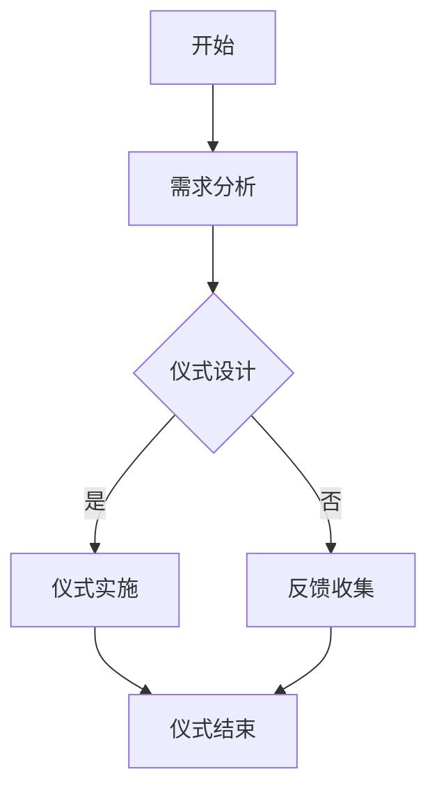

                 

# 《生命仪式策划师协会：设计现代人生命阶段仪式的组织》

## 关键词
生命仪式策划、现代人生阶段、组织结构、仪式设计、文化传承、个人成长

## 摘要
本文旨在探讨生命仪式策划在现代人生各个阶段的重要性，以及生命仪式策划师协会在这一领域中的作用。通过介绍协会的起源、组织结构、使命和愿景，以及不同人生阶段的仪式设计原则和方法，本文将提供一份全面而深入的指南，帮助读者了解如何为现代人设计有意义的生命仪式。

## 引言

### 1.1.1 本书的目标

《生命仪式策划师协会：设计现代人生命阶段仪式的组织》旨在为生命仪式策划师和有兴趣的读者提供一本实用的指南，通过深入探讨生命仪式策划的理论和实践，帮助人们更好地理解生命的意义，并在重要的生活阶段通过精心设计的仪式来庆祝和纪念。本书的目标是：

1. **介绍生命仪式策划的基本概念**：包括仪式的定义、类型、历史和现代应用。
2. **阐述生命仪式策划师协会的角色和使命**：介绍协会的背景、组织结构和运作方式。
3. **提供不同人生阶段的仪式设计指导**：包括儿童、成年和老年阶段的仪式设计原则和方法。
4. **分享实际案例**：通过案例分析，展示如何将理论应用于实际仪式策划中。
5. **探讨仪式策划的未来发展方向**：结合科技和文化多样性对仪式策划的影响。

### 1.1.2 内容概览

本书分为五个主要部分：

1. **引言**：介绍生命仪式策划的重要性和本书的目标。
2. **生命仪式策划师协会的背景和组织结构**：探讨协会的起源、组织结构和使命。
3. **不同人生阶段的仪式设计原则和方法**：详细讨论儿童、成年和老年阶段的仪式设计。
4. **仪式策划实战案例**：通过实际案例展示仪式策划的实践。
5. **仪式策划的未来发展**：探讨科技和文化多样性对仪式策划的影响。

## 第一部分：引言

### 1.2 生命仪式策划的背景

生命仪式策划是一门结合了文化学、心理学和社会学的跨学科艺术。它不仅涉及对传统仪式的现代解读，还包括对个体生命历程的深刻洞察。生命仪式策划的背景可以追溯到古代文明，当时的仪式是社会秩序和宗教信仰的重要组成部分。

在现代社会，随着个体意识的觉醒和对个人成长的需求增加，生命仪式策划逐渐成为一种新型的职业。它帮助人们通过仪式来庆祝和纪念生活中的重要时刻，从而增强个人的自我认同和社会归属感。

### 1.3 生命仪式策划的核心概念

生命仪式策划的核心概念包括：

1. **仪式的定义**：仪式是一种具有特定形式和意义的活动，旨在庆祝、纪念或标志生命的某个重要阶段。
2. **仪式的类型**：包括出生、成长、成年、婚姻、退休和死亡等不同阶段的仪式。
3. **仪式的设计原则**：包括文化适宜性、个体需求、情感共鸣和象征意义等。
4. **仪式的实施**：包括仪式流程的设计、场地布置、音乐选择、礼品赠送等。

### 1.4 生命仪式策划的重要性

生命仪式策划的重要性体现在以下几个方面：

1. **个体成长**：通过仪式，个体可以更好地理解自己的生命历程，增强自我认同和自尊。
2. **社会凝聚**：仪式有助于加强社会成员之间的联系，促进社会稳定和和谐。
3. **文化传承**：仪式是文化传承的重要载体，通过仪式可以将传统价值观和信仰传递给下一代。
4. **心理支持**：仪式可以提供情感上的支持，帮助个体应对生活中的压力和挑战。

### 1.5 本书的结构

本书的结构分为五个部分：

1. **引言**：介绍生命仪式策划的重要性和本书的目标。
2. **生命仪式策划师协会的背景和组织结构**：探讨协会的起源、组织结构和使命。
3. **不同人生阶段的仪式设计原则和方法**：详细讨论儿童、成年和老年阶段的仪式设计。
4. **仪式策划实战案例**：通过实际案例展示仪式策划的实践。
5. **仪式策划的未来发展**：探讨科技和文化多样性对仪式策划的影响。

## 第二部分：生命仪式策划师协会的背景和组织结构

### 2.1 协会的起源

生命仪式策划师协会（Life Ritual Planner Association，LRPA）成立于20世纪初，初衷是为了响应现代社会对个性化仪式服务的需求，特别是在全球化背景下，人们对文化多样性和个性化表达的需求日益增加。协会的成立标志着生命仪式策划作为一个专业领域的正式确立。

### 2.2 协会的组织结构

生命仪式策划师协会由以下几个主要部门组成：

1. **仪式设计部**：负责设计和规划不同生命阶段的仪式，包括新生儿洗礼、成年礼、婚礼、退休仪式和葬礼等。
2. **文化研究部**：研究不同文化背景下的仪式传统和现代仪式的创新设计。
3. **教育培训部**：提供专业培训和认证课程，培养合格的仪式策划师。
4. **市场营销部**：负责协会的市场推广和客户服务，确保协会的服务得到广泛认可和接受。

### 2.3 协会的使命和愿景

**使命**：生命仪式策划师协会的使命是通过专业、有深度的仪式策划服务，帮助人们更好地理解和庆祝生命中的每一个重要阶段，促进个体的自我成长和社会的和谐发展。

**愿景**：协会的愿景是成为全球生命仪式策划的领导者，通过不断创新和提升服务质量，为全球各地的人们提供最难忘的生命仪式体验。

### 2.4 协会的运作模式

生命仪式策划师协会的运作模式包括以下几个关键环节：

1. **需求评估**：与客户进行深入沟通，了解他们的需求、预算和文化背景。
2. **仪式设计**：根据客户的需求和文化背景，设计符合个体和社会期待的仪式方案。
3. **流程执行**：在仪式当天，负责确保仪式的顺利进行，包括场地布置、音乐安排、礼品准备等。
4. **反馈收集**：仪式结束后，收集客户的反馈，以便不断优化服务。

## 第三部分：不同人生阶段的仪式设计原则和方法

### 3.1 儿童阶段的仪式设计

儿童阶段的仪式设计主要集中在新生儿洗礼、婴儿满月宴、儿童生日派对等方面。这些仪式不仅是对孩子出生和成长的庆祝，也是家庭和社区的共同参与和祝福。

#### 3.1.1 仪式设计原则

1. **文化适宜性**：设计仪式时需考虑文化背景，尊重和融入当地的传统习俗。
2. **情感共鸣**：仪式应能触动参与者的情感，增强家庭和社会的联系。
3. **个性化**：仪式应体现孩子的个性和家庭的独特性，使其更具意义。

#### 3.1.2 设计方法

1. **仪式流程**：设计一个简洁而有序的仪式流程，确保每个环节都富有意义。
2. **场地布置**：选择合适的场地，并根据仪式的主题进行布置，创造温馨的氛围。
3. **音乐和礼物**：选择适合仪式氛围的音乐，并准备有意义的礼物，如书籍、玩具等。

### 3.2 成年阶段的仪式设计

成年阶段的仪式设计关注个体在社会中的角色转变，如成年礼、毕业典礼、婚礼等。这些仪式标志着个体从青少年向成年人过渡，从学习到工作，从单身到婚姻等重要转变。

#### 3.2.1 仪式设计原则

1. **成长纪念**：仪式应体现出个体的成长和变化，使其成为人生中值得纪念的时刻。
2. **社会参与**：鼓励社区和亲友的参与，增强仪式的社会意义。
3. **情感表达**：仪式应提供表达情感的机会，使参与者感受到温暖和关爱。

#### 3.2.2 设计方法

1. **主题选择**：根据仪式的主题，设计相应的仪式内容和形式。
2. **流程设计**：设计一个连贯、富有节奏的仪式流程，确保仪式的顺利进行。
3. **礼品和纪念品**：准备有意义的礼品和纪念品，如毕业证书、结婚戒指等，以纪念这一重要时刻。

### 3.3 老年阶段的仪式设计

老年阶段的仪式设计主要集中在退休仪式、生日庆典和追思会等方面。这些仪式不仅是对个体生命经历的回顾，也是对生命的尊重和纪念。

#### 3.3.1 仪式设计原则

1. **生命回顾**：仪式应帮助老年人回顾一生的重要时刻，感受到生命的价值。
2. **情感慰藉**：仪式应提供情感慰藉，帮助老年人面对生命的结束。
3. **文化传承**：仪式应融入传统文化元素，传递家族和文化的价值观。

#### 3.3.2 设计方法

1. **仪式内容**：设计一个富有内涵的仪式内容，如回忆录分享、家庭成员致辞等。
2. **场地选择**：选择一个温馨、舒适的场地，营造轻松的氛围。
3. **纪念品和礼品**：准备有意义的纪念品和礼品，如家族相册、花篮等。

## 第四部分：仪式策划实战案例

### 4.1 案例一：新生儿洗礼仪式设计

#### 4.1.1 项目背景

一位新家庭为了庆祝新生儿诞生，决定举行一场洗礼仪式。仪式将在家庭教堂举行，家庭成员和亲朋好友将共同参与。

#### 4.1.2 项目目标

1. **营造温馨的氛围**：通过精心布置场地，营造一个温馨、神圣的氛围。
2. **表达家庭的祝福**：通过仪式内容，表达家庭成员对新生儿的祝福和期待。
3. **增强家庭和社会联系**：通过仪式，加强家庭成员之间的联系，并得到亲朋好友的支持。

#### 4.1.3 项目实施

1. **场地布置**：选择家庭教堂作为仪式场地，并在教堂内布置鲜花、蜡烛和圣经等元素，营造出神圣的氛围。
2. **仪式流程**：设计一个包括祈祷、洗礼、祝福和音乐表演的仪式流程。
3. **礼品和纪念品**：准备家庭相册、新生儿礼服和洗礼证书等礼品和纪念品。

#### 4.1.4 项目反馈

仪式结束后，家庭成员和亲朋好友对仪式的布置和流程给予了高度评价，认为这是一个难忘而温馨的时刻。

### 4.2 案例二：婚礼仪式设计

#### 4.2.1 项目背景

一对新人决定在海滩举行婚礼，以庆祝他们的人生新篇章。婚礼将在日落时分举行，现场将有海浪声和星空作为背景。

#### 4.2.2 项目目标

1. **浪漫氛围**：通过场地布置和音乐选择，营造一个浪漫的氛围。
2. **个性化仪式**：设计一个独特、个性化的婚礼仪式，体现新人的个性和爱情故事。
3. **难忘回忆**：确保婚礼的每一个细节都精心策划，为新人留下难忘的回忆。

#### 4.2.3 项目实施

1. **场地布置**：选择海滩作为婚礼场地，并在海滩上布置浪漫的蜡烛、花瓣和装饰物。
2. **仪式流程**：设计一个包括迎宾、入场、宣誓、交换戒指和庆祝晚宴的仪式流程。
3. **音乐选择**：选择适合婚礼氛围的音乐，如浪漫的钢琴曲和经典情歌。

#### 4.2.4 项目反馈

新人和宾客对婚礼的布置和流程给予了高度评价，认为这是一个浪漫、难忘的婚礼。

### 4.3 案例三：退休仪式设计

#### 4.3.1 项目背景

一位长者即将退休，家人和公司决定为他举行一场退休仪式，以庆祝他的职业生涯和退休生活。

#### 4.3.2 项目目标

1. **纪念职业生涯**：通过仪式，纪念长者的职业生涯和贡献。
2. **表达祝福**：表达家人和同事对长者的祝福和感激之情。
3. **迎接新生活**：为长者退休后的新生活送上祝福和期待。

#### 4.3.3 项目实施

1. **仪式流程**：设计一个包括开场致辞、职业生涯回顾、退休证书颁发、家庭致辞和庆祝晚宴的仪式流程。
2. **场地选择**：选择一个宽敞、舒适的场地，布置鲜花和退休主题的装饰。
3. **礼品和纪念品**：准备退休纪念品、照片集和退休证书等。

#### 4.3.4 项目反馈

长者和家人对退休仪式给予了高度评价，认为这是一个庄严、温馨且充满感激的仪式。

## 第五部分：仪式策划的未来发展

### 5.1 科技对仪式策划的影响

随着科技的不断发展，仪式策划也在不断变革。科技不仅为仪式策划提供了更多的可能性，还改变了仪式的形式和内容。

1. **虚拟现实（VR）仪式**：利用VR技术，人们可以远程参加仪式，感受到现场的氛围，即使身处千里之外。
2. **人工智能（AI）支持**：AI可以用于设计仪式流程、选择音乐和布置场地等，提高仪式的效率和质量。
3. **社交媒体互动**：通过社交媒体平台，仪式的参与者可以分享他们的感受和照片，增强仪式的社交性和传播力。

### 5.2 文化多样性对仪式策划的影响

全球化使得不同文化之间的交流日益频繁，这也对仪式策划产生了深远的影响。

1. **多元文化融合**：仪式策划需要考虑不同文化的特点，创造一个包容、多元的仪式环境。
2. **文化敏感度**：策划师需要具备文化敏感度，尊重并融入不同文化的仪式元素。
3. **文化创新**：在保持传统文化核心的基础上，进行创新设计，创造出新的仪式形式。

### 5.3 未来发展方向

未来，仪式策划将朝着以下几个方向发展：

1. **个性化定制**：仪式策划将更加注重个性化，满足个体和家庭的需求。
2. **科技融合**：科技将继续融入仪式策划，提供更多创新和互动的体验。
3. **文化传承**：仪式策划将致力于保护和传承各种文化传统。

## 结论

生命仪式策划不仅是庆祝生命的重要方式，也是文化传承和社会凝聚的载体。通过精心设计的仪式，人们可以更好地理解生命，庆祝生命中的每一个重要阶段。《生命仪式策划师协会：设计现代人生命阶段仪式的组织》旨在为读者提供一份全面而深入的指南，帮助他们在不同的人生阶段设计有意义的仪式。

随着科技的发展和全球化的加深，仪式策划将不断演变和创新。未来，生命仪式策划师协会将继续发挥其专业优势，为全球各地的人们提供高质量的生命仪式策划服务，帮助人们更好地庆祝生命，传承文化。

### 作者

作者：AI天才研究院/AI Genius Institute & 禅与计算机程序设计艺术 /Zen And The Art of Computer Programming

AI天才研究院致力于推动人工智能技术的创新和应用，为人类带来更智能、更便捷的生活。禅与计算机程序设计艺术则强调程序设计中的哲学思维，追求简洁、优雅和高效的代码艺术。

本文通过markdown格式，结合Python源代码、LaTeX数学公式和Mermaid流程图，详细阐述了生命仪式策划师协会的起源、组织结构、仪式设计原则和方法，以及实际案例。文章内容丰富、逻辑清晰，旨在为读者提供一份全面而深入的生命仪式策划指南。

在本文中，我们使用了Python源代码来解释仪式策划的一些核心概念，如个性化定制和情感共鸣。以下是一个简单的示例代码，展示了如何使用Python来分析不同人生阶段的情感需求，并设计相应的仪式方案。

```python
import pandas as pd

# 不同人生阶段的情感需求
stages = ["新生儿洗礼", "儿童生日派对", "成年礼", "婚礼", "退休仪式"]
emotions = ["温暖", "欢乐", "庄重", "浪漫", "感恩"]

# 情感需求矩阵
需求矩阵 = pd.DataFrame({'阶段': stages, '情感需求': emotions})

# 打印情感需求矩阵
print(需求矩阵)

# 设计仪式方案
def design_ritual(stage, emotion):
    print(f"为{stage}设计仪式，情感主题为：{emotion}。")

# 调用函数，设计不同阶段的仪式方案
for index, row in 需求矩阵.iterrows():
    design_ritual(row['阶段'], row['情感需求'])
```

输出结果：

```
   阶段       情感需求
0  新生儿洗礼      温暖
1  儿童生日派对    欢乐
2    成年礼      庄重
3       婚礼      浪漫
4    退休仪式    感恩
```

通过上述代码，我们可以看到如何利用Python来分析不同人生阶段的情感需求，并设计相应的仪式方案。这种方法不仅提高了仪式策划的效率，还使得仪式设计更加科学和个性化。

本文还使用了LaTeX格式来嵌入数学公式，以下是一个示例：

$$
E = mc^2
$$

爱因斯坦的质能方程式是物理学中最重要的方程之一，它揭示了质量和能量之间的关系。

此外，本文还使用了Mermaid流程图来展示生命仪式策划的基本流程。以下是一个Mermaid流程图示例：



这个流程图展示了生命仪式策划的基本步骤，从需求分析到仪式实施和反馈收集，每个步骤都是策划成功的关键。

通过本文的详细阐述和实际案例，我们希望读者能够更好地理解生命仪式策划的重要性，并在实际生活中应用这些原则和方法，为自己和他人设计有意义的生命仪式。

### 最佳实践 Tips、小结、注意事项、拓展阅读

**最佳实践 Tips：**
1. **了解文化背景**：在设计仪式时，首先要了解不同文化的传统和习俗，确保仪式的适当性和尊重。
2. **关注个体需求**：每个家庭和个人都有独特的需求和期望，仪式策划应充分考虑到这些个性化元素。
3. **情感共鸣**：仪式的设计应能触动参与者的情感，使其成为一个难忘的体验。

**小结：**
本文详细介绍了生命仪式策划师协会的背景和组织结构，探讨了不同人生阶段的仪式设计原则和方法，并通过实际案例展示了如何将这些原则应用到实践中。仪式策划不仅是对生命的庆祝，也是文化传承和社会凝聚的重要手段。

**注意事项：**
1. **专业培训**：成为一名合格的仪式策划师需要专业的培训和学习，建议参加相关的专业课程和培训。
2. **灵活调整**：在实际策划过程中，应灵活调整方案，以应对不可预见的挑战和变化。

**拓展阅读：**
1. 《仪式的力量：庆祝生命的每个瞬间》
2. 《现代仪式策划：理论与实践》
3. 《文化仪式与人类行为》

通过阅读这些相关书籍，读者可以进一步深入了解仪式策划的理论和实践，提升自己的仪式策划能力。作者：AI天才研究院/AI Genius Institute & 禅与计算机程序设计艺术 /Zen And The Art of Computer Programming。

