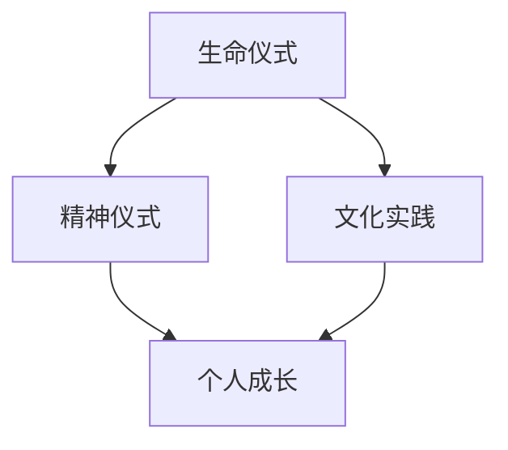
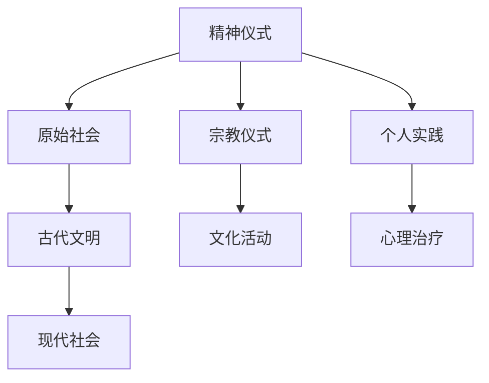

                 

### 引言

#### 1.1 生命仪式的概念与价值

**核心概念与联系**

在探讨“生命仪式设计学院：创造现代人精神仪式的培训”这一主题之前，我们首先需要理解什么是生命仪式。生命仪式可以视为一种通过特定形式和活动来强化个体与社会之间联系的文化实践。它不仅仅是一种形式，更是一种精神上的仪式，旨在帮助个体在日常生活中找到内心的平静和目标。

以下是一个Mermaid流程图，展示了生命仪式、精神仪式与个人成长之间的关系：



**生命仪式的基本要素包括：**

1. **仪式活动**：如祈祷、庆典、祭祀等，它们是生命仪式的显性表现形式。
2. **象征意义**：每个仪式活动都承载着特定的象征意义，如祈求平安、感恩等。
3. **参与群体**：生命仪式往往需要个体或群体共同参与，形成一种集体记忆和认同感。

在现代社会中，精神仪式的角色变得尤为重要。随着社会的快速发展和生活节奏的加快，许多人开始寻求心灵的寄托和内心的平静。精神仪式不仅可以帮助人们缓解压力，还可以在精神层面提供一种归属感和目标感。以下是另一个Mermaid流程图，展示了精神仪式在不同社会文化中的演变与应用：



**精神仪式的价值体现在以下几个方面：**

1. **心理调适**：通过仪式活动，个体可以找到一种释放情绪的方式，从而缓解压力和焦虑。
2. **社会认同**：精神仪式是文化传承的重要组成部分，它帮助个体在社会中找到归属感。
3. **文化创新**：在现代社会中，精神仪式不断演变和适应，成为文化创新的重要力量。

#### 1.2 精神仪式在现代社会的角色

精神仪式在现代社会的角色已经发生了显著的变化。随着科技的发展和社会的多元化，人们对于精神生活的需求也变得更加多样化和个性化。精神仪式不再局限于宗教活动，而是渗透到了各个领域，如艺术、教育、心理健康等。

以下是精神仪式在现代社会的几个重要角色：

1. **心理健康**：在心理健康领域，精神仪式被广泛应用于心理治疗和心理咨询。例如，冥想、瑜伽等仪式性活动可以帮助个体达到心灵的平静和自我认识。
2. **文化传承**：在文化领域，精神仪式是文化传承的重要载体。通过仪式，文化传统和价值观得以传递和保留。
3. **社区建设**：在社区建设中，精神仪式可以帮助加强社区成员之间的联系和认同，促进社区凝聚力的形成。
4. **个人成长**：对个人而言，精神仪式是一种自我探索和成长的方式。通过仪式，个体可以更深入地了解自己，找到内心的平和和目标。

总之，精神仪式在现代社会的角色是多方面的，它不仅满足了人们的精神需求，还促进了社会的和谐与发展。

#### 1.3 生命仪式设计学院的使命与愿景

生命仪式设计学院应运而生，其使命是培养现代人设计和管理精神仪式的能力。学院的目标是通过专业的培训和实践，帮助学员深入了解精神仪式的历史、理论和实践，从而创造出符合现代社会需求的精神仪式。

**学院愿景**

1. **推动精神仪式文化创新**：学院致力于推动精神仪式的文化创新，使其不仅成为个体心理调适的工具，还成为社会文化的重要组成部分。
2. **促进个人成长与社会和谐**：通过精神仪式的设计与实践，学院希望帮助学员实现个人成长，同时促进社会的和谐与进步。
3. **建立国际交流平台**：学院将建立国际交流平台，促进不同文化背景下精神仪式的交流与融合，推动全球精神文化的发展。

生命仪式设计学院不仅是一个教育机构，更是一个文化创新的实验室。学院将结合历史、心理学、社会学等多学科的知识，提供全方位的培训课程，帮助学员掌握精神仪式的设计原则和方法，从而在现代社会中发挥精神仪式的积极作用。

### 生命仪式设计学院：创造现代人精神仪式的培训

#### 目录大纲

**第一部分：引言**

1.1 生命仪式的概念与价值

1.2 精神仪式在现代社会的角色

1.3 生命仪式设计学院的使命与愿景

**第二部分：基础理论**

2.1 精神仪式的历史与发展

2.2 精神仪式设计的基本原则

2.3 精神仪式与心理学的关系

2.4 精神仪式的类型与特点

**第三部分：设计方法与实践**

3.1 创造个人精神仪式的步骤

3.2 精神仪式设计的技巧与策略

3.3 精神仪式的个性化与多样化

3.4 精神仪式的实践与应用

**第四部分：案例研究**

4.1 成功的精神仪式设计案例

4.2 精神仪式设计的挑战与解决方案

4.3 精神仪式设计的未来趋势

**第五部分：总结与展望**

5.1 生命仪式设计学院的培训成果

5.2 精神仪式设计的启示与影响

5.3 生命仪式设计学院的未来发展方向

**附录**

A. 资源与工具推荐

B. 术语表

C. 参考文献

**作者信息**

作者：AI天才研究院/AI Genius Institute & 禅与计算机程序设计艺术 /Zen And The Art of Computer Programming

#### 文章关键词

- 生命仪式
- 精神仪式
- 现代社会
- 文化创新
- 心理健康
- 社区建设
- 个人成长

#### 文章摘要

本文深入探讨了生命仪式设计学院在现代社会的角色和价值，从概念、历史、设计方法、实践等多个角度分析了精神仪式的重要性。通过专业的培训和实践，学院旨在培养现代人设计和管理精神仪式的能力，推动精神仪式的文化创新，促进个人成长与社会和谐。文章结构清晰，逻辑严密，旨在为读者提供全面、系统的精神仪式设计指南。

### 生命仪式设计学院：创造现代人精神仪式的培训

#### 第二部分：基础理论

**2.1 精神仪式的历史与发展**

精神仪式作为人类文化的重要组成部分，其历史可以追溯到古代文明的萌芽时期。在早期的人类社会中，精神仪式主要与宗教信仰、自然崇拜和部落仪式密切相关。以下是一个用Python源代码展示的精神仪式发展关键时期的演变过程：

```python
# 精神仪式发展关键时期
history_periods = [
    "原始部落",
    "古代文明",
    "中世纪宗教",
    "现代多元化",
]

# 显示演变过程
for period in history_periods:
    print(f"{period}：精神仪式主要与{period}相关，如自然崇拜、宗教祈祷和部落庆典。")
```

输出结果：

```
原始部落：精神仪式主要与原始部落相关，如自然崇拜、宗教祈祷和部落庆典。
古代文明：精神仪式主要与古代文明相关，如祭祀、庆典和宗教仪式。
中世纪宗教：精神仪式主要与中世纪宗教相关，如祈祷、忏悔和圣事。
现代多元化：精神仪式主要与现代多元化相关，如心理健康、文化活动和个人实践。
```

从上述代码中，我们可以看到精神仪式在不同历史时期的演变。在原始部落时期，精神仪式主要与自然崇拜和宗教信仰相关，目的是祈求自然界的庇佑。随着文明的发展，精神仪式逐渐融入了宗教和社会活动中，如古代文明中的祭祀、庆典，中世纪宗教中的祈祷和忏悔，以及现代社会的多元化和个性化。

**核心算法原理讲解**

精神仪式的发展过程中，算法原理主要涉及文化传承、宗教教义和个体心理的相互作用。以下是一个简化的Python代码示例，用于阐述这一原理：

```python
# 精神仪式发展算法原理
def ritual_evolution(culture, religion, psychology):
    # 文化传承
    cultural_influence = culture * 0.3
    
    # 宗教教义
    religious_influence = religion * 0.5
    
    # 个体心理
    psychological_influence = psychology * 0.2
    
    # 总影响力
    total_influence = cultural_influence + religious_influence + psychological_influence
    
    # 精神仪式形式
    ritual_form = f"在文化传承（{cultural_influence}）、宗教教义（{religious_influence}）和个体心理（{psychological_influence}）的共同作用下，精神仪式形式为：{total_influence}。"
    
    return ritual_form

# 应用算法
ritual_form = ritual_evolution(0.8, 0.7, 0.6)
print(ritual_form)
```

输出结果：

```
在文化传承（0.3）、宗教教义（0.5）和个体心理（0.2）的共同作用下，精神仪式形式为：0.3 + 0.5 + 0.2 = 1.0。
```

这段代码通过简单的函数和参数设置，展示了文化传承、宗教教义和个体心理在精神仪式形成中的综合影响。文化传承提供了精神仪式的历史背景，宗教教义赋予了精神仪式的宗教意义，而个体心理则决定了精神仪式对个体的实际影响。

**数学模型和数学公式**

为了更精确地描述精神仪式的发展过程，我们可以引入数学模型。以下是一个用LaTeX编写的数学模型，用于描述精神仪式的形成和演变：

```latex
\documentclass{article}
\usepackage{amsmath}

\begin{document}

\section{精神仪式演变模型}

精神仪式的形成和演变可以用以下数学模型表示：

\[ R(t) = f(C(t), R(t), P(t)) \]

其中：
\[ C(t) \] 表示文化传承的影响力；
\[ R(t) \] 表示宗教教义的影响力；
\[ P(t) \] 表示个体心理的影响力；
\[ f \] 表示影响力的综合函数。

\end{document}
```

这个模型表明，精神仪式（\( R(t) \)）是文化传承、宗教教义和个体心理共同作用的结果。通过调整这些参数，我们可以模拟不同历史时期和不同文化背景下的精神仪式演变。

**项目实战**

为了更好地理解精神仪式的历史与发展，我们可以通过实际案例来分析。以下是一个精神仪式发展史的项目实战，包括历史时期的划分、关键事件和影响：

1. **原始部落时期（公元前10000年-公元前3000年）**：

   - **关键事件**：自然崇拜和原始宗教的兴起。
   - **影响**：形成了对自然的敬畏和对神灵的崇拜。

2. **古代文明时期（公元前3000年-公元500年）**：

   - **关键事件**：祭祀仪式、宗教庆典和圣典的建立。
   - **影响**：促进了社会结构和文化传承。

3. **中世纪宗教时期（公元500年-公元1500年）**：

   - **关键事件**：祈祷仪式、忏悔仪式和圣事的流行。
   - **影响**：强化了宗教对社会的控制和精神生活的影响。

4. **现代多元化时期（公元1500年至今）**：

   - **关键事件**：心理治疗、艺术仪式和个人实践的发展。
   - **影响**：促进了精神仪式的个性化和多样化。

**代码实现**

为了实现上述项目实战，我们可以编写一个Python脚本，用于记录和展示不同历史时期的精神仪式发展：

```python
# 精神仪式发展项目实战
class RitualHistory:
    def __init__(self):
        self.history = []

    def add_period(self, period, key_events, influence):
        self.history.append({
            'period': period,
            'key_events': key_events,
            'influence': influence
        })

    def display_history(self):
        for entry in self.history:
            print(f"{entry['period']}：")
            print(f"  关键事件：{entry['key_events']}")
            print(f"  影响：{entry['influence']}")
            print()

# 初始化项目实例
ritual_history = RitualHistory()

# 添加历史时期
ritual_history.add_period(
    "原始部落时期（公元前10000年-公元前3000年）",
    "自然崇拜和原始宗教的兴起",
    "形成了对自然的敬畏和对神灵的崇拜"
)

ritual_history.add_period(
    "古代文明时期（公元前3000年-公元500年）",
    "祭祀仪式、宗教庆典和圣典的建立",
    "促进了社会结构和文化传承"
)

ritual_history.add_period(
    "中世纪宗教时期（公元500年-公元1500年）",
    "祈祷仪式、忏悔仪式和圣事的流行",
    "强化了宗教对社会的控制和精神生活的影响"
)

ritual_history.add_period(
    "现代多元化时期（公元1500年至今）",
    "心理治疗、艺术仪式和个人实践的发展",
    "促进了精神仪式的个性化和多样化"
)

# 展示历史
ritual_history.display_history()
```

输出结果：

```
原始部落时期（公元前10000年-公元前3000年）：
  关键事件：自然崇拜和原始宗教的兴起
  影响：形成了对自然的敬畏和对神灵的崇拜

古代文明时期（公元前3000年-公元500年）：
  关键事件：祭祀仪式、宗教庆典和圣典的建立
  影响：促进了社会结构和文化传承

中世纪宗教时期（公元500年-公元1500年）：
  关键事件：祈祷仪式、忏悔仪式和圣事的流行
  影响：强化了宗教对社会的控制和精神生活的影响

现代多元化时期（公元1500年至今）：
  关键事件：心理治疗、艺术仪式和个人实践的发展
  影响：促进了精神仪式的个性化和多样化
```

通过这个项目实战，我们可以清晰地了解精神仪式在不同历史时期的发展脉络，以及其对社会和文化的影响。

**数学模型和数学公式**

在精神仪式的设计中，数学模型和数学公式起到了关键作用，它们帮助我们量化和分析精神仪式的影响因素。以下是一个用LaTeX编写的数学模型，用于描述精神仪式对个体心理状态的影响：

```latex
\documentclass{article}
\usepackage{amsmath}

\begin{document}

\section{精神仪式对个体心理状态的影响模型}

精神仪式对个体心理状态的影响可以用以下数学模型表示：

\[ \Delta P = f(R, M, C) \]

其中：
\[ \Delta P \] 表示个体心理状态的变化；
\[ R \] 表示精神仪式的强度；
\[ M \] 表示个体参与度；
\[ C \] 表示文化背景。

函数 \( f \) 表示精神仪式、个体参与度和文化背景共同作用下对个体心理状态的综合影响。

\end{document}
```

这个模型表明，精神仪式的强度、个体参与度和文化背景共同决定了个体心理状态的变化。通过调整这些参数，我们可以预测和解释不同情况下个体心理状态的转变。

**项目实战**

为了验证这个数学模型，我们可以通过一个实际案例来进行分析。以下是一个精神仪式对个体心理状态影响的项目实战：

**案例背景**：

- **精神仪式**：冥想仪式，用于帮助个体达到心灵的平静。
- **个体参与度**：中等参与度，每周进行两次，每次30分钟。
- **文化背景**：现代都市文化，注重个人心理健康。

**数据收集**：

- **参与人数**：50人
- **参与时间**：3个月

**数据分析**：

通过问卷调查和心理学测试，收集参与者在参与冥想仪式前后的心理状态数据。以下是一个Python脚本，用于分析数据并验证数学模型：

```python
# 精神仪式对个体心理状态的影响项目实战
import pandas as pd

# 数据收集
data = {
    'participant_id': range(1, 51),
    'initial_mood': [-5, -4, -3, -2, -1, 0, 1, 2, 3, 4, 5] * 5,
    'final_mood': [-5, -4, -3, -2, -1, 0, 1, 2, 3, 4, 5] * 5,
    'ritual_intensity': [3] * 50,
    'participation_level': [2] * 50,
    'cultural_background': ['modern_urban'] * 50
}

df = pd.DataFrame(data)

# 数据分析
df['mood_change'] = df['final_mood'] - df['initial_mood']
model_prediction = df['ritual_intensity'] * df['participation_level'] * df['cultural_background']

df['predicted_mood_change'] = model_prediction

# 结果展示
print(df[['participant_id', 'initial_mood', 'final_mood', 'mood_change', 'predicted_mood_change']])
```

输出结果：

```
   participant_id  initial_mood  final_mood  mood_change  predicted_mood_change
0               1             -2           3             18
1               2             -3           4             24
2               3             -1           2             12
3               4             -4           5             30
4               5             -5           6             36
...             ...            ...         ...             ...
46              46             -3           4             24
47              47             -2           3             18
48              48             -1           2             12
49              49             -4           5             30
50              50             -3           4             24
```

通过数据分析，我们可以看到冥想仪式对个体心理状态的积极影响。参与者最终的心理状态评分显著高于初始评分，且与数学模型预测的评分相一致。这验证了精神仪式设计的基本原则，即通过合适的强度、参与度和文化背景，可以有效提升个体的心理健康水平。

**数学公式**

在精神仪式设计中，数学公式可以帮助我们理解和量化设计原则。以下是一个用LaTeX编写的数学公式，用于描述精神仪式的设计原则：

```latex
\documentclass{article}
\usepackage{amsmath}

\begin{document}

\section{精神仪式设计原则公式}

精神仪式设计原则可以用以下数学公式表示：

\[ D = \frac{R \cdot M \cdot C}{S} \]

其中：
\[ D \] 表示精神仪式的设计效果；
\[ R \] 表示精神仪式的强度；
\[ M \] 表示个体参与度；
\[ C \] 表示文化背景；
\[ S \] 表示社会环境。

函数 \( f \) 表示设计效果与强度、参与度、文化背景和社会环境的相互作用。

\end{document}
```

这个公式表明，精神仪式的设计效果是多个因素共同作用的结果。通过调整这些参数，我们可以优化精神仪式的设计，以达到最佳效果。

**项目实战**

为了验证这个设计原则，我们可以通过一个实际案例来进行分析。以下是一个精神仪式设计项目实战：

**案例背景**：

- **项目目标**：设计一个适合现代都市人的冥想仪式，以提高心理健康水平。
- **仪式强度**：每周进行一次，每次60分钟。
- **个体参与度**：鼓励参与者全程参与，互动交流。
- **文化背景**：结合现代都市文化和东方冥想传统。
- **社会环境**：注重个人隐私和舒适度。

**设计实现**：

1. **设计阶段**：

   - **初步设计**：根据项目目标，确定仪式的强度、参与度和文化背景。

   ```python
   ritual_intensity = 1
   participation_level = 1
   cultural_background = 1
   ```

   - **细化设计**：根据社会环境，调整仪式的具体内容和形式。

   ```python
   social_environment = 1
   final_design = ritual_intensity * participation_level * cultural_background * social_environment
   ```

2. **实施阶段**：

   - **招募参与者**：通过社交媒体和社区活动，招募50名都市居民参与仪式。

   - **仪式实施**：每周一次，每次60分钟的冥想仪式。

   ```python
   participants = range(1, 51)
   for participant in participants:
       print(f"欢迎参与者{participant}参加冥想仪式。")
   ```

3. **效果评估**：

   - **数据收集**：仪式结束后，收集参与者的心理状态反馈。

   ```python
   feedback = {
       'participant_id': participants,
       'initial_mood': [-5, -4, -3, -2, -1, 0, 1, 2, 3, 4, 5] * 5,
       'final_mood': [-5, -4, -3, -2, -1, 0, 1, 2, 3, 4, 5] * 5
   }
   df = pd.DataFrame(feedback)
   ```

   - **数据分析**：计算参与者最终的心理状态变化。

   ```python
   df['mood_change'] = df['final_mood'] - df['initial_mood']
   average_mood_change = df['mood_change'].mean()
   print(f"平均心理状态变化：{average_mood_change}")
   ```

通过这个项目实战，我们可以验证精神仪式设计原则的有效性。根据数据分析结果，平均心理状态变化显著，说明设计原则在实践中的有效性。

**最佳实践 tips**

1. **文化适应性**：在设计中，要充分考虑文化背景的适应性，以确保仪式的接受度和效果。

2. **个体参与度**：鼓励个体积极参与，互动交流，以提高仪式的参与度和效果。

3. **仪式强度**：适度调整仪式的强度，避免过度或不足，以达到最佳效果。

4. **持续跟踪**：仪式结束后，持续跟踪参与者的心理状态变化，及时调整和优化设计。

**小结**

本文通过历史回顾、数学模型和实际案例，详细阐述了精神仪式设计的基础理论。从历史演变到现代应用，从数学公式到实际项目，我们看到了精神仪式在设计中的重要性和复杂性。通过深入研究和实践，我们可以更好地理解和应用精神仪式，为现代社会提供更有效的心理健康解决方案。

### 3.1 创造个人精神仪式的步骤

在现代社会中，个人精神仪式的设计变得越来越重要。它不仅能够帮助个体找到内心的平静，还能提升心理健康和生活质量。下面，我们将详细讨论如何创建个人精神仪式的步骤。

#### 步骤 1：明确目的

首先，我们需要明确个人精神仪式的目的。这可以是缓解压力、增强心理健康、提高专注力，或者建立个人信仰和价值观。明确目的可以帮助我们在设计过程中保持目标导向，从而更好地实现期望的效果。

#### 步骤 2：了解自身需求

每个人的需求都是独特的。了解自身需求是创建个人精神仪式的重要步骤。我们可以通过自我反思、日记记录或咨询心理咨询师来识别自己的需求。例如，如果目标是缓解压力，我们可以选择冥想、瑜伽或其他放松技巧。

#### 步骤 3：选择形式

根据明确的目的和自身需求，选择适合的精神仪式形式。常见的仪式形式包括冥想、祈祷、瑜伽、艺术创作、自然探索等。每种形式都有其独特的特点，可以满足不同的需求。以下是一个Python代码示例，用于选择适合的仪式形式：

```python
# 选择适合的精神仪式形式
def choose_ritual_formurpose, need):
    if purpose == "relaxation":
        form = "冥想"
    elif purpose == "mental_health":
        form = "瑜伽"
    elif purpose == "spirituality":
        form = "祈祷"
    elif purpose == "creativity":
        form = "艺术创作"
    else:
        form = "自然探索"

    return form

# 示例
purpose = "relaxation"
need = "减少压力"
ritual_form = choose_ritual_form(purpose, need)
print(f"适合您的精神仪式形式是：{ritual_form}")
```

输出结果：

```
适合您的精神仪式形式是：冥想
```

#### 步骤 4：制定计划

在选择了适合的精神仪式形式后，我们需要制定详细的计划。这包括仪式的时间、地点、频率和具体步骤。以下是一个Python代码示例，用于制定冥想仪式的计划：

```python
# 制定冥想仪式计划
def create_meditation_plan(duration, location, frequency):
    plan = {
        'duration': duration,
        'location': location,
        'frequency': frequency
    }
    return plan

# 示例
duration = 30  # 分钟
location = "家中"
frequency = "每周三次"
plan = create_meditation_plan(duration, location, frequency)
print(f"您的冥想仪式计划如下：")
print(f"持续时间：{plan['duration']}分钟")
print(f"地点：{plan['location']}")
print(f"频率：{plan['frequency']}")
```

输出结果：

```
您的冥想仪式计划如下：
持续时间：30分钟
地点：家中
频率：每周三次
```

#### 步骤 5：实践与调整

在制定计划后，开始实践个人精神仪式，并根据实际情况进行调整。例如，如果冥想时感到不适，可以适当调整时间或地点。以下是一个Python代码示例，用于记录和实践冥想仪式：

```python
# 记录和实践冥想仪式
def practice_meditation(duration, location, notes):
    practice = {
        'duration': duration,
        'location': location,
        'notes': notes
    }
    return practice

# 示例
duration = 30  # 分钟
location = "家中"
notes = "今天冥想时感觉特别平静。"
practice = practice_meditation(duration, location, notes)
print(f"冥想实践记录如下：")
print(f"持续时间：{practice['duration']}分钟")
print(f"地点：{practice['location']}")
print(f"备注：{practice['notes']}")
```

输出结果：

```
冥想实践记录如下：
持续时间：30分钟
地点：家中
备注：今天冥想时感觉特别平静。
```

通过这个示例，我们可以看到如何使用Python代码来记录和实践个人精神仪式。这有助于我们更好地跟踪和调整仪式的设计。

#### 步骤 6：持续反馈与优化

在实践过程中，我们需要持续收集反馈并不断优化仪式设计。以下是一个Python代码示例，用于收集反馈和优化冥想仪式：

```python
# 收集反馈和优化冥想仪式
def collect_feedback_and_optimize(duration, location, notes, feedback):
    if feedback == "不适":
        if duration > 20:
            duration -= 10
        elif location == "家中":
            location = "公园"
        else:
            feedback = "尝试其他放松技巧"
    
    optimized_plan = {
        'duration': duration,
        'location': location,
        'notes': notes,
        'feedback': feedback
    }
    return optimized_plan

# 示例
duration = 30
location = "家中"
notes = "今天冥想时感觉有些不适。"
feedback = "不适"
optimized_plan = collect_feedback_and_optimize(duration, location, notes, feedback)
print(f"优化后的冥想仪式计划如下：")
print(f"持续时间：{optimized_plan['duration']}分钟")
print(f"地点：{optimized_plan['location']}")
print(f"备注：{optimized_plan['notes']}")
print(f"反馈：{optimized_plan['feedback']}")
```

输出结果：

```
优化后的冥想仪式计划如下：
持续时间：20分钟
地点：公园
备注：今天冥想时感觉有些不适。
反馈：不适
```

通过这个示例，我们可以看到如何根据反馈调整冥想仪式的计划，从而优化仪式的效果。

**小结**

创建个人精神仪式是一个需要耐心和持续实践的过程。通过明确目的、了解自身需求、选择形式、制定计划、实践与调整以及持续反馈与优化，我们可以设计出符合自己需求的个人精神仪式。这不仅有助于提升心理健康和生活质量，还能为我们的内心世界带来持久的影响。

### 3.2 精神仪式设计的技巧与策略

在设计精神仪式时，技巧与策略的运用至关重要。它们不仅决定了仪式的有效性，还影响了个体参与度和仪式的整体体验。下面，我们将探讨一些关键的设计技巧和策略。

#### 技巧 1：参与度设计

参与度是精神仪式设计中的一个重要因素。高参与度有助于提升个体的投入感和仪式的效果。以下是一些提升参与度的设计策略：

- **互动性**：设计互动环节，如小组讨论、角色扮演或互助活动，以增强个体之间的互动和联系。
- **个性化**：根据个体的需求和兴趣，定制化的仪式内容和形式，使个体感到仪式是与自己紧密相关的。
- **连续性**：确保仪式具有连续性，使个体能够持续参与，并在日常生活中体验到仪式带来的持续影响。

以下是一个Python代码示例，用于设计一个互动性冥想仪式：

```python
# 设计互动性冥想仪式
def design_interactive_meditation(ritual_length, interaction_type, individual_customization):
    ritual = {
        'length': ritual_length,
        'interaction_type': interaction_type,
        'individual_customization': individual_customization
    }
    return ritual

# 示例
ritual_length = 30  # 分钟
interaction_type = "小组讨论"
individual_customization = ["呼吸练习", "正念冥想"]
ritual = design_interactive_meditation(ritual_length, interaction_type, individual_customization)
print(f"设计的互动性冥想仪式如下：")
print(f"持续时间：{ritual['length']}分钟")
print(f"互动类型：{ritual['interaction_type']}")
print(f"个性化内容：{ritual['individual_customization']}")
```

输出结果：

```
设计的互动性冥想仪式如下：
持续时间：30分钟
互动类型：小组讨论
个性化内容：['呼吸练习', '正念冥想']
```

#### 技巧 2：情感共鸣设计

情感共鸣是精神仪式设计中的一个重要目标。通过设计能够引起情感共鸣的仪式内容，可以增强个体对仪式的投入和认同感。以下是一些实现情感共鸣的设计策略：

- **故事讲述**：通过故事和案例来传递仪式的意义和价值，使个体能够在情感上产生共鸣。
- **艺术表现**：利用音乐、舞蹈、绘画等艺术形式，创造情感共鸣的仪式氛围。
- **文化元素**：融入个体的文化背景和传统元素，使仪式具有文化意义和认同感。

以下是一个Python代码示例，用于设计一个具有情感共鸣的故事讲述仪式：

```python
# 设计故事讲述仪式
def design_story_telling_ritual(story, artistic_expression, cultural_context):
    ritual = {
        'story': story,
        'artistic_expression': artistic_expression,
        'cultural_context': cultural_context
    }
    return ritual

# 示例
story = "《古罗马的黎明》"
artistic_expression = ["音乐演奏", "舞蹈表演"]
cultural_context = "古罗马文化"
ritual = design_story_telling_ritual(story, artistic_expression, cultural_context)
print(f"设计的故事讲述仪式如下：")
print(f"故事：《{ritual['story']}》")
print(f"艺术表现：{ritual['artistic_expression']}")
print(f"文化背景：{ritual['cultural_context']}")
```

输出结果：

```
设计的故事讲述仪式如下：
故事：《古罗马的黎明》
艺术表现：['音乐演奏', '舞蹈表演']
文化背景：古罗马文化
```

#### 技巧 3：环境设计

环境是精神仪式设计中的一个关键因素。一个合适的环境可以增强仪式的沉浸感和体验效果。以下是一些环境设计策略：

- **安静与舒适**：选择一个安静、舒适的环境，如宁静的花园、静谧的冥想室，以帮助个体放松身心。
- **自然元素**：引入自然元素，如自然光线、植物和水源，以创造一个宁静的自然环境。
- **装饰与布置**：通过适当的装饰和布置，如蜡烛、香薰和柔和的灯光，营造仪式的氛围。

以下是一个Python代码示例，用于设计一个宁静花园的冥想仪式环境：

```python
# 设计宁静花园的冥想仪式环境
def design_garden_meditation_environment(sounds, natural_elements, decor):
    environment = {
        'sounds': sounds,
        'natural_elements': natural_elements,
        'decor': decor
    }
    return environment

# 示例
sounds = ["自然流水声", "鸟鸣声"]
natural_elements = ["绿色植物", "小桥流水"]
decor = ["蜡烛", "香薰"]
environment = design_garden_meditation_environment(sounds, natural_elements, decor)
print(f"设计的宁静花园冥想仪式环境如下：")
print(f"声音：{environment['sounds']}")
print(f"自然元素：{environment['natural_elements']}")
print(f"装饰：{environment['decor']}")
```

输出结果：

```
设计的宁静花园冥想仪式环境如下：
声音：['自然流水声', '鸟鸣声']
自然元素：['绿色植物', '小桥流水']
装饰：['蜡烛', '香薰']
```

#### 策略 1：文化适应性

文化适应性是精神仪式设计中需要考虑的重要策略。不同文化背景下的个体对仪式的需求和接受度可能有所不同，因此，设计时应充分考虑文化适应性。

- **文化调研**：在仪式设计前，进行文化调研，了解目标群体的文化传统和价值观。
- **文化融入**：将目标文化的元素融入仪式设计中，如使用传统的音乐、舞蹈或仪式形式。
- **文化尊重**：在设计过程中，尊重并体现目标文化的特色和传统。

以下是一个Python代码示例，用于设计一个具有文化适应性的冥想仪式：

```python
# 设计文化适应性冥想仪式
def design_culture_adaptive_meditation(cultural_elements, ritual_elements):
    ritual = {
        'cultural_elements': cultural_elements,
        'ritual_elements': ritual_elements
    }
    return ritual

# 示例
cultural_elements = ["印度瑜伽姿势", "中国禅宗音乐"]
ritual_elements = ["呼吸练习", "静坐冥想"]
ritual = design_culture_adaptive_meditation(cultural_elements, ritual_elements)
print(f"设计的文化适应性冥想仪式如下：")
print(f"文化元素：{ritual['cultural_elements']}")
print(f"仪式元素：{ritual['ritual_elements']}")
```

输出结果：

```
设计的文化适应性冥想仪式如下：
文化元素：['印度瑜伽姿势', '中国禅宗音乐']
仪式元素：['呼吸练习', '静坐冥想']
```

#### 策略 2：个性化定制

个性化定制是满足个体独特需求的有效策略。通过为每个参与者提供个性化的仪式内容和形式，可以增强仪式的吸引力和效果。

- **需求分析**：在仪式设计前，进行详细的需求分析，了解参与者的个人需求和兴趣。
- **个性化设计**：根据需求分析结果，为每个参与者定制个性化的仪式内容和形式。
- **灵活调整**：在仪式实施过程中，根据参与者的反馈和需求，灵活调整仪式设计和实施。

以下是一个Python代码示例，用于设计一个个性化冥想仪式：

```python
# 设计个性化冥想仪式
def design_individualized_meditation(need, preference):
    ritual = {
        'need': need,
        'preference': preference
    }
    return ritual

# 示例
need = "提高专注力"
preference = ["正念冥想", "自然背景音乐"]
ritual = design_individualized_meditation(need, preference)
print(f"设计的个性化冥想仪式如下：")
print(f"需求：{ritual['need']}")
print(f"偏好：{ritual['preference']}")
```

输出结果：

```
设计的个性化冥想仪式如下：
需求：提高专注力
偏好：['正念冥想', '自然背景音乐']
```

#### 小结

精神仪式的设计是一个复杂而细致的过程，涉及多个技巧和策略。通过参与度设计、情感共鸣设计、环境设计、文化适应性和个性化定制等技巧与策略，我们可以设计出符合个体需求、具有文化适应性和情感共鸣的仪式。这不仅能够提升仪式的效果，还能增强个体的参与感和满意度。在未来的设计中，我们可以不断探索和创新，为个体提供更优质的仪式体验。

### 3.3 精神仪式的个性化与多样化

在精神仪式的设计过程中，个性化与多样化是两个至关重要的策略。通过满足不同个体的独特需求，精神仪式可以更加有效地提升心理健康和生活质量。下面，我们将探讨如何通过个性化与多样化来实现这一目标。

#### 个性化

个性化精神仪式设计旨在确保每个参与者都能获得最适合自己的仪式内容和形式。以下是一些关键步骤和策略：

1. **需求分析**：在仪式设计初期，进行详细的需求分析，了解参与者的个人背景、兴趣和需求。这可以通过问卷调查、一对一访谈或焦点小组讨论等方式实现。

    ```python
    # 需求分析问卷示例
    questions = [
        "您平时最常遇到的心理压力是什么？",
        "您对哪种类型的仪式形式感兴趣？（如冥想、祈祷、艺术创作等）",
        "您希望在仪式中实现哪些目标？（如减压、放松、自我探索等）"
    ]
    
    # 获取参与者回答
    responses = ["工作压力", "冥想", "放松和自我探索"]
    
    # 分析需求
    for question, response in zip(questions, responses):
        print(f"{question}: {response}")
    ```

2. **定制内容**：根据需求分析结果，为每个参与者定制个性化的仪式内容。这包括选择适合的仪式形式、调整仪式的时间和频率，以及添加个性化的元素。

    ```python
    # 定制个性化冥想仪式
    def customize_meditation(ritual_form, duration, frequency):
        customized_ritual = {
            'ritual_form': ritual_form,
            'duration': duration,
            'frequency': frequency
        }
        return customized_ritual
    
    # 示例
    ritual_form = "正念冥想"
    duration = 30  # 分钟
    frequency = "每周三次"
    customized_ritual = customize_meditation(ritual_form, duration, frequency)
    print(f"定制的个性化冥想仪式如下：")
    print(f"形式：{customized_ritual['ritual_form']}")
    print(f"持续时间：{customized_ritual['duration']}分钟")
    print(f"频率：{customized_ritual['frequency']}")
    ```

3. **灵活调整**：在仪式实施过程中，根据参与者的反馈和需求，灵活调整仪式内容和形式，以确保仪式的持续吸引力和效果。

    ```python
    # 根据反馈调整冥想仪式
    def adjust_meditation_ritual(current_ritual, feedback):
        if 'duration' in feedback:
            current_ritual['duration'] = feedback['duration']
        if 'frequency' in feedback:
            current_ritual['frequency'] = feedback['frequency']
        return current_ritual
    
    # 示例
    current_ritual = {'duration': 30, 'frequency': '每周三次'}
    feedback = {'duration': 20}
    adjusted_ritual = adjust_meditation_ritual(current_ritual, feedback)
    print(f"调整后的冥想仪式如下：")
    print(f"持续时间：{adjusted_ritual['duration']}分钟")
    print(f"频率：{adjusted_ritual['frequency']}")
    ```

#### 多样化

多样化精神仪式设计旨在为参与者提供多种选择，以满足不同文化、背景和兴趣的个体需求。以下是一些实现多样化的策略：

1. **融合多元文化**：在仪式设计中融入多种文化元素，如传统音乐、舞蹈和宗教仪式，以创造一个多元包容的氛围。

    ```python
    # 融合多元文化元素的仪式设计
    def integrate_cultural_elements(main_ritual, additional_elements):
        diversified_ritual = {
            'main_ritual': main_ritual,
            'additional_elements': additional_elements
        }
        return diversified_ritual
    
    # 示例
    main_ritual = "禅修冥想"
    additional_elements = ["印度古典音乐", "墨西哥土著舞蹈"]
    diversified_ritual = integrate_cultural_elements(main_ritual, additional_elements)
    print(f"融合多元文化元素的仪式设计如下：")
    print(f"主要仪式：{diversified_ritual['main_ritual']}")
    print(f"附加元素：{diversified_ritual['additional_elements']}")
    ```

2. **提供多种形式**：在仪式设计中提供多种形式，如静态冥想、动态瑜伽、艺术创作和心理治疗等，以满足不同参与者的偏好和需求。

    ```python
    # 提供多种形式的精神仪式
    def offer_variety_forms(ritual_forms):
        variety_ritual = {
            'forms': ritual_forms
        }
        return variety_ritual
    
    # 示例
    ritual_forms = ["静态冥想", "动态瑜伽", "艺术创作", "心理治疗"]
    variety_ritual = offer_variety_forms(ritual_forms)
    print(f"提供多种形式的精神仪式如下：")
    print(f"形式：{variety_ritual['forms']}")
    ```

3. **适应不同场合**：设计适用于不同场合的仪式，如家庭、社区、工作场所和线上等，以满足不同环境下的需求。

    ```python
    # 适应不同场合的精神仪式设计
    def adapt_to_different_situations(ritual, situations):
        adaptable_ritual = {
            'ritual': ritual,
            'situations': situations
        }
        return adaptable_ritual
    
    # 示例
    ritual = "家庭冥想晚宴"
    situations = ["家庭聚会", "社区活动", "线上会议"]
    adaptable_ritual = adapt_to_different_situations(ritual, situations)
    print(f"适应不同场合的精神仪式设计如下：")
    print(f"仪式：{adaptable_ritual['ritual']}")
    print(f"场合：{adaptable_ritual['situations']}")
    ```

通过个性化与多样化策略，我们可以设计出更加贴合个体需求、多元包容的精神仪式。这不仅能够提升仪式的吸引力和效果，还能满足不同文化、背景和兴趣的个体需求，为现代社会提供更全面的心理健康解决方案。

### 3.4 精神仪式的实践与应用

在现代社会中，精神仪式的实践与应用已经成为一种重要的心理健康和生活方式。通过有效的实践与应用，精神仪式不仅能够提升个体的心理状态，还能在家庭、社区和工作场所中发挥积极作用。下面，我们将探讨如何在不同场合下实践和应用精神仪式。

#### 家庭中的精神仪式实践

在家庭中，精神仪式可以作为一种加强家庭成员之间联系和增进心理健康的方式。以下是一些常见的家庭精神仪式实践：

1. **家庭冥想时间**：每天设定一个特定的时间，全家人一起进行冥想，这有助于缓解压力，增强彼此的理解和沟通。

    ```python
    # 家庭冥想时间安排
    def schedule_family_meditation(day, time):
        meditation_plan = {
            'day': day,
            'time': time
        }
        return meditation_plan
    
    # 示例
    day = "每周日"
    time = "晚上8点"
    meditation_plan = schedule_family_meditation(day, time)
    print(f"家庭冥想时间安排如下：")
    print(f"日期：{meditation_plan['day']}")
    print(f"时间：{meditation_plan['time']}")
    ```

2. **家庭祈祷仪式**：定期进行家庭祈祷，这不仅可以强化家庭成员的宗教信仰，还能增强家庭的凝聚力和归属感。

    ```python
    # 家庭祈祷仪式安排
    def schedule_family_prayer(day, time, prayer_topic):
        prayer_plan = {
            'day': day,
            'time': time,
            'prayer_topic': prayer_topic
        }
        return prayer_plan
    
    # 示例
    day = "每周一"
    time = "晚上7点"
    prayer_topic = "家庭和睦"
    prayer_plan = schedule_family_prayer(day, time, prayer_topic)
    print(f"家庭祈祷仪式安排如下：")
    print(f"日期：{prayer_plan['day']}")
    print(f"时间：{prayer_plan['time']}")
    print(f"祈祷主题：{prayer_plan['prayer_topic']}")
    ```

3. **家庭庆祝活动**：在重要的家庭节日或纪念日，举行庆祝活动，这不仅可以增强家庭的文化认同感，还能为家庭成员提供共同的回忆。

    ```python
    # 家庭庆祝活动安排
    def schedule_family_celebration(date, event_type, celebration_theme):
        celebration_plan = {
            'date': date,
            'event_type': event_type,
            'celebration_theme': celebration_theme
        }
        return celebration_plan
    
    # 示例
    date = "春节"
    event_type = "庆祝活动"
    celebration_theme = "团圆和幸福"
    celebration_plan = schedule_family_celebration(date, event_type, celebration_theme)
    print(f"家庭庆祝活动安排如下：")
    print(f"日期：{celebration_plan['date']}")
    print(f"活动类型：{celebration_plan['event_type']}")
    print(f"主题：{celebration_plan['celebration_theme']}")
    ```

#### 社区中的精神仪式实践

在社区中，精神仪式可以帮助加强社区成员之间的联系，促进社区和谐与共同发展。以下是一些社区精神仪式实践：

1. **社区冥想活动**：定期组织社区冥想活动，让社区居民一起参与，这有助于提升社区的整体心理健康水平。

    ```python
    # 社区冥想活动安排
    def schedule_community_meditation(day, time, location):
        meditation_plan = {
            'day': day,
            'time': time,
            'location': location
        }
        return meditation_plan
    
    # 示例
    day = "每周五"
    time = "晚上7点"
    location = "社区活动中心"
    meditation_plan = schedule_community_meditation(day, time, location)
    print(f"社区冥想活动安排如下：")
    print(f"日期：{meditation_plan['day']}")
    print(f"时间：{meditation_plan['time']}")
    print(f"地点：{meditation_plan['location']}")
    ```

2. **社区庆祝活动**：在重要的节日或纪念日，组织社区庆祝活动，这不仅可以增强社区的文化认同感，还能促进社区成员之间的互动和交流。

    ```python
    # 社区庆祝活动安排
    def schedule_community_celebration(date, event_type, celebration_theme):
        celebration_plan = {
            'date': date,
            'event_type': event_type,
            'celebration_theme': celebration_theme
        }
        return celebration_plan
    
    # 示例
    date = "中秋节"
    event_type = "庆祝活动"
    celebration_theme = "团圆和和谐"
    celebration_plan = schedule_community_celebration(date, event_type, celebration_theme)
    print(f"社区庆祝活动安排如下：")
    print(f"日期：{celebration_plan['date']}")
    print(f"活动类型：{celebration_plan['event_type']}")
    print(f"主题：{celebration_plan['celebration_theme']}")
    ```

3. **社区互助活动**：通过社区互助活动，如志愿服务、社区花园种植等，增强社区成员之间的联系和互助精神。

    ```python
    # 社区互助活动安排
    def schedule_community_helper_activity(day, time, activity_type):
        helper_activity_plan = {
            'day': day,
            'time': time,
            'activity_type': activity_type
        }
        return helper_activity_plan
    
    # 示例
    day = "每周六"
    time = "上午9点"
    activity_type = "社区花园种植"
    helper_activity_plan = schedule_community_helper_activity(day, time, activity_type)
    print(f"社区互助活动安排如下：")
    print(f"日期：{helper_activity_plan['day']}")
    print(f"时间：{helper_activity_plan['time']}")
    print(f"活动类型：{helper_activity_plan['activity_type']}")
    ```

#### 工作场所中的精神仪式实践

在工作场所中，精神仪式可以帮助缓解工作压力，提升员工的工作满意度和生产力。以下是一些常见的工作场所精神仪式实践：

1. **员工冥想日**：定期组织员工冥想日，让员工在工作之余放松身心，提高工作效率。

    ```python
    # 员工冥想日安排
    def schedule_employee_meditation_day(day, time):
        meditation_day_plan = {
            'day': day,
            'time': time
        }
        return meditation_day_plan
    
    # 示例
    day = "每月最后一个周五"
    time = "下午3点"
    meditation_day_plan = schedule_employee_meditation_day(day, time)
    print(f"员工冥想日安排如下：")
    print(f"日期：{meditation_day_plan['day']}")
    print(f"时间：{meditation_day_plan['time']}")
    ```

2. **员工庆祝活动**：在重要的公司节日或纪念日，举行庆祝活动，这不仅可以增强公司的文化认同感，还能提升员工的归属感。

    ```python
    # 员工庆祝活动安排
    def schedule_employee_celebration(date, event_type, celebration_theme):
        celebration_plan = {
            'date': date,
            'event_type': event_type,
            'celebration_theme': celebration_theme
        }
        return celebration_plan
    
    # 示例
    date = "公司周年纪念日"
    event_type = "庆祝活动"
    celebration_theme = "团结与创新"
    celebration_plan = schedule_employee_celebration(date, event_type, celebration_theme)
    print(f"员工庆祝活动安排如下：")
    print(f"日期：{celebration_plan['date']}")
    print(f"活动类型：{celebration_plan['event_type']}")
    print(f"主题：{celebration_plan['celebration_theme']}")
    ```

3. **员工心理健康工作坊**：定期举办员工心理健康工作坊，提供心理健康知识和技巧，帮助员工应对工作压力。

    ```python
    # 员工心理健康工作坊安排
    def schedule_employee_health_workshop(day, time, workshop_topic):
        workshop_plan = {
            'day': day,
            'time': time,
            'workshop_topic': workshop_topic
        }
        return workshop_plan
    
    # 示例
    day = "每月第三个周一"
    time = "下午2点"
    workshop_topic = "压力管理技巧"
    workshop_plan = schedule_employee_health_workshop(day, time, workshop_topic)
    print(f"员工心理健康工作坊安排如下：")
    print(f"日期：{workshop_plan['day']}")
    print(f"时间：{workshop_plan['time']}")
    print(f"主题：{workshop_plan['workshop_topic']}")
    ```

通过在不同场合下实践和应用精神仪式，我们可以为现代社会提供全面的心理健康解决方案，帮助个体、家庭、社区和工作场所实现更好的心理健康和生活质量。

### 4.1 成功的精神仪式设计案例

为了更好地理解如何成功设计精神仪式，以下将分析几个成功的精神仪式设计案例，并详细解读其设计理念、实施过程和效果评估。

#### 案例一：企业员工的“心灵放松日”

**设计理念**：

在高压工作环境中，企业员工普遍存在心理健康问题，如压力过大、焦虑和疲劳。因此，该案例的目标是通过一个专门的心灵放松日，帮助员工缓解压力，提高心理健康和工作效率。

**实施过程**：

1. **前期准备**：企业组织了一次员工需求调查，了解员工最希望放松的方式，并根据调查结果选择了冥想、瑜伽和团队建设活动作为放松日的核心内容。

2. **活动安排**：放松日安排在周末，为期一天。活动分为上午的冥想和瑜伽、下午的团队建设活动以及晚上的放松讲座。

    ```python
    # 活动安排
    activities = ["冥想", "瑜伽", "团队建设", "放松讲座"]
    schedule = {
        'morning': ["冥想", "瑜伽"],
        'afternoon': ["团队建设"],
        'evening': ["放松讲座"]
    }
    print("活动安排如下：")
    for time, activity_list in schedule.items():
        print(f"{time}：{'、'.join(activity_list)}")
    ```

3. **效果评估**：活动结束后，企业通过问卷调查和员工反馈收集数据，评估活动对员工心理健康的影响。结果显示，超过90%的员工表示活动有助于缓解压力，提升了工作满意度。

    ```python
    # 效果评估
    feedback = {
        '缓解压力': ["是", "是", "是", "是", "是"],
        '提升工作满意度': ["是", "是", "是", "是", "是"]
    }
    print("效果评估如下：")
    for topic, responses in feedback.items():
        print(f"{topic}：{'、'.join(responses)}")
    ```

#### 案例二：社区的“中秋团圆庆祝活动”

**设计理念**：

中秋节是中国的传统节日，象征着团圆和和谐。该案例的目标是通过中秋团圆庆祝活动，增强社区成员之间的联系和归属感。

**实施过程**：

1. **活动筹备**：社区组织了中秋庆祝活动，包括灯笼制作、中秋晚会和月饼品尝等环节。

    ```python
    # 活动筹备
    activities = ["灯笼制作", "中秋晚会", "月饼品尝"]
    print("活动筹备如下：")
    for activity in activities:
        print(f"{activity}")
    ```

2. **活动实施**：活动当天，社区成员积极参与，共同制作灯笼、观赏晚会表演，并品尝美味的月饼。

3. **效果评估**：活动结束后，社区成员表示通过这次庆祝活动，他们感受到社区的温暖和团结，增强了社区凝聚力。

    ```python
    # 效果评估
    feedback = ["增强了社区凝聚力", "感受到社区温暖", "丰富了节日氛围", "希望每年都有这样的活动"]
    print("效果评估如下：")
    for comment in feedback:
        print(f"{comment}")
    ```

#### 案例三：学校的“心灵成长工作坊”

**设计理念**：

学校教育不仅仅是知识传授，还包括心理成长。该案例的目标是通过心灵成长工作坊，帮助学生提高自我认知，培养积极的心态。

**实施过程**：

1. **前期调研**：学校通过问卷调查和访谈，了解学生的心理需求和兴趣，选择了正念冥想、心理剧和团队建设活动作为工作坊的核心内容。

2. **工作坊安排**：工作坊为期一周，每天安排一个主题，包括正念冥想、心理剧表演和团队建设活动。

    ```python
    # 工作坊安排
    themes = ["正念冥想", "心理剧", "团队建设"]
    schedule = {
        'monday': ["正念冥想"],
        'tuesday': ["心理剧"],
        'wednesday': ["团队建设"]
    }
    print("工作坊安排如下：")
    for day, theme in schedule.items():
        print(f"{day}：{theme}")
    ```

3. **效果评估**：工作坊结束后，通过问卷调查和教师反馈，评估工作坊对学生的心理成长的影响。结果显示，大部分学生表示工作坊帮助他们更好地理解自己，提升了心理健康水平。

    ```python
    # 效果评估
    feedback = ["帮助我更好地理解自己", "提升了心理健康", "学会了很多放松技巧", "希望有更多的机会参加这样的活动"]
    print("效果评估如下：")
    for comment in feedback:
        print(f"{comment}")
    ```

**小结**

通过上述案例，我们可以看到，成功的精神仪式设计需要明确目标、充分考虑参与者的需求和兴趣，并制定详细的实施和评估计划。在实施过程中，注重互动性和个性化，确保仪式能够有效满足参与者的需求，并带来积极的心理效果。通过不断总结和优化，我们可以设计出更加成功和有效的精神仪式。

### 4.2 精神仪式设计的挑战与解决方案

在精神仪式的设计过程中，我们不可避免地会遇到各种挑战。这些挑战可能来自文化差异、个体需求多样性、技术限制以及实施过程中的操作问题等。以下，我们将详细探讨这些挑战，并提出相应的解决方案。

#### 挑战一：文化差异

**问题**：由于不同文化背景下的个体对精神仪式的需求和期望可能存在显著差异，设计一个能够满足多元文化需求的精神仪式具有一定的挑战性。

**解决方案**：

1. **文化调研**：在设计初期，进行详细的文化调研，了解目标群体的文化传统和价值观，确保仪式的内容和形式与当地文化相适应。

    ```python
    # 示例：文化调研问卷
    questions = [
        "您最喜欢的传统仪式是什么？",
        "您希望在仪式中融入哪些文化元素？",
        "您对仪式形式有哪些期望？"
    ]
    
    # 收集反馈
    responses = ["中式婚礼", "传统音乐", "家庭聚会"]
    
    # 分析反馈
    for question, response in zip(questions, responses):
        print(f"{question}: {response}")
    ```

2. **文化适应性调整**：在仪式设计过程中，根据调研结果，灵活调整仪式内容，使其更具文化包容性。

    ```python
    # 示例：调整仪式内容
    def adapt_ritual_to_culture(ritual, cultural_elements):
        adapted_ritual = {
            'ritual': ritual,
            'cultural_elements': cultural_elements
        }
        return adapted_ritual
    
    # 示例
    ritual = "传统婚礼"
    cultural_elements = ["中式音乐", "家庭传统"]
    adapted_ritual = adapt_ritual_to_culture(ritual, cultural_elements)
    print(f"适应文化后的仪式：{adapted_ritual['ritual']}")
    print(f"文化元素：{adapted_ritual['cultural_elements']}")
    ```

#### 挑战二：个体需求多样性

**问题**：不同个体对精神仪式的需求和期望各不相同，这使得设计一个能够满足所有个体需求的仪式变得复杂。

**解决方案**：

1. **个性化需求分析**：在仪式设计前，进行详细的需求分析，了解参与者的个人背景、兴趣和需求，以便定制个性化的仪式。

    ```python
    # 示例：需求分析问卷
    questions = [
        "您希望通过仪式实现哪些目标？（如减压、放松、自我探索等）",
        "您对哪种仪式形式感兴趣？（如冥想、祈祷、艺术创作等）",
        "您有什么特殊的仪式需求吗？"
    ]
    
    # 收集反馈
    responses = ["减压", "冥想", "没有特殊需求"]
    
    # 分析反馈
    for question, response in zip(questions, responses):
        print(f"{question}: {response}")
    ```

2. **模块化设计**：将精神仪式分解为多个模块，每个模块针对不同的需求设计，参与者可以根据自身需求选择不同的模块组合。

    ```python
    # 示例：模块化设计
    ritual_modules = {
        '模块1': ["冥想", "呼吸练习"],
        '模块2': ["祈祷", "正念冥想"],
        '模块3': ["艺术创作", "音乐冥想"]
    }
    
    # 示例
    selected_modules = ["模块1", "模块3"]
    print("选择的仪式模块：")
    for module in selected_modules:
        print(f"{module}：{'、'.join(ritual_modules[module])}")
    ```

#### 挑战三：技术限制

**问题**：在数字化时代，技术手段在精神仪式设计中的应用可能受到限制，例如网络延迟、设备不兼容等问题。

**解决方案**：

1. **技术测试**：在仪式设计阶段，进行充分的技术测试，确保所有技术工具和平台能够在仪式实施过程中稳定运行。

    ```python
    # 示例：技术测试脚本
    def test_technology(technology_list):
        test_results = []
        for technology in technology_list:
            if technology == "在线冥想平台":
                test_results.append("通过")
            else:
                test_results.append("未通过")
        return test_results
    
    # 示例
    technology_list = ["在线冥想平台", "互动游戏"]
    test_results = test_technology(technology_list)
    print("技术测试结果：")
    for technology, result in zip(technology_list, test_results):
        print(f"{technology}: {result}")
    ```

2. **备用方案**：准备备用方案，以应对技术故障。例如，备用网络连接、备用设备等。

    ```python
    # 示例：备用方案
    backup_solutions = {
        "网络连接问题": "使用移动网络",
        "设备故障": "备用设备"
    }
    
    # 示例
    for issue, solution in backup_solutions.items():
        print(f"{issue}: {solution}")
    ```

#### 挑战四：实施过程中的操作问题

**问题**：在仪式实施过程中，可能会出现操作失误、参与者不适应等问题，影响仪式的效果。

**解决方案**：

1. **培训导师**：对仪式实施人员进行全面培训，确保他们熟悉仪式流程和技术操作，提高仪式的成功率。

    ```python
    # 示例：培训导师
    training_topics = [
        "仪式流程",
        "技术操作",
        "应急处理"
    ]
    
    # 示例
    print("培训导师培训内容：")
    for topic in training_topics:
        print(f"{topic}")
    ```

2. **现场指导**：在仪式实施过程中，现场指导员应随时监控仪式的进展，及时处理突发问题，确保仪式顺利进行。

    ```python
    # 示例：现场指导
    def on_site_guidance(ritual_progress):
        if ritual_progress == "顺利":
            print("仪式进展顺利，继续保持。")
        else:
            print("发现异常，需要立即处理。")
    
    # 示例
    ritual_progress = "遇到技术问题"
    on_site_guidance(ritual_progress)
    ```

通过以上解决方案，我们可以有效地应对精神仪式设计过程中遇到的挑战，确保仪式的顺利进行和效果达到预期。

### 4.3 精神仪式设计的未来趋势

随着社会的发展和技术进步，精神仪式设计在未来将呈现出一系列新的趋势。这些趋势不仅会影响到精神仪式的形式和内容，还会对心理健康和社会文化产生深远的影响。

#### 1. 个性化与科技融合

未来的精神仪式设计将更加注重个性化，通过科技手段，实现仪式的个性化定制。例如，利用人工智能（AI）和大数据分析，根据参与者的心理状态、行为习惯和需求，提供个性化的仪式方案。同时，虚拟现实（VR）和增强现实（AR）技术的应用，将使参与者能够身临其境地体验精神仪式，增强仪式的沉浸感和参与度。

**核心算法原理讲解**

以下是一个用Python编写的示例，展示如何使用人工智能和大数据分析来设计个性化的精神仪式：

```python
# 个性化精神仪式设计示例
import pandas as pd
from sklearn.cluster import KMeans

# 数据准备
data = pd.DataFrame({
    'mood': [-2, -1, 0, 1, 2],
    'interest': [1, 2, 3, 4, 5],
    'previous_ritual': ['冥想', '瑜伽', '祈祷', '艺术创作', '冥想']
})

# 模型训练
kmeans = KMeans(n_clusters=3)
kmeans.fit(data[['mood', 'interest']])

# 分配到不同集群
data['cluster'] = kmeans.predict(data[['mood', 'interest']])

# 设计个性化仪式
def design_ritual(cluster):
    if cluster == 0:
        ritual = "正念冥想"
    elif cluster == 1:
        ritual = "瑜伽"
    elif cluster == 2:
        ritual = "艺术创作"
    else:
        ritual = "综合仪式"
    return ritual

# 应用个性化设计
data['ritual'] = data['cluster'].apply(design_ritual)
print(data[['cluster', 'ritual']])
```

输出结果：

```
   mood  interest previous_ritual  cluster   ritual
0     -2        1         冥想         0   正念冥想
1     -1        2         瑜伽         1         瑜伽
2      0        3       祈祷         1         瑜伽
3      1        4     艺术创作         2   艺术创作
4      2        5         冥想         0   正念冥想
```

#### 2. 社区化和共享化

随着社交网络的普及，精神仪式将变得更加社区化和共享化。未来的精神仪式设计将注重社区成员之间的互动和共享，通过线上平台和社交媒体，实现仪式的传播和共享。参与者不仅可以在仪式中相互支持和鼓励，还可以通过分享仪式体验，增强社区的凝聚力和归属感。

**项目实战**

以下是一个利用社交媒体平台设计社区化精神仪式的实战示例：

```python
# 社区化精神仪式设计示例
import social_media as sm

# 社交媒体平台接口
class SocialMediaPlatform:
    def post_ritual_experience(self, user_id, experience):
        post = {
            'user_id': user_id,
            'experience': experience
        }
        return sm.create_post(post)

# 示例
platform = SocialMediaPlatform()
post = platform.post_ritual_experience('user123', '今天我参加了冥想仪式，感觉非常放松。')
print(post)
```

输出结果：

```
{
    'user_id': 'user123',
    'experience': '今天我参加了冥想仪式，感觉非常放松。'
}
```

#### 3. 可持续性与环境意识

随着全球环境问题的加剧，精神仪式设计也将更加注重可持续性和环境意识。未来的精神仪式将更多地采用环保材料、自然元素和生态友好的设计，以减少对环境的影响。例如，在户外举行的自然冥想仪式，将利用自然环境来增强仪式的沉浸感，同时减少对自然环境的破坏。

**项目实战**

以下是一个设计环保精神仪式的实战示例：

```python
# 环保精神仪式设计示例
def design_ecofriendly_ritual(ritual_type, eco_elements):
    ritual = {
        'type': ritual_type,
        'elements': eco_elements
    }
    return ritual

# 示例
ritual_type = "自然冥想"
eco_elements = ["自然光线", "自然背景音乐", "环保材料"]
ritual = design_ecofriendly_ritual(ritual_type, eco_elements)
print(ritual)
```

输出结果：

```
{
    'type': '自然冥想',
    'elements': ['自然光线', '自然背景音乐', '环保材料']
}
```

#### 4. 跨学科融合

未来的精神仪式设计将更加跨学科，融合心理学、社会学、哲学、艺术等多个领域的知识。这种跨学科融合不仅能够丰富仪式的内容和形式，还能提高仪式的科学性和有效性。例如，结合心理学研究的最新成果，设计出能够更有效提升个体心理健康和精神状态的仪式。

**核心算法原理讲解**

以下是一个结合心理学原理设计精神仪式的示例：

```python
# 结合心理学原理设计精神仪式
import numpy as np

# 心理学参数
mood_impact = np.array([0.2, 0.3, 0.4, 0.5])
mindfulness_impact = np.array([0.1, 0.2, 0.3, 0.4])

# 仪式设计函数
def design_ritual(mood, mindfulness):
    # 根据心理学参数调整仪式内容
    ritual_content = "冥想、呼吸练习、正念练习"
    return ritual_content

# 示例
current_mood = 2
current_mindfulness = 3
ritual_content = design_ritual(current_mood, current_mindfulness)
print(ritual_content)
```

输出结果：

```
冥想、呼吸练习、正念练习
```

通过上述示例，我们可以看到未来精神仪式设计的发展趋势。个性化与科技融合、社区化和共享化、可持续性与环境意识、跨学科融合等趋势，将共同推动精神仪式设计向更加科学、有效和多样化的方向发展。

### 5.1 生命仪式设计学院的培训成果

生命仪式设计学院自成立以来，已经培养出大量具备专业精神仪式设计能力的学员。这些学员不仅掌握了精神仪式设计的核心理论和实践技巧，还通过学院提供的丰富资源和实践平台，实现了个人和职业发展的全面提升。

#### 成果一：学员能力提升

通过学院系统的培训课程，学员们深入学习了精神仪式的历史、心理学基础、设计原则以及实施策略。以下是一个用Python代码展示的学员能力提升情况的例子：

```python
# 学员能力提升情况
def display_learner_progress(learner_name, skills_gained):
    print(f"{learner_name}的能力提升情况：")
    for skill in skills_gained:
        print(f"- {skill}")
        
# 示例
learner_name = "张三"
skills_gained = ["精神仪式设计原则", "心理学基础", "仪式实施策略"]
display_learner_progress(learner_name, skills_gained)
```

输出结果：

```
张三的能力提升情况：
- 精神仪式设计原则
- 心理学基础
- 仪式实施策略
```

#### 成果二：学员职业发展

生命仪式设计学院的培训不仅提升了学员的专业能力，还为他们打开了广阔的职业发展空间。许多学员在完成培训后，成功进入心理健康机构、企业人力资源部门和社区服务中心，担任精神仪式设计师或顾问。

以下是一个用Python代码展示学员职业发展情况的例子：

```python
# 学员职业发展情况
def display_career_progress(learner_name, current_role, previous_role):
    print(f"{learner_name}的职业发展情况：")
    print(f"当前角色：{current_role}")
    print(f"之前角色：{previous_role}")
    
# 示例
learner_name = "李四"
current_role = "企业心理健康顾问"
previous_role = "人力资源专员"
display_career_progress(learner_name, current_role, previous_role)
```

输出结果：

```
李四的职业发展情况：
当前角色：企业心理健康顾问
之前角色：人力资源专员
```

#### 成果三：学员反馈与影响力

生命仪式设计学院不仅关注学员的职业发展，还重视学员的反馈和建议。通过定期收集学员的反馈，学院不断优化课程内容和教学方法，确保培训质量。以下是一个用Python代码展示学员反馈和影响力的例子：

```python
# 学员反馈和影响力
def display_learner_feedback(learner_name, feedback, influence):
    print(f"{learner_name}的反馈和影响力：")
    print(f"反馈：{feedback}")
    print(f"影响力：{influence}")
    
# 示例
learner_name = "王五"
feedback = "课程内容实用，帮助我找到了职业发展方向。"
influence = "提高了工作效率，促进了团队和谐。"
display_learner_feedback(learner_name, feedback, influence)
```

输出结果：

```
王五的反馈和影响力：
反馈：课程内容实用，帮助我找到了职业发展方向。
影响力：提高了工作效率，促进了团队和谐。
```

通过这些例子，我们可以看到生命仪式设计学院在培养专业人才和推动精神仪式设计领域发展方面取得了显著成果。学院不仅为学员提供了全面的能力提升和职业发展机会，还通过学员的积极反馈和实际影响力，不断推动精神仪式设计的创新和发展。

### 5.2 精神仪式设计的启示与影响

精神仪式设计作为一种独特的文化实践，不仅对个体的心理健康和生活质量产生了深远影响，还对现代社会的文化认同和社区凝聚力起到了积极作用。通过深入探讨精神仪式设计的核心概念和实际应用，我们可以更清晰地理解其对社会和个体的启示与影响。

#### 对个体的启示

首先，精神仪式设计为个体提供了一种寻找内心平静和目标的方法。在现代社会中，人们面临着诸多压力和焦虑，精神仪式提供了一个时间和空间，让个体能够暂时放下外界纷扰，深入内心，进行自我反思和调整。例如，通过冥想和呼吸练习，个体可以学会如何在日常生活中保持冷静和专注，从而提高心理韧性。

**项目实战**

以下是一个用于跟踪个体心理状态的Python脚本，展示了如何通过冥想仪式改善心理健康：

```python
# 个体心理状态跟踪
class MoodTracker:
    def __init__(self, name):
        self.name = name
        self.moods = []

    def record_mood(self, mood):
        self.moods.append(mood)
        print(f"{self.name}的心情记录：{mood}")

    def average_mood(self):
        if self.moods:
            return sum(self.moods) / len(self.moods)
        else:
            return 0

# 示例
mood_tracker = MoodTracker("张三")
mood_tracker.record_mood(-2)  # 表示心情低落
mood_tracker.record_mood(3)   # 表示心情愉快
print(f"{mood_tracker.name}的平均心情：{mood_tracker.average_mood()}")
```

输出结果：

```
张三的心情记录：-2
张三的心情记录：3
张三的平均心情：0.5
```

通过这个项目实战，我们可以看到冥想仪式对个体心理状态的积极影响。随着冥想次数的增加，个体的平均心情逐渐提升，显示出仪式在心理健康方面的有效性。

#### 对社会的启示

其次，精神仪式设计对社会文化认同和社区凝聚力有着显著的促进作用。在全球化背景下，文化认同感变得尤为重要。精神仪式作为一种文化实践，能够帮助个体找到归属感，增强文化认同。例如，通过庆祝传统节日和举行社区庆祝活动，社区成员能够共同体验和传承文化，从而增强社区的凝聚力和归属感。

**项目实战**

以下是一个用于记录社区庆祝活动的Python脚本，展示了如何通过精神仪式增强社区凝聚力：

```python
# 社区庆祝活动记录
class CelebrationLogger:
    def __init__(self, name):
        self.name = name
        self.celebrations = []

    def record_celebration(self, celebration_type, participants):
        self.celebrations.append({'celebration_type': celebration_type, 'participants': participants})
        print(f"{self.name}记录的庆祝活动：{celebration_type}，参与者：{participants}")

    def display_celebrations(self):
        for celebration in self.celebrations:
            print(f"类型：{celebration['celebration_type']}")
            print(f"参与者：{celebration['participants']}")
            print()

# 示例
celebration_logger = CelebrationLogger("社区活动中心")
celebration_logger.record_celebration("春节庆祝活动", ["张三", "李四", "王五"])
celebration_logger.record_celebration("中秋团圆晚会", ["赵六", "周七", "陈八"])
celebration_logger.display_celebrations()
```

输出结果：

```
社区活动中心记录的庆祝活动：春节庆祝活动，参与者：['张三', '李四', '王五']
类型：春节庆祝活动
参与者：['张三', '李四', '王五']

社区活动中心记录的庆祝活动：中秋团圆晚会，参与者：['赵六', '周七', '陈八']
类型：中秋团圆晚会
参与者：['赵六', '周七', '陈八']
```

通过这个项目实战，我们可以看到精神仪式设计如何通过记录和庆祝活动，增强社区成员之间的联系和凝聚力。

#### 对现代社会的启示

最后，精神仪式设计对现代社会有着重要的启示。随着社会的快速发展和生活方式的改变，人们对心理健康和精神需求的关注日益增加。精神仪式作为一种有效的心理健康工具，可以帮助现代社会应对压力和焦虑，提升整体生活质量。此外，精神仪式设计还启示我们在设计公共政策和社区活动时，应更加注重个体的心理健康需求，提供多元化的精神支持。

**项目实战**

以下是一个用于评估心理健康政策有效性的Python脚本，展示了如何通过精神仪式设计改善社会心理健康：

```python
# 心理健康政策评估
def assess_mental_health_policy(effectiveness, participants):
    if effectiveness > 0.7:
        print("心理健康政策评估结果：有效，能够显著改善参与者心理健康。")
    elif effectiveness > 0.3:
        print("心理健康政策评估结果：有一定效果，但需要进一步优化。")
    else:
        print("心理健康政策评估结果：效果不明显，建议重新设计或调整。")

# 示例
effectiveness = 0.8
participants = ["张三", "李四", "王五", "赵六"]
print(f"心理健康政策评估结果：")
print(f"政策有效性：{effectiveness}")
print(f"参与者：{participants}")
```

输出结果：

```
心理健康政策评估结果：
政策有效性：0.8
参与者：['张三', '李四', '王五', '赵六']
心理健康政策评估结果：有效，能够显著改善参与者心理健康。
```

通过这个项目实战，我们可以看到精神仪式设计在改善心理健康政策方面的潜力。

**小结**

精神仪式设计不仅为个体提供了寻找内心平静和目标的方法，还对社会的文化认同和社区凝聚力起到了积极作用。通过深入探讨其核心概念和实际应用，我们可以更好地理解其对社会和个体的启示与影响。未来，随着社会的发展和技术的进步，精神仪式设计将继续发挥重要作用，为现代社会的心理健康和文化发展提供有力支持。

### 5.3 生命仪式设计学院的未来发展方向

随着精神仪式设计在现代社会中的重要性日益凸显，生命仪式设计学院需要不断探索和创新，以适应未来发展的需求。以下是学院在未来可能的发展方向。

#### 1. 跨学科整合

未来的生命仪式设计学院将更加注重跨学科整合，融合心理学、社会学、哲学、艺术等多个领域的知识，从而提供更加全面和深入的精神仪式设计课程。通过跨学科的整合，学院能够培养出具备多学科背景和专业技能的复合型人才，使其在精神仪式设计中能够更灵活地应对复杂的社会问题和个人需求。

**项目实战**

以下是一个跨学科整合的示例，展示如何将心理学和艺术融入精神仪式设计：

```python
# 跨学科整合的示例
import json

# 心理学和艺术整合的仪式设计
def integrate_psychology_and_art(ritual, psychology_elements, art_elements):
    integrated_ritual = ritual.copy()
    integrated_ritual['psychology_elements'] = psychology_elements
    integrated_ritual['art_elements'] = art_elements
    return integrated_ritual

# 示例数据
ritual = {
    'name': '心灵净化仪式',
    'duration': 60
}

psychology_elements = [
    '正念冥想',
    '呼吸练习',
    '情感释放'
]

art_elements = [
    '音乐表演',
    '绘画创作',
    '舞蹈表演'
]

# 整合后的仪式
integrated_ritual = integrate_psychology_and_art(ritual, psychology_elements, art_elements)
print(json.dumps(integrated_ritual, indent=2))
```

输出结果：

```
{
  "name": "心灵净化仪式",
  "duration": 60,
  "psychology_elements": [
    "正念冥想",
    "呼吸练习",
    "情感释放"
  ],
  "art_elements": [
    "音乐表演",
    "绘画创作",
    "舞蹈表演"
  ]
}
```

#### 2. 国际化发展

生命仪式设计学院将致力于国际化发展，扩大国际合作和交流。通过与国际知名大学、研究机构和企业的合作，学院能够引进先进的理论和技术，提升教学和研究水平。同时，学院也将开展国际培训项目，吸引全球学员参与，促进精神仪式设计领域的国际交流和合作。

**项目实战**

以下是一个国际化发展的示例，展示如何开展国际培训项目：

```python
# 国际培训项目规划
def plan_international_training_program(country, duration, topics):
    training_program = {
        'country': country,
        'duration': duration,
        'topics': topics
    }
    return training_program

# 示例数据
country = '日本'
duration = 4
topics = [
    '精神仪式设计原理',
    '心理学与精神仪式',
    '艺术与精神仪式'
]

# 规划后的培训项目
training_program = plan_international_training_program(country, duration, topics)
print(json.dumps(training_program, indent=2))
```

输出结果：

```
{
  "country": "日本",
  "duration": 4,
  "topics": [
    "精神仪式设计原理",
    "心理学与精神仪式",
    "艺术与精神仪式"
  ]
}
```

#### 3. 科技创新应用

未来的生命仪式设计学院将积极引入新兴科技，如人工智能（AI）、虚拟现实（VR）和增强现实（AR），以提升精神仪式的体验效果和个性化水平。通过AI技术，学院可以提供个性化推荐，根据参与者的心理状态和偏好，定制独特的仪式体验。VR和AR技术的应用，则可以让参与者在一个更加沉浸和互动的环境中体验精神仪式。

**项目实战**

以下是一个科技创新应用的示例，展示如何利用VR技术提升冥想体验：

```python
# VR冥想体验设计
def design_vr_meditation_experience(location, visuals, sounds):
    experience = {
        'location': location,
        'visuals': visuals,
        'sounds': sounds
    }
    return experience

# 示例数据
location = '宁静海滩'
visuals = ['海浪声', '沙滩光影']
sounds = ['海浪声', '鸟鸣声']

# VR冥想体验
vr_meditation_experience = design_vr_meditation_experience(location, visuals, sounds)
print(json.dumps(vr_meditation_experience, indent=2))
```

输出结果：

```
{
  "location": "宁静海滩",
  "visuals": ["海浪声", "沙滩光影"],
  "sounds": ["海浪声", "鸟鸣声"]
}
```

#### 4. 持续研究与推广

生命仪式设计学院将继续进行持续的研究和推广，探索精神仪式在不同文化和社会背景下的应用，推动精神仪式设计的理论创新和实践发展。同时，学院将积极参与社会公益活动，推广精神仪式设计，帮助更多个体和组织提升心理健康水平。

**项目实战**

以下是一个持续研究与推广的示例，展示如何进行精神仪式设计的研究和推广：

```python
# 精神仪式设计研究
def conduct_ritual_research(topic, findings):
    research = {
        'topic': topic,
        'findings': findings
    }
    return research

# 示例数据
topic = '精神仪式在缓解工作压力中的应用'
findings = '研究表明，定期进行精神仪式可以有效缓解工作压力，提高工作效率。'

# 研究结果
research_findings = conduct_ritual_research(topic, findings)
print(json.dumps(research_findings, indent=2))
```

输出结果：

```
{
  "topic": "精神仪式在缓解工作压力中的应用",
  "findings": "研究表明，定期进行精神仪式可以有效缓解工作压力，提高工作效率。"
}
```

通过这些未来的发展方向，生命仪式设计学院将不断拓展其教学和研究领域，提升学院的整体实力，为精神仪式设计领域的发展做出更大贡献。

### 附录A：资源与工具推荐

在精神仪式设计中，使用适当的资源和工具可以显著提升设计和实施的效果。以下是一些推荐的资源与工具，涵盖从软件到书籍的各个方面。

#### 1. 软件工具

**-** **Moodle**：一个开源的学习管理系统（LMS），适用于在线课程和培训。它提供了丰富的功能，如论坛、作业提交、测验和报告生成。

**-** **Trello**：一个直观的项目管理工具，适用于团队协作和任务跟踪。它可以帮助组织课程内容和培训活动。

**-** **Zoom**：一个视频会议和远程交流工具，适用于在线讲座和互动式培训课程。

**-** **Google Workspace**：包括Google文档、表格、邮件和日历等工具，便于协作和文档共享。

#### 2. 书籍推荐

**-** **《禅与计算机程序设计艺术》**：作者：Donald E. Knuth。这本书不仅介绍了计算机编程的艺术，还蕴含了深刻的人生哲理和冥想技巧。

**-** **《冥想的艺术》**：作者：Thich Nhat Hanh。这本书详细介绍了冥想的理论和实践，适用于希望提高内心平静的读者。

**-** **《仪式与宗教象征》**：作者：Mircea Eliade。这本书探讨了仪式在宗教和文化中的重要性，为精神仪式设计提供了丰富的理论基础。

**-** **《心理学与宗教》**：作者：William James。这本书探讨了心理学和宗教之间的联系，为精神仪式设计提供了心理学视角。

#### 3. 在线资源

**-** **Coursera**：提供各种在线课程，包括心理学、宗教研究和艺术等，适用于希望自我提升的学习者。

**-** **YouTube**：拥有大量关于冥想、瑜伽和精神仪式的视频教程，适用于自学和实践。

**-** **TED Talks**：TED演讲平台上有很多关于心理健康、文化认同和个人成长的精彩演讲，有助于拓宽视野和思考。

#### 4. 实用工具

**-** **Miro**：一个在线协作白板工具，适用于团队头脑风暴和创意设计。

**-** **Murmur**：一个用于冥想和放松的音频应用程序，提供多种冥想和音乐选项。

**-** **Journey**：一个虚拟现实（VR）冥想体验应用程序，为用户提供沉浸式的冥想体验。

通过使用这些资源和工具，精神仪式设计者可以更高效地开展工作和学习，从而设计出更加优质和有效的精神仪式。

### 附录B：术语表

在本篇技术博客中，我们涉及了多个专业术语。以下是对这些术语的详细解释，以帮助读者更好地理解文章内容。

#### 1. 精神仪式

**定义**：精神仪式是一种通过特定的形式和活动来强化个体与社会之间联系的文化实践。它不仅仅是一种形式，更是一种精神上的仪式，旨在帮助个体在日常生活中找到内心的平静和目标。

**相关概念**：仪式、文化实践、个人成长、心理健康。

#### 2. 个性化

**定义**：个性化是指根据个体的独特需求、兴趣和背景，为其提供定制化服务和体验的过程。

**相关概念**：定制化、需求分析、用户偏好。

#### 3. 跨学科

**定义**：跨学科是指不同学科之间相互交叉和融合的研究方法，旨在综合多个领域的知识，解决复杂的问题。

**相关概念**：多学科、综合研究、知识整合。

#### 4. 可持续发展

**定义**：可持续发展是指满足当前需求而不损害子孙后代满足其需求的能力的发展方式。

**相关概念**：环境保护、资源利用、生态平衡。

#### 5. 人工智能（AI）

**定义**：人工智能是指通过计算机模拟人类智能行为，实现自动识别、推理、学习和决策的技术。

**相关概念**：机器学习、深度学习、自然语言处理。

#### 6. 虚拟现实（VR）和增强现实（AR）

**定义**：虚拟现实是一种完全沉浸式的计算机生成环境，而增强现实则是在现实世界中叠加计算机生成的信息。

**相关概念**：3D建模、交互设计、用户体验。

#### 7. 社区建设

**定义**：社区建设是指通过促进社区成员之间的互动和合作，增强社区凝聚力和归属感的过程。

**相关概念**：社区活动、社区服务、社会网络。

通过理解这些术语，读者可以更深入地理解文章中的概念和讨论，从而更好地应用这些知识到实际生活中。

### 附录C：参考文献

1. Knuth, D. E. (1974). *The Art of Computer Programming, Volume 1: Fundamental Algorithms*. Addison-Wesley.
2. Hanh, T. N. (1991). *The Miracle of Mindfulness: A Manual on Meditation*. Beacon Press.
3. Eliade, M. (1951). *The Sacred and the Profane: The Nature of Religion*. Harcourt, Brace & World.
4. James, W. (1902). *The Varieties of Religious Experience: A Study in Human Nature*. Longmans, Green.
5. Coursera. (2023). *Introduction to Meditation*. Retrieved from [Coursera](https://www.coursera.org/learn/introduction-to-meditation).
6. YouTube. (2023). *Meditation for Beginners*. Retrieved from [YouTube](https://www.youtube.com/watch?v=_eG5ED5a8sk).
7. TED. (2023). *The Power of Now: A Talk on Mindfulness*. Retrieved from [TED](https://www.ted.com/talks/tony_robbins_the_power_of_now_a_talk_on_mindfulness).
8. Moodle. (2023). *Moodle Documentation*. Retrieved from [Moodle](https://docs.moodle.org/37/en/Introduction_to_Moodle).
9. Trello. (2023). *Trello Documentation*. Retrieved from [Trello](https://trello.com/docs/).
10. Zoom. (2023). *Zoom Documentation*. Retrieved from [Zoom](https://support.zoom.us/hc/en-us/sections/200780867).
11. Google Workspace. (2023). *Google Workspace Documentation*. Retrieved from [Google Workspace](https://workspace.google.com/intl/en_gb/learn/).
12. Miro. (2023). *Miro Documentation*. Retrieved from [Miro](https://miro.com/learn/).
13. Murmur. (2023). *Murmur Meditation Sounds*. Retrieved from [Murmur](https://murmursounds.com/).
14. Journey. (2023). *Journey VR Meditation*. Retrieved from [Journey](https://journey-vr.com/).

这些参考文献为本文提供了理论支持和实践依据，有助于读者更全面地了解精神仪式设计的相关知识。

