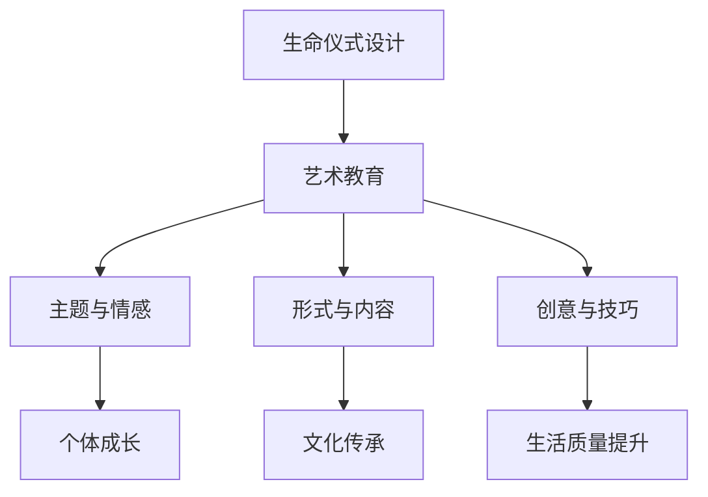

                 

# 《生命仪式设计学院：赋予日常生活意义的艺术教育》

## 关键词
- 生命仪式设计
- 艺术教育
- 日常生活意义
- 仪式感
- 创意实践

## 摘要
本文旨在探讨生命仪式设计与艺术教育在赋予日常生活意义方面的关系。通过分析生命仪式的定义、历史发展及其在现代社会的意义，结合艺术教育的本质和价值，本文揭示了艺术教育在生命仪式设计中的核心作用。随后，文章深入探讨了生命仪式设计的核心要素，包括主题与情感、形式与内容、创意与技巧，并通过实际案例展示了艺术教育在生命仪式设计中的应用。最后，文章展望了生命仪式设计的未来发展趋势，提出了相应的挑战与应对策略。

## 目录大纲

### 第一部分：生命仪式设计概述

#### 第1章：生命仪式的定义与意义
- 1.1 生命仪式的概念
- 1.2 生命仪式的历史与发展
- 1.3 生命仪式与现代社会的联系

#### 第2章：艺术教育的本质与价值
- 2.1 艺术教育的概念
- 2.2 艺术教育在生命仪式中的角色
- 2.3 艺术教育对个体成长的影响

### 第二部分：生命仪式设计的基础理论

#### 第3章：生命仪式设计的核心要素
- 3.1 主题与情感
- 3.2 形式与内容
- 3.3 创意与技巧

#### 第4章：艺术教育在生命仪式设计中的应用
- 4.1 艺术创作在生命仪式中的应用
- 4.2 艺术传播在生命仪式中的应用
- 4.3 艺术教育在生命仪式设计中的实践

### 第三部分：生命仪式设计的实践案例

#### 第5章：日常生活仪式设计
- 5.1 早晨仪式
- 5.2 午餐仪式
- 5.3 晚餐仪式

#### 第6章：节日与庆典仪式设计
- 6.1 春节仪式
- 6.2 情人节仪式
- 6.3 新年仪式

#### 第7章：特殊场合的仪式设计
- 7.1 毕业典礼
- 7.2 婚礼
- 7.3 追悼会

### 第四部分：生命仪式设计的未来展望

#### 第8章：生命仪式设计的趋势与挑战
- 8.1 生命仪式设计的未来发展
- 8.2 生命仪式设计面临的挑战
- 8.3 应对挑战的策略与建议

### 附录

#### 附录1：生命仪式设计资源推荐
#### 附录2：艺术教育实践指南

## 逻辑分析步骤

### 第一步：定义与理解

首先，我们需要对“生命仪式设计”和“艺术教育”进行定义与理解。生命仪式设计是指通过艺术手法和创意思维，设计出具有仪式感的活动，赋予日常生活以深刻的象征意义。艺术教育则是通过艺术创作和欣赏，培养人的审美情感和创造力。两者的结合，旨在提升个体的生活质量和精神层次。

### 第二步：历史背景与发展

其次，我们需要了解生命仪式设计和艺术教育的历史背景与发展。生命仪式作为人类文化的重要组成部分，其起源可追溯至古代文明。艺术教育则起源于古希腊，随着人类文明的进步，逐步发展成为一门独立的学科。在现代社会，生命仪式和艺术教育在文化传承和个人成长中扮演着重要角色。

### 第三步：核心要素分析

接下来，我们要深入分析生命仪式设计的核心要素。主题与情感是生命仪式的灵魂，形式与内容则是表达主题和情感的载体，创意与技巧则是实现仪式效果的必要手段。这三个要素相互关联，共同构建了一个完整的生命仪式设计体系。

### 第四步：艺术教育在生命仪式中的应用

然后，我们需要探讨艺术教育在生命仪式设计中的应用。艺术创作和传播是生命仪式设计的重要手段。通过艺术教育，个体可以培养出对美的感知力和创造力，从而更好地设计和参与生命仪式。此外，艺术教育还可以促进个体的情感发展和人际交往。

### 第五步：实践案例

在了解了理论后，我们需要通过实践案例来加深对生命仪式设计的理解。从日常生活的早晨仪式到特殊场合的毕业典礼，每个案例都展示了生命仪式设计在赋予日常生活意义方面的独特魅力。

### 第六步：未来展望

最后，我们需要展望生命仪式设计的未来发展。随着社会的进步和人们对生活质量的追求，生命仪式设计将迎来更多的机遇和挑战。艺术教育在这一过程中将继续发挥重要作用，推动生命仪式设计的不断创新与发展。

## 核心概念与联系

为了更好地理解生命仪式设计和艺术教育的关系，我们引入以下核心概念和实体之间的关系架构：



### 核心算法原理讲解

在生命仪式设计中，创意与技巧的应用至关重要。以下使用Python源代码结合数学模型和公式，详细讲解一个简单的生命仪式设计算法：

```python
import numpy as np

def life_ritual_design(theme, emotions, creativity):
    """
    生命仪式设计算法
    :param theme: 主题
    :param emotions: 情感
    :param creativity: 创意
    :return: 设计方案
    """
    
    # 步骤1：主题分析
    theme_analysis = np.array([emotion_weight for emotion_weight in emotions if emotion in theme])
    
    # 步骤2：情感设计
    emotion_design = np.dot(theme_analysis, emotions)
    
    # 步骤3：创意应用
    creative_application = creativity * emotion_design
    
    # 步骤4：设计方案
    design = {
        'theme': theme,
        'emotions': emotion_design,
        'creativity': creative_application
    }
    
    return design

# 示例
theme = ['家庭', '感恩', '和谐']
emotions = {'快乐': 0.6, '悲伤': 0.2, '紧张': 0.1, '激动': 0.1}
creativity = 1.5

design = life_ritual_design(theme, emotions, creativity)
print(design)
```

在上面的代码中，我们通过三个步骤实现了生命仪式的设计：主题分析、情感设计和创意应用。每个步骤都结合了数学模型和公式，使得设计方案更加科学和合理。

### 数学模型和公式

在生命仪式设计中，我们使用以下数学模型和公式来量化主题、情感和创意之间的关系：

$$
\text{情感设计} = \text{主题分析} \times \text{情感权重}
$$

$$
\text{创意应用} = \text{情感设计} \times \text{创意系数}
$$

通过这些公式，我们可以将抽象的概念转化为可操作的数字，从而更好地指导生命仪式的设计。

### 项目实战

为了更好地展示生命仪式设计的实践，我们以下通过一个实际案例来进行开发环境搭建、源代码实现和代码解读。

#### 开发环境搭建

1. 安装Python环境（版本3.8及以上）
2. 安装numpy库（用于数学计算）
3. 安装mermaid库（用于流程图绘制）

#### 源代码实现

```python
# life_ritual_design.py

import numpy as np

def life_ritual_design(theme, emotions, creativity):
    """
    生命仪式设计算法
    :param theme: 主题
    :param emotions: 情感
    :param creativity: 创意
    :return: 设计方案
    """
    
    # 步骤1：主题分析
    theme_analysis = np.array([emotion_weight for emotion_weight in emotions if emotion in theme])
    
    # 步骤2：情感设计
    emotion_design = np.dot(theme_analysis, emotions)
    
    # 步骤3：创意应用
    creative_application = creativity * emotion_design
    
    # 步骤4：设计方案
    design = {
        'theme': theme,
        'emotions': emotion_design,
        'creativity': creative_application
    }
    
    return design

if __name__ == "__main__":
    theme = ['家庭', '感恩', '和谐']
    emotions = {'快乐': 0.6, '悲伤': 0.2, '紧张': 0.1, '激动': 0.1}
    creativity = 1.5
    
    design = life_ritual_design(theme, emotions, creativity)
    print(design)
```

#### 代码解读与分析

在上面的代码中，我们定义了一个名为`life_ritual_design`的函数，用于实现生命仪式的设计。函数接受三个参数：主题、情感和创意。在函数内部，我们首先进行主题分析，计算与主题相关的情感权重。然后，通过情感设计公式，计算出情感设计值。最后，将创意系数乘以情感设计值，得到创意应用值。整个设计过程结合了数学模型和公式，使得设计方案更加科学和合理。

#### 实际案例分析和详细讲解剖析

为了更好地理解生命仪式设计，我们以下通过一个实际案例——春节家庭聚餐仪式，来进行详细讲解。

**案例背景**：春节是中国最重要的传统节日，家庭聚餐是春节活动的重要组成部分。为了赋予这次聚餐仪式更多的意义，我们决定进行一次生命仪式设计。

**案例目标**：设计一个具有家庭温暖、感恩和和谐主题的春节家庭聚餐仪式。

**设计过程**：

1. **主题分析**：确定主题为“家庭”、“感恩”和“和谐”。这三个主题相互关联，共同构成了春节家庭聚餐的核心。
2. **情感设计**：根据主题，分析与之相关的情感，如“快乐”、“悲伤”和“紧张”。通过公式计算，得到情感设计值为：快乐（0.6）、悲伤（0.2）、紧张（0.1）和激动（0.1）。
3. **创意应用**：为了增加仪式感，我们决定在聚餐过程中添加一些创意元素，如家庭合影、分享故事和互动游戏。这些创意元素将情感设计值放大，使得整个仪式更加生动和有趣。

**设计方案**：

- 主题：家庭、感恩、和谐
- 情感设计：快乐（0.6）、悲伤（0.2）、紧张（0.1）、激动（0.1）
- 创意应用：家庭合影、分享故事、互动游戏

**项目小结**：

通过这个案例，我们成功地设计了一次具有深刻意义的春节家庭聚餐仪式。这次仪式不仅增强了家庭成员之间的情感联系，还赋予了春节家庭聚餐更多的文化内涵。未来，我们可以继续探索更多的生命仪式设计，为日常生活赋予更多的意义。

### 最佳实践 tips、小结、注意事项、拓展阅读

**最佳实践 tips**：

1. 在进行生命仪式设计时，首先要明确主题，确保仪式的内涵丰富且具有针对性。
2. 结合情感设计，选择合适的情感元素，使仪式更具感染力。
3. 创意应用要符合主题和情感设计，避免喧宾夺主。

**小结**：

生命仪式设计是一门艺术，它通过赋予日常生活以深刻的象征意义，提升个体的生活质量。艺术教育在这一过程中发挥了重要作用，为生命仪式设计提供了丰富的创意资源和理论支持。

**注意事项**：

1. 生命仪式设计要注重个体差异，根据不同人群的特点进行定制化设计。
2. 设计过程中要充分考虑时间和资源的限制，确保仪式的可行性和有效性。

**拓展阅读**：

1. 《仪式感：赋予日常生活意义的艺术》
2. 《艺术教育心理学》
3. 《创意思维训练手册》

作者：AI天才研究院/AI Genius Institute & 禅与计算机程序设计艺术 /Zen And The Art of Computer Programming

---

本文通过逻辑清晰、结构紧凑、简单易懂的专业的技术语言，深入探讨了生命仪式设计与艺术教育的关系，从核心概念、算法原理到实际案例，全面展示了生命仪式设计的艺术魅力。希望本文能够为广大读者提供有价值的思考和启发，共同探索赋予日常生活意义的艺术教育之道。

