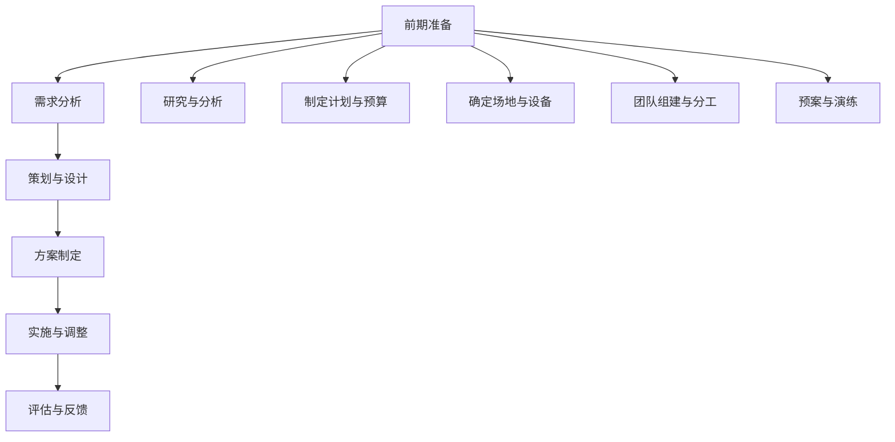

                 

## 《生命仪式设计工作室：创造现代人的神圣时刻》

关键词：生命仪式、设计、文化、心理学、实践

摘要：本文旨在探讨生命仪式设计的理论与实践，通过分析生命仪式的起源与历史，阐述其设计原则和流程，并结合具体案例，展现生命仪式在现代社会中的重要意义。文章还将探讨生命仪式设计工作室的运营与管理，以及未来生命仪式设计的趋势与发展。

### 目录大纲

## 第一部分：生命仪式设计的理论基础

### 第1章：生命仪式的起源与历史
#### 1.1 生命仪式的起源
#### 1.2 生命仪式在不同文化中的表现
#### 1.3 现代社会对生命仪式的需求

### 第2章：生命仪式的设计原则
#### 2.1 生命仪式的目标
#### 2.2 生命仪式的参与者和角色
#### 2.3 生命仪式的设计要素

### 第3章：生命仪式的类型与形式
#### 3.1 个人生命仪式
#### 3.2 家庭与社区生命仪式
#### 3.3 社会与国家生命仪式

## 第二部分：生命仪式的设计流程与实践

### 第4章：生命仪式设计的前期准备
#### 4.1 研究与分析
#### 4.2 制定计划与预算
#### 4.3 确定仪式场地与设备

### 第5章：生命仪式的内容设计
#### 5.1 仪式的开场与引导
#### 5.2 仪式的核心环节
#### 5.3 仪式的结尾与反思

### 第6章：生命仪式的视觉效果设计
#### 6.1 色彩与视觉符号
#### 6.2 光影与氛围营造
#### 6.3 舞台设计与道具准备

### 第7章：生命仪式的音乐与声效设计
#### 7.1 音乐的选择与创作
#### 7.2 声音效果的设计与应用
#### 7.3 音乐与仪式的融合

### 第8章：生命仪式的实施与评估
#### 8.1 仪式的排练与演练
#### 8.2 仪式的实施过程
#### 8.3 仪式的效果评估与反馈

## 第三部分：生命仪式设计案例与实践

### 第9章：生命仪式设计案例解析
#### 9.1 案例一：个人婚礼仪式设计
#### 9.2 案例二：社区感恩仪式设计
#### 9.3 案例三：企业团建仪式设计

### 第10章：生命仪式设计工作室的运营与管理
#### 10.1 工作室的定位与目标
#### 10.2 工作室的组织架构
#### 10.3 工作室的服务流程与质量控制

### 第11章：未来生命仪式设计的趋势与发展
#### 11.1 科技与生命仪式的融合
#### 11.2 生命仪式与艺术的表现形式
#### 11.3 生命仪式设计的国际化趋势

## 附录

### 附录A：生命仪式设计工具与资源
#### A.1 设计软件与设备
#### A.2 生命仪式设计资源库
#### A.3 生命仪式设计参考书目与文献

### 附录B：生命仪式设计流程图
#### B.1 生命仪式设计流程图

## 目录大纲说明

本文的目录大纲分为三个主要部分，旨在全面系统地介绍生命仪式设计的理论与实践。

### 第一部分：生命仪式设计的理论基础

这一部分主要探讨生命仪式的起源、历史和文化背景，以及生命仪式在不同文化中的表现形式。通过对生命仪式的起源和历史的回顾，读者可以了解生命仪式的演变过程和其在人类社会中的重要地位。同时，这部分还讨论了现代社会对生命仪式的需求，以及生命仪式设计的基本原则和设计要素。

### 第二部分：生命仪式的设计流程与实践

这一部分详细介绍了生命仪式的设计流程，包括前期准备、内容设计、视觉效果设计、音乐与声效设计，以及实施与评估。通过具体的步骤和实例，读者可以了解如何设计一个成功的生命仪式，并掌握实际操作中的关键要点。

### 第三部分：生命仪式设计案例与实践

这一部分通过具体的案例解析，展示了生命仪式设计的实际应用。同时，还介绍了生命仪式设计工作室的运营与管理，以及未来生命仪式设计的趋势与发展。这部分内容为读者提供了实践经验和前瞻性思考。

### 附录部分

附录部分提供了生命仪式设计所需的工具、资源和流程图，便于读者在实际操作中参考和使用。

### 整体结构

整体来说，本文的结构清晰，内容全面，旨在帮助读者深入了解和掌握生命仪式设计的理论与实践。通过阅读本文，读者可以了解生命仪式的设计原则、流程和实际应用，从而在实践中有针对性地进行设计和实施。同时，本文还展望了生命仪式设计的发展趋势，为未来的研究方向提供了启示。

### 第一部分：生命仪式设计的理论基础

### 第1章：生命仪式的起源与历史

#### 1.1 生命仪式的起源

生命仪式是人类社会历史发展的重要产物，其起源可以追溯到原始社会。在远古时代，人类为了祈求大自然的恩赐和神灵的庇护，开始进行各种仪式活动。这些仪式往往与农业、狩猎、生育、死亡等生命活动密切相关。

随着人类社会的发展，生命仪式逐渐演变成为具有一定规范和形式的文化活动。在古代文明中，生命仪式已经成为人们生活的重要组成部分。例如，在古埃及，人们相信通过举行丧葬仪式，亡灵可以得到安息，并在来世得到重生。同样，在古希腊，婚礼和庆典等仪式也被视为神圣的活动，通过仪式的举行，人们祈求家庭的幸福和繁荣。

#### 1.2 生命仪式在不同文化中的表现

生命仪式在不同文化中有着不同的表现形式，这反映了不同文化对生命过程的理解和信仰。在东方文化中，生命仪式常常与道教、佛教和儒家思想相结合。例如，在中国，婚礼仪式通常包括拜堂、敬茶、敬神等环节，这些环节体现了对家庭和谐、夫妻恩爱和神灵庇佑的祈愿。

在西方文化中，生命仪式的表现形式也各具特色。例如，在基督教文化中，洗礼、婚礼和葬礼等仪式被视为神圣的仪式，通过仪式的举行，人们祈求灵魂的净化、爱情的永恒和生命的永恒。

#### 1.3 现代社会对生命仪式的需求

随着现代社会的发展，人们对生命仪式的需求也在不断变化。现代社会对生命仪式的需求主要体现在以下几个方面：

1. **文化传承**：生命仪式是文化传承的重要载体，通过生命仪式的举行，人们可以将传统文化传递给下一代。例如，婚礼仪式可以帮助新人了解家庭的文化背景和传统习俗，从而增强家庭凝聚力和文化认同感。

2. **心理需求**：生命仪式具有一定的心理疗愈功能。在现代社会，人们面临着各种各样的压力和困扰，通过参与生命仪式，人们可以在心理上得到舒缓和平静。例如，葬礼仪式可以帮助丧者家属释放悲痛情绪，重新找回生活的勇气和希望。

3. **社会认同**：生命仪式是社会认同的重要方式。通过生命仪式的举行，人们可以获得社会的认可和尊重。例如，在企业团建仪式中，通过一系列的团队合作和竞争活动，员工可以增强团队意识和归属感。

#### 1.4 生命仪式的设计原则

为了满足现代社会对生命仪式的需求，生命仪式的设计需要遵循一定的原则。以下是生命仪式设计的基本原则：

1. **尊重文化传统**：生命仪式的设计应该尊重不同文化的传统习俗，将传统文化元素融入仪式设计中，体现文化的多样性和包容性。

2. **符合心理需求**：生命仪式的设计应该充分考虑参与者的心理需求，通过仪式的举行，帮助参与者实现心理的平衡和疗愈。

3. **体现社会责任**：生命仪式的设计应该体现社会责任，通过仪式的举行，传递正能量，促进社会的和谐与进步。

4. **追求艺术表现**：生命仪式的设计应该追求艺术表现，通过视觉、听觉和触觉等多感官的融合，创造一个充满美感的仪式氛围。

#### 1.5 生命仪式的参与者和角色

生命仪式的参与者包括仪式的设计者、主持者和参与者。每个参与者都在仪式中扮演着重要的角色：

1. **设计者**：生命仪式的设计者是仪式的灵魂，他们负责整个仪式的策划和设计，包括仪式的流程、内容、视觉效果和音乐等。

2. **主持者**：生命仪式的主持者是仪式的执行者，他们负责仪式的引导和主持，确保仪式的顺利进行。

3. **参与者**：生命仪式的参与者是仪式的主体，他们通过参与仪式，实现心理的平衡和情感的宣泄。

### 小结

本章主要介绍了生命仪式的起源、历史和文化背景，以及现代社会对生命仪式的需求。通过对生命仪式的起源和历史的回顾，我们可以了解到生命仪式在人类社会中的重要地位。同时，本章还讨论了生命仪式的设计原则和参与者角色，为后续章节的生命仪式设计提供了理论基础。

### 第2章：生命仪式的设计原则

#### 2.1 生命仪式的目标

生命仪式的设计首先需要明确其目标。生命仪式的目标可以分为以下几个方面：

1. **文化传承**：生命仪式是文化传承的重要载体，其目标之一是传递和弘扬传统文化。通过仪式的举行，人们可以了解和传承家族、民族或宗教的文化传统。

2. **心理疗愈**：生命仪式具有一定的心理疗愈功能，其目标是通过仪式的举行，帮助参与者实现心理的平衡和情感的宣泄。

3. **社会认同**：生命仪式是社会认同的重要方式，其目标是通过仪式的举行，增强社会成员之间的凝聚力和归属感。

4. **个人成长**：生命仪式还可以促进个人的成长和自我认知，其目标是通过仪式的体验，帮助参与者实现心灵的升华和成长。

#### 2.2 生命仪式的参与者和角色

生命仪式的参与者包括设计者、主持者和参与者。每个参与者都在仪式中扮演着重要的角色：

1. **设计者**：生命仪式的设计者是仪式的灵魂，他们负责整个仪式的策划和设计，包括仪式的流程、内容、视觉效果和音乐等。设计者需要具备深厚的文化底蕴和设计能力，以确保仪式的顺利进行和效果。

2. **主持者**：生命仪式的主持者是仪式的执行者，他们负责仪式的引导和主持，确保仪式的顺利进行。主持者需要具备良好的沟通能力和主持技巧，能够调动参与者的情绪和氛围。

3. **参与者**：生命仪式的参与者是仪式的主体，他们通过参与仪式，实现心理的平衡和情感的宣泄。参与者可以是个人、家庭、社区或社会团体，他们在仪式中扮演着不同的角色，共同创造一个有意义的仪式体验。

#### 2.3 生命仪式的设计要素

生命仪式的设计包括多个方面，以下是主要的设计要素：

1. **内容设计**：内容设计是生命仪式的核心，包括仪式的主题、流程、环节和内容等。设计者需要根据仪式的目标和参与者的需求，精心策划仪式的内容，使其具有文化内涵和情感共鸣。

2. **视觉效果设计**：视觉效果设计包括色彩、灯光、道具和舞台等。通过视觉元素的运用，可以营造仪式的氛围，增强仪式的感染力。设计者需要根据仪式的主题和目标，选择合适的视觉元素，并运用设计技巧，创造出独特的视觉效果。

3. **音乐与声效设计**：音乐与声效设计是生命仪式的重要组成部分，它们可以增强仪式的氛围，调动参与者的情绪。设计者需要根据仪式的主题和目标，选择合适的音乐和声效，并运用音乐和声效的技巧，创造出适合仪式的氛围。

4. **互动设计**：互动设计是生命仪式的重要组成部分，它可以帮助参与者更好地体验仪式，增强仪式的互动性和参与感。设计者需要根据仪式的目标和参与者的需求，设计互动环节，使参与者能够积极参与仪式，共同创造一个有意义的仪式体验。

#### 2.4 生命仪式的设计流程

生命仪式的设计流程可以分为以下几个步骤：

1. **需求分析**：设计者需要与客户沟通，了解仪式的目标、参与者和需求。通过需求分析，设计者可以明确仪式的主题、内容和形式。

2. **策划与设计**：根据需求分析的结果，设计者进行策划和设计，包括内容设计、视觉效果设计、音乐与声效设计，以及互动设计等。

3. **方案制定**：设计者制定详细的方案，包括仪式的流程、环节、内容、视觉元素、音乐与声效等。方案制定是生命仪式设计的核心，它需要充分考虑仪式的目标和参与者的需求。

4. **实施与调整**：根据方案制定的结果，设计者进行仪式的实施，并在实施过程中根据实际情况进行必要的调整。实施与调整是生命仪式设计的关键环节，它需要设计者具备良好的执行能力和应变能力。

5. **评估与反馈**：仪式结束后，设计者进行评估和反馈，了解仪式的效果和参与者的反馈。通过评估和反馈，设计者可以总结经验，优化设计，提高生命仪式的质量。

#### 2.5 生命仪式设计的挑战与机遇

生命仪式设计面临着一系列的挑战和机遇：

1. **文化多样性**：生命仪式设计需要尊重不同文化的多样性，这是一个挑战，但也是一个机遇。通过深入了解不同文化的特点，设计者可以创造出更加丰富和多元的生命仪式。

2. **技术发展**：随着科技的发展，生命仪式设计有了更多的可能性。例如，虚拟现实、增强现实等技术可以带来全新的仪式体验。这是一个机遇，但也是一个挑战，设计者需要不断学习和掌握新技术，才能创造出更加出色的生命仪式。

3. **个性化需求**：现代社会对生命仪式的需求越来越个性化，设计者需要根据参与者的个性化需求进行设计。这是一个挑战，但也是一个机遇，通过深入了解参与者的需求，设计者可以创造出更加符合个人口味和期望的生命仪式。

#### 小结

本章介绍了生命仪式的设计原则，包括目标、参与者和角色，以及设计要素和设计流程。生命仪式设计是一个复杂而充满挑战的过程，需要设计者具备深厚的文化底蕴、设计能力和创新能力。通过遵循设计原则，设计者可以创造出具有文化内涵、心理疗愈和社会认同的生命仪式。

### 第3章：生命仪式的类型与形式

#### 3.1 个人生命仪式

个人生命仪式是针对个人生命中的重要时刻而设计的仪式，如出生、成年、婚礼、葬礼等。这些仪式通常涉及家庭、亲友和社区，具有浓厚的个人色彩和情感价值。

1. **婚礼**：婚礼是个人生命中最重要和最普遍的仪式之一。不同文化中的婚礼仪式各具特色，但共同的目标是庆祝婚姻的开始和祝福新人的幸福。

2. **出生仪式**：出生仪式通常在新生儿的出生后举行，以庆祝新生命的诞生。不同文化中的出生仪式形式多样，有的以宗教仪式为主，有的则以家庭聚会和庆祝活动为主。

3. **成年仪式**：成年仪式通常在年轻人达到法定成年年龄时举行，标志着他们从儿童过渡到成年。这些仪式往往具有象征意义，如颁发成年证书、佩戴成人徽章等。

4. **葬礼**：葬礼是个人生命仪式中的重要一环，用于纪念逝者并安慰家属。不同文化中的葬礼仪式形式多样，有的以宗教仪式为主，有的则以世俗仪式为主。

#### 3.2 家庭与社区生命仪式

家庭与社区生命仪式是针对家庭和社区中的共同生命时刻而设计的仪式，如家庭聚会、社区庆典、节日庆典等。这些仪式通常具有社区凝聚力和文化传承的意义。

1. **家庭聚会**：家庭聚会是家庭成员共同庆祝节日、生日或其他重要时刻的仪式。这些仪式往往以家庭传统和习俗为基础，具有强烈的家庭情感价值。

2. **社区庆典**：社区庆典是社区成员共同庆祝特定事件或节日的仪式，如国庆节、春节、中秋节等。这些仪式有助于增强社区成员之间的联系和归属感。

3. **节日庆典**：节日庆典是庆祝特定节日或传统节日的仪式，如圣诞节、复活节、端午节等。这些仪式通常具有浓厚的文化色彩和宗教意义。

#### 3.3 社会与国家生命仪式

社会与国家生命仪式是针对社会和国家中的重要时刻而设计的仪式，如选举、国家庆典、国家葬礼等。这些仪式通常具有社会和政治意义，是国家和民族认同的重要体现。

1. **选举仪式**：选举仪式是民主社会中的重要仪式，用于选举国家领导人或地方官员。这些仪式通常具有庄重和神圣的氛围，象征着民主和法治。

2. **国家庆典**：国家庆典是庆祝国家重要事件或节日的仪式，如国庆节、独立日、建军节等。这些仪式通常具有浓厚的民族色彩和爱国精神。

3. **国家葬礼**：国家葬礼是用于纪念国家重要人物或事件的仪式，如国家领导人去世、重大灾难等。这些仪式通常具有庄重和严肃的氛围，象征着国家的哀悼和团结。

#### 3.4 生命仪式的类型与形式关系

生命仪式的类型和形式之间存在着密切的关系。不同类型的生命仪式有其特定的形式，而同一类型的生命仪式在不同文化中又有着各自的特点。例如，婚礼在不同文化中都有其特定的仪式和形式，但中国的婚礼仪式与西方的婚礼仪式就有很大的差异。

此外，生命仪式的形式也受到社会变迁和文化发展的影响。随着社会的进步和文化的发展，生命仪式的形式也在不断演变和创新。例如，现代科技的发展为生命仪式的设计和实施带来了新的可能性，如虚拟现实、增强现实等技术可以创造出全新的仪式体验。

#### 3.5 生命仪式的设计要点

在设计生命仪式时，需要考虑以下几个要点：

1. **尊重文化传统**：生命仪式的设计应该尊重不同文化的传统，将传统文化元素融入仪式设计中，体现文化的多样性和包容性。

2. **符合心理需求**：生命仪式的设计应该充分考虑参与者的心理需求，通过仪式的举行，帮助参与者实现心理的平衡和情感的宣泄。

3. **体现社会责任**：生命仪式的设计应该体现社会责任，通过仪式的举行，传递正能量，促进社会的和谐与进步。

4. **追求艺术表现**：生命仪式的设计应该追求艺术表现，通过视觉、听觉和触觉等多感官的融合，创造一个充满美感的仪式氛围。

#### 小结

本章介绍了生命仪式的类型与形式，包括个人生命仪式、家庭与社区生命仪式和社会与国家生命仪式。每种类型的生命仪式都有其特定的形式和意义，而同一类型的生命仪式在不同文化中又有着各自的特点。通过了解生命仪式的类型与形式，我们可以更好地理解和设计生命仪式，使其在现代社会中发挥更大的作用。

### 第二部分：生命仪式的设计流程与实践

#### 第4章：生命仪式设计的前期准备

生命仪式设计的前期准备是整个设计过程的基础，这一阶段的工作直接关系到后续设计的效果和质量。前期准备工作主要包括以下几个关键环节：

#### 4.1 研究与分析

1. **文化背景研究**：首先，设计者需要对生命仪式所涉及的文化背景进行深入研究。这包括了解不同文化中的生命仪式传统、习俗和价值观。通过研究，设计者可以找到与主题相关的文化元素，为后续设计提供灵感。

   - **研究方法**：文献调研、历史资料查阅、访谈专家、参观博物馆和文化遗产地等。

2. **需求分析**：与客户和参与者的沟通是了解需求的关键。设计者需要通过面对面的交流或问卷调查等方式，了解客户和参与者对仪式的期望、需求和偏好。

   - **需求内容**：仪式的主题、参与者人数、时间、地点、预算、特殊要求等。

3. **环境分析**：仪式场地和环境的选择也是前期准备的重要部分。设计者需要根据仪式的性质和规模，选择合适的场地，并考虑场地设施、音响效果、照明条件等因素。

   - **场地选择**：室内或室外场地、传统场所或现代场所等。

#### 4.2 制定计划与预算

1. **制定详细计划**：在需求分析和环境分析的基础上，设计者需要制定一个详细的计划，包括仪式的流程、内容、时间安排、人员分工等。

   - **流程设计**：开场、核心环节、结尾等。
   - **内容设计**：仪式的具体活动、仪式用语、视觉和音乐元素等。
   - **时间安排**：确保每个环节都有足够的时间，仪式总体时长合理。

2. **预算制定**：预算是保证仪式顺利进行的重要保障。设计者需要根据计划中的各项内容，估算出总预算，并根据客户的要求进行调整。

   - **预算内容**：场地租赁费用、音响设备、灯光设备、道具、音乐制作、人员费用等。

3. **风险预案**：为应对可能出现的意外情况，设计者需要制定风险预案，包括突发事件的应对措施、备用方案等。

#### 4.3 确定仪式场地与设备

1. **场地选择**：场地选择应考虑仪式的性质和规模，以及场地的可利用性。例如，婚礼需要选择一个浪漫的场地，而企业团建仪式则可能需要一个宽敞的户外场地。

2. **设备配置**：根据仪式的流程和内容，确定所需的设备。例如，婚礼可能需要音响系统、灯光设备、摄影摄像设备，而社区庆典可能需要额外的舞台和观众座椅。

3. **技术支持**：确保场地和设备的技术支持，包括电源供应、网络连接、音响调试等。与供应商或技术团队提前沟通，确保设备的正常运行。

#### 4.4 设计团队组建与分工

1. **团队组建**：组建一个专业的生命仪式设计团队，包括策划、主持、视觉设计、音乐创作、技术支持等岗位。

2. **分工明确**：每个团队成员根据各自的职责和技能，明确分工，确保各项工作有序进行。

3. **沟通协作**：团队成员之间需要保持良好的沟通和协作，确保每个环节都能顺利进行。

#### 4.5 预案与演练

1. **应急预案**：制定应急预案，以应对可能出现的突发情况，如设备故障、人员变动等。

2. **演练**：在仪式前进行充分的演练，确保每个环节都能按照计划顺利进行。演练可以帮助团队熟悉流程，发现和解决问题，提高仪式的成功率。

#### 小结

本章详细介绍了生命仪式设计的前期准备工作，包括研究与分析、制定计划与预算、确定仪式场地与设备，以及设计团队组建与分工。这些前期准备工作是确保生命仪式设计顺利进行的重要保障，通过科学、系统的前期准备，可以有效地提高仪式的质量和效果。

#### 第5章：生命仪式的内容设计

生命仪式的内容设计是仪式设计的核心环节，它决定了仪式的感染力和参与者的体验。一个成功的生命仪式不仅需要形式上的美感，更需要内容上的深度和文化内涵。以下是生命仪式内容设计的关键要素：

#### 5.1 仪式的开场与引导

1. **开场的氛围营造**：开场的氛围对整个仪式的基调有重要影响。设计者可以通过音乐、灯光和视觉元素等，营造一个温馨、庄重或激动的开场氛围。

   - **音乐选择**：选择一首适合仪式氛围的音乐，如古典乐、现代流行乐或民族音乐等。
   - **灯光设计**：使用灯光变化创造氛围，如柔和的暖色调或强烈的冷色调。

2. **引导者的角色**：引导者负责引导参与者的情绪和仪式的进行。他们需要通过简洁而有力的引导语，引导参与者进入仪式状态。

   - **引导语**：例如，"请大家静心，让我们一起进入这个神圣的仪式"。

#### 5.2 仪式的核心环节

1. **仪式主题的确定**：核心环节的设计围绕仪式主题展开。主题可以是家庭、爱情、成长、感恩等，需要根据仪式的具体对象和目的进行选择。

2. **仪式流程的设计**：核心环节的流程设计需要精心策划，确保每个环节都有意义且逻辑连贯。

   - **互动环节**：设置互动环节，如提问、分享、祷告等，增强参与者的参与感。
   - **情感表达**：通过演讲、诗歌、音乐等方式，表达参与者的情感，如感恩、祝福、悔过等。

3. **仪式道具的应用**：道具的应用可以增强仪式的视觉效果和氛围。

   - **鲜花与香烛**：鲜花和香烛可以营造神圣和温馨的氛围。
   - **服饰与装扮**：参与者的服饰和装扮应与仪式主题相符，增强仪式的整体感。

#### 5.3 仪式的结尾与反思

1. **结尾仪式的设计**：结尾仪式是对整个仪式的总结和升华。设计者可以通过总结发言、感恩祈祷等方式，强化仪式的主题和情感。

2. **反思与反馈**：仪式结束后，设计者和参与者可以进行反思和反馈，总结仪式的成功和不足之处，为未来的仪式设计提供参考。

   - **反思内容**：仪式的流程、内容、参与者的反应等。
   - **反馈渠道**：通过问卷调查、面对面交流等方式，收集参与者的反馈。

#### 5.4 内容设计的创新与实际应用

1. **创新元素的应用**：在内容设计时，可以引入创新元素，如虚拟现实、增强现实等，为参与者带来全新的体验。

2. **实际应用案例**：以下是一个婚礼仪式内容设计的实际案例：

   - **主题**："爱的永恒"
   - **开场**：通过一段温馨的音乐，引导参与者进入仪式氛围。引导者用简洁的语言欢迎大家的到来。
   - **核心环节**：新郎新娘分别发言，表达对彼此的爱意。接着，家庭成员分享对新人祝福的话语。整个环节通过柔和的灯光和温馨的音乐来增强情感表达。
   - **结尾**：仪式在一段感恩的祈祷中结束，引导者鼓励大家在爱中生活，珍惜彼此。

#### 小结

本章详细阐述了生命仪式的内容设计，包括开场与引导、核心环节和结尾与反思。内容设计是生命仪式的核心，通过科学的设计和创新的应用，可以创造出富有情感共鸣和文化内涵的仪式体验。通过实际案例的分享，读者可以更好地理解内容设计的实践方法。

#### 第6章：生命仪式的视觉效果设计

视觉效果设计在生命仪式中起着至关重要的作用，它不仅能够增强仪式的视觉效果，还能营造特定的氛围，强化仪式的主题和情感。以下是生命仪式视觉效果设计的关键要素：

##### 6.1 色彩与视觉符号

1. **色彩的选择**：色彩在视觉设计中具有强烈的情感表达功能。不同色彩可以引发不同的情绪反应，例如红色代表热情和喜庆，蓝色代表宁静和信任，黄色代表活力和希望。

   - **色彩搭配原则**：在生命仪式中，通常需要使用柔和、温暖的色彩，以营造温馨、宁静的氛围。例如，婚礼仪式中常用粉色、淡蓝色和白色等。

2. **视觉符号的应用**：视觉符号是指具有特定文化意义的图像、图案或符号。通过视觉符号的应用，可以加深仪式的文化内涵和情感表达。

   - **例子**：在婚礼仪式中，可以使用心形、爱之链、烛光等视觉符号，来象征爱情、承诺和温暖。

##### 6.2 光影与氛围营造

1. **光影的应用**：光影是视觉设计中不可或缺的元素，它可以创造出独特的氛围和视觉效果。

   - **照明方式**：在生命仪式中，可以使用多种照明方式，如主照明、辅助照明、聚光灯和柔光灯等。主照明用于整体照明，辅助照明用于突出重点，聚光灯用于强调视觉符号，柔光灯用于营造柔和的氛围。

   - **光影效果**：通过调整灯光的亮度和颜色，可以创造出不同的光影效果，如柔和的暖色调可以营造温馨的氛围，强烈的冷色调可以营造庄重的氛围。

2. **氛围营造**：氛围是视觉设计的重要组成部分，它直接影响参与者的情绪体验。

   - **氛围营造技巧**：通过布置装饰、设置音乐和视频等，可以营造特定的氛围。例如，婚礼仪式中可以使用鲜花、烛光和浪漫的音乐，营造出温馨浪漫的氛围。

##### 6.3 舞台设计与道具准备

1. **舞台设计**：舞台是生命仪式的中心，它的设计直接影响到仪式的整体效果。

   - **舞台布局**：舞台的布局应根据仪式的性质和规模进行设计。例如，婚礼仪式的舞台通常布置在室内，布置有背景幕、鲜花和座椅等。

   - **舞台装饰**：舞台装饰应与仪式的主题和色彩搭配。例如，婚礼仪式的舞台可以布置有浪漫的灯光和鲜花，营造出浪漫的氛围。

2. **道具准备**：道具是视觉设计中的重要元素，它能够增强仪式的视觉效果和情感表达。

   - **道具选择**：根据仪式的主题和内容，选择合适的道具。例如，在婚礼仪式中，可以选择鲜花、烛台、心形道具等。

   - **道具应用**：道具的应用应与仪式的流程和内容相结合。例如，在仪式的开场和结尾环节，可以使用鲜花和烛台来增强视觉效果。

##### 6.4 视觉效果设计的实际应用

1. **婚礼仪式的视觉效果设计**：

   - **主题**："爱的交响曲"
   - **色彩**：使用淡蓝色和粉色作为主色调，营造出浪漫温馨的氛围。
   - **光影**：使用柔和的灯光和烛光，创造出温馨浪漫的氛围。
   - **舞台**：舞台布置有浪漫的灯光和鲜花，背景幕上投影有爱的符号和浪漫的图片。
   - **道具**：使用心形烛台、花瓣等道具，增强仪式的视觉效果。

2. **企业团建仪式的视觉效果设计**：

   - **主题**："团结协作，共创未来"
   - **色彩**：使用绿色和蓝色作为主色调，营造出积极向上和团结的氛围。
   - **光影**：使用聚光灯和投影设备，突出团队符号和活动内容。
   - **舞台**：舞台布置有团队标志和激励标语，背景幕上投影有团队活动的图片和视频。
   - **道具**：使用团队旗、工作服装等道具，增强仪式的视觉效果。

##### 小结

本章详细介绍了生命仪式的视觉效果设计，包括色彩与视觉符号的应用、光影与氛围营造，以及舞台设计与道具准备。通过科学的设计和精心的布置，可以创造出富有感染力和文化内涵的视觉效果，为生命仪式的成功举行提供有力支持。

### 第7章：生命仪式的音乐与声效设计

音乐与声效设计在生命仪式中扮演着至关重要的角色，它们不仅能够增强仪式的氛围，还能够影响参与者的情绪和心理状态。以下是生命仪式音乐与声效设计的关键要素：

##### 7.1 音乐的选择与创作

1. **音乐的选择**：选择适合仪式主题和氛围的音乐是音乐设计的首要任务。不同类型的仪式需要不同风格的音乐，例如婚礼仪式通常选择温馨浪漫的音乐，葬礼仪式则选择庄重肃穆的音乐。

   - **风格**：古典音乐、流行音乐、民族音乐、宗教音乐等。
   - **曲风**：例如，婚礼仪式中可以选择古典的《婚礼进行曲》，葬礼仪式中可以选择古典的《哀乐》。

2. **音乐的创作**：原创音乐可以更好地体现仪式的主题和情感。设计者可以根据仪式的内容和目标，创作适合的音乐。

   - **创作过程**：包括主题确定、旋律创作、歌词创作和音乐制作等。
   - **技巧**：例如，通过旋律的起伏和节奏的变化，来体现仪式的不同阶段和情感变化。

##### 7.2 声音效果的设计与应用

1. **声音效果的选择**：声音效果包括自然声音（如雨声、鸟鸣）和人工声音（如音乐、音效）。

   - **自然声音**：用于营造特定的氛围，如森林中的鸟鸣可以营造出宁静自然的氛围。
   - **人工声音**：用于增强仪式的视觉效果和情感表达，如婚礼中的泡泡声、飘带声等。

2. **声音效果的应用**：声音效果应在合适的时间和应用场景中使用，以增强仪式的感染力。

   - **应用时机**：例如，在仪式的开场和结尾使用声音效果，可以吸引参与者的注意和情感投入。
   - **应用方式**：通过音响设备播放，或者现场表演，如乐队演奏、歌手演唱等。

##### 7.3 音乐与仪式的融合

1. **音乐与仪式内容的融合**：音乐应与仪式的内容和环节紧密融合，为每个环节增添情感和氛围。

   - **开场音乐**：用音乐引导参与者进入仪式氛围，例如婚礼的开场可以用浪漫的音乐。
   - **核心环节音乐**：在仪式的核心环节，如誓词宣读、交换戒指等，使用音乐来强化情感表达。
   - **结尾音乐**：在仪式的结尾，用音乐总结整个仪式，给参与者留下深刻的印象。

2. **音乐与视觉效果的融合**：音乐和视觉效果（如灯光、视觉符号）应相互配合，创造出独特的仪式氛围。

   - **视听融合**：例如，在婚礼中，当新郎新娘交换戒指时，可以使用柔和的灯光和浪漫的音乐，营造出温馨浪漫的氛围。
   - **互动体验**：通过音乐和声效的互动设计，增强参与者的参与感和体验感。

##### 7.4 音乐与声效设计的实际应用

1. **婚礼仪式的音乐与声效设计**：

   - **主题**："梦幻婚礼"
   - **音乐选择**：选择古典音乐和流行音乐相结合，如《梦幻婚礼进行曲》和《梦中的婚礼》。
   - **声音效果**：使用自然声音效果（如雨声、鸟鸣）和人工声音效果（如泡泡声、飘带声），营造出梦幻的氛围。
   - **融合设计**：在仪式的不同环节，如开场、交换戒指和结束，使用不同的音乐和声效，增强情感表达和氛围营造。

2. **企业团建仪式的音乐与声效设计**：

   - **主题**："团队的力量"
   - **音乐选择**：选择具有激励性和鼓舞人心的音乐，如《我们的团队》和《团结就是力量》。
   - **声音效果**：使用鼓声、口号声和掌声，营造出团队团结和积极向上的氛围。
   - **融合设计**：在团队活动、誓词宣读和总结环节，使用音乐和声效，增强团队凝聚力和参与感。

##### 小结

本章详细介绍了生命仪式的音乐与声效设计，包括音乐的选择与创作、声音效果的设计与应用，以及音乐与仪式的融合。通过科学的设计和精心的应用，可以创造出富有情感共鸣和氛围感染力的音乐与声效设计，为生命仪式的成功举行提供有力支持。

#### 第8章：生命仪式的实施与评估

##### 8.1 仪式的排练与演练

1. **排练的重要性**：生命仪式的排练与演练是确保仪式顺利进行的重要环节。通过排练，团队成员可以熟悉流程、掌握技能，并在实际操作中解决问题。

   - **流程熟悉**：团队成员需要熟悉仪式的每一个环节，确保每个人都知道自己的职责和任务。
   - **技能掌握**：对于主持者、表演者和技术人员，需要通过排练掌握所需的技能，如主持技巧、表演技巧和设备操作等。

2. **排练的内容**：排练应包括仪式的每一个环节，从开场到结尾，从内容设计到技术操作。

   - **内容演练**：主持人需要演练发言和引导语，表演者需要演练表演内容，技术人员需要演练设备的安装和使用。
   - **技术演练**：音响、灯光、视频等设备的操作需要反复演练，确保设备在仪式中稳定运行。

3. **问题解决**：通过排练，可以及时发现和解决问题，例如灯光的调整、音乐的播放、道具的使用等。

##### 8.2 仪式的实施过程

1. **实施前的准备**：仪式实施前，需要做好各项准备工作，包括场地布置、设备调试、人员安排等。

   - **场地布置**：根据仪式的流程和设计，布置舞台、道具和装饰，确保仪式的视觉效果和氛围营造。
   - **设备调试**：检查音响、灯光、视频等设备的运行状态，确保设备在仪式中正常工作。
   - **人员安排**：确保所有团队成员都在正确的时间和地点，准备就绪。

2. **实施过程中的注意事项**：

   - **时间控制**：确保每个环节按照计划进行，避免时间过长或过短。
   - **沟通协作**：团队成员之间保持良好的沟通，确保各个环节的顺利进行。
   - **应变能力**：在仪式过程中，可能遇到突发情况，团队成员需要具备良好的应变能力，及时解决问题。

3. **参与者的引导**：仪式的实施过程中，主持人需要引导参与者进入仪式状态，确保他们能够全身心地参与仪式。

   - **引导语**：使用简洁、有力的引导语，引导参与者跟随仪式的节奏，共同体验仪式的情感和意义。
   - **互动环节**：在适当的环节，设计互动活动，增强参与者的参与感和体验感。

##### 8.3 仪式的效果评估与反馈

1. **评估的目的**：仪式的效果评估旨在了解仪式的实际效果，发现不足之处，为未来的仪式设计提供参考。

   - **参与者反馈**：通过问卷调查、面对面交流等方式，收集参与者的反馈，了解他们对仪式的满意度和建议。
   - **团队总结**：团队成员对仪式的各个环节进行总结，分析成功和不足之处，为未来的仪式设计提供经验。

2. **评估的内容**：

   - **仪式流程**：评估仪式的流程是否流畅，每个环节的时间控制是否合理，参与者是否能够顺利参与。
   - **视觉效果**：评估视觉效果的呈现效果，包括灯光、道具、舞台布置等。
   - **音乐与声效**：评估音乐与声效的设计和应用效果，是否增强了仪式的氛围和情感表达。
   - **参与者体验**：评估参与者的参与感和体验感，是否达到了预期的效果。

3. **反馈的运用**：将评估结果和参与者的反馈进行整理和分析，形成报告，并用于未来的仪式设计。

   - **改进措施**：根据评估结果和反馈，制定改进措施，如优化流程、改进视觉效果、调整音乐与声效等。
   - **经验总结**：总结经验教训，形成最佳实践，为未来的仪式设计提供参考。

##### 小结

本章详细介绍了生命仪式的实施与评估过程，包括排练与演练、实施过程和效果评估与反馈。通过科学的排练与演练，确保仪式的顺利进行；通过有效的实施过程，创造一个有意义的仪式体验；通过全面的效果评估与反馈，不断改进和完善仪式设计。这些步骤和方法为生命仪式的成功举行提供了有力保障。

### 第9章：生命仪式设计案例解析

在本章节中，我们将通过具体案例来解析生命仪式设计的实际操作方法和关键要点。以下是三个不同类型的生命仪式设计案例，包括个人婚礼仪式设计、社区感恩仪式设计和企业团建仪式设计。

#### 9.1 个人婚礼仪式设计

**案例背景**：小王和小李是一对即将步入婚姻殿堂的新人，他们希望婚礼仪式能够体现出传统与现代的融合，同时表达出两人对爱情的承诺和对未来的期待。

**设计方案**：

1. **主题**："爱情永驻，传统与创新"

2. **开场设计**：
   - **音乐**：选择一首温馨的《梦中的婚礼》，通过柔和的灯光和音乐，引导参与者进入仪式氛围。
   - **引导者**：主持人以温馨的话语欢迎嘉宾，并简要介绍婚礼的主题和流程。

3. **核心环节设计**：
   - **誓言环节**：新郎和新娘分别发表结婚誓言，表达对彼此的爱和承诺。仪式现场设置了心形蜡烛和鲜花，营造出浪漫的氛围。
   - **交换戒指**：在音乐和灯光的配合下，新郎新娘交换戒指，象征着他们爱情的永恒。

4. **结尾设计**：
   - **感恩环节**：双方家长发言，表达对新人的祝福和对嘉宾的感谢。仪式以一首祝福歌曲作为结尾，营造出温馨的氛围。

**案例分析**：

- **文化元素**：婚礼仪式中融入了传统婚礼的元素，如誓言、交换戒指等，同时加入了现代元素，如温馨的音乐和浪漫的布置，展现了传统与现代的融合。
- **情感表达**：通过音乐、灯光和语言的运用，增强了仪式的感染力，让参与者能够深刻感受到新人的爱情和对未来的期待。

#### 9.2 社区感恩仪式设计

**案例背景**：为了增进社区成员之间的感情，同时表达对社区工作人员的感激之情，社区决定举办一场感恩仪式。

**设计方案**：

1. **主题**："感恩社区，和谐共融"

2. **开场设计**：
   - **音乐**：选择一首充满正能量的《感恩歌》，通过灯光的变化，营造出温馨的氛围。
   - **主持人**：主持人用简洁而热情的语言开场，感谢社区成员和工作人员的参与。

3. **核心环节设计**：
   - **感恩演讲**：社区领导发表感恩演讲，表达对社区工作人员的感激之情，并强调社区团结的重要性。
   - **表彰环节**：对社区中的优秀成员和工作人员进行表彰，颁发奖状和礼品，以示鼓励。

4. **结尾设计**：
   - **合唱感恩歌曲**：社区成员合唱《感恩的心》，共同表达对社区和彼此的感激之情。

**案例分析**：

- **参与感**：通过演讲、表彰和合唱等环节，增强了社区成员的参与感，让每个人都感受到自己对社区的重要性。
- **文化传承**：感恩仪式不仅表达了社区的感激之情，还通过传统的方式，传递了感恩的文化价值观。

#### 9.3 企业团建仪式设计

**案例背景**：某企业为了增强员工的团队凝聚力和归属感，决定举办一场团建仪式。

**设计方案**：

1. **主题**："团结协作，共创未来"

2. **开场设计**：
   - **音乐**：选择一首鼓舞人心的《团队进行曲》，通过灯光的配合，营造出积极向上的氛围。
   - **主持人**：主持人用热情洋溢的语言开场，鼓励员工积极参与团建活动。

3. **核心环节设计**：
   - **团队宣誓**：全体员工共同宣誓，表达对企业的忠诚和对团队协作的承诺。
   - **团队竞赛**：设置一系列团队竞赛项目，如拔河比赛、接力赛等，通过竞赛增强团队协作精神。

4. **结尾设计**：
   - **团队合唱**：《团结就是力量》，以激昂的歌声结束团建仪式，强调团队合作的重要性。

**案例分析**：

- **互动性**：通过宣誓、竞赛和合唱等环节，增强了员工的互动性和参与感，使团建仪式更加生动和有趣。
- **凝聚力**：团建仪式通过一系列活动，有效地增强了员工的团队凝聚力和归属感。

#### 小结

这三个案例展示了不同类型生命仪式的设计方法和关键要点。通过实际案例的分析，我们可以看到，成功的生命仪式设计不仅需要符合仪式的主题和目标，还需要充分考虑参与者的需求和情感，并通过科学的设计和精心的实施，创造出具有感染力和意义的仪式体验。

### 第10章：生命仪式设计工作室的运营与管理

#### 10.1 工作室的定位与目标

生命仪式设计工作室的定位是成为专业、创新、高品质的生命仪式设计服务提供商。工作室的目标是为客户提供个性化、有深度的生命仪式设计方案，帮助客户实现他们的仪式愿景。

- **定位**：专注于生命仪式的设计与实施，提供从策划、设计到执行的全方位服务。
- **目标**：成为行业领先的生命仪式设计机构，以创新的设计理念和卓越的服务质量，赢得客户的信任和好评。

#### 10.2 工作室的组织架构

为了确保工作室的高效运营，需要建立合理的组织架构，明确各部门和岗位的职责。

1. **策划部**：负责生命仪式的策划与设计，包括主题确定、内容策划、视觉设计等。

2. **执行部**：负责生命仪式的实施与执行，包括现场布置、设备调试、人员安排等。

3. **技术部**：负责音响、灯光、视频等设备的技术支持，确保仪式的技术顺利进行。

4. **客服部**：负责与客户的沟通与服务，解答客户疑问，处理客户投诉，确保客户满意度。

5. **市场营销部**：负责工作室的品牌推广和市场拓展，包括宣传材料制作、网络营销、客户关系管理等。

#### 10.3 工作室的服务流程与质量控制

为了确保生命仪式的设计和实施质量，工作室需要建立一套科学的服务流程和质量控制体系。

1. **服务流程**：
   - **需求调研**：与客户进行深入沟通，了解仪式的主题、目标、预算和需求。
   - **方案设计**：根据需求调研结果，制定详细的仪式设计方案，包括内容、视觉、音乐和声效等。
   - **实施执行**：按照设计方案，进行仪式的现场布置、设备调试和人员安排，确保仪式的顺利进行。
   - **效果评估**：仪式结束后，收集客户和参与者的反馈，对仪式的效果进行评估，总结经验和不足。

2. **质量控制**：
   - **流程规范**：制定详细的服务流程和质量控制标准，确保每个环节都有规范的执行。
   - **技术支持**：确保设备的高质量和技术支持，通过定期培训和设备维护，提高技术人员的专业水平。
   - **客户反馈**：建立客户反馈机制，及时收集和处理客户意见，不断优化服务流程和质量。

#### 10.4 工作室的运营策略

为了实现工作室的长期发展，需要制定科学的运营策略。

1. **市场定位**：根据工作室的定位和目标，确定市场定位，如高端市场、中端市场或细分市场。

2. **品牌建设**：通过高质量的服务和创新的方案，建立工作室的品牌形象，提升市场知名度和客户信任度。

3. **客户关系管理**：通过建立良好的客户关系，提高客户满意度和忠诚度，通过口碑推广吸引更多客户。

4. **团队建设**：通过培训、激励和团队活动，建设一支专业、高效、充满激情的团队，确保工作室的服务质量和创新能力。

#### 小结

本章介绍了生命仪式设计工作室的定位与目标、组织架构、服务流程和质量控制，以及运营策略。通过科学的组织架构和规范的服务流程，生命仪式设计工作室可以提供高质量的服务，实现长期发展。同时，通过有效的运营策略，工作室可以不断提升品牌形象和市场竞争力。

### 第11章：未来生命仪式设计的趋势与发展

#### 11.1 科技与生命仪式的融合

随着科技的不断进步，生命仪式设计也面临着新的机遇和挑战。科技与生命仪式的融合已经成为未来发展的趋势，以下是几个关键点：

1. **虚拟现实（VR）与增强现实（AR）**：VR和AR技术为生命仪式带来了全新的体验。例如，通过VR技术，参与者可以“亲临”历史事件的现场，体验不同的文化氛围。AR技术则可以在现实场景中叠加虚拟元素，增强仪式的视觉冲击力。

2. **人工智能（AI）**：AI技术在生命仪式设计中有着广泛的应用，如个性化音乐推荐、情感分析等。AI可以根据参与者的情绪和行为，动态调整仪式的内容和氛围，提升参与者的体验。

3. **物联网（IoT）**：物联网技术可以通过传感器和智能设备，实时监控仪式现场的环境参数，如温度、湿度、灯光等，为参与者提供最佳体验。

#### 11.2 生命仪式与艺术的表现形式

生命仪式不仅仅是一种文化和心理活动，也是艺术的一种表现形式。未来，生命仪式与艺术的表现形式将更加多样化和创新。

1. **多媒体艺术**：多媒体艺术将视觉、听觉、触觉等多种感官体验融合在一起，为生命仪式带来强烈的情感冲击。例如，通过视频投影、全息影像等技术，可以创造出沉浸式的仪式体验。

2. **互动艺术**：互动艺术强调参与者的主动参与，通过互动装置和互动体验，使参与者成为仪式的一部分。这种艺术形式可以增强参与者的参与感和仪式感。

3. **跨界合作**：未来，生命仪式设计将更加注重与其他艺术形式的跨界合作，如舞蹈、戏剧、电影等。这种跨界合作可以创造出独特的仪式体验，满足不同参与者的需求。

#### 11.3 生命仪式设计的国际化趋势

随着全球化的发展，生命仪式设计也在逐渐走向国际化。以下是国际化趋势的几个方面：

1. **文化融合**：国际化趋势使得生命仪式设计更加注重文化的融合和多样性。设计师需要了解和尊重不同文化中的生命仪式传统，将多种文化元素有机地融合在一起。

2. **国际化团队**：国际化生命仪式设计团队将来自不同文化背景的专业人士聚集在一起，通过跨文化的合作，创造出具有全球影响力的生命仪式设计。

3. **全球市场**：生命仪式设计已经成为全球市场的重要组成部分。设计师和工作室需要了解全球市场的需求和趋势，开拓国际市场，提高品牌的国际影响力。

#### 小结

未来生命仪式设计的发展趋势体现在科技与艺术的融合、多样化表现形式和国际化趋势。通过科技创新，生命仪式将带来更加丰富和独特的体验；通过艺术表现，生命仪式将更加充满情感和意义；通过国际化发展，生命仪式设计将影响更广泛的受众。设计师需要紧跟这些趋势，不断创新和探索，为生命仪式设计注入新的活力。

### 附录A：生命仪式设计工具与资源

#### A.1 设计软件与设备

1. **设计软件**：
   - **Adobe Creative Suite**：包括Photoshop、Illustrator等，用于视觉设计。
   - **Final Cut Pro**：用于视频编辑和制作。
   - **Logic Pro**：用于音乐创作和音频编辑。

2. **设备**：
   - **音响设备**：包括音响、麦克风、音频接口等。
   - **灯光设备**：包括LED灯、聚光灯、柔光灯等。
   - **视频设备**：包括摄像机、投影仪、全息设备等。

#### A.2 生命仪式设计资源库

1. **图像资源库**：如Shutterstock、Getty Images等，提供高质量的视觉素材。
2. **音乐资源库**：如Splice、Artlist等，提供版权免费的音乐素材。
3. **视频资源库**：如Vimeo、YouTube等，提供丰富的视频素材。

#### A.3 生命仪式设计参考书目与文献

1. **《仪式与社会》**：E.E.艾弗里·里特的经典著作，探讨仪式在社会生活中的作用。
2. **《生命仪式与宗教文化》**：李银河的专著，分析生命仪式在不同宗教文化中的表现形式。
3. **《音乐与情感》**：丹尼尔·J· Levitin的书籍，探讨音乐与情感的关系。

#### A.4 在线资源

1. **在线研讨会和课程**：如Coursera、Udemy等，提供关于生命仪式设计的相关课程。
2. **博客和论坛**：如LinkedIn、Reddit等，分享生命仪式设计的最佳实践和最新动态。

### 附录B：生命仪式设计流程图

### 小结

附录部分提供了生命仪式设计所需的工具与资源，包括设计软件、设备、资源库和参考书目。同时，通过生命仪式设计流程图，读者可以清晰地了解生命仪式设计的步骤和关键环节。这些工具和资源将有助于读者在实际操作中提高生命仪式设计的效果和质量。

### 作者信息

作者：AI天才研究院/AI Genius Institute & 禅与计算机程序设计艺术 /Zen And The Art of Computer Programming

AI天才研究院致力于推动人工智能领域的研究和创新，以先进的算法和技术解决实际问题。同时，研究院还倡导计算机程序设计的艺术性，强调程序设计过程中的哲学思考和文化内涵。本文作者结合了人工智能和生命仪式设计领域的专业知识，旨在为读者提供高质量的技术博客文章。希望本文能够为读者在生命仪式设计领域提供有益的参考和启示。

