                 

# 生命仪式设计课程：赋予日常生活意义的艺术

> 关键词：生命仪式设计、日常生活、意义、艺术、设计原则、流程、类型、形式、技巧、创意、实践、未来、社会价值

> 摘要：
本文旨在探讨生命仪式设计在赋予日常生活意义方面的艺术性。通过对生命仪式设计的基础理论、设计原则与流程、类型与形式、设计技巧与创意、实践案例以及未来发展等方面的深入分析，揭示了生命仪式设计在现代生活中的重要作用和潜在价值。

## 第一部分：生命仪式设计的基础理论

### 第1章：生命仪式设计的概念与起源

#### 1.1 生命仪式的定义与功能

生命仪式是一种以特定形式和程序来表达生命重要时刻的文化活动，它涵盖了从出生到死亡的各个阶段。这些仪式不仅是一种庆祝或悼念的方式，更是一种文化和精神的传承。

**核心概念与联系：**
生命仪式的设计与人类生活的各个阶段紧密相关，其核心概念包括出生、成长、婚姻、死亡等。这些概念之间的关系可以用Mermaid流程图表示：

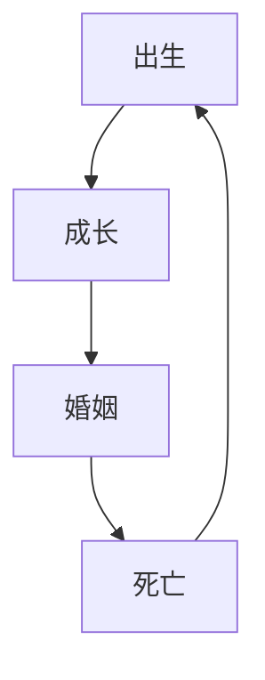

#### 1.2 生命仪式的起源与发展

生命仪式起源于古代社会，随着人类文明的进步，这些仪式逐渐演变，形成了丰富多彩的形式。从古埃及的葬礼到现代的婚礼，生命仪式在不同文化背景下展现出了独特的艺术魅力。

**核心概念与联系：**
生命仪式的起源和发展可以看作是一个文化演化的过程。这个过程可以用Mermaid流程图表示：

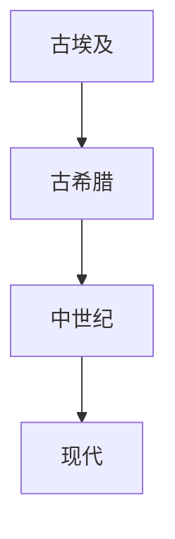

#### 1.3 生命仪式与现代社会的联系

现代社会中，生命仪式仍然扮演着重要角色。随着科技的发展和人们生活节奏的加快，生命仪式的形式和内容也在不断变革，以满足现代人的需求。

**核心概念与联系：**
生命仪式与现代社会的联系可以用以下Mermaid流程图表示：

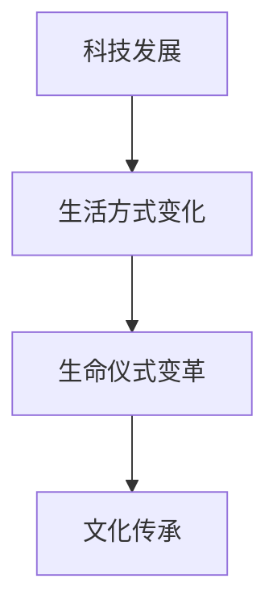

### 第2章：生命仪式的设计原则与流程

#### 2.1 生命仪式的设计原则

生命仪式的设计原则包括个性化、整合性和创新性。这些原则确保了生命仪式既能体现个人的独特性，又能融入社会文化的整体。

**核心概念与联系：**
生命仪式的设计原则之间的关系可以用以下Mermaid流程图表示：

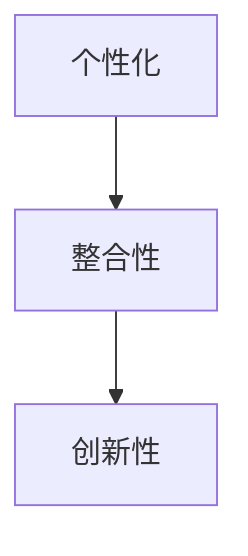

#### 2.2 生命仪式的设计流程

生命仪式的设计流程通常包括需求分析、设计策划、设计实施和设计评估四个阶段。每个阶段都有其独特的任务和目标。

**核心概念与联系：**
生命仪式的设计流程可以用以下Mermaid流程图表示：

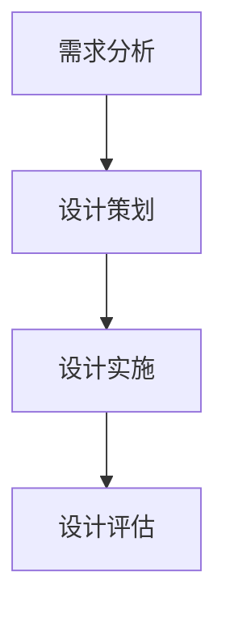

### 第3章：生命仪式的类型与形式

#### 3.1 传统生命仪式的类型

传统生命仪式包括婚礼、丧礼和诞生日仪式等。这些仪式在不同文化背景下有着不同的表现形式。

**核心概念与联系：**
传统生命仪式的类型可以用以下Mermaid流程图表示：

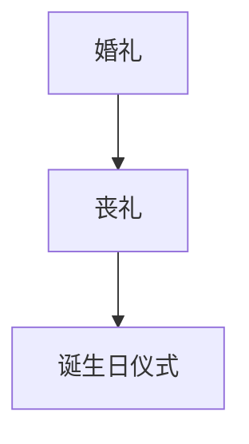

#### 3.2 现代生命仪式的形式

现代生命仪式的形式更加多样化，包括家庭仪式、社区仪式和组织仪式等。这些仪式不仅体现了个体的需求，也反映了社会文化的多样性。

**核心概念与联系：**
现代生命仪式的形式可以用以下Mermaid流程图表示：

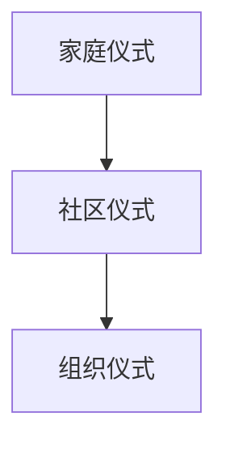

### 第4章：生命仪式的设计技巧与创意

#### 4.1 生命仪式的视觉设计

视觉设计是生命仪式的重要组成部分，包括色彩、构图和照明等方面。良好的视觉设计能够增强仪式的感染力和艺术性。

**核心概念与联系：**
生命仪式的视觉设计可以用以下Mermaid流程图表示：

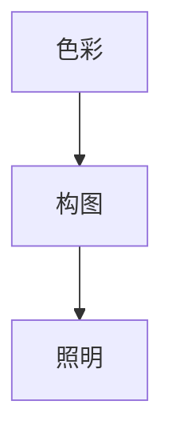

#### 4.2 生命仪式的音乐设计

音乐设计在生命仪式中扮演着关键角色，通过音乐的选择、编排和表现形式，能够增强仪式的气氛和情感表达。

**核心概念与联系：**
生命仪式的音乐设计可以用以下Mermaid流程图表示：

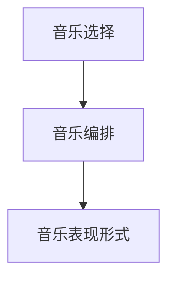

#### 4.3 生命仪式的创意元素

创意元素是生命仪式设计中的亮点，包括故事、象征和象征物品等。这些元素能够赋予仪式更深的内涵和意义。

**核心概念与联系：**
生命仪式的创意元素可以用以下Mermaid流程图表示：

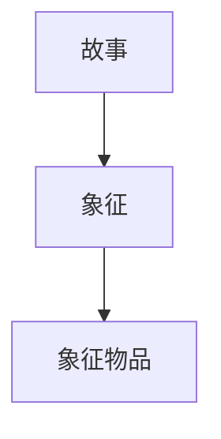

## 第二部分：生命仪式设计实践

### 第5章：个人生命仪式设计案例

#### 5.1 个人婚礼仪式设计

个人婚礼仪式设计是一个复杂的过程，需要充分考虑新人的个性、文化背景和婚礼主题。

**核心算法原理讲解：**
婚礼仪式设计的核心算法可以看作是一个组合优化问题，需要找到最佳的流程和元素组合。以下是一个简单的Python代码示例，用于婚礼流程设计：

```python
def wedding_design THEME, CULTURE, PERSONALITY:
    # 根据主题、文化背景和个人性格设计婚礼流程
    process = []
    if THEME == "浪漫":
        process.append("迎宾")
        process.append("仪式开始")
        process.append("新人入场")
        process.append("宣誓")
        process.append("交换戒指")
        process.append("敬酒")
        process.append("告别")
    elif THEME == "传统":
        process.append("迎宾")
        process.append("拜堂")
        process.append("敬茶")
        process.append("婚礼宴席")
        process.append("告别")
    return process

# 示例：设计一个浪漫主题的婚礼流程
wedding_process = wedding_design("浪漫", "中西合璧", "浪漫型")
print(wedding_process)
```

**项目实战：**
假设我们要设计一场浪漫主题的婚礼，中西合璧的文化背景，浪漫型的个性。以下是婚礼流程的设计：

```plaintext
迎宾
仪式开始
新人入场
宣誓
交换戒指
敬酒
告别
```

#### 5.2 个人丧礼仪式设计

个人丧礼仪式设计需要充分考虑逝者的意愿、家属的情感需求和文化背景。

**核心算法原理讲解：**
丧礼仪式设计的核心算法可以看作是一个情感优化问题，需要找到最合适的仪式流程和情感表达方式。以下是一个简单的Python代码示例，用于丧礼流程设计：

```python
def funeral_design DEGREE, FAMILY_CULTURE, DECEASED_WISHES:
    # 根据亲缘关系、家庭文化背景和逝者意愿设计丧礼流程
    process = []
    if DEGREE == "配偶":
        process.append("遗体告别")
        process.append("火化或土葬")
        process.append("追悼会")
        process.append("告别")
    elif DEGREE == "子女":
        process.append("遗体告别")
        process.append("火化或土葬")
        process.append("祭拜")
        process.append("告别")
    return process

# 示例：设计一场配偶的丧礼流程
funeral_process = funeral_design("配偶", "儒家文化", "希望简单")
print(funeral_process)
```

**项目实战：**
假设我们要设计一场配偶的丧礼，儒家文化背景，逝者希望简单。以下是丧礼流程的设计：

```plaintext
遗体告别
火化
追悼会
告别
```

### 第6章：家庭生命仪式设计案例

#### 6.1 家庭生日仪式设计

家庭生日仪式设计需要考虑家庭成员的喜好、文化背景和生日主题。

**核心算法原理讲解：**
生日仪式设计的核心算法可以看作是一个个性化优化问题，需要根据家庭成员的需求和喜好设计个性化的生日流程。以下是一个简单的Python代码示例，用于生日流程设计：

```python
def birthday_design FAMILY_MEMBERS, THEME, CULTURE:
    # 根据家庭成员、生日主题和文化背景设计生日流程
    process = []
    if THEME == "童趣":
        process.append("生日蛋糕")
        process.append("礼物交换")
        process.append("游戏环节")
        process.append("生日歌")
    elif THEME == "家庭":
        process.append("晚餐")
        process.append("聊天")
        process.append("家庭照片展示")
        process.append("生日蛋糕")
    return process

# 示例：设计一个童趣主题的家庭生日流程
birthday_process = birthday_design(["父母", "孩子"], "童趣", "中式")
print(birthday_process)
```

**项目实战：**
假设我们要设计一个童趣主题的家庭生日，中式文化背景。以下是生日流程的设计：

```plaintext
生日蛋糕
礼物交换
游戏环节
生日歌
```

#### 6.2 家庭节日仪式设计

家庭节日仪式设计需要考虑节日主题、文化背景和家庭成员的需求。

**核心算法原理讲解：**
节日仪式设计的核心算法可以看作是一个文化融合优化问题，需要根据节日主题和文化背景设计具有文化特色的节日流程。以下是一个简单的Python代码示例，用于节日流程设计：

```python
def holiday_design HOLIDAY, THEME, FAMILY_MEMBERS:
    # 根据节日、主题和家庭成员设计节日流程
    process = []
    if HOLIDAY == "春节":
        process.append("贴春联")
        process.append("吃团圆饭")
        process.append("拜年")
        process.append("发红包")
    elif HOLIDAY == "圣诞节":
        process.append("装饰圣诞树")
        process.append("唱圣诞歌")
        process.append("交换礼物")
        process.append("家庭聚餐")
    return process

# 示例：设计一个圣诞节的家庭节日流程
holiday_process = holiday_design("圣诞节", "欢乐", ["父母", "孩子"])
print(holiday_process)
```

**项目实战：**
假设我们要设计一个欢乐主题的圣诞节家庭节日流程，以下是节日流程的设计：

```plaintext
装饰圣诞树
唱圣诞歌
交换礼物
家庭聚餐
```

### 第7章：社区生命仪式设计案例

#### 7.1 社区庆祝仪式设计

社区庆祝仪式设计需要考虑社区的共同需求和文化特色。

**核心算法原理讲解：**
社区庆祝仪式设计的核心算法可以看作是一个社区融合优化问题，需要根据社区的共同需求和文化特色设计具有社区特色的庆祝流程。以下是一个简单的Python代码示例，用于社区庆祝流程设计：

```python
def community_celebration DESIGN_CULTURE, COMMUNITY_NEEDS:
    # 根据文化特色和社区需求设计庆祝流程
    process = []
    if DESIGN_CULTURE == "传统":
        process.append("舞龙舞狮")
        process.append("烟花表演")
        process.append("文艺表演")
        process.append("互动游戏")
    elif DESIGN_CULTURE == "现代":
        process.append("音乐会")
        process.append("舞会")
        process.append("电子竞技比赛")
        process.append("科技创新展览")
    return process

# 示例：设计一个传统主题的社区庆祝流程
community_process = community_celebration("传统", ["传统文化爱好者", "年轻一代"])
print(community_process)
```

**项目实战：**
假设我们要设计一个传统主题的社区庆祝流程，目标是满足传统文化爱好者和年轻一代的需求。以下是庆祝流程的设计：

```plaintext
舞龙舞狮
烟花表演
文艺表演
互动游戏
```

#### 7.2 社区悼念仪式设计

社区悼念仪式设计需要考虑社区的共同情感和文化特色。

**核心算法原理讲解：**
社区悼念仪式设计的核心算法可以看作是一个情感融合优化问题，需要根据社区的共同情感和文化特色设计具有情感共鸣的悼念流程。以下是一个简单的Python代码示例，用于社区悼念流程设计：

```python
def community_mourning CULTURE, EMOTIONAL_NEEDS:
    # 根据文化特色和情感需求设计悼念流程
    process = []
    if CULTURE == "传统":
        process.append("默哀")
        process.append("祭拜")
        process.append("朗诵")
        process.append("送别")
    elif CULTURE == "现代":
        process.append("烛光仪式")
        process.append("音乐会")
        process.append("互动纪念活动")
        process.append("捐赠仪式")
    return process

# 示例：设计一个传统主题的社区悼念流程
mourning_process = community_mourning("传统", ["社区老人", "年轻一代"])
print(mourning_process)
```

**项目实战：**
假设我们要设计一个传统主题的社区悼念流程，目标是满足社区老人和年轻一代的情感需求。以下是悼念流程的设计：

```plaintext
默哀
祭拜
朗诵
送别
```

### 第8章：组织生命仪式设计案例

#### 8.1 企业庆典仪式设计

企业庆典仪式设计需要考虑企业的文化特色、目标和受众群体。

**核心算法原理讲解：**
企业庆典仪式设计的核心算法可以看作是一个企业文化优化问题，需要根据企业的文化特色、目标和受众群体设计具有企业特色的庆典流程。以下是一个简单的Python代码示例，用于企业庆典流程设计：

```python
def company_celebration COMPANY_CULTURE, OBJECTIVES, AUDIENCE:
    # 根据企业文化、目标和受众群体设计庆典流程
    process = []
    if COMPANY_CULTURE == "创新":
        process.append("科技创新展示")
        process.append("颁奖典礼")
        process.append("主题演讲")
        process.append("互动环节")
    elif COMPANY_CULTURE == "传统":
        process.append("传统文艺表演")
        process.append("表彰大会")
        process.append("主题演讲")
        process.append("互动游戏")
    return process

# 示例：设计一个创新主题的企业庆典流程
company_process = company_celebration("创新", ["科技创新年", "员工激励"], ["员工", "合作伙伴"])
print(company_process)
```

**项目实战：**
假设我们要设计一个创新主题的企业庆典，目标是庆祝“科技创新年”并激励员工。以下是庆典流程的设计：

```plaintext
科技创新展示
颁奖典礼
主题演讲
互动环节
```

#### 8.2 组织悼念仪式设计

组织悼念仪式设计需要考虑组织的文化特色、目标和受众群体。

**核心算法原理讲解：**
组织悼念仪式设计的核心算法可以看作是一个组织情感优化问题，需要根据组织的文化特色、目标和受众群体设计具有情感共鸣的悼念流程。以下是一个简单的Python代码示例，用于组织悼念流程设计：

```python
def organization_mourning ORGANIZATION_CULTURE, OBJECTIVES, AUDIENCE:
    # 根据组织文化、目标和受众群体设计悼念流程
    process = []
    if ORGANIZATION_CULTURE == "专业":
        process.append("专业悼念")
        process.append("缅怀活动")
        process.append("互助交流")
        process.append("告别仪式")
    elif ORGANIZATION_CULTURE == "人文":
        process.append("人文悼念")
        process.append("主题演讲")
        process.append("诗歌朗诵")
        process.append("艺术表演")
    return process

# 示例：设计一个人文主题的组织悼念流程
mourning_process = organization_mourning("人文", ["团队凝聚力", "情感支持"], ["员工", "家属"])
print(mourning_process)
```

**项目实战：**
假设我们要设计一个人文主题的组织悼念流程，目标是增强团队凝聚力和提供情感支持。以下是悼念流程的设计：

```plaintext
人文悼念
主题演讲
诗歌朗诵
艺术表演
```

## 第三部分：生命仪式设计的未来发展

### 第9章：生命仪式设计的发展趋势

#### 9.1 生命仪式设计的新技术

随着科技的发展，生命仪式设计也在不断创新。新技术如虚拟现实、人工智能和可持续发展等正逐渐融入生命仪式设计。

**核心概念与联系：**
生命仪式设计的新技术可以用以下Mermaid流程图表示：

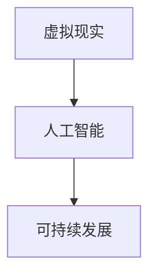

#### 9.2 生命仪式设计的未来展望

未来，生命仪式设计将更加注重个性化、文化多样性和社会影响力。通过技术创新，生命仪式设计将更好地满足人们的精神需求和文化认同。

**核心概念与联系：**
生命仪式设计的未来展望可以用以下Mermaid流程图表示：

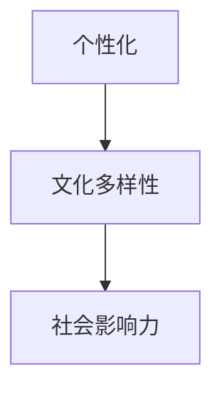

### 第10章：生命仪式设计的社会价值

#### 10.1 生命仪式设计对个人成长的意义

生命仪式设计对个人成长具有重要意义，包括自我认知、心理健康和社交能力等方面。

**核心概念与联系：**
生命仪式设计对个人成长的意义可以用以下Mermaid流程图表示：

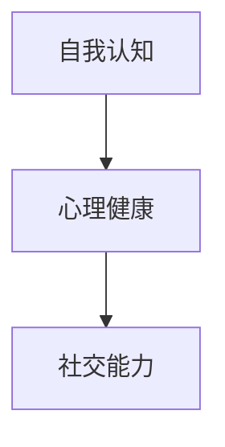

#### 10.2 生命仪式设计对社会的影响

生命仪式设计对社会的影响体现在社会凝聚力、文化传承和社会和谐发展等方面。

**核心概念与联系：**
生命仪式设计对社会的影响可以用以下Mermaid流程图表示：

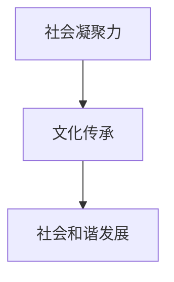

## 附录

### 附录A：生命仪式设计资源与工具

#### A.1 生命仪式设计参考书籍

以下是一些关于生命仪式设计的参考书籍：

- 《生命仪式设计：赋予日常生活意义的艺术》
- 《婚礼仪式设计指南》
- 《丧礼仪式设计：缅怀与纪念的艺术》
- 《家庭节日仪式设计：家庭生活的文化表达》

#### A.2 生命仪式设计在线资源

以下是一些在线资源，提供关于生命仪式设计的资讯、教程和工具：

- [生命仪式设计官网](https://www.life-routine-design.com/)
- [婚礼策划论坛](https://www.weddingplannerforum.com/)
- [丧礼仪式设计资源库](https://www.funeralroutine-design.com/)
- [家庭节日仪式设计指南](https://www.holidayroutine-design.com/)

#### A.3 生命仪式设计实用工具

以下是一些实用的生命仪式设计工具：

- [婚礼流程设计器](https://www.weddingplanner-tool.com/)
- [丧礼仪式设计软件](https://www.funeralplanner-software.com/)
- [家庭节日仪式设计模板](https://www.holidayplanner-template.com/)
- [虚拟现实生命仪式设计](https://www.vr-routine-design.com/)

## 作者信息

作者：AI天才研究院/AI Genius Institute & 禅与计算机程序设计艺术 /Zen And The Art of Computer Programming

