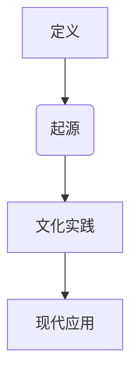
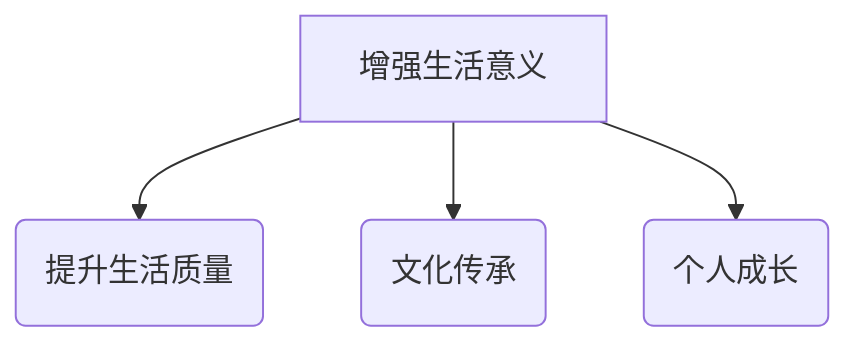
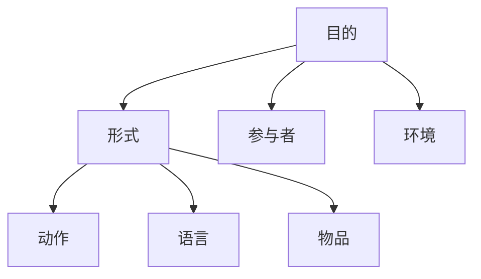
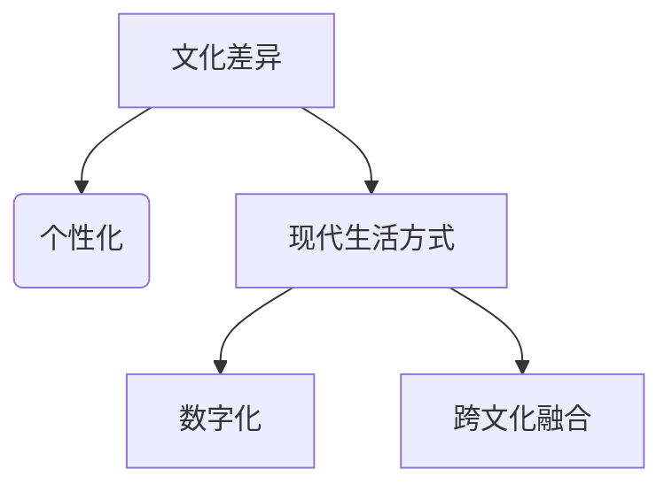

                 

### 文章标题

# 生命仪式设计：赋予日常生活的意义

### 关键词

- 生命仪式设计
- 生活质量提升
- 仪式感
- 个人成长
- 社会文化

### 摘要

生命仪式设计是一种通过精心设计的日常活动，赋予生活更深层次意义和仪式感的实践。本文将深入探讨生命仪式设计的定义、意义、历史发展、核心要素，以及如何在日常生活中实施和优化生命仪式设计。通过案例分析和实际应用，本文将帮助读者理解如何通过生命仪式设计，提高生活质量，促进个人成长，并传承文化。

## 第1章: 理解生命仪式设计

### 1.1 生命仪式设计的定义与起源

生命仪式设计（Life Ritual Design）是一种系统性方法，通过设计和实施日常生活中的仪式，赋予个体生活更多的意义和深度。这一概念起源于人类文化中的仪式实践，如宗教仪式、庆典仪式和日常习惯。随着现代社会的发展，生命仪式设计逐渐成为一种生活方式的设计和优化手段。

**Mermaid流程图：**



- **定义**：生命仪式设计是一种通过设计日常生活仪式，赋予个体生活更深层次意义的过程。
- **起源**：起源于人类文化中的仪式实践，如宗教仪式、庆典仪式和日常习惯。
- **文化实践**：在历史上，许多文化都通过仪式来强化社会纽带和个体身份。
- **现代应用**：在现代，生命仪式设计被广泛应用于提升生活质量、促进个人成长和传承文化。

### 1.2 生命仪式设计的意义

生命仪式设计的意义在于通过仪式感，将日常生活转化为有意义的经历，从而提升生活质量。以下是生命仪式设计的主要意义：

**Mermaid流程图：**



- **增强生活意义**：通过仪式设计，个体能够更好地理解生活的目的和价值，从而增强对生活的满意度。
- **提升生活质量**：仪式设计有助于建立规律的生活习惯，减少压力，提高身体健康和精神状态。
- **文化传承**：通过传承和改造传统仪式，生命仪式设计有助于文化的传承和发展。
- **个人成长**：仪式设计鼓励个体反思和自我提升，促进个人成长和自我实现。

### 1.3 生命仪式设计的历史发展

生命仪式设计的历史可以追溯到古代文明。在不同文化和时代，仪式设计有着不同的形式和目的。

- **古代文明**：在古埃及、希腊、罗马和中国的古代文明中，仪式设计是一种重要的文化实践，用于宗教、政治和社会层面。
- **中世纪欧洲**：在中世纪，宗教仪式成为社会生活中的核心，如婚礼、洗礼和葬礼等。
- **现代**：随着社会的发展和个体意识的提升，生命仪式设计逐渐成为一种个人选择和生活艺术。

### 1.4 生命仪式设计的核心要素

生命仪式设计包括以下几个核心要素：

- **目的**：明确仪式的目标和意义。
- **形式**：设计仪式的具体形式，如动作、语言、物品等。
- **参与者**：确定仪式的参与者和角色。
- **环境**：营造仪式的氛围和场景。

**Mermaid流程图：**



- **目的**：明确仪式的目标和意义，如庆祝、纪念、感谢等。
- **形式**：设计仪式的具体形式，如动作（如鞠躬、起立）、语言（如祷告、问候）和物品（如花束、蜡烛）。
- **参与者**：确定仪式的参与者和角色，如主持人、参与者、观众等。
- **环境**：营造仪式的氛围和场景，如布置、音乐、光线等。

### 1.5 生命仪式设计的挑战与未来

生命仪式设计面临着诸多挑战，如文化差异、个人偏好和现代生活方式的影响。未来，生命仪式设计可能朝着以下方向发展：

- **个性化**：根据个人需求和偏好定制仪式。
- **数字化**：利用科技手段增强仪式的互动性和参与感。
- **跨文化融合**：结合不同文化的元素，创造新的仪式形式。

**Mermaid流程图：**



- **文化差异**：尊重不同文化的仪式习俗和价值观。
- **个性化**：根据个人需求和偏好定制仪式，以满足不同个体的需求。
- **现代生活方式**：适应现代生活的快节奏和科技环境。
- **数字化**：利用科技手段，如虚拟现实和增强现实，增强仪式的互动性和参与感。
- **跨文化融合**：结合不同文化的元素，创造新的仪式形式，以促进文化交流和理解。

## 第2章: 日常生活中的生命仪式设计

### 2.1 早晨仪式

早晨仪式是一天中最重要的仪式之一，它有助于设定一天的生活基调，提高整体生活质量。以下是一个典型的早晨仪式设计：

- **起床**：设定一个固定的起床时间，并逐渐适应。
- **晨间锻炼**：进行轻松的拉伸或瑜伽，以唤醒身体。
- **早餐**：准备健康的早餐，享受美味的食物。
- **晨间阅读**：阅读一段正能量的文字，如励志文章或心灵鸡汤。

**案例解析：**

假设小明决定设计一个早晨仪式，他可能采取以下步骤：

1. **确定起床时间**：设定一个合理的起床时间，如早晨6:30。
2. **晨间锻炼**：每天早上做10分钟瑜伽，以唤醒身体。
3. **早餐**：设定固定的早餐时间，如7:00，并准备一份健康的早餐，如燕麦粥和水果。
4. **晨间阅读**：每天早上阅读5分钟的正能量文章，以开启一天的好心情。

通过这种早晨仪式设计，小明能够有效地调整自己的生物钟，提高身体和心理状态，为一天的工作和生活做好准备。

### 2.2 工作仪式

工作仪式有助于提高工作效率和职业素养，建立专业形象。以下是一个典型的工作仪式设计：

- **准备工作**：每天早晨检查工作日程，整理工作区域。
- **工作开始**：设定一个固定的时间开始工作，如上午9:00。
- **工作间歇**：每工作一段时间后，休息5-10分钟，进行简单的拉伸或呼吸练习。
- **工作结束**：在一天工作结束时，回顾当天的工作成果，整理工作笔记。

**案例解析：**

假设小李是一名程序员，他决定设计一个工作仪式，他可能采取以下步骤：

1. **准备工作**：每天早晨打开电脑，检查邮件和任务清单，整理工作区域，确保环境整洁。
2. **工作开始**：每天上午9:00开始工作，先处理紧急任务，然后逐步完成其他任务。
3. **工作间歇**：每工作45分钟后，休息5-10分钟，进行简单的拉伸和深呼吸练习，以缓解疲劳。
4. **工作结束**：在下午5:00下班前，回顾当天的工作成果，整理代码和文档，确保工作区域整洁。

通过这种工作仪式设计，小李能够提高工作效率，减少错误和遗漏，同时培养良好的工作习惯。

### 2.3 休闲仪式

休闲仪式有助于放松身心，缓解压力，提升生活质量。以下是一个典型的休闲仪式设计：

- **休闲时间**：设定固定的休闲时间，如每天晚上8:00。
- **放松活动**：进行自己喜欢的放松活动，如阅读、冥想、瑜伽或听音乐。
- **社交时间**：与朋友或家人进行交流，分享一天的经历。

**案例解析：**

假设小张决定设计一个休闲仪式，他可能采取以下步骤：

1. **设定休闲时间**：每天晚上8:00开始，安排一个小时的休闲时间。
2. **放松活动**：选择自己喜欢的放松方式，如阅读一本小说、进行20分钟的冥想或做一节瑜伽。
3. **社交时间**：在休闲时间结束后，与家人或朋友进行交流，分享一天的经历和感受。

通过这种休闲仪式设计，小张能够有效地缓解工作压力，提升生活质量，同时增强与家人和朋友的情感联系。

### 2.4 睡眠仪式

睡眠仪式有助于改善睡眠质量，提高睡眠效率。以下是一个典型的睡眠仪式设计：

- **睡前准备**：设定一个固定的睡眠时间，如晚上10:00。
- **放松活动**：进行轻松的放松活动，如阅读、冥想或听轻音乐。
- **避免刺激**：避免在睡前使用电子设备和过度思考。

**案例解析：**

假设小王决定设计一个睡眠仪式，他可能采取以下步骤：

1. **设定睡眠时间**：每天晚上10:00上床睡觉，确保每天有足够的睡眠时间。
2. **放松活动**：在睡前进行20分钟的冥想，或阅读一本轻松的书籍，以放松身心。
3. **避免刺激**：睡前不使用手机和电脑，避免过度思考或情绪激动。

通过这种睡眠仪式设计，小王能够提高睡眠质量，减少失眠和疲劳，从而提高整体生活质量。

## 第3章: 生命仪式设计的原则与方法

### 3.1 个性化原则

个性化原则是生命仪式设计的核心，旨在根据个人的需求和偏好，设计出最适合的仪式。以下是一些实现个性化的方法和技巧：

- **了解个人偏好**：通过自我反思和问卷调查，了解自己的兴趣、价值观和生活目标。
- **定制仪式内容**：根据个人偏好，选择适合自己的仪式活动，如锻炼、阅读、烹饪等。
- **灵活调整**：仪式设计不是一成不变的，可以根据个人情况和环境变化进行调整。

**伪代码示例：**

```plaintext
function personalize_routine(personal_preferences, routine_template):
    for each activity in routine_template:
        if personal_preferences.contains(activity):
            add activity to personalized_routine
        else:
            remove activity from personalized_routine
    return personalized_routine
```

在这个伪代码中，`personal_preferences` 表示个人的偏好列表，`routine_template` 表示一个标准的生活仪式模板。通过遍历模板中的活动，并根据个人偏好进行添加或删除，最终生成一个个性化的生活仪式。

### 3.2 简化原则

简化原则旨在通过减少生活中的仪式活动，提高生活质量。简化原则有助于减轻压力，提高效率和幸福感。以下是一些简化方法：

- **精简活动**：删除不必要的仪式活动，只保留对个人有意义的部分。
- **合并活动**：将多个仪式活动合并为一个，以减少时间和精力投入。
- **自动化**：利用科技工具，如定时器、提醒应用等，自动化一些仪式活动。

**数学模型与公式：**

$$
\text{简化程度} = \frac{\text{简化后的活动数量}}{\text{原始活动数量}}
$$

简化程度的计算公式表明，简化程度与简化后的活动数量成正比，与原始活动数量成反比。这意味着，活动数量的减少越多，简化程度越高。

### 3.3 美学原则

美学原则强调生命仪式设计中的美感体验，通过视觉、听觉、嗅觉等感官元素，提升仪式的品质。以下是一些美学原则和方法：

- **视觉设计**：选择合适的颜色、图案和装饰，营造氛围。
- **听觉设计**：选择合适的音乐、声音和语言，营造氛围。
- **嗅觉设计**：使用香薰、香水等，提升仪式的舒适度。
- **整体协调**：确保视觉、听觉、嗅觉元素之间的协调和统一。

### 3.4 效能原则

效能原则强调生命仪式设计中的效率和效果，旨在通过优化仪式活动，提高生活质量。以下是一些效能原则和方法：

- **任务分解**：将复杂的仪式活动分解为简单的任务，以降低难度。
- **时间管理**：合理安排仪式活动的时间，避免时间浪费。
- **目标明确**：确保每个仪式活动都有明确的目标和意义。

### 3.5 方法与工具

生命仪式设计需要一系列方法和工具来支持和实施。以下是一些常用的方法和工具：

- **日记记录**：记录仪式活动的过程和感受，以便进行反思和改进。
- **时间管理工具**：如日历、提醒应用等，帮助规划仪式活动的时间。
- **个人习惯跟踪工具**：如健身应用、睡眠监测设备等，帮助跟踪和优化仪式活动。

## 第4章: 生命仪式设计的实践与应用

### 4.1 仪式设计的案例分析

### 案例一：小明的早晨仪式

小明是一位年轻的程序员，他意识到自己的生活质量需要提升。他决定设计一个早晨仪式，以提高一天的工作效率和心情。

**步骤：**

1. **确定起床时间**：设定一个固定的起床时间，如早晨7:00。
2. **晨间锻炼**：每天进行10分钟瑜伽，以唤醒身体。
3. **早餐**：准备一份健康的早餐，如全麦面包和水果。
4. **晨间阅读**：阅读5分钟的励志文章。

**结果：**

通过实施早晨仪式，小明发现自己在一天的工作中更加专注和高效。他的心情也得到了显著提升，整体生活质量得到了改善。

### 案例二：小红的休闲仪式

小红是一位全职妈妈，她希望找到一种方式来放松自己，并保持与家人的紧密联系。

**步骤：**

1. **设定休闲时间**：每天晚上8:00开始，安排一个小时的休闲时间。
2. **放松活动**：选择自己喜欢的阅读或瑜伽，以放松身心。
3. **社交时间**：在休闲时间结束后，与家人分享一天的经历和感受。

**结果：**

小红通过休闲仪式，不仅能够有效地缓解一天的工作压力，还能与家人建立更紧密的情感联系，提升了家庭生活质量。

### 案例三：小刚的工作仪式

小刚是一名公司高管，他希望通过工作仪式提高工作效率和职业形象。

**步骤：**

1. **准备工作**：每天早晨检查工作日程，整理工作区域。
2. **工作开始**：设定一个固定的时间开始工作，如上午9:00。
3. **工作间歇**：每工作45分钟后，休息5-10分钟，进行简单的拉伸和深呼吸练习。
4. **工作结束**：在一天工作结束时，回顾当天的工作成果，整理工作笔记。

**结果：**

通过工作仪式，小刚发现工作效率显著提高，工作压力得到了有效缓解，职业形象也得到了提升。

### 4.2 生命仪式设计在家庭中的应用

生命仪式设计在家庭中的应用有助于增强家庭成员之间的情感联系，提升家庭生活质量。以下是一些具体的应用场景：

- **家庭早餐仪式**：每天早晨一起用餐，分享一天的计划和感受。
- **家庭晚餐仪式**：每天晚上一起用餐，分享一天的收获和挑战。
- **家庭聚会仪式**：定期举行家庭聚会，增进彼此的了解和感情。

### 4.3 生命仪式设计在职场中的应用

生命仪式设计在职场中的应用有助于提高员工的工作效率、职业素养和工作满意度。以下是一些具体的应用场景：

- **每日晨会仪式**：每天早晨举行简短的晨会，明确当天的工作目标和任务。
- **团队建设活动**：定期举行团队建设活动，增强团队凝聚力和协作能力。
- **工作间歇休息**：每工作一段时间后，进行短暂的休息和放松，以缓解工作压力。

### 4.4 生命仪式设计在社区中的应用

生命仪式设计在社区中的应用有助于增强社区凝聚力、促进社区发展和提升居民生活质量。以下是一些具体的应用场景：

- **社区晨练仪式**：每天早晨组织社区居民进行晨练，促进健康生活方式。
- **社区公益活动**：定期举行社区公益活动，如环保、慈善等，增强居民的公益意识。
- **社区文化节**：举办社区文化节，展示社区文化特色，促进文化交流。

## 第5章: 生命仪式设计的挑战与未来

### 5.1 挑战与问题

生命仪式设计面临着诸多挑战和问题，如个人习惯的养成、文化差异、时间安排等。以下是一些主要挑战和问题：

- **习惯养成**：生命仪式设计需要坚持一段时间才能养成习惯，这对一些个体来说可能比较困难。
- **文化差异**：不同文化背景下，生命仪式设计的接受度和实施方式可能存在差异。
- **时间安排**：如何在繁忙的生活中找到时间和空间进行生命仪式设计，是一个需要考虑的问题。

### 5.2 未来趋势与发展方向

未来，生命仪式设计可能朝着以下方向发展：

- **个性化**：根据个人需求和偏好，设计更加个性化的生命仪式。
- **数字化**：利用科技手段，如虚拟现实和增强现实，提升仪式的互动性和参与感。
- **跨文化融合**：结合不同文化的元素，创造新的生命仪式形式，以促进文化交流和理解。

### 5.3 生命仪式设计的跨领域融合

生命仪式设计可以与其他领域相结合，创造出新的应用场景和解决方案。以下是一些可能的跨领域融合方向：

- **与健康管理的融合**：通过生命仪式设计，促进健康生活方式的养成，如晨间锻炼、健康饮食等。
- **与教育融合**：通过生命仪式设计，培养学生的自我管理能力和价值观，如家庭晨会、晨间阅读等。
- **与企业文化的融合**：通过生命仪式设计，提升企业文化，增强员工凝聚力和归属感，如团队建设活动、晨会等。

### 结论

生命仪式设计是一种通过精心设计的日常活动，赋予生活更深层次意义和仪式感的实践。通过生命仪式设计，个体可以提升生活质量、促进个人成长、传承文化，并应对现代社会中的各种挑战。未来，生命仪式设计有望朝着个性化、数字化和跨领域融合的方向发展，为人类生活带来更多可能性和价值。

## 附录

### 最佳实践 Tips

1. **逐步实施**：不要一次性设计出完整的生命仪式，可以逐步实施，逐渐调整和完善。
2. **保持灵活性**：生命仪式设计应保持灵活性，根据个人情况和环境变化进行调整。
3. **与他人分享**：与他人分享生命仪式的设计和实施经验，可以获取反馈和建议，有助于持续改进。

### 小结

生命仪式设计是一种通过精心设计的日常活动，赋予生活更深层次意义和仪式感的实践。通过生命仪式设计，个体可以提升生活质量、促进个人成长、传承文化，并应对现代社会中的各种挑战。

### 注意事项

1. **尊重个人差异**：生命仪式设计应根据个人需求和偏好进行个性化设计。
2. **合理分配时间**：确保生命仪式设计不会对日常生活造成过大负担。
3. **持续反思与调整**：定期反思生命仪式的实施效果，并根据实际情况进行调整。

### 拓展阅读

1. 《禅与计算机程序设计艺术》：Donald E. Knuth
2. 《习惯的力量》：Charles Duhigg
3. 《高效能人士的七个习惯》：Stephen R. Covey

### 作者信息

- 作者：AI天才研究院/AI Genius Institute & 禅与计算机程序设计艺术 /Zen And The Art of Computer Programming

