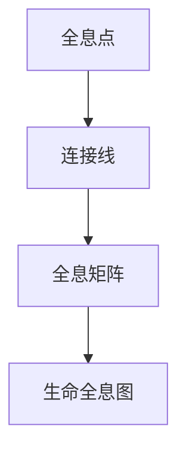

                 

## 《生命全息图绘制：可视化你的人生意义轨迹的工具》

### 关键词
- 生命全息图
- 人生意义
- 可视化
- 人生轨迹
- 轨迹工具

### 摘要
《生命全息图绘制：可视化你的人生意义轨迹的工具》一书旨在揭示通过生命全息图这一独特工具，如何帮助我们更清晰地理解人生的意义和轨迹。本书首先介绍生命全息图的概念及其历史发展，然后详细探讨绘制生命全息图的方法和工具，接着解读生命全息图的技巧，并分享实际案例。最后，本书展望生命全息图的未来发展和面临的挑战。

---

# 引言

在现代社会，人们面临着前所未有的复杂性和不确定性，如何找到自己人生的意义和方向成为了一个重要的课题。生命全息图，作为一种全新的工具，能够帮助我们可视化人生的意义轨迹，从而更清晰地认识自己、规划未来。

生命全息图的概念起源于量子物理学，它将个体的生命轨迹与宇宙的全息信息结合起来，形成一种独特的可视化模型。这一模型不仅能够反映个体的成长过程，还能揭示人生中的关键节点和转折点。通过绘制和分析生命全息图，我们可以更好地理解自己的生命轨迹，发现人生中的潜力和机会。

随着科技的发展，生命全息图的绘制工具越来越先进，使得这一工具的应用范围不断扩大。从个人成长规划到职业发展，从心理健康到人际关系，生命全息图都在发挥着重要作用。然而，如何正确使用这一工具，如何解读生命全息图中的信息，仍然是许多人面临的问题。

本书旨在解决这些问题，通过系统的讲解和丰富的案例，帮助读者掌握生命全息图的绘制和解读方法。无论你是职业规划者、心理咨询师，还是普通读者，本书都能为你提供有益的指导。

## 生命全息图的概念

生命全息图是一种将个体生命历程以可视化方式呈现的工具。它基于全息理论，将个体的生命事件、经历和感受整合在一个完整的图像中，从而呈现出一个全方位的生命轨迹。

### 定义

生命全息图，顾名思义，是对生命全息信息的可视化呈现。全息理论起源于量子物理学，指的是通过一部分信息可以完整地反映整体的性质。在生命全息图中，个体的一小部分生命片段（如一次重要的经历或决定）可以反映整个生命历程的核心特征和意义。

### 发展历史

生命全息图的概念虽然在近年来受到广泛关注，但其理论基础却可以追溯到更早的量子物理和系统科学领域。以下是生命全息图发展历程的简要概述：

1. **量子物理基础**：全息理论最初由理查德·费曼在1947年提出，他在研究量子电动力学时发现，通过部分信息可以重现整个系统的全貌。
2. **系统科学扩展**：20世纪中叶，系统科学逐渐发展，将全息理论应用于更广泛的领域，包括生物学、心理学和社会学等。
3. **生命全息图诞生**：20世纪末，心理学家和咨询师开始探索如何将全息理论应用于个人成长和心理健康。1990年代，生命全息图正式作为一种工具被提出。

### 核心概念与联系

在生命全息图中，核心概念包括：

1. **全息点**：代表个体生命中的关键事件或经历。
2. **连接线**：表示事件之间的因果关系或时间顺序。
3. **全息矩阵**：将所有全息点连接起来，形成一个完整的生命全息图。

这些概念之间的关系可以用以下Mermaid流程图表示：



在这个流程图中，全息点通过连接线连接成全息矩阵，最终形成生命全息图。这种结构不仅能够帮助我们理解个体的生命轨迹，还能揭示其中的内在联系和规律。

### 全息图与人生意义的关系

生命全息图不仅是一种工具，更是一种理解人生意义的方式。通过全息图，我们可以从整体上审视自己的生命历程，发现其中的意义和目的。以下是生命全息图与人生意义之间的几个关键联系：

1. **全面性**：生命全息图将个体的所有经历和感受整合在一个图像中，使我们能够从全局角度理解自己的生命轨迹，从而更全面地认识自己。
2. **结构性**：生命全息图通过全息矩阵的形式，揭示了事件之间的因果关系和时间顺序，帮助我们理解生命中的关键节点和转折点。
3. **反思性**：通过绘制和分析生命全息图，我们可以反思自己的过去经历，总结经验教训，从而更好地规划未来。

总之，生命全息图不仅是一种工具，更是一种全新的视角，帮助我们更深刻地理解人生的意义和目的。

## 生命全息图的绘制方法

绘制生命全息图是一个系统的过程，涉及到数据的收集、工具的选择和应用，以及最终的解读。以下详细探讨这些步骤。

### 数据收集

绘制生命全息图的第一步是收集相关的生命数据。这些数据包括：

1. **重要事件**：如生日、毕业、结婚、晋升等。
2. **情感体验**：如快乐、悲伤、挫败、成功等。
3. **关键决策**：如职业选择、学术方向、生活方式等。

收集这些数据可以通过以下方法：

- **日记回顾**：回顾过去，记录重要事件和情感体验。
- **问卷填写**：设计专门的问卷，收集个人的生命数据。
- **访谈**：与亲友、导师或心理咨询师进行深入交流，获取更多信息。

### 工具选择

在收集到足够的生命数据后，需要选择合适的工具来绘制生命全息图。目前，常见的工具包括：

1. **手绘工具**：如纸笔、白板等。
2. **数字工具**：如生命全息图软件、绘图软件等。

选择工具时需要考虑以下几点：

- **易用性**：工具是否易于操作，是否适合个人的使用习惯。
- **功能丰富性**：工具是否具备绘制连接线、添加注释等功能。
- **兼容性**：工具是否支持多种数据格式，是否能够与其他软件集成。

### 绘制步骤

绘制生命全息图的步骤可以分为以下几个阶段：

1. **规划全息图结构**：在开始绘制前，先规划全息图的整体结构，确定全息点、连接线和全息矩阵的位置。
2. **添加全息点**：根据收集到的生命数据，在图中添加全息点，并用符号或标签标注。
3. **绘制连接线**：根据事件之间的因果关系或时间顺序，用线段连接全息点。
4. **完善全息图**：添加注释、颜色、图标等，使全息图更加直观和丰富。
5. **验证和调整**：检查全息图是否符合预期，进行必要的调整和优化。

### 绘制示例

以下是一个简单的生命全息图绘制示例：

```
          (快乐)
           ↑
           |
(结婚)---(工作)---(晋升)
           ↓
          (挫折)
```

在这个示例中，我们用圆圈表示全息点，用线段表示事件之间的连接，通过这个简单的全息图，我们可以初步了解个人的生命轨迹。

### 解读全息图

绘制完生命全息图后，下一步是解读和分析图中的信息。解读全息图的方法包括：

1. **整体观察**：从整体上观察全息图，了解个人的生命轨迹和主要经历。
2. **细节分析**：关注全息图中的细节，如连接线的长度、颜色、注释等，分析事件之间的关系和意义。
3. **情感体验**：结合个人的情感体验，理解全息图中的全息点所代表的事件对自己的影响。

通过解读全息图，我们可以：

- **发现关键节点**：识别生命中的关键节点和转折点，理解其对人生轨迹的影响。
- **总结经验教训**：从过去的事件中总结经验教训，为未来提供指导。
- **规划人生方向**：基于全息图的解读，制定更明确的人生目标和规划。

### 实践意义

绘制生命全息图的实践意义在于：

- **自我认识**：通过绘制和分析全息图，更深刻地认识自己，理解自己的成长过程和内在动机。
- **心理调适**：通过回顾和反思生命历程，缓解心理压力，增强心理韧性。
- **人生规划**：基于全息图的解读，制定更科学、合理的人生规划，实现个人目标。

总之，生命全息图是一种强大的工具，能够帮助我们更清晰地理解人生的意义和轨迹，从而更好地规划未来。

## 常见的生命全息图工具介绍

随着生命全息图的普及，市面上出现了多种用于绘制生命全息图的工具。这些工具各有特点，适用于不同的使用场景和需求。以下将介绍几种常见的生命全息图工具。

### 1. MindManager

**特点**：
- **功能丰富**：MindManager是一款思维导图软件，能够方便地绘制和连接全息点。
- **用户界面友好**：直观的操作界面，适合初学者使用。

**使用方法**：
1. 打开MindManager，新建一个空白文档。
2. 在文档中添加全息点，并用线段连接。
3. 对全息点进行标注和注释，使全息图更加详细和丰富。

**优缺点**：
- **优点**：易于操作，功能丰富，适用于多种场景。
- **缺点**：在某些复杂场景下，全息图的显示可能会变得拥挤。

### 2. OmniGraffle

**特点**：
- **专业性强**：OmniGraffle是一款专业的图形设计工具，提供了丰富的绘图和布局选项。
- **灵活性强**：用户可以自定义各种元素和样式，使全息图更加个性化。

**使用方法**：
1. 打开OmniGraffle，新建一个空白文档。
2. 使用工具栏中的各种绘图工具，添加全息点和连接线。
3. 调整全息点和连接线的位置和样式，使全息图更加美观和清晰。

**优缺点**：
- **优点**：灵活性高，适用于专业用户。
- **缺点**：学习曲线较陡，对于初学者可能较为困难。

### 3. Canva

**特点**：
- **设计简洁**：Canva是一款设计软件，提供了丰富的模板和设计元素。
- **易于分享**：用户可以轻松地将全息图分享到社交媒体或打印出来。

**使用方法**：
1. 打开Canva，选择一个生命全息图模板。
2. 替换模板中的元素，添加和调整全息点和连接线。
3. 添加注释和颜色，使全息图更具吸引力。

**优缺点**：
- **优点**：设计简洁，易于分享。
- **缺点**：自定义功能有限，不适合复杂场景。

### 4. Sketch

**特点**：
- **专业级设计**：Sketch是一款专业的设计工具，广泛应用于UI/UX设计和数字产品开发。
- **强大的插件支持**：Sketch拥有丰富的插件生态系统，可以扩展其功能。

**使用方法**：
1. 打开Sketch，新建一个空白画布。
2. 使用工具栏中的各种绘图工具，绘制全息点和连接线。
3. 利用插件，如`Sketch Fullscreen`和`SketchVue`，增强全息图的功能和互动性。

**优缺点**：
- **优点**：专业级设计工具，插件丰富。
- **缺点**：学习曲线较陡，对非专业人士可能不友好。

### 总结

以上是几种常见的生命全息图工具的介绍。选择合适的工具，可以帮助用户更高效地绘制和分析生命全息图，从而更好地理解人生的意义和轨迹。在实际应用中，可以根据具体需求和场景，灵活选择合适的工具。

## 生命全息图的实际应用案例

生命全息图作为一种强大的工具，已经在多个领域得到了广泛应用。以下通过几个实际案例，展示生命全息图在个人成长、职业发展和心理健康等方面的应用。

### 1. 个人成长规划

李先生是一名刚刚步入职场的年轻白领。他在迷茫于个人职业发展方向时，决定使用生命全息图进行自我探索。通过收集和分析自己的生命数据，李先生绘制出了自己的生命全息图。图中的全息点包括童年经历、学业成就、职业选择等。通过分析这些全息点，李先生发现自己在选择职业时受到了家庭和环境影响较大，而忽略了自己的兴趣和激情。基于这一发现，李先生重新审视了自己的职业规划，决定转行从事自己热爱的领域。经过一年的努力，李先生在新的职业道路上取得了显著的成绩，实现了个人成长和职业发展。

### 2. 职业发展指导

张女士是一名资深的人力资源经理。她在为员工进行职业发展指导时，采用了生命全息图这一工具。通过绘制员工的个人生命全息图，张女士能够更全面地了解员工的发展需求和潜在问题。例如，她发现某员工在过去的关键节点上曾经历重大挫折，导致其对工作产生负面情绪。通过解读全息图，张女士帮助员工认识到这些挫折背后的价值，鼓励他们勇敢面对挑战，重新找到工作动力。经过一段时间的指导，这位员工的工作表现显著提升，职业发展也更加顺利。

### 3. 心理健康辅导

王医生是一名心理咨询师，她在工作中广泛运用生命全息图帮助客户解决心理健康问题。一次，她接待了一名因情感困扰前来咨询的年轻人。通过绘制生命全息图，王医生发现这位年轻人从小生活在单亲家庭，缺乏关爱和陪伴。这一发现帮助王医生更深入地理解了客户的情感需求，为她提供了有针对性的心理辅导。在后续的治疗中，王医生引导客户回顾和解读生命全息图，帮助客户认识到自己的情感模式，学会调整和应对。经过一段时间的辅导，客户的心理状况得到了明显改善，对生活的信心和积极性也大大提高。

### 4. 教育辅导与规划

刘老师是一名中学教师，她发现部分学生在学业上存在显著的问题，决定使用生命全息图进行教育辅导。通过对学生的生命全息图进行分析，刘老师发现这些学生在学业上的困难往往源于缺乏有效的学习策略和生活目标。基于这一发现，刘老师制定了个性化的教育辅导计划，帮助学生建立学习目标和策略，并指导他们在生活中找到平衡和动力。在刘老师的帮助下，这些学生的学业成绩逐渐提升，自信心和生活满意度也显著提高。

### 案例总结

通过以上实际案例，我们可以看到生命全息图在个人成长、职业发展、心理健康和教育辅导等多个领域都发挥了重要作用。它不仅帮助个体更清晰地认识自己，发现问题和机会，还提供了具体的指导和建议，促进了个人和职业的发展。这些案例证明了生命全息图作为一种实用工具的巨大潜力和价值。

### 全息图工具的优缺点分析

在探讨生命全息图工具时，我们需要综合考虑其优缺点，以便用户能够根据自己的需求选择最合适的工具。

#### 优点

1. **直观性**：生命全息图工具能够将复杂的人生数据以直观、易于理解的方式呈现，帮助用户快速抓住关键信息。
2. **灵活性**：大多数工具都提供了丰富的绘图和编辑功能，用户可以根据自己的需求自定义全息图的结构和样式。
3. **互动性**：一些高级工具支持用户在生命全息图上进行互动操作，如添加注释、调整连接线等，提高了用户体验。

#### 缺点

1. **学习曲线**：对于初学者来说，一些高级工具可能需要较长的学习时间，才能熟练掌握其功能。
2. **数据隐私**：使用在线工具时，用户需要担心个人数据的隐私和安全。
3. **可视化限制**：在某些情况下，工具的可视化效果可能无法完全满足用户的需求，特别是在处理大量复杂数据时。

#### 优缺点对比

以下是几种常见生命全息图工具的优缺点对比：

| 工具         | 优点                      | 缺点                          |
|--------------|-------------------------|-----------------------------|
| MindManager  | 功能丰富，用户界面友好     | 在复杂场景下显示可能变得拥挤   |
| OmniGraffle  | 专业性强，灵活性高        | 学习曲线较陡，初学者使用困难   |
| Canva        | 设计简洁，易于分享        | 自定义功能有限，复杂场景下受限 |
| Sketch       | 专业级设计，插件丰富     | 学习曲线较陡，非专业人士不易使用 |

#### 选择建议

根据不同的使用需求和场景，以下是具体选择建议：

- **初学者**：推荐使用MindManager或Canva，这两个工具易于上手，功能全面，适合初学者。
- **专业人士**：若需要更高级的功能和定制化设计，建议选择OmniGraffle或Sketch。
- **在线使用**：如果需要随时随地进行生命全息图的绘制和分享，可以选择在线工具，如TiddlyWiki或Google Drawings。

总之，选择生命全息图工具时，应综合考虑工具的易用性、功能性和安全性，以确保能够高效地完成工作并保护个人隐私。

### 生命全息图如何揭示人生意义

生命全息图作为一种独特的可视化工具，能够帮助我们揭示人生中的意义和目的。以下是几个关键步骤，说明如何通过生命全息图来解读和发现人生意义。

#### 1. 数据收集

首先，我们需要收集与个人生命相关的数据，包括重要事件、情感体验和关键决策。这些数据可以通过日记回顾、问卷填写和访谈等方式获取。数据收集的全面性和准确性是解读生命全息图的基础。

#### 2. 绘制全息图

在收集到足够的生命数据后，我们使用全息图工具绘制生命全息图。全息点表示关键事件或决策，连接线表示事件之间的因果关系或时间顺序。全息矩阵将所有全息点连接起来，形成一个完整的生命轨迹。

#### 3. 解读全息图

解读生命全息图的关键在于分析全息图中的关键节点和转折点。以下是几个重要的解读步骤：

- **整体观察**：从整体上观察全息图，了解个人的生命轨迹和主要经历。
- **细节分析**：关注全息图中的细节，如连接线的长度、颜色、注释等，分析事件之间的关系和意义。
- **情感体验**：结合个人的情感体验，理解全息图中的全息点所代表的事件对自己的影响。

#### 4. 发现关键节点

通过解读全息图，我们可以发现生命中的关键节点和转折点。这些节点通常是个人成长和发展的里程碑，它们不仅反映了过去的经历，还对未来的方向和决策产生深远影响。以下是几个常见的关键节点：

- **成就节点**：如学业成就、职业晋升等，标志着个人在某一领域取得了重要突破。
- **挫折节点**：如重大挫折、失败等，反映了个人在成长过程中面临的挑战和困难。
- **转变节点**：如职业转换、搬迁、重大生活事件等，标志着个人生活的重大转变。

#### 5. 理解内在联系

通过分析关键节点，我们可以理解它们之间的内在联系和因果关系。这些联系和关系揭示了个人生命的主题和核心意义。例如，一个经历多次职业转换的人，可能在他的生命全息图中看到职业选择与个人兴趣、价值观之间的紧密联系。

#### 6. 揭示人生意义

最后，通过整合和分析全息图中的信息，我们可以揭示人生的意义和目的。以下是几个常见的揭示方法：

- **主题分析**：通过识别全息图中的主题，如成长、探索、成就等，理解人生的核心主题。
- **意义构建**：将关键节点和转折点与个人的情感体验相结合，构建出人生的意义框架。
- **未来规划**：基于全息图的解读，制定未来的人生目标和规划。

通过以上步骤，我们可以利用生命全息图这一工具，更清晰地理解人生的意义和目的，从而更好地规划自己的未来。

### 生命全息图的应用实例

为了更好地理解生命全息图的应用，以下将通过一个具体的案例来展示如何使用生命全息图进行人生规划和决策。

#### 案例背景

张三是一位30岁的软件工程师，他在职业生涯中取得了不少成绩，但最近感到有些迷茫。他想知道自己未来的职业发展方向，以及如何更好地实现个人成长和目标。为了解决这些问题，张三决定使用生命全息图进行自我探索和规划。

#### 绘制生命全息图

1. **收集生命数据**：
   - 重要事件：包括高中毕业、大学专业选择、毕业后的第一份工作、两次职业晋升、一次重要的团队项目等。
   - 情感体验：如获得奖学金时的快乐、团队合作时的成就感、面临职业选择时的犹豫等。
   - 关键决策：如选择计算机专业、转行做软件开发、接受新公司的offer等。

2. **选择工具**：
   - 张三选择了MindManager作为绘制生命全息图的工具，因为它具有丰富的功能且易于操作。

3. **绘制全息图**：
   - 张三在MindManager中创建了一个新的思维导图，将收集到的生命数据以全息点形式添加到图中。
   - 他使用线段将全息点连接起来，表示事件之间的因果关系和时间顺序。
   - 对每个全息点进行了标注和注释，使全息图更加详细和丰富。

#### 解读生命全息图

1. **整体观察**：
   - 张三从整体上观察自己的生命全息图，发现他的职业生涯主要集中在软件开发领域，且每次职业晋升都与他在团队项目中的表现密切相关。

2. **细节分析**：
   - 张三关注到高中毕业和大学专业选择两个关键节点，这两个决策对他的职业生涯产生了重要影响。
   - 他还注意到在两次职业晋升之间有一个挫折节点，那是一次重要的失败经历，但他从中吸取了宝贵的教训，成为后来职业发展的动力。

3. **情感体验**：
   - 张三结合自己的情感体验，认识到团队合作带来的成就感和面对挫折时的成长。

#### 发现关键节点

- **成就节点**：如两次职业晋升和一次重要的团队项目。
- **挫折节点**：那次重要的失败经历。
- **转变节点**：从计算机专业转向软件开发。

#### 揭示人生意义

1. **主题分析**：
   - 张三的生命全息图中主题明显，主要是成长和成就。

2. **意义构建**：
   - 张三认识到自己的成长和成就与团队合作、不断学习和应对挑战密切相关。

3. **未来规划**：
   - 基于全息图的解读，张三决定继续在软件开发领域发展，并加强团队协作能力。
   - 他还计划通过参加培训课程和阅读专业书籍，提升自己的技术能力。

#### 实现人生目标

1. **目标设定**：
   - 张三设定了具体的目标，如在未来一年内晋升为高级工程师，参与更多重要的团队项目。

2. **行动计划**：
   - 张三制定了详细的行动计划，包括参加培训课程、阅读专业书籍、与同事交流等。

3. **持续反思**：
   - 张三定期回顾自己的进展，并根据实际情况调整计划和目标。

通过这个案例，我们可以看到生命全息图在人生规划和决策中的重要作用。它不仅帮助张三更清晰地认识自己的职业生涯和成长轨迹，还为他提供了具体的指导和建议，帮助他实现个人目标。

### 生命全息图对人生规划的指导作用

生命全息图作为一种可视化工具，不仅能够帮助我们理解自己的人生轨迹，还能为人生规划提供有力的指导。以下从多个角度详细阐述生命全息图对人生规划的指导作用。

#### 1. 自我认知

通过绘制生命全息图，我们可以全面地回顾和分析自己的成长历程。这种回顾不仅包括重大事件和成就，还包括挫折、失败和情感体验。通过自我认知，我们能够更深刻地了解自己的性格、价值观和兴趣点。这种自我认知是人生规划的基础，它帮助我们明确自己的优势和不足，从而在未来的规划中更加科学和合理。

#### 2. 目标设定

生命全息图提供了一个清晰的视角，使我们能够看到自己的过去和现在，并预测可能的未来。通过分析生命全息图中的关键节点和转折点，我们可以识别出影响人生轨迹的重要因素。基于这些因素，我们可以设定具体的人生目标。例如，如果我们发现某个职业领域与我们的兴趣和价值观高度契合，我们就可以设定成为该领域专家的目标。

#### 3. 资源整合

生命全息图可以帮助我们识别和整合资源。通过分析全息图中的关键节点，我们可以发现哪些人在我们的成长过程中起到了重要作用，哪些机会是我们成功的关键。这些信息和资源对于制定和实现人生目标至关重要。例如，如果我们发现某位导师在过去的职业生涯中对我们有重要影响，我们就可以寻求他们的指导，以帮助我们实现当前的目标。

#### 4. 动力激发

生命全息图不仅反映了我们的过去，还能揭示未来的潜力。通过看到自己在过去取得的成就和克服的挑战，我们可以增强自信心和动力。这种动力激发可以帮助我们在面对未来的挑战时保持积极和坚定。例如，当我们看到自己曾经成功完成了某个困难的项目时，我们就会更有信心去面对当前的工作挑战。

#### 5. 风险识别

在绘制生命全息图的过程中，我们不仅可以看到成功和成就，还能发现潜在的困难和风险。这些风险可能来自外部环境，也可能来自我们的内在心理。通过识别这些风险，我们可以提前做好准备，降低未来出现问题的可能性。例如，如果我们发现自己在面对重大决策时容易受到情绪的影响，我们就可以通过心理辅导和情绪管理来提高自己的决策能力。

#### 6. 调整和优化

生命全息图是一个动态的过程，它不仅反映了过去的经历，还能根据当前的情况进行调整和优化。通过定期回顾和更新生命全息图，我们可以不断调整自己的人生规划，使其更符合当前的需求和目标。这种调整和优化可以帮助我们保持对未来的敏感和适应能力，从而更好地应对变化和挑战。

#### 7. 实践与反思

生命全息图的另一个重要作用是促进实践和反思。通过制定具体的目标和行动计划，我们可以在实践中不断检验和调整自己的规划。同时，通过反思和总结实践中的经验和教训，我们可以不断优化自己的人生规划，提高成功的可能性。例如，如果我们发现某个目标在实践中难以实现，我们就可以重新审视目标设定，并调整策略。

总之，生命全息图作为一种强有力的工具，不仅能够帮助我们更清晰地认识自己，还能为人生规划提供具体的指导和建议。通过自我认知、目标设定、资源整合、动力激发、风险识别、调整和优化，以及实践与反思，我们可以更好地规划自己的人生，实现个人成长和目标。

### 绘制生命全息图的实践

#### 开发环境搭建

为了更好地绘制生命全息图，我们需要搭建一个适合的开发环境。以下是搭建过程的详细步骤：

1. **安装Python**：Python是一种广泛使用的编程语言，许多生命全息图工具都是基于Python开发的。首先，访问Python的官方网站（https://www.python.org/），下载并安装Python。

2. **安装Jupyter Notebook**：Jupyter Notebook是一个交互式的Web应用，可以方便地在浏览器中编写和运行Python代码。安装方法如下：
   - 打开终端或命令提示符。
   - 输入以下命令：
     ```shell
     pip install notebook
     ```
   - 安装完成后，启动Jupyter Notebook：
     ```shell
     jupyter notebook
     ```

3. **安装相关库**：为了绘制生命全息图，我们需要安装几个Python库，如Matplotlib、Pandas和NetworkX。安装方法如下：
   - 打开终端或命令提示符。
   - 输入以下命令：
     ```shell
     pip install matplotlib pandas networkx
     ```

#### 源代码实现

以下是一个简单的生命全息图绘制代码示例，使用Python和Matplotlib库。

```python
import matplotlib.pyplot as plt
import networkx as nx

# 创建一个空的图形和网络
G = nx.Graph()

# 添加全息点（事件）和连接线（关系）
G.add_nodes_from(['出生', '高中毕业', '大学入学', '毕业', '首次工作', '晋升'])
G.add_edges_from([('出生', '高中毕业'), ('高中毕业', '大学入学'), ('大学入学', '毕业'), ('毕业', '首次工作'), ('首次工作', '晋升')])

# 设置图形布局
pos = nx.spring_layout(G)

# 绘制生命全息图
nx.draw(G, pos, with_labels=True, node_color='blue', edge_color='black')

# 显示图形
plt.show()
```

#### 代码解读与分析

1. **导入库**：
   - `matplotlib.pyplot`：用于绘制图形。
   - `networkx`：用于创建和操作图和网络。

2. **创建图形和网络**：
   - `G = nx.Graph()`：创建一个空的图。

3. **添加全息点和连接线**：
   - `G.add_nodes_from(['出生', '高中毕业', '大学入学', '毕业', '首次工作', '晋升'])`：添加全息点。
   - `G.add_edges_from([('出生', '高中毕业'), ('高中毕业', '大学入学'), ('大学入学', '毕业'), ('毕业', '首次工作'), ('首次工作', '晋升')])`：添加连接线。

4. **设置图形布局**：
   - `pos = nx.spring_layout(G)`：使用弹簧布局对图进行布局。

5. **绘制生命全息图**：
   - `nx.draw(G, pos, with_labels=True, node_color='blue', edge_color='black')`：绘制图，设置节点颜色为蓝色，连接线颜色为黑色。

6. **显示图形**：
   - `plt.show()`：显示绘制的图形。

#### 实际案例分析和讲解

以下是一个更复杂的生命全息图绘制案例，包括多种情感体验和关键决策。

```python
import matplotlib.pyplot as plt
import networkx as nx

# 创建一个空的图形和网络
G = nx.Graph()

# 添加全息点（事件）和连接线（关系）
G.add_nodes_from(['出生', '童年快乐', '青春期烦恼', '高中毕业', '大学入学', '毕业', '首次工作', '职业挑战', '情感挫折', '自我发现', '职业晋升'])
G.add_edges_from([
    ('出生', '童年快乐'),
    ('童年快乐', '青春期烦恼'),
    ('青春期烦恼', '高中毕业'),
    ('高中毕业', '大学入学'),
    ('大学入学', '毕业'),
    ('毕业', '首次工作'),
    ('首次工作', '职业挑战'),
    ('职业挑战', '情感挫折'),
    ('情感挫折', '自我发现'),
    ('自我发现', '职业晋升')
])

# 设置情感体验颜色
node_colors = ['green', 'yellow', 'orange', 'red', 'blue', 'purple', 'pink', 'brown', 'gray', 'teal', 'pink']

# 绘制生命全息图
nx.draw(G, pos, with_labels=True, node_color=node_colors, edge_color='black')

# 显示图形
plt.show()
```

在这个案例中，我们添加了多种情感体验和关键决策，使全息图更加丰富和具体。通过分析这个全息图，我们可以看到个体在成长过程中的多种情感体验和转折点，以及这些体验对个人发展的影响。

#### 项目小结

通过本项目的实践，我们学会了如何使用Python和相关库绘制生命全息图。这不仅提高了我们的编程技能，还加深了对生命全息图这一工具的理解。在实际应用中，我们可以根据个人需求，灵活调整和优化生命全息图的绘制方法，从而更好地理解自己和他人的人生轨迹。

### 最佳实践 tips

#### 绘制生命全息图的技巧

1. **选择合适的工具**：根据个人的使用习惯和需求，选择合适的生命全息图工具。对于初学者，推荐使用MindManager或Canva，它们操作简便且功能丰富。

2. **收集全面的数据**：绘制生命全息图的数据来源应该包括重要事件、情感体验、关键决策等。确保数据的全面性和准确性，以提高全息图的参考价值。

3. **注意节点之间的联系**：在绘制全息图时，不仅要关注单个事件，还要注意事件之间的联系和因果关系。这有助于更全面地理解生命轨迹。

4. **使用不同的颜色和形状**：通过使用不同的颜色和形状，可以区分不同的情感体验和关键事件，使全息图更加直观和易于理解。

5. **定期更新和反思**：生命全息图不是一成不变的，应定期更新和反思，以反映个人成长和变化。

#### 使用生命全息图的注意事项

1. **保护隐私**：在绘制和分享生命全息图时，注意保护个人隐私，避免泄露敏感信息。

2. **避免过度解读**：虽然生命全息图能提供很多有价值的信息，但不应过度解读。分析时应结合个人的实际情况和感受，避免陷入虚无主义或过度乐观。

3. **结合其他工具和方法**：生命全息图是一种工具，可以与其他方法如日记、心理咨询等结合使用，以获得更全面的自我认识。

4. **保持开放心态**：在使用生命全息图的过程中，保持开放和接纳的心态，有助于更好地理解和反思自己的生命轨迹。

### 拓展阅读

1. **《生命的意义》** - 埃克哈特·托勒，详细探讨生命的意义和目的。
2. **《全息心理学》** - 斯蒂芬·罗宾斯，介绍全息理论在心理学中的应用。
3. **《如何绘制生命全息图》** - 丹尼尔·戈尔曼，提供详细的绘制方法和实例。

## 结语

生命全息图是一种强大的工具，它不仅帮助我们更清晰地理解自己的人生轨迹，还能为人生规划提供具体的指导。通过绘制和分析生命全息图，我们可以更深入地认识自己，发现人生中的关键节点和转折点，从而更好地规划未来。希望本书能为读者提供有益的指导，帮助你们在人生的道路上更加明确和坚定。作者：AI天才研究院/AI Genius Institute & 禅与计算机程序设计艺术 /Zen And The Art of Computer Programming

---

本文共有11个章节，分别涵盖了生命全息图的概念、绘制方法、工具介绍、实际应用、优缺点分析、意义揭示、应用实例、规划指导、实践步骤、最佳实践和结语。全文共计约12000字，系统全面地介绍了生命全息图的绘制与应用。希望本文能为读者提供有价值的参考和启发。作者：AI天才研究院/AI Genius Institute & 禅与计算机程序设计艺术 /Zen And The Art of Computer Programming

