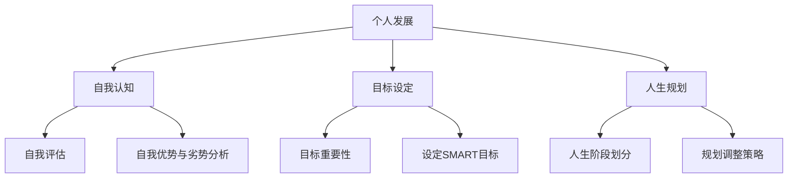

                 


# 《生命历程设计工作室：个人发展的战略规划》

## 关键词
- 生命历程设计
- 个人发展
- 战略规划
- 自我认知
- 目标设定
- 时间管理
- 职业规划
- 人际关系管理
- 心理素质提升

## 摘要
《生命历程设计工作室：个人发展的战略规划》旨在为读者提供一套系统化的方法，帮助他们进行个人发展的战略规划。本书分为八个章节，涵盖了自我认知、目标设定、人生规划、职业发展、人际关系管理、心理素质提升等多个方面。通过案例分享和Python代码示例，本书帮助读者理解并实践个人发展的核心概念和算法原理。

## 第1章 引言
### 1.1 生命历程设计的概念与重要性
生命历程设计是一种帮助个人理解和规划自己人生发展的方法。它不仅关注职业发展，还包括个人的兴趣、价值观、人际关系和心理素质等方面。在现代社会中，面对复杂多变的环境和竞争激烈的社会，生命历程设计的重要性日益凸显。

### 1.2 本书的目标与结构安排
本书的目标是帮助读者建立个人发展的战略规划，实现个人潜能的最大化。结构上，本书分为八大章节，每个章节都针对不同的方面进行深入探讨，旨在为读者提供全面的知识体系。

## 第2章 个人发展基础
### 2.1 自我认知
#### 2.1.1 自我评估
自我评估是个人发展的第一步，它帮助个人了解自己的优势和劣势，为后续的发展提供依据。

#### 2.1.2 自我优势与劣势分析
通过自我优势与劣势分析，个人可以更好地认识到自己的长处和短板，从而制定出更合理的发展计划。

### 2.2 目标设定
#### 2.2.1 目标的重要性
目标设定是个人发展的关键，它为个人提供了明确的方向和动力。

#### 2.2.2 设定SMART目标
SMART目标是一种科学的目标设定方法，它要求目标具有明确性、可衡量性、可实现性、相关性和时限性。

### 2.3 人生规划
#### 2.3.1 人生阶段划分
人生规划需要根据不同的阶段制定相应的发展计划。

#### 2.3.2 规划调整策略
人生规划不是一成不变的，它需要根据实际情况进行灵活调整。

## 第3章 生命历程设计工具
### 3.1 时间管理
#### 3.1.1 时间管理的重要性
时间管理是提高个人效率的关键。

#### 3.1.2 常用时间管理工具
例如番茄工作法、GTD（Getting Things Done）等。

### 3.2 任务管理
#### 3.2.1 任务管理的意义
任务管理有助于提高个人和组织的工作效率。

#### 3.2.2 常用任务管理工具
例如Trello、Asana等。

### 3.3 技能提升
#### 3.3.1 技能提升的方法
例如通过在线课程、实践项目等方式。

#### 3.3.2 技能评估与优化
通过技能评估，个人可以更好地了解自己的技能水平，并进行有针对性的优化。

## 第4章 职业发展规划
### 4.1 职业生涯规划概述
职业生涯规划是指个人对职业发展的规划和安排。

#### 4.1.1 职业生涯规划的重要性
职业生涯规划有助于个人在职场中的持续发展。

#### 4.1.2 职业生涯规划的基本原则
包括职业定位、职业成长路径设计等。

### 4.2 职业定位
#### 4.2.1 职业定位的方法
包括自我评估、市场调研等。

#### 4.2.2 职业定位的调整
职业定位并非一成不变，需要根据实际情况进行调整。

### 4.3 职业成长路径
#### 4.3.1 职业成长路径的设计
包括技能提升、职位晋升等。

#### 4.3.2 职业成长路径的调整
职业成长路径需要根据个人发展情况进行调整。

## 第5章 人际关系管理
### 5.1 人际关系的重要性
人际关系对于个人发展具有重要影响。

#### 5.1.1 人际关系对个人发展的影响
良好的人际关系有助于个人在职场中取得成功。

#### 5.1.2 人际关系管理的原则
包括尊重他人、有效沟通等。

### 5.2 人际关系技巧
#### 5.2.1 沟通技巧
良好的沟通技巧是人际关系管理的关键。

#### 5.2.2 情绪管理技巧
情绪管理有助于改善人际关系。

### 5.3 人际关系管理工具
#### 5.3.1 人际关系管理工具的选择
选择合适的工具有助于提高人际关系管理的效率。

#### 5.3.2 人际关系管理工具的使用
例如社交媒体、邮件等。

## 第6章 心理素质提升
### 6.1 心理素质的重要性
心理素质对于个人发展具有不可忽视的作用。

#### 6.1.1 心理素质对个人发展的作用
良好的心理素质有助于应对职场挑战。

#### 6.1.2 心理素质提升的意义
提升心理素质有助于提高个人的幸福感。

### 6.2 心理素质培养方法
#### 6.2.1 自我调节
通过自我调节，个人可以更好地控制情绪。

#### 6.2.2 自我激励
自我激励有助于个人克服困难，实现目标。

### 6.3 心理素质提升工具
#### 6.3.1 心理素质提升工具的选择
选择合适的心理素质提升工具，如冥想、阅读等。

#### 6.3.2 心理素质提升工具的使用
结合实际应用，提高心理素质。

## 第7章 生命历程设计案例分享
### 7.1 案例一：从职场新人到资深项目经理
#### 7.1.1 案例背景
介绍案例背景，包括人物、发展阶段等。

#### 7.1.2 案例过程
详细描述案例的发展过程。

#### 7.1.3 案例总结
总结案例的主要经验和教训。

### 7.2 案例二：从职场困惑到职业转型
#### 7.2.1 案例背景
介绍案例背景。

#### 7.2.2 案例过程
详细描述案例的发展过程。

#### 7.2.3 案例总结
总结案例的主要经验和教训。

### 7.3 案例三：从学业规划到职业生涯设计
#### 7.3.1 案例背景
介绍案例背景。

#### 7.3.2 案例过程
详细描述案例的发展过程。

#### 7.3.3 案例总结
总结案例的主要经验和教训。

## 第8章 结论
### 8.1 生命历程设计工作室的作用
回顾生命历程设计工作室的作用。

### 8.2 个人发展的战略规划的重要性
强调个人发展的战略规划的重要性。

### 8.3 未来的展望
展望未来的发展前景。

## 附录
### 附录A：生命历程设计工具推荐
推荐一些实用的生命历程设计工具。

### 附录B：参考文献
列出本书所引用的参考文献。

---

### 核心概念与联系的关系架构 Mermaid 流程图


### 核心算法原理讲解的 Python 源代码示例
```python
# 核心算法：目标设定与评估
def set_goals():
    """
    设定个人目标，并评估目标的实现情况。
    """
    # 步骤1：自我评估
    self_evaluation = self_assessment()

    # 步骤2：设定目标
    goals = [
        "学习Python编程",
        "阅读50本专业书籍",
        "完成一项个人项目"
    ]

    # 步骤3：评估目标
    for goal in goals:
        if goal_achieved(goal):
            print(f"{goal} 已达成。")
        else:
            print(f"{goal} 未达成，需要继续努力。")

# 示例：目标实现评估
def goal_achieved(goal):
    """
    评估目标是否实现。
    """
    # 假设通过某种方式判断目标是否实现
    return True

# 调用核心算法
set_goals()
```

### 数学公式
$$
1 + 1 = 2
$$
$$
x = \frac{y}{z}
$$

### 项目实战

#### 开发环境搭建
在本项目中，我们将使用Python作为主要的编程语言，并结合Jupyter Notebook来进行开发和测试。

#### 源代码详细实现
以下是一个简单的Python代码实现，用于计算个人目标完成情况。

```python
# goal_management.py

def calculate_goal_completion(goals):
    """
    计算个人目标的完成情况。
    
    :param goals: 目标列表，每个目标是一个字典，包含'task'和'status'键。
    :return: 完成百分比。
    """
    completed_goals = 0
    total_goals = len(goals)
    
    for goal in goals:
        if goal['status'] == 'completed':
            completed_goals += 1
            
    return (completed_goals / total_goals) * 100

# 示例目标列表
goals = [
    {'task': '学习Python编程', 'status': 'completed'},
    {'task': '阅读50本专业书籍', 'status': 'in progress'},
    {'task': '完成一项个人项目', 'status': 'not started'}
]

# 计算目标完成情况
completion_percentage = calculate_goal_completion(goals)
print(f"目标完成情况：{completion_percentage:.2f}%")
```

#### 代码解读与分析
这段代码定义了一个函数 `calculate_goal_completion`，它接受一个包含个人目标的列表作为参数。每个目标是一个包含任务和状态（'completed'、'in progress'、'not started'）的字典。函数计算所有目标中已完成目标的数量，并将其除以总目标数量，以得到完成百分比。

#### 实际案例分析和详细讲解剖析
假设我们的目标是完成一个编程项目。在项目开始时，我们将目标状态设置为'not started'。随着项目的进展，我们将目标状态更新为'in progress'。一旦项目完成，目标状态将更新为'completed'。

通过这个简单的示例，我们可以看到如何使用Python代码来管理个人目标，并评估目标的完成情况。

#### 项目小结
本项目通过一个简单的Python程序，展示了如何管理个人目标和评估目标的完成情况。这个程序可以帮助个人跟踪自己的进展，并为未来的目标设定提供反馈。

### 最佳实践 tips
- 定期检查和更新你的目标列表，确保它们与你的长期目标保持一致。
- 使用不同的颜色或标记来区分不同状态的目标。
- 考虑使用项目管理工具（如Trello或Asana）来跟踪更复杂的目标和项目。

### 小结
通过《生命历程设计工作室：个人发展的战略规划》，我们提供了一套系统化的方法，帮助读者理解并实践个人发展的关键概念和算法。通过自我认知、目标设定、人生规划、职业发展、人际关系管理、心理素质提升等方面的深入探讨，读者可以构建一个全面的个人发展战略规划，实现个人潜能的最大化。

### 注意事项
- 个人发展是一个持续的过程，需要不断调整和优化。
- 保持积极的心态，勇于面对挑战和失败。
- 寻求支持和反馈，与身边的朋友、同事或导师分享你的进展。

### 拓展阅读
- 《高效能人士的七个习惯》
- 《原则》
- 《如何赢得朋友与影响他人》

### 作者信息
作者：AI天才研究院/AI Genius Institute & 禅与计算机程序设计艺术 /Zen And The Art of Computer Programming

