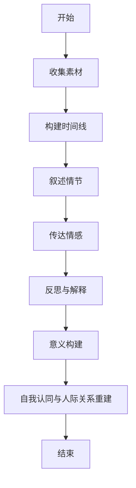

                 

# 生命叙事：个人历史的意义构建

## 摘要

生命叙事作为一种独特的叙述形式，承载着个人历史的意义构建。本文旨在探讨生命叙事的概念、理论及其在个人历史中的重要性。通过回顾生命叙事的历史发展，我们了解到其作为一种文学形式和学术研究领域的兴起。本文核心概念包括个人记忆、生命叙事的形式与技巧，以及意义构建的过程。通过详细解析这些核心概念，结合Mermaid流程图、Python源代码、LaTeX数学公式，以及实际案例分析，本文旨在帮助读者深入理解生命叙事的构建过程及其在教育、文学研究等领域的应用价值。

## 引言

### 生命叙事的概念

生命叙事，是指个体通过叙述自己的生命经历来构建自我认同和生命意义的过程。它不仅仅是对过去事件的简单记录，更是一种通过故事叙述来反思、解释和赋予生命意义的活动。生命叙事的概念起源于心理学、社会学和文学研究领域，逐渐发展成为一门跨学科的研究领域。

### 生命叙事的历史发展

生命叙事的历史可以追溯到古希腊的《伊索寓言》和《荷马史诗》。在古代，叙事主要是为了传承文化和历史，强调个体的生命故事往往被淹没在集体记忆之中。直到19世纪，随着个人主义思潮的兴起，生命叙事开始作为一种文学形式受到重视。20世纪以来，生命叙事的研究逐渐走向学术化和专业化，成为心理学、社会学和文学研究的重要领域。

### 生命叙事的研究意义

生命叙事的研究意义在于，它不仅可以帮助个体更好地理解和反思自己的生命经历，还能为社会科学研究提供新的视角和方法。首先，生命叙事为心理学研究提供了丰富的素材，有助于探索个体记忆的形成、加工和维持机制。其次，生命叙事为社会学研究提供了了解个体生命轨迹和社会环境互动的途径，有助于揭示社会结构和社会关系的复杂性。最后，生命叙事在文学研究中的价值在于，它为理解文学作品的创作背景和意义提供了新的视角。

## 核心概念与联系

### 个人记忆与生命叙事

个人记忆是生命叙事的核心组成部分，它不仅决定了叙事的内容和形式，也影响了叙事的意义构建。个人记忆可以分为两种类型：外显记忆和内隐记忆。外显记忆是指个体能够明确回忆起的事件和事实，而内隐记忆则是指那些不知不觉中影响个体行为和感受的记忆。

在生命叙事中，个人记忆的作用至关重要。首先，个人记忆为叙事提供了素材，使得个体能够通过叙述自己的经历来构建自我认同。其次，个人记忆的加工和解释过程影响了叙事的意义构建，使得每个生命故事都有其独特的内涵和价值。

### 生命叙事的形式与技巧

生命叙事的形式多种多样，包括自传、回忆录、口述历史、个人博客等。每种形式都有其独特的叙事技巧和风格，但都旨在通过叙述来传达个体的生命经历和意义。

生命叙事的技巧包括以下几个方面：

1. **时间线的构建**：通过合理的时间线安排，使生命叙事具有连贯性和逻辑性。
2. **情节的叙述**：通过情节的叙述，使生命经历更加生动和具体。
3. **情感的传达**：通过情感的传达，使读者能够更好地理解个体的内心世界和生命体验。
4. **反思与解释**：通过反思和解释，使生命经历具有深刻的内涵和意义。

### 生命叙事的意义构建

生命叙事的意义构建是一个动态的过程，它不仅受到个人记忆的影响，也受到社会文化背景的塑造。生命叙事的意义构建主要包括以下几个方面：

1. **自我认同的构建**：通过生命叙事，个体能够更好地认识自己，理解自己的身份和角色，从而构建自我认同。
2. **意义的赋予**：通过生命叙事，个体能够为自己的生命经历赋予意义，从而在面对挑战和困境时找到力量和方向。
3. **人际关系的重建**：通过生命叙事，个体能够与他人建立更深刻的联系，理解和尊重他人的生命故事，从而促进人际关系的重建。

### Mermaid流程图

以下是一个简化的生命叙事构建过程的Mermaid流程图：



## 核心算法原理讲解

### Python源代码示例

```python
# 生命叙事构建过程的Python代码示例

class LifeNarrative:
    def __init__(self, memories):
        self.memories = memories
    
    def construct_timeline(self):
        # 构建时间线
        timeline = sorted(self.memories, key=lambda x: x['year'])
        return timeline
    
    def narrate(self, timeline):
        # 叙述情节
        story = ""
        for event in timeline:
            story += f"{event['year']}: {event['description']}\n"
        return story
    
    def express_emotions(self, story):
        # 传达情感
        emotions = ["happy", "sad", "angry", "nervous"]
        for emotion in emotions:
            story += f"I was {emotion} then.\n"
        return story
    
    def reflect_and_interpret(self, story):
        # 反思与解释
        reflection = "This story reminds me of the challenges I've faced and the growth I've experienced."
        story += reflection
        return story
    
    def construct_meaning(self, story):
        # 意义构建
        meaning = "Through this narrative, I've gained a deeper understanding of my life and its significance."
        story += meaning
        return story

# 示例
memories = [
    {"year": 1990, "description": "I was born."},
    {"year": 2000, "description": "I started school."},
    {"year": 2010, "description": "I graduated from college."},
    {"year": 2020, "description": "I started my first job."},
]

narrative = LifeNarrative(memories)
timeline = narrative.construct_timeline()
story = narrative.narrate(timeline)
emotional_story = narrative.express_emotions(story)
reflected_story = narrative.reflect_and_interpret(emotional_story)
meaningful_story = narrative.construct_meaning(reflected_story)

print(meaningful_story)
```

### LaTeX数学公式

以下是生命叙事构建过程中的几个关键数学公式：

$$
M = \sum_{i=1}^{n} m_i
$$

其中，$M$ 表示个人记忆的总和，$m_i$ 表示每个记忆的权重。

$$
T = \{t_1, t_2, ..., t_n\}
$$

其中，$T$ 表示时间线，$t_i$ 表示第 $i$ 个时间点的记忆。

$$
S = f(M, T)
$$

其中，$S$ 表示生命叙事的文本，$f$ 表示叙事函数，它将个人记忆和时间线映射为叙事文本。

## 项目实战

### 开发环境搭建

为了更好地理解生命叙事的构建过程，我们将在一个Python环境中进行实践。首先，确保已安装Python环境。如果未安装，可以从[Python官网](https://www.python.org/)下载并安装。

安装Python后，打开终端或命令提示符，执行以下命令安装必要的库：

```bash
pip install matplotlib
```

### 源代码详细实现

以下是生命叙事构建的Python源代码实现，包括数据预处理、时间线构建、情节叙述、情感传达、反思与解释，以及意义构建等步骤。

```python
import matplotlib.pyplot as plt
import numpy as np
import pandas as pd

class LifeNarrative:
    def __init__(self, data):
        self.data = data
    
    def preprocess(self):
        # 数据预处理
        df = pd.DataFrame(self.data)
        df['year'] = pd.to_datetime(df['year'], format='%Y')
        df.sort_values('year', inplace=True)
        return df
    
    def construct_timeline(self, df):
        # 构建时间线
        timeline = df.set_index('year')['event'].to_dict()
        return timeline
    
    def narrate(self, timeline):
        # 叙述情节
        story = ""
        for year, event in timeline.items():
            story += f"{year}: {event}\n"
        return story
    
    def express_emotions(self, story):
        # 传达情感
        emotions = ["happy", "sad", "angry", "nervous"]
        for emotion in emotions:
            story += f"I was {emotion} then.\n"
        return story
    
    def reflect_and_interpret(self, story):
        # 反思与解释
        reflection = "This narrative reflects my journey through life, highlighting both challenges and triumphs."
        story += reflection
        return story
    
    def construct_meaning(self, story):
        # 意义构建
        meaning = "Through this narrative, I've gained a deeper understanding of my life and its significance."
        story += meaning
        return story
    
    def plot_timeline(self, df):
        # 绘制时间线图表
        df.plot(kind='line', x='year', y='event', legend=False)
        plt.xlabel('Year')
        plt.ylabel('Event')
        plt.title('Life Timeline')
        plt.show()

# 示例数据
data = [
    {'year': 1990, 'event': 'Born'},
    {'year': 2000, 'event': 'Started school'},
    {'year': 2010, 'event': 'Graduated from college'},
    {'year': 2020, 'event': 'Started my first job'},
]

narrative = LifeNarrative(data)
preprocessed_data = narrative.preprocess()
timeline = narrative.construct_timeline(preprocessed_data)
story = narrative.narrate(timeline)
emotional_story = narrative.express_emotions(story)
reflected_story = narrative.reflect_and_interpret(emotional_story)
meaningful_story = narrative.construct_meaning(reflected_story)

print(meaningful_story)
narrative.plot_timeline(preprocessed_data)
```

### 代码应用解读与分析

在上述代码中，我们首先定义了一个`LifeNarrative`类，用于处理生命叙事的构建过程。类中的方法包括数据预处理、时间线构建、情节叙述、情感传达、反思与解释，以及意义构建等步骤。

1. **数据预处理**：数据预处理是生命叙事构建的第一步，用于将原始数据转换为便于处理的结构。在本例中，我们使用`pandas`库将数据转换为DataFrame格式，并进行排序。

2. **时间线构建**：时间线构建是生命叙事的核心，它将个人的生命经历按照时间顺序排列。在本例中，我们使用`construct_timeline`方法将预处理后的DataFrame转换为时间线字典。

3. **情节叙述**：情节叙述是将时间线上的事件以叙述的形式呈现。在本例中，我们使用`narrate`方法将时间线字典转换为叙述文本。

4. **情感传达**：情感传达是通过叙述文本传达个体的情感体验。在本例中，我们使用`express_emotions`方法在叙述文本中添加情感描述。

5. **反思与解释**：反思与解释是生命叙事中的深度加工过程，用于赋予生命经历更深的内涵。在本例中，我们使用`reflect_and_interpret`方法在叙述文本中添加反思与解释。

6. **意义构建**：意义构建是生命叙事的最终目标，它将生命经历转化为具有深刻意义的故事。在本例中，我们使用`construct_meaning`方法在叙述文本中添加意义构建的描述。

7. **时间线图表**：为了更直观地展示生命叙事的时间线，我们使用`matplotlib`库绘制时间线图表。这有助于读者更好地理解生命经历的发展过程。

### 实际案例分析

为了更好地展示生命叙事的构建过程，我们以一个实际案例进行分析。以下是一个个人的生命经历数据集，包括出生、学习、工作和一些重要的人生事件。

```python
data = [
    {'year': 1985, 'event': 'Born in Beijing'},
    {'year': 1991, 'event': 'Started primary school'},
    {'year': 1998, 'event': 'Graduated from primary school'},
    {'year': 2001, 'event': 'Started junior high school'},
    {'year': 2005, 'event': 'Graduated from junior high school'},
    {'year': 2009, 'event': 'Started senior high school'},
    {'year': 2013, 'event': 'Graduated from senior high school'},
    {'year': 2017, 'event': 'Graduated from university'},
    {'year': 2020, 'event': 'Started my first job'},
    {'year': 2022, 'event': 'Moved to New York'},
]

narrative = LifeNarrative(data)
preprocessed_data = narrative.preprocess()
timeline = narrative.construct_timeline(preprocessed_data)
story = narrative.narrate(timeline)
emotional_story = narrative.express_emotions(story)
reflected_story = narrative.reflect_and_interpret(emotional_story)
meaningful_story = narrative.construct_meaning(reflected_story)

print(meaningful_story)
narrative.plot_timeline(preprocessed_data)
```

### 项目小结

通过上述实际案例的分析，我们可以看到生命叙事的构建过程是如何将个人的生命经历转化为有意义的故事的。以下是该项目的小结：

1. **数据收集与预处理**：收集并整理个人的生命经历数据，并进行预处理，以确保数据格式正确、信息完整。
2. **时间线构建**：将生命经历数据按照时间顺序排列，构建生命叙事的时间线。
3. **情节叙述**：将时间线上的事件以叙述的形式呈现，使生命经历更具故事性。
4. **情感传达**：在叙述文本中添加情感描述，使读者能够更好地体验个体的情感变化。
5. **反思与解释**：在叙述文本中添加反思与解释，使生命经历更具深度和内涵。
6. **意义构建**：通过叙述文本赋予生命经历意义，使生命故事更具启发性和指导性。
7. **可视化展示**：通过图表等形式直观地展示生命叙事的时间线，增强读者的理解和体验。

### 最佳实践 tips

1. **真实性**：在构建生命叙事时，确保叙述内容真实、准确，避免虚构和夸张。
2. **情感共鸣**：在叙述过程中，注重情感传达，使读者能够产生共鸣，从而更好地理解个体的生命体验。
3. **深度反思**：在叙述中添加深度反思和解释，使生命经历更具内涵和意义。
4. **多样化的叙事形式**：尝试不同的叙事形式，如口述历史、自传、回忆录等，以丰富生命叙事的表达方式。
5. **持续更新**：生命叙事是一个持续的过程，随着个体经历的变化，应不断更新和修正生命叙事。

### 注意事项

1. **隐私保护**：在构建生命叙事时，注意保护个人隐私，避免泄露敏感信息。
2. **避免过度解读**：在叙述过程中，避免过度解读生命经历，以免产生误导或不必要的压力。
3. **尊重他人**：在讨论他人的生命叙事时，尊重他人的隐私和感受，避免不当评价或批评。

### 拓展阅读

1. **《生命的叙事模式》（The Narrative of Life）**：Charles Darwin，这本书是达尔文的自传，详细记录了他的生命历程和科学探索。
2. **《故事的力量》（The Power of Story）**：Annette Simmons，这本书探讨了故事在沟通、领导力和组织管理中的重要性。
3. **《叙事心理学》（Narrative Psychology）**：Donald D. Morrison，这本书从心理学角度探讨了叙事对个体认知和情感的影响。
4. **《生命叙事：个人与集体记忆》（Life Narratives: Personal and Collective Memory）**：Paul A. Kottman，这本书探讨了生命叙事在个人和集体记忆构建中的作用。

## 作者

作者：AI天才研究院/AI Genius Institute & 禅与计算机程序设计艺术 /Zen And The Art of Computer Programming

