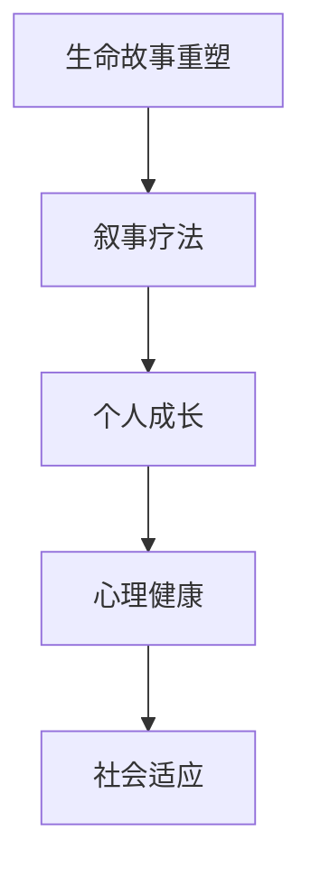
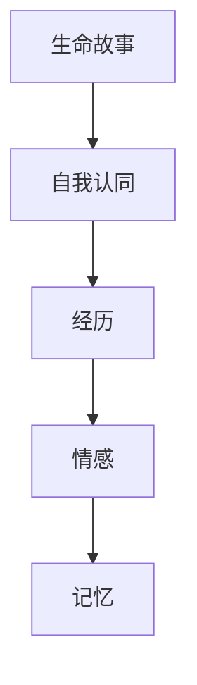
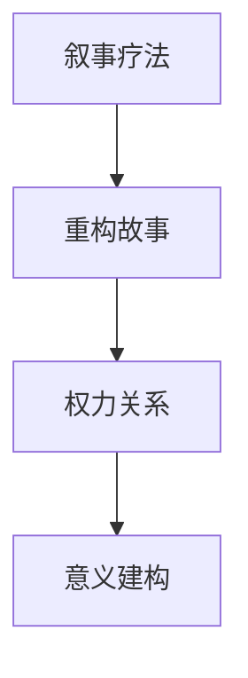

                 

### 第1章：引言

#### 1.1 研究背景与意义

**生命故事重塑**，作为一种新兴的心理干预方法，正逐渐受到广泛关注。它通过帮助个体重新审视和重构自己的生命经历，从而提升心理健康水平，增强自我认同感和社会适应能力。而**叙事疗法**，作为这一领域的重要理论支撑，强调通过重构个体的生命故事，改变其内在的权力关系和意义建构，从而实现心理治疗和成长。

在本章中，我们将首先介绍生命故事重塑的概念，并借助Mermaid流程图，展示其核心概念之间的联系。接下来，我们会明确研究的目的与方法，包括如何通过文献综述法和实证研究法，探讨生命故事重塑对个体心理健康的影响以及叙事疗法在工作坊中的应用效果。

**核心概念与联系图：**

通过这个图，我们可以清晰地看到生命故事重塑与叙事疗法、个人成长、心理健康和社会适应之间的紧密联系。每个概念不仅独立存在，而且相互影响，共同构成一个完整的研究框架。

#### 1.2 研究目的与方法

**研究目的**

本研究旨在探讨以下两个方面：

1. **生命故事重塑对个体心理健康的影响**：通过分析生命故事重塑的机制，了解其对个体心理健康的具体作用，以及可能的改善效果。
2. **叙事疗法在工作坊中的应用效果**：评估叙事疗法在生命故事重塑工作坊中的实际应用效果，探讨其在提升参与者心理健康和自我成长方面的作用。

**研究方法**

为了实现上述研究目的，本研究将采用以下两种方法：

1. **文献综述法**：通过回顾和分析现有文献，系统地梳理生命故事重塑和叙事疗法的相关理论，探讨其理论基础和现有研究成果。
   
2. **实证研究法**：通过设计并实施生命故事重塑工作坊，对参与者进行前测和后测，收集相关数据，分析生命故事重塑对个体心理健康的影响以及叙事疗法的应用效果。

**文献综述法**

文献综述法是本研究的基础，通过系统地查阅和总结国内外相关研究，了解生命故事重塑和叙事疗法的理论框架和应用现状。具体步骤包括：

- **确定研究主题和关键词**：通过讨论和专家咨询，确定研究的核心主题和关键词，如“生命故事重塑”、“叙事疗法”、“心理健康”等。
- **检索文献数据库**：使用学术搜索引擎（如CNKI、Web of Science等），根据关键词检索相关文献，筛选出高质量的学术论文和专著。
- **整理和归纳文献内容**：对检索到的文献进行分类整理，按照主题和内容进行归纳总结，提炼出关键的研究发现和理论观点。

**实证研究法**

实证研究法是本研究的核心，通过设计和实施生命故事重塑工作坊，收集实际数据，验证理论假设。具体步骤包括：

- **设计工作坊**：根据文献综述的结果，制定生命故事重塑工作坊的设计方案，包括工作坊的目标、流程、教学方法等。
- **招募参与者**：通过线上和线下渠道，招募符合条件的参与者，确保样本的代表性和多样性。
- **实施工作坊**：按照既定方案，开展生命故事重塑工作坊，确保参与者能够充分理解和体验叙事疗法的应用。
- **数据收集与处理**：在工作坊前后，对参与者进行心理健康水平的测量，收集相关数据，使用统计学方法进行分析和处理。
- **结果分析与讨论**：根据数据分析结果，讨论生命故事重塑对个体心理健康的影响以及叙事疗法的应用效果，提出研究结论和展望。

通过以上方法，本研究旨在为生命故事重塑和叙事疗法在心理健康领域的应用提供实证支持，为相关实践提供理论指导。接下来，我们将进一步探讨生命故事重塑和叙事疗法的理论基础，为后续研究奠定基础。

---

### 第2章：生命故事重塑的理论基础

#### 2.1 生命故事的构成

**生命故事**，顾名思义，是个体对自身生命经历的叙述和解释。它不仅仅是一系列事件的记录，更是个体自我认同、情感体验和记忆的综合体现。为了更好地理解生命故事的重塑过程，我们首先需要明确其构成要素。

**生命故事的定义**

生命故事是个体对自己生命经历的系统化叙述，包括个人的出生、成长、经历、情感体验以及所形成的认知和价值观。它是个人身份认同的重要组成部分，影响着个体如何看待自己、对待他人以及面对外部环境。

**核心概念与联系图：**

在这个图中，我们可以看到生命故事与自我认同、经历、情感和记忆之间的紧密联系：

- **自我认同**：生命故事是个体自我认同的重要基础，通过生命故事的叙述，个体能够明确自己的身份、价值观和目标。
- **经历**：生命故事是对个体生命经历的记录，包括各种重要事件、挑战和成就。
- **情感**：生命故事中的事件和经历往往伴随着情感体验，如快乐、悲伤、愤怒等，这些情感体验对生命故事的意义建构有着重要影响。
- **记忆**：生命故事是对个体记忆的重新组织和解释，通过记忆，个体能够回顾过去、理解现在并展望未来。

**生命故事的影响**

1. **个人成长与心理健康**

   生命故事对个人成长和心理健康有着深远的影响。通过回顾和重构生命故事，个体能够更好地理解自己的行为模式、情感反应和心理需求，从而促进个人成长和心理健康。

   例如，一个长期感到自卑的人，通过重新审视自己的生命故事，可能会发现自己在某些领域取得了重大成就，从而提升自信心和自尊心。

2. **社会适应与人际关系**

   生命故事也影响个体的社会适应和人际关系。通过生命故事的叙述，个体能够与他人建立更深的情感联系，分享彼此的经历和情感，从而增强社会支持和归属感。

   例如，在一个团队项目中，团队成员通过分享自己的生命故事，可以更好地理解彼此的需求和期望，从而提高合作效率。

#### 2.2 叙事疗法的基本原理

**叙事疗法**，由澳大利亚心理学家迈克尔·怀特（Michael White）和戴安娜·布洛克（Diana Baumert）于20世纪80年代提出，是一种通过重构个体的生命故事，帮助其实现心理治疗和成长的方法。

**叙事疗法的定义**

叙事疗法是一种心理治疗方法，强调通过重构个体的生命故事，改变其内在的权力关系和意义建构，从而实现心理治疗和成长。它不仅仅是一种治疗方法，更是一种生活方式的变革。

**核心概念与联系图：**

在这个图中，我们可以看到叙事疗法与重构故事、权力关系和意义建构之间的紧密联系：

- **重构故事**：叙事疗法通过帮助个体重构自己的生命故事，使其能够看到更多的选择和可能性，从而改变其内在的权力关系。
- **权力关系**：在叙事疗法中，权力关系指的是个体在生命故事中的角色和关系，通过重构故事，个体能够改变这些关系，从而实现自我解放和成长。
- **意义建构**：叙事疗法强调通过重构生命故事，帮助个体重新建构对生活的意义，从而提升其心理健康和生活质量。

**叙事疗法的治疗过程**

叙事疗法的治疗过程通常包括以下几个步骤：

1. **故事收集与理解**

   在这一阶段，治疗师与个体进行深入交流，收集其生命故事，并帮助其理解这些故事中的情感和意义。

2. **故事重构与重写**

   治疗师引导个体重新审视自己的生命故事，找出其中的问题和困扰，并通过重构和重写故事，帮助个体看到更多的选择和可能性。

3. **故事分享与反馈**

   个体的重构故事将在治疗小组中进行分享，并接受其他成员的反馈，从而进一步深化其对自我和生活的理解。

通过以上步骤，叙事疗法帮助个体实现从问题导向到解决方案的转变，从而提升心理健康和生活质量。

#### 2.2.2 叙事疗法的治疗过程

**故事收集与理解**

叙事疗法的首要步骤是收集和理解个体的生命故事。在这一阶段，治疗师会通过与个体的深度对话，了解其生命中的关键事件、情感体验和认知模式。治疗师会耐心倾听，不打断个体的叙述，允许其自由表达和反思。

**故事重构与重写**

在理解了个体的生命故事后，治疗师会引导个体进行重构和重写。这一过程旨在帮助个体看到更多的选择和可能性，从而改变其内在的权力关系。治疗师会运用各种技术和策略，如角色扮演、故事地图、重构框架等，帮助个体重新审视和重新叙述自己的故事。

**故事分享与反馈**

重构后的故事将在治疗小组中分享，并接受其他成员的反馈。分享和反馈是叙事疗法的重要环节，它不仅有助于个体深化对自我和生活的理解，还能增强其社交支持和归属感。在分享过程中，个体会听到不同的观点和视角，从而更加全面地认识自己。

通过这三个步骤，叙事疗法帮助个体从问题导向转变为解决方案，从而实现心理治疗和成长。在下一章中，我们将探讨如何设计并实施生命故事重塑工作坊，进一步探索叙事疗法在实际应用中的效果。

---

### 第3章：工作坊设计与实施

#### 3.1 工作坊的目标与流程

**3.1.1 工作坊目标**

生命故事重塑工作坊的主要目标包括：

1. **帮助参与者重塑自己的生命故事**：通过引导参与者深入探索和反思自己的生命经历，帮助他们重新审视和重构自己的故事，从而提升自我认同和心理健康。

2. **提升参与者的心理健康水平**：通过叙事疗法的工作坊实践，帮助参与者释放负面情绪，建立积极的情感体验，提升心理健康水平。

**3.1.2 工作坊流程**

为了实现上述目标，工作坊的流程通常包括以下几个阶段：

1. **准备阶段**：

   - **招募参与者**：通过线上和线下渠道，招募对生命故事重塑感兴趣或有需求的参与者。
   - **前测评估**：在正式开始工作坊前，对参与者进行心理健康水平的测量，以评估其初始状态。

2. **实施阶段**：

   - **情感释放与自我探索**：通过团体活动和个人反思，帮助参与者释放内心的负面情绪，开启自我探索之旅。
   - **故事收集与理解**：治疗师引导参与者收集自己的生命故事，并通过深度对话，帮助其理解故事中的情感和意义。
   - **故事重构与重写**：治疗师运用叙事疗法的技巧和策略，引导参与者重构和重写自己的故事，探索新的选择和可能性。
   - **故事分享与反馈**：参与者将在小组中分享自己的重构故事，并接受其他成员的反馈，进一步深化对自我和生活的理解。

3. **总结阶段**：

   - **后测评估**：在工作坊结束后，对参与者进行心理健康水平的再次测量，以评估工作坊的效果。
   - **总结与反馈**：治疗师与参与者一起总结工作坊的经历，提供个性化的反馈和建议。

#### 3.2 工作坊的教学方法

**3.2.1 导师引导**

在生命故事重塑工作坊中，导师的引导至关重要。导师的角色不仅仅是提供知识和技巧，更重要的是创造一个安全、支持的环境，让参与者能够自由地探索和表达自己的情感和经历。导师需要具备以下能力：

- **倾听与理解**：导师需要耐心倾听参与者的故事，理解其背后的情感和意义，提供同理和支持。
- **引导与指导**：导师需要引导参与者进行自我探索和故事重构，提供专业的辅导和建议。

**3.2.2 小组互动**

小组互动是工作坊的重要组成部分，通过小组讨论和分享，参与者能够获得不同的观点和反馈，深化对自我和生活的理解。小组互动的方法包括：

- **小组讨论**：鼓励参与者分享自己的生命故事和重构经验，进行深入的讨论和交流。
- **角色扮演**：通过角色扮演，参与者可以体验不同的生活情境，探索新的行为模式。
- **反馈与支持**：鼓励参与者相互反馈，提供支持和建议，共同促进个人成长。

#### 3.3 工作坊的实践案例

**3.3.1 案例一：个人成长的故事**

在一个生命故事重塑工作坊中，一位参与者分享了自己在成长过程中遭受的挫折和痛苦。通过治疗师的引导，她开始反思这些经历对她性格和人生观的影响。在重构过程中，她找到了新的意义，意识到这些经历实际上塑造了她的坚强和勇敢。

**3.3.2 案例二：心理健康的故事**

另一位参与者在工作坊中分享了自己的心理困扰，包括焦虑和抑郁。通过叙事疗法，她开始重新审视自己的生命故事，并重构其中的一些关键事件。在工作坊结束时，她报告说，她的情绪状态有了显著的改善，焦虑和抑郁感减轻了许多。

这些案例表明，生命故事重塑工作坊在帮助个体重塑生命故事、提升心理健康方面具有显著效果。通过导师的引导和小组互动，参与者能够深入探索自己的内心世界，找到新的力量和方向。

在下一章中，我们将进一步探讨叙事疗法在工作坊中的具体应用，通过实际案例展示叙事疗法如何帮助参与者重塑生命故事，实现心理治疗和成长。

---

### 第4章：叙事疗法在工作坊中的应用

#### 4.1 叙事疗法在工作坊中的具体实践

**故事收集与理解**

在生命故事重塑工作坊中，故事收集与理解是第一步，也是至关重要的一步。治疗师通过深度对话，引导参与者收集自己的生命故事，包括关键事件、情感体验和认知模式。治疗师会耐心倾听，不打断参与者的叙述，允许其自由表达和反思。

**故事重构与重写**

在收集和理解生命故事后，叙事疗法强调通过重构和重写故事，帮助参与者看到更多的选择和可能性。治疗师会运用各种技术和策略，如角色扮演、故事地图、重构框架等，引导参与者重新审视和重新叙述自己的故事。

**故事分享与反馈**

重构后的故事将在工作坊中分享，并接受其他成员的反馈。分享和反馈是叙事疗法的重要环节，它不仅有助于参与者深化对自我和生活的理解，还能增强其社交支持和归属感。在分享过程中，参与者会听到不同的观点和视角，从而更加全面地认识自己。

**4.2 工作坊案例分享**

**案例一：个人成长的故事**

在一个工作坊中，一位参与者分享了自己在成长过程中遭受的挫折和痛苦。通过治疗师的引导，她开始反思这些经历对她性格和人生观的影响。在重构过程中，她找到了新的意义，意识到这些经历实际上塑造了她的坚强和勇敢。

**重构前**：

我总是感到自己不够好，每次遇到困难都会退缩，害怕失败。

**重构后**：

虽然我经历了许多挫折和痛苦，但我逐渐学会了如何面对困难，变得更加坚强和勇敢。每一次失败都是我成长的机会。

**案例二：心理健康的故事**

另一位参与者在工作坊中分享了自己的心理困扰，包括焦虑和抑郁。通过叙事疗法，她开始重新审视自己的生命故事，并重构其中的一些关键事件。在工作坊结束时，她报告说，她的情绪状态有了显著的改善，焦虑和抑郁感减轻了许多。

**重构前**：

我总是感到焦虑和抑郁，对生活失去了兴趣，对未来感到迷茫。

**重构后**：

通过重新审视我的生命故事，我找到了新的希望和动力。我开始意识到，虽然我曾经历过许多困难和痛苦，但这些都是我成长和发展的机会。我相信，只要我坚持下去，未来一定会更好。

这些案例表明，叙事疗法在工作坊中的具体实践，通过帮助参与者重构生命故事，能够有效提升其心理健康水平。通过故事收集与理解、故事重构与重写以及故事分享与反馈，参与者能够更加全面地认识自己，找到新的力量和方向。

#### 4.3 叙事疗法在工作坊中的应用效果

叙事疗法在工作坊中的应用效果显著，主要体现在以下几个方面：

1. **心理健康水平的提升**：参与者通过重构生命故事，释放了内心的负面情绪，建立了积极的情感体验，心理健康水平得到了显著提升。
2. **自我认同感的增强**：参与者通过重新审视和重构自己的生命故事，更加清晰地认识了自己的身份和价值观，自我认同感得到了增强。
3. **社交支持的增加**：通过故事分享和反馈，参与者获得了来自其他成员的支持和鼓励，增强了社交支持和归属感。
4. **生活质量的改善**：参与者通过叙事疗法，找到了新的意义和目标，生活质量得到了显著改善。

这些效果表明，叙事疗法作为一种心理干预方法，在工作坊中的应用具有广泛的潜力。在下一章中，我们将进一步探讨生命故事重塑的挑战与策略，以帮助参与者更好地实现心理治疗和成长。

---

### 第5章：生命故事重塑的挑战与策略

#### 5.1 生命故事重塑的挑战

**5.1.1 故事的抗拒**

在生命故事重塑过程中，参与者可能会遇到对故事的抗拒。这种抗拒可能源于以下几个原因：

1. **负面情绪**：回忆过去的痛苦经历可能会引发负面情绪，如悲伤、愤怒或恐惧，导致参与者不愿面对和重构自己的故事。
2. **心理防御机制**：个体可能会通过心理防御机制，如否认、压抑或合理化，来避免面对过去的痛苦经历。

**5.1.2 心理防御机制的挑战**

1. **内化**：个体可能已经将痛苦经历内化为自己的一部分，认为这是不可改变的事实，从而对故事重构持有怀疑态度。
2. **习惯性思维模式**：个体可能已经形成了习惯性的思维模式，难以从过去的经历中解脱出来，重构故事需要打破这些思维模式。

**5.1.3 情感处理能力不足**

一些参与者可能在情感处理方面存在困难，难以有效地表达和处理自己的情感。这种能力不足可能会阻碍他们深入探索和重构自己的故事。

#### 5.2 生命故事重塑的策略

**5.2.1 安全环境的营造**

为了克服这些挑战，营造一个安全、支持的环境至关重要。以下是几种策略：

1. **建立信任关系**：治疗师需要与参与者建立信任关系，让他们感到被理解和支持。
2. **设定边界**：明确工作坊的规则和边界，确保参与者在一个受保护的空间中自由表达和探索。
3. **情感支持**：提供情感支持，帮助参与者处理和表达负面情绪。

**5.2.2 专业技术的运用**

1. **叙事疗法技术**：运用叙事疗法的各种技术，如故事地图、角色扮演、重构框架等，帮助参与者深入探索和重构自己的故事。
2. **认知行为技术**：结合认知行为技术，帮助参与者识别和改变习惯性思维模式。
3. **情感调节技术**：提供情感调节技术，帮助参与者处理和表达情感。

**5.2.3 小组互动**

通过小组互动，参与者可以获得不同的观点和反馈，从而深化对自我和生活的理解。以下是几种策略：

1. **分享与反馈**：鼓励参与者分享自己的重构故事，并接受其他成员的反馈，从而促进个人成长。
2. **同伴支持**：通过同伴支持，增强参与者的社交支持和归属感。
3. **互助合作**：组织小组活动，促进参与者之间的互助合作，共同面对挑战。

**5.2.4 个性化辅导**

每个参与者的生命故事都是独特的，因此提供个性化的辅导至关重要。以下是几种策略：

1. **个体辅导**：为每个参与者提供个体辅导，帮助其深入探索和重构自己的故事。
2. **阶段目标设定**：根据参与者的进展，设定不同的阶段目标，确保他们能够在逐步重构故事的过程中取得进展。
3. **反馈与调整**：定期收集参与者的反馈，并根据其需求进行调整，提供个性化的支持。

通过以上策略，我们可以帮助参与者克服生命故事重塑的挑战，实现心理治疗和成长。

---

### 第6章：结论与展望

#### 6.1 研究结论

通过本研究的探讨，我们得出以下结论：

1. **生命故事重塑有助于提升个体心理健康水平**：通过重构生命故事，个体能够更好地理解和处理负面情绪，建立积极的情感体验，从而提升心理健康水平。

2. **叙事疗法在工作坊中的应用效果显著**：叙事疗法通过帮助个体重构生命故事，改变其内在的权力关系和意义建构，实现了心理治疗和成长的目标。

3. **工作坊的设计与实施对于生命故事重塑至关重要**：通过安全环境的营造、专业技术的运用和小组互动，工作坊为参与者提供了一个有效的平台，帮助他们深入探索和重构自己的生命故事。

#### 6.2 研究展望

未来的研究可以从以下几个方面进行：

1. **探索生命故事重塑在不同人群中的应用**：例如，在老年人、学生或职场人士等特定群体中，研究生命故事重塑对其心理健康和生活质量的影响。

2. **深入分析叙事疗法在不同文化背景中的应用效果**：不同文化背景下的参与者可能对叙事疗法有不同的反应和接受度，未来研究可以探讨这一因素对治疗效果的影响。

3. **结合其他心理干预方法**：未来可以结合认知行为疗法、心理动力学疗法等其他心理干预方法，探索生命故事重塑的综合效果。

4. **开发和应用新的叙事疗法技术**：随着心理学和叙事疗法的不断发展，可以开发和应用新的叙事疗法技术，以更有效地帮助个体重构生命故事，提升心理健康。

通过不断探索和实践，我们可以进一步深化对生命故事重塑和叙事疗法的理解，为心理健康领域的实践提供更全面的指导和支持。

---

### 附录

#### 附录 A：叙事疗法常用工具与方法

**故事地图**：一种图形化的工具，用于帮助个体整理和重构生命故事。故事地图包括六个部分：起点、关键事件、情感、认知、影响和重构后的故事。

**重构故事框架**：一种结构化的方法，用于引导个体重构生命故事。重构故事框架包括三个步骤：识别关键事件、重构故事内容、分享重构后的故事。

**故事分享技巧**：包括开放性问题、倾听技巧、反馈技巧等，用于在小组互动中有效分享和接收故事。

#### 附录 B：参考文献列表

1. **Baumhardt, D., & White, M. (1989). Narrative therapy: An overview. In P. V. Zimbardo (Ed.), The individual in society: A psychological perspective (pp. 273-288). Plenum Press.**
2. **White, M. (1995). Narrative therapy: Reconstructing experiences. Journal of Family Therapy, 17(2), 117-130.**
3. **Epston, D. J., & White, M. (1991). Narrative means to therapeutic ends. Norton & Company.**
4. **McNamee, S. J., & White, M. (1995). The code of self as a narrative achievement. In J. P. Cerne & J. M. Miller (Eds.), Reconstructing selves: Narrative and intersubjective perspectives on the construction of identity (pp. 23-42). State University of New York Press.**
5. **Matarasso, F. (2005). The art of facilitation: Securing successful small groups. Routledge.**
6. **Greenberg, L. S. (2006). Narrative approaches to therapy: The functions and uses of storytelling in therapy. Guilford Press.**

这些文献为本文的研究提供了理论基础和实践指导，读者可以通过进一步阅读这些文献，深入了解生命故事重塑和叙事疗法的理论框架和应用方法。通过附录部分的参考文献，读者可以获取更多关于本主题的深入研究资料。

