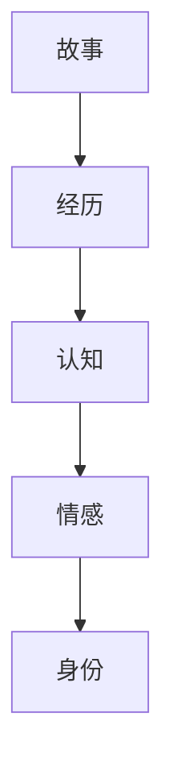
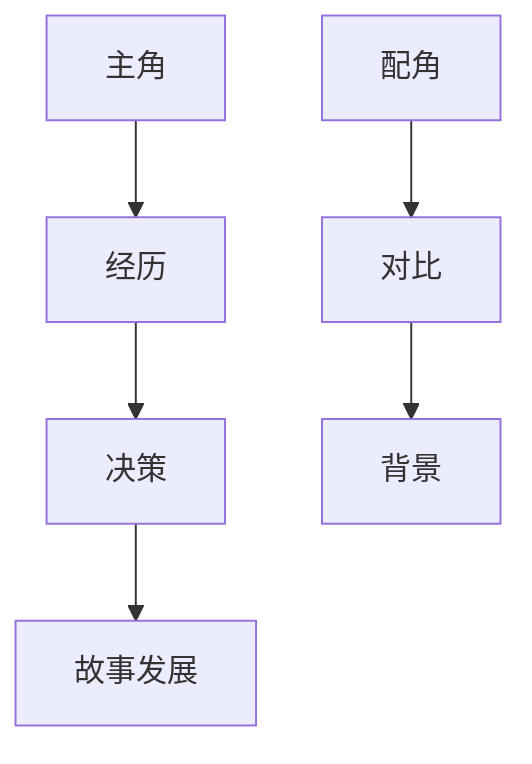
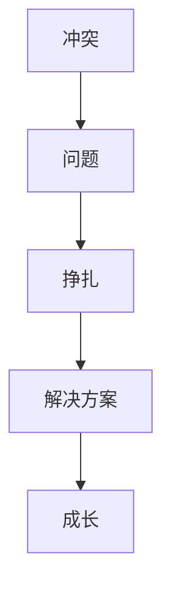
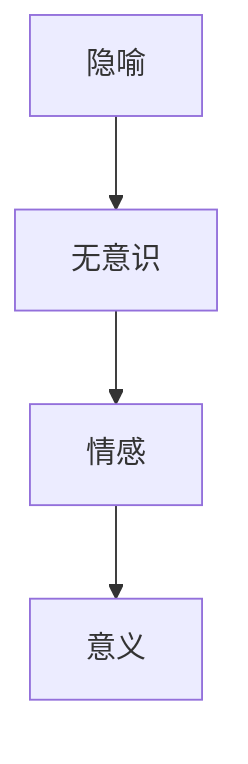
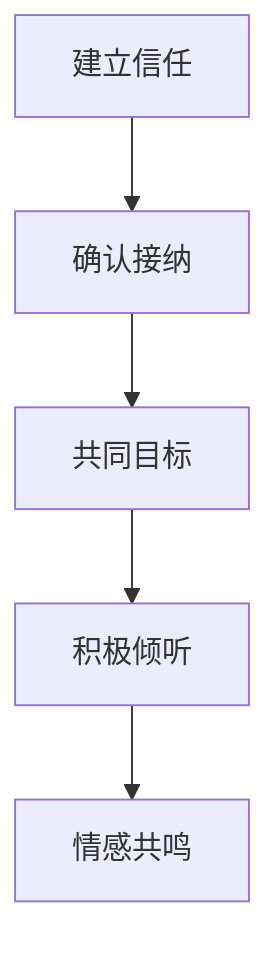
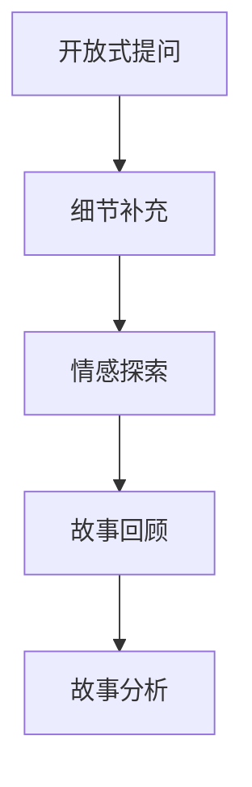
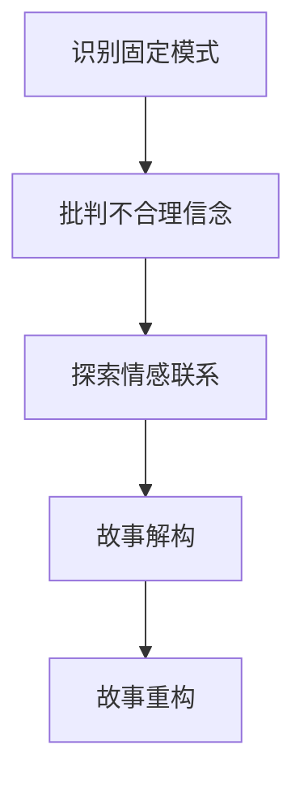
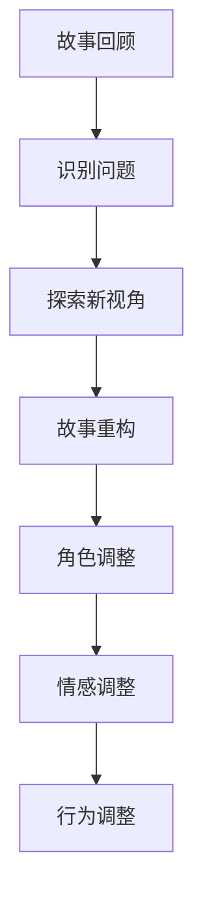

                 

### 引言：通过叙事疗法重塑生命故事

在信息技术飞速发展的今天，人工智能正深刻改变着我们的工作、生活和思维方式。然而，在这片技术蓝海中，人类的心灵世界却显得愈发复杂和难以捉摸。尽管技术进步为我们带来了前所未有的便利，但在面对心理挑战时，我们依旧显得力不从心。这种背景下，叙事疗法作为一种独特的心理治疗方式，开始逐渐引起人们的关注。

叙事疗法，源自于叙事心理学的理论体系，它强调通过重构个体的生命故事，帮助个体找到新的自我认同和解决问题的方法。简言之，叙事疗法通过引导个体讲述自己的故事，并对其进行重构，以达到心理治愈的效果。这种疗法不仅适用于心理问题，还广泛应用于家庭治疗、教育领域和企业管理中，展示了其广泛的适用性和强大的影响力。

本文旨在系统地探讨叙事疗法的核心概念、应用和实践，以帮助读者理解这一疗法的精髓，并在实际生活中找到应用的方法。具体而言，文章将分为三个部分：第一部分将介绍叙事疗法的起源、理论基础和核心概念；第二部分将深入探讨叙事疗法在不同领域的应用；第三部分将展望叙事疗法的新趋势和未来发展。

通过这一系统的探讨，我们希望读者能够了解到叙事疗法不仅仅是心理治疗的一种方法，更是一种对生命故事进行深刻反思和重塑的方式。在接下来的内容中，我们将一步步深入这一领域，共同探索叙事疗法的奥秘。

### 文章关键词

- 叙事疗法
- 心理治疗
- 生命故事重构
- 故事与身份
- 家庭治疗
- 教育领域
- 企业管理
- 心理咨询

### 摘要

叙事疗法是一种基于故事重构的心理治疗方法，通过帮助个体重新构建自己的生命故事，从而改变其认知、情感和行为，达到心理治愈的效果。本文首先介绍了叙事疗法的起源和发展，详细阐述了其核心概念，包括故事与身份、主角与配角、冲突与解决方案，以及叙事疗法中的隐喻与象征。接着，文章深入探讨了叙事疗法在心理咨询、家庭治疗、教育领域和企业管理中的应用，通过具体的案例和实践，展示了叙事疗法的实际效果。最后，文章展望了叙事疗法的新趋势和未来发展，提出了未来的挑战与机遇。本文旨在为读者提供全面、深入的叙事疗法知识，帮助其在实际生活中应用这一疗法，实现个人和组织的心理成长。

### 第一部分：叙事疗法的概述

#### 第1章：叙事疗法的起源与发展

**1.1 绪论**

叙事疗法，作为一种心理治疗方式，其根源可以追溯到20世纪70年代的心理学领域。然而，其核心思想却早已在文学、哲学和人类学中存在。最早提出叙事疗法概念的是美国心理治疗师迈克尔·怀特（Michael White）和埃斯苔芙·艾普斯顿（Elsie W. Eptson），他们在对心理治疗实践进行深刻反思后，提出了叙事疗法的基本理论框架。

叙事疗法的发展经历了几个关键阶段。起初，它主要作为心理治疗的一种补充方法，逐渐被临床心理学家接受。20世纪90年代，叙事疗法开始在其他领域，如家庭治疗、教育、企业管理等得到广泛应用。这一时期，叙事疗法的研究成果显著增加，相关理论和实践不断完善，使其成为一种独立的心理治疗方法。

**1.2 叙事疗法的理论基础**

叙事疗法建立在几个核心理论基础之上，包括建构主义、后现代主义和认知心理学等。建构主义认为，知识并非客观存在，而是个体在特定社会文化环境中通过互动和沟通建构的。叙事疗法强调，个体的故事和经验是其身份的重要组成部分，通过重新构建这些故事，可以帮助个体建立新的自我认同。

后现代主义则质疑了传统的权威观念，强调个体经验的主观性和差异性。叙事疗法吸收了这一观点，认为每个个体的故事都是独一无二的，没有固定的“正确”答案。治疗师的角色不再是权威的指导者，而是故事的倾听者和伙伴。

认知心理学则关注个体的思维过程和信息处理方式。叙事疗法认为，个体的认知模式往往受到其生命故事的影响。通过改变故事的内容和结构，可以改变个体的认知模式，从而改善其心理状态。

**1.3 叙事疗法的主要方法与技术**

叙事疗法的主要方法包括故事重构、外部化、解构和再建构等。以下将详细介绍这些方法：

- **故事重构**：治疗师帮助个体重新审视自己的生命故事，识别故事中的固定模式和不合理信念。通过重构故事，个体可以更清晰地认识到自己的情感和行为是如何被故事所影响的。

- **外部化**：叙事疗法认为，个体的内在冲突和情绪问题往往是故事中的内在对话所引起的。外部化技术帮助个体将内在对话转化为外在对话，从而使其更容易被识别和处理。

- **解构**：解构是指对个体生命故事中的不合理结构进行剖析和批判。通过解构，治疗师和个体可以共同揭示故事中的不合理信念和假设，从而为重构打下基础。

- **再建构**：在解构的基础上，叙事疗法通过再建构帮助个体构建新的故事框架。新的故事框架通常包含更多的自主性和选择性，使个体能够以更积极的方式面对生活中的挑战。

**1.4 叙事疗法与传统心理治疗的比较**

与传统的心理治疗方法相比，叙事疗法具有几个显著的特点。首先，叙事疗法更强调个体的主观体验和生命故事的重要性，而传统心理治疗则更多地关注心理病理和症状。其次，叙事疗法采用合作和对话的方式，治疗师与个体建立平等的伙伴关系，而传统心理治疗则更倾向于指导和建议。

此外，叙事疗法更注重个体的自主性和自我决定性，鼓励个体通过重构自己的故事来寻找解决问题的方法。这种治疗方法不仅能够帮助个体解决具体问题，还能提高其自我认知和情感调节能力。

**总结**

叙事疗法作为一种新型的心理治疗方法，通过重新构建个体的生命故事，帮助个体找到新的自我认同和解决问题的方法。其理论基础广泛，方法多样，适用性广泛，已在多个领域取得显著成果。随着研究的不断深入，叙事疗法有望在未来的心理治疗领域发挥更大的作用。

### 第2章：叙事疗法的核心概念

#### 2.1 故事与身份

**核心概念原理与联系：**

在叙事疗法中，故事不仅是信息的传递工具，更是个体身份的构成部分。个体的经历、情感和行为，都通过故事的方式被讲述、记录和传承。因此，故事与身份之间存在着密切的联系。

以下是一个Mermaid流程图，展示了故事、经历、认知、情感和身份之间的联系：

**详细讲解与举例说明：**

故事是叙事疗法的核心，它记录了个体在不同阶段的生命经历。这些经历不仅是事实，更是个体的情感体验和认知反应。例如，一个人可能在童年时期经历了一段不愉快的经历，这种经历不仅会在其记忆中留下痕迹，还会影响其对自己的认知和情感，从而影响其身份认同。

在叙事疗法中，治疗师会帮助个体重新审视自己的故事，识别故事中的固定模式和不合理信念。例如，一个人可能因为一次失败的经历而认为自己不配成功，这种认知会影响其情感和行为，使其在面对挑战时缺乏信心。

通过重构故事，个体可以改变对自身的认知和情感，从而重塑自己的身份。例如，通过重新讲述自己的失败经历，将其视为成长的机会，个体可以更加积极地面对未来的挑战。

#### 2.2 主角与配角

**核心概念原理与联系：**

在叙事疗法中，主角和配角是故事结构中的重要元素。主角是故事的中心，其经历和决策驱动故事的发展。配角则提供对比和背景，帮助主角的故事更加丰满。以下是一个Mermaid流程图，展示了主角、配角和故事发展之间的关系：

**详细讲解与举例说明：**

在叙事疗法中，主角和配角的关系对于理解故事具有重要意义。主角的经历和决策通常是故事的焦点，它们反映了主角的性格、目标和价值观。例如，一个人可能在面对职业挑战时，通过勇敢地尝试新方法，最终实现了成功。这个故事中的主角，通过自己的努力和决策，推动了故事的发展。

配角则为主角提供了对比和背景。他们可能代表了主角所面对的挑战，也可能是主角的支持者或反对者。例如，在同一个故事中，一个配角可能代表了主角所面临的压力和困难，而另一个配角则代表了主角的支持和鼓励。这些配角的存在，使主角的故事更加丰富和立体。

通过识别故事中的主角和配角，治疗师可以帮助个体理解自己故事中的角色，并重新构建这些角色之间的关系。例如，一个人可能将自己视为失败的主角，而将生活中的挑战视为无情的配角。通过重新定义这些角色，个体可以更加积极地面对生活中的挑战，重塑自己的故事。

#### 2.3 冲突与解决方案

**核心概念原理与联系：**

在叙事疗法中，冲突是故事的核心。冲突通常反映了个体内心的矛盾和挣扎，它推动故事的发展，同时也反映了个体如何应对和解决这些挑战。以下是一个Mermaid流程图，展示了冲突、问题、挣扎和解决方案之间的关系：

**详细讲解与举例说明：**

冲突是叙事疗法中理解故事的重要部分。冲突可以是外部的，如职业挑战或家庭矛盾，也可以是内部的，如自我怀疑和焦虑。这些冲突反映了个体内心深处的矛盾和挣扎，它们是故事发展的驱动力。

在叙事疗法中，治疗师会帮助个体识别故事中的冲突，并探索这些冲突背后的原因和解决方案。例如，一个人可能在工作中遇到困难，这种冲突可能会影响其情感和身份认同。通过探索冲突和解决方案，个体可以找到新的应对策略，实现个人成长。

解决方案是冲突的解决，它帮助个体实现成长。例如，一个人可能通过学习和适应新的工作环境，解决了工作中的冲突，从而提高了自己的工作效率和自信心。这种成长不仅体现在个体的行为上，还反映在其情感和身份认同中。

通过识别冲突和探索解决方案，个体可以更加清晰地理解自己的故事，找到新的自我认同和解决问题的方法。

#### 2.4 叙事疗法中的隐喻与象征

**核心概念原理与联系：**

在叙事疗法中，隐喻和象征起到了重要作用。它们帮助治疗师和个体探索无意识领域，揭示更深层次的情感和意义。以下是一个Mermaid流程图，展示了隐喻、无意识和情感之间的关系：

**详细讲解与举例说明：**

隐喻和象征在叙事疗法中具有独特的价值。隐喻通过将抽象概念转化为具体形象，使个体更容易理解无意识中的情感和意义。例如，一个人可能会将生活中的压力比作一场暴风雨，这种隐喻使个体能够更加直观地感受到压力的存在和影响。

象征则是一种更加深层次的表达方式。它通常代表着无意识中的情感和意义，通过探索象征，治疗师可以帮助个体揭示更深层次的情感冲突和内心困惑。例如，一个人可能会在梦中出现一条河流，这条河流可能象征着其内心的流动和变化。

在叙事疗法中，隐喻和象征可以帮助治疗师和个体探索无意识领域，揭示更深层次的情感和意义。通过理解和解读这些隐喻和象征，个体可以更好地理解自己的内心世界，找到新的自我认同和解决问题的方法。

### 第二部分：叙事疗法的应用与实践

#### 第3章：叙事疗法在心理咨询中的应用

**3.1 建立治疗关系**

在心理咨询中，叙事疗法的第一步是建立治疗关系。治疗关系的建立是叙事疗法成功的关键，它为个体提供了一个安全、支持和接纳的环境，使个体能够自由地讲述自己的故事。以下是一个Mermaid流程图，展示了建立治疗关系的步骤：

**详细讲解与举例说明：**

建立治疗关系的步骤包括建立信任、确认接纳、共同目标和积极倾听。首先，治疗师需要建立与个体的信任关系，通过诚实、真诚和尊重的态度，使个体感受到安全和被接纳。例如，治疗师可以告诉个体：“我知道这是一个艰难的过程，但我愿意陪你一起走过。”

其次，确认接纳是治疗关系建立的重要部分。治疗师需要向个体表达无条件接纳的态度，无论其故事如何，都不会对其做出评判。例如，治疗师可以说：“我理解你的感受，无论你经历了什么，你都是值得被接纳的。”

共同目标则是治疗关系中的另一个重要方面。治疗师和个体需要共同设定治疗目标，明确治疗的方向和期望。例如，治疗师可以询问个体：“你想通过这次治疗实现什么目标？”

最后，积极倾听是建立治疗关系的重要技能。治疗师需要用心倾听个体的故事，理解其情感和经历。通过积极倾听，治疗师可以与个体建立情感共鸣，增强治疗关系的稳定性。

#### 3.2 收集故事

在建立治疗关系之后，叙事疗法的下一步是收集故事。收集故事是了解个体生命经历和内心世界的重要过程，它为后续的叙事重构提供了基础。以下是一个Mermaid流程图，展示了收集故事的步骤：

**详细讲解与举例说明：**

收集故事的步骤包括开放式提问、细节补充、情感探索、故事回顾和故事分析。首先，开放式提问是收集故事的重要工具。治疗师通过开放式问题引导个体讲述自己的故事，例如：“你能告诉我你最近遇到的最大挑战是什么？”

在个体讲述故事的过程中，治疗师需要鼓励其补充细节，从而更全面地了解个体的生命经历。例如，治疗师可以问：“你当时是怎么想的？你感受到了什么？”

情感探索是叙事疗法中的一个关键步骤。通过探索个体的情感体验，治疗师可以帮助个体更深入地理解自己的内心世界。例如，治疗师可以问：“你在讲述这个故事时，有什么特别的感受？”

故事回顾是收集故事的最后一步，治疗师需要与个体一起回顾和反思故事的内容和意义。通过故事回顾，个体可以更好地理解自己的故事，并识别其中可能存在的问题。例如，治疗师可以问：“你觉得这个故事中有什么值得反思的地方？”

最后，故事分析是叙事疗法的核心步骤。治疗师需要与个体一起分析故事中的关键元素，如主角、配角、冲突和解决方案，从而帮助个体理解故事对自己的影响。通过故事分析，个体可以找到新的视角和方法，重新构建自己的故事。

#### 3.3 分析故事

在收集故事之后，叙事疗法的下一步是分析故事。分析故事是理解个体生命经历和内心世界的重要过程，它帮助个体识别故事中的固定模式和不合理信念，为后续的叙事重构提供基础。以下是一个Mermaid流程图，展示了分析故事的步骤：

**详细讲解与举例说明：**

分析故事的步骤包括识别固定模式、批判不合理信念、探索情感联系、故事解构和故事重构。

首先，识别固定模式是分析故事的重要步骤。治疗师需要帮助个体识别故事中反复出现的模式，如负面的自我认知、情感反应和行为习惯。例如，一个人可能在故事中反复提到自己的失败，表现出对自己的负面评价。治疗师可以通过提问引导个体识别这些固定模式，例如：“你注意到你的故事中有什么反复出现的部分吗？”

其次，批判不合理信念是分析故事的核心步骤。治疗师需要帮助个体识别故事中的不合理信念，如自我否定、过度自责或对未来的悲观预期。通过批判这些不合理信念，个体可以更加客观地看待自己的经历。例如，治疗师可以问：“你觉得这个故事中的哪些部分可能是不合理的？”

探索情感联系是分析故事中的关键环节。通过探索故事中的情感联系，个体可以更深入地理解自己的内心世界和情感体验。治疗师可以通过提问引导个体探索这些情感联系，例如：“你在讲述这个故事时，感受到了什么样的情感？”

故事解构是叙事疗法中的独特步骤，它帮助个体将复杂的生命故事分解为更简单的元素，如主角、配角、冲突和解决方案。通过故事解构，个体可以更清晰地看到故事中的关键部分和问题所在。例如，治疗师可以问：“你能把你的故事分解为主角、配角、冲突和解决方案吗？”

最后，故事重构是叙事疗法的最终目标。在解构的基础上，治疗师和个体一起构建新的故事框架，使其更加积极、有意义和具有自主性。通过故事重构，个体可以重新定义自己的身份和生命意义。例如，治疗师可以问：“如果你能重新构建这个故事，你希望它是什么样的？”

通过分析故事，个体可以更好地理解自己的内心世界和生命经历，找到新的自我认同和解决问题的方法。

#### 3.4 重构故事

在分析故事之后，叙事疗法的下一步是重构故事。重构故事是叙事疗法的核心步骤，它帮助个体通过重新构建自己的生命故事，改变对自身的认知、情感和行为。以下是一个Mermaid流程图，展示了重构故事的步骤：

**详细讲解与举例说明：**

重构故事的步骤包括故事回顾、识别问题、探索新视角、故事重构、角色调整、情感调整和行为调整。

首先，故事回顾是重构故事的第一步。通过回顾和分析之前的生命故事，个体可以更清楚地识别故事中的问题和挑战。例如，治疗师可以问：“你在分析故事时，识别到了哪些问题？”

其次，识别问题是重构故事的关键。通过识别故事中的问题，个体可以明确需要改变的方面。例如，治疗师可以问：“你觉得哪些部分需要改进？”

探索新视角是重构故事的重要步骤。通过引导个体从不同的角度看待自己的故事，治疗师可以帮助个体发现新的解决方案和应对策略。例如，治疗师可以问：“如果从另一个角度看这个问题，你会怎么做？”

在故事重构阶段，个体和治疗师一起构建新的故事框架。新的故事框架通常包含更多的自主性和选择性，使个体能够以更积极的方式面对生活中的挑战。例如，治疗师可以问：“你希望你的新故事是什么样的？”

角色调整是重构故事中的一个关键步骤。通过重新定义故事中的角色，个体可以改变对自身的认知和行为。例如，治疗师可以问：“你希望自己在新的故事中扮演什么样的角色？”

情感调整是重构故事中的另一个重要方面。通过调整故事中的情感元素，个体可以改变对自身和经历的看法。例如，治疗师可以问：“你希望在新的故事中，你会有什么样的情感体验？”

最后，行为调整是重构故事的实际应用。通过在现实生活中采取新的行为和策略，个体可以验证和巩固新的故事框架。例如，治疗师可以问：“你打算如何将新的故事应用到你的生活中？”

通过重构故事，个体可以改变对自身的认知、情感和行为，找到新的自我认同和解决问题的方法。这个过程不仅有助于心理治疗，还可以应用于个人成长和自我提升。

### 第4章：叙事疗法在家庭治疗中的应用

**4.1 家庭叙事治疗的原理**

家庭叙事治疗是叙事疗法在家庭关系中的应用，它通过重构家庭成员的故事，改善家庭沟通和关系。家庭叙事治疗的原理基于以下核心观点：

1. **故事与身份：** 家庭成员的故事构成了他们的身份，这些故事影响他们的行为、情感和认知。通过重构这些故事，家庭成员可以改变对自身的认知，从而改善家庭关系。

2. **合作与对话：** 家庭叙事治疗强调家庭成员之间的合作和对话，治疗师作为协调者和支持者，帮助家庭成员共同探索和重构故事。

3. **主观性：** 家庭叙事治疗认为每个家庭的故事都是独特的，没有固定的“正确”答案。通过尊重和接纳每个家庭成员的视角，治疗师帮助家庭成员建立共识。

4. **情感与意义：** 家庭叙事治疗关注家庭成员的情感体验和故事中的意义。通过探索和表达情感，家庭成员可以更好地理解彼此，增强家庭凝聚力。

**4.2 家庭叙事治疗的实践**

家庭叙事治疗的实践主要包括以下几个步骤：

1. **建立治疗关系：** 治疗师需要与家庭成员建立信任和接纳的关系。通过积极倾听和情感共鸣，治疗师帮助家庭成员感受到安全和被理解。

2. **收集家庭故事：** 治疗师引导家庭成员讲述自己的故事，包括家庭历史、重要事件和情感体验。通过开放式提问和细节补充，治疗师帮助家庭成员更全面地了解彼此。

3. **分析家庭故事：** 治疗师与家庭成员一起分析故事中的关键元素，如主角、配角、冲突和解决方案。通过识别固定模式和不合理信念，治疗师帮助家庭成员理解故事对其行为和情感的影响。

4. **重构家庭故事：** 在分析的基础上，治疗师和家庭成员一起重构故事。通过探索新视角和情感调整，家庭成员可以重新定义自己的角色和关系，建立新的家庭故事。

5. **角色调整与情感调整：** 在重构故事的过程中，家庭成员需要调整自己的角色和情感。治疗师帮助家庭成员理解彼此的需求和期望，促进家庭沟通和协作。

6. **行为调整与后续跟进：** 家庭成员在重构故事后，需要在现实生活中采取新的行为和策略。治疗师通过后续跟进，帮助家庭成员巩固新的故事框架，解决实际问题。

**4.3 家庭叙事治疗的案例分析**

以下是一个家庭叙事治疗的实际案例：

案例：一个三口之家，父亲、母亲和儿子。家庭关系紧张，主要原因是儿子在学校遇到了困难，成绩下降，父亲对儿子的期望过高，经常批评和责备。母亲则感到无助和焦虑，认为家庭关系无法改善。

**第一阶段：建立治疗关系**

治疗师与家庭成员进行了几次初步访谈，建立了信任和接纳的关系。治疗师通过积极倾听和情感共鸣，帮助家庭成员感受到安全和被理解。

**第二阶段：收集家庭故事**

治疗师引导家庭成员讲述了他们在家庭中的故事。父亲讲述了他的担忧和期望，母亲讲述了她的无助和焦虑，儿子讲述了他在学校遇到的困难和自我怀疑。

**第三阶段：分析家庭故事**

治疗师与家庭成员一起分析了家庭故事中的关键元素。治疗师帮助家庭成员识别了故事中的固定模式和不合理信念，如父亲的过度期望、母亲的焦虑和儿子的自我怀疑。

**第四阶段：重构家庭故事**

在分析的基础上，治疗师和家庭成员一起重构了家庭故事。治疗师引导家庭成员探索新的视角，如父亲的期望背后的关爱、母亲的焦虑背后的担忧和儿子的自我怀疑背后的恐惧。

通过重构故事，家庭成员重新定义了彼此的角色和关系。父亲学会了以更积极和支持的方式表达对儿子的期望，母亲学会了以更理解和支持的方式回应儿子的困难，儿子学会了以更自信和积极的态度面对挑战。

**第五阶段：角色调整与情感调整**

在重构故事的过程中，家庭成员进行了角色调整和情感调整。父亲学会了以更理解和支持的方式与儿子沟通，母亲学会了以更积极和自信的态度面对家庭问题，儿子学会了以更自信和积极的态度面对学业挑战。

**第六阶段：行为调整与后续跟进**

家庭成员在重构故事后，开始采取新的行为和策略。父亲减少了批评和责备，增加了鼓励和支持；母亲学会了放松和积极应对，减少了焦虑和无助；儿子学会了积极面对挑战，提高了学习成绩。

治疗师通过后续跟进，帮助家庭成员巩固新的故事框架，解决实际问题，如学校中的学业困难和家庭关系中的冲突。

通过这个案例，我们可以看到家庭叙事治疗在改善家庭关系中的实际效果。通过重构家庭故事，家庭成员能够更好地理解彼此，建立积极的沟通和协作模式，从而实现家庭和谐和成长。

### 第5章：叙事疗法在教育领域的应用

**5.1 叙事教学法的基本原理**

叙事教学法是一种基于叙事疗法的教育方法，它通过重构学习故事，帮助学生建立积极的自我认同和解决问题的能力。叙事教学法的基本原理包括以下几个方面：

1. **故事与学习：** 叙事教学法认为，学习不仅是知识技能的获取，更是个体生命经验的一部分。通过叙事，学生可以反思自己的学习经历，发现学习中的亮点和挑战，从而提高学习动力和效果。

2. **自主性：** 叙事教学法强调学生的自主性，鼓励学生通过讲述自己的学习故事，表达自己的观点和感受。这种自主性不仅有助于学生建立自我认同，还能培养其批判思维和创造性。

3. **合作与对话：** 叙事教学法鼓励学生之间的合作和对话，通过分享和学习彼此的故事，学生可以相互启发，共同成长。这种合作与对话不仅有助于知识的传递，还能培养学生的社交技能和团队合作能力。

4. **情感与意义：** 叙事教学法关注学生的情感体验和故事中的意义。通过探索和表达情感，学生可以更好地理解自己的内心世界，找到学习的动力和意义。

**5.2 叙事教学法的实践**

叙事教学法的实践主要包括以下几个步骤：

1. **故事收集：** 教师通过开放式提问和故事分享环节，引导学生讲述自己的学习故事。这些故事可以是成功经验、挑战和困惑，也可以是情感体验和感悟。

2. **故事分析：** 教师和学生在分析故事的过程中，识别故事中的关键元素，如主角、配角、冲突和解决方案。通过分析，学生可以理解自己的学习行为和情感反应，找到学习中的问题和改进方向。

3. **故事重构：** 在分析的基础上，教师和学生一起重构学习故事。通过探索新视角和情感调整，学生可以重新定义自己的学习角色和目标，建立积极的自我认同。

4. **角色调整与情感调整：** 在重构故事的过程中，学生需要进行角色调整和情感调整。教师通过引导和鼓励，帮助学生理解彼此的需求和期望，促进学习共同体的发展。

5. **行为调整与反馈：** 学生在重构故事后，需要在现实生活中采取新的学习行为和策略。教师通过反馈和指导，帮助学生巩固新的学习模式，提高学习效果。

**5.3 叙事教学法的案例分析**

以下是一个叙事教学法的实际案例：

案例：在一个高中班级中，教师希望提高学生的英语写作能力。通过叙事教学法，教师设计了以下教学活动：

**第一阶段：故事收集**

教师组织了一次小组讨论，让学生分享自己的英语写作故事。学生们讲述了他们在写作过程中遇到的困难、困惑和成功经验。教师通过倾听和记录，了解了每个学生的学习情况和情感状态。

**第二阶段：故事分析**

教师和学生一起分析了故事中的关键元素。教师引导学生识别自己在写作中的优点和不足，讨论写作过程中的困惑和挑战。通过分析，学生对自己的写作有了更清晰的认识，找到了需要改进的方面。

**第三阶段：故事重构**

在分析的基础上，教师和学生们一起重构了写作故事。教师引导学生探索新的写作方法和策略，鼓励他们以更积极和自信的态度面对写作挑战。学生们通过分享和讨论，重新定义了自己的写作角色和目标。

**第四阶段：角色调整与情感调整**

在重构故事的过程中，学生们进行了角色调整和情感调整。教师通过鼓励和指导，帮助学生理解彼此的需求和期望，建立积极的学习共同体。

**第五阶段：行为调整与反馈**

在重构故事后，学生们开始在现实生活中采取新的写作行为和策略。教师通过定期反馈和指导，帮助学生巩固新的写作模式，提高写作能力。

通过这个案例，我们可以看到叙事教学法在提高学生英语写作能力方面的实际效果。通过重构学习故事，学生不仅提高了写作技能，还建立了积极的自我认同和解决问题的能力。

### 第6章：叙事疗法在企业管理中的应用

**6.1 企业叙事管理的原理**

企业叙事管理是叙事疗法在企业组织中的应用，它通过重构组织故事，提高组织效能和员工满意度。企业叙事管理的原理基于以下几个核心观点：

1. **故事与组织身份：** 组织的故事反映了其文化和价值观，这些故事塑造了组织的身份和形象。通过重构组织故事，企业可以增强其文化认同和凝聚力。

2. **自主性与创造力：** 企业叙事管理强调员工的自主性和创造力，鼓励员工通过讲述自己的工作故事，表达自己的观点和感受。这种自主性不仅有助于提高员工的工作满意度，还能激发员工的创新潜力。

3. **合作与对话：** 企业叙事管理倡导员工之间的合作和对话，通过分享和交流工作故事，员工可以相互启发，共同成长。这种合作与对话不仅有助于团队协作，还能提高组织的决策质量和执行力。

4. **情感与意义：** 企业叙事管理关注员工的情感体验和故事中的意义。通过探索和表达情感，员工可以更好地理解组织的使命和愿景，找到工作的动力和意义。

**6.2 企业叙事管理的实践**

企业叙事管理的实践主要包括以下几个步骤：

1. **故事收集：** 企业通过开放式访谈、工作坊和故事分享会等形式，收集员工的工作故事。这些故事可以是成功经验、挑战和困惑，也可以是情感体验和感悟。

2. **故事分析：** 企业和员工一起分析故事中的关键元素，如主角、配角、冲突和解决方案。通过分析，员工可以理解自己的工作行为和情感反应，找到工作中存在的问题和改进方向。

3. **故事重构：** 在分析的基础上，企业和员工一起重构工作故事。通过探索新视角和情感调整，员工可以重新定义自己的工作角色和目标，建立积极的自我认同。

4. **角色调整与情感调整：** 在重构故事的过程中，员工需要进行角色调整和情感调整。企业通过引导和鼓励，帮助员工理解彼此的需求和期望，建立积极的工作共同体。

5. **行为调整与反馈：** 员工在重构故事后，需要在现实生活中采取新的工作行为和策略。企业通过反馈和指导，帮助员工巩固新的工作模式，提高工作效能。

**6.3 企业叙事管理的案例分析**

以下是一个企业叙事管理的实际案例：

案例：一家大型跨国公司希望通过提高员工的工作满意度和创新能力，提高企业的整体绩效。通过企业叙事管理，公司采取了以下措施：

**第一阶段：故事收集**

公司组织了一次全员故事分享会，鼓励员工讲述自己的工作故事。员工分享了他们在工作中的成功经验、挑战和困惑，以及情感体验和感悟。公司通过倾听和记录，了解了员工的实际需求和情感状态。

**第二阶段：故事分析**

公司和员工一起分析了故事中的关键元素。公司通过引导和提问，帮助员工识别自己在工作中的优点和不足，讨论工作中的困惑和挑战。通过分析，员工对自己的工作有了更清晰的认识，找到了需要改进的方面。

**第三阶段：故事重构**

在分析的基础上，公司和员工一起重构了工作故事。公司鼓励员工探索新的工作方法和策略，以更积极和自信的态度面对工作中的挑战。员工通过分享和讨论，重新定义了自己的工作角色和目标。

**第四阶段：角色调整与情感调整**

在重构故事的过程中，员工进行了角色调整和情感调整。公司通过引导和鼓励，帮助员工理解彼此的需求和期望，建立积极的工作共同体。

**第五阶段：行为调整与反馈**

在重构故事后，员工开始在现实生活中采取新的工作行为和策略。公司通过定期反馈和指导，帮助员工巩固新的工作模式，提高工作效能。

通过这个案例，我们可以看到企业叙事管理在提高员工工作满意度和创新能力方面的实际效果。通过重构工作故事，员工不仅提高了工作效能，还建立了积极的自我认同和团队合作精神。

### 第三部分：叙事疗法的新趋势与未来发展

#### 第7章：叙事疗法的新发展

**7.1 叙事疗法与心理治疗的其他流派**

叙事疗法作为心理治疗的一种独特流派，近年来与其他心理治疗流派的融合和互动日益增加。这些流派包括认知行为疗法（CBT）、精神分析疗法、人本主义疗法等。以下是叙事疗法与这些流派的关系和互动：

1. **认知行为疗法（CBT）：** 叙事疗法与认知行为疗法在治疗目标上具有相似之处，都关注个体的认知和行为。叙事疗法通过重构故事，改变个体的认知模式，而CBT则通过认知重构和行为演练，帮助个体应对心理问题。两者结合，可以提供更全面的干预策略，提高治疗效果。

2. **精神分析疗法：** 叙事疗法与精神分析疗法都关注个体的无意识和内心冲突。叙事疗法通过隐喻和象征，帮助个体探索无意识中的情感和意义，而精神分析疗法则通过自由联想和深度访谈，揭示潜意识中的冲突和创伤。两者结合，可以为个体提供更深入的疗愈体验。

3. **人本主义疗法：** 叙事疗法与人本主义疗法都强调个体的自主性和自我实现。叙事疗法通过重构故事，帮助个体找到新的自我认同和意义，而人本主义疗法则通过自我接纳和自我表达，促进个体的成长和自我实现。两者结合，可以提供更全面的支持和引导，帮助个体实现心理和情感的平衡。

**7.2 叙事疗法在跨文化中的应用**

叙事疗法作为一种心理治疗方法，其应用不仅限于特定文化和地区。随着全球化的发展，叙事疗法在跨文化中的应用越来越受到关注。以下是叙事疗法在跨文化中的应用和挑战：

1. **文化适应性：** 叙事疗法在跨文化中的应用需要考虑不同文化背景下的故事结构、价值观和情感表达。治疗师需要具备跨文化敏感性，理解不同文化中的故事和身份概念，以便更有效地实施叙事疗法。

2. **多元文化团队：** 在跨文化背景下，叙事疗法可以通过多元文化团队的协作，结合不同文化背景的治疗方法和经验，提供更全面和个性化的干预。这种多元文化团队不仅包括心理治疗师，还可以包括文化顾问和社会工作者等。

3. **文化偏见和刻板印象：** 叙事疗法在跨文化中的应用需要克服文化偏见和刻板印象。治疗师需要保持开放和尊重的态度，避免对个体进行标签化和歧视。

**7.3 叙事疗法在人工智能领域中的应用**

随着人工智能技术的发展，叙事疗法在人工智能领域中的应用也成为一个新的趋势。以下是叙事疗法在人工智能领域中的应用和前景：

1. **智能叙事分析：** 人工智能技术可以用于分析个体的叙事数据，提取关键信息和情感模式。通过智能叙事分析，可以为个体提供更精准的心理评估和干预建议。

2. **虚拟叙事治疗：** 通过虚拟现实技术，可以创建一个虚拟的治疗环境，个体可以在其中进行叙事疗法的实践。虚拟叙事治疗不仅提供了安全和隐私保障，还可以模拟不同情境，为个体提供更丰富的治疗体验。

3. **个性化叙事干预：** 人工智能可以通过大数据分析和机器学习技术，为个体提供个性化的叙事干预方案。这种个性化干预可以更精准地满足个体的心理需求，提高治疗效果。

**总结**

叙事疗法作为一种心理治疗方式，在与其他流派融合、跨文化应用和人工智能领域的发展中，展示出了广阔的应用前景。通过不断探索和创新，叙事疗法有望在未来的心理治疗领域发挥更大的作用，为个体和社会带来更多的福祉。

### 第8章：叙事疗法的未来发展趋势

**8.1 叙事疗法在社会科学中的应用**

叙事疗法在社会科学领域的应用正日益扩大，其在心理学、社会学、教育学和人类学等学科中表现出强大的潜力。以下是一些具体的应用场景和趋势：

1. **心理学研究：** 叙事疗法在心理学研究中被广泛用于探索个体心理健康的动态过程。研究者通过叙事分析，深入理解个体的情感状态、认知模式和身份构建。例如，研究者使用叙事方法研究创伤后成长、自我效能感和心理健康问题，发现叙事疗法能够显著改善个体的心理状态。

2. **社会学调查：** 叙事疗法在社会学领域中的应用，帮助研究者理解社会行为和社会互动。通过叙事分析，研究者可以揭示个体在社会情境中的角色扮演和身份转换，探究社会结构和文化对个体行为的影响。例如，社会学家使用叙事方法研究家庭关系、社区互动和社会身份的构建，为社会发展提供理论支持和实践指导。

3. **教育评估：** 叙事疗法在教育评估中的应用，提供了新的评估工具和方法。教育工作者通过叙事分析，评估学生的学习经历、情感体验和成长过程。这种方法不仅关注学生的学业成绩，还关注学生的情感状态和自我认知，有助于全面了解学生的学习需求和潜力。

4. **人类学研究：** 叙事疗法在人类学研究中，被用于探讨文化传统、身份认同和社区发展。通过叙事方法，人类学家能够深入理解不同文化背景下的个体生活故事，揭示文化中的核心价值观和社会规范。这为跨文化交流和多元文化教育提供了重要参考。

**8.2 叙事疗法在心理学教育中的应用**

叙事疗法在心理学教育中的应用，为心理学专业学生和从业者提供了新的学习工具和教学资源。以下是一些具体的实践和趋势：

1. **实践教学：** 叙事疗法被广泛应用于心理学实践教学中。教师通过案例分析和角色扮演，引导学生理解和掌握叙事疗法的核心概念和技术。这种方法不仅提高了学生的理论水平，还培养了他们的实践能力和同理心。

2. **继续教育：** 叙事疗法作为心理学继续教育的重要内容，为在职心理咨询师和治疗师提供了专业提升的机会。通过叙事疗法的培训和研讨会，心理咨询师和治疗师可以更新知识、拓展技能，提高心理治疗的质量和效果。

3. **学术交流：** 叙事疗法在心理学学术交流中，为研究者提供了新的研究方法和视角。通过叙事分析，心理学家能够深入探讨心理问题的本质和影响因素，推动心理学理论的创新和发展。

**8.3 叙事疗法的未来挑战与机遇**

尽管叙事疗法在多个领域取得了显著成果，但其未来发展仍然面临一些挑战和机遇：

1. **跨学科合作：** 叙事疗法需要与其他学科，如社会学、教育学和医学等，进行更多的跨学科合作，以拓展其应用范围和提升研究深度。通过跨学科合作，可以形成更全面的干预策略，提高治疗效果。

2. **技术融合：** 随着人工智能和大数据技术的发展，叙事疗法需要探索与技术的融合。通过智能叙事分析、虚拟叙事治疗和个性化干预方案，可以提供更精准和有效的心理服务。

3. **伦理和隐私：** 叙事疗法在应用过程中，需要严格遵循伦理和隐私原则。治疗师需要保护个体的隐私，确保叙事内容的保密性。同时，伦理问题也是叙事疗法在跨文化和全球化背景下需要重点关注的领域。

4. **教育和培训：** 叙事疗法的教育和培训是未来发展的重要方向。通过建立标准化的教育和培训体系，可以培养更多专业的人才，推动叙事疗法在全球范围内的普及和应用。

**总结**

叙事疗法作为一种具有广泛应用前景的心理治疗方法，其在社会科学、心理学教育和未来发展趋势中展示出了巨大的潜力。通过不断探索和创新，叙事疗法有望在未来的心理治疗和社会服务领域发挥更大的作用，为个体和社会带来更多的福祉。同时，面对未来挑战，叙事疗法需要继续深化研究、拓展应用，并严格遵守伦理原则，以实现其最大的社会价值。

### 结论：叙事疗法的广泛影响力

叙事疗法作为一种独特的心理治疗方法，不仅为个体提供了新的自我认知和解决问题的方法，还在心理咨询、家庭治疗、教育领域和企业管理中展示了其强大的应用潜力。通过重构生命故事，叙事疗法帮助个体找到了新的自我认同和意义，改善了心理状态和生活质量。在家庭治疗中，叙事疗法促进了家庭成员之间的理解和沟通，增强了家庭凝聚力。在教育领域，叙事教学法激发了学生的学习兴趣和创造力，提高了教育效果。在企业管理中，叙事疗法提高了员工的工作满意度和创新能力，推动了组织效能的提升。

展望未来，叙事疗法将继续拓展其应用范围，与其他学科和技术进行深入融合，为个体和社会带来更多福祉。随着跨学科合作和技术的不断发展，叙事疗法有望在更多领域发挥重要作用，成为心理治疗和社会服务的重要组成部分。然而，面对未来的挑战，叙事疗法需要不断提升理论水平、完善实践方法，并严格遵守伦理原则，确保其在全球范围内的健康和可持续发展。

总之，叙事疗法作为一种具有深远影响力的心理治疗方法，其广泛应用和未来发展将为我们带来新的希望和机遇。通过不断探索和创新，叙事疗法将继续在心理治疗和社会服务领域发挥重要作用，为个体和社会带来积极的变化和改善。作者：AI天才研究院/AI Genius Institute & 禅与计算机程序设计艺术 /Zen And The Art of Computer Programming。

