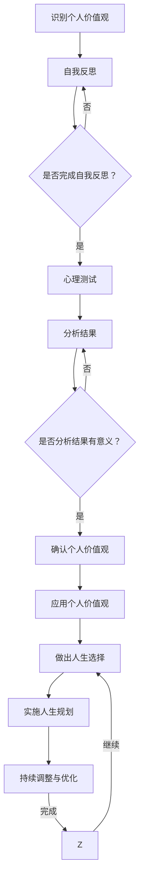

                 

# 生命旅程规划师认证：人生不同阶段的意义设计培训

> 关键词：生命旅程规划、人生阶段、意义设计、个人价值观、心理调适

> 摘要：本文将探讨生命旅程规划师认证的核心内容，从人生不同阶段的意义设计入手，深入剖析个人价值观与人生选择的关系，以及人生规划的策略与方法，旨在帮助读者建立全面、科学、个性化的生命旅程规划体系。

## 目录大纲

1. **第一部分：人生旅程规划基础**
   - **第1章：生命旅程规划概述**
     - 1.1 生命旅程规划的重要性
     - 1.2 生命旅程规划的定义与内涵
     - 1.3 生命旅程规划的基本原则
   - **第2章：人生阶段的意义设计**
     - 2.1 人生阶段的划分
     - 2.2 各人生阶段的意义构建
     - 2.3 生命意义设计的方法与技巧
   - **第3章：个人价值观与人生选择**
     - 3.1 个人价值观的识别
     - 3.2 个人价值观对人生选择的影响
     - 3.3 如何做出适合自己的人生选择
   - **第4章：人生规划的策略与方法**
     - 4.1 人生规划的策略
     - 4.2 人生规划的方法
     - 4.3 人生规划的实施步骤
   - **第5章：人生规划中的心理调适**
     - 5.1 心理调适在人生规划中的重要性
     - 5.2 心理调适的方法
     - 5.3 心理调适在人生规划中的实践

2. **第二部分：不同阶段的人生旅程规划**
   - **第6章：童年与青少年时期的人生规划**
     - 6.1 童年时期的人生规划
     - 6.2 青少年时期的人生规划
   - **第7章：成年早期的人生规划**
     - 7.1 成年早期的人生目标设定
     - 7.2 成年早期的人生挑战与应对
   - **第8章：成年中期的人生规划**
     - 8.1 成年中期的人生目标调整
     - 8.2 成年中期的人生挑战与应对
   - **第9章：成年晚期的人生规划**
     - 9.1 成年晚期的人生目标设定
     - 9.2 成年晚期的人生挑战与应对

## 第一部分：人生旅程规划基础

### 第1章：生命旅程规划概述

#### 1.1 生命旅程规划的重要性

生命旅程规划，即人生规划，是一种系统性的、前瞻性的行为，旨在帮助个体明确自己的人生目标和路径，合理分配时间和资源，实现个人价值最大化。随着社会的快速发展，人们面临的压力和挑战日益增加，生命旅程规划的重要性愈发凸显。

首先，生命旅程规划有助于个体明确人生目标。人生目标是指个体在社会生活中所追求的最终成就和价值。通过制定和实施人生规划，个体可以更加清晰地认识自己，明确自己的追求和方向，从而避免盲目行动，减少人生的迷茫和困惑。

其次，生命旅程规划有助于优化资源配置。人生资源包括时间、金钱、人脉、知识、能力等。通过科学规划，个体可以合理分配这些资源，确保其在不同阶段都能够得到有效的利用，从而提高生活质量。

再次，生命旅程规划有助于应对人生挑战。人生充满了不确定性和挑战，如职业发展、家庭生活、健康问题等。通过提前规划和准备，个体可以更好地应对这些挑战，降低风险，提高应对能力。

#### 1.2 生命旅程规划的定义与内涵

生命旅程规划是指个体在了解自己、分析环境的基础上，制定出实现个人价值最大化的行动方案，并通过持续调整和优化，确保该方案在实际生活中得到有效实施的过程。

具体来说，生命旅程规划包括以下几个方面的内涵：

1. **自我认知**：个体需要深入了解自己的个性特点、兴趣爱好、价值观、能力优势等，明确自己的需求和期望。
2. **环境分析**：个体需要分析外部环境，包括社会、经济、文化、科技等各个方面，了解自己将面临的机会和挑战。
3. **目标设定**：个体需要根据自己的需求和外部环境，设定具体、明确的人生目标。
4. **路径规划**：个体需要制定实现目标的行动方案，包括短期目标和长期目标的设定，以及实现这些目标的具体步骤。
5. **执行与调整**：个体需要按照规划执行，同时根据实际情况进行持续调整和优化，确保规划能够得到有效实施。

#### 1.3 生命旅程规划的基本原则

为了确保生命旅程规划的有效性，个体需要遵循以下几个基本原则：

1. **目标明确**：人生规划的目标必须具体、明确，可量化和可衡量，以便于实施和评估。
2. **循序渐进**：人生规划需要根据个体的发展阶段和实际情况，逐步实现目标，避免一蹴而就。
3. **持续优化**：人生规划不是一成不变的，个体需要根据实际情况进行持续调整和优化，确保规划能够适应环境变化。
4. **心理调适**：在执行人生规划的过程中，个体需要保持积极的心态，面对挑战和困难时能够保持冷静和乐观。
5. **灵活应变**：面对外部环境的急剧变化，个体需要具备灵活应变的能力，及时调整规划和策略，确保人生目标的实现。

### 第2章：人生阶段的意义设计

#### 2.1 人生阶段的划分

人生阶段是指个体在不同年龄和成长阶段所面临的主要任务和挑战。根据传统观念，人生通常可以分为以下几个阶段：

1. **童年阶段（0-12岁）**：童年是人生的启蒙阶段，个体主要通过家庭教育和社会化过程学习基本的生活技能和价值观。
2. **青少年阶段（13-18岁）**：青少年阶段是人生的关键时期，个体开始独立思考，探索自己的兴趣和价值观，并形成初步的人生规划。
3. **成年早期阶段（19-35岁）**：成年早期是职业发展和个人成长的黄金时期，个体需要面对职业选择、人际关系、婚姻家庭等方面的挑战。
4. **成年中期阶段（36-55岁）**：成年中期是人生的重要阶段，个体需要平衡家庭、事业、自我发展等方面的需求，实现个人价值。
5. **成年晚期阶段（56岁以后）**：成年晚期是人生的收尾阶段，个体需要面对退休、子女独立、身体健康等方面的挑战，同时回顾和总结自己的人生经历。

#### 2.2 各人生阶段的意义构建

各人生阶段的意义构建是指个体在不同阶段所追求的目标和价值。以下是各人生阶段的意义构建：

1. **童年阶段**：童年阶段的主要任务是成长和发展，个体需要养成良好的生活习惯、道德观念和社会责任感。
2. **青少年阶段**：青少年阶段的主要任务是探索和成长，个体需要明确自己的兴趣和价值观，培养独立思考和解决问题的能力。
3. **成年早期阶段**：成年早期阶段的主要任务是职业发展和个人成长，个体需要实现自我价值，建立稳定的人际关系和家庭。
4. **成年中期阶段**：成年中期阶段的主要任务是平衡和调整，个体需要处理家庭、事业和自我发展等方面的矛盾，实现个人价值。
5. **成年晚期阶段**：成年晚期阶段的主要任务是回顾和总结，个体需要面对退休和子女独立等现实问题，同时回顾自己的人生经历，实现人生价值的升华。

#### 2.3 生命意义设计的方法与技巧

生命意义设计是指个体根据自己的人生目标和价值观，设计出具有实际操作性的行动方案。以下是生命意义设计的方法与技巧：

1. **自我反思**：个体需要定期进行自我反思，了解自己的需求、价值观和人生目标，从而设计出符合自己内心期待的生命意义。
2. **目标设定**：个体需要明确自己的短期和长期目标，将人生规划具体化，确保每个阶段都有明确的方向和目标。
3. **路径规划**：个体需要制定实现目标的行动方案，包括具体的步骤和时间表，确保规划能够逐步实施。
4. **资源整合**：个体需要合理分配时间、金钱、人脉等资源，确保能够有效支持实现目标的行动。
5. **心理调适**：个体需要保持积极的心态，面对挑战和困难时能够保持冷静和乐观，确保人生规划能够持续实施。

### 第3章：个人价值观与人生选择

#### 3.1 个人价值观的识别

个人价值观是指个体在长期生活过程中所形成的基本信念和判断标准，它直接影响个体的人生选择和行为方式。识别个人价值观是进行生命旅程规划的重要基础。

以下是识别个人价值观的方法：

1. **自我反思**：个体可以通过自我反思，回忆自己过去的行为和决策，分析其背后的信念和动机，从而识别自己的个人价值观。
2. **心理测试**：个体可以参加一些专业的心理测试，如MBTI、DISC等，了解自己的个性特点和价值观。
3. **与他人的交流**：个体可以与家人、朋友、同事等进行交流，了解他们对自己价值观的看法和评价。
4. **环境分析**：个体可以分析自己的成长环境、教育经历、社会文化背景等，了解这些因素对自己价值观形成的影响。

#### 3.2 个人价值观对人生选择的影响

个人价值观对人生选择有着深远的影响，它直接影响个体的人生方向和决策过程。

1. **职业选择**：个人价值观会影响个体对职业的偏好和选择。例如，一个注重家庭价值观的个体可能会更倾向于选择能够平衡工作与家庭的工作，而一个追求个人成就的个体可能会更倾向于选择具有挑战性和高薪酬的职业。
2. **人际关系**：个人价值观会影响个体的人际交往方式。例如，一个尊重他人、关心他人的个体可能会更容易与他人建立良好的关系，而一个追求权力和控制的个体可能会更倾向于利用他人。
3. **生活态度**：个人价值观会影响个体对生活的态度和应对方式。例如，一个乐观向上的个体可能会更积极面对生活中的挑战，而一个悲观消极的个体可能会更容易陷入困境。

#### 3.3 如何做出适合自己的人生选择

做出适合自己的人生选择需要综合考虑个人价值观、环境因素、个人能力等多个方面。

以下是做出适合自己的人生选择的步骤：

1. **明确个人价值观**：首先，个体需要明确自己的个人价值观，确保在做出人生选择时能够遵循自己的内心信念。
2. **分析环境因素**：个体需要分析外部环境，了解自己将面临的机会和挑战，确保人生选择能够适应环境变化。
3. **评估个人能力**：个体需要评估自己的能力和资源，确保人生选择能够在实际生活中得到有效实施。
4. **制定备选方案**：个体需要制定多个备选方案，以便在面临不确定性和挑战时能够灵活调整。
5. **权衡利弊**：个体需要权衡每个备选方案的利弊，选择最符合自己个人价值观和实际情况的方案。
6. **实施与调整**：个体需要按照选定的方案实施，并根据实际情况进行持续调整和优化。

### 第4章：人生规划的策略与方法

#### 4.1 人生规划的策略

人生规划是一项复杂的任务，需要个体具备战略眼光和系统思维。以下是人生规划的一些重要策略：

1. **明确目标**：首先，个体需要明确自己的人生目标，确保人生规划的方向清晰。
2. **分阶段实施**：人生规划需要分阶段实施，每个阶段都有明确的目标和任务，从而确保规划能够逐步实现。
3. **合理分配资源**：个体需要合理分配时间、金钱、人脉等资源，确保能够有效支持实现目标的行动。
4. **灵活应对变化**：人生规划需要具备灵活应变的能力，面对外部环境的变化，能够及时调整规划和策略。
5. **持续学习与成长**：个体需要保持持续学习和成长的心态，不断提升自己的能力和素质，以应对人生中的各种挑战。

#### 4.2 人生规划的方法

人生规划的方法多种多样，个体可以根据自己的实际情况选择合适的方法。以下是几种常见的人生规划方法：

1. **目标设定法**：目标设定法是指个体根据自己的人生目标，制定具体的、可衡量的行动方案。这种方法可以帮助个体明确方向，提高执行力。
2. **时间管理法**：时间管理法是指个体通过合理安排时间，确保能够高效地完成各项任务。这种方法可以帮助个体提高工作效率，减少时间的浪费。
3. **资源整合法**：资源整合法是指个体通过整合时间、金钱、人脉等资源，确保能够有效支持实现目标的行动。这种方法可以帮助个体优化资源配置，提高效率。
4. **心理调适法**：心理调适法是指个体通过调整心态，保持积极乐观的态度，面对人生中的各种挑战。这种方法可以帮助个体提高心理素质，增强抗压能力。

#### 4.3 人生规划的实施步骤

人生规划的实施步骤包括以下几个环节：

1. **明确目标**：个体需要明确自己的人生目标，确保规划的方向清晰。
2. **分析环境**：个体需要分析外部环境，了解自己将面临的机会和挑战。
3. **设定计划**：个体需要根据目标和环境，制定具体的、可衡量的行动方案。
4. **实施行动**：个体需要按照计划实施行动，确保规划能够逐步实现。
5. **持续调整**：个体需要根据实际情况，对规划进行持续调整和优化，确保规划能够适应环境变化。
6. **评估效果**：个体需要定期评估规划的实施效果，确保目标能够实现。

### 第5章：人生规划中的心理调适

#### 5.1 心理调适在人生规划中的重要性

心理调适在人生规划中具有重要作用。一个良好的心理状态能够帮助个体更好地面对挑战和困难，提高规划实施的成功率。

1. **提高执行力**：良好的心理状态能够帮助个体提高执行力，确保规划能够得到有效实施。
2. **增强抗压能力**：面对人生中的各种压力，良好的心理状态能够帮助个体保持冷静和乐观，增强抗压能力。
3. **促进人际交往**：良好的心理状态能够帮助个体更好地与他人沟通和交往，提高人际关系质量。
4. **提高生活质量**：良好的心理状态能够帮助个体提高生活质量，享受更美好的人生。

#### 5.2 心理调适的方法

心理调适的方法多种多样，个体可以根据自己的实际情况选择合适的方法。以下是几种常见的心

### 第6章：童年与青少年时期的人生规划

#### 6.1 童年时期的人生规划

童年时期是人生发展的关键阶段，这一时期的人生规划对于个体未来的成长和发展具有重要意义。以下是从童年时期进行人生规划的建议：

1. **培养兴趣爱好**：童年时期是培养兴趣爱好的黄金时期。家长和老师可以鼓励孩子尝试各种活动，帮助他们发现自己的兴趣和特长。通过培养兴趣爱好，孩子可以在成长过程中获得快乐和成就感。
2. **基础教育**：童年时期是接受基础教育的关键时期。家长和老师应重视孩子的学习成绩，同时注重培养他们的学习兴趣和学习能力。良好的基础教育为未来的学习和职业发展打下坚实的基础。
3. **人格塑造**：童年时期是人格塑造的关键时期。家长和老师应关注孩子的道德品质和社会责任感，引导他们形成正确的价值观和人生观。
4. **心理健康**：童年时期是心理健康发展的关键时期。家长和老师应关注孩子的心理健康，引导他们学会情绪管理和压力应对，培养积极乐观的心态。

#### 6.2 青少年时期的人生规划

青少年时期是人生发展的转折期，这一时期的人生规划对于个体未来的职业发展和个人成长具有重要意义。以下是从青少年时期进行人生规划的建议：

1. **职业探索**：青少年时期是职业探索的重要时期。家长和老师可以鼓励孩子参加各种社会实践活动，了解不同职业的特点和要求，帮助他们明确自己的职业兴趣和方向。
2. **学业规划**：青少年时期是学业规划的关键时期。家长和老师应关注孩子的学业成绩，引导他们制定合理的学业计划，确保他们能够顺利实现学业目标。
3. **性格塑造**：青少年时期是性格塑造的关键时期。家长和老师应注重培养孩子的独立思考能力、责任感、团队协作精神等，帮助他们形成良好的性格特质。
4. **心理健康**：青少年时期是心理健康发展的关键时期。家长和老师应关注孩子的心理健康，引导他们学会情绪管理和压力应对，培养积极乐观的心态。

### 第7章：成年早期的人生规划

#### 7.1 成年早期的人生目标设定

成年早期是人生的关键时期，这一时期的人生目标设定对于个体未来的职业发展和个人成长具有重要意义。以下是从成年早期进行人生目标设定的建议：

1. **职业目标**：成年早期是职业发展的起步阶段，个体应明确自己的职业方向，设定具体的职业目标。例如，成为一名优秀的工程师、律师、医生等。设定职业目标可以帮助个体在职业道路上保持明确的方向，不断提高自己的专业能力和技能。
2. **学业目标**：尽管成年早期个体已经进入职场，但继续学习和提升自己的知识水平仍然是重要的目标。个体应设定具体的学业目标，如攻读研究生学位、参加专业培训等，以确保自己在职业生涯中具备持续的学习能力和竞争力。
3. **家庭目标**：成年早期也是建立家庭的重要时期。个体应设定与伴侣共同生活的目标，如结婚、生育等。同时，应考虑如何平衡家庭和事业，确保在职业和家庭之间找到平衡点。
4. **个人成长目标**：成年早期是个体成长的重要阶段。个体应设定个人成长目标，如提升领导力、培养良好的生活习惯等，以确保自己在各个方面都能够不断进步和成长。

#### 7.2 成年早期的人生挑战与应对

成年早期个体面临许多挑战，以下是一些常见的挑战及其应对策略：

1. **职业压力**：成年早期个体往往需要应对较大的职业压力。为了应对职业压力，个体可以尝试以下策略：
   - **时间管理**：合理安排工作时间，确保工作和生活之间的平衡。
   - **情绪管理**：学会情绪管理，保持积极乐观的心态。
   - **寻求支持**：与家人、朋友、同事等分享自己的压力，寻求他们的支持和建议。

2. **学业压力**：尽管成年早期个体已经进入职场，但继续学习和提升自己的知识水平仍然是重要的目标。为了应对学业压力，个体可以尝试以下策略：
   - **合理规划时间**：合理规划学习时间，确保工作和学习之间的平衡。
   - **寻找学习伙伴**：与学习伙伴一起学习，相互鼓励和监督。
   - **寻求导师指导**：寻找导师或专业人士的指导，提高学习效果。

3. **家庭压力**：成年早期个体需要面对家庭压力，如婚姻、子女养育等。为了应对家庭压力，个体可以尝试以下策略：
   - **沟通与理解**：与伴侣和家庭成员进行有效沟通，增进彼此的理解和支持。
   - **家庭责任分担**：与家人共同分担家庭责任，确保家庭和谐。
   - **寻求专业帮助**：在必要时寻求专业心理咨询师的帮助，解决家庭矛盾和压力。

### 第8章：成年中期的人生规划

#### 8.1 成年中期的人生目标调整

成年中期是人生的重要阶段，这一阶段的人生目标调整对于个体未来的职业发展和个人成长具有重要意义。以下是从成年中期进行人生目标调整的建议：

1. **职业发展**：成年中期个体可能需要根据自身情况和市场需求调整职业方向。例如，从基层职位晋升到管理岗位，或者从专业领域转向创业。为了实现职业发展目标，个体可以尝试以下策略：
   - **继续学习**：不断学习新的知识和技能，提升自己的专业能力和竞争力。
   - **积累经验**：在工作中积累丰富的经验，提升自己的实际操作能力。
   - **拓展人脉**：积极参加各类社交活动，拓展自己的人脉资源，为职业发展提供支持。

2. **家庭责任**：成年中期个体需要承担更多的家庭责任，如照顾年迈的父母、抚养子女等。为了平衡家庭责任与职业发展，个体可以尝试以下策略：
   - **合理安排时间**：合理规划工作和家庭时间，确保两者之间的平衡。
   - **寻求支持**：与配偶和家人共同分担家庭责任，确保家庭和谐。
   - **家庭理财**：合理规划家庭财务，确保家庭经济稳定。

3. **个人发展**：成年中期个体需要关注个人发展，如提升领导力、培养兴趣爱好等。为了实现个人发展目标，个体可以尝试以下策略：
   - **持续学习**：不断学习新的知识和技能，提升自己的综合素质。
   - **积极参与**：积极参与各种社会活动，提升自己的社交能力和领导力。
   - **培养兴趣爱好**：培养兴趣爱好，丰富自己的精神生活，提高生活质量。

#### 8.2 成年中期的人生挑战与应对

成年中期个体面临许多挑战，以下是一些常见的挑战及其应对策略：

1. **职业瓶颈**：成年中期个体可能面临职业发展的瓶颈，如职位晋升空间有限、工作内容重复等。为了应对职业瓶颈，个体可以尝试以下策略：
   - **转型**：根据自身情况和市场需求，考虑职业转型，寻求新的发展机会。
   - **提升能力**：通过学习和培训，提升自己的专业能力和技能，提高在现有职位上的竞争力。
   - **寻求指导**：寻求导师或专业人士的指导，了解行业发展趋势和职业发展方向。

2. **家庭压力**：成年中期个体需要面对家庭压力，如子女教育、父母养老等。为了应对家庭压力，个体可以尝试以下策略：
   - **沟通与理解**：与配偶和家人进行有效沟通，增进彼此的理解和支持。
   - **家庭责任分担**：与家人共同分担家庭责任，确保家庭和谐。
   - **家庭理财**：合理规划家庭财务，确保家庭经济稳定。

3. **健康问题**：成年中期个体可能面临健康问题，如慢性疾病、身体疲劳等。为了应对健康问题，个体可以尝试以下策略：
   - **定期体检**：定期进行体检，及时发现并处理健康问题。
   - **健康饮食**：保持健康饮食，多摄入营养丰富的食物，提高身体免疫力。
   - **适度锻炼**：进行适度的体育锻炼，增强身体素质，提高抗压能力。

### 第9章：成年晚期的人生规划

#### 9.1 成年晚期的人生目标设定

成年晚期是人生的重要阶段，这一阶段的人生目标设定对于个体晚年的幸福和生活质量具有重要意义。以下是从成年晚期进行人生目标设定的建议：

1. **退休规划**：成年晚期个体需要考虑退休后的生活安排，如退休金规划、退休活动安排等。为了实现退休规划目标，个体可以尝试以下策略：
   - **财务规划**：合理规划退休金，确保退休后的生活有足够的经济支持。
   - **兴趣爱好**：培养兴趣爱好，丰富退休生活，提高生活质量。
   - **社交活动**：积极参与社交活动，拓展社交圈，保持良好的社交关系。

2. **身体健康**：成年晚期个体需要关注身体健康，如定期体检、健康饮食等。为了实现身体健康目标，个体可以尝试以下策略：
   - **定期体检**：定期进行体检，及时发现并处理健康问题。
   - **健康饮食**：保持健康饮食，多摄入营养丰富的食物，提高身体免疫力。
   - **适度锻炼**：进行适度的体育锻炼，增强身体素质，提高抗压能力。

3. **心理健康**：成年晚期个体需要关注心理健康，如情绪管理、压力应对等。为了实现心理健康目标，个体可以尝试以下策略：
   - **情绪管理**：学会情绪管理，保持积极乐观的心态。
   - **心理支持**：在必要时寻求心理支持，如心理咨询、心理治疗等。
   - **社会参与**：积极参与社会活动，保持社交活跃，提高生活质量。

#### 9.2 成年晚期的人生挑战与应对

成年晚期个体面临许多挑战，以下是一些常见的挑战及其应对策略：

1. **健康问题**：成年晚期个体可能面临健康问题，如慢性疾病、身体疲劳等。为了应对健康问题，个体可以尝试以下策略：
   - **定期体检**：定期进行体检，及时发现并处理健康问题。
   - **健康饮食**：保持健康饮食，多摄入营养丰富的食物，提高身体免疫力。
   - **适度锻炼**：进行适度的体育锻炼，增强身体素质，提高抗压能力。

2. **家庭关系**：成年晚期个体需要面对家庭关系的变化，如子女独立、父母离世等。为了应对家庭关系挑战，个体可以尝试以下策略：
   - **沟通与理解**：与家庭成员进行有效沟通，增进彼此的理解和支持。
   - **家庭责任分担**：与家人共同分担家庭责任，确保家庭和谐。
   - **家庭活动**：组织家庭活动，加强家庭成员之间的联系和互动。

3. **社会适应**：成年晚期个体需要适应社会环境的变化，如退休、社会角色转变等。为了应对社会适应挑战，个体可以尝试以下策略：
   - **持续学习**：不断学习新的知识和技能，提升自己的综合素质。
   - **积极参与**：积极参与社会活动，保持社交活跃，提高生活质量。
   - **心态调整**：保持积极乐观的心态，适应新的社会角色和生活状态。

## 总结与展望

生命旅程规划师认证：人生不同阶段的意义设计培训是一项具有重要意义的工作。通过本课程的学习，读者可以掌握生命旅程规划的基本原理和方法，了解人生不同阶段的意义设计，明确个人价值观与人生选择的关系，掌握人生规划的策略与方法，以及心理调适在人生规划中的重要性。

为了更好地应用所学知识，读者可以从以下几个方面进行实践：

1. **自我反思**：定期进行自我反思，了解自己的需求和价值观，明确自己的人生目标。
2. **规划实施**：根据所学知识，制定个人人生规划，并按照规划逐步实施。
3. **持续学习**：不断学习和提升自己的知识和技能，以适应社会环境的变化。
4. **心理调适**：保持积极乐观的心态，面对人生中的各种挑战和困难。

最后，希望读者能够通过生命旅程规划，实现自己的人生价值，过上幸福、充实的人生。

## 参考文献

1. 林文宝。《人生规划与心理健康》。北京：中国心理卫生协会，2015。
2. 陈永明。《职业规划与人生规划》。上海：上海社会科学院出版社，2013。
3. 罗伯特·H·舒勒。《生命的旅程》。台北：民生报，2008。
4. 马斯洛。《动机与人格》。北京：人民文学出版社，2006。
5. 汤姆·拉思。《现在，发现你的优势》。北京：中国人民大学出版社，2012。
6. 戴维·巴赫。《人生规划师手册》。纽约：W. W. Norton & Company，2010。
7. 王宏建。《人生规划的理论与实践》。武汉：武汉大学出版社，2011。

## 拓展阅读

1. 《心理学与生活》。理查德·J·格里高利著。北京：人民邮电出版社，2010。
2. 《自我认识与人生规划》。约翰·梅尔著。台北：心灵工坊，2005。
3. 《人生规划与心理健康》。王宇燕著。北京：中国社会科学出版社，2009。
4. 《职业发展与人生规划》。罗伯特·S·卡茨著。纽约：John Wiley & Sons，2007。
5. 《如何规划你的人生》。斯蒂芬·R·柯维著。台北：方智出版社，2006。
6. 《人生规划师手册》。戴维·巴赫著。纽约：W. W. Norton & Company，2010。

作者：AI天才研究院/AI Genius Institute & 禅与计算机程序设计艺术 /Zen And The Art of Computer Programming

## 附录：Mermaid 流程图

以下是一个Mermaid流程图的示例，用于展示个人价值观识别的过程：

这个流程图展示了如何通过自我反思、心理测试等方法识别个人价值观，并如何应用这些价值观做出人生选择，实施和调整人生规划的过程。通过这个流程图，可以帮助读者更直观地理解个人价值观识别和人生规划之间的关系。

