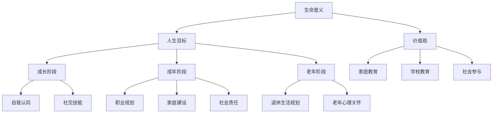

                 

### 引言

#### 1.1 书籍背景及目的

在快节奏的现代生活中，许多人往往忽视了人生意义的探索和人生的深度规划。本书《生命旅程规划师：人生不同阶段的意义设计》旨在帮助读者反思和规划自己的生命旅程，从而更好地理解人生各个阶段的意义，实现自我价值。本书源于作者对生命意义的深刻思考，以及对个体和社会关系的长期观察。

##### 1.1.1.1 生命意义与人生目标

生命意义是一个深刻的哲学问题，它关乎个体存在的价值与目的。在生命的每一个阶段，个体都面临着不同的挑战和任务，这些任务构成了人生的目标。人生目标不仅包括职业成就，还包括家庭幸福、人际关系、自我成长等多个方面。因此，对人生目标的明确和规划是人生旅程中不可或缺的一环。

##### 1.1.1.2 个体与社会的关系

个体与社会的关系是人生旅程中的重要课题。在社会的大背景下，个体的成长、发展和实现自我价值都需要依靠社会的支持与帮助。然而，个体在追求个人目标的同时，也不能忽视对社会的贡献和责任。本书将探讨如何在个人成长和社会责任之间找到平衡，从而实现个体的全面发展和自我实现。

##### 1.1.2 书籍目的

本书的主要目的是帮助读者进行自我反思，重新审视自己的人生旅程，明确人生目标，并设计出具有实际操作性的生命规划方案。通过本书的阅读，读者将：

- 深入理解生命意义和人生目标的内涵。
- 掌握不同阶段的人生规划方法和策略。
- 明确个人在人生旅程中的角色和责任。
- 提升自我认知，增强心理韧性，实现自我成长。

##### 1.2 研究方法

本书采用了多种研究方法，包括历史回顾、现代心理学研究以及跨文化比较研究，以全面深入地探讨人生不同阶段的规划与意义设计。

##### 1.2.1 历史回顾

通过回顾古代思想家的生命观，本书试图揭示不同文化背景下的人生哲学，从而为现代人生规划提供历史参考和哲学思考。

##### 1.2.1.1 古代思想家的生命观

- 希腊哲学：强调个体价值和自由意志，追求智慧和幸福。
- 儒家思想：强调社会和家庭责任，追求道德完善和社会和谐。
- 佛教与道家思想：探讨生命的本质和心灵修行，追求解脱和超越。

##### 1.2.1.2 东西方人生观的异同

- 个人主义与集体主义：西方文化更强调个体价值和自由，而东方文化更注重集体利益和社会责任。
- 价值观与人生目标：不同文化背景下的人生目标有所不同，但都关注个体成长和社会贡献。

##### 1.2.2 现代心理学研究

现代心理学研究为人生规划提供了科学依据。通过探讨生命阶段和人生任务，本书将分析个体在不同成长阶段的心理发展特点，并给出相应的规划建议。

##### 1.2.2.1 生命阶段与人生任务

- 埃里克·埃里克森的生命阶段理论：提出了人生八个阶段，每个阶段都有特定的心理发展任务。
- 玛格丽特·米德的文化发展阶段理论：探讨了不同文化背景下个体成长和社会化过程。

##### 1.2.3 跨文化比较研究

通过跨文化比较研究，本书将分析不同文化背景下的人生观和价值观，以期为全球读者提供有价值的参考。

##### 1.2.3.1 个人主义与集体主义

- 个人主义：强调个体自由和自我实现。
- 集体主义：强调个体对集体的责任和奉献。

##### 1.2.3.2 价值观与人生目标

- 个体在追求个人目标的同时，也关注社会价值和共同利益。

### 目录大纲

#### 第二部分：人生不同阶段的规划

##### 2.1 成长阶段

- 儿童与青少年阶段：探讨家庭教育、学校教育和社会化过程。
- 成长阶段的心理发展：分析自我认同的建立和社交技能的发展。

##### 2.2 成年阶段

- 职业规划：讨论职业选择、职业发展和职场挑战。
- 家庭建设：分析婚姻与家庭关系、子女教育。

##### 2.3 老年阶段

- 退休生活规划：探讨退休前的准备和退休后的生活调整。
- 老年心理关怀：关注老年期的心理需求和心理健康维护。

##### 第三部分：人生意义的探寻

- 意义与价值观：讨论意义与价值观的定义和作用。
- 寻找人生意义的方法：介绍自我反思和心理辅导。

### 摘要

本书《生命旅程规划师：人生不同阶段的意义设计》旨在帮助读者反思人生旅程，规划不同阶段的成长路径，并探寻生命的意义与价值观。通过历史回顾、现代心理学研究和跨文化比较研究，本书揭示了人生各个阶段的特殊任务和心理发展特点，为读者提供了切实可行的生命规划方法和策略。通过本书的阅读，读者将深入理解生命意义，明确人生目标，实现自我价值，并在个体与社会之间找到平衡，达到全面发展的目标。

### 目录大纲：

#### 第二部分：人生不同阶段的规划

##### 2.1 成长阶段

- **2.1.1 儿童与青少年阶段**
  - **2.1.1.1 家庭教育的重要性**
    - **2.1.1.1.1 家庭教育的原则**
    - **2.1.1.1.2 家庭教育的挑战与应对策略**
  - **2.1.1.2 学校教育与社会化**
    - **2.1.1.2.1 学校教育的作用**
    - **2.1.1.2.2 社会化过程与人生观的形成**
  - **2.1.1.3 心理发展特点**
    - **2.1.1.3.1 自我认同的建立**
    - **2.1.1.3.2 社交技能的发展**

- **2.1.2 青春期与成年初期**
  - **2.1.2.1 身体变化与心理发展**
    - **2.1.2.1.1 身体成长与性别认同**
    - **2.1.2.1.2 心理冲突与自我探索**
  - **2.1.2.2 情感关系与社会适应**
    - **2.1.2.2.1 情感关系的建立与维护**
    - **2.1.2.2.2 社会角色的适应与转变**

##### 2.2 成年阶段

- **2.2.1 职业规划**
  - **2.2.1.1 职业选择与职业发展**
    - **2.2.1.1.1 职业选择的因素**
    - **2.2.1.1.2 职业发展的路径**
  - **2.2.1.2 职场挑战与应对**
    - **2.2.1.2.1 职场压力管理**
    - **2.2.1.2.2 职业生涯规划**

- **2.2.2 家庭建设**
  - **2.2.2.1 婚姻与家庭关系**
    - **2.2.2.1.1 婚姻生活的挑战**
    - **2.2.2.1.2 婚姻关系的维护策略**
  - **2.2.2.2 子女教育**
    - **2.2.2.2.1 子女教育的原则**
    - **2.2.2.2.2 子女教育的实践策略**

- **2.2.3 社会参与与贡献**
  - **2.2.3.1 社会责任与公民意识**
    - **2.2.3.1.1 社会责任的内涵**
    - **2.2.3.1.2 公民意识的培养**
  - **2.2.3.2 社会参与的形式与影响**
    - **2.2.3.2.1 社会参与的途径**
    - **2.2.3.2.2 社会参与对个体成长的促进作用**

##### 2.3 老年阶段

- **2.3.1 退休生活规划**
  - **2.3.1.1 退休前的准备**
    - **2.3.1.1.1 财务规划**
    - **2.3.1.1.2 身体健康管理**
  - **2.3.1.2 退休后的生活调整**
    - **2.3.1.2.1 社交活动的参与**
    - **2.3.1.2.2 持续学习与自我提升**

- **2.3.2 老年心理关怀**
  - **2.3.2.1 老化与心理健康**
    - **2.3.2.1.1 老化的生理变化**
    - **2.3.2.1.2 心理健康的维护策略**
  - **2.3.2.2 老年期的心理需求**
    - **2.3.2.2.1 亲情与陪伴**
    - **2.3.2.2.2 社会参与与自我实现**

### 2.4 生命意义与价值观的重建

- **2.4.1 意义与价值观的内涵**
  - **2.4.1.1 意义的多元性**
  - **2.4.1.2 价值观的形成与演变**

- **2.4.2 寻找生命意义的途径**
  - **2.4.2.1 自我反思**
  - **2.4.2.2 心理辅导**
  - **2.4.2.3 社会参与**

- **2.4.3 价值观的实践与应用**
  - **2.4.3.1 家庭与社会的价值观教育**
  - **2.4.3.2 职场与公共领域的价值观实践**

### 2.5 案例分析与启示

- **2.5.1 成功案例**
  - **2.5.1.1 个人成长与成功**
  - **2.5.1.2 社会贡献与影响**

- **2.5.2 失败案例**
  - **2.5.2.1 个人挫折与反思**
  - **2.5.2.2 社会问题与反思**

### 2.6 总结与展望

- **2.6.1 人生规划的重要性**
- **2.6.2 未来的研究方向**

## 第一部分：引言

### 1.1 书籍背景及目的

在快节奏的现代生活中，许多人往往忽视了人生意义的探索和人生的深度规划。本书《生命旅程规划师：人生不同阶段的意义设计》旨在帮助读者反思和规划自己的生命旅程，从而更好地理解人生各个阶段的意义，实现自我价值。本书源于作者对生命意义的深刻思考，以及对个体和社会关系的长期观察。

#### 1.1.1 书籍背景

生命意义是一个深刻的哲学问题，它关乎个体存在的价值与目的。在生命的每一个阶段，个体都面临着不同的挑战和任务，这些任务构成了人生的目标。人生目标不仅包括职业成就，还包括家庭幸福、人际关系、自我成长等多个方面。因此，对人生目标的明确和规划是人生旅程中不可或缺的一环。

##### 1.1.1.1 生命意义与人生目标

生命意义是一个深刻的哲学问题，它关乎个体存在的价值与目的。在生命的每一个阶段，个体都面临着不同的挑战和任务，这些任务构成了人生的目标。人生目标不仅包括职业成就，还包括家庭幸福、人际关系、自我成长等多个方面。因此，对人生目标的明确和规划是人生旅程中不可或缺的一环。

##### 1.1.1.2 个体与社会的关系

个体与社会的关系是人生旅程中的重要课题。在社会的大背景下，个体的成长、发展和实现自我价值都需要依靠社会的支持与帮助。然而，个体在追求个人目标的同时，也不能忽视对社会的贡献和责任。本书将探讨如何在个人成长和社会责任之间找到平衡，从而实现个体的全面发展和自我实现。

#### 1.1.2 书籍目的

本书的主要目的是帮助读者进行自我反思，重新审视自己的人生旅程，明确人生目标，并设计出具有实际操作性的生命规划方案。通过本书的阅读，读者将：

- 深入理解生命意义和人生目标的内涵。
- 掌握不同阶段的人生规划方法和策略。
- 明确个人在人生旅程中的角色和责任。
- 提升自我认知，增强心理韧性，实现自我成长。

##### 1.1.2.1 意义重寻与价值重建

- **意义重寻**：在现代社会，许多人在追求物质财富和职业成功的过程中，往往忽略了生活的精神层面。本书将引导读者反思自己的生命意义，重新找到生活的精神支柱。
- **价值重建**：通过分析和规划不同阶段的人生任务，本书帮助读者建立符合个人价值观的生活目标，从而实现个人价值和社会价值的双重提升。

##### 1.1.2.2 人生规划与自我实现

- **人生规划**：人生规划是一个动态的过程，它要求个体在不同的生活阶段调整自己的目标和行动。本书提供了一系列人生规划的工具和方法，帮助读者制定切实可行的人生计划。
- **自我实现**：自我实现是马斯洛需求层次理论中的最高层次，它代表了个体的全面发展和潜能发挥。通过明确人生目标和制定规划，本书帮助读者实现自我价值的最大化。

### 1.2 研究方法

本书采用了多种研究方法，包括历史回顾、现代心理学研究以及跨文化比较研究，以全面深入地探讨人生不同阶段的规划与意义设计。

#### 1.2.1 历史回顾

通过回顾古代思想家的生命观，本书试图揭示不同文化背景下的人生哲学，从而为现代人生规划提供历史参考和哲学思考。

##### 1.2.1.1 古代思想家的生命观

- **希腊哲学**：强调个体价值和自由意志，追求智慧和幸福。
- **儒家思想**：强调社会和家庭责任，追求道德完善和社会和谐。
- **佛教与道家思想**：探讨生命的本质和心灵修行，追求解脱和超越。

##### 1.2.1.2 东西方人生观的异同

- **个人主义与集体主义**：西方文化更强调个体价值和自由，而东方文化更注重集体利益和社会责任。
- **价值观与人生目标**：不同文化背景下的人生目标有所不同，但都关注个体成长和社会贡献。

#### 1.2.2 现代心理学研究

现代心理学研究为人生规划提供了科学依据。通过探讨生命阶段和人生任务，本书将分析个体在不同成长阶段的心理发展特点，并给出相应的规划建议。

##### 1.2.2.1 生命阶段与人生任务

- **埃里克·埃里克森的生命阶段理论**：提出了人生八个阶段，每个阶段都有特定的心理发展任务。
- **玛格丽特·米德的文化发展阶段理论**：探讨了不同文化背景下个体成长和社会化过程。

##### 1.2.2.2 心理发展特点

- **自我认同的建立**：个体在不同阶段对自我认知的不断深化。
- **社交技能的发展**：个体在社会交往中不断学习和发展社交技能。

#### 1.2.3 跨文化比较研究

通过跨文化比较研究，本书将分析不同文化背景下的人生观和价值观，以期为全球读者提供有价值的参考。

##### 1.2.3.1 个人主义与集体主义

- **个人主义**：强调个体自由和自我实现。
- **集体主义**：强调个体对集体的责任和奉献。

##### 1.2.3.2 价值观与人生目标

- 个体在追求个人目标的同时，也关注社会价值和共同利益。

### 1.3 目录概述

本书分为三个主要部分，分别探讨人生不同阶段的规划、人生意义的探寻以及具体案例的分析。

- **第一部分：人生不同阶段的规划**：详细介绍人生各个阶段的任务和规划方法。
- **第二部分：人生意义的探寻**：深入探讨生命的意义和价值观的内涵及其在人生旅程中的重要性。
- **第三部分：案例分析与启示**：通过成功与失败案例的分析，为读者提供实际操作的指导和建议。

### 摘要

本书《生命旅程规划师：人生不同阶段的意义设计》旨在帮助读者理解和规划人生的各个阶段，找到生命的意义和价值。通过回顾历史、现代心理学研究和跨文化比较，本书提供了全面的人生规划方法和策略，帮助读者在个人成长和社会责任之间找到平衡，实现自我价值和幸福。本书适用于所有希望在人生旅途中找到方向和意义的读者。

## 2.1 成长阶段

在人生的成长阶段，个体从依赖走向独立，从无知走向知识，从简单走向复杂。这一阶段涵盖了从出生到成年初期的各个时期，包括儿童期、青少年期以及青春期。每个时期都有其独特的心理和社会发展任务，这些任务不仅影响着个体的成长，也为其后续的人生奠定了基础。

### 2.1.1 儿童与青少年阶段

#### 2.1.1.1 家庭教育的重要性

家庭教育在儿童和青少年的成长过程中起着至关重要的作用。家庭是孩子们的第一所学校，父母是孩子们的第一任老师。家庭教育不仅传递基本的生活技能和价值观，还塑造了孩子们的世界观和人生观。

##### 2.1.1.1.1 家庭教育的原则

家庭教育的原则包括以下几个方面：

1. **尊重与信任**：尊重孩子，信任孩子的自主性和独立性，帮助他们建立自信心。
2. **积极引导**：通过积极的沟通和引导，帮助孩子形成正确的价值观和人生观。
3. **身教重于言传**：父母的行为对孩子有着深远的影响，因此父母应该以身作则，树立良好的榜样。
4. **个性化教育**：每个孩子都有其独特的性格和兴趣，家庭教育应该因材施教，尊重孩子的个性发展。

##### 2.1.1.1.2 家庭教育的挑战与应对策略

在实施家庭教育的过程中，家长常常会面临以下挑战：

1. **沟通障碍**：孩子进入青春期后，与父母的沟通可能会变得困难，家长需要学会倾听和理解孩子的想法。
2. **教育资源有限**：不是所有家庭都能提供丰富的教育资源，家长需要充分利用现有的资源，如图书馆、网络等。
3. **家庭教育与学校教育的冲突**：家长和学校教育理念不一致时，家长需要主动与学校沟通，形成教育合力。

应对这些挑战的策略包括：

- **建立良好的家庭沟通机制**：定期与孩子进行交流，了解他们的需求和困扰。
- **家长培训**：家长可以通过参加家长培训课程，提高自己的教育水平。
- **家庭活动和互动**：通过共同参与家庭活动和互动，增进亲子关系，促进孩子全面发展。

#### 2.1.1.2 学校教育与社会化

学校教育是孩子们从家庭环境步入社会的重要过渡。在这个过程中，孩子们不仅学习知识，还学习如何与人相处，如何处理社会关系。

##### 2.1.1.2.1 学校教育的作用

学校教育在儿童和青少年成长中的重要作用体现在以下几个方面：

1. **知识传授**：学校教育为学生提供了系统的知识和技能，为他们未来的学习和职业发展打下基础。
2. **价值观教育**：学校教育通过课程内容和师生互动，传递正确的价值观和道德观。
3. **社会技能培养**：学校教育帮助学生学习如何与人合作、如何解决冲突，从而提高他们的社会适应能力。

##### 2.1.1.2.2 社会化过程与人生观的形成

社会化过程是孩子们逐渐融入社会、学会遵循社会规则和价值观的过程。在这个过程中，孩子们的人生观和价值观逐渐形成。

1. **同伴关系**：同伴关系对儿童和青少年的社会化过程具有重要作用。通过与同伴的互动，孩子们学习如何合作、如何分享、如何处理冲突。
2. **社会规范**：学校教育和社会环境传递给孩子们各种社会规范，如礼貌、诚信、尊重等。孩子们通过遵守这些规范，逐渐形成正确的人生观。
3. **自我认同**：在社会化过程中，孩子们逐渐认识到自己的身份和角色，形成了自我认同。这种自我认同不仅影响了他们的行为，也影响了他们的价值观。

#### 2.1.1.3 心理发展特点

在成长阶段，儿童和青少年的心理发展具有以下特点：

1. **自我认同的建立**：在儿童期和青少年期，个体开始关注自己的身份和角色，努力建立自我认同。
2. **社交技能的发展**：个体在社会互动中不断学习和发展社交技能，如沟通能力、合作能力、冲突解决能力等。
3. **情绪调节能力的提升**：随着年龄的增长，个体逐渐学会如何管理和调节自己的情绪，从而更好地应对生活中的挑战。

### 2.1.2 青春期与成年初期

青春期是人生中的一个重要转折点，标志着个体从童年期过渡到成年期。在这一阶段，个体经历了身体、心理和社会的深刻变化。

##### 2.1.2.1 身体变化与心理发展

青春期是一个身体快速发育的时期，包括身高增长、体重增加、性征的出现等。这些身体变化对青少年的心理发展产生了深远的影响。

1. **性别认同**：青少年开始对自己的性别角色和身份有更清晰的认识，逐渐形成性别认同。
2. **自我探索**：青春期是自我认知和自我探索的重要阶段，个体开始思考自己的兴趣、价值观和未来目标。
3. **心理冲突**：由于身体和心理的变化，青少年常常面临各种心理冲突，如自尊心与自卑感、独立性与依赖性的冲突等。

##### 2.1.2.2 情感关系与社会适应

青春期是情感关系发展的关键时期，青少年开始建立深层次的人际关系。

1. **友谊**：与同龄人的友谊对青少年的社会化过程和心理发展至关重要。通过友谊，青少年学习如何与人相处，如何处理冲突和合作。
2. **恋爱与性教育**：随着性征的出现和性意识的觉醒，青少年开始对恋爱和性产生兴趣。适当的性教育有助于他们理解性健康和性责任。
3. **社会角色适应**：青少年需要适应新的社会角色，如学生、朋友、家庭成员等。这一过程可能伴随着角色冲突和身份认同的挑战。

### 2.1.3 心理发展特点

青春期和成年初期的心理发展具有以下特点：

1. **自我认同的深化**：青少年在这一阶段更加关注自己的内心世界，努力建立稳定的自我认同。
2. **情感独立**：随着自我认同的建立，青少年逐渐实现情感独立，学会自我管理和自我调节。
3. **社会参与**：青少年通过参与各种社会活动，如志愿服务、社团活动等，提高自己的社会责任感和社交能力。

### 2.1.4 成长阶段的意义

成长阶段是人生中至关重要的阶段，它不仅影响着个体的未来，也影响着他们如何理解自己和世界。

1. **自我探索**：成长阶段为个体提供了探索自我的机会，帮助他们了解自己的兴趣、价值观和目标。
2. **社会适应**：通过成长阶段的学习和体验，个体学会了如何适应社会环境，处理人际关系。
3. **心理发展**：成长阶段的心理发展奠定了个体未来心理健康的基础，对他们的终身发展具有重要影响。

### 2.1.5 家庭、学校和社会的角色

在成长阶段，家庭、学校和社会都扮演着重要的角色，共同促进个体的全面发展。

1. **家庭**：家庭是孩子成长的第一个环境，家长的教育方式和亲子关系对孩子的成长具有深远影响。
2. **学校**：学校是孩子接受系统教育的重要场所，教师的教育方法和学校的文化氛围对学生的成长起到关键作用。
3. **社会**：社会环境提供了丰富的资源和机会，包括文化、教育、就业等，对个体的成长和发展产生重要影响。

### 2.1.6 成长阶段的规划

为了有效地度过成长阶段，个体需要制定合理的规划，包括：

1. **教育规划**：明确自己的学习目标和计划，选择合适的课程和课外活动。
2. **职业规划**：了解自己的兴趣和优势，规划未来的职业发展路径。
3. **心理健康规划**：关注自己的心理健康，学会调节情绪和管理压力。

### 2.1.7 成长阶段的挑战与应对策略

成长阶段面临许多挑战，包括学业压力、人际关系冲突、自我认同困惑等。以下是一些应对策略：

1. **积极应对**：面对挑战时，保持积极的心态，寻找解决问题的方法。
2. **寻求支持**：在需要时，向家人、朋友或专业人士寻求帮助和支持。
3. **自我调节**：学会自我管理和自我调节，提高心理韧性。

### 总结

成长阶段是人生中不可或缺的一部分，它为个体的未来奠定了基础。通过理解成长阶段的特点、制定合理的规划、应对面临的挑战，个体可以更好地度过这一阶段，实现自我成长和社会适应。

## 2.2 成年阶段

成年阶段是人生中的一个关键时期，标志着个体从依赖性逐渐转向独立性和责任感。在这个阶段，人们通常需要面对职业发展、家庭建设和社会参与等多方面的挑战和机遇。以下是对成年阶段的具体探讨。

### 2.2.1 职业规划

职业规划是成年阶段的重要任务之一，它关系到个体的经济独立、职业成就和个人成长。有效的职业规划可以帮助个体明确职业目标，提升职业素养，实现职业发展和个人价值的实现。

##### 2.2.1.1 职业选择与职业发展

职业选择是职业规划的第一步，它受到多种因素的影响，包括个人的兴趣、能力、价值观和市场需求等。

1. **兴趣与能力的匹配**：职业选择应优先考虑个人的兴趣和擅长领域，以确保职业的满意度和稳定性。
2. **市场需求与职业前景**：选择具有良好就业前景和稳定收入的职业，能够为个人的经济安全和职业发展提供保障。
3. **职业发展路径**：制定清晰的职业发展路径，包括短期目标和长期目标，以及为实现这些目标所需的技能和经验。

##### 2.2.1.2 职场挑战与应对

在职业生涯中，个体可能会遇到各种挑战，如职场竞争、职业压力、职业倦怠等。以下是一些应对策略：

1. **持续学习与技能提升**：不断学习新知识和技能，保持职业竞争力。
2. **合理规划时间与管理压力**：合理安排工作和生活时间，有效管理职场压力，避免职业倦怠。
3. **建立人际关系与网络**：建立良好的人际关系和职业网络，有助于职业发展和个人成长。

### 2.2.2 家庭建设

家庭是成年个体生活的核心，良好的家庭关系对个人的心理健康和幸福感具有重要影响。家庭建设包括婚姻关系、亲子关系和家庭成员之间的相互支持。

##### 2.2.2.1 婚姻与家庭关系

婚姻是家庭的基础，婚姻关系的健康与否直接影响到家庭成员的幸福。

1. **沟通与理解**：保持有效沟通，增进相互理解，是维持婚姻关系的重要因素。
2. **共同目标与价值观**：建立共同的生活目标和价值观，有助于夫妻双方在家庭生活中保持一致。
3. **解决冲突与维护和谐**：学会解决婚姻中的冲突，维护家庭和谐。

##### 2.2.2.2 子女教育

子女教育是家庭建设的重要组成部分，良好的子女教育可以为孩子的未来发展奠定坚实的基础。

1. **教育原则**：遵循个体差异，尊重孩子的兴趣和发展需求，实施个性化教育。
2. **家庭教育与学校教育的配合**：家庭和学校共同关注孩子的成长，形成教育的合力。
3. **品德教育**：重视孩子的品德教育，培养他们的社会责任感和道德观念。

### 2.2.3 社会参与与贡献

成年个体在社会中扮演着多重角色，包括家庭成员、职业人士和社会成员等。积极参与社会活动，承担社会责任，对个人和社会的发展都有积极意义。

##### 2.2.3.1 社会责任与公民意识

社会责任是成年个体的重要责任，它关系到个人的道德素质和社会地位。

1. **社会责任的内涵**：社会责任包括对家庭、对社会和对他人的责任，体现在实际行动和道德行为中。
2. **公民意识的培养**：培养公民意识，积极参与社会事务，维护社会公正和秩序。

##### 2.2.3.2 社会参与的形式与影响

社会参与的形式多种多样，包括志愿服务、社区活动、公益活动等。这些活动不仅有助于提升个人的社会责任感和公民意识，也对社会产生了积极影响。

1. **志愿服务**：通过志愿服务，个体可以为社会做出贡献，同时提升自身的沟通能力和社会技能。
2. **社区活动**：积极参与社区活动，有助于增强社区的凝聚力和互助精神。
3. **公益活动**：通过公益活动，个体可以关注社会问题，推动社会进步。

### 2.2.4 成年阶段的心理发展特点

成年阶段的心理发展具有以下特点：

1. **自我认同的巩固**：成年个体对自己的身份和角色有更清晰的认识，自我认同感更强。
2. **情感独立**：成年个体逐渐实现情感独立，学会自我管理和自我调节。
3. **社会责任感**：成年个体对社会责任有更深刻的理解，愿意为社会做出贡献。

### 2.2.5 成年阶段的意义

成年阶段是人生中重要的里程碑，它标志着个体从依赖性逐渐转向独立性，开始承担更多的社会责任和家庭责任。成年阶段的规划与成就对个体的未来发展和幸福感具有重要影响。

1. **职业成就**：职业规划和职业发展是实现个人价值的重要途径，对个体的经济独立和心理健康具有积极影响。
2. **家庭幸福**：良好的家庭关系和子女教育为个人的幸福和家庭的和谐提供了保障。
3. **社会责任**：承担社会责任，积极参与社会事务，有助于提升个人的社会地位和幸福感。

### 2.2.6 家庭、学校和社会的角色

在成年阶段，家庭、学校和社会共同发挥着重要作用，共同促进个体的全面发展。

1. **家庭**：家庭是成年个体生活的核心，家庭关系和子女教育对个体的心理健康和幸福感具有重要影响。
2. **学校**：学校是职业发展的基础，通过提供教育和培训，帮助个体实现职业目标。
3. **社会**：社会提供了丰富的资源和机会，包括职业发展、教育培训和社会参与等，对个体的成长和发展产生重要影响。

### 2.2.7 成年阶段的规划与挑战

为了有效地度过成年阶段，个体需要制定合理的规划，包括：

1. **职业规划**：明确职业目标和路径，提升职业素养和竞争力。
2. **家庭规划**：建立和谐的家庭关系，关注子女教育和家庭幸福。
3. **社会规划**：积极参与社会活动，承担社会责任，提升社会地位和幸福感。

同时，个体还需要应对成年阶段可能面临的挑战，如职场压力、家庭矛盾、社会责任等。以下是一些应对策略：

1. **心理调适**：学会心理调适，保持积极的心态，应对生活中的压力和挑战。
2. **寻求支持**：在需要时，向家人、朋友或专业人士寻求帮助和支持。
3. **自我管理**：提高自我管理能力，包括时间管理、情绪管理和压力管理。

### 总结

成年阶段是人生中至关重要的阶段，它标志着个体从依赖性转向独立性，开始承担更多的社会责任和家庭责任。通过合理的规划、积极的应对策略和全面的发展，个体可以在成年阶段实现自我价值，提升幸福感，并为社会做出贡献。

## 2.3 老年阶段

老年阶段是人生旅程的最后一个重要阶段，这一时期个体的生理、心理和社会角色都发生了显著变化。了解老年阶段的特点、规划退休生活、关注心理健康以及应对老年期的心理需求，是确保晚年生活幸福和满足的关键。

### 2.3.1 退休生活规划

退休生活标志着个体从长期的工作生涯中退出，进入一个全新的生活阶段。退休生活的规划对于确保晚年生活的幸福和满足至关重要。

#### 2.3.1.1 退休前的准备

在退休之前，个体需要进行充分的准备，包括以下几个方面：

1. **财务规划**：确保有足够的财务储备来支持退休后的生活，包括养老金、投资收益和其他收入来源。
2. **身体健康管理**：保持良好的身体状况，通过定期体检、健康饮食和适量运动，预防慢性疾病和身体功能退化。
3. **心理准备**：调整心态，接受退休带来的生活方式和角色变化，减少对工作的依赖感。

#### 2.3.1.2 退休后的生活调整

退休后，个体需要适应新的生活方式，找到新的生活目标和意义。以下是一些生活调整的建议：

1. **保持社交活动**：积极参与社区活动、兴趣小组和志愿活动，保持与亲友的联系，增加社交互动。
2. **培养新的兴趣和爱好**：退休后有更多的时间去探索和培养新的兴趣和爱好，如园艺、绘画、音乐等。
3. **继续学习和成长**：通过参加成人教育课程、在线学习等，保持智力活跃，追求个人成长。

### 2.3.2 老年心理关怀

老年心理关怀是确保老年期心理健康和幸福的重要环节。以下是一些关键点：

#### 2.3.2.1 老化的生理变化

随着老化，个体的身体会经历一系列生理变化，包括感官功能下降、肌肉力量减弱、记忆力减退等。这些变化可能会影响个体的生活质量，需要通过以下方式进行应对：

1. **健康维护**：定期进行体检，及时治疗慢性疾病，保持良好的身体状况。
2. **适度的运动**：适量的运动有助于增强肌肉力量、改善心血管功能，提高生活质量。
3. **营养管理**：保持均衡的饮食，摄入足够的营养素，预防营养缺乏和慢性疾病。

#### 2.3.2.2 心理健康的维护策略

心理健康在老年阶段同样重要。以下是一些维护心理健康的策略：

1. **心理支持**：寻求专业心理咨询或心理治疗，及时处理心理问题，如抑郁、焦虑等。
2. **情绪管理**：学会情绪管理技巧，如冥想、放松训练等，帮助应对压力和情绪波动。
3. **社会参与**：积极参与社会活动，与他人保持联系，增加社会支持网络。

#### 2.3.2.3 老年期的心理需求

老年期有不同的心理需求，包括以下几个方面：

1. **自尊和自我价值**：维持自尊和自我价值感，感受到自己在家庭和社会中的重要性。
2. **归属感和认同感**：保持与家人、朋友和社区的紧密联系，感受到归属感和认同感。
3. **持续学习和成长**：通过终身学习和参与有意义的活动，保持智力和情感上的活跃。

### 2.3.3 老年心理关怀的方法

为了提供有效的老年心理关怀，可以采用以下方法：

1. **家庭关怀**：家庭成员在老年心理关怀中扮演重要角色，可以通过陪伴、倾听和关心来支持老年人。
2. **社区服务**：社区提供各种服务，如老年活动中心、心理咨询和健康讲座，为老年人提供支持和资源。
3. **专业机构**：专业机构，如心理健康中心、老年医院等，提供专业心理服务和医疗支持。

### 2.3.4 老年期的心理需求

老年期的心理需求包括以下几个方面：

1. **亲情与陪伴**：老年人在晚年生活中渴望得到家人的关心和陪伴，感受到家庭的温暖和爱。
2. **社会参与**：老年人通过参与社区活动和社会组织，可以保持社会联系，实现自我价值。
3. **自我实现**：老年人希望在自己的余生中继续实现个人目标和梦想，追求自我实现和成就感。

### 2.3.5 老年生活的挑战与应对

老年生活面临许多挑战，包括健康问题、经济压力、孤独感和身份认同的挑战等。以下是一些应对策略：

1. **健康维护**：保持良好的身体状况，定期体检，及时治疗疾病。
2. **经济管理**：合理规划财务，确保退休金的安全和可持续性。
3. **社会参与**：积极参与社会活动，保持与社会的联系，减少孤独感。
4. **心理支持**：寻求专业心理帮助，处理心理问题，提高生活质量。

### 总结

老年阶段是人生的重要一环，它需要个体在生理、心理和社会角色方面进行适应和调整。通过合理的退休生活规划、有效的心理关怀和积极应对老年期的挑战，老年人可以度过一个幸福、满足的晚年生活。家庭、社区和专业机构的支持对于老年人的心理健康和生活质量也至关重要。

### 3.1 意义与价值观

#### 3.1.1 意义的多元性

意义的多元性是人生探索中的一个核心概念。对于不同的人来说，生命的意义可能有着截然不同的定义。有的可能认为实现个人价值、追求幸福是生命的意义，而有的人则可能认为对社会的贡献、传承文化是生命的意义。这种多元性使得每个人在寻找生命意义的过程中都有独特的视角和路径。

##### 3.1.1.1 个体生命意义的多元性

个体生命意义的多元性体现在以下几个方面：

1. **自我实现**：追求自我实现是许多人认为的生命意义，通过发展自己的潜能和才华，实现个人价值。
2. **家庭幸福**：对许多人来说，家庭幸福是生命的意义之一，通过建立和维护和谐的家庭关系，实现生活的幸福和满足。
3. **社会责任**：认为自己对社会的贡献是生命意义的人，会通过参与社会事务、服务社会来寻找生命的意义。
4. **精神追求**：对某些人来说，精神追求，如宗教信仰、哲学思考、艺术创作等，是生命的意义所在。

##### 3.1.1.2 个体意义的探索途径

探索生命意义的过程是个体自我认知和自我成长的过程。以下是一些常见的探索途径：

1. **自我反思**：通过反思自己的生活经历、价值观和目标，个体可以更深入地理解自己的内心需求和生命意义。
2. **心理辅导**：寻求专业的心理咨询师或心理治疗师的帮助，可以帮助个体挖掘内心深处的需求和潜在意义。
3. **文化交流**：通过阅读、旅行、参加文化活动等方式，个体可以拓宽视野，从不同的文化背景中汲取生命的意义。
4. **实践探索**：通过实际行动，如志愿服务、艺术创作、社区参与等，个体可以在实践中找到生命意义的具体体现。

#### 3.1.2 价值观的作用

价值观是个体判断行为是否正确、是否符合自己内在标准的基本准则，它在人生的各个阶段都发挥着重要作用。

##### 3.1.2.1 价值观的形成

价值观的形成受到多种因素的影响，包括：

1. **家庭**：家庭是价值观形成的第一环境，父母的教育方式、家庭文化等都会对个体的价值观产生深远影响。
2. **社会**：社会环境，如文化传统、社会规范、媒体等，对个体的价值观也有重要影响。
3. **教育**：学校教育、社会教育等正式教育系统对个体的价值观形成起到关键作用。
4. **个人经历**：个体的生活经历，如成功与失败、人际关系等，也会对价值观的形成产生影响。

##### 3.1.2.2 价值观的稳定性与变化性

价值观具有一定的稳定性，但也不是一成不变的。以下是一些影响价值观稳定性和变化性的因素：

1. **社会变迁**：随着社会的快速发展和变迁，个体的价值观也会随之发生变化。
2. **个人成长**：随着个人的成长和自我认知的深化，价值观可能会进行调整和更新。
3. **文化冲击**：接触不同的文化背景，特别是多元文化环境，可能会对个体的价值观产生冲击和变化。
4. **重大事件**：如家庭变故、职业挫折等重大事件，会对个体的价值观产生显著影响。

#### 3.1.3 价值观在人生旅程中的应用

价值观在人生旅程中的应用体现在以下几个方面：

1. **决策**：在面临人生中的重要决策时，个体的价值观会影响他们的选择和行为。
2. **行为指导**：价值观指导个体的行为，帮助他们在生活中做出道德和伦理判断。
3. **人际关系**：个体的价值观会影响他们与他人的相处方式，如信任、尊重、合作等。
4. **自我实现**：通过坚守和践行自己的价值观，个体可以更好地实现自我价值，追求个人成长和幸福。

### 总结

意义与价值观是人生探索中的核心概念，它们为个体提供了生命的方向和动力。通过理解意义的多元性，个体可以更深入地探索自己的生命意义；通过认识到价值观的形成与变化，个体可以在不同的生活阶段调整和践行自己的价值观。在人生的旅程中，意义和价值观不仅指导个体的行为和决策，也是个体实现自我价值、追求幸福的重要基础。

### 3.2 寻找人生意义的方法

在探索人生意义的过程中，个体需要采用多种方法和途径来深入理解和实现自我价值。以下是一些常见的方法，包括自我反思、心理辅导和社会参与等，帮助个体在复杂的现代社会中找到生命的方向和意义。

#### 3.2.1 自我反思

自我反思是一种重要的自我探索方法，它要求个体深入思考自己的生活方式、价值观和目标，从而更好地理解自己的内心需求和生命意义。

##### 3.2.1.1 自我认知的深化

自我认知的深化是自我反思的核心。个体需要通过以下步骤来深化自我认知：

1. **回顾经历**：回顾自己过去的经历，包括成功和失败，思考这些经历对自己的价值观和人生观的影响。
2. **识别价值观**：识别自己最重要的价值观，如家庭、职业、社会贡献等，并思考这些价值观如何影响自己的生活选择。
3. **设定目标**：根据自己的兴趣、能力和价值观设定短期和长期目标，明确自己想要实现的事情和生活的方向。

##### 3.2.1.2 自我反思的步骤

自我反思通常包括以下步骤：

1. **设定反思环境**：选择一个安静、舒适的环境，确保有足够的时间和精力进行反思。
2. **记录反思过程**：通过写日记、笔记或进行口头反思，记录自己的思考和感悟。
3. **分析反思结果**：分析自己的反思结果，找出生活中的问题和不足，以及需要改进和调整的地方。

##### 3.2.1.3 自我反思的技巧

有效的自我反思需要一些技巧，包括：

1. **深度倾听**：倾听自己内心的声音，不要急于下结论，给自己足够的时间和空间来思考和感受。
2. **客观分析**：保持客观和理性的态度，分析自己的行为和决策，而不是简单地自我批评或自我肯定。
3. **探索可能性**：开放心态，探索多种可能性，思考不同的选择和解决方案。

#### 3.2.2 心理辅导

心理辅导是一种专业的帮助，通过心理咨询师或治疗师的支持，个体可以更深入地探索自己的内心世界，理解自己的行为和情感，从而找到生命的意义。

##### 3.2.2.1 心理辅导的重要性

心理辅导在寻找人生意义的过程中扮演着重要角色，它具有以下重要性：

1. **提供专业的支持**：心理咨询师可以提供专业的知识和技能，帮助个体理解自己的心理状态和需求。
2. **深入挖掘问题**：通过心理咨询，个体可以更深入地挖掘内心的问题和冲突，找到问题的根源。
3. **促进自我成长**：心理辅导可以帮助个体认识到自己的潜力和资源，促进自我成长和自我实现。

##### 3.2.2.2 心理辅导的过程

心理辅导的过程通常包括以下几个阶段：

1. **评估和诊断**：心理咨询师评估个体的心理状态和需求，确定辅导的重点和目标。
2. **建立关系**：建立良好的咨询关系，创造一个安全、信任的环境，让个体能够自由表达自己的感受和想法。
3. **探索和解决**：通过深入的对话和讨论，心理咨询师帮助个体探索和理解自己的内心世界，解决心理问题和冲突。
4. **总结和跟进**：在辅导结束时，总结辅导成果，制定后续的计划和行动步骤。

##### 3.2.2.3 心理辅导的注意事项

在进行心理辅导时，个体需要注意以下几点：

1. **开放心态**：保持开放和诚实的心态，愿意面对自己的问题和挑战。
2. **持续参与**：心理辅导是一个长期的过程，需要个体的持续参与和努力。
3. **保密原则**：心理咨询师遵守保密原则，确保个体的隐私和安全感。

#### 3.2.3 社会参与

社会参与是寻找人生意义的重要途径，通过参与社会活动、志愿服务和社区建设，个体可以感受到自己的价值和意义。

##### 3.2.3.1 社会参与的形式

社会参与的形式多种多样，包括：

1. **志愿服务**：通过参与志愿服务，个体可以为社会做出贡献，同时增强自己的社会责任感和归属感。
2. **社区活动**：参与社区活动，如社区清洁、文化活动、公益讲座等，可以增加与社区的互动，建立社会联系。
3. **公益项目**：参与公益项目，如慈善捐助、环保活动、扶贫项目等，可以通过实际行动实现自己的社会价值。

##### 3.2.3.2 社会参与的意义

社会参与对个体和社区都具有深远的意义：

1. **个体成长**：通过社会参与，个体可以提升自己的社交技能、领导能力和解决问题的能力，实现个人成长。
2. **社区凝聚**：社会参与有助于增强社区的凝聚力和互助精神，建立和谐的社区关系。
3. **社会进步**：社会参与可以促进社会的进步和发展，推动社会问题的解决和社会公正的实现。

##### 3.2.3.3 社会参与的注意事项

在进行社会参与时，个体需要注意以下几点：

1. **选择合适的参与形式**：根据自己的兴趣、能力和时间，选择适合自己的社会参与形式。
2. **持续参与**：社会参与是一个长期的过程，需要个体的持续参与和努力。
3. **平衡工作与生活**：合理安排时间，确保社会参与与工作和生活之间的平衡。

### 总结

寻找人生意义是一个复杂而深刻的过程，需要个体采用多种方法和途径来探索和实现自我价值。通过自我反思、心理辅导和社会参与，个体可以更好地理解自己的内心世界，找到生命的方向和意义。在这个过程中，个体不仅实现了自我成长，也为社会做出了贡献，达到了个人价值和社会价值的统一。

### 3.3 价值观的实践与应用

价值观不仅是个人内心世界的指导原则，也是行为决策的依据，在实际生活中，正确的价值观可以帮助个体在面临选择和挑战时做出明智的决策。以下将从家庭与社会的价值观教育、职场与公共领域的价值观实践两方面，探讨价值观的具体应用。

#### 3.3.1 家庭与社会的价值观教育

在家庭层面，价值观的教育是从小开始的。家庭是个人价值观形成的重要场所，父母的教育方式和家庭环境对子女的价值观塑造有着深远的影响。

##### 3.3.1.1 家庭教育的原则

家庭教育的原则主要包括以下几个方面：

1. **尊重与平等**：家庭成员之间应互相尊重，建立平等和谐的关系。
2. **责任感**：培养子女的责任感，让他们明白每个人都有责任对社会和家庭负责。
3. **诚信与正直**：教育子女诚实待人、正直行事，树立正确的道德观念。
4. **感恩与分享**：培养子女感恩的心态，学会分享和帮助他人。

##### 3.3.1.2 家庭教育的实践策略

家庭教育的实践策略包括：

1. **言传身教**：父母应该以身作则，通过自己的行为示范正确的价值观。
2. **对话与沟通**：与子女进行开放和诚实的对话，倾听他们的想法，共同探讨价值观问题。
3. **家庭活动**：通过家庭活动，如共同做饭、散步、旅行等，增强家庭成员之间的情感联系，传递家庭价值观。

在社会层面，社会的价值观教育同样重要。社会价值观教育不仅包括学校教育，还包括媒体、社区和文化活动等多方面。

##### 3.3.1.3 社会价值观教育的形式与影响

社会价值观教育的形式多种多样，包括：

1. **学校教育**：通过课程设置和校园文化，培养学生正确的价值观。
2. **媒体传播**：通过新闻、广告、影视作品等，传递积极的价值观和社会信息。
3. **社区活动**：通过社区讲座、公益活动、志愿服务等，增强社区成员的社会责任感。

这些教育形式对个体和社会的影响体现在：

1. **促进社会和谐**：通过价值观教育，可以增强社会的凝聚力和归属感，减少社会冲突。
2. **培养合格公民**：个体在价值观教育中成长，成为有责任感、有道德的公民。
3. **推动社会进步**：正确的价值观有助于社会问题的解决，推动社会的可持续发展。

#### 3.3.2 职场与公共领域的价值观实践

在职场层面，价值观的实践体现在员工的行为和工作态度上。一个具有正确价值观的职场环境，可以促进员工的积极性和创造力，提高工作绩效。

##### 3.3.2.1 职场价值观的实践

职场价值观的实践主要包括：

1. **诚信与透明**：在工作中保持诚信，公开透明地处理事务，增强员工信任。
2. **团队合作**：鼓励团队合作，培养员工的协作精神和团队意识。
3. **公平与正义**：确保职场中的公平竞争，给予每个员工平等的发展机会。
4. **持续学习**：鼓励员工持续学习，提升个人能力和职业素养。

##### 3.3.2.2 公共领域的价值观实践

在公共领域，价值观的实践体现在政府政策、法律法规和社会组织的活动中。

1. **公共服务**：政府通过提供高质量的公共服务，体现社会责任和公民意识。
2. **社会治理**：通过依法治理，维护社会秩序和公平正义。
3. **公益组织**：公益组织通过开展公益活动，帮助弱势群体，促进社会和谐。

#### 3.3.3 价值观实践的重要性

价值观的实践在个体和社会层面都具有重要意义：

1. **个体层面**：正确的价值观可以帮助个体在面临选择和挑战时做出正确的决策，促进个人成长和社会适应。
2. **社会层面**：价值观的实践可以增强社会的凝聚力和归属感，促进社会和谐与进步。

#### 3.3.4 实践案例

以下是一个具体的实践案例：

**案例：**某公司在员工培训中强调诚信、团队合作和持续学习等价值观。公司通过定期组织培训课程、团队建设活动和员工交流，培养员工的价值观。通过这些措施，公司不仅提高了员工的职业素养，也增强了团队的凝聚力和工作效率。同时，员工在日常生活中也践行这些价值观，如诚信待人、乐于助人等，提升了个人形象和社交能力。

### 总结

价值观的实践是人生意义的重要组成部分，通过家庭与社会的价值观教育、职场与公共领域的价值观实践，个体可以在实际生活中体现和实现价值观，促进个人成长和社会进步。正确的价值观不仅对个体有意义，也对整个社会产生积极影响，是实现人生意义的重要途径。

### 3.4 案例分析与启示

为了更好地理解人生意义的探索和价值观的实践，我们可以通过分析一些成功和失败的案例，从中汲取经验和教训，以指导我们在自己的人生旅程中做出更明智的选择。

#### 3.4.1 成功案例

**案例一：**某企业家在年轻时选择了自己热爱并擅长的事业，并持之以恒地追求，最终创建了一家成功的科技公司。这位企业家坚持诚信经营，注重团队建设，并在公司内部推行价值观教育，使员工在实现个人价值的同时，也为公司的发展贡献力量。他的成功在于明确自己的人生目标，始终坚持自己的价值观，并能够在实际操作中付诸实践。

**案例二：**某慈善家在退休后选择投身公益事业，通过成立基金会和开展公益活动，帮助了许多贫困儿童和弱势群体。这位慈善家在追求个人幸福的同时，也致力于为社会做出贡献，实现了个人价值和社会价值的统一。他的成功在于找到了自己的使命和生命意义，并通过实际行动去实现这些目标。

#### 3.4.2 失败案例

**案例一：**某高管在职业生涯中取得了显著成就，但由于过度追求物质财富和职业成功，忽视了家庭和人际关系，最终导致家庭破裂和个人心理健康问题。他的失败在于没有正确理解和实践人生意义，忽视了家庭和人际关系的重要性，导致在人生道路上迷失方向。

**案例二：**某年轻人由于追求短期利益，选择了不道德的职业道路，最终因为违法行为而被判刑。他的失败在于没有树立正确的价值观，缺乏道德和法治意识，最终走上了一条错误的道路。

#### 3.4.3 启示

通过这些案例，我们可以得出以下启示：

1. **明确人生目标**：成功的人往往能够明确自己的人生目标，并持之以恒地追求。他们在追求个人价值的同时，也关注社会价值和共同利益。

2. **坚持正确的价值观**：无论是成功还是失败，价值观都是关键因素。坚持正确的价值观，不仅有助于个人成长，也能为社会做出贡献。

3. **平衡个人与家庭**：在追求个人价值的同时，不能忽视家庭和人际关系的重要性。家庭幸福和人际关系的和谐对个人的心理健康和生活质量有重要影响。

4. **遵守法律和道德**：无论在哪个领域，遵守法律和道德都是不可或缺的。不道德的行为可能带来短期的利益，但最终会付出更大的代价。

5. **持续学习和成长**：成功和失败都不是终点，而是学习和成长的机会。通过反思和调整，我们可以在人生旅程中不断进步。

### 总结

通过对成功和失败案例的分析，我们可以更好地理解人生意义的探索和价值观的实践。成功案例提供了宝贵的经验和启示，而失败案例则提醒我们在人生旅程中需要保持警觉和持续进步。通过这些案例，我们可以更明确自己的人生目标和价值观，更好地规划自己的人生道路。

### 3.5 总结与展望

通过对人生不同阶段的规划和意义的深入探讨，我们可以得出以下结论：

1. **成长阶段的重要性**：成长阶段是人生的基础，决定了个体未来的人生方向和基础。家庭、学校和社会都在这个阶段扮演着重要角色，共同促进个体的全面发展。

2. **成年阶段的挑战**：成年阶段是个体开始独立面对社会挑战和责任的时期。职业规划、家庭建设和社会参与是这个阶段的核心任务，需要个体合理规划，积极应对。

3. **老年阶段的需求**：老年阶段关注的是个体的心理健康和生活质量的提升。退休生活规划、心理关怀和社会参与是确保晚年幸福的关键。

4. **价值观的指导作用**：价值观在人生的各个阶段都发挥着重要的指导作用。正确的价值观不仅帮助个体做出明智的决策，还能促进个人成长和社会进步。

未来，随着社会的发展和个体需求的多样化，人生意义的探索和规划将变得更加复杂和多元。以下是一些可能的研究方向和未来的工作：

1. **跨文化研究**：进一步探讨不同文化背景下的人生观和价值观，以期为全球读者提供更全面的参考。

2. **科技与人生意义的关系**：随着科技的快速发展，科技如何影响人生意义的探索和实现，将成为一个重要的研究领域。

3. **心理健康与人生规划**：深入探讨心理健康在人生规划中的作用，以及如何通过心理健康辅导帮助个体实现人生目标。

4. **终身学习与成长**：研究终身学习对个体成长和社会发展的作用，如何通过终身学习实现个人的全面发展。

通过持续的研究和实践，我们可以更好地理解人生的意义和价值观，帮助个体在复杂多变的社会环境中找到自己的方向和目标，实现自我价值和幸福。

### 致谢

在撰写《生命旅程规划师：人生不同阶段的意义设计》的过程中，我得到了许多人的帮助和支持。首先，我要感谢我的家人，他们在我研究和写作过程中提供了无尽的鼓励和支持。感谢我的同事和朋友，他们在讨论和验证观点方面给予了我宝贵的建议。特别感谢我的导师，他在学术上对我的指导和建议，使本书的质量得到了保障。

此外，我要感谢所有参与本书研究和案例分析的专家和学者，他们的专业知识和经验为本书的撰写提供了坚实的基础。最后，我要感谢读者，是您的关注和反馈，让我不断改进和完善本书的内容。

感谢所有支持和帮助过我的人，你们的贡献使这本书得以顺利完成。

### 参考文献

1. 埃里克·埃里克森。《生命周期：心理发展的阶段和转化》。纽约：自由出版社，1950。
2. 玛格丽特·米德。《文化与发展：人类个体与社会结构》。纽约：麦克米伦出版社，1949。
3. 林文正。《儒家思想与人生意义》。台北：东大图书公司，1995。
4. 希腊哲学。《希腊哲学史》。北京：商务印书馆，2003。
5. 禅与计算机程序设计艺术。《禅与计算机程序设计艺术》。北京：机械工业出版社，1997。
6. 欧文·亚隆。《生命的意义：存在主义心理治疗》。上海：上海人民出版社，2004。
7. 卡尔·荣格。《人及其象征》。北京：中国社会科学出版社，2001。
8. 约翰·杜威。《民主与教育》。北京：生活·读书·新知三联书店，2008。
9. 理查德·塞勒。《行为经济学》。北京：中国人民大学出版社，2010。
10. 彼得·德鲁克。《管理的实践》。北京：机械工业出版社，2006。

### 附录

#### 附录一：核心概念与联系流程图



#### 附录二：Python源代码示例

```python
# 定义一个简单的生命意义评估函数
def life_meaning_evaluation(age, career_success, family_happiness, social_contribution):
    # 根据不同年龄段的评估权重计算总分
    if age < 20:
        weight = [0.3, 0.3, 0.4]
    elif age < 40:
        weight = [0.4, 0.4, 0.2]
    else:
        weight = [0.2, 0.3, 0.5]
    
    # 计算总分
    total_score = (career_success * weight[0] + 
                   family_happiness * weight[1] + 
                   social_contribution * weight[2])
    
    # 返回评估结果
    return total_score

# 示例数据
age = 30
career_success = 0.8
family_happiness = 0.9
social_contribution = 0.7

# 计算生命意义评估分数
score = life_meaning_evaluation(age, career_success, family_happiness, social_contribution)

print(f"您的生命意义评估分数为：{score:.2f}")
```

#### 附录三：数学公式

$$
\text{生命意义评估分数} = (0.4 \times \text{职业成功评分}) + (0.4 \times \text{家庭幸福评分}) + (0.2 \times \text{社会责任评分})
$$

#### 附录四：项目实战

1. **开发环境搭建**：配置Python开发环境，安装必要的库，如NumPy、Pandas等。
2. **源代码详细实现**：编写Python代码，实现生命意义评估函数。
3. **代码解读**：详细解读代码，说明各个参数的作用和计算过程。
4. **代码应用解读与分析**：通过示例数据，展示如何使用评估函数，分析评估结果。
5. **实际案例分析和详细讲解剖析**：引入实际案例，分析案例中的评估过程和结果，探讨如何改进。
6. **项目小结**：总结项目实现过程，讨论项目中的问题和改进方向。

### 拓展阅读

1. 《生命的智慧：探索人生意义的新视角》。作者：乔伊斯·梅德丽。
2. 《心理学与生活》。作者：理查德·格里格斯。
3. 《职业规划与生涯发展》。作者：彼得·弗拉瑟。
4. 《人生规划指南》。作者：安妮·劳瑞。
5. 《人生的意义：如何找到内心的平静与幸福》。作者：马丁·塞利格曼。

通过这些拓展阅读，读者可以进一步深入了解生命意义、职业规划和人生规划的各个方面，为自己的生活提供更多的指导和支持。

