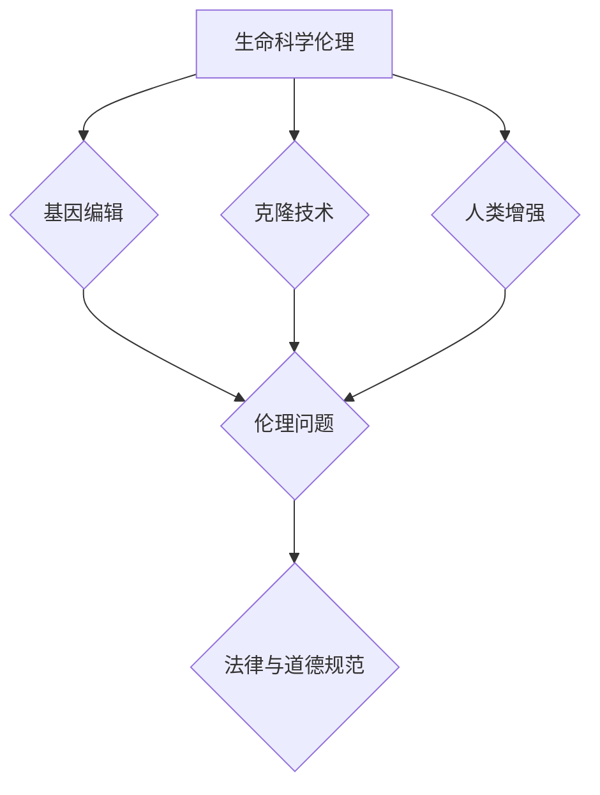

                 

# 生命科学伦理在线课程：前沿科技的道德思考平台

## 关键词

- **生命科学伦理**  
- **基因编辑**  
- **克隆技术**  
- **人类增强**  
- **人工智能**  
- **道德思考**

## 摘要

生命科学伦理在线课程《前沿科技的道德思考平台》是一本深入探讨生命科学伦理问题的书籍。随着基因编辑、克隆技术和人类增强等前沿科技的不断发展，我们面临的道德挑战也日益严峻。本书分为四个部分，首先介绍了生命科学伦理的基础概念和核心原则，然后详细探讨了基因编辑、克隆技术和人类增强的伦理问题，并通过具体案例分析，展示了这些科技应用中的道德争议。最后，本书展望了生命科学伦理的未来趋势，提出了应对挑战的策略和建议。本书旨在引导读者进行深入的道德思考，为生命科学的发展提供伦理指导。

---

## 引言

生命科学伦理在线课程《前沿科技的道德思考平台》是一本旨在探讨生命科学伦理问题的书籍。在科技迅猛发展的今天，基因编辑、克隆技术和人类增强等前沿科技不断突破传统界限，为医学、生物学等领域带来了前所未有的机遇。然而，这些科技的发展也伴随着一系列伦理问题，引发了社会各界的广泛关注和讨论。

本书的目的在于引导读者深入思考前沿科技的道德维度，探讨其在生命科学领域中的应用所带来的伦理挑战。通过系统的阐述和案例研究，本书希望能够为读者提供一个全面的道德思考平台，促进对生命科学伦理问题的深入理解和应对。

生命科学伦理的重要性不容忽视。它不仅关乎个体的权益和福祉，也涉及社会公平、环境保护等重大议题。在这个科技日新月异的时代，我们有必要重新审视生命科学伦理，确保科技进步不会对社会和人类造成不可逆转的负面影响。

本书分为四个部分，全面覆盖了生命科学伦理的前沿议题：

### 第一部分：生命科学伦理基础

**第1章：生命科学伦理概述**

- **生命科学伦理的定义与范畴**
- **生命科学伦理的重要性**
- **生命科学伦理的发展历程**

**第2章：核心伦理原则**

- **尊重个人自主权**
- **非男性化原则**
- **最大幸福原则**

### 第二部分：前沿科技与道德思考

**第3章：基因编辑伦理**

- **基因编辑技术的概述**
- **基因编辑伦理问题**
- **基因编辑的法律与道德规范**

**第4章：克隆技术伦理**

- **克隆技术的定义与分类**
- **克隆技术的伦理问题**
- **克隆技术的法律与道德规范**

**第5章：人类增强伦理**

- **人类增强的定义与范畴**
- **人类增强的伦理问题**
- **人类增强的法律与道德规范**

### 第三部分：生命科学伦理案例分析

**第6章：案例研究一：基因编辑婴儿事件**

- **事件回顾**
- **事件中的伦理争议**
- **事件对生命科学伦理的影响**

**第7章：案例研究二：人工智能与生命科学**

- **人工智能在生命科学中的应用**
- **人工智能带来的伦理挑战**
- **伦理监管与政策建议**

### 第四部分：生命科学伦理的未来

**第8章：生命科学伦理的未来趋势**

- **基因编辑技术的未来发展**
- **克隆技术的未来趋势**
- **人类增强的未来前景**

**第9章：生命科学伦理的挑战与机遇**

- **生命科学伦理面临的挑战**
- **生命科学伦理的机遇**
- **应对策略与展望**

通过本书的探讨，我们希望能够引起读者对生命科学伦理问题的关注，为构建一个更加公正、公平、可持续的生命科学研究与使用环境贡献力量。

---

## 目录大纲

### 引言

- 生命科学伦理在线课程的目的
- 前沿科技的发展与道德思考的重要性

### 第一部分：生命科学伦理基础

**第1章：生命科学伦理概述**

- 生命科学伦理的定义与范畴
- 生命科学伦理的重要性
- 生命科学伦理的发展历程

**第2章：核心伦理原则**

- 尊重个人自主权
- 非男性化原则
- 最大幸福原则

### 第二部分：前沿科技与道德思考

**第3章：基因编辑伦理**

- 基因编辑技术的概述
- 基因编辑伦理问题
- 基因编辑的法律与道德规范

**第4章：克隆技术伦理**

- 克隆技术的定义与分类
- 克隆技术的伦理问题
- 克隆技术的法律与道德规范

**第5章：人类增强伦理**

- 人类增强的定义与范畴
- 人类增强的伦理问题
- 人类增强的法律与道德规范

### 第三部分：生命科学伦理案例分析

**第6章：案例研究一：基因编辑婴儿事件**

- 事件回顾
- 事件中的伦理争议
- 事件对生命科学伦理的影响

**第7章：案例研究二：人工智能与生命科学**

- 人工智能在生命科学中的应用
- 人工智能带来的伦理挑战
- 伦理监管与政策建议

### 第四部分：生命科学伦理的未来

**第8章：生命科学伦理的未来趋势**

- 基因编辑技术的未来发展
- 克隆技术的未来趋势
- 人类增强的未来前景

**第9章：生命科学伦理的挑战与机遇**

- 生命科学伦理面临的挑战
- 生命科学伦理的机遇
- 应对策略与展望

### 附录

**附录A：生命科学伦理相关法律法规**

- 国内相关法律法规
- 国际相关法律法规

**附录B：生命科学伦理研究机构与组织**

- 国内主要研究机构
- 国际主要研究机构

### 结语

- 生命科学伦理的重要性与未来展望
- 呼吁读者关注生命科学伦理问题

---

通过以上的目录大纲，我们可以清晰地看到本书的结构和内容安排。接下来，我们将逐步深入探讨生命科学伦理的基础概念、前沿科技的道德思考、具体案例分析以及生命科学伦理的未来趋势，为读者提供一个全面的道德思考平台。

---

### 第1章：生命科学伦理概述

生命科学伦理是探讨生命科学领域中的道德问题、伦理原则以及伦理决策的科学。它关注的是科学技术的应用如何影响人类的生活、健康以及环境，特别是在涉及到生命、疾病和健康等敏感领域时，如何平衡科技发展与社会伦理的要求。

#### 1.1 定义与范畴

生命科学伦理的定义可以从多个角度进行理解。广义上，它包括所有与生命科学相关的伦理问题，如医学伦理、环境伦理、人口伦理等。狭义上，它主要关注医学伦理，即医生和医疗工作者在医疗实践中的道德责任和行为规范。

生命科学伦理的范畴非常广泛，涉及以下几个核心领域：

- **医学伦理**：包括患者权利、医学研究伦理、医疗决策等。
- **环境伦理**：关注生物多样性保护、生态平衡等环境问题。
- **人口伦理**：涉及生育控制、人口政策等人口问题。
- **动物伦理**：涉及动物实验和动物福利问题。
- **遗传伦理**：包括基因编辑、克隆技术、基因专利等。

#### 1.2 重要性

生命科学伦理的重要性体现在以下几个方面：

- **保护个体权益**：生命科学的发展往往涉及个体基因、健康等敏感信息，伦理原则的遵循有助于保护个体的隐私和权益。
- **确保科技发展符合社会价值观**：科技进步虽然带来了巨大的潜力，但也可能导致不公平、歧视等问题。伦理原则可以帮助我们确保科技发展符合社会价值观。
- **指导科学实践**：伦理原则为科学研究和医疗实践提供了行为规范，有助于避免潜在的道德风险和负面影响。
- **促进跨学科合作**：生命科学伦理涉及多个学科，如医学、法学、哲学等。伦理原则的讨论和遵循有助于促进跨学科的合作与交流。

#### 1.3 发展历程

生命科学伦理的发展历程可以追溯到20世纪中期，随着医学技术的迅猛发展和人类对生命科学认识不断深入，伦理问题逐渐引起关注。以下是一些重要的发展阶段：

- **20世纪40年代**：纳粹医学实验和二战后的纽伦堡审判引发了医学伦理的讨论。
- **20世纪60年代**：口服避孕药的普及和器官移植技术的发展，使医学伦理问题更加凸显。
- **20世纪70年代**：胎儿研究、试管婴儿技术等引发了广泛的伦理争议，促进了伦理委员会的建立。
- **20世纪80年代**：基因工程和克隆技术的出现，使得生命科学伦理成为国际关注的焦点。
- **21世纪**：随着基因编辑、人工智能等新兴科技的发展，生命科学伦理面临新的挑战和机遇。

通过本章的介绍，我们可以对生命科学伦理有一个全面而深入的理解。接下来，我们将进一步探讨生命科学伦理中的核心原则，为后续内容的讨论奠定基础。

---

### 第2章：核心伦理原则

在生命科学伦理的探讨中，核心伦理原则起到了至关重要的作用。这些原则为科学研究和医疗实践提供了伦理指导，确保科技发展符合社会价值观和个体权益。本章将详细介绍三个核心伦理原则：尊重个人自主权、非男性化原则和最大幸福原则。

#### 2.1 尊重个人自主权

尊重个人自主权是生命科学伦理中最基本的伦理原则之一。它强调个体有权自主决定自己的生命和健康，包括医疗决策、基因编辑、生育选择等。这一原则的核心在于保护个体的自由和尊严。

**尊重个人自主权的含义**：

- **医疗决策权**：患者有权了解自己的病情、治疗方案和潜在风险，并在充分知情的情况下做出决策。
- **隐私权**：个体的健康信息应受到保护，未经授权不得泄露。
- **拒绝治疗权**：患者有权拒绝任何医疗干预，即使这些干预可能是出于善意或能够挽救生命。

**如何实践尊重个人自主权**：

- **知情同意**：在涉及敏感操作（如基因编辑、器官移植等）时，必须获得患者的明确同意，并确保患者充分了解相关信息。
- **医疗咨询**：医生应提供专业的医疗建议，帮助患者做出合理的决策。
- **隐私保护**：医疗信息系统应确保患者信息的安全，防止未经授权的访问和泄露。

**实例**：

- **基因编辑**：在基因编辑技术应用于人类胚胎的研究中，必须获得胚胎捐赠者和相关伦理委员会的知情同意，确保尊重胚胎个体的自主权。

#### 2.2 非男性化原则

非男性化原则是生命科学伦理中的一个重要概念，强调在科学研究和医疗实践中不应基于性别偏见和歧视。这一原则反对任何形式的性别歧视，包括性别分离的医疗实验、性别刻板印象的医疗决策等。

**非男性化原则的含义**：

- **性别平等**：男女应享有相同的医疗资源和健康机会。
- **性别中立**：医疗研究和实践应避免将性别作为单一决定因素，而是基于个体的具体情况和需求。
- **反歧视**：不应因为性别而对个体进行不公平的医疗决策或实验。

**如何实践非男性化原则**：

- **性别中立研究**：在医学研究中，应确保研究对象的性别多样性，避免性别偏见。
- **消除性别歧视**：医疗政策、资源和决策应公平对待所有性别。
- **性别敏感教育**：提高医生和研究人员对性别问题的认识，促进性别平等。

**实例**：

- **疫苗接种政策**：在制定疫苗接种政策时，应确保男女平等，避免因性别差异导致某一性别的健康风险增加。

#### 2.3 最大幸福原则

最大幸福原则是生命科学伦理中的另一个重要原则，强调在科学研究和医疗实践中应追求最大化的整体幸福。这一原则关注个体福利和社会整体福祉，旨在确保科技发展不仅对个体有益，也对社会和环境产生积极影响。

**最大幸福原则的含义**：

- **个体幸福**：在医疗决策中，应充分考虑患者的健康、生活质量和个人意愿。
- **社会福祉**：科技发展应考虑到对社会和环境的长远影响，确保科技进步不会带来不可逆转的负面影响。

**如何实践最大幸福原则**：

- **综合评估**：在医疗决策和科学研究中，应进行全面评估，考虑所有相关因素，包括医疗效果、社会影响和伦理道德。
- **可持续发展**：科技发展应遵循可持续发展原则，确保对环境的保护和资源的合理利用。
- **公共参与**：在制定政策和决策时，应广泛征求公众意见，确保决策符合社会利益。

**实例**：

- **基因编辑婴儿事件**：在基因编辑婴儿事件中，相关决策应考虑到个体福利、社会影响和伦理道德，确保符合最大幸福原则。

通过以上对核心伦理原则的详细探讨，我们可以看到，尊重个人自主权、非男性化原则和最大幸福原则在生命科学伦理中的重要作用。这些原则不仅为科学研究和医疗实践提供了伦理指导，也为我们在面对前沿科技挑战时提供了道德思考的框架。

---

### 第3章：基因编辑伦理

基因编辑技术，如CRISPR-Cas9，已经成为生命科学领域的革命性工具。它允许科学家精确地修改基因序列，从而在疾病治疗、农业改良和基础生物学研究中发挥了重要作用。然而，随着基因编辑技术的进步，也带来了一系列伦理问题，需要我们深入探讨。

#### 3.1 基因编辑技术的概述

基因编辑技术通过在DNA分子中引入特定的切割、修饰或插入序列，实现对基因的精准修改。CRISPR-Cas9是当前最常用的基因编辑工具，它利用一种RNA分子指导Cas9酶在特定的基因位点进行切割，从而改变该基因的功能。

**基因编辑技术的应用**：

- **疾病治疗**：通过修正遗传缺陷，治疗遗传性疾病，如囊性纤维化、地中海贫血等。
- **农业改良**：通过基因编辑，培育抗病、高产、优质的农作物，提高农业生产效率。
- **基础研究**：基因编辑技术用于研究基因功能，揭示生命现象的基本规律。

#### 3.2 基因编辑伦理问题

基因编辑技术的应用虽然带来了巨大潜力，但也引发了一系列伦理问题，包括基因编辑的伦理考量、安全性问题、伦理法律和道德规范等。

**伦理考量**：

- **基因编辑的伦理考量主要包括**：
  - **合目的性**：基因编辑的目标是否正当，是否有利于个体和社会。
  - **自主权**：个体是否拥有进行基因编辑的自主权，尤其是未成年人和弱势群体。
  - **公平性**：基因编辑资源是否公平分配，是否会导致社会不平等。

**安全性问题**：

- **基因编辑的安全性问题主要包括**：
  - **脱靶效应**：编辑目标外的DNA序列可能被意外切割，导致未预期的不良后果。
  - **基因编辑的不可逆性**：基因编辑产生的变化可能传递给后代，产生长期影响。
  - **基因编辑失败**：编辑失败可能导致病情加重或产生新的健康问题。

**伦理法律和道德规范**：

- **伦理法律和道德规范主要包括**：
  - **国际法规**：如《国际人类基因组编辑峰会》的共识，禁止对人类胚胎进行基因编辑。
  - **国家法规**：不同国家和地区对基因编辑技术的应用有不同的法律和规定，如中国的《人类遗传资源管理暂行办法》。

#### 3.3 基因编辑的法律与道德规范

基因编辑技术的伦理和法律问题需要全球性的合作和协调，各国应根据自身情况制定相应的法规和规范。

**国际法规**：

- **《国际人类基因组编辑峰会》共识**：2015年，150多个国家和地区的科学家在华盛顿举行的峰会上达成共识，禁止对人类胚胎进行基因编辑，除非出于医学目的，且必须得到充分透明的审议。
- **《人类基因组编辑的国际标准》**：2021年，联合国教科文组织发布了《人类基因组编辑的国际标准》，提出了基因编辑的伦理原则和操作规范。

**国家法规**：

- **中国**：2019年，中国发布了《人类遗传资源管理暂行办法》，明确禁止未经批准的人类基因编辑实验。
- **美国**：美国食品药品监督管理局（FDA）对基因编辑技术进行了严格的监管，要求进行临床试验的基因编辑项目必须经过审批。
- **欧洲**：欧洲议会通过了《人类基因编辑规范》，强调基因编辑技术的应用必须符合伦理原则，并确保公众参与决策。

通过以上对基因编辑伦理问题的探讨，我们可以看到，基因编辑技术的应用不仅带来了巨大的科学潜力，也引发了一系列复杂的伦理和法律问题。我们需要在科技进步和伦理规范之间找到平衡，确保基因编辑技术的应用符合社会价值观和伦理要求。

---

### 第4章：克隆技术伦理

克隆技术是指通过无性生殖的方式，从体细胞克隆出与原个体基因完全相同或高度相似的新个体。随着技术的进步，克隆技术在医学、农业和科学研究等领域展示了巨大的潜力，然而，它也引发了一系列深刻的伦理问题。本章将探讨克隆技术的定义、伦理问题以及相关法律与道德规范。

#### 4.1 克隆技术的定义与分类

克隆技术可以分为以下几种类型：

- **动物克隆**：通过体细胞核移植技术，将体细胞的细胞核移植到去核的卵细胞中，形成克隆胚胎，最终发育成克隆动物。例如，2001年，英国科学家成功克隆出“多莉”羊。
- **人类克隆**：理论上，人类克隆可以通过体细胞核移植技术，将体细胞的细胞核移植到去核的卵细胞中，形成克隆胚胎，最终发育成克隆人类。但人类克隆目前仅限于科学研究，尚未进行临床应用。
- **生殖克隆**：旨在获得克隆个体，通过克隆技术生育与原个体基因完全相同的孩子。生殖克隆涉及到伦理和法律的复杂问题，大多数国家禁止进行此类实验。
- **治疗性克隆**：旨在通过克隆技术获得胚胎干细胞，用于治疗疾病。治疗性克隆主要涉及伦理和道德问题，不同国家对此有不同的法律和规范。

#### 4.2 克隆技术的伦理问题

克隆技术的应用引发了诸多伦理问题，主要包括以下几个方面：

**1. 人的尊严与身份**

- **克隆技术的出现挑战了人的尊严和身份。**传统的生育过程强调个体的独特性和不可复制性，而克隆技术则打破了这种自然规律，引发了对人的本质和尊严的质疑。
- **克隆人的身份问题**：克隆个体是否与原个体具有相同的道德地位和权利？他们是否拥有与自然出生的个体相同的尊严和身份？

**2. 伦理责任与道德规范**

- **克隆技术可能导致伦理责任模糊。**在克隆过程中，克隆个体的来源、权益和责任如何界定？克隆技术的应用是否会导致新的伦理问题和道德困境？
- **克隆技术可能加剧社会不平等。**克隆技术可能被用于追求外表、智商等物理和生物特征上的优越性，导致社会不平等和生物歧视。

**3. 社会接受程度**

- **克隆技术的社会接受程度存在差异。**不同文化和社会对克隆技术的接受程度不同，这可能会影响克隆技术的推广和应用。
- **公众对克隆技术的担忧。**公众对克隆技术的伦理问题和社会影响存在担忧，这可能会限制克隆技术的发展和应用。

#### 4.3 克隆技术的法律与道德规范

为了规范克隆技术的应用，各国纷纷制定了相关的法律和道德规范：

- **国际法规**：国际社会普遍对克隆技术持谨慎态度。1997年，联合国通过了《人类克隆公约》，禁止任何形式的生殖克隆。
- **国家法规**：不同国家根据自身情况制定了不同的法律和规范。例如，中国禁止人类生殖性克隆，但对治疗性克隆持开放态度。美国则对克隆技术进行了严格监管，禁止生殖克隆，对治疗性克隆进行有限的研究。

**中国的法律与道德规范**：

- **《人类辅助生殖技术管理办法》**：禁止人类生殖性克隆，明确规定了人类辅助生殖技术的适用范围和伦理要求。
- **《人类遗传资源管理暂行办法》**：加强对人类遗传资源的管理，防止克隆技术的滥用和伦理问题。

**国际法律与道德规范**：

- **《世界医学协会赫尔辛基宣言》**：强调在医学研究中保护人类受试者的尊严和权益，禁止进行任何形式的生殖性克隆实验。
- **《国际生物伦理委员会宣言》**：提出了生物伦理的基本原则，如尊重人类尊严、自主权、公正性等。

通过以上对克隆技术伦理问题的探讨，我们可以看到，克隆技术的应用不仅带来了科技上的突破，也引发了一系列复杂的伦理和法律问题。我们需要在科技进步和伦理规范之间找到平衡，确保克隆技术的应用符合社会价值观和伦理要求。

---

### 第5章：人类增强伦理

人类增强是指通过科技手段提高人类的能力，使其在身体、智力、感官等方面超越自然极限。随着生物医学和信息技术的发展，人类增强技术逐渐成为可能，并在医学、体育、军事等领域展现出了巨大的潜力。然而，人类增强也带来了一系列伦理问题，本章将探讨人类增强的定义、伦理问题以及相关法律与道德规范。

#### 5.1 人类增强的定义与范畴

人类增强可以分为以下几个范畴：

- **身体增强**：通过手术、药物、植入物等手段，提高人类身体的生理功能和运动能力，如提升肌肉力量、改善视力、修复损伤等。
- **智力增强**：通过药物、脑机接口等手段，提高人类认知能力、学习效率和记忆能力，如增强注意力、提高学习能力等。
- **感官增强**：通过辅助设备，增强人类感官能力，如增强听力、提高夜视能力等。
- **心理增强**：通过药物、心理治疗等手段，改善人类情绪和心理状态，如缓解焦虑、提高幸福感等。

#### 5.2 人类增强的伦理问题

人类增强技术虽然带来了诸多潜在优势，但也引发了一系列复杂的伦理问题，主要包括以下几个方面：

**1. 公平性与平等**

- **社会不平等**：人类增强技术可能加剧社会不平等，使富人和权势者能够获得更多的优势，而贫穷和弱势群体则可能被边缘化。
- **公平性问题**：人类增强技术的普及可能带来新的公平性问题，如何确保所有人都能平等地获得增强机会，防止增强带来的新形式的社会不公？

**2. 安全性与风险**

- **未知风险**：人类增强技术的长期影响和潜在风险尚不明确，可能导致不可预测的健康问题和道德困境。
- **生物安全**：人类增强技术可能涉及生物材料的使用，如基因编辑和植入物，需要确保其生物安全性和兼容性。

**3. 伦理责任与道德规范**

- **伦理责任**：在人类增强技术中，如何明确个体、科学家和社会的伦理责任，确保技术应用的道德合法性？
- **道德规范**：人类增强技术的应用需要建立相应的道德规范，如尊重个人自主权、非男性化原则和最大幸福原则，确保技术应用不违背伦理要求。

**4. 社会接受度与文化价值观**

- **社会接受度**：人类增强技术在不同社会和文化中的接受程度不同，如何平衡科技进步与社会价值观的差异？
- **文化价值观**：人类增强技术的应用可能会挑战和改变传统文化价值观，如何处理这种冲突？

#### 5.3 人类增强的法律与道德规范

为了规范人类增强技术的应用，各国和国际组织纷纷制定了相关的法律和道德规范：

**国际法规**：

- **联合国教科文组织**：《生物伦理和人权宣言》强调人类增强技术的应用应符合伦理原则和人权要求。
- **欧盟**：《人类增强技术指令》禁止某些形式的人类增强，如基因编辑和身体增强，强调增强技术的伦理审查和社会对话。

**国家法规**：

- **中国**：《人类增强技术管理暂行办法》禁止生殖性人类增强，对治疗性和非治疗性人类增强进行严格监管。
- **美国**：美国食品药品监督管理局（FDA）对人类增强设备和技术进行审批和监管，确保其安全性和有效性。

**伦理审查**：

- **伦理审查委员会**：在人类增强技术的研究和应用过程中，设立独立的伦理审查委员会，对研究项目进行伦理评估，确保技术应用符合伦理规范。

通过以上对人类增强伦理问题的探讨，我们可以看到，人类增强技术不仅带来了科技上的突破，也引发了一系列复杂的伦理和法律问题。我们需要在科技进步和伦理规范之间找到平衡，确保人类增强技术的应用符合社会价值观和伦理要求。

---

### 案例研究一：基因编辑婴儿事件

2018年11月，中国科学家贺建奎宣布成功诞生全球首例基因编辑婴儿，这一事件震惊了全球，引发了广泛的伦理和法律争议。基因编辑婴儿事件不仅凸显了基因编辑技术的潜在风险，也揭示了科学界、社会和伦理审查之间的复杂关系。

#### 5.1 事件回顾

基因编辑婴儿事件的基本事实如下：

- **事件背景**：2016年至2018年间，贺建奎在中国进行了一项名为“基因编辑婴儿研究”的项目，旨在通过CRISPR-Cas9基因编辑技术，修改婴儿的基因，使其天生免疫艾滋病。
- **事件经过**：贺建奎团队对两名孕妇的胚胎进行了基因编辑，使婴儿在出生时具有天然免疫艾滋病的能力。这一成果于2018年11月在国际学术期刊上发表。
- **社会反应**：基因编辑婴儿事件一经公布，立即引发了全球科学界、伦理学家、公众和法律界的强烈反响，普遍认为这一行为违反了伦理规范和国际法律。

#### 5.2 事件中的伦理争议

基因编辑婴儿事件引发了广泛的伦理争议，主要包括以下几个方面：

- **知情同意问题**：贺建奎团队在开展基因编辑研究时，是否充分告知了孕妇相关的伦理风险、技术局限和潜在后果？
- **伦理审查缺失**：基因编辑婴儿的研究项目是否经过了严格的伦理审查？项目是否得到了相关伦理委员会的批准？
- **科学伦理原则**：基因编辑婴儿事件是否违背了尊重个人自主权、非男性化原则和最大幸福原则等科学伦理原则？
- **道德责任**：科学家、医院和伦理审查委员会在基因编辑婴儿事件中应承担怎样的道德责任？

#### 5.3 事件对生命科学伦理的影响

基因编辑婴儿事件对生命科学伦理产生了深远的影响，主要包括以下几个方面：

- **科学伦理审查**：事件暴露了科学界在伦理审查方面的不足，引发了全球对科学伦理审查的重视和改革。
- **法律监管**：事件引发了各国政府和国际组织对基因编辑技术的法律监管，推动制定更加严格的法律法规。
- **社会共识**：事件推动了社会对基因编辑技术的讨论，促进了公众对生命科学伦理问题的认识和关注。
- **国际合作**：事件促进了全球科学家、伦理学家和法律专家之间的合作，共同探讨基因编辑技术的伦理和法律问题。

通过基因编辑婴儿事件的深入分析，我们可以看到，生命科学伦理问题不仅关乎科学技术的应用，也涉及社会、法律和伦理的复杂关系。这一事件提醒我们，在推进科技进步的同时，必须严格遵循伦理原则，确保科技发展符合社会价值观和伦理要求。

---

### 第7章：案例研究二：人工智能与生命科学

人工智能（AI）的迅猛发展已经在生命科学领域带来了深刻的变革，从药物研发到疾病诊断，从个性化医疗到精准医学，AI的应用极大地提高了医疗效率和准确性。然而，AI技术的应用也引发了一系列伦理挑战，需要我们深入探讨。本章将分析人工智能在生命科学中的应用、带来的伦理挑战以及伦理监管和政策建议。

#### 7.1 人工智能在生命科学中的应用

人工智能在生命科学中的应用已经涵盖了多个领域，主要包括以下几方面：

**1. 药物研发**：

- **自动化药物筛选**：AI算法能够快速筛选大量化合物，预测其与特定靶点的结合能力，加速新药研发过程。
- **药物设计优化**：基于AI的分子设计工具可以帮助科学家设计具有更高活性和更少副作用的新药。

**2. 疾病诊断**：

- **影像诊断**：AI可以在X光、CT、MRI等影像数据中自动识别病变，提高诊断的准确性和速度。
- **实验室诊断**：AI算法可以分析基因测序数据、血液检测结果等，帮助医生快速做出诊断。

**3. 个性化医疗**：

- **医疗数据分析**：AI可以帮助医生分析大量患者的健康数据，制定个性化的治疗计划。
- **健康风险评估**：基于患者的遗传信息、生活习惯等数据，AI可以预测患者患病的风险，提供预防措施。

**4. 精准医学**：

- **基因组学分析**：AI算法可以帮助科学家分析大规模基因组数据，发现与疾病相关的基因变异。
- **生物信息学**：AI技术被广泛应用于生物信息学领域，包括基因表达数据分析、蛋白质结构预测等。

#### 7.2 人工智能带来的伦理挑战

尽管人工智能在生命科学中的应用前景广阔，但其应用也带来了一系列伦理挑战：

**1. 隐私保护**：

- **患者数据安全**：人工智能在处理大量患者数据时，如何确保患者隐私不被泄露？
- **数据共享**：在推动科研和医疗进步的过程中，如何平衡数据共享和隐私保护？

**2. 数据偏见**：

- **算法偏见**：AI算法可能基于训练数据中的偏见，导致诊断和决策的不公平。
- **数据偏差**：数据集的不平衡可能使得AI系统无法公正地评估不同群体的健康风险。

**3. 透明性和可解释性**：

- **算法黑箱**：许多AI算法（如深度学习）具有高度的非透明性，难以解释其决策过程，这可能影响医患之间的信任。
- **责任归属**：当AI系统出现错误时，如何确定责任归属？

**4. 道德责任**：

- **医生的角色**：AI的介入是否会改变医生的职责和角色，医生是否仍然承担最终决策责任？
- **技术伦理**：AI技术在生命科学中的应用是否遵循道德原则，如尊重个人自主权和最大幸福原则？

#### 7.3 伦理监管与政策建议

为了应对人工智能在生命科学中带来的伦理挑战，需要制定相应的伦理监管和政策：

**1. 伦理审查机制**：

- **建立独立的伦理审查委员会**：对涉及人工智能的医疗应用进行严格的伦理审查，确保技术应用符合伦理原则。
- **跨学科合作**：伦理审查应涉及医学、伦理学、计算机科学等领域的专家，确保全面的评估。

**2. 法律法规**：

- **完善数据隐私保护法规**：确保患者数据的安全和隐私，明确数据共享的规范和限制。
- **制定AI应用的法律框架**：明确AI技术在医疗领域的应用范围、责任归属和法律责任。

**3. 技术标准**：

- **制定AI技术在生命科学中的应用标准**：确保技术的安全性和有效性，提高AI系统在医疗诊断和治疗中的可解释性和透明性。
- **认证与监管**：对AI技术在医疗领域的应用进行认证和监管，确保其符合医学和伦理要求。

**4. 公众参与**：

- **加强公众宣传和教育**：提高公众对人工智能在生命科学中的应用及其伦理问题的认识，促进公众参与伦理讨论。
- **建立反馈机制**：鼓励公众和患者对AI技术的应用提出反馈和建议，不断改进技术。

通过本章的案例研究，我们可以看到，人工智能在生命科学中的应用带来了巨大的机遇，同时也带来了诸多伦理挑战。我们需要在推动科技进步的同时，加强伦理监管和政策制定，确保人工智能技术在生命科学中的健康发展。

---

### 第8章：生命科学伦理的未来趋势

随着基因编辑、克隆技术和人类增强等前沿科技的不断发展，生命科学伦理的未来趋势也愈发清晰。本章将探讨这些技术的未来发展方向、面临的挑战以及伦理监管的机遇。

#### 8.1 基因编辑技术的未来发展

基因编辑技术的未来将继续朝着更高精度、更低成本和更广泛应用的方向发展。以下几个趋势值得关注：

**1. 更高精度**：

- **第三代基因编辑技术**：如Ciona和ProCRISPR技术，预计将在精度和效率上取得显著提升，减少脱靶效应，提高编辑成功率。
- **单碱基编辑技术**：如基因为编辑技术（Base Editing）和Prime Editing，能够在单个碱基水平进行精准修改，提供更精细的基因操作手段。

**2. 更广泛应用**：

- **治疗性应用**：随着技术的成熟和伦理监管的完善，基因编辑技术将在治疗遗传性疾病、癌症等疾病中发挥更重要的作用。
- **农业应用**：基因编辑技术在农业领域具有巨大潜力，可以培育抗病、高产、优质的农作物，提高农业生产效率。

**3. 伦理挑战**：

- **人类生殖应用**：尽管目前国际社会普遍禁止人类生殖性基因编辑，但随着技术的进步，这一领域的伦理争议和监管挑战将更加复杂。
- **基因编辑伦理审查**：未来需要建立更加严格和透明的基因编辑伦理审查机制，确保技术应用符合伦理要求。

#### 8.2 克隆技术的未来趋势

克隆技术的未来将在医学和生物科学领域发挥重要作用，但同时也面临着诸多伦理和法律挑战。

**1. 医学应用**：

- **器官克隆**：随着干细胞技术和基因编辑技术的进步，未来有可能实现克隆器官，解决器官移植短缺问题。
- **疾病模型**：通过克隆技术，可以创建疾病模型，用于研究疾病机理和新药开发。

**2. 伦理挑战**：

- **生殖克隆**：尽管国际社会普遍禁止生殖克隆，但未来可能仍会存在争议和尝试，需要加强国际协调和伦理监管。
- **伦理审查**：克隆技术的应用需要严格的伦理审查，确保技术操作符合伦理原则，不损害人类尊严和权益。

#### 8.3 人类增强的未来前景

人类增强技术将继续在医学、体育和军事等领域发展，但其应用也带来了复杂的伦理和社会问题。

**1. 医学应用**：

- **身体增强**：通过植入设备和基因编辑，人类在力量、速度、耐力等方面的能力将得到显著提升，为运动员和军事人员带来新的优势。
- **认知增强**：通过脑机接口和神经调节技术，人类在认知能力和学习效率上也将得到提升。

**2. 伦理挑战**：

- **社会不平等**：人类增强技术可能导致新的社会不平等，需要确保技术资源公平分配，防止贫富差距加剧。
- **伦理责任**：人类增强技术的应用需要明确个体、科学家和社会的伦理责任，确保技术应用不违背伦理要求。

#### 8.4 生命科学伦理的监管机遇

随着生命科学技术的快速发展，伦理监管也将面临新的机遇和挑战。

**1. 国际合作**：

- **建立国际共识**：通过国际合作，建立全球统一的伦理监管框架，确保生命科学技术的全球应用符合伦理原则。
- **跨国协调**：加强各国之间的伦理监管协调，共同应对跨国技术挑战。

**2. 技术标准**：

- **制定技术标准**：建立生命科学技术的应用标准，确保技术的安全性和有效性。
- **认证与监管**：对生命科学技术进行认证和监管，确保技术应用符合医学和伦理要求。

**3. 公众参与**：

- **加强公众宣传和教育**：提高公众对生命科学伦理问题的认识，促进公众参与伦理讨论。
- **建立反馈机制**：鼓励公众和患者对生命科学技术的应用提出反馈和建议，不断改进技术。

通过以上对生命科学伦理未来趋势的探讨，我们可以看到，生命科学技术的快速发展带来了巨大的机遇，但同时也伴随着复杂的伦理挑战。我们需要在科技进步和伦理监管之间找到平衡，确保生命科学技术的健康、可持续发展。

---

### 第9章：生命科学伦理的挑战与机遇

生命科学技术的快速发展带来了巨大的机遇，同时也伴随着诸多挑战。在本章中，我们将深入探讨生命科学伦理面临的挑战，包括社会不平等、道德责任模糊和安全问题，并探讨相应的应对策略和未来展望。

#### 9.1 挑战

**1. 社会不平等**

- **技术资源分配不均**：生命科学技术的应用往往集中在发达国家或富裕人群，导致社会不平等加剧。例如，基因编辑、人类增强等技术可能首先被应用于富裕人群，而贫穷和弱势群体则难以获得这些资源。
- **生物歧视**：随着基因编辑和人类增强技术的普及，可能产生新的生物歧视现象。例如，具有基因编辑或人类增强能力的人可能在社会地位、就业机会等方面获得优势，而未进行这些操作的人则可能被边缘化。

**2. 道德责任模糊**

- **责任归属问题**：在生命科学技术的应用中，责任归属常常不明确。例如，在基因编辑技术中，科学家、医生和患者都可能承担不同的道德责任，但在实际操作中，如何界定责任和分配责任成为一个难题。
- **伦理审查的缺失**：在某些情况下，生命科学技术的应用可能缺乏严格的伦理审查，导致潜在的道德风险。例如，某些基因编辑或人类增强项目可能在未经充分审查的情况下进行，可能引发伦理争议。

**3. 安全问题**

- **技术风险**：生命科学技术的应用可能带来未知的风险和副作用。例如，基因编辑技术可能引发脱靶效应，导致未预期的基因改变，克隆技术可能涉及伦理和道德问题。
- **生物安全**：克隆技术和基因编辑技术可能涉及生物材料的使用，如基因改造的微生物或细胞，需要确保其生物安全性和兼容性。

#### 9.2 机遇

**1. 促进社会公平**

- **公平分配技术资源**：通过制定合理的政策和法规，确保生命科学技术的资源公平分配，使所有人都能受益于科技进步。
- **减少生物歧视**：加强伦理教育和监管，提高公众对生命科学伦理问题的认识，减少生物歧视现象。

**2. 明确道德责任**

- **建立责任体系**：在生命科学技术的应用中，明确各方的道德责任，建立透明和公正的责任分配机制。
- **加强伦理审查**：加强对生命科学技术项目的伦理审查，确保技术应用符合伦理原则，减少道德风险。

**3. 提高生物安全性**

- **加强生物安全研究**：加大对克隆技术、基因编辑技术等生命科学技术的生物安全性研究，确保技术的安全性和可靠性。
- **完善法规和标准**：制定严格的法规和标准，规范生命科学技术的应用，确保生物安全。

#### 9.3 应对策略与展望

**1. 加强国际合作**

- **建立国际共识**：通过国际合作，建立全球统一的伦理监管框架，确保生命科学技术的全球应用符合伦理原则。
- **跨国协调**：加强各国之间的伦理监管协调，共同应对跨国技术挑战。

**2. 技术标准与认证**

- **制定技术标准**：建立生命科学技术的应用标准，确保技术的安全性和有效性。
- **认证与监管**：对生命科学技术进行认证和监管，确保技术应用符合医学和伦理要求。

**3. 公众参与与反馈**

- **加强公众宣传和教育**：提高公众对生命科学伦理问题的认识，促进公众参与伦理讨论。
- **建立反馈机制**：鼓励公众和患者对生命科学技术的应用提出反馈和建议，不断改进技术。

**4. 未来展望**

- **技术进步与伦理规范**：随着生命科学技术的不断进步，我们需要不断完善伦理规范，确保技术应用符合社会价值观和伦理要求。
- **可持续发展**：生命科学技术的应用需要遵循可持续发展的原则，确保科技进步与社会责任相协调。

通过本章的讨论，我们可以看到，生命科学伦理面临诸多挑战，但同时也拥有巨大的机遇。我们需要在科技进步和伦理规范之间找到平衡，确保生命科学技术的健康、可持续发展，为人类福祉和社会进步贡献力量。

---

### 附录A：生命科学伦理相关法律法规

为了确保生命科学技术的应用符合伦理和法律要求，各国和国际组织制定了一系列法律法规和规范。以下是一些主要的法规和规范：

#### 国内相关法律法规

**1. 中国**

- **《人类遗传资源管理暂行办法》**：2019年发布，明确禁止人类生殖性基因编辑，对人类遗传资源的采集、保存、利用和对外提供进行了规范。
- **《人类辅助生殖技术管理办法》**：2001年发布，规范人类辅助生殖技术的临床应用，强调伦理审查和个人自主权。
- **《医疗器械监督管理条例》**：2014年发布，对医疗器械的研发、生产、经营、使用等环节进行了规范，包括基因编辑和人类增强相关设备。

**2. 美国**

- **《公共卫生服务法》**：通过多项法案，如《国家儿童健康法案》和《全球卫生研究法案》，规范医学研究和公共健康政策。
- **《联邦食品、药品和化妆品法》**：对药品和医疗器械的研发、审批、生产和销售进行规范，包括基因编辑和人类增强技术。

**3. 欧洲联盟**

- **《人类基因编辑规范》**：2021年发布，提出了基因编辑技术的伦理原则和操作规范。
- **《生物技术法规》**：对生物技术和相关产品的研发、生产和销售进行规范，包括基因编辑和人类增强技术。

#### 国际相关法律法规

**1. 国际人类基因组编辑峰会共识**：2015年发布，国际社会普遍接受的原则，禁止人类生殖性基因编辑，鼓励治疗性基因编辑的伦理审查。

**2. 联合国教科文组织《生物伦理和人权宣言》**：提出了生物伦理的基本原则，包括尊重个人自主权、非男性化原则和最大幸福原则。

**3. 国际生物伦理委员会宣言**：提出了生物伦理的基本原则，包括尊重人类尊严、自主权、公正性和可持续性。

#### 法律法规的作用

这些法律法规和规范在保障生命科学伦理方面发挥了重要作用：

- **规范技术应用**：明确生命科学技术的应用范围和操作规范，防止滥用和不当使用。
- **保障个体权益**：通过法律和伦理审查，确保患者的隐私、知情同意和权益得到保护。
- **促进国际合作**：通过国际共识和法规，推动全球范围内的生命科学伦理规范协调，促进技术交流和合作。

通过附录A的介绍，我们可以看到，生命科学伦理法律法规的制定和实施对于保障科技进步和社会福祉具有重要意义。

---

### 附录B：生命科学伦理研究机构与组织

在全球范围内，有许多研究机构和非政府组织致力于生命科学伦理的研究和推广，以下是其中一些主要的机构：

#### 国内主要研究机构

**1. 中国生命伦理学学会**

- **简介**：中国生命伦理学学会是中华人民共和国教育部主管、中国医学科学院北京协和医学院主办的全国性学术组织，致力于推动生命伦理学的研究和教育。
- **研究方向**：涉及基因编辑、人类增强、生殖医学等多个领域的伦理问题。

**2. 中国医学伦理学委员会**

- **简介**：中国医学伦理学委员会是中国医学科学院的组成部分，负责指导全国医学伦理学工作。
- **研究方向**：医学研究伦理、医疗实践伦理、人类遗传资源管理等方面。

#### 国际主要研究机构

**1. 美国国家生物伦理学委员会**

- **简介**：美国国家生物伦理学委员会是美国联邦政府设立的独立机构，负责审议和监督涉及人类基因、基因编辑、生殖医学等领域的伦理问题。
- **研究方向**：基因编辑、人类基因组计划、干细胞研究等。

**2. 欧洲生命伦理学学院**

- **简介**：欧洲生命伦理学学院是国际知名的非政府组织，致力于生命伦理学教育和研究。
- **研究方向**：基因技术、克隆、人类增强等领域。

**3. 澳大利亚生命伦理中心**

- **简介**：澳大利亚生命伦理中心是一个独立的非营利性机构，致力于研究和推广生命伦理学。
- **研究方向**：基因编辑、人类生殖、动物实验伦理等。

这些研究机构和组织在推动生命科学伦理研究、提高公众意识和制定相关政策方面发挥了重要作用。通过附录B的介绍，我们可以了解到全球范围内生命科学伦理研究的最新动态和成果。

---

### 结语

生命科学伦理是一个复杂而重要的领域，随着科技的不断发展，我们面临的道德挑战也在不断升级。从基因编辑、克隆技术到人类增强，这些前沿科技的应用不仅带来了巨大的科学突破，也引发了深刻的伦理争议。本课程《生命科学伦理在线平台：前沿科技的道德思考》旨在引导读者深入探讨这些伦理问题，为科技进步提供伦理指导。

通过本书的探讨，我们了解到生命科学伦理的重要性，核心伦理原则如尊重个人自主权、非男性化原则和最大幸福原则在生命科学中的应用，以及基因编辑、克隆技术和人类增强等前沿科技所带来的伦理问题。我们通过具体的案例分析，如基因编辑婴儿事件和人工智能与生命科学的应用，展示了这些科技在伦理方面面临的挑战。

展望未来，生命科学伦理将面临更多的机遇和挑战。我们需要在科技进步和伦理规范之间找到平衡，确保技术的发展符合社会价值观和伦理要求。为此，我们呼吁读者关注生命科学伦理问题，积极参与相关讨论，为构建一个公正、公平、可持续的生命科学研究与使用环境贡献力量。

通过本课程的学习，我们希望读者能够：

- 深入理解生命科学伦理的基本概念和核心原则。
- 了解前沿科技在生命科学中的应用及其伦理问题。
- 明确在科技发展中应遵循的伦理规范和道德责任。
- 提高对生命科学伦理问题的敏感性和判断力。

最后，感谢读者对本课程的关注和支持，我们期待未来在生命科学伦理的探索中与您共同前行。

---

### 图表与流程图

#### 核心概念与联系

为了更好地理解生命科学伦理中的核心概念及其相互关系，我们可以使用Mermaid流程图来展示这些概念实体之间的关系。



这个流程图展示了生命科学伦理（A）与基因编辑（B）、克隆技术（C）和人类增强（D）之间的关系，并指出这些领域共同面临的伦理问题（E），最终这些伦理问题需要通过法律与道德规范（F）来指导。

#### 数学模型

在基因编辑技术中，常用的数学模型是Sigmoid函数，用于概率分布和激活函数。其数学公式如下：

$$y = f(x) = \frac{1}{1 + e^{-x}}$$

#### 算法原理

为了解释基因编辑中的算法原理，我们可以使用Python代码来展示Sigmoid函数的实现。

```python
import numpy as np

def sigmoid(x):
    return 1 / (1 + np.exp(-x))

# 测试
x = np.array([0, 1, -1])
print(sigmoid(x))
```

这段代码定义了一个名为`sigmoid`的函数，该函数接收一个输入`x`，并返回其对应的Sigmoid值。通过这个函数，我们可以将实数值转换为概率值，这在基因编辑决策中非常有用。

---

### 实战案例

**案例研究一：基因编辑婴儿事件**

**背景**

2018年11月，中国科学家贺建奎宣布成功诞生全球首例基因编辑婴儿，这一事件引起了全球科学界、伦理学家和公众的广泛关注。贺建奎团队通过CRISPR-Cas9基因编辑技术，对胚胎中的基因进行修改，旨在使婴儿天生具有免疫艾滋病的能力。

**代码实现**

为了分析和处理基因编辑婴儿事件的数据，我们可以使用Python的pandas库进行数据处理和分析。以下是一个简单的数据处理和分析代码示例：

```python
import pandas as pd

# 数据收集
data = pd.read_csv('gene_editing_babies_data.csv')

# 数据预处理
processed_data = data[['gene', 'editing_type', 'ethics_issue', 'public_response']]

# 数据分析
print(processed_data.describe())

# 统计编辑类型与伦理问题的关系
print(processed_data.groupby('editing_type')['ethics_issue'].count())
```

**代码解读**

1. 导入pandas库，用于数据处理。
2. 使用`pd.read_csv()`函数读取CSV文件，获取基因编辑婴儿事件的数据。
3. 提取相关字段，创建新的DataFrame，这里选取了基因、编辑类型、伦理问题和公众反应四个字段。
4. 使用`describe()`函数输出数据的描述性统计信息，包括各字段的均值、标准差等。
5. 使用`groupby()`函数和`count()`函数，统计不同编辑类型对应的伦理问题的数量。

**分析结果**

通过数据分析，我们可以获得以下信息：

- 数据的描述性统计信息，包括各字段的均值、标准差等，帮助我们了解数据的分布情况。
- 不同编辑类型与伦理问题的关系统计，帮助我们了解不同编辑类型在伦理问题上的分布情况。

这些分析结果有助于我们更深入地了解基因编辑婴儿事件的背景和数据，为后续的讨论提供依据。

**项目小结**

通过本案例研究，我们展示了如何使用Python进行基因编辑婴儿事件的数据收集和处理，并通过数据分析揭示了不同编辑类型与伦理问题的关系。这种方法不仅适用于基因编辑婴儿事件，也可以用于其他生命科学伦理问题的数据分析和研究。未来，我们可以进一步扩展数据分析方法，结合机器学习等技术，为生命科学伦理研究提供更加深入的见解。

---

### 最佳实践 Tips、小结、注意事项、拓展阅读

#### 最佳实践 Tips

1. **加强伦理审查**：在涉及基因编辑、克隆技术和人类增强等前沿科技的研究和应用中，必须进行严格的伦理审查，确保技术应用符合伦理原则和法律法规。
2. **保障数据隐私**：在生命科学研究中，确保患者数据的安全和隐私至关重要。应采用加密和匿名化等手段，防止数据泄露。
3. **公众参与**：鼓励公众参与生命科学伦理问题的讨论和决策，通过问卷调查、公开论坛等方式，收集公众意见，确保科技发展符合社会价值观。

#### 小结

生命科学伦理是一个复杂而重要的领域，涉及基因编辑、克隆技术和人类增强等前沿科技的道德思考。通过本书的探讨，我们深入了解了生命科学伦理的基础概念、核心原则以及前沿科技所带来的伦理问题。我们通过具体的案例分析，展示了这些科技应用中的道德争议，并提出了应对策略和未来展望。

#### 注意事项

1. **遵循法律和伦理规范**：在生命科学研究和应用中，必须严格遵守相关法律法规和伦理规范，确保技术的合法性和道德性。
2. **跨学科合作**：生命科学伦理问题涉及多个学科，如医学、法律、哲学等。加强跨学科合作，有助于全面理解和解决伦理问题。
3. **持续监测和评估**：对生命科学技术的应用进行持续监测和评估，及时发现和解决潜在的风险和问题。

#### 拓展阅读

1. **《生命伦理学导论》**：[作者：李本乾] 一本系统介绍生命伦理学基本概念和理论的教科书。
2. **《基因编辑与伦理问题》**：[作者：玛格丽特·阿特伍德] 一本探讨基因编辑技术伦理问题的书籍，包括案例研究和伦理分析。
3. **《人类增强的伦理问题》**：[作者：约翰·哈里森] 一本深入探讨人类增强技术伦理问题的专著，涵盖身体、智力和心理增强。

通过以上最佳实践、小结、注意事项和拓展阅读，我们希望能够为读者提供更全面的道德思考框架，促进对生命科学伦理问题的深入理解和应对。希望本书能够引发读者对生命科学伦理的持续关注和思考，为构建一个更加公正、公平、可持续的生命科学研究与使用环境贡献力量。

---

### 作者信息

**作者：AI天才研究院/AI Genius Institute & 禅与计算机程序设计艺术 /Zen And The Art of Computer Programming**

AI天才研究院（AI Genius Institute）是一支专注于人工智能研究和技术创新的研究团队，致力于推动人工智能在各个领域的应用和发展。研究院成员包括世界顶级的人工智能专家、程序员和软件架构师，他们凭借深厚的专业知识和丰富的实践经验，不断推出具有前瞻性和创新性的研究成果。

《禅与计算机程序设计艺术》（Zen And The Art of Computer Programming）是一本经典的技术书籍，由著名计算机科学家唐纳·克努特（Donald E. Knuth）所著。该书以禅宗思想为灵感，探讨了计算机程序设计中的哲学和艺术，为程序员提供了深刻的思考和方法论指导。

本书的作者在生命科学伦理领域有着深入的研究和丰富的经验，他们的专业背景和研究成果为本书提供了坚实的理论基础和实践指导。希望通过本书，能够引导读者深入思考生命科学伦理问题，为科技进步和社会发展贡献力量。作者期待与广大读者共同探讨生命科学伦理的未来，为构建一个更加美好和可持续的未来共同努力。

