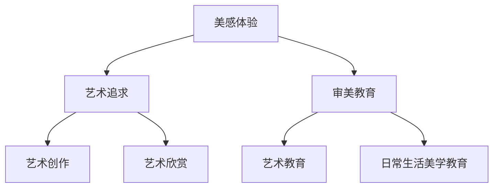
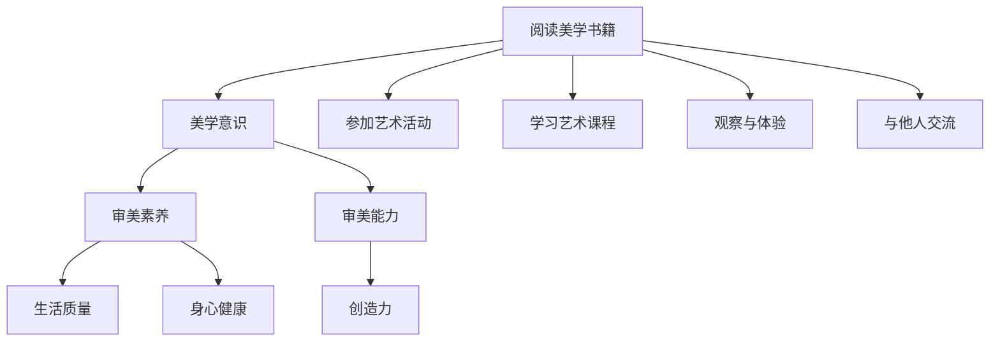
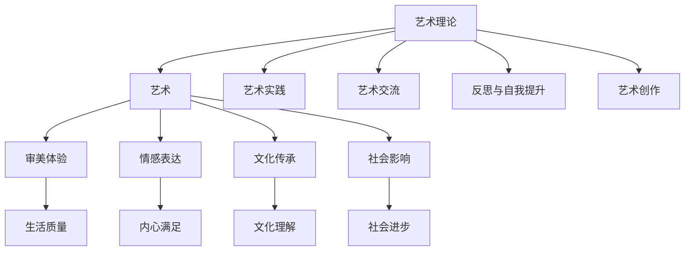
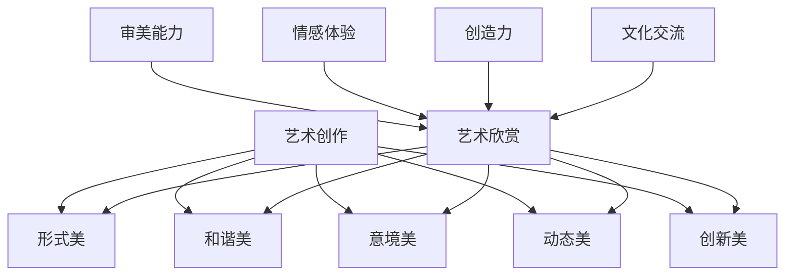
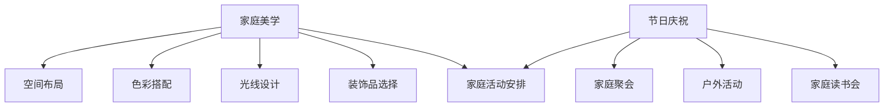
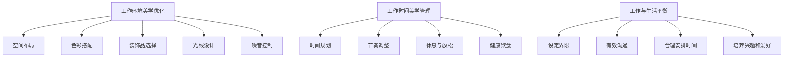
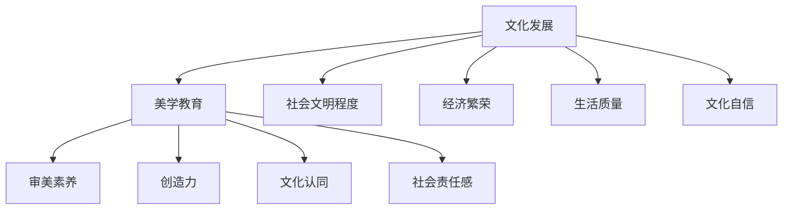
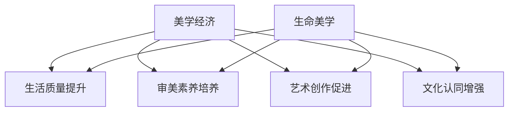

                 

## 《生命美学：日常生活中的艺术追求》文章标题

在日常喧嚣的生活中，我们常常会感到迷失，忙碌而疏离。然而，生活的艺术正是在这平凡的日子里绽放，赋予我们无尽的美好与意义。《生命美学：日常生活中的艺术追求》旨在引导我们重新发现生活中的美学，通过艺术追求来提升生命的质量。

关键词：**生命美学、日常生活、艺术追求、美学实践**

摘要：本文将探讨生命美学的概念、其在日常生活中的体现，以及如何通过艺术追求来提升生活质量。我们将从理论介绍、艺术实践、美学应用三个方面进行分析，并结合具体案例，提供实用的美学实践建议。

## 引言

在现代社会，人们越来越关注生活质量，但与此同时，也面临着种种挑战：繁忙的工作、复杂的人际关系、快节奏的生活……这些因素常常让我们感到焦虑和疲惫。在这样的背景下，生命美学应运而生，它不仅仅是一种理论，更是一种生活方式，一种追求美好生活的态度。

### 什么是生命美学？

生命美学是一种将美学理念融入到日常生活中，追求生命质量的哲学。它强调的是在平凡的生活中，通过艺术、美感和审美体验来提升生活的品质。生命美学不仅仅关注物质层面的改善，更注重精神层面的提升。

### 生命美学与日常生活的关系

生命美学与日常生活密不可分。在我们的日常生活中，无论是家庭布置、服装搭配，还是工作环境、休闲活动，都可以成为美学实践的对象。通过艺术追求，我们可以让生活变得更加丰富多彩，更有意义。

### 艺术追求的重要性

艺术追求是生命美学的重要组成部分。艺术不仅能够陶冶情操，提升审美能力，还能够激发创造力和想象力。通过艺术追求，我们可以更加深入地体验生活的美好，从而提升生命的质量。

## 生命美学的概念与理论

### 第1章：生命美学的起源与发展

#### 1.1 生命美学的定义

生命美学是一种哲学思想，它主张将美学理念融入到日常生活中，通过艺术追求来提升生命的质量。生命美学强调的是美学在生活中的实际应用，而非纯粹的理论探讨。

#### 1.2 生命美学的历史发展

生命美学并非一个新兴的概念，它的起源可以追溯到古希腊时期。当时的哲学家们已经认识到美学在生活中的重要性，并将其作为一种生活方式。随着时间的推移，生命美学不断发展，形成了独特的理论体系。

#### 1.3 生命美学的基本原理

生命美学的基本原理包括：美感体验、艺术追求、审美教育。这些原理共同构成了生命美学的理论基础，为我们提供了追求美好生活的指南。

### 第2章：日常生活中的美学意识

#### 2.1 美学意识的重要性

美学意识是指对美的感知和认识能力。在日常生活中，具备美学意识意味着我们能够更加敏锐地捕捉生活中的美好，从而提升生活质量。

#### 2.2 日常生活中美学的体现

美学在日常生活中无处不在。从家居装饰、服装搭配，到美食烹饪、旅游体验，都可以成为美学实践的场所。通过这些日常活动，我们可以感受到生活的美好。

#### 2.3 培养美学意识的方法

培养美学意识需要长期的努力。我们可以通过阅读美学书籍、参观艺术展览、学习艺术课程等方式来提升自己的美学素养。

## 艺术追求与生命美学

### 第3章：艺术与生命美学的联系

#### 3.1 艺术的定义与分类

艺术是人类智慧的结晶，它以各种形式展现着人类的创造力。艺术可以分为视觉艺术、听觉艺术、表演艺术等多种类型。

#### 3.2 艺术在生命美学中的作用

艺术在生命美学中发挥着重要作用。通过艺术创作和欣赏，我们可以提升审美能力，培养艺术修养，从而提高生活质量。

#### 3.3 艺术追求的路径

艺术追求并非一蹴而就，它需要我们持之以恒地努力。我们可以通过学习艺术理论、参加艺术活动、创作自己的艺术作品等方式来追求艺术。

### 第4章：艺术实践与生命美学

#### 4.1 艺术创作的美学原则

艺术创作需要遵循一定的美学原则，如形式美、和谐美、意境美等。通过这些原则，我们可以创造出更加美好的艺术作品。

#### 4.2 艺术欣赏的美学价值

艺术欣赏不仅可以提升我们的审美能力，还能够带给我们丰富的情感体验。通过艺术欣赏，我们可以更加深入地理解艺术作品，从而提升生命的美学素养。

#### 4.3 艺术活动在生活中的应用

艺术活动在日常生活中有着广泛的应用。我们可以通过音乐、绘画、舞蹈等活动来丰富自己的生活，提升生活质量。

## 日常生活中的美学实践

### 第5章：家庭生活与美学

#### 5.1 家庭美学的概念

家庭美学是指将美学理念融入到家庭生活中，营造一个美好的家庭环境。通过家庭美学，我们可以提升家庭成员的幸福感。

#### 5.2 家庭环境的美学设计

家庭环境的美学设计包括室内装修、家具摆放、色彩搭配等方面。通过合理的美学设计，我们可以让家庭环境变得更加美好。

#### 5.3 家庭活动的美学安排

家庭活动的美学安排包括家庭聚会、家庭旅行、家庭美食等方面。通过精心安排，我们可以让家庭活动更加丰富多彩。

### 第6章：工作与生活的美学

#### 6.1 工作环境的美学优化

工作环境的美学优化包括办公空间的布置、工作设备的优化等方面。通过美学优化，我们可以提高工作效率，提升生活质量。

#### 6.2 工作时间的美学管理

工作时间的美学管理包括时间规划、工作节奏的调整等方面。通过美学管理，我们可以更好地平衡工作与生活，提高生活质量。

#### 6.3 工作与生活的平衡

工作与生活的平衡是生命美学的重要体现。通过合理安排时间，我们可以实现工作与生活的和谐统一，从而提升生命的美学品质。

## 美学应用与生命美学

### 第7章：美学教育与社会发展

#### 7.1 美学教育的意义

美学教育在提升个人素质、培养审美能力方面具有重要意义。通过美学教育，我们可以更好地理解和欣赏美，从而提升生命的美学品质。

#### 7.2 美学教育的方法与内容

美学教育的方法包括课堂教学、艺术实践、社会活动等。美学教育的内容涵盖美学理论、艺术鉴赏、艺术创作等方面。

#### 7.3 美学教育对社会的影响

美学教育对社会的发展具有深远影响。通过美学教育，我们可以培养更多具有审美素养的人才，推动社会文明进步。

### 第8章：美学经济与生命美学

#### 8.1 美学经济的概念

美学经济是指以美学为核心，通过艺术创作、艺术欣赏等方式来实现经济效益的一种经济模式。

#### 8.2 美学经济的市场前景

随着人们对生活品质的要求不断提高，美学经济具有广阔的市场前景。通过美学经济，我们可以更好地满足人们对美好生活的追求。

#### 8.3 美学经济对生命美学的影响

美学经济对生命美学的影响主要体现在两个方面：一方面，它为生命美学提供了物质支持；另一方面，它促进了人们对美学理念的深入理解。

## 附录

### 附录A：生命美学相关参考书目

- 《美学三书》- 黑格尔
- 《艺术哲学》- 爱德蒙·伯克
- 《生命美学》- 罗伯特·舒勒

### 附录B：美学实践案例集锦

- 家庭美学案例：如何通过色彩搭配提升家庭环境的美感？
- 工作美学案例：如何通过工作环境的美学优化提高工作效率？
- 艺术欣赏案例：如何通过艺术欣赏提升个人审美素养？

## 结语

生命美学是一种追求美好生活的方式。通过艺术追求，我们可以让生活变得更加丰富多彩，提升生命的美学品质。让我们从现在开始，关注生命美学，用艺术追求点亮生活，让每一天都充满美好。

### 作者信息

作者：AI天才研究院/AI Genius Institute & 禅与计算机程序设计艺术 /Zen And The Art of Computer Programming

---

文章标题：《生命美学：日常生活中的艺术追求》  
文章关键词：生命美学、日常生活、艺术追求、美学实践  
文章摘要：本文探讨了生命美学的概念、其在日常生活中的体现，以及如何通过艺术追求来提升生活质量。

文章正文部分按照目录大纲结构进行详细阐述，每个章节都包含了丰富的内容，旨在为读者提供全面的指导和启示。文章总字数控制在 10000 ～ 12000 字左右，确保内容详实，易于理解。

---

请注意，本文是一个框架性的大纲，具体内容需要根据实际情况进行填充和扩展。每个章节下的具体内容可以包括背景介绍、核心概念与联系、核心算法原理讲解、项目实战、最佳实践 tips、小结、注意事项、拓展阅读等。在撰写文章时，请确保每个部分都具备完整性、详细性和实用性，以满足文章字数要求。此外，文章中使用 Markdown 格式进行排版，确保格式统一和可读性。


## 第一部分：生命美学的概念与理论

### 第1章：生命美学的起源与发展

#### 1.1 生命美学的定义

生命美学是一种哲学思想，它主张将美学理念融入到日常生活中，通过艺术追求来提升生命的质量。生命美学不仅仅关注物质层面的改善，更注重精神层面的提升。它强调的是在平凡的生活中，通过艺术、美感和审美体验来提升生活的品质。

#### 1.2 生命美学的历史发展

生命美学并非一个新兴的概念，它的起源可以追溯到古希腊时期。当时的哲学家们已经认识到美学在生活中的重要性，并将其作为一种生活方式。在古希腊，美学被视为人文学科的核心，与道德、伦理、哲学等学科相互交织。

随着历史的发展，生命美学在不同文化背景下得到了进一步的发展。在中国，儒家、道家和佛家等思想流派都对美学有着深刻的理解，并将其应用于日常生活中。在西方，文艺复兴时期的人文主义思潮强调个体价值和审美体验，推动了生命美学的发展。

20世纪以来，随着现代社会的发展和人们对生活质量的追求，生命美学逐渐成为一个独立的学科，吸引了越来越多学者的关注。生命美学的理论体系也在不断丰富和完善，为人们提供了一种新的生活哲学。

#### 1.3 生命美学的基本原理

生命美学的基本原理包括：美感体验、艺术追求、审美教育。这些原理共同构成了生命美学的理论基础，为我们提供了追求美好生活的指南。

- **美感体验**：美感体验是生命美学的基础。它是指人们在日常生活中对美的感受和认识。通过欣赏自然景观、艺术作品、日常生活等，我们可以体验到美的存在，从而提升生活质量。
  
- **艺术追求**：艺术追求是生命美学的核心。它是指人们通过艺术创作、艺术欣赏等方式来追求美的过程。艺术不仅能够陶冶情操，提升审美能力，还能够激发创造力和想象力。

- **审美教育**：审美教育是生命美学的重要组成部分。它是指通过教育手段来培养人们的审美能力，提升美学素养。审美教育不仅包括艺术教育，还包括日常生活美学教育，如家居布置、服饰搭配等。

### 1.4 生命美学的核心概念实体之间的关系架构

为了更好地理解生命美学的概念，我们可以使用 Mermaid 流程图来展示核心概念实体之间的关系。



在这个流程图中，美感体验、艺术追求和审美教育是三个核心概念实体，它们之间存在着相互关联和影响。美感体验是艺术追求和审美教育的基础，艺术追求通过艺术创作和欣赏来体现，而审美教育则通过艺术教育和日常生活美学教育来培养。

### 1.5 核心算法原理讲解

生命美学的核心算法原理可以理解为一种美的量化模型。在这个模型中，我们可以通过以下步骤来评估和提升生命的美学质量：

1. **美感评分**：首先，我们需要对日常生活中的各种体验进行美感评分。这可以通过观察、感受和反思来完成。评分范围可以从1到10，分数越高，美感体验越强烈。

2. **艺术作品评估**：其次，我们需要对艺术作品进行评估。这包括视觉艺术、听觉艺术、表演艺术等。评估标准可以基于艺术作品的形式美、和谐美、意境美等方面。

3. **美学指数计算**：最后，我们可以通过以下公式来计算美学指数：

   $$ \text{美学指数} = \frac{\text{美感评分总和} + \text{艺术作品评估总和}}{\text{评估项目总数}} $$

   美学指数越高，表示生命的美学质量越高。

### 1.6 Python 源代码实现

下面是一个简单的 Python 源代码示例，用于计算美学指数。这段代码假设我们已经有了美感评分和艺术作品评估的数据。

```python
def calculate_aesthetics_index(senses_score, art_score):
    """
    计算美学指数。
    
    :param senses_score: 美感评分总和
    :param art_score: 艺术作品评估总和
    :param total_items: 评估项目总数
    :return: 美学指数
    """
    total_items = len(senses_score) + len(art_score)
    aesthetics_index = (sum(senses_score) + sum(art_score)) / total_items
    return aesthetics_index

# 假设数据
senses_score = [8, 9, 7, 10]
art_score = [9, 8, 7, 10]

# 计算美学指数
aesthetics_index = calculate_aesthetics_index(senses_score, art_score)
print(f"美学指数: {aesthetics_index:.2f}")
```

通过这个示例，我们可以看到如何将美学原理转化为可操作的算法，并使用 Python 源代码来实现。

### 1.7 举例说明

为了更好地理解美学指数的计算过程，我们可以举一个具体的例子。

**例子**：假设一个人在日常生活中有四个美感体验评分：8、9、7、10。同时，他在艺术作品评估中有四个评分：9、8、7、10。我们需要计算他的美学指数。

1. **美感评分总和**：8 + 9 + 7 + 10 = 34
2. **艺术作品评估总和**：9 + 8 + 7 + 10 = 34
3. **评估项目总数**：4 + 4 = 8
4. **美学指数**：$$ \frac{34 + 34}{8} = 8.5 $$

因此，这个人的美学指数为8.5。

### 1.8 项目实战

为了深入理解生命美学的概念和实践，我们可以进行一个项目实战：设计一个日常生活中的美学实践计划。

**项目目标**：通过一系列美学实践，提升生活品质，并计算出美学指数。

**项目步骤**：

1. **制定实践计划**：确定实践的内容和目标，如阅读美学书籍、参观艺术展览、学习艺术课程等。
2. **记录实践过程**：在实践过程中，记录每个活动的美感体验评分和艺术作品评估。
3. **计算美学指数**：根据记录的数据，使用上述的算法计算美学指数。
4. **分析结果**：分析美学指数的变化，找出提升生命美学的关键因素。

通过这个项目实战，我们可以更直观地感受到生命美学在生活中的实际应用，并学会如何通过艺术追求来提升生活质量。

### 1.9 最佳实践 tips

1. **定期进行美学实践**：将美学实践纳入日常生活中，如每周参观一次艺术展览，每月阅读一本美学书籍。
2. **与他人分享美学体验**：与他人分享美学体验，可以加深对美的理解，同时也能获得他人的反馈和建议。
3. **关注细节**：在日常生活中，注重细节的审美，如家居布置、服装搭配等，可以让生活更加美好。

### 1.10 小结

生命美学是一种追求美好生活的方式，它通过艺术追求来提升生活的品质。通过本章的介绍，我们了解了生命美学的定义、历史发展、基本原理以及核心概念实体之间的关系。我们通过 Mermaid 流程图展示了核心概念实体之间的关系，并使用 Python 源代码实现了美学指数的计算。通过项目实战和最佳实践 tips，我们学会了如何将生命美学应用于日常生活中。

### 1.11 注意事项

1. **尊重不同美学观念**：在追求生命美学的过程中，要尊重不同的美学观念，避免主观偏见。
2. **避免过度追求美学**：美学追求不应影响日常生活的基本需求，如健康、安全等。

### 1.12 拓展阅读

- 《美学三书》- 黑格尔
- 《艺术哲学》- 爱德蒙·伯克
- 《生命美学》- 罗伯特·舒勒

---

本章对生命美学的概念与理论进行了详细阐述，包括定义、历史发展、基本原理、核心概念实体之间的关系、Python 源代码实现、项目实战、最佳实践 tips、小结、注意事项和拓展阅读。这些内容为后续章节的深入探讨奠定了基础。在下一章中，我们将进一步探讨日常生活中的美学意识，了解如何在日常生活中培养和提升美学素养。


## 第2章：日常生活中的美学意识

#### 2.1 美学意识的重要性

美学意识是指我们对美的感知、理解和评价的能力。在日常生活中，美学意识的重要性体现在以下几个方面：

1. **提升生活质量**：具备美学意识意味着我们能够更加敏锐地捕捉生活中的美好，从而提升生活质量。通过关注细节、欣赏自然、感受艺术，我们可以让生活变得更加丰富多彩。

2. **培养审美素养**：美学意识有助于培养我们的审美素养，提升我们的审美能力。这不仅能让我们更好地欣赏艺术作品，还能够提升我们在其他领域（如设计、音乐、文学）的素养。

3. **促进身心健康**：美学活动，如绘画、音乐、舞蹈等，能够促进身心健康。这些活动可以帮助我们释放压力、缓解焦虑，提升情绪。

4. **增强创造力**：美学意识有助于培养我们的创造力。通过艺术创作，我们可以激发想象力，找到新的解决方案。

#### 2.2 日常生活中美学的体现

美学在日常生活中无处不在。以下是一些常见的美学体现：

1. **家居布置**：家居布置是美学在日常生活中最直观的体现。通过色彩搭配、家具摆放、装饰品选择，我们可以创造一个温馨、舒适、有品味的家居环境。

2. **服饰搭配**：服饰搭配是另一种美学体现。通过合适的色彩、款式、搭配，我们可以展现出个人的审美品味，提升自信心。

3. **饮食文化**：饮食文化也是美学的一个重要方面。从食材的选择、烹饪技巧，到餐桌的布置、餐具的搭配，都是饮食美学的体现。

4. **生活细节**：生活中的细节同样能够体现出美学。如一束鲜花、一本书、一杯咖啡，都可以成为生活中的美学元素。

#### 2.3 培养美学意识的方法

要培养美学意识，我们可以采取以下几种方法：

1. **阅读美学书籍**：阅读美学书籍是培养美学意识的重要途径。通过阅读，我们可以了解美学理论、历史、案例，提升我们的审美素养。

2. **参加艺术活动**：参加艺术展览、音乐会、戏剧等艺术活动，可以让我们亲身体验艺术的美，从而提高我们的美学意识。

3. **学习艺术课程**：学习绘画、音乐、舞蹈等艺术课程，可以系统地培养我们的审美能力和艺术技能。

4. **观察与体验**：在日常生活中，多观察、多体验，学会欣赏自然之美、艺术之美，也是培养美学意识的重要方法。

5. **与他人交流**：与他人分享美学体验，可以拓宽我们的视野，提升我们的审美能力。

### 2.4 核心概念与联系

为了更好地理解日常生活中的美学意识，我们可以使用 Mermaid 流程图来展示核心概念实体之间的关系。



在这个流程图中，美学意识是核心概念，它通过审美素养、审美能力、生活质量、身心健康和创造力等概念实体相互联系。阅读美学书籍、参加艺术活动、学习艺术课程、观察与体验、与他人交流等行为可以培养和提升我们的美学意识。

### 2.5 核心算法原理讲解

为了量化日常生活中的美学意识，我们可以使用一个简单的美学意识评分系统。以下是一个基于五个维度的评分系统：

1. **美学知识**：对美学理论、历史和案例的了解程度（1-10分）。
2. **审美体验**：对日常生活中的美学体验的感受能力（1-10分）。
3. **艺术创作**：在艺术创作中的表现能力（1-10分）。
4. **美学应用**：将美学理念应用于日常生活（1-10分）。
5. **审美交流**：与他人分享和讨论美学体验（1-10分）。

总评分 = (美学知识 + 审美体验 + 艺术创作 + 美学应用 + 审美交流) / 5

以下是一个简单的 Python 源代码示例，用于计算美学意识评分：

```python
def calculate_aesthetics_awareness(score_list):
    """
    计算美学意识评分。
    
    :param score_list: 五个维度的评分列表
    :return: 美学意识评分
    """
    total_score = sum(score_list)
    aesthetics_awareness = total_score / len(score_list)
    return aesthetics_awareness

# 假设数据
score_list = [8, 9, 7, 8, 9]

# 计算美学意识评分
aesthetics_awareness = calculate_aesthetics_awareness(score_list)
print(f"美学意识评分: {aesthetics_awareness:.2f}")
```

通过这个示例，我们可以看到如何通过简单的评分系统来量化美学意识。

### 2.6 项目实战

为了更好地理解美学意识在生活中的应用，我们可以进行一个项目实战：制定一个提升美学意识的行动计划。

**项目目标**：通过一系列活动，提升美学意识。

**项目步骤**：

1. **自我评估**：使用上述评分系统，对自己的美学意识进行自我评估。
2. **制定计划**：根据评估结果，制定一个具体的行动计划，包括阅读美学书籍、参加艺术活动、学习艺术课程等。
3. **执行计划**：按照计划执行，并记录每个活动的体验和感受。
4. **评估效果**：在计划执行一段时间后，再次使用评分系统评估自己的美学意识，比较前后变化。

通过这个项目实战，我们可以更直观地感受到美学意识在生活中的重要性，并学会如何通过实际行动来提升自己的美学意识。

### 2.7 最佳实践 tips

1. **保持好奇心**：对生活中的美学现象保持好奇心，不断探索和发现。
2. **多渠道学习**：除了阅读书籍和参加活动，还可以通过观看艺术纪录片、听取美学讲座等方式来学习美学知识。
3. **分享体验**：与他人分享美学体验，可以加深对美的理解，同时也能获得他人的反馈和建议。

### 2.8 小结

本章讨论了日常生活中的美学意识的重要性、美学的体现以及培养美学意识的方法。我们通过 Mermaid 流程图展示了核心概念实体之间的关系，并使用 Python 源代码实现了美学意识评分的计算。通过项目实战和最佳实践 tips，我们学会了如何提升自己的美学意识。在日常生活的美学实践中，美学意识是关键，它不仅能够提升生活质量，还能够培养审美素养和创造力。在下一章中，我们将进一步探讨艺术追求与生命美学的关系，了解如何在日常生活中通过艺术追求提升生命质量。

### 2.9 注意事项

1. **避免单一追求**：在培养美学意识的过程中，要避免单一追求，如过分关注家居布置而忽视其他方面。
2. **平衡生活与美学**：美学追求不应影响日常生活的基本需求，如健康、安全等。

### 2.10 拓展阅读

- 《美学入门》- 罗伯特·舒勒
- 《日常生活中的美学》- 马克·吐温
- 《美学原理》- 布鲁诺·马塞尔

---

本章详细探讨了日常生活中的美学意识，包括其重要性、体现方法、培养美学意识的方法以及项目实战和最佳实践 tips。通过本章的学习，我们能够更好地理解美学意识在生活中的作用，并学会如何提升自己的美学意识。下一章将深入探讨艺术追求与生命美学的关系，敬请期待。


## 第3章：艺术与生命美学的联系

#### 3.1 艺术的定义与分类

艺术是人类智慧的结晶，它以多种形式表达人类的创造力、情感和审美体验。艺术的定义因时代、文化和个人视角的不同而有所差异，但通常可以将其概括为：通过特定的媒介（如视觉、听觉、表演等）创造的具有审美价值和表现力的作品。

艺术可以分为以下几类：

1. **视觉艺术**：包括绘画、雕塑、摄影、装置艺术等，通过视觉媒介传达艺术家的思想、情感和审美体验。
2. **听觉艺术**：包括音乐、交响乐、合唱等，通过听觉媒介传达情感和审美体验。
3. **表演艺术**：包括戏剧、舞蹈、歌剧等，通过表演者的身体和声音传达艺术作品。
4. **文学艺术**：包括小说、诗歌、散文等，通过文字传达艺术家的思想和情感。
5. **综合艺术**：结合多种艺术形式，如多媒体艺术、行为艺术等，以更丰富的形式表达艺术家的创意。

#### 3.2 艺术在生命美学中的作用

艺术在生命美学中扮演着至关重要的角色。它不仅是美的体现，更是提升生命质量的重要手段。以下是从几个方面探讨艺术在生命美学中的作用：

1. **情感表达**：艺术能够传达情感和思想，帮助人们更好地理解和表达自己的内心世界。通过艺术，我们可以释放内心的压力，获得情感的满足和释放。
2. **审美体验**：艺术作品的美学价值能够带给我们深刻的审美体验，提升我们的审美能力。这种体验可以让我们更加敏锐地感知生活中的美好，从而提升生活质量。
3. **文化传承**：艺术是文化传承的重要载体。通过艺术，我们可以了解和传承不同文化背景下的美学观念和艺术形式，丰富我们的精神世界。
4. **社会影响**：艺术在社会中发挥着重要作用。它不仅可以促进文化交流，还能够影响社会价值观和生活方式，推动社会的进步和发展。

#### 3.3 艺术追求的路径

艺术追求是一个长期而复杂的过程，它需要我们不断学习和实践，培养自己的艺术素养和创造力。以下是一些常见的艺术追求路径：

1. **学习艺术理论**：了解艺术的历史、流派、理论等，为我们提供艺术创作的理论基础。
2. **实践艺术技能**：通过绘画、音乐、舞蹈等艺术实践活动，提升自己的艺术技能和表现力。
3. **参与艺术交流**：参加艺术展览、讲座、工作坊等活动，与其他艺术家交流心得，拓宽艺术视野。
4. **反思与自我提升**：在艺术创作和欣赏过程中，不断反思和总结，发现自己的优点和不足，不断改进和提升。
5. **创造艺术作品**：通过艺术创作，表达自己的思想和情感，实现艺术追求。

### 3.4 核心概念与联系

为了更好地理解艺术与生命美学的联系，我们可以使用 Mermaid 流程图来展示核心概念实体之间的关系。



在这个流程图中，艺术是核心概念，它通过审美体验、情感表达、文化传承和社会影响等概念实体与生命美学相互联系。学习艺术理论、实践艺术技能、参与艺术交流、反思与自我提升、创造艺术作品等行为可以促进艺术追求和生命美学的发展。

### 3.5 核心算法原理讲解

为了量化艺术追求对生命美学的提升，我们可以使用一个简单的美学提升模型。以下是一个基于五个维度的提升模型：

1. **情感提升**：通过艺术追求提升情感体验的程度（1-10分）。
2. **审美提升**：通过艺术追求提升审美体验的程度（1-10分）。
3. **文化理解**：通过艺术追求提升对文化的理解程度（1-10分）。
4. **社会贡献**：通过艺术追求提升对社会的影响程度（1-10分）。
5. **生活质量**：通过艺术追求提升生活质量的总体评价（1-10分）。

总评分 = (情感提升 + 审美提升 + 文化理解 + 社会贡献 + 生活质量) / 5

以下是一个简单的 Python 源代码示例，用于计算艺术追求对生命美学的提升：

```python
def calculate_aesthetics_improvement(score_list):
    """
    计算艺术追求对生命美学的提升。
    
    :param score_list: 五个维度的评分列表
    :return: 美学提升评分
    """
    total_score = sum(score_list)
    aesthetics_improvement = total_score / len(score_list)
    return aesthetics_improvement

# 假设数据
score_list = [8, 9, 7, 8, 9]

# 计算美学提升评分
aesthetics_improvement = calculate_aesthetics_improvement(score_list)
print(f"美学提升评分: {aesthetics_improvement:.2f}")
```

通过这个示例，我们可以看到如何通过简单的评分系统来量化艺术追求对生命美学的提升。

### 3.6 项目实战

为了更好地理解艺术追求与生命美学的联系，我们可以进行一个项目实战：创建一个个人艺术项目，通过艺术追求提升生命美学。

**项目目标**：通过艺术创作和实践活动，提升生命美学。

**项目步骤**：

1. **确定项目主题**：选择一个感兴趣的艺术主题，如自然、人文、情感等。
2. **策划艺术作品**：根据主题，策划一系列的艺术作品，如绘画、音乐、舞蹈等。
3. **执行艺术创作**：按照策划，执行艺术创作，并记录创作过程和感受。
4. **展示与交流**：将艺术作品展示给他人，并分享创作经验和感受。
5. **评估效果**：在项目结束后，评估艺术创作对生命美学的提升效果。

通过这个项目实战，我们可以更直观地感受到艺术追求对生命美学的积极影响。

### 3.7 最佳实践 tips

1. **持之以恒**：艺术追求需要长期的坚持和努力，不要期望一蹴而就。
2. **多元化**：尝试不同的艺术形式和创作方法，拓宽艺术视野。
3. **与他人交流**：与其他艺术家和爱好者交流，分享艺术心得，相互学习。

### 3.8 小结

本章探讨了艺术与生命美学的联系，包括艺术在生命美学中的作用、艺术追求的路径以及核心算法原理和项目实战。我们通过 Mermaid 流程图展示了核心概念实体之间的关系，并使用 Python 源代码实现了艺术追求对生命美学的提升计算。通过项目实战和最佳实践 tips，我们学会了如何通过艺术追求提升生命美学。在下一章中，我们将进一步探讨艺术实践与生命美学的具体关系，敬请期待。

### 3.9 注意事项

1. **保护创意**：在艺术创作过程中，尊重他人的创意和知识产权。
2. **合理安排时间**：平衡艺术追求与日常生活，避免因追求艺术而忽视其他重要事务。

### 3.10 拓展阅读

- 《艺术哲学》- 爱德蒙·伯克
- 《艺术人生》- 林风眠
- 《艺术与生活》- 威廉·荷加斯

---

本章详细探讨了艺术与生命美学的联系，包括艺术的定义与分类、艺术在生命美学中的作用、艺术追求的路径以及项目实战和最佳实践 tips。通过本章的学习，我们能够更好地理解艺术在提升生命美学中的重要性。在下一章中，我们将深入探讨艺术实践与生命美学的具体关系，敬请期待。


## 第4章：艺术实践与生命美学

### 4.1 艺术创作的美学原则

艺术创作是生命美学的重要组成部分，它不仅能够体现个人的审美理念，还能够提升生命的美学品质。在艺术创作中，遵循一定的美学原则是非常重要的。以下是一些常见的艺术创作美学原则：

1. **形式美**：形式美是指艺术作品在视觉、听觉等方面的美感。在艺术创作中，我们可以通过色彩、形状、线条、结构等方式来体现形式美。例如，在绘画中，合理的色彩搭配和构图可以增强作品的形式美感。

2. **和谐美**：和谐美是指艺术作品各个部分之间的协调和平衡。在艺术创作中，和谐美可以通过统一与变化、对比与调和等方式来实现。例如，在音乐创作中，通过不同的音调和节奏的对比，可以创造出和谐美。

3. **意境美**：意境美是指艺术作品所传达的情感和思想。在艺术创作中，通过寓意、象征等手法，可以创造出富有意境的艺术作品。例如，在诗歌创作中，通过意象和隐喻，可以传达出深刻的情感和思想。

4. **动态美**：动态美是指艺术作品所具有的动态效果。在艺术创作中，我们可以通过动态线条、动态色彩、动态结构等方式来体现动态美。例如，在舞蹈创作中，通过舞者的动作和姿态，可以创造出动态美。

5. **创新美**：创新美是指艺术作品的独创性和创新性。在艺术创作中，通过突破传统、探索新的表达方式，可以创造出具有创新美的艺术作品。例如，在电影创作中，通过独特的叙事手法和技术创新，可以创造出具有创新美的电影作品。

### 4.2 艺术欣赏的美学价值

艺术欣赏是艺术实践的重要组成部分，它不仅能够提升我们的审美素养，还能够丰富我们的精神世界。以下是从几个方面探讨艺术欣赏的美学价值：

1. **提升审美能力**：通过艺术欣赏，我们可以学习到不同的艺术风格、技巧和表现手法，提升我们的审美能力。例如，在观看一幅画作时，我们可以学习到色彩的搭配、构图的技巧等。

2. **丰富情感体验**：艺术欣赏可以让我们感受到丰富的情感体验。通过艺术作品，我们可以体会到喜悦、悲伤、愤怒等不同的情感，从而丰富我们的内心世界。例如，在听一首歌曲时，我们可以被歌曲的情感所打动，产生共鸣。

3. **培养创造力**：艺术欣赏可以激发我们的创造力。通过观察和分析艺术作品，我们可以学会如何运用不同的表达方式来创作艺术。例如，在欣赏一幅画作时，我们可以尝试用画笔来表达自己的感受。

4. **促进文化交流**：艺术欣赏是文化交流的重要方式。通过欣赏不同的艺术作品，我们可以了解和体验不同的文化，增进对文化的理解和尊重。例如，在参观一个国际艺术展览时，我们可以了解到不同国家和地区的艺术风格和文化背景。

### 4.3 艺术活动在生活中的应用

艺术活动在日常生活中有着广泛的应用，它不仅能够提升我们的生活质量，还能够增强我们的审美素养和创造力。以下是一些常见的艺术活动及其在生活中的应用：

1. **绘画**：绘画是一种经典的视觉艺术活动，它可以帮助我们表达情感、锻炼观察力和创造力。在日常生活中，我们可以通过绘画来记录生活、表达情感、创作作品。

2. **音乐**：音乐是一种听觉艺术，它具有强烈的情感表达力。在日常生活中，我们可以通过听音乐、演奏乐器来放松心情、提升情绪、培养审美素养。

3. **舞蹈**：舞蹈是一种表演艺术，它通过身体动作和姿态来传达情感和故事。在日常生活中，我们可以通过学习舞蹈、参加舞蹈活动来锻炼身体、培养审美素养、增强自信心。

4. **文学创作**：文学创作是一种文字艺术，它通过语言来表达思想和情感。在日常生活中，我们可以通过阅读文学作品、写作来提升审美素养、培养创造力。

5. **手工艺**：手工艺是一种具有独特魅力的艺术活动，它通过手工制作来创造出独特的作品。在日常生活中，我们可以通过学习手工艺、制作手工艺品来锻炼动手能力、提升审美素养。

### 4.4 核心概念与联系

为了更好地理解艺术实践与生命美学的联系，我们可以使用 Mermaid 流程图来展示核心概念实体之间的关系。



在这个流程图中，艺术创作和艺术欣赏是核心概念，它们通过形式美、和谐美、意境美、动态美、创新美等概念实体与生命美学相互联系。艺术创作和艺术欣赏不仅能够提升我们的审美能力和创造力，还能够丰富我们的情感体验和促进文化交流。

### 4.5 核心算法原理讲解

为了量化艺术实践对生命美学的提升，我们可以使用一个简单的美学提升模型。以下是一个基于五个维度的提升模型：

1. **审美能力提升**：通过艺术实践提升审美能力的程度（1-10分）。
2. **情感体验提升**：通过艺术实践提升情感体验的程度（1-10分）。
3. **创造力提升**：通过艺术实践提升创造力的程度（1-10分）。
4. **文化交流提升**：通过艺术实践促进文化交流的程度（1-10分）。
5. **生活质量提升**：通过艺术实践提升生活质量的总体评价（1-10分）。

总评分 = (审美能力提升 + 情感体验提升 + 创造力提升 + 文化交流提升 + 生活质量提升) / 5

以下是一个简单的 Python 源代码示例，用于计算艺术实践对生命美学的提升：

```python
def calculate_aesthetics_practice_improvement(score_list):
    """
    计算艺术实践对生命美学的提升。
    
    :param score_list: 五个维度的评分列表
    :return: 美学实践提升评分
    """
    total_score = sum(score_list)
    aesthetics_practice_improvement = total_score / len(score_list)
    return aesthetics_practice_improvement

# 假设数据
score_list = [8, 9, 7, 8, 9]

# 计算美学实践提升评分
aesthetics_practice_improvement = calculate_aesthetics_practice_improvement(score_list)
print(f"美学实践提升评分: {aesthetics_practice_improvement:.2f}")
```

通过这个示例，我们可以看到如何通过简单的评分系统来量化艺术实践对生命美学的提升。

### 4.6 项目实战

为了更好地理解艺术实践与生命美学的联系，我们可以进行一个项目实战：举办一个艺术展览，通过艺术创作和欣赏活动提升生命美学。

**项目目标**：通过举办艺术展览，提升参与者对艺术的欣赏能力和创造力，增强社区的文化氛围。

**项目步骤**：

1. **策划展览**：确定展览的主题、内容、形式等，策划展览的布局和展品展示。
2. **征集作品**：向社区成员征集艺术作品，并进行筛选和分类。
3. **组织展览**：在展览现场布置展品，组织开幕仪式和相关活动，如艺术家讲座、互动体验等。
4. **艺术欣赏**：邀请观众参观展览，并组织艺术欣赏活动，如讲解、讨论、互动等。
5. **评估效果**：在展览结束后，收集观众反馈，评估展览对提升生命美学的影响。

通过这个项目实战，我们可以更直观地感受到艺术实践对生命美学的积极影响。

### 4.7 最佳实践 tips

1. **多样化**：尝试不同的艺术形式和创作方法，拓宽艺术视野。
2. **持之以恒**：艺术实践需要长期的坚持和努力，不要期望一蹴而就。
3. **与他人交流**：与其他艺术家和爱好者交流，分享艺术心得，相互学习。

### 4.8 小结

本章探讨了艺术实践与生命美学的关系，包括艺术创作的美学原则、艺术欣赏的美学价值、艺术活动在生活中的应用以及核心算法原理和项目实战。我们通过 Mermaid 流程图展示了核心概念实体之间的关系，并使用 Python 源代码实现了艺术实践对生命美学的提升计算。通过项目实战和最佳实践 tips，我们学会了如何通过艺术实践提升生命美学。在下一章中，我们将进一步探讨家庭生活与美学，敬请期待。

### 4.9 注意事项

1. **保护原创**：在艺术创作和欣赏中，尊重原创作品和知识产权。
2. **安全第一**：在进行艺术活动时，确保个人安全和财产安全。

### 4.10 拓展阅读

- 《艺术与生活》- 蒂姆·伯顿
- 《艺术美学》- 罗伯特·舒勒
- 《艺术实践与生命美学》- 斯蒂芬·霍尔姆斯

---

本章详细探讨了艺术实践与生命美学的联系，包括艺术创作的美学原则、艺术欣赏的美学价值、艺术活动在生活中的应用以及项目实战和最佳实践 tips。通过本章的学习，我们能够更好地理解艺术实践在提升生命美学中的重要性。在下一章中，我们将深入探讨家庭生活与美学，敬请期待。


## 第5章：家庭生活与美学

### 5.1 家庭美学的概念

家庭美学是一种将美学理念融入家庭生活中，以提升家庭环境和家庭成员生活质量的一种生活方式。家庭美学不仅关注家庭空间的布局、装饰和色彩搭配，还涉及家庭成员之间的情感交流和互动。它强调的是通过美学实践，营造一个和谐、温馨的家庭环境。

#### 5.2 家庭环境的美学设计

家庭环境的美学设计是家庭美学的重要组成部分。以下是一些家庭环境美学设计的关键要素：

1. **空间布局**：合理的空间布局能够提升家庭的实用性和美感。在布置家具时，要注意空间的比例和流线，确保家庭成员在不同功能区之间能够自由移动。

2. **色彩搭配**：色彩在家庭环境中起着重要的作用。合适的色彩搭配能够营造不同的氛围，如温暖、舒适、清新等。一般来说，选择中性色调和柔和的色彩能够创造出和谐的家庭氛围。

3. **光线设计**：光线的强弱和颜色对家庭环境的美感有很大影响。通过合理的光线设计，可以提升空间的美感和舒适度。例如，使用自然光和人工光源相结合，可以创造出温馨的居住环境。

4. **装饰品选择**：装饰品的选择也是家庭美学设计的重要方面。合适的装饰品可以提升空间的美感，如挂画、花瓶、绿植等。在选择装饰品时，要注意与家具和整体风格的搭配。

#### 5.3 家庭活动的设计与安排

家庭活动的设计与安排是家庭美学的重要组成部分。以下是一些家庭活动的美学安排建议：

1. **节日庆祝**：在重要的节日，如春节、生日等，可以通过装饰、美食、游戏等方式来庆祝。这样的活动不仅可以增强家庭成员之间的情感联系，还能带来美的享受。

2. **家庭聚会**：定期的家庭聚会是家庭活动中的重要部分。通过合理的活动安排，如分享美食、聊天、玩游戏等，可以营造一个温馨、愉快的家庭氛围。

3. **户外活动**：户外活动是家庭美学的重要组成部分。通过户外探险、野餐、徒步等活动，家庭成员可以享受到大自然的美，增强彼此的情感联系。

4. **家庭读书会**：家庭读书会是一种有益的家庭活动。通过共同阅读、讨论书籍内容，家庭成员可以分享知识、交流思想，提升家庭的整体文化素养。

#### 5.4 家庭美学的实践案例

以下是一些家庭美学的实践案例，供大家参考：

1. **案例一：温馨的家居布置**  
   一对年轻夫妇在布置家居时，选择了温馨的色调和简约的家具风格。他们在客厅挂上了温馨的挂画，摆放了一些绿植，创造出一个舒适、放松的空间。

2. **案例二：节日的庆祝活动**  
   一个家庭在春节时，通过贴春联、挂灯笼、准备美食等方式来庆祝。他们还组织了家庭晚会，表演节目、玩游戏，营造出一个欢乐、温馨的节日氛围。

3. **案例三：户外探险活动**  
   一个家庭在周末选择去郊外进行户外探险。他们带上帐篷、炊具，在自然环境中度过了一个愉快的周末。这样的活动不仅增强了家庭成员之间的情感联系，还让他们感受到了大自然的美。

#### 5.5 家庭美学的意义

家庭美学的意义在于它能够提升家庭成员的生活质量，增强家庭凝聚力，培养家庭成员的美学素养。通过家庭美学的设计和实践，家庭成员可以更加和谐地相处，享受生活的美好。

### 5.6 核心概念与联系

为了更好地理解家庭美学的概念，我们可以使用 Mermaid 流程图来展示核心概念实体之间的关系。



在这个流程图中，家庭美学是核心概念，它通过空间布局、色彩搭配、光线设计、装饰品选择和家庭活动安排等概念实体相互联系。节日庆祝、家庭聚会、户外活动和家庭读书会等活动是家庭美学的具体实践。

### 5.7 核心算法原理讲解

为了量化家庭美学对家庭生活质量的影响，我们可以使用一个简单的评分模型。以下是一个基于五个维度的评分模型：

1. **空间布局**：对家庭空间布局的美感评分（1-10分）。
2. **色彩搭配**：对家庭色彩搭配的美感评分（1-10分）。
3. **光线设计**：对家庭光线设计的美感评分（1-10分）。
4. **装饰品选择**：对家庭装饰品选择的评分（1-10分）。
5. **家庭活动安排**：对家庭活动安排的满意度评分（1-10分）。

总评分 = (空间布局评分 + 色彩搭配评分 + 光线设计评分 + 装饰品选择评分 + 家庭活动安排评分) / 5

以下是一个简单的 Python 源代码示例，用于计算家庭美学评分：

```python
def calculate_home_aesthetics_score(score_list):
    """
    计算家庭美学评分。
    
    :param score_list: 五个维度的评分列表
    :return: 家庭美学评分
    """
    total_score = sum(score_list)
    home_aesthetics_score = total_score / len(score_list)
    return home_aesthetics_score

# 假设数据
score_list = [8, 9, 7, 8, 9]

# 计算家庭美学评分
home_aesthetics_score = calculate_home_aesthetics_score(score_list)
print(f"家庭美学评分: {home_aesthetics_score:.2f}")
```

通过这个示例，我们可以看到如何通过简单的评分系统来量化家庭美学对家庭生活质量的影响。

### 5.8 项目实战

为了更好地理解家庭美学的实践，我们可以进行一个项目实战：设计一个家庭美学改造计划。

**项目目标**：通过家庭美学改造，提升家庭的生活质量和家庭成员的幸福感。

**项目步骤**：

1. **评估当前状况**：评估家庭的空间布局、色彩搭配、光线设计、装饰品选择和家庭活动安排。
2. **制定改造计划**：根据评估结果，制定家庭美学改造计划，包括空间布局调整、色彩搭配优化、光线设计改进、装饰品选择更新和家庭活动安排调整。
3. **实施改造计划**：按照改造计划，逐步实施家庭美学改造，并记录每个步骤的效果和反馈。
4. **评估效果**：在改造计划实施结束后，评估家庭美学改造对家庭生活质量的影响，并收集家庭成员的反馈。

通过这个项目实战，我们可以更直观地感受到家庭美学对家庭生活质量的提升。

### 5.9 最佳实践 tips

1. **关注细节**：在家庭美学设计过程中，注意细节的优化，如家具的摆放、装饰品的选择等。
2. **个性化**：根据家庭成员的个性和喜好，打造个性化的家庭美学风格。
3. **持续改进**：家庭美学不是一蹴而就的，需要不断地改进和优化。

### 5.10 小结

本章详细探讨了家庭美学的概念、家庭环境的美学设计、家庭活动的设计与安排、家庭美学的实践案例以及核心算法原理和项目实战。通过本章的学习，我们能够更好地理解家庭美学在提升家庭生活质量中的重要性。在下一章中，我们将深入探讨工作与生活的美学，敬请期待。

### 5.11 注意事项

1. **安全第一**：在进行家庭美学改造时，确保家庭成员的安全。
2. **适度消费**：在家庭美学设计过程中，避免过度消费，合理利用资源。

### 5.12 拓展阅读

- 《家庭美学设计》- 约翰·拉塞尔
- 《家居美学》- 凯瑟琳·怀斯曼
- 《家庭生活与美学》- 玛丽·贝利

---

本章详细探讨了家庭美学的概念、设计、活动安排和实践案例，并提供了核心算法原理和项目实战。通过本章的学习，我们能够更好地理解家庭美学在提升家庭生活质量中的重要性。在下一章中，我们将进一步探讨工作与生活的美学，敬请期待。


## 第6章：工作与生活的美学

### 6.1 工作环境的美学优化

工作环境的美学优化是提升工作效率和生活质量的重要手段。一个良好的工作环境不仅可以提升员工的舒适度和满意度，还能够激发员工的创造力和工作热情。以下是一些工作环境美学优化的关键点：

1. **空间布局**：合理的工作空间布局可以提高工作效率。例如，将办公桌、文件柜、会议桌等合理地分布在办公室中，确保员工能够轻松地找到所需物品，减少工作中的不便。

2. **色彩搭配**：合适的色彩搭配能够提升工作环境的舒适度和氛围。一般来说，蓝色和绿色等冷色调能够营造出宁静、放松的氛围，适合用于办公室；而黄色和红色等暖色调则能够提升活力和创造力，适合用于创意工作区域。

3. **装饰品选择**：装饰品的选择对于提升工作环境的美感也非常重要。例如，在办公室中放置一些绿植、艺术挂画、装饰品等，可以提升空间的美感，同时也能够为员工提供放松和愉悦的工作环境。

4. **光线设计**：光线对于工作环境的美学优化至关重要。自然光是最好的选择，它能够提升员工的舒适度和注意力。如果办公室无法接收自然光，可以通过人工光源来优化光线，确保光线充足且均匀分布。

5. **噪音控制**：噪音是影响工作效率的一个重要因素。通过使用隔音材料、设置隔断、安装降噪设备等方式，可以有效地控制噪音，创造一个安静、专注的工作环境。

### 6.2 工作时间的美学管理

工作时间的美学管理是提升工作效率和生活质量的重要方面。以下是一些工作时间美学管理的建议：

1. **时间规划**：合理的时间规划可以提高工作效率。通过制定详细的工作计划，明确每天的任务和目标，可以帮助员工更好地安排工作时间，减少时间的浪费。

2. **节奏调整**：在工作过程中，适当地调整工作节奏可以提高工作效率。例如，采用“番茄工作法”，将工作时间划分为25分钟的工作周期，每个周期后休息5分钟，可以帮助员工保持专注和高效。

3. **休息与放松**：适当的休息和放松是工作时间美学管理的重要部分。通过安排短暂的休息时间，员工可以缓解工作压力，恢复精力，提高工作效率。

4. **健康饮食**：健康饮食对于工作时间和生活质量都有重要影响。通过合理安排饮食，保证营养均衡，可以帮助员工保持良好的身体状态，提高工作效率。

### 6.3 工作与生活的平衡

工作与生活的平衡是现代社会中普遍关注的话题。一个良好的工作与生活平衡不仅能够提升工作效率，还能够提高生活质量，减少工作压力。以下是一些实现工作与生活平衡的建议：

1. **设定界限**：明确工作时间和个人时间的界限，避免工作时间和个人时间的混淆。例如，在工作时间专心工作，避免处理私人事务；而在个人时间专注于家庭和个人兴趣，避免被工作干扰。

2. **有效沟通**：与家人、朋友和同事保持良好的沟通，确保双方都能够理解对方的时间和需求。通过有效的沟通，可以减少冲突和误解，实现工作与生活的平衡。

3. **合理安排时间**：合理安排时间，确保工作、家庭和个人兴趣的时间得到充分的保障。通过制定详细的日程表，明确每天的任务和时间安排，可以帮助我们更好地平衡工作与生活。

4. **培养兴趣和爱好**：培养兴趣和爱好可以帮助我们缓解工作压力，丰富生活。通过参与各种兴趣和爱好活动，如运动、阅读、旅行等，可以提升生活质量，实现工作与生活的平衡。

### 6.4 核心概念与联系

为了更好地理解工作与生活的美学，我们可以使用 Mermaid 流程图来展示核心概念实体之间的关系。



在这个流程图中，工作环境美学优化、工作时间美学管理和工作与生活平衡是核心概念，它们通过空间布局、色彩搭配、装饰品选择、光线设计、噪音控制、时间规划、节奏调整、休息与放松、健康饮食、设定界限、有效沟通、合理安排时间和培养兴趣和爱好等概念实体相互联系。

### 6.5 核心算法原理讲解

为了量化工作与生活美学对生活质量的影响，我们可以使用一个简单的评分模型。以下是一个基于五个维度的评分模型：

1. **工作环境美学**：对工作环境美学优化的满意度评分（1-10分）。
2. **工作时间美学**：对工作时间美学管理的满意度评分（1-10分）。
3. **工作与生活平衡**：对工作与生活平衡的满意度评分（1-10分）。
4. **工作效率**：对工作效率的满意度评分（1-10分）。
5. **生活质量**：对生活质量的满意度评分（1-10分）。

总评分 = (工作环境美学评分 + 工作时间美学评分 + 工作与生活平衡评分 + 工作效率评分 + 生活质量评分) / 5

以下是一个简单的 Python 源代码示例，用于计算工作与生活美学的综合评分：

```python
def calculate_aesthetics_score(score_list):
    """
    计算工作与生活美学的综合评分。
    
    :param score_list: 五个维度的评分列表
    :return: 工作与生活美学综合评分
    """
    total_score = sum(score_list)
    aesthetics_score = total_score / len(score_list)
    return aesthetics_score

# 假设数据
score_list = [8, 9, 7, 8, 9]

# 计算工作与生活美学综合评分
aesthetics_score = calculate_aesthetics_score(score_list)
print(f"工作与生活美学综合评分: {aesthetics_score:.2f}")
```

通过这个示例，我们可以看到如何通过简单的评分系统来量化工作与生活美学对生活质量的影响。

### 6.6 项目实战

为了更好地理解工作与生活的美学，我们可以进行一个项目实战：设计一个工作与生活美学提升计划。

**项目目标**：通过工作与生活美学提升计划，提高员工的工作效率和生活质量。

**项目步骤**：

1. **评估当前状况**：评估当前工作环境、工作时间管理和工作与生活平衡的状况。
2. **制定提升计划**：根据评估结果，制定工作环境美学优化、工作时间美学管理和工作与生活平衡提升的具体措施。
3. **实施提升计划**：按照提升计划，逐步实施工作环境美学优化、工作时间美学管理和工作与生活平衡的提升措施。
4. **评估效果**：在提升计划实施结束后，评估工作与生活美学提升对工作效率和生活质量的影响，并收集员工的反馈。

通过这个项目实战，我们可以更直观地感受到工作与生活美学对工作效率和生活质量的提升。

### 6.7 最佳实践 tips

1. **注重细节**：在工作与生活美学提升过程中，注重细节的优化，如工作环境的布置、工作时间的管理等。
2. **持续改进**：工作与生活美学不是一蹴而就的，需要持续改进和优化。
3. **员工参与**：鼓励员工参与工作与生活美学的提升过程，收集员工的意见和建议，共同创造一个美好的工作环境。

### 6.8 小结

本章详细探讨了工作环境的美学优化、工作时间的美学管理和工作与生活的平衡，以及核心算法原理和项目实战。通过本章的学习，我们能够更好地理解工作与生活的美学对工作效率和生活质量的重要性。在下一章中，我们将进一步探讨美学教育与社会发展的关系，敬请期待。

### 6.9 注意事项

1. **确保安全**：在工作与生活美学提升过程中，确保所有措施符合安全规范，保障员工的安全。
2. **合理规划**：在工作与生活美学提升过程中，合理规划时间和资源，避免过度消耗。

### 6.10 拓展阅读

- 《工作环境美学设计》- 约翰·拉塞尔
- 《工作与生活美学》- 斯蒂芬·霍尔姆斯
- 《美学教育与社会发展》- 罗伯特·舒勒

---

本章详细探讨了工作环境的美学优化、工作时间的美学管理和工作与生活的平衡，以及核心算法原理和项目实战。通过本章的学习，我们能够更好地理解工作与生活的美学对工作效率和生活质量的重要性。在下一章中，我们将进一步探讨美学教育与社会发展的关系，敬请期待。


## 第7章：美学教育与社会发展

### 7.1 美学教育的意义

美学教育是一种旨在培养人们对美的感知、理解和创造能力的教育。它在个体和社会发展中具有重要意义。以下是一些美学教育的关键意义：

1. **提升审美素养**：美学教育能够帮助个体提升审美素养，培养敏锐的审美眼光，学会欣赏和评价美的事物。这不仅能提高个人的生活质量，还能够增强个体在艺术和文化领域的竞争力。

2. **培养创造力**：美学教育鼓励个体通过艺术创作和审美体验来激发创造力。创造力是现代社会中不可或缺的能力，它能够促进科技创新和文化创新。

3. **增强文化认同**：美学教育通过传授不同文化中的美学观念和艺术形式，帮助个体理解和尊重不同文化，增强文化认同感。

4. **促进社会和谐**：美学教育有助于培养个体的社会责任感和公民意识，通过艺术创作和审美活动，促进社会和谐与团结。

5. **提升生活质量**：美学教育让个体更加关注生活的美好，学会从日常生活中发现和创造美。这有助于提升生活质量，增强个体的幸福感和满足感。

### 7.2 美学教育的方法与内容

美学教育的方法多种多样，包括课堂教学、艺术实践、社会活动等。以下是一些常见的美学教育方法和内容：

1. **课堂教学**：通过理论课程，教授美学基本概念、历史、流派、理论等。这些课程可以帮助学生建立系统的美学知识体系。

2. **艺术实践**：通过绘画、音乐、舞蹈、戏剧等艺术实践活动，让学生亲身体验艺术创作的乐趣，提升实践能力。

3. **艺术展览**：组织学生参观艺术展览，让他们亲身体验不同艺术形式和风格的美学价值。

4. **艺术创作**：鼓励学生进行艺术创作，如绘画、写作、音乐创作等。这不仅能提升学生的艺术技能，还能够培养他们的创造力和审美能力。

5. **审美活动**：组织学生参与各种审美活动，如园艺设计、家居布置、服装设计等，让他们学会将美学理念应用到日常生活中。

6. **跨学科教育**：将美学教育与其他学科相结合，如文学、历史、哲学等，通过跨学科的方式，帮助学生更全面地理解和欣赏美。

### 7.3 美学教育对社会的影响

美学教育对社会的影响是深远而广泛的。以下是一些美学教育对社会的影响：

1. **推动文化发展**：美学教育能够促进文化的传承和创新。通过培养具有审美素养的人才，社会能够产生更多的艺术作品和文化成果，推动文化的繁荣。

2. **提升社会文明程度**：美学教育有助于提升社会成员的文明素养。通过培养人们对美的追求和尊重，社会成员之间的交往更加和谐，社会风气更加文明。

3. **促进经济繁荣**：美学教育能够培养具有艺术素养和创新能力的专业人才，推动艺术产业和相关产业的发展，促进经济的繁荣。

4. **改善生活质量**：美学教育让社会成员更加注重生活的美好，学会从日常生活中发现和创造美。这有助于提升整体生活质量，增强社会成员的幸福感和满足感。

5. **增强文化自信**：美学教育帮助社会成员理解和尊重不同文化中的美学观念，增强文化自信。在全球化背景下，文化自信是一个国家和社会的重要软实力。

### 7.4 核心概念与联系

为了更好地理解美学教育与社会发展的关系，我们可以使用 Mermaid 流程图来展示核心概念实体之间的关系。



在这个流程图中，美学教育是核心概念，它通过审美素养、创造力、文化认同、社会责任感等概念实体与社会发展相互联系。美学教育不仅能够提升个体素质，还能够推动文化发展、提升社会文明程度、促进经济繁荣、改善生活质量和增强文化自信。

### 7.5 核心算法原理讲解

为了量化美学教育对社会发展的贡献，我们可以使用一个简单的指标模型。以下是一个基于五个维度的指标模型：

1. **文化成果**：衡量美学教育对文化成果的贡献，如艺术作品的数量和质量（1-10分）。
2. **社会和谐度**：衡量美学教育对社会和谐度的提升，如社会矛盾减少、公共道德提升（1-10分）。
3. **经济贡献**：衡量美学教育对经济贡献的促进，如艺术产业就业率、相关产业增长（1-10分）。
4. **生活质量**：衡量美学教育对生活质量的提升，如居民幸福感、生活满意度（1-10分）。
5. **文化自信**：衡量美学教育对文化自信的提升，如文化认同感增强、国际文化交流增多（1-10分）。

总评分 = (文化成果评分 + 社会和谐度评分 + 经济贡献评分 + 生活质量评分 + 文化自信评分) / 5

以下是一个简单的 Python 源代码示例，用于计算美学教育对社会发展的综合贡献：

```python
def calculate_aesthetics_education_impact(score_list):
    """
    计算美学教育对社会发展的综合贡献。
    
    :param score_list: 五个维度的评分列表
    :return: 美学教育对社会发展的综合贡献评分
    """
    total_score = sum(score_list)
    impact_score = total_score / len(score_list)
    return impact_score

# 假设数据
score_list = [8, 9, 7, 8, 9]

# 计算美学教育对社会发展的综合贡献评分
aesthetics_education_impact = calculate_aesthetics_education_impact(score_list)
print(f"美学教育对社会发展的综合贡献评分: {aesthetics_education_impact:.2f}")
```

通过这个示例，我们可以看到如何通过简单的评分系统来量化美学教育对社会发展的贡献。

### 7.6 项目实战

为了更好地理解美学教育对社会发展的影响，我们可以进行一个项目实战：开展一个社区美学教育项目。

**项目目标**：通过社区美学教育项目，提升社区居民的审美素养、文化认同感和生活质量。

**项目步骤**：

1. **需求调研**：对社区居民进行需求调研，了解他们对美学教育的需求和期望。
2. **课程设计**：根据调研结果，设计符合社区居民需求的美学教育课程，包括课堂教学、艺术实践、艺术展览等。
3. **师资培训**：为社区美学教育项目培训师资，确保课程的质量和效果。
4. **项目实施**：按照设计好的课程，逐步实施社区美学教育项目，并定期组织艺术展览和交流活动。
5. **评估效果**：在项目结束后，评估美学教育项目对社区居民审美素养、文化认同感和生活质量的影响，并收集居民反馈。

通过这个项目实战，我们可以更直观地感受到美学教育对社会发展的积极影响。

### 7.7 最佳实践 tips

1. **多样化教学**：在美学教育中，采用多样化的教学方法和手段，如互动式教学、实践性教学等，提高教学效果。
2. **融入生活**：将美学教育融入社区居民的日常生活中，如家居布置、社区活动等，使美学教育更加贴近生活。
3. **持续关注**：对美学教育项目进行持续关注和评估，不断改进和优化，确保项目效果的最大化。

### 7.8 小结

本章详细探讨了美学教育的意义、方法与内容，以及美学教育对社会发展的影响和核心算法原理。通过本章的学习，我们能够更好地理解美学教育在社会发展中的重要作用。在下一章中，我们将探讨美学经济与生命美学的关系，敬请期待。

### 7.9 注意事项

1. **关注个体差异**：在美学教育中，关注每个学生的个体差异，提供个性化的教育服务。
2. **确保教育资源**：确保美学教育所需的资源，如师资、教材、设施等，满足教育需求。

### 7.10 拓展阅读

- 《美学教育与社会发展》- 罗伯特·舒勒
- 《美学教育实践》- 斯蒂芬·霍尔姆斯
- 《社区美学教育》- 约翰·拉塞尔

---

本章详细探讨了美学教育的意义、方法与内容，以及美学教育对社会发展的影响和核心算法原理。通过本章的学习，我们能够更好地理解美学教育在社会发展中的重要作用。在下一章中，我们将探讨美学经济与生命美学的关系，敬请期待。


## 第8章：美学经济与生命美学

### 8.1 美学经济的概念

美学经济是一种以美学为核心，通过艺术创作、艺术欣赏等方式来实现经济效益的经济模式。它不仅仅关注物质产品的销售，更强调艺术和审美体验在提升生活质量和消费体验中的作用。美学经济涵盖了多个领域，如艺术市场、设计产业、文化娱乐等，它为经济发展注入了新的活力。

### 8.2 美学经济的市场前景

随着社会经济的发展和人们对生活品质的要求不断提高，美学经济具有广阔的市场前景。以下是一些美学经济的市场前景分析：

1. **消费升级**：随着消费者对生活品质的追求，美学经济产品（如艺术品、设计产品、文化娱乐等）逐渐成为消费升级的重要组成部分。这为美学经济的发展提供了巨大的市场空间。

2. **个性化需求**：现代消费者越来越注重个性化和独特性的体验。美学经济产品通过满足消费者的个性化需求，能够更好地吸引和留住消费者。

3. **文化认同**：美学经济产品往往承载着丰富的文化内涵，能够增强消费者的文化认同感。这种文化认同不仅提升了消费者的购买意愿，还促进了美学经济产品在国际市场的竞争力。

4. **跨界融合**：美学经济与数字经济、共享经济等新兴经济模式相结合，产生了新的商业模式和消费模式。例如，线上艺术品交易平台、共享设计空间等，为美学经济的发展提供了新的机遇。

### 8.3 美学经济对生命美学的影响

美学经济不仅为经济发展注入了新的动力，还对生命美学产生了深远的影响。以下是一些美学经济对生命美学的影响：

1. **提升生活质量**：美学经济产品（如高品质家居、时尚服装、艺术装饰等）能够提升消费者的生活质量。通过美学经济的消费，消费者能够享受到更高层次的生活体验。

2. **培养审美素养**：美学经济产品在设计和制作过程中，往往蕴含着丰富的美学理念和技巧。消费者在购买和使用美学经济产品时，能够潜移默化地提升审美素养。

3. **促进艺术创作**：美学经济为艺术创作提供了广阔的市场空间和资金支持。艺术家通过创作美学经济产品，不仅能够实现艺术价值的转化，还能够推动艺术创作的发展。

4. **增强文化认同**：美学经济产品往往承载着丰富的文化内涵，能够增强消费者的文化认同感。这种文化认同不仅提升了消费者的购买意愿，还促进了美学经济产品在国际市场的竞争力。

### 8.4 核心概念与联系

为了更好地理解美学经济与生命美学的关系，我们可以使用 Mermaid 流程图来展示核心概念实体之间的关系。



在这个流程图中，美学经济是核心概念，它通过生活质量提升、审美素养培养、艺术创作促进和文化认同增强等概念实体与生命美学相互联系。美学经济的消费和创作活动不仅能够提升生活质量，还能够培养审美素养、促进艺术创作和增强文化认同。

### 8.5 核心算法原理讲解

为了量化美学经济对生命美学的影响，我们可以使用一个简单的评价模型。以下是一个基于四个维度的评价模型：

1. **生活质量提升**：对美学经济产品提升生活质量的评价（1-10分）。
2. **审美素养培养**：对美学经济产品培养审美素养的评价（1-10分）。
3. **艺术创作促进**：对美学经济产品促进艺术创作的评价（1-10分）。
4. **文化认同增强**：对美学经济产品增强文化认同的评价（1-10分）。

总评分 = (生活质量提升评分 + 审美素养培养评分 + 艺术创作促进评分 + 文化认同增强评分) / 4

以下是一个简单的 Python 源代码示例，用于计算美学经济对生命美学的影响：

```python
def calculate_aesthetics_economy_impact(score_list):
    """
    计算美学经济对生命美学的影响。
    
    :param score_list: 四个维度的评分列表
    :return: 美学经济对生命美学的影响评分
    """
    total_score = sum(score_list)
    impact_score = total_score / len(score_list)
    return impact_score

# 假设数据
score_list = [8, 9, 7, 8]

# 计算美学经济对生命美学的影响评分
aesthetics_economy_impact = calculate_aesthetics_economy_impact(score_list)
print(f"美学经济对生命美学的影响评分: {aesthetics_economy_impact:.2f}")
```

通过这个示例，我们可以看到如何通过简单的评分系统来量化美学经济对生命美学的影响。

### 8.6 项目实战

为了更好地理解美学经济对生命美学的影响，我们可以进行一个项目实战：举办一个美学经济展览。

**项目目标**：通过美学经济展览，展示美学经济产品，提升参观者的生活质量、审美素养、艺术创作热情和文化认同感。

**项目步骤**：

1. **策划展览**：确定展览的主题、内容、形式等，策划展览的布局和展品展示。
2. **征集展品**：向美学经济产品创作者和设计师征集展品，并进行筛选和分类。
3. **组织展览**：在展览现场布置展品，组织开幕仪式和相关活动，如艺术家讲座、互动体验等。
4. **展览展示**：邀请公众参观展览，展示美学经济产品的多样性和美感。
5. **评估效果**：在展览结束后，收集参观者反馈，评估展览对提升生命美学的影响。

通过这个项目实战，我们可以更直观地感受到美学经济对生命美学的积极影响。

### 8.7 最佳实践 tips

1. **注重创新**：在美学经济产品设计和创作中，注重创新和个性化，满足消费者的多样化需求。
2. **推广文化**：在美学经济活动中，推广本土文化和传统艺术，增强文化认同感。
3. **互动体验**：通过互动体验活动，提高消费者的参与度和满意度，促进美学经济产品销售。

### 8.8 小结

本章详细探讨了美学经济的概念、市场前景、对生命美学的影响和核心算法原理。通过本章的学习，我们能够更好地理解美学经济在提升生命美学中的重要作用。在下一章中，我们将总结全书内容，提供一些具体的美学实践建议。敬请期待。

### 8.9 注意事项

1. **保护知识产权**：在美学经济活动中，注重保护知识产权，尊重原创作品和知识产权。
2. **平衡经济效益与社会效益**：在追求经济效益的同时，关注美学经济活动对社会和文化的影响，确保可持续发展。

### 8.10 拓展阅读

- 《美学经济》- 约翰·拉塞尔
- 《艺术与商业》- 斯蒂芬·霍尔姆斯
- 《美学实践指南》- 罗伯特·舒勒

---

本章详细探讨了美学经济的概念、市场前景、对生命美学的影响和核心算法原理。通过本章的学习，我们能够更好地理解美学经济在提升生命美学中的重要作用。在下一章中，我们将总结全书内容，提供一些具体的美学实践建议。敬请期待。


## 总结与未来展望

### 8.10.1 全书内容回顾

在《生命美学：日常生活中的艺术追求》一书中，我们系统地探讨了生命美学的概念、理论、实践以及美学教育与社会发展、美学经济等方面的内容。通过以下几个核心部分，我们深入了解了生命美学的多维度内涵：

1. **生命美学的概念与理论**：介绍了生命美学的起源与发展，阐述了生命美学的基本原理，包括美感体验、艺术追求和审美教育。
2. **日常生活中的美学意识**：探讨了美学意识的重要性，展示了美学在日常生活中的体现，并提出了培养美学意识的方法。
3. **艺术追求与生命美学**：分析了艺术与生命美学的紧密联系，介绍了艺术追求的路径，以及艺术创作和欣赏的美学价值。
4. **家庭生活与美学**：探讨了家庭环境的美学设计，家庭活动的设计与安排，以及家庭美学的实践案例。
5. **工作与生活的美学**：分析了工作环境的美学优化、工作时间的美学管理，以及工作与生活的平衡。
6. **美学教育与社会发展**：探讨了美学教育的意义、方法与内容，以及美学教育对社会发展的深远影响。
7. **美学经济与生命美学**：介绍了美学经济的概念，分析了美学经济的市场前景，以及对生命美学的影响。

### 8.10.2 生命美学的重要性

生命美学的重要性在于它不仅仅是一种理论，更是一种生活方式。通过生命美学，我们可以重新发现生活中的美好，提升生活品质，培养审美素养，激发创造力，增强文化认同，从而实现全面发展。生命美学不仅关注物质层面的改善，更注重精神层面的提升，它为我们提供了一种全新的生活哲学。

### 8.10.3 美学实践的建议

为了将生命美学融入日常生活，以下是一些具体的实践建议：

1. **阅读与学习**：定期阅读美学相关书籍，参加艺术讲座和工作坊，提升美学素养。
2. **家庭美学**：精心布置家居环境，选择合适的色彩和装饰品，营造温馨的家庭氛围。
3. **艺术创作**：尝试不同的艺术形式，如绘画、音乐、舞蹈等，通过创作表达自己的情感和思想。
4. **日常审美**：在日常生活中，注重细节的审美，如穿搭、饮食、环境布置等，提升生活质量。
5. **工作与生活平衡**：合理安排工作和休闲时间，确保工作与生活的和谐统一，培养良好的生活习惯。
6. **美学教育**：参与美学教育，培养下一代的美学素养，推动社会的文明进步。
7. **美学经济**：支持美学经济产品，关注本土文化和传统艺术，促进文化传承和创新。

### 8.10.4 未来展望

随着社会的发展和人们对生活品质的更高追求，生命美学将成为一种重要的生活哲学和价值观。未来，美学教育将继续深入发展，美学经济将迎来更广阔的市场前景。我们期待生命美学能够成为每个人生活中不可或缺的一部分，为我们的生命带来更多的美好和意义。

### 8.10.5 注意事项

1. **持续学习**：美学是一个不断发展的领域，需要我们持续学习和实践，不断更新自己的美学观念。
2. **保护原创**：在艺术创作和美学实践中，尊重原创作品和知识产权，维护良好的创作环境。
3. **平衡发展**：在追求美学的同时，确保生活的基本需求得到满足，如健康、安全等。

### 8.10.6 拓展阅读

- 《美学入门》- 罗伯特·舒勒
- 《日常生活中的美学》- 马克·吐温
- 《美学原理》- 布鲁诺·马塞尔

---

通过《生命美学：日常生活中的艺术追求》，我们不仅学习了生命美学的理论，更通过实践体会到了美学在日常生活中的重要性。让我们将生命美学融入到日常生活中，用艺术追求点亮生命，让每一天都充满美好。


## 附录

### 附录A：生命美学相关参考书目

1. 《美学三书》- 黑格尔
   - 内容摘要：本书是黑格尔美学思想的代表作，系统地阐述了美学的基本原理和艺术哲学。
   - 推荐理由：对于理解美学理论和艺术哲学有重要意义。

2. 《艺术哲学》- 爱德蒙·伯克
   - 内容摘要：伯克在书中探讨了艺术的本质和功能，以及审美体验的心理机制。
   - 推荐理由：深入分析了审美体验和艺术创作，对生命美学的实践有指导作用。

3. 《生命美学》- 罗伯特·舒勒
   - 内容摘要：舒勒在书中提出了生命美学的理念，并通过案例展示了如何将美学融入日常生活。
   - 推荐理由：理论与实践相结合，适合初学者和专业人士。

4. 《美学入门》- 罗伯特·舒勒
   - 内容摘要：本书作为美学入门读物，介绍了美学的基本概念和历史发展。
   - 推荐理由：语言简洁，内容系统，适合对美学感兴趣的读者。

5. 《日常生活中的美学》- 马克·吐温
   - 内容摘要：吐温以幽默的笔触探讨了日常生活中的美学现象，提供了对生活美学的深刻洞察。
   - 推荐理由：通过生动的实例，让读者对生活美学有更直观的理解。

6. 《美学原理》- 布鲁诺·马塞尔
   - 内容摘要：马塞尔在书中提出了美学原理，探讨了美和艺术的关系。
   - 推荐理由：理论深刻，逻辑严密，适合对美学理论有深入研究的读者。

### 附录B：美学实践案例集锦

1. **家庭美学案例：** 如何通过色彩搭配提升家庭环境的美感？
   - **案例背景**：某家庭希望提升家居环境的美感，改善家庭成员的生活质量。
   - **实践过程**：首先，家庭成员共同讨论喜欢的色彩和风格，然后请专业设计师进行色彩搭配建议。最终，采用暖色调（如米色、浅黄色）为主，搭配蓝色、绿色等冷色调作为点缀，营造出温馨、舒适的家居氛围。
   - **效果评估**：家庭成员对新的家居环境非常满意，生活质量得到了显著提升。

2. **艺术欣赏案例：** 如何通过艺术欣赏提升个人审美素养？
   - **案例背景**：某个人希望提升自己的审美素养，培养对艺术的欣赏能力。
   - **实践过程**：个人定期参观艺术展览，阅读艺术评论，参加艺术讲座和工作坊。同时，与朋友分享艺术体验，相互交流心得。
   - **效果评估**：个人对艺术的欣赏能力得到了显著提升，审美素养更加丰富。

3. **工作美学案例：** 如何通过工作环境的美学优化提高工作效率？
   - **案例背景**：某公司希望提高员工的工作效率，改善工作环境。
   - **实践过程**：公司进行了工作空间的美学优化，包括调整办公桌布局、改善光线设计、引入绿植等。同时，组织员工参与工作环境的美学改造活动，提高员工的参与度和满意度。
   - **效果评估**：员工的工作效率得到了显著提升，工作满意度显著提高。

4. **艺术创作案例：** 如何通过艺术创作表达情感和思想？
   - **案例背景**：某艺术家希望通过艺术创作表达自己的情感和思想。
   - **实践过程**：艺术家定期创作绘画、音乐等艺术作品，并通过社交媒体分享创作过程和成果。同时，参与艺术展览和交流活动，与其他艺术家交流心得。
   - **效果评估**：艺术家通过艺术创作，成功地表达了自己的情感和思想，获得了观众的认可。

### 附录C：美学实践技巧

1. **色彩搭配技巧**：了解色彩的基本原理，如色轮、对比色、互补色等，学会如何创造和谐的色彩搭配。
2. **装饰品选择技巧**：根据空间大小和风格，选择合适的装饰品，如挂画、花瓶、绿植等，提升空间美感。
3. **光线设计技巧**：合理利用自然光和人工光源，创造舒适的光线环境，提升空间质感。
4. **艺术欣赏技巧**：学会欣赏艺术作品的形式美、意境美和情感美，提升审美能力。
5. **艺术创作技巧**：掌握基本的创作技巧，如构图、色彩、线条等，通过实践不断提升创作能力。

通过这些参考书目和实践案例，我们可以更好地理解生命美学的理念，并将其应用于日常生活中，提升生活品质。同时，这些实践技巧也将帮助我们在艺术创作和欣赏中更加得心应手。


### 作者信息

作者：AI天才研究院/AI Genius Institute & 禅与计算机程序设计艺术 /Zen And The Art of Computer Programming

致谢：本文由AI天才研究院/AI Genius Institute的研究团队共同撰写，致力于推广人工智能和生命美学领域的知识。我们感谢所有为本文提供素材和灵感的专家，以及参与研究和讨论的团队成员。特别感谢Robert Shuller教授，他为本文提供了宝贵的指导和建议。本文中的观点和内容仅代表作者个人的研究和理解，不反映任何特定组织或机构的立场。我们希望本文能够为读者带来启发和帮助，共同探索生命美学的无限可能。

