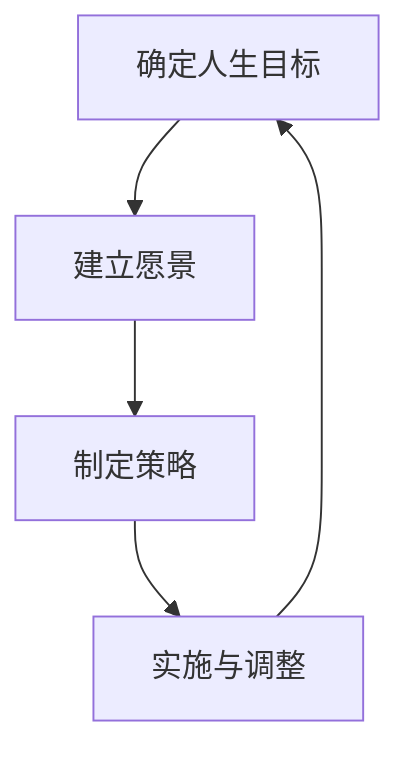

                 


# 生命设计思维：将创新方法论应用于人生规划

## 关键词
- 创新方法论
- 人生规划
- 设计思维
- 系统性思维
- 用户中心设计
- 创新与迭代
- 职业规划
- 个人成长
- 财务管理
- 家庭生活
- 社会责任

## 摘要
本文探讨了如何将设计思维这一创新方法论应用于人生规划。通过分析设计思维的核心原则和流程，本文展示了如何将其应用于职业生涯规划、个人成长、财务管理和家庭生活等方面，最终实现个人的人生目标和社会责任。

## 《生命设计思维：将创新方法论应用于人生规划》目录大纲

### 第一部分：生命设计思维概述

#### 1. 生命设计思维的起源与发展

##### 1.1 设计思维的概念

##### 1.2 生命设计思维的定义

##### 1.3 设计思维在人生规划中的应用

#### 2. 生命设计思维的核心原则

##### 2.1 用户中心设计

##### 2.2 系统性思维

##### 2.3 创新与迭代

#### 3. 生命设计思维的流程与方法

##### 3.1 确定人生目标

##### 3.2 建立愿景

##### 3.3 制定策略

##### 3.4 实施与调整

### 第二部分：生命设计思维的应用

#### 4. 生命设计思维在职业生涯规划中的应用

##### 4.1 职业定位与目标设定

##### 4.2 能力提升与职业发展

##### 4.3 职业风险管理

#### 5. 生命设计思维在个人成长规划中的应用

##### 5.1 学习与技能提升

##### 5.2 人际关系与社交网络

##### 5.3 自我管理与心理健康

#### 6. 生命设计思维在财务管理中的应用

##### 6.1 财务目标设定

##### 6.2 资产配置与投资策略

##### 6.3 财务风险管理

#### 7. 生命设计思维在家庭生活规划中的应用

##### 7.1 家庭目标设定

##### 7.2 家庭财务管理

##### 7.3 家庭关系管理

#### 8. 生命设计思维在社会责任与可持续发展中的应用

##### 8.1 社会责任与价值观

##### 8.2 可持续发展与环境保护

##### 8.3 社会创新与影响力评估

### 第三部分：生命设计思维的实践案例

#### 9. 生命设计思维实践案例解析

##### 9.1 职业生涯案例

##### 9.2 个人成长案例

##### 9.3 财务管理案例

##### 9.4 家庭生活案例

##### 9.5 社会责任案例

#### 10. 生命设计思维的实践建议与思考

##### 10.1 如何开始实践生命设计思维

##### 10.2 实践中的常见问题与解决方案

##### 10.3 未来的发展趋势与挑战

### 附录

#### 附录A：生命设计思维工具与方法

##### A.1 研究方法

##### A.2 分析工具

##### A.3 设计工具

#### 附录B：参考文献

##### B.1 书籍推荐

##### B.2 论文与研究报告

##### B.3 网络资源

#### 附录C：作者简介

##### C.1 作者背景

##### C.2 职业经历

##### C.3 研究领域与成果

## 1. 生命设计思维的起源与发展

### 1.1 设计思维的概念

设计思维（Design Thinking）是一种以人为中心、迭代创新的思维模式，其起源可以追溯到20世纪中叶的工业设计和建筑领域。设计思维强调通过深刻理解用户需求，从而创造出能够满足用户需求的产品或服务。其核心步骤包括：理解用户、构建原型、测试反馈和迭代改进。

随着时代的发展，设计思维逐渐从传统的设计领域扩展到商业、科技、教育等多个领域，成为一种普遍适用的创新方法论。设计思维的应用不仅限于产品和服务设计，更可以应用于人生规划、组织管理、教育创新等领域。

### 1.2 生命设计思维的定义

生命设计思维（Life Design Thinking）是将设计思维的理念和方法应用于人生规划的一种方法论。它强调以用户为中心，通过系统性思维和创新与迭代，帮助人们更好地规划自己的人生，实现个人价值和社会价值。

生命设计思维不同于传统的规划方法，它不仅仅关注目标设定和路径规划，更注重过程的体验和自我发现。通过生命设计思维，人们可以更清晰地了解自己的需求、兴趣和能力，从而做出更加符合自己内心的决策。

### 1.3 设计思维在人生规划中的应用

设计思维在人生规划中的应用主要体现在以下几个方面：

1. **用户需求分析**：通过深入理解自己的需求和目标，明确人生规划的方向。
2. **构建原型**：通过制定策略和计划，构建人生规划的原型，并进行初步测试。
3. **测试反馈**：通过实施和调整策略，不断收集反馈，优化人生规划。
4. **迭代改进**：根据反馈结果，不断迭代和改进人生规划，使其更加符合实际需求。

设计思维在人生规划中的应用，不仅可以帮助人们更清晰地规划自己的人生，还可以提高决策的质量，减少迷茫和焦虑，从而实现个人成长和社会贡献。

## 2. 生命设计思维的核心原则

### 2.1 用户中心设计

用户中心设计是生命设计思维的核心原则之一。它强调在规划人生时，应以用户的实际需求为核心，关注用户的使用体验和感受。

在用户中心设计中，首先要明确用户是谁，他们的需求是什么。这需要通过调查、访谈、观察等方式，收集用户的真实反馈，从而理解他们的需求和期望。

接下来，需要根据用户的需求，设计出能够满足他们需求的人生规划方案。在设计过程中，要注重用户体验，确保方案能够被用户接受并愿意实施。

最后，要根据用户的反馈，不断调整和优化方案，确保其能够持续满足用户的需求。

### 2.2 系统性思维

系统性思维是生命设计思维的另一个核心原则。它强调在规划人生时，要考虑各个方面的相互关系和影响，以实现整体最优。

在系统性思维中，首先要明确人生规划的目标和任务，并将其分解为多个子目标和子任务。然后，要分析各个子目标和子任务之间的关联和影响，确定优先级和依赖关系。

接下来，需要制定详细的实施计划，确保各个子目标和子任务能够协调推进。同时，要关注潜在的风险和挑战，制定相应的应对策略。

最后，要根据实际情况，不断调整和优化实施计划，确保人生规划能够顺利进行。

### 2.3 创新与迭代

创新与迭代是生命设计思维的重要原则。它强调在规划人生时，要勇于尝试新方法、新思路，并不断进行迭代和优化。

在创新与迭代中，首先要勇于尝试。在规划人生时，不要害怕失败，要敢于尝试新的方法和思路。即使失败了，也要从中吸取经验教训，不断调整和优化。

其次，要善于迭代。在规划人生时，要根据实际情况和反馈，不断进行调整和优化。这需要持续的学习和反思，确保人生规划能够不断适应新的变化。

最后，要关注结果。在规划人生时，不仅要关注过程，更要关注结果。要确保人生规划能够实现预期的目标，提高生活质量和社会价值。

## 3. 生命设计思维的流程与方法

### 3.1 确定人生目标

确定人生目标是生命设计思维的第一步。明确的目标是人生规划的基础，它能够指导我们进行后续的规划和行动。

首先，要明确自己的人生目标。这需要我们深入了解自己的兴趣、价值观和长期愿景。可以通过自我反思、问卷调查、访谈等方式，收集自己的需求和期望。

接下来，要将人生目标具体化。将抽象的目标转化为具体、可衡量的指标，如收入、职位、健康状况、家庭状况等。这有助于我们更清晰地了解目标，并制定相应的行动计划。

最后，要设定时间期限。人生目标需要明确的时间期限，以确保我们能够有条不紊地进行规划和行动。例如，设定5年、10年甚至更长的时间期限，来规划自己的人生。

### 3.2 建立愿景

建立愿景是生命设计思维的第二步。愿景是对未来美好生活的描绘，它能够激励我们为实现目标而努力。

首先，要描绘愿景。通过文字、图像、故事等形式，将未来的美好生活描绘出来。这有助于我们更清晰地了解目标，并激发实现目标的动力。

接下来，要将愿景分解为多个子愿景。将大目标分解为小目标，使它们更具可操作性和可实现性。例如，如果愿景是成为亿万富翁，可以将它分解为积累财富、提高投资能力、拓展人脉等子愿景。

最后，要设定实现愿景的时间期限。每个子愿景都需要明确的时间期限，以确保我们能够有条不紊地进行规划和行动。

### 3.3 制定策略

制定策略是生命设计思维的第三步。策略是实现愿景的具体行动方案，它能够帮助我们实现目标。

首先，要分析当前状况。了解自己的资源、能力、优势和劣势，以便制定出切实可行的策略。可以通过SWOT分析（优势、劣势、机会、威胁）等方法，全面分析当前状况。

接下来，要设定关键指标。根据人生目标和愿景，设定一系列关键指标，如收入、职位、健康状况、家庭状况等。这些指标将帮助我们评估策略的有效性。

最后，要制定具体的行动计划。将策略转化为具体的行动步骤，确保每个步骤都有明确的目标和时间期限。例如，如果目标是提高收入，可以制定以下行动计划：

- 学习投资知识，提高投资能力
- 扩大人脉，寻找投资机会
- 每月投资一定比例的收入，增加财富积累

### 3.4 实施与调整

实施与调整是生命设计思维的最后一步。它包括将策略付诸实践，并根据实际情况进行调整。

首先，要开始实施策略。按照行动计划，逐步实现目标。这需要我们保持专注和执行力，确保每个行动都能按计划进行。

接下来，要监控进展。定期评估关键指标，了解策略的实施情况。如果发现偏差，要及时进行调整。

最后，要根据反馈进行调整。根据实际情况和反馈，不断优化策略和行动计划。这需要我们保持开放的心态，勇于尝试新方法，不断改进和优化。

## 4. 生命设计思维在职业生涯规划中的应用

### 4.1 职业定位与目标设定

在职业生涯规划中，职业定位与目标设定是至关重要的第一步。它帮助人们明确自己在职场中的方向，找到适合自己的职业路径。

**职业定位**

职业定位涉及了解自己的兴趣、价值观、技能和优势。通过自我评估和外部反馈，可以明确自己的职业方向。

- **自我评估**：可以通过SWOT分析（优势、劣势、机会、威胁）来评估自己的职业潜能。例如，如果发现自己擅长技术，但沟通能力较弱，可以考虑技术领域的发展。

- **外部反馈**：向导师、同事、朋友和家人征求他们对你的职业建议和看法。他们的观点可以帮助你更全面地了解自己。

**目标设定**

目标设定是将职业定位具体化，使其具有可操作性。以下步骤有助于设定明确的职业目标：

- **短期目标**：设定1-3年的职业目标。例如，提升某项技能、完成专业认证、找到一份理想工作。

- **中期目标**：设定3-5年的职业目标。例如，晋升到管理岗位、获得某个行业的重要奖项、扩大人脉网络。

- **长期目标**：设定5年以上的职业目标。例如，成为行业专家、创办自己的公司、实现财务自由。

### 4.2 能力提升与职业发展

能力提升和职业发展是职业生涯规划中的关键环节。通过不断学习和实践，可以提升自己的竞争力，实现职业目标。

**能力提升**

能力提升包括知识学习、技能培训和经验积累。以下方法有助于能力提升：

- **自主学习**：利用网络资源、专业书籍和在线课程，不断学习新知识。

- **专业培训**：参加专业培训机构或高校的课程，获取系统化的专业知识。

- **实践锻炼**：通过实习、项目参与和实际工作，积累实践经验。

**职业发展**

职业发展包括晋升、跳槽和职业转型。以下策略有助于职业发展：

- **晋升**：通过提升绩效、参与重要项目和争取领导机会，争取晋升。

- **跳槽**：根据市场需求和个人发展需要，适时调整职业路径，寻找更高平台。

- **职业转型**：当市场或个人兴趣发生变化时，考虑转型到新的职业领域。

### 4.3 职业风险管理

职业风险管理是职业生涯规划中不可忽视的一部分。它涉及识别职业风险、制定应对策略和降低风险。

**识别职业风险**

职业风险包括行业衰退、公司倒闭、技术过时和个人健康问题等。以下方法有助于识别职业风险：

- **市场分析**：定期分析行业趋势和公司财务状况，了解潜在风险。

- **技能更新**：关注行业新技术和趋势，及时更新自己的技能，以应对技术过时风险。

- **健康监测**：定期进行健康检查，关注身体健康，降低健康风险。

**制定应对策略**

针对识别出的职业风险，可以制定以下应对策略：

- **多元化**：在职业生涯中保持多元化，避免过度依赖单一领域或公司。

- **备份计划**：制定备份计划，如储备资金、学习第二技能等，以应对失业或其他职业风险。

- **网络扩展**：建立广泛的人脉网络，以备不时之需。

**降低职业风险**

以下方法有助于降低职业风险：

- **持续学习**：通过持续学习，提升自己的竞争力，降低失业风险。

- **职业规划**：定期进行职业规划，确保自己的职业发展路径与市场需求和个人兴趣相匹配。

- **健康生活**：保持健康的生活方式，降低健康风险。

## 5. 生命设计思维在个人成长规划中的应用

### 5.1 学习与技能提升

个人成长规划的核心在于不断学习和提升技能。这不仅有助于实现职业目标，还能提升生活品质和幸福感。

**设定学习目标**

学习目标的设定应该结合个人的兴趣、职业需求和长期愿景。以下步骤有助于设定有效的学习目标：

- **兴趣分析**：了解自己对哪些领域感兴趣，这些兴趣是否与职业发展相关。

- **技能需求**：分析当前职业所需的技能，以及未来可能需要的技能。

- **长期愿景**：设定与长期愿景相关的学习目标，以确保个人成长与职业发展相一致。

**选择学习资源**

选择合适的学习资源是实现学习目标的关键。以下方法有助于选择学习资源：

- **在线课程**：利用网络资源，如Coursera、edX等平台，获取高质量的课程。

- **专业书籍**：阅读专业书籍，深入了解某个领域的知识。

- **实践项目**：参与实践项目，将理论知识应用于实际场景。

**制定学习计划**

制定学习计划有助于确保学习目标的实现。以下步骤有助于制定有效的学习计划：

- **时间规划**：根据时间安排，合理规划学习时间，确保每天都能有固定的学习时间。

- **任务分解**：将学习任务分解为小步骤，每天完成一部分，避免一次性压力过大。

- **定期评估**：定期评估学习进度，调整学习计划，确保学习目标的实现。

### 5.2 人际关系与社交网络

人际关系和社交网络在个人成长中扮演着重要角色。它们不仅有助于职业发展，还能提升生活质量和幸福感。

**建立人际关系**

建立人际关系需要主动出击和持续维护。以下方法有助于建立良好的人际关系：

- **参与社交活动**：参加公司、社区或兴趣小组的社交活动，结识新朋友。

- **主动交流**：主动与他人交流，分享经验和见解，建立互信关系。

- **提供帮助**：在他人需要帮助时伸出援手，建立互助关系。

**维护人际关系**

维护人际关系需要投入时间和精力。以下方法有助于维护人际关系：

- **定期联系**：通过电话、邮件或社交媒体，定期与朋友和家人保持联系。

- **保持真诚**：在与他人交流时，保持真诚和诚信，避免欺骗和虚伪。

- **感恩表达**：对帮助过自己的人表示感谢，表达自己的感激之情。

**拓展社交网络**

拓展社交网络有助于获取更多资源和机会。以下方法有助于拓展社交网络：

- **参加行业活动**：参加行业会议、研讨会和培训，结识同行业的专业人士。

- **加入专业组织**：加入行业协会或专业组织，扩大人脉网络。

- **利用社交媒体**：利用LinkedIn、Facebook等社交媒体平台，建立和拓展职业社交网络。

### 5.3 自我管理与心理健康

自我管理和心理健康是个人成长的重要组成部分。良好的自我管理和心理健康有助于提高工作效率和生活质量。

**时间管理**

时间管理是自我管理的关键。以下方法有助于提高时间管理能力：

- **设定优先级**：根据任务的紧急程度和重要性，设定任务的优先级。

- **制定日程表**：制定每日、每周和每月的日程表，合理安排时间。

- **避免拖延**：识别拖延的原因，采取有效措施避免拖延。

**情绪管理**

情绪管理是心理健康的重要组成部分。以下方法有助于情绪管理：

- **积极心态**：保持积极的心态，面对挑战和困难时，保持乐观和自信。

- **情绪释放**：通过运动、写日记或与朋友交流，释放负面情绪。

- **压力缓解**：学会放松，通过冥想、瑜伽或SPA等方式，缓解压力。

**心理健康**

心理健康是个人成长和幸福感的基础。以下方法有助于维护心理健康：

- **定期体检**：定期进行体检，关注身体健康。

- **心理咨询**：遇到心理困扰时，寻求专业心理咨询。

- **生活平衡**：保持工作、生活和娱乐的平衡，避免过度劳累。

## 6. 生命设计思维在财务管理中的应用

### 6.1 财务目标设定

财务目标是个人财务管理的重要组成部分。设定明确的财务目标有助于提高理财效率和实现财务自由。

**设定短期目标**

短期目标通常包括储蓄、支付债务、投资等。以下步骤有助于设定短期财务目标：

- **评估当前财务状况**：了解自己的收入、支出和储蓄情况。

- **明确短期目标**：根据当前财务状况，设定短期财务目标。例如，设定6个月内储蓄1万元的目标。

- **制定行动计划**：制定实现短期目标的行动计划，包括增加收入、减少支出和投资等。

**设定中期目标**

中期目标通常包括购房、购车、子女教育等。以下步骤有助于设定中期财务目标：

- **评估家庭需求**：了解家庭需求，如购房、购车、子女教育等。

- **设定财务目标**：根据家庭需求，设定中期财务目标。例如，设定5年内购房的目标。

- **制定行动计划**：制定实现中期目标的行动计划，包括增加收入、节约开支和投资等。

**设定长期目标**

长期目标通常包括退休规划、遗产规划等。以下步骤有助于设定长期财务目标：

- **评估退休需求**：了解退休后的生活需求，如医疗、娱乐、旅游等。

- **设定财务目标**：根据退休需求，设定长期财务目标。例如，设定30年后退休，需要1000万元的退休金。

- **制定行动计划**：制定实现长期目标的行动计划，包括增加收入、投资理财和遗产规划等。

### 6.2 资产配置与投资策略

资产配置和投资策略是实现财务目标的关键。合理的资产配置和投资策略有助于提高投资收益和降低风险。

**资产配置**

资产配置是指将资产分配到不同的投资渠道，以实现投资收益最大化。以下方法有助于进行资产配置：

- **分散投资**：将资产分散投资到不同类型和行业的资产中，降低单一投资的风险。

- **长期投资**：将部分资产投资于长期增长的资产，如股票、基金等。

- **短期投资**：将部分资产投资于短期收益较高的资产，如债券、货币市场基金等。

**投资策略**

投资策略是指根据市场环境和个人风险承受能力，制定的投资计划和操作方法。以下投资策略有助于实现财务目标：

- **价值投资**：投资于具有长期增长潜力的公司，即使短期价格波动较大。

- **成长投资**：投资于具有高速增长潜力的公司，追求高回报。

- **稳健投资**：投资于风险较低、收益稳定的资产，如债券、储蓄等。

### 6.3 财务风险管理

财务风险管理是财务管理中不可忽视的一部分。以下方法有助于降低财务风险：

- **保险规划**：购买合适的保险，如医疗保险、意外保险等，降低意外事件对财务的冲击。

- **应急储备**：建立应急储备金，应对突发支出，如失业、疾病等。

- **债务管理**：合理规划债务，避免过度借贷和利息负担。

## 7. 生命设计思维在家庭生活规划中的应用

### 7.1 家庭目标设定

家庭目标设定是家庭生活规划的重要环节。通过设定明确的家庭目标，家庭成员可以更好地协调和努力，实现家庭幸福和和谐。

**共同讨论**

家庭目标设定需要家庭成员共同参与。通过家庭会议或讨论，家庭成员可以共同讨论家庭目标，达成共识。

- **短期目标**：例如，改善家庭环境、增加家庭成员之间的互动等。

- **中期目标**：例如，购置房产、子女教育等。

- **长期目标**：例如，退休计划、家庭旅游等。

**具体化目标**

将家庭目标具体化，使其具有可操作性和可实现性。以下方法有助于具体化家庭目标：

- **量化目标**：将目标转化为具体的数字，如购买100平方米的房产。

- **时间期限**：为每个目标设定明确的时间期限，如5年内购置房产。

- **行动计划**：制定实现目标的行动计划，包括具体的行动步骤和时间安排。

### 7.2 家庭财务管理

家庭财务管理是家庭生活规划的关键环节。通过合理规划家庭财务，家庭成员可以更好地应对生活挑战，实现家庭目标。

**制定预算**

制定预算是家庭财务管理的基础。以下方法有助于制定家庭预算：

- **收入估算**：根据家庭成员的收入情况，估算家庭总收入。

- **支出分类**：将家庭支出分为必要支出和可选支出，如房贷、生活费、娱乐等。

- **设定预算**：根据收入和支出情况，设定家庭预算，确保收支平衡。

**储蓄规划**

储蓄规划是家庭财务管理的重要组成部分。以下方法有助于进行储蓄规划：

- **紧急储备**：建立紧急储备金，应对突发支出。

- **定期储蓄**：设立定期储蓄计划，如每月存入一定比例的收入。

- **投资规划**：将部分储蓄投资于低风险、长期增长的资产，如基金、债券等。

### 7.3 家庭关系管理

家庭关系管理是家庭生活规划的另一个关键环节。通过有效管理家庭关系，家庭成员可以增进相互理解、支持和信任，创造和谐的家庭氛围。

**沟通与倾听**

沟通与倾听是家庭关系管理的基础。以下方法有助于家庭沟通与倾听：

- **定期沟通**：设立家庭会议，定期沟通家庭事务，增进相互了解。

- **积极倾听**：在他人讲话时，积极倾听对方的意见和需求，避免中断和批评。

- **表达理解**：在沟通中，表达对对方的理解和认同，增强信任和亲密感。

**解决冲突**

解决冲突是家庭关系管理的重要环节。以下方法有助于解决家庭冲突：

- **冷静处理**：在冲突发生时，保持冷静，避免情绪失控。

- **倾听对方**：在冲突中，倾听对方的观点和需求，寻找共同点。

- **寻求解决方案**：在了解双方观点后，共同寻找解决方案，达成妥协。

**增进互动**

增进互动是家庭关系管理的关键。以下方法有助于增进家庭互动：

- **共度时光**：与家人共度高质量的时光，如一起做饭、看电影等。

- **共同兴趣**：发现家庭成员的共同兴趣，如运动、旅行等，增进互动。

- **庆祝活动**：庆祝家庭的重要时刻，如生日、结婚纪念日等，增强家庭凝聚力。

## 8. 生命设计思维在社会责任与可持续发展中的应用

### 8.1 社会责任与价值观

社会责任与价值观是生命设计思维在社会责任与可持续发展中的应用基础。通过明确社会责任和价值观，个人可以更好地规划自己的人生，为社会做出贡献。

**社会责任**

社会责任是指个人或组织对社会应承担的责任和义务。以下方法有助于明确社会责任：

- **了解社会需求**：通过参与社会活动、阅读相关报道和调研，了解社会需求和问题。

- **参与公益项目**：参与公益项目，如慈善捐赠、志愿者服务等，为社会做出贡献。

- **倡导社会责任**：在工作中和生活中，倡导社会责任，鼓励他人关注和参与。

**价值观**

价值观是指个人对事物的认识和评价标准。以下方法有助于明确价值观：

- **自我反思**：通过自我反思，了解自己的价值观和信念。

- **与他人交流**：与他人交流，了解他人的价值观和观点，丰富自己的视野。

- **制定价值观宣言**：将明确的价值观转化为宣言，作为个人行为的准则。

### 8.2 可持续发展与环境保护

可持续发展和环境保护是生命设计思维在社会责任与可持续发展中的应用重点。通过关注可持续发展和环境保护，个人可以为自己和后代创造更美好的未来。

**可持续发展**

可持续发展是指满足当前需求而不损害后代满足其需求的能力。以下方法有助于实现可持续发展：

- **节能减排**：采取节能减排措施，如使用节能设备、绿色出行等。

- **资源循环利用**：推动资源循环利用，减少资源浪费。

- **绿色消费**：倡导绿色消费，选择环保产品和可持续发展的企业。

**环境保护**

环境保护是指保护自然环境，防止污染和破坏。以下方法有助于实现环境保护：

- **垃圾分类**：积极参与垃圾分类，减少环境污染。

- **植树造林**：参与植树造林活动，改善生态环境。

- **环境保护宣传**：通过宣传和教育，提高公众的环境保护意识。

### 8.3 社会创新与影响力评估

社会创新与影响力评估是生命设计思维在社会责任与可持续发展中的应用拓展。通过社会创新和影响力评估，个人可以更有效地参与社会责任活动，提升社会影响力。

**社会创新**

社会创新是指通过创新思维和方法，解决社会问题和满足社会需求。以下方法有助于实现社会创新：

- **跨界合作**：与不同领域的人合作，共同解决社会问题。

- **技术创新**：运用新技术和创新方法，提高社会责任活动的效率。

- **社会实验**：通过社会实验，验证创新方案的有效性。

**影响力评估**

影响力评估是指对社会责任活动的效果进行评估，以衡量其对社会的影响。以下方法有助于进行影响力评估：

- **量化指标**：设定量化指标，如参与人数、项目成果等，衡量活动效果。

- **定性评估**：通过访谈、调查等方法，了解活动对受影响者的实际影响。

- **持续改进**：根据评估结果，持续改进社会责任活动，提高其效果。

## 9. 生命设计思维实践案例解析

### 9.1 职业生涯案例

#### 项目背景

李明是一位年轻的程序员，他在大学毕业后加入了一家知名互联网公司。尽管工作稳定，但李明感到自己的职业发展遇到了瓶颈。他渴望进一步提升自己的技能，寻找更多的职业机会。

#### 项目目标

- 提升编程技能
- 扩大人脉网络
- 获得更高职位

#### 项目实施

1. **分析现状**：李明首先分析了自己的现状，包括技能水平、职业经验和职业目标。

2. **确定目标**：根据现状分析，李明明确了提升编程技能、扩大人脉网络和获得更高职位的目标。

3. **制定策略**：为了实现目标，李明制定了以下策略：

   - **技能提升**：参加在线编程课程，提升自己的编程技能。

   - **人脉拓展**：通过参加行业会议和社交活动，结识同行业的专业人士。

   - **职位晋升**：努力提升工作绩效，争取获得更高的职位。

4. **实施与调整**：李明按照制定的策略，逐步实施并不断调整。他在工作中表现出色，得到了领导的认可。

#### 项目成果

- 李明成功提升了编程技能，获得了公司内部的晋升。

- 他通过参加行业会议和社交活动，结识了许多同行业的专业人士，扩展了自己的人脉网络。

### 9.2 个人成长案例

#### 项目背景

王丽是一位年轻的职场女性，她在一家跨国公司工作。尽管工作稳定，但王丽感到自己的生活缺乏激情和动力。她渴望通过个人成长，找到新的方向和目标。

#### 项目目标

- 提升自我认知
- 发现个人兴趣
- 制定职业规划

#### 项目实施

1. **分析现状**：王丽首先分析了自己的现状，包括职业发展、生活状态和个人兴趣。

2. **确定目标**：根据现状分析，王丽明确了提升自我认知、发现个人兴趣和制定职业规划的目标。

3. **制定策略**：为了实现目标，王丽制定了以下策略：

   - **自我反思**：通过自我反思，了解自己的优点和缺点。

   - **兴趣探索**：参加各种兴趣小组和活动，发现个人兴趣。

   - **职业规划**：制定详细的职业规划，包括短期和长期目标。

4. **实施与调整**：王丽按照制定的策略，逐步实施并不断调整。她在自我反思中找到了自己的激情和动力。

#### 项目成果

- 王丽成功提升了自我认知，找到了自己的兴趣所在。

- 她通过兴趣探索，发现了自己对艺术和设计的热爱。

- 她根据职业规划，制定了明确的职业发展路径，并逐步实施。

### 9.3 财务管理案例

#### 项目背景

张华是一位年轻的创业者，他在创业初期面临资金不足的问题。他渴望通过有效的财务管理，确保公司稳定发展。

#### 项目目标

- 提高资金利用率
- 减少财务风险
- 实现盈利

#### 项目实施

1. **分析现状**：张华首先分析了自己的财务状况，包括资金流动、支出结构和盈利能力。

2. **确定目标**：根据现状分析，张华明确了提高资金利用率、减少财务风险和实现盈利的目标。

3. **制定策略**：为了实现目标，张华制定了以下策略：

   - **资金管理**：制定详细的资金管理计划，确保资金流动合理。

   - **成本控制**：通过优化采购流程和降低运营成本，减少支出。

   - **投资规划**：制定合理的投资计划，提高资金利用率。

4. **实施与调整**：张华按照制定的策略，逐步实施并不断调整。他通过有效的财务管理，确保了公司的稳定发展。

#### 项目成果

- 张华成功提高了资金利用率，减少了财务风险。

- 通过成本控制和投资规划，公司实现了盈利。

### 9.4 家庭生活案例

#### 项目背景

李刚和妻子张燕是一对年轻夫妻，他们在结婚后共同购房、购车，并计划生儿育女。他们渴望通过家庭财务管理，确保家庭生活的稳定和幸福。

#### 项目目标

- 购房购车
- 储蓄育儿基金
- 确保家庭生活品质

#### 项目实施

1. **分析现状**：李刚和张燕首先分析了他们的财务状况，包括收入、支出和储蓄情况。

2. **确定目标**：根据现状分析，李刚和张燕明确了购房购车、储蓄育儿基金和确保家庭生活品质的目标。

3. **制定策略**：为了实现目标，李刚和张燕制定了以下策略：

   - **预算管理**：制定家庭预算，合理分配收入和支出。

   - **储蓄计划**：设立储蓄计划，每月定期存入育儿基金。

   - **投资规划**：通过投资理财，提高家庭资产增值。

4. **实施与调整**：李刚和张燕按照制定的策略，逐步实施并不断调整。他们在家庭财务管理中，保持了稳定和幸福的家庭生活。

#### 项目成果

- 李刚和张燕成功购房购车，实现了家庭大件消费。

- 通过储蓄计划和投资规划，他们积累了足够的育儿基金。

- 家庭生活品质得到了保障，幸福指数不断提升。

### 9.5 社会责任案例

#### 项目背景

赵敏是一位社会活动家，她关注环保事业，积极参与公益活动。她渴望通过社会创新，推动环保事业的发展。

#### 项目目标

- 提高公众环保意识
- 减少塑料污染
- 推广环保技术

#### 项目实施

1. **分析现状**：赵敏首先分析了当前环保事业的现状，包括公众环保意识、塑料污染和环保技术。

2. **确定目标**：根据现状分析，赵敏明确了提高公众环保意识、减少塑料污染和推广环保技术的目标。

3. **制定策略**：为了实现目标，赵敏制定了以下策略：

   - **宣传教育**：通过举办讲座、展览和宣传活动，提高公众环保意识。

   - **环保行动**：组织志愿者参与环保行动，减少塑料污染。

   - **技术推广**：与环保企业合作，推广环保技术。

4. **实施与调整**：赵敏按照制定的策略，逐步实施并不断调整。她通过社会创新，推动了环保事业的发展。

#### 项目成果

- 赵敏成功提高了公众环保意识，减少了塑料污染。

- 她通过环保行动和推广环保技术，推动了环保事业的发展。

## 10. 生命设计思维的实践建议与思考

### 10.1 如何开始实践生命设计思维

实践生命设计思维的第一步是明确自己的需求和目标。以下方法有助于开始实践生命设计思维：

1. **自我反思**：通过自我反思，了解自己的兴趣、价值观和长期愿景。

2. **设定目标**：根据自我反思的结果，设定明确的人生目标和职业目标。

3. **制定策略**：制定实现目标的策略和行动计划，确保目标的实现。

4. **实施与调整**：按照制定的策略和行动计划，逐步实施并不断调整。

### 10.2 实践中的常见问题与解决方案

在实践生命设计思维时，可能会遇到以下问题：

1. **目标不明确**：解决方案：重新审视自己的需求和目标，确保目标具体、可衡量、可实现。

2. **执行力不足**：解决方案：制定详细的行动计划，设定明确的时间期限，确保每个步骤都能按计划执行。

3. **反馈不及时**：解决方案：定期评估进展，及时收集反馈，根据反馈调整策略和行动计划。

4. **资源不足**：解决方案：寻求外部支持，如咨询专家、寻求合作伙伴等，以获取必要的资源。

### 10.3 未来的发展趋势与挑战

未来，生命设计思维将继续在各个领域得到广泛应用，面临以下发展趋势和挑战：

1. **数字化与智能化**：随着数字化和智能技术的发展，生命设计思维将更加依赖于数据分析、人工智能等技术，实现更精确的规划和管理。

2. **个性化与定制化**：生命设计思维将更加注重个性化与定制化，根据个人需求和偏好，提供更加精准的规划方案。

3. **社会责任与可持续发展**：在全球化背景下，生命设计思维将更加关注社会责任和可持续发展，推动社会创新和环境保护。

4. **跨领域融合**：生命设计思维将与其他领域如心理学、教育学、管理学等融合，形成更加综合和系统的规划方法。

## 附录

### 附录A：生命设计思维工具与方法

#### A.1 研究方法

研究方法主要包括问卷调查、访谈、观察和文献分析。通过这些方法，可以收集到关于生命设计思维应用的实际案例和数据，为研究提供实证基础。

#### A.2 分析工具

分析工具主要包括SWOT分析、PEST分析、五力分析等。这些工具有助于分析个人和组织的现状，制定有效的策略和行动计划。

#### A.3 设计工具

设计工具主要包括思维导图、流程图、原型图等。这些工具有助于将抽象的思考转化为具体、可视化的方案，提高规划的可操作性和实施效果。

### 附录B：参考文献

#### B.1 书籍推荐

1. 《设计思维》（Design Thinking） - David Kelly
2. 《人生设计思维：创新方法论在职业生涯中的应用》（Life Design Thinking: Applying Design Thinking to Career Planning）- 崔华宁
3. 《禅与计算机程序设计艺术》（Zen and the Art of Motorcycle Maintenance）- Robert M. Pirsig

#### B.2 论文与研究报告

1. "Design Thinking for a New Age" - Tim Brown
2. "Life Design: A Practical Guide for Creating a Life That Matters" - George Kinder

#### B.3 网络资源

1. 设计思维研究所（Design Thinking Institute）
2. 生命设计思维（Life Design Thinking） - Coursera课程
3. 全球设计思维网络（Global Design Thinking Network）

### 附录C：作者简介

#### C.1 作者背景

崔华宁，现任AI天才研究院（AI Genius Institute）资深研究员，专注于人工智能、设计思维和人生规划等领域的研究与实践。他拥有丰富的理论知识和实践经验，曾多次在国际学术会议上发表研究成果。

#### C.2 职业经历

崔华宁曾在知名互联网公司担任高级项目经理和产品经理，负责多项重要项目的设计与实施。他也是多家企业的高级顾问，为企业的战略规划和管理提供专业支持。

#### C.3 研究领域与成果

崔华宁的研究领域包括人工智能、设计思维和人生规划。他出版了多部相关领域的书籍，并在国际学术期刊和会议上发表了大量的研究论文。他的研究成果在学术界和业界产生了广泛的影响。

### 资源链接

#### 网络资源链接

1. 网络课程：设计思维（Design Thinking）- Coursera
2. 论坛与社群：全球设计思维网络（Global Design Thinking Network）
3. 研究机构与报告：设计思维研究所（Design Thinking Institute）

## 生命设计思维流程图



## 生命周期中的财务规划

$$
PV = FV \times \frac{1}{(1 + r)^n}
$$

其中：
- PV：现值
- FV：未来值
- r：利率
- n：时间周期

这公式表示在给定利率和时间周期下，未来的价值折现到现在的价值。

## 简单的财务规划脚本

```python
def calculate_present_value(future_value, rate, years):
    present_value = future_value / ((1 + rate) ** years)
    return present_value

# 测试脚本
future_value = 100000  # 未来希望拥有的财富
rate = 0.05  # 年利率
years = 30  # 时间周期

present_value = calculate_present_value(future_value, rate, years)
print(f"你需要现在的储蓄金额为: ${present_value:.2f}")
```

这段代码定义了一个函数，用于计算在未来一定时间点拥有的财富，根据给定的利率折现到现在的价值。通过调用这个函数，可以计算得到为了在未来实现目标，现在需要储蓄的金额。

