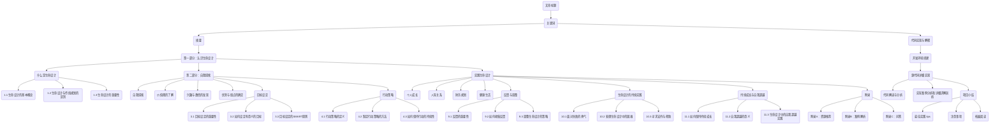

                 

### 生命设计：主动规划人生的意义

> 关键词：生命设计、主动规划、人生目标、自我探索、行动策略

> 摘要：本文旨在探讨生命设计的重要性及其在主动规划人生中的核心作用。通过自我探索、目标设定和行动策略的三个步骤，我们将揭示如何通过主动规划来实现个人的全面发展与人生目标。本文将结合实际案例，深入分析每个步骤的具体实践方法，帮助读者构建一套有效的生命设计体系。

## 引言

在信息技术飞速发展的时代，我们面临着前所未有的机遇与挑战。在这个充满不确定性的环境中，如何主动规划自己的人生，实现个人价值和社会贡献，成为了一个值得深思的问题。生命设计，作为一种主动规划人生的方法，正逐渐受到越来越多人的关注和认可。

生命设计并不是一个陌生的概念，它源于人类对自我认知和未来发展需求的深刻理解。与传统的规划方法不同，生命设计更加注重个体的独特性和主动性，强调通过自我探索、目标设定和行动策略的有机结合，实现人生的全面发展和持续成长。

本文将围绕生命设计的三个核心步骤展开讨论，旨在为读者提供一套系统、实用的生命设计指南。通过本文的阅读，您将了解到：

1. **自我探索**：如何深入了解自己的价值观、兴趣和优势，为生命设计奠定坚实基础。
2. **目标设定**：如何设定有意义、可实现的人生目标，为生命设计指明方向。
3. **行动策略**：如何制定和执行有效的行动策略，确保人生目标的顺利实现。

接下来，我们将逐一探讨这三个步骤，帮助您构建属于自己的生命设计体系。让我们开始这段探索之旅吧！

## 第一部分：认识生命设计

### 第1章：什么是生命设计

#### 1.1 生命设计的基本概念

生命设计，顾名思义，是对生命过程的主动规划与设计。它是一种系统化、科学化的方法，旨在帮助个体明确自己的人生目标，并通过不断调整和优化行动策略，实现这些目标。生命设计不仅关注职业发展，还包括个人成长、人际关系、财务规划、健康生活等多个方面，追求全方位的人生发展。

生命设计的核心思想是“主动规划”，这意味着个体需要主动参与和主导自己的人生，而不是被动地接受命运的安排。通过自我探索、目标设定和行动策略的有机结合，生命设计帮助个体在复杂多变的环境中找到自己的定位，实现个人价值和社会贡献。

#### 1.2 生命设计与传统规划的区别

传统规划方法通常基于外部的标准和期望，往往侧重于短期目标和具体任务的完成。而生命设计则更加关注个体的内在需求和长远发展，注重整体性和系统性。以下是生命设计与传统规划方法的几个关键区别：

1. **关注点不同**：传统规划主要关注职业和学业，而生命设计则涵盖了职业、个人成长、人际关系、财务规划和健康生活等多个方面。
2. **主动与被动**：传统规划通常是被动的，依赖于外部的指导和评价；而生命设计强调个体的主动参与和自我驱动。
3. **系统性与灵活性**：传统规划往往缺乏系统性和灵活性，容易陷入单一目标的追求；生命设计则强调整体性和动态调整，能够更好地应对环境变化。
4. **长期与短期**：传统规划侧重于短期目标的实现，而生命设计则更加注重长远发展，追求个人价值的全面提升。

#### 1.3 生命设计的重要性

在当今快速变化的世界，生命设计的重要性日益凸显。以下是生命设计对个人和社会的几个重要影响：

1. **提升个人幸福感**：通过自我探索和目标设定，个体能够更好地认识自己，明确人生方向，从而减少内心的迷茫和焦虑，提升幸福感。
2. **实现个人价值**：生命设计帮助个体找到适合自己的发展路径，发挥个人优势和潜力，实现个人价值和社会贡献。
3. **提高生活质量**：通过全面的规划和管理，个体能够在职业、个人成长、财务和健康等方面取得平衡，提高生活质量。
4. **促进社会进步**：生命设计不仅关注个体，还关注社会整体。通过培养更多具备主动规划能力的人才，社会将更加和谐、进步。

总之，生命设计是一种系统化、科学化的方法，旨在帮助个体主动规划人生，实现全面发展和持续成长。通过自我探索、目标设定和行动策略的有机结合，生命设计不仅能够提升个人幸福感，还能推动社会进步。在下一章中，我们将进一步探讨如何进行自我探索，为生命设计奠定坚实基础。

### 第2章：自我探索

#### 2.1 了解自己的价值观

自我探索的第一步是了解自己的价值观。价值观是我们对事物的重要性和优先级的判断，它决定了我们的行为和选择。一个清晰的价值观可以帮助我们更好地认识自己，找到人生的目标和方向。

**价值观的类型**：

- **伦理价值观**：关注道德和正义，如诚实、公正、尊重等。
- **人生观价值观**：关注人生的意义和目标，如幸福、成就、自由等。
- **社会价值观**：关注人际关系和社会责任，如家庭、友情、社区等。
- **职业价值观**：关注职业发展和工作环境，如创新、领导力、团队合作等。

**如何了解自己的价值观**：

1. **自我反思**：通过反思自己的行为和选择，思考什么是对自己最重要的。例如，当面临一个决策时，思考自己为什么会做出这样的选择，这个选择背后的价值观是什么。
2. **与他人交流**：与家人、朋友和同事交流，了解他们如何看待你的行为和选择，这可以帮助你从不同的角度看待自己的价值观。
3. **记录日记**：记录自己的日常生活和感受，这有助于你更好地理解自己的内心世界和价值观。

**价值观的应用**：

1. **目标设定**：了解自己的价值观可以帮助你设定更符合自己内心的目标，使目标更具意义和动力。
2. **决策制定**：在面对选择时，参照自己的价值观可以帮助你做出更明智的决策。
3. **行为调整**：通过了解自己的价值观，你可以更好地调整自己的行为，使其更加符合自己的内心需求。

#### 2.2 发现自己的兴趣与激情

兴趣和激情是推动我们前进的重要动力。了解自己的兴趣和激情可以帮助你找到热爱的事业，使生活更加充实和有意义。

**兴趣与激情的类型**：

- **学术兴趣**：对某一学科或领域的深入研究和探索，如数学、物理、文学等。
- **艺术兴趣**：对音乐、绘画、舞蹈等艺术形式的热爱和追求。
- **运动兴趣**：对某项运动或体育活动的热爱，如篮球、游泳、瑜伽等。
- **社会实践兴趣**：对社会问题和公共事务的关注和参与，如志愿者工作、公益活动等。

**如何发现自己的兴趣与激情**：

1. **尝试新事物**：勇于尝试新的事物和活动，通过实践来发现自己的兴趣和激情。
2. **与不同的人交流**：与不同背景和兴趣的人交流，了解他们的爱好和热情，从中找到共鸣和启发。
3. **专注和坚持**：一旦发现某个兴趣，要投入时间和精力去专注和坚持，这有助于深化兴趣和培养激情。

**兴趣与激情的应用**：

1. **职业规划**：了解自己的兴趣和激情可以帮助你选择适合自己的职业，使工作更有意义和成就感。
2. **生活方式**：兴趣和激情可以丰富你的日常生活，使生活更加多彩和充实。
3. **个人成长**：通过追求兴趣和激情，你可以不断学习和成长，提升自己的能力和素质。

#### 2.3 确定个人的优势和弱点

在自我探索的过程中，了解个人的优势和弱点也是至关重要的一步。优势可以帮助你在职业生涯和个人生活中更加顺利，而弱点则需要你通过努力去克服和改善。

**优势的类型**：

- **技能优势**：在某一领域具有出色的技能和才能，如编程、设计、演讲等。
- **个性优势**：在性格特质上具有优势，如领导力、沟通能力、团队合作等。
- **知识优势**：在某一领域具有深厚的知识和经验，如专业学术、行业洞察等。

**如何确定个人的优势**：

1. **自我评估**：通过自我反思，思考自己在哪些方面表现突出，哪些能力对自己有帮助。
2. **他人反馈**：向家人、朋友和同事请教，了解他们在自己身上的观察和评价。
3. **成就记录**：回顾自己的成就和经历，思考哪些因素使自己取得了成功。

**弱点的类型**：

- **技能不足**：在某些领域缺乏必要的技能和知识。
- **性格缺陷**：在性格特质上存在某些不足，如拖延、缺乏自信等。
- **知识盲区**：在某些领域存在知识空白和不足。

**如何识别个人的弱点**：

1. **自我评估**：通过自我反思，思考自己在哪些方面存在不足和困难。
2. **他人反馈**：向家人、朋友和同事请教，了解他们在自己身上的观察和评价。
3. **成就记录**：回顾自己的失败和挫折，思考哪些因素导致了自己的不足。

**优势和弱点的应用**：

1. **职业规划**：通过了解个人的优势和弱点，可以更有针对性地进行职业规划，发挥优势，克服弱点。
2. **个人成长**：通过不断努力和提升，可以改进自己的弱点，提升整体能力和素质。
3. **决策制定**：了解个人的优势和弱点可以帮助在决策时做出更明智的选择。

通过自我探索，我们可以更好地了解自己的价值观、兴趣与激情，以及优势和弱点。这一过程为我们的生命设计奠定了坚实基础，使我们能够更有信心地设定目标，并制定出符合自己内心的行动策略。在下一章中，我们将探讨如何设定有意义的人生目标，为生命设计指明方向。

### 第3章：设定目标

#### 3.1 目标设定的重要性

目标设定是生命设计中的关键环节，它为我们的行动提供了明确的指引和方向。一个清晰、具体的目标可以帮助我们聚焦注意力，集中精力，从而更有效地实现我们的梦想和抱负。

**目标设定的重要性体现在以下几个方面**：

1. **明确方向**：目标为我们提供了明确的方向，使我们知道自己的努力将如何转化为实际成果。
2. **激励动力**：具体的目标可以激发我们的内在动力，增强信心和决心，使我们在面对困难和挑战时保持积极的心态。
3. **资源分配**：明确的目标有助于我们合理分配时间和资源，避免分散精力，确保每一项任务都能得到充分的关注和投入。
4. **衡量进步**：通过设定目标，我们可以量化自己的进步和成就，从而更好地了解自己的成长轨迹，不断调整和优化行动策略。

**如何制定具体的目标**：

1. **明确具体**：一个具体的目标应该回答以下问题：“是什么”、“为什么”和“如何做”。例如，“我要成为一名优秀的程序员”不如“我将在未来三年内通过在线课程和实习经验，掌握Python、Java和JavaScript等编程语言”具体。
2. **有明确的时间框架**：设定一个明确的时间框架，使目标具有可衡量性和可达成性。例如，“我将在明年年底完成这本书的撰写”比“我会在未来某个时候完成这本书”更具体和可行。
3. **考虑可操作性和可行性**：确保目标不仅是具体的，还要考虑实际操作和可行性。例如，一个目标“我要在一个月内减掉10公斤体重”可能过于苛刻，而不如“我将在一个月内通过每天跑步和健康饮食，减少5公斤体重”更现实。

**实例分析**：

- **个人目标**：例如，“我将在未来五年内成为一家初创公司的技术总监”。
  - **具体**：“成为技术总监”是一个明确的目标，但缺乏具体的细节。改进后的目标可以是：“我将在未来五年内，通过积累技术领导经验和提升团队管理能力，成为一家初创公司的技术总监。”
  - **有明确的时间框架**：目标设定了五年时间，使我们可以分阶段实施和调整。
  - **可操作性和可行性**：通过积累经验和管理能力，成为技术总监是可行的。

- **职业目标**：例如，“我将在未来三年内晋升为项目经理”。
  - **具体**：“晋升为项目经理”是一个明确的目标，但缺乏具体的行动步骤。改进后的目标可以是：“我将在未来三年内，通过完成相关培训项目、积累项目管理经验和建立良好的人际关系，晋升为项目经理。”
  - **有明确的时间框架**：目标设定了三年时间，使我们可以逐步实现。
  - **可操作性和可行性**：通过具体的行动步骤，晋升为项目经理是可行的。

通过设定具体、明确和可行的目标，我们可以更好地规划自己的未来，集中精力实现目标。在下一章中，我们将探讨如何根据SMART原则来设定目标，确保目标的可实现性和有效性。

#### 3.2 如何设定有意义的目标

设定有意义的目标是生命设计中的关键环节，它不仅能够激发我们的内在动力，还能够为我们的生活带来深远的影响。一个有意义的目标应该能够反映出我们的价值观、兴趣和激情，同时与我们的长期愿景相一致。

**设定有意义目标的步骤**：

1. **与价值观对齐**：首先，我们需要思考自己的核心价值观是什么，例如诚信、责任感、成长等。然后，设定目标时，要确保这些目标与我们的核心价值观相符，从而使我们能够更加坚定地追求。
2. **关注个人兴趣和激情**：了解自己在哪些领域感到热情和充满动力，将兴趣和激情融入目标设定中。例如，如果你对编程充满热情，设定一个与编程相关的目标可能会更有意义。
3. **明确长期愿景**：思考自己未来想要成为什么样的人，拥有什么样的生活。将长期愿景分解为具体的、可实现的目标，使我们的短期行动与长期愿景保持一致。
4. **设定具体指标**：一个有意义的目标应该能够衡量和量化，使我们能够明确知道何时达成目标。例如，“成为一名优秀的程序员”不如“在五年内完成X个项目，并达到Y的技术水平”具体和可衡量。

**实例分析**：

- **个人目标**：例如，目标“提高演讲技巧”。
  - **与价值观对齐**：如果我们的核心价值观包括自信和影响力，设定目标时可以考虑如何通过提高演讲技巧来体现这些价值观。
  - **关注个人兴趣和激情**：如果对公共演讲充满热情，设定一个与演讲相关的目标会更有意义。
  - **明确长期愿景**：如果我们希望在未来成为一位知名的演讲者，设定一个短期目标，例如“在接下来的六个月内，参加三次公开演讲，并从中获得反馈以不断改进”。
  - **设定具体指标**：可以设定具体的指标，例如“在接下来的六个月内，提高演讲时长至30分钟，并获得至少三个正面反馈”。

- **职业目标**：例如，目标“提升领导力”。
  - **与价值观对齐**：如果我们的核心价值观包括团队合作和责任感，设定目标时可以考虑如何在领导岗位上体现这些价值观。
  - **关注个人兴趣和激情**：如果对领导和管理充满热情，设定一个与领导力相关的目标会更有意义。
  - **明确长期愿景**：如果我们希望在未来成为一名成功的领导者，设定一个短期目标，例如“在接下来的两年内，通过参加领导力培训和担任项目负责人，提升我的领导能力”。
  - **设定具体指标**：可以设定具体的指标，例如“在接下来的两年内，完成至少五个领导力相关的培训项目，并在项目中担任至少三次项目负责人”。

通过设定与价值观、兴趣和激情对齐的，具体且可衡量的目标，我们可以更有意义地规划自己的人生，激发内在动力，实现个人成长和职业发展。在下一章中，我们将进一步探讨如何根据SMART原则来设定目标，确保目标的可实现性和有效性。

#### 3.3 目标设定的SMART原则

SMART原则是设定目标的一种有效方法，它通过确保目标具有具体性（Specific）、可衡量性（Measurable）、可实现性（Achievable）、相关性（Relevant）和时限性（Time-bound），从而提高目标的可实现性和效率。

**具体性（Specific）**：

具体性意味着目标应该明确、具体，能够回答“是什么”、“为什么”和“如何做”的问题。一个不具体的目标往往缺乏方向和动力，例如“我要变得更好”，而一个具体的目标则是“我将在未来六个月内，通过每周锻炼三次，提升我的体能和健康水平”。

**实例**：将“提升演讲技巧”具体化为“在接下来的三个月内，参加两次公共演讲，并从每次演讲中收集至少五个正面反馈，以改进我的演讲风格”。

**可衡量性（Measurable）**：

可衡量性确保目标能够通过具体指标进行衡量，从而使我们能够清晰地了解自己的进展和成果。例如，一个不具体的指标是“提升我的技能”，而一个可衡量的指标则是“完成五个相关项目，并从中获得至少90%的客户满意度”。

**实例**：将“提高销售额”具体化为“在接下来的季度内，通过优化销售策略，实现至少20%的销售额增长”。

**可实现性（Achievable）**：

可实现性意味着目标应该是通过努力可以达成的，而不是过于理想化或不切实际。设定过高或不切实际的目标可能会导致挫败感和动力不足。例如，“在一个月内减掉20公斤体重”可能过于苛刻，而不如“通过每周五次的有氧运动和健康饮食，在接下来的三个月内减掉5公斤体重”更现实。

**实例**：将“成为一名专业的程序员”具体化为“在接下来的两年内，通过参加在线编程课程和实际项目经验，掌握至少三种编程语言”。

**相关性（Relevant）**：

相关性确保目标与我们的价值观、兴趣和长期愿景相一致，从而使目标具有内在的意义和动力。一个与个人价值观不符的目标往往难以坚持和实现。例如，“参加一个无聊的聚会”不如“与朋友共度愉快时光”相关。

**实例**：将“提升职业技能”具体化为“在接下来的一年内，通过参加与职业发展相关的培训课程，提升我的团队协作和项目管理能力”。

**时限性（Time-bound）**：

时限性为我们的目标设定一个明确的时间框架，从而提高我们的紧迫感和责任感。一个没有时间限制的目标往往容易拖延和搁置。例如，“我会在未来某个时间点变得更好”，而“在接下来的三个月内变得更好”则更具紧迫性。

**实例**：将“完成一本书的撰写”具体化为“在接下来的六个月内，完成书稿的撰写和审阅”。

**如何应用SMART原则**：

1. **具体化目标**：将抽象的目标具体化为具体的行动步骤和可衡量的指标。
2. **设定时间框架**：为每个目标设定一个明确的时间限制，使目标具有紧迫性和可操作性。
3. **评估可实现性**：确保目标既具有挑战性，又通过努力可以实现。
4. **确保相关性**：确保目标与个人价值观和长期愿景相一致，从而提高内在动力和坚持力。

通过应用SMART原则，我们可以更科学、系统地设定目标，提高目标的可实现性和效率，从而实现个人成长和职业发展。在下一章中，我们将探讨如何制定和执行有效的行动策略，确保目标的顺利实现。

### 第4章：制定行动策略

#### 4.1 行动策略的定义

行动策略是指为实现目标而制定的具体行动步骤和计划。它是一种系统化、结构化的方法，旨在确保目标能够按时、按质、按量地实现。一个有效的行动策略需要考虑资源的合理分配、时间的管理和执行力的提升。

**行动策略的核心要素**：

1. **具体行动**：明确列出为实现目标所需的具体行动，如学习新技能、完成项目任务、参加会议等。
2. **时间安排**：为每个行动设定具体的时间安排，确保行动能够按时完成。
3. **资源分配**：合理分配所需的资源，包括时间、资金、人力和物资等。
4. **执行监控**：建立监控和反馈机制，确保行动能够按计划进行，并及时调整和优化。

**行动策略的应用场景**：

1. **职业发展**：例如，为了在一年内晋升为项目经理，可以制定如下行动策略：
   - 学习项目管理和领导力相关的课程。
   - 参与至少三个重要的项目，并在项目中担任关键角色。
   - 与领导层和同事建立良好的沟通和合作关系。
   - 定期进行自我评估和反馈，持续改进自己的能力和表现。

2. **个人成长**：例如，为了在六个月内提高演讲技巧，可以制定如下行动策略：
   - 参加演讲培训课程，学习演讲技巧和知识。
   - 每周进行一次模拟演讲，练习演讲内容。
   - 观看优秀的演讲视频，学习借鉴他人的演讲风格。
   - 在公开场合进行演讲，积累实际经验，并从反馈中改进。

3. **健康生活**：例如，为了在三个月内减掉5公斤体重，可以制定如下行动策略：
   - 制定健康的饮食计划，控制饮食摄入量。
   - 每周进行至少五次的锻炼，如跑步、游泳或健身。
   - 记录每天的饮食和锻炼情况，进行自我监督。
   - 定期进行健康体检，确保身体健康。

通过制定和执行有效的行动策略，我们可以确保目标得到系统、有序的推进，从而实现个人和职业的发展。在下一节中，我们将进一步探讨如何制定和执行行动策略，确保目标的顺利实现。

#### 4.2 制定行动策略的方法

为了确保目标能够顺利实现，制定一个详细的行动策略至关重要。以下是一些关键步骤和方法，帮助您制定和执行有效的行动策略。

**1. 分析目标**：

首先，要深入分析目标，明确目标的背景、意义和预期成果。这包括：

- **目标的背景**：了解目标产生的环境和原因，例如是职业发展的需要、个人成长的愿望还是健康生活的追求。
- **目标的意义**：思考目标对您个人和职业发展的重要性，以及实现目标后的长期收益。
- **预期成果**：明确目标实现后，您希望达到的具体结果和指标，如提升技能水平、完成项目任务或改善健康状况。

**2. 列出具体行动**：

接下来，根据目标，列出为实现目标所需的具体行动步骤。这些行动应具有可操作性和明确的结果。例如，为了提升演讲技巧，可以列出以下具体行动：

- **参加演讲培训课程**：选择适合的培训课程，了解演讲的基本技巧和策略。
- **观看演讲视频**：观看优秀演讲者的视频，学习他们的表达方式和演讲风格。
- **进行模拟演讲**：每周进行一次模拟演讲，练习演讲内容，提高自信心和表达能力。
- **参加公开演讲**：在公开场合进行演讲，积累实际经验，并从反馈中不断改进。

**3. 设定时间安排**：

为每个具体行动设定具体的时间安排，确保行动能够按时完成。这有助于提高执行力和紧迫感。例如：

- **参加演讲培训课程**：安排在每月的第一个周末，为期两天。
- **观看演讲视频**：每天晚上花30分钟观看，一周至少观看三段视频。
- **进行模拟演讲**：每周选择一个晚上进行，连续六周进行模拟演讲。
- **参加公开演讲**：在接下来的三个月内，选择至少三个公开场合进行演讲。

**4. 分配资源**：

合理分配实现目标所需的资源，包括时间、资金、人力和物资等。例如：

- **时间资源**：确保有足够的时间用于行动策略的实施，避免与日常工作和其他活动冲突。
- **资金资源**：如果有必要，为行动策略的实施提供资金支持，如报名参加培训课程或购买相关书籍。
- **人力资源**：寻求家人、朋友或同事的支持和帮助，共同推进行动策略的实施。

**5. 建立监控和反馈机制**：

建立监控和反馈机制，确保行动按计划进行，并及时调整和优化。例如：

- **定期检查进度**：每周或每月进行一次进度检查，评估行动的实施情况和效果。
- **收集反馈**：从家人、朋友、同事或导师那里收集反馈，了解行动策略的优缺点，并作出相应调整。
- **调整计划**：根据进度和反馈，及时调整行动策略，确保目标能够顺利实现。

通过以上步骤和方法，您可以制定一个详细的行动策略，确保目标得到系统、有序的推进。在下一节中，我们将探讨如何保持行动的持续性，确保行动策略的有效执行。

#### 4.3 如何保持行动的持续性

制定一个详细的行动策略只是第一步，要确保目标能够顺利实现，关键在于保持行动的持续性。以下是一些有效的方法，帮助您在实现目标的过程中保持动力和决心。

**1. 设定短期目标**：

将大目标分解为一系列短期目标，使实现过程更具可操作性和成就感。例如，如果您设定了一个六个月的目标，可以将其分解为每月或每周的小目标，如完成一项任务或掌握一项新技能。

**2. 建立日常习惯**：

将行动纳入日常习惯，使目标实现成为一种自然的行为。例如，每天晚上花30分钟进行锻炼，或每天早上花15分钟学习新知识。通过建立日常习惯，您可以减少内心的抗拒和拖延，确保行动的持续性。

**3. 制定奖励机制**：

为自己设定奖励机制，每当完成一个短期目标或实现一个里程碑，给自己一些奖励。这些奖励可以是一顿美食、一次旅行或购买一件心仪的物品。奖励机制有助于激发内在动力，保持行动的持续性。

**4. 寻求支持与反馈**：

寻找家人、朋友或同事的支持和反馈，使他们成为您实现目标的伙伴。他们可以提供鼓励、建议和帮助，帮助您克服困难和挑战。同时，定期与他们分享您的进展和成果，获得积极的反馈，增强自信心和动力。

**5. 保持灵活性**：

在行动过程中，保持灵活性和适应性，随时调整目标和行动策略。面对突发情况或环境变化，灵活调整计划和行动，确保目标仍然具有可实现性。灵活性有助于减少挫折感，保持行动的持续性。

**6. 激发内在动力**：

找到实现目标的内在动力，如个人价值观、兴趣和激情。明确目标对您个人成长和发展的意义，使目标具有内在的意义和吸引力。内在动力是保持行动持续性的关键。

**7. 定期反思和调整**：

定期反思行动策略和进展，评估行动的效果和成果。根据实际情况，及时调整目标和行动策略，确保目标仍然符合您的需求和期望。反思和调整有助于保持目标的动力和活力。

通过以上方法，您可以有效地保持行动的持续性，确保目标能够顺利实现。在实现目标的过程中，保持动力和决心至关重要，它将帮助您克服困难，迎接挑战，最终实现自己的人生目标。

## 第二部分：实践生命设计

### 第5章：个人成长

#### 5.1 如何进行个人学习

个人学习是生命设计中不可或缺的一部分，它不仅帮助我们不断提升技能和知识，还能激发我们的潜能，实现个人成长。以下是一些有效的个人学习方法，帮助您在实现生命设计的过程中不断提升自己。

**1. 自主学习**：

自主学习是指通过自我驱动力和兴趣，主动获取知识和技能。以下是一些建议：

- **制定学习计划**：根据您的兴趣和目标，制定详细的学习计划。确保计划具有可操作性和可实现性，例如每天学习2小时，每周完成一个学习模块。
- **利用在线资源**：利用互联网上的丰富资源，如在线课程、电子书籍、教育视频等。例如，可以参加Coursera、Udemy、edX等平台上的课程，学习各种技能和知识。
- **设定学习目标**：为每个学习阶段设定具体的目标，如掌握一门编程语言、通过某个专业认证等。目标有助于激发内在动力，保持学习动力。

**2. 实践应用**：

将所学知识应用到实际项目中，通过实践来巩固和提升技能。以下是一些建议：

- **参与实际项目**：参与实际项目，将所学知识应用到实际问题中。例如，参与开源项目、实习项目或创业项目等。实践过程中，可以学习如何解决实际问题，提高项目管理和团队合作能力。
- **编写代码和文档**：通过编写代码和文档，巩固所学知识。例如，编写个人博客、开源项目文档、技术文章等。写作过程有助于梳理思路，加深对知识的理解和掌握。
- **做实验和研究**：进行科学实验或研究项目，通过实验结果验证理论的正确性。例如，进行编程语言性能测试、算法优化实验等。实验和研究有助于培养科学思维和分析问题的能力。

**3. 寻求反馈和指导**：

通过寻求反馈和指导，我们可以更快速地发现自己的不足，并获得改进的建议。以下是一些建议：

- **与导师和同行交流**：与有经验的导师和同行交流，听取他们的意见和建议。例如，参加技术沙龙、研讨会、会议等，结识业内人士，分享经验和见解。
- **建立学习小组**：与志同道合的朋友或同事组建学习小组，共同学习和讨论。例如，每周举行一次学习交流会，分享学习心得和成果。
- **进行自我评估**：定期进行自我评估，反思自己的学习过程和成果。例如，每周或每月进行一次自我评估，总结优点和不足，制定改进计划。

**4. 持续学习和提升**：

个人成长是一个持续的过程，需要不断学习和提升。以下是一些建议：

- **制定长期学习计划**：根据个人职业发展和兴趣，制定长期学习计划。例如，每年设定一个学习目标，通过参加培训课程、自学、实践等多种方式，不断提升自己的技能和知识。
- **保持好奇心和求知欲**：保持对世界的好奇心和求知欲，不断探索新的知识和领域。例如，阅读最新的技术书籍、论文、博客等，了解行业动态和发展趋势。
- **培养学习习惯**：养成每天学习的习惯，将学习纳入日常生活。例如，每天花半小时阅读书籍、文章或观看教育视频，不断提升自己的知识水平。

通过以上方法，您可以有效地进行个人学习，不断提升自己的技能和知识，实现个人成长。在下一章中，我们将探讨如何提升职业技能，实现职业发展。

#### 5.2 职业技能的提升

职业技能的提升是职业发展的重要组成部分，它关系到我们在职场中的竞争力和发展潜力。以下是一些关键步骤和方法，帮助您在职业生涯中不断提升自己的职业技能。

**1. 确定职业发展方向**：

首先，要明确自己的职业发展方向，这包括：

- **职业目标**：设定明确的职业目标，如晋升为高级工程师、项目经理或技术总监等。目标应具有可操作性和可实现性，例如，在五年内成为某个领域的专家。
- **行业趋势**：了解自己所在行业的发展趋势和前景，选择具有潜力的方向。例如，近年来人工智能、大数据、区块链等领域发展迅速，具备相关技能的从业者具有较高竞争力。
- **个人兴趣**：结合自己的兴趣和优势，选择适合自己的职业发展方向。例如，如果您对编程和软件开发感兴趣，可以选择从事软件开发或IT项目管理等相关职业。

**2. 学习新技能和知识**：

学习新技能和知识是提升职业技能的关键，以下是一些建议：

- **参加培训课程**：参加相关的培训课程，学习新的技能和知识。例如，参加IT培训课程、管理培训课程或行业研讨会等。培训课程可以帮助您系统学习专业知识，快速提升技能水平。
- **在线学习**：利用在线学习平台，如Coursera、Udemy、edX等，学习各种技能和知识。在线学习具有灵活性和便捷性，可以根据自己的时间和进度进行学习。
- **阅读相关书籍和资料**：阅读行业相关的书籍、论文、技术博客等，了解最新的行业动态和前沿技术。阅读过程有助于拓宽视野，提升专业素养。
- **参与开源项目**：参与开源项目，通过实践来提升自己的技能。开源项目可以提供实际的项目经验，帮助您更好地理解和应用所学知识。

**3. 实践和应用**：

将所学知识应用到实际工作中，通过实践来巩固和提升技能。以下是一些建议：

- **参与项目**：积极参与公司或团队的项目，争取承担更有挑战性的任务。通过项目实践，您可以积累实际经验，提升项目管理和团队协作能力。
- **编写文档和代码**：编写高质量的文档和代码，展示您的专业能力和技术水平。文档和代码是展示个人才华的重要途径，可以帮助您在职场中脱颖而出。
- **进行实验和研究**：进行技术实验或研究项目，探索新的技术和解决方案。实验和研究有助于提高创新能力和解决问题的能力，为职业发展奠定基础。

**4. 寻求反馈和指导**：

通过寻求反馈和指导，您可以更快速地发现自己的不足，并获得改进的建议。以下是一些建议：

- **与同事和导师交流**：与同事和导师进行交流，了解他们的意见和建议。例如，参加技术讨论会、项目评审会等，与业内人士分享经验和见解。
- **建立专业网络**：加入专业组织和社区，结识同行业的朋友和专业人士。例如，参加行业会议、技术沙龙、论坛等，扩大人脉资源，获取职业发展的机会。
- **进行自我评估**：定期进行自我评估，反思自己的工作表现和职业发展。例如，每季度或每年进行一次自我评估，总结优点和不足，制定改进计划。

**5. 持续学习和提升**：

职业发展是一个持续的过程，需要不断学习和提升。以下是一些建议：

- **制定长期学习计划**：根据职业发展和个人兴趣，制定长期学习计划。例如，每年设定一个学习目标，通过参加培训课程、自学、实践等多种方式，不断提升自己的技能和知识。
- **保持好奇心和求知欲**：保持对世界的好奇心和求知欲，不断探索新的知识和领域。例如，阅读最新的技术书籍、论文、博客等，了解行业动态和发展趋势。
- **培养学习习惯**：养成每天学习的习惯，将学习纳入日常生活。例如，每天花半小时阅读书籍、文章或观看教育视频，不断提升自己的知识水平。

通过以上方法，您可以不断提升职业技能，实现职业发展。在下一章中，我们将探讨如何进行情绪管理，保持心理健康。

#### 5.3 情绪管理

情绪管理是个人成长和心理健康的重要组成部分。在快节奏、高压力的生活和工作中，有效地管理情绪不仅有助于提高生活质量，还能增强个人的抗压能力和适应能力。以下是一些情绪管理的方法，帮助您在压力面前保持冷静和平衡。

**1. 自我认知**：

自我认知是情绪管理的基础。通过深入了解自己的情绪和反应，您可以更好地应对情绪波动。以下是一些建议：

- **认识情绪**：了解常见的情绪类型，如喜悦、愤怒、焦虑、沮丧等，以及它们在您生活中的表现。例如，当您感到焦虑时，可能会出现心悸、出汗、坐立不安等症状。
- **情绪日记**：记录自己的情绪变化和发生情境，分析情绪的起因和影响。通过情绪日记，您可以更清楚地了解自己的情绪模式，找到情绪管理的切入点。
- **自我反思**：定期进行自我反思，思考自己的行为和情绪反应是否合理，是否存在过度反应或情绪压抑的情况。通过自我反思，您可以调整自己的情绪反应，提高自我调节能力。

**2. 放松技巧**：

放松技巧有助于缓解紧张和焦虑，恢复心理平衡。以下是一些建议：

- **深呼吸**：深呼吸是一种简单有效的放松技巧，可以帮助您缓解紧张和焦虑。通过缓慢、深长的呼吸，您可以让身体放松，心情平静。例如，可以尝试4-7-8呼吸法，即吸气4秒，保持呼吸7秒，呼气8秒。
- **冥想**：冥想是一种通过专注和放松来减轻压力的方法。通过冥想，您可以提高注意力、减少焦虑，并增强内心的平静。您可以通过冥想应用或参加冥想课程来学习冥想技巧。
- **瑜伽**：瑜伽结合了体位法和呼吸控制，有助于放松身心，提高情绪管理能力。通过瑜伽练习，您可以学会如何控制情绪，并在日常生活中保持平衡。

**3. 情绪表达**：

有效地表达情绪是情绪管理的关键。以下是一些建议：

- **积极沟通**：与他人进行积极沟通，表达自己的感受和需求。通过沟通，您可以获得理解和支持，减轻情绪负担。例如，当您感到沮丧时，可以与朋友或家人分享您的感受，寻求他们的建议和安慰。
- **情绪宣泄**：找到合适的途径来宣泄情绪，如写日记、绘画、运动等。宣泄情绪可以帮助您释放内心的压力，避免情绪积累导致心理问题。例如，您可以尝试跑步、游泳或击打沙袋等运动来宣泄情绪。
- **情绪调节**：学会调节情绪，避免过度情绪化和情绪压抑。通过情绪调节技巧，您可以更好地应对压力和挑战。例如，当您感到愤怒时，可以尝试深呼吸、数数或暂时离开冲突情境，让自己冷静下来。

**4. 心理调适**：

心理调适是指通过改变思维方式和生活习惯，来应对压力和挑战。以下是一些建议：

- **积极心态**：保持积极的心态，相信自己能够应对困难和挑战。通过积极思维，您可以提高自信心和抗压力。例如，当面临失败时，可以尝试从失败中学习，寻找改进的机会。
- **时间管理**：合理规划时间，避免过度工作和压力积累。通过时间管理，您可以提高工作效率，减少焦虑和压力。例如，可以尝试使用时间管理工具，如待办事项清单、番茄工作法等，来提高时间利用效率。
- **健康生活**：保持健康的生活方式，如规律饮食、适量运动和充足睡眠，有助于提高心理素质和情绪管理能力。通过健康生活，您可以更好地应对压力，保持身心健康。

通过以上方法，您可以有效地管理情绪，保持心理健康。在实现生命设计的过程中，情绪管理是不可或缺的一环，它将帮助您在压力面前保持冷静和平衡，更好地实现个人目标和职业发展。在下一章中，我们将探讨如何进行财务规划，实现财务自由。

### 第6章：财务规划

#### 6.1 财务规划的基本概念

财务规划是指通过合理分配和利用个人或家庭的财务资源，实现短期和长期财务目标的过程。它不仅包括储蓄、投资和理财，还涉及预算管理、债务处理和风险控制等多个方面。有效的财务规划有助于提高生活质量，确保财务安全和实现财务自由。

**1. 财务规划的目标**：

- **短期目标**：如支付日常开销、应对突发事件和积累紧急备用金等。
- **中期目标**：如购买房产、子女教育基金和退休储备金等。
- **长期目标**：如实现财务自由、保障家庭安全和传承家族财富等。

**2. 财务规划的要素**：

- **收入**：包括工资、奖金、投资收益和其他收入来源。
- **支出**：包括日常开销、房贷、车贷、保险费用等。
- **储蓄**：将收入中的一部分储蓄起来，用于实现短期和长期目标。
- **投资**：通过投资股票、基金、债券、房地产等资产，实现资产的增值和收益。
- **债务**：合理管理债务，确保债务水平在可控范围内。

**3. 财务规划的重要性**：

- **保障生活**：通过财务规划，确保日常开销和突发事件的需求得到满足。
- **实现目标**：通过制定和实现财务目标，实现个人和家庭的长远规划。
- **提高生活质量**：合理规划财务资源，提高生活品质，实现财务自由。
- **风险控制**：通过风险评估和管理，降低财务风险，保障家庭安全。

#### 6.2 如何制定财务规划

制定一个有效的财务规划需要系统性地考虑收入、支出、储蓄和投资等多个方面。以下是一些关键步骤和方法：

**1. 收入分析**：

- **确定主要收入来源**：分析您的收入结构，包括工资、奖金、投资收益等。
- **评估收入稳定性**：考虑收入来源的稳定性和潜在风险，确保财务规划具有可持续性。

**2. 支出管理**：

- **详细记录支出**：记录每日、每周和每月的支出，包括固定支出和变动支出。
- **分类支出**：将支出分为必需品、非必需品和备用金等，确保支出合理。
- **制定预算**：根据收入和支出，制定每月的预算计划，确保收支平衡。

**3. 储蓄计划**：

- **设定储蓄目标**：根据短期和长期目标，设定储蓄目标，如紧急备用金、购房基金、教育基金等。
- **定期储蓄**：制定定期储蓄计划，将部分收入用于储蓄，确保储蓄目标的实现。

**4. 投资规划**：

- **确定投资目标**：根据财务目标和风险承受能力，确定投资目标，如资产增值、稳定收益等。
- **资产配置**：根据投资目标和风险偏好，合理分配资产，如股票、基金、债券、房地产等。
- **长期投资**：选择长期投资策略，降低短期市场波动的影响，实现资产的长期增值。

**5. 债务管理**：

- **评估债务水平**：分析债务总额和利率，确保债务水平在可控范围内。
- **制定还款计划**：根据收入和支出情况，制定合理的还款计划，逐步降低债务负担。
- **避免高风险债务**：避免使用高风险债务，如高利率贷款，确保财务安全。

**6. 风险控制**：

- **风险评估**：定期进行风险评估，确保财务规划符合实际需求和风险承受能力。
- **购买保险**：购买适当的保险，如医疗保险、人寿保险和财产保险等，降低意外事件对财务的冲击。
- **应急预案**：制定应急预案，应对突发事件和意外情况，确保财务规划的稳定性。

通过以上步骤和方法，您可以制定一个全面的财务规划，确保财务资源得到合理利用，实现短期和长期目标，提高生活质量和实现财务自由。在下一节中，我们将进一步探讨如何通过财务规划实现人生目标。

#### 6.3 如何通过财务规划实现人生目标

财务规划是实现人生目标的重要手段，通过合理的财务安排，我们可以确保在各个阶段都能够实现预设的目标。以下是一些具体的案例，展示了如何通过财务规划实现不同的人生目标。

**案例一：购房规划**

**目标**：购买一套价值500万元的房产。

**规划步骤**：

1. **收入分析**：首先，分析家庭收入，确定每月的可储蓄金额。例如，每月收入为3万元，扣除日常开销后，每月可储蓄1万元。

2. **储蓄计划**：设定购房基金，每月将1万元储蓄用于购房基金，同时考虑未来收入的增长。

3. **投资规划**：将部分储蓄资金投资于稳健的理财产品，如债券或货币市场基金，以获取额外的投资收益。

4. **债务管理**：考虑到购房需要贷款，制定还款计划，确保家庭财务状况不会因为高额贷款而受到压力。

**实现过程**：

- **每月储蓄**：坚持每月1万元的储蓄计划，同时利用投资收益增加储蓄金额。
- **五年积累**：经过五年时间，累计储蓄约70万元，同时通过投资获得额外收益。
- **申请贷款**：在储蓄和投资收益达到一定额度后，申请贷款，购买心仪的房产。

**结果**：通过五年时间，成功购房，并保持财务稳定。

**案例二：子女教育规划**

**目标**：为子女准备大学教育基金，预计费用为50万元。

**规划步骤**：

1. **预算管理**：制定家庭预算，确保每月有足够的资金用于教育储蓄。

2. **储蓄计划**：每月从收入中提取一定比例的资金，设立专门的教育储蓄账户。

3. **投资规划**：将教育储蓄资金投资于长期稳健的理财产品，如教育基金或指数基金。

4. **风险控制**：购买保险，降低因意外事件对教育基金的影响。

**实现过程**：

- **每月储蓄**：每月提取2000元用于教育储蓄，同时根据收入增长进行调整。
- **定期投资**：定期投资教育储蓄资金，确保资金保值增值。
- **风险评估**：定期进行风险评估，确保教育基金的安全和收益。

**结果**：通过持续储蓄和投资，为子女准备了充足的大学教育基金。

**案例三：退休规划**

**目标**：在退休后维持现有生活水平，确保每月有稳定的收入。

**规划步骤**：

1. **退休目标设定**：根据预期退休年龄和当前收入，设定退休后的生活费用。

2. **储蓄计划**：制定长期的储蓄计划，确保在退休前积累足够的退休基金。

3. **投资规划**：将退休基金投资于多元化资产，如股票、债券、房地产等，以实现资产的增值和收益。

4. **收入规划**：考虑退休后的收入来源，如养老金、投资收益、出租收入等。

**实现过程**：

- **长期储蓄**：坚持长期的储蓄计划，确保在退休前积累足够的退休基金。
- **多元化投资**：通过多元化投资，降低退休基金的风险，确保资产的稳定增值。
- **收入规划**：制定详细的退休收入规划，确保退休后能够维持现有生活水平。

**结果**：通过有效的财务规划，确保在退休后能够维持高质量的生活。

通过以上案例，我们可以看到，通过合理的财务规划，可以有效地实现不同的人生目标。财务规划不仅帮助我们更好地管理财务资源，还能确保我们在各个阶段都能够实现预设的目标，实现人生的价值和意义。

### 第7章：健康生活

#### 8.1 健康生活的重要性

健康生活是生命设计中的重要组成部分，它不仅关系到我们的身体健康，还影响我们的心理状态和生活质量。一个健康的生活方式能够帮助我们预防疾病、提高免疫力、增强体质，从而更好地实现个人和职业目标。

**健康生活的重要性体现在以下几个方面**：

1. **提高生活质量**：健康的生活方式使我们的身体和心理健康，从而提高生活满意度。例如，通过定期锻炼和健康饮食，我们可以保持良好的体态和精神状态，享受更高质量的生活。

2. **增强免疫力**：健康的生活习惯，如充足的睡眠、合理的饮食和适量的锻炼，可以增强我们的免疫力，减少患病的风险。一个强大的免疫系统可以帮助我们更好地抵抗病毒和细菌，降低生病的几率。

3. **延长寿命**：健康的生活方式有助于延长寿命。例如，通过减少吸烟、饮酒和油腻食物的摄入，我们可以降低患心脏病、高血压、糖尿病等慢性病的风险，从而提高寿命。

4. **提高工作效率**：健康的生活习惯有助于提高工作效率。例如，通过保持充足的睡眠和合理的饮食，我们可以保持精力充沛，减少疲劳感，从而在工作和学习中更加专注和高效。

5. **改善心理状态**：健康的生活习惯，如适度的锻炼、良好的睡眠质量和健康的饮食习惯，可以改善我们的心理状态。例如，适度的锻炼可以释放压力，改善抑郁和焦虑症状，而良好的睡眠质量和健康的饮食习惯有助于保持心理健康。

#### 8.2 如何保持良好的身体健康

保持良好的身体健康是健康生活的重要组成部分，以下是一些建议和方法，帮助您维持健康的身体状况：

1. **合理饮食**：

   - **均衡营养**：确保摄入足够的蛋白质、脂肪、碳水化合物、维生素和矿物质。例如，可以多吃蔬菜、水果、全谷物和瘦肉，避免摄入过多的油腻和加工食品。
   - **定时定量**：合理安排饮食时间，避免暴饮暴食。例如，每天三餐定时定量，早餐丰富、午餐适中、晚餐简单。
   - **减少糖分摄入**：减少糖分和甜食的摄入，避免糖分摄入过多导致的肥胖和糖尿病等健康问题。

2. **适量运动**：

   - **定期锻炼**：定期进行适量的运动，如每周进行至少150分钟的中等强度有氧运动，或75分钟的高强度有氧运动。例如，可以进行快走、跑步、游泳或骑自行车等运动。
   - **多样化运动**：选择多样化的运动方式，如结合有氧运动和力量训练，以提高身体的综合素质和健康水平。
   - **避免久坐**：长时间久坐会导致身体疲劳和肌肉紧张，应尽量避免久坐，每隔一段时间进行伸展和活动。

3. **充足睡眠**：

   - **规律作息**：保持规律的作息时间，每天保持7-9小时的充足睡眠。例如，晚上11点前入睡，早上7点起床，形成稳定的生物钟。
   - **改善睡眠环境**：创造一个良好的睡眠环境，如保持卧室安静、舒适和黑暗。避免在床上使用电子设备，减少睡眠干扰。
   - **减少刺激**：睡前减少刺激活动，如避免饮用咖啡、茶等刺激性饮料，放松身心，帮助入睡。

4. **心理调适**：

   - **缓解压力**：通过冥想、深呼吸、瑜伽等放松技巧来缓解压力。例如，每天花几分钟进行冥想，放松心情，缓解压力。
   - **积极心态**：保持积极的心态，积极面对生活中的挑战和困难。例如，学会从失败中吸取经验，保持乐观的心态，提高心理韧性。
   - **人际交往**：与家人、朋友和同事保持良好的关系，积极参与社交活动，获得支持和帮助。

5. **定期体检**：

   - **了解健康状况**：定期进行体检，了解自己的健康状况，及早发现和预防疾病。
   - **科学用药**：遵循医生的建议，科学用药，避免滥用药物，确保身体健康。

通过以上方法，我们可以有效地保持良好的身体健康，提高生活质量，实现个人和职业目标。在下一节中，我们将探讨心理健康的重要性及其维护方法。

#### 8.3 心理健康的重要性

心理健康是健康生活的重要组成部分，它不仅关系到我们的情绪状态和幸福感，还直接影响我们的身体健康、人际关系和职业发展。一个健康的心理状态有助于我们更好地应对生活中的挑战，保持积极的心态，实现个人和职业目标。

**心理健康的重要性体现在以下几个方面**：

1. **提高生活质量**：心理健康有助于我们享受更高质量的生活。一个健康的心理状态使我们能够更好地处理日常生活中的压力，保持情绪稳定，从而提高生活满意度。

2. **增强社交能力**：心理健康有助于我们建立和维持良好的人际关系。通过积极的心态和良好的情绪管理，我们可以更好地与他人沟通，获得他人的理解和支持。

3. **提高工作效率**：心理健康有助于我们提高工作效率。一个健康的心理状态使我们能够更好地集中注意力，减少疲劳感，从而在工作和学习中更加高效。

4. **促进身体健康**：心理健康与身体健康密切相关。一个健康的心理状态有助于提高免疫力，降低患病的风险。同时，心理压力和情绪问题也可能导致身体疾病，因此保持心理健康对身体健康至关重要。

**如何维护心理健康**：

1. **积极心态**：

   - **培养乐观态度**：学会从积极的角度看待生活中的挑战和困难，保持乐观的心态。例如，当面对失败时，可以将其视为成长的机会，从中吸取教训。
   - **感恩心态**：培养感恩的心态，珍惜生活中的美好事物。例如，每天花几分钟思考自己感激的事物，提高幸福感。

2. **情绪管理**：

   - **识别情绪**：学会识别和表达自己的情绪，避免压抑情绪。例如，当感到愤怒或沮丧时，可以尝试记录自己的情绪，找到情绪的根源。
   - **调节情绪**：学会调节情绪，避免情绪失控。例如，通过深呼吸、冥想或运动来放松身心，缓解情绪压力。

3. **心理调适**：

   - **缓解压力**：学会缓解压力，避免过度劳累。例如，通过合理安排工作和休息时间，保证充足的睡眠，减少压力积累。
   - **寻求支持**：当遇到困难和压力时，学会寻求家人、朋友或专业人士的支持和帮助。例如，与信任的人分享自己的困扰，获得情感上的支持。

4. **积极参与社交活动**：

   - **建立社交网络**：积极参与社交活动，建立和维护良好的社交网络。例如，参加兴趣小组、志愿者活动或社区活动，扩大社交圈子。
   - **培养亲密关系**：与家人和朋友保持良好的关系，培养亲密的亲密关系。例如，定期与家人朋友聚会，分享生活点滴，增进感情。

通过以上方法，我们可以有效地维护心理健康，提高生活质量和幸福感。在实现生命设计的过程中，关注心理健康是不可或缺的一环，它将帮助我们在面对挑战时保持积极的心态，实现个人和职业目标。在下一节中，我们将探讨如何进行反馈与调整，确保生命设计的持续有效性。

### 第9章：反馈与调整

#### 9.1 反馈的重要性

在生命设计的实践中，反馈是一个至关重要的环节。反馈不仅有助于我们了解自己的进展和效果，还能帮助我们识别问题、调整策略，从而实现更好的结果。以下是反馈在生命设计中的几个关键作用：

1. **评估进展**：通过反馈，我们可以了解自己在实现目标过程中的进展情况。这包括评估目标的完成度、行为的改变以及预期的成果。通过定期的反馈，我们可以清楚地看到自己的进步，从而增强信心和动力。

2. **识别问题**：反馈帮助我们识别在实现目标过程中遇到的问题和挑战。这些问题可能是技能不足、资源不足、环境变化或其他障碍。通过识别问题，我们可以及时调整策略，找到解决方案，避免目标偏离。

3. **调整策略**：基于反馈，我们可以对行动策略进行优化和调整。这包括重新设定目标、调整行动步骤、增加或减少资源投入等。通过不断调整策略，我们可以更有效地实现目标，提高成功率。

4. **促进学习**：反馈是学习过程的重要组成部分。通过反馈，我们可以从成功和失败中学习，积累经验，提高自己的能力和素质。这种持续的学习和改进是个人成长和职业发展的关键。

**获取反馈的方法**：

1. **自我反思**：定期进行自我反思，回顾自己的行动和结果。这种方法可以帮助我们了解自己的内心世界，发现自己的盲点和不足。例如，可以每天花几分钟时间记录自己的感受和思考，总结一天中的收获和反思。

2. **他人评价**：寻求家人、朋友、同事或导师的评价和建议。他们的观点和意见可以提供不同的视角，帮助我们更全面地了解自己的行为和效果。例如，可以定期与导师或同事进行一对一的反馈交流，听取他们的建议和意见。

3. **数据分析**：利用数据分析工具，如图表、统计报告等，量化自己的进展和效果。这种方法可以帮助我们更客观地了解自己的表现，发现潜在的问题和趋势。例如，可以使用数据分析软件来跟踪自己的学习进度、工作效率或财务状况。

4. **反馈会议**：定期参加反馈会议，与他人分享自己的进展和挑战。这种方法可以帮助我们建立支持网络，获取更多的反馈和建议。例如，可以定期与团队成员或导师进行项目进度会议，讨论进展和问题，共同寻找解决方案。

#### 9.2 如何收集反馈

收集反馈是进行有效反馈与调整的关键步骤。以下是一些具体的方法，帮助您收集到有用的反馈：

1. **问卷调查**：设计一份问卷调查，收集参与者对某个项目、产品或服务的反馈。问卷调查可以提供大量的定量数据，帮助您了解整体情况和普遍问题。例如，可以使用在线问卷工具，如Google表单或SurveyMonkey，收集参与者的反馈。

2. **面对面访谈**：与关键利益相关者进行面对面的访谈，深入了解他们的看法和建议。这种方法可以提供更深入和具体的反馈，帮助您理解问题的根源和可能的解决方案。例如，可以与团队成员或客户进行一对一的访谈，收集他们的意见和建议。

3. **小组讨论**：组织小组讨论会，邀请多个参与者共同分享反馈和建议。这种方法可以促进互动和交流，激发新的想法和解决方案。例如，可以定期组织团队会议，邀请团队成员分享他们的进展和问题，共同讨论解决方案。

4. **用户观察**：通过观察用户在特定情境下的行为和反应，收集反馈。这种方法可以帮助您了解用户的需求和痛点，从而优化产品和服务。例如，可以观察用户在使用某个软件或服务时的操作流程和反馈，识别用户体验中的问题。

5. **定期回顾**：定期进行项目或任务的回顾会议，评估进展和效果，收集反馈。这种方法可以帮助您持续关注项目的进展，及时调整策略。例如，可以定期召开项目进度会议，回顾已完成的任务和未解决的问题，收集团队成员的反馈。

通过以上方法，您可以有效地收集到各种形式的反馈，为后续的调整和优化提供有力支持。

#### 9.3 调整生命设计的策略

在收集到反馈后，如何有效地调整生命设计的策略是实现目标的关键步骤。以下是一些具体的调整方法：

1. **重新设定目标**：根据反馈结果，重新审视和设定目标。如果发现原定的目标过于理想化或不切实际，可以调整目标的难度或期限。例如，将一个过高的目标分解为几个更小、更易实现的目标，逐步推进。

2. **优化行动策略**：基于反馈，对行动策略进行优化和调整。这包括重新安排行动步骤、调整资源分配、增加新的行动项目等。例如，如果发现某个行动步骤效果不佳，可以尝试替代方案或增加额外的资源投入。

3. **改进方法**：针对反馈中提到的问题，改进工作方法和流程。例如，如果用户反馈某个产品功能使用不便，可以重新设计用户界面，提高用户体验。

4. **加强监督和执行**：加强监督和执行力度，确保调整措施得到有效实施。例如，可以制定详细的执行计划，明确每个步骤的责任人和时间节点，确保行动得到落实。

5. **持续学习和改进**：将反馈和调整作为持续学习和改进的过程，不断优化自己的行动策略。例如，可以定期进行项目回顾和反思，总结经验教训，为下一步的调整提供参考。

通过以上方法，您可以有效地调整生命设计的策略，确保目标能够顺利实现。在实现生命设计的过程中，反馈与调整是不可或缺的一环，它将帮助您不断优化自己的行动策略，实现个人和职业目标。

### 第10章：生命设计中的挑战与解决

#### 10.1 面对失败的勇气

在生命设计的过程中，失败是不可避免的。然而，面对失败，如何保持勇气和决心，继续前行，是每个人都需要面对的挑战。以下是一些应对失败的建议：

1. **接受失败是成长的一部分**：认识到失败是成长和学习的契机，而不是失败的象征。每一次失败都是积累经验的机会，通过失败，我们可以更好地了解自己的不足，找到改进的方向。

2. **分析失败的原因**：在失败后，不要急于责备自己或他人。相反，要冷静分析失败的原因，找出问题所在。这包括回顾目标设定的合理性、行动策略的有效性以及执行过程中的问题。

3. **保持积极心态**：保持积极的心态，相信自己可以从失败中走出来。积极心态有助于我们克服挫折，找到重新开始的动力。

4. **寻求支持和帮助**：在失败时，不要独自承受压力。寻求家人、朋友、同事或专业人士的支持和帮助，他们可以提供不同的视角和建议，帮助我们找到解决问题的方法。

5. **重新设定目标**：在分析失败原因后，重新设定目标。如果发现原定的目标过于理想化或不切实际，可以调整目标的难度或期限，设定更实际可行的目标。

6. **制定新的行动策略**：基于新的目标，制定新的行动策略。这包括重新安排行动步骤、调整资源分配、增加新的行动项目等。

7. **持续学习和改进**：将失败的经历作为学习和改进的机会，不断提升自己的能力和素质。通过持续学习和实践，我们可以更好地应对未来的挑战。

通过以上方法，我们可以面对失败，保持勇气和决心，继续前行，实现自己的生命设计。

#### 10.2 处理生命设计中的困难

在生命设计的实践中，难免会遇到各种困难和挑战。如何有效地处理这些困难，确保生命设计的顺利进行，是每个人都需要面对的问题。以下是一些具体的解决方法：

1. **制定应急计划**：在开始生命设计时，提前制定应急计划，以应对可能出现的突发情况。例如，设定紧急备用金、备选职业道路或临时住所等，以应对突发事件。

2. **识别关键因素**：分析困难背后的关键因素，找出主要矛盾。通过识别关键因素，可以更针对性地解决问题，避免盲目行动。

3. **分解问题**：将复杂的困难分解为多个小问题，逐一解决。这种方法有助于降低问题的复杂度，使问题更加具体和可操作。

4. **寻求外部支持**：在处理困难时，不要孤军奋战。寻求家人、朋友、同事或专业人士的支持和帮助，他们可以提供不同的视角和建议，帮助我们找到解决问题的方法。

5. **灵活调整策略**：在面临困难时，灵活调整行动策略，根据实际情况做出调整。例如，如果原定的计划无法实现，可以重新设定目标，调整行动步骤，以适应新的环境。

6. **保持积极心态**：保持积极的心态，相信自己能够克服困难。积极心态有助于我们保持冷静和理智，找到解决问题的方法。

7. **持续学习和改进**：将困难视为学习和成长的机会，不断反思和改进自己的方法和策略。通过持续学习和实践，我们可以提升解决问题的能力，更好地应对未来的挑战。

通过以上方法，我们可以有效地处理生命设计中的困难，确保生命设计的顺利进行。在实现生命设计的过程中，面对困难并不可怕，关键在于如何积极应对，找到解决问题的方法。

#### 10.3 寻求支持与帮助

在生命设计的道路上，寻求支持和帮助是不可或缺的一环。以下是一些建议，帮助您在实现生命设计的过程中获得他人的支持和帮助：

1. **建立支持网络**：建立包括家人、朋友、同事和导师在内的支持网络。这些人可以在您遇到困难时提供情感支持、建议和资源。

2. **明确求助方式**：学会清晰、明确地表达自己的需求和请求。例如，在需要帮助时，具体说明您需要什么样的支持，以及您期望的结果。

3. **寻求专业建议**：在某些专业领域，寻求专业人士的建议和帮助至关重要。例如，在财务规划方面，可以咨询财务顾问；在职业发展方面，可以寻求职业规划师的帮助。

4. **参与社区活动**：参与社区活动，结识更多志同道合的人。在社区中，您可以获得更多的资源和机会，同时也能为他人提供支持和帮助。

5. **利用在线平台**：利用在线平台，如社交媒体、专业论坛和在线学习社区等，寻求他人的意见和建议。这些平台提供了一个广泛的信息交流和资源分享的环境。

6. **建立互助小组**：与有相似目标和挑战的人建立互助小组，共同学习和成长。在互助小组中，您可以分享经验、寻求建议，并获得情感上的支持。

7. **保持积极心态**：保持积极的心态，相信自己能够获得他人的支持和帮助。积极心态有助于建立良好的人际关系，提高获得帮助的可能性。

通过以上方法，您可以在实现生命设计的过程中，有效地寻求支持和帮助，从而克服困难，实现目标。

### 第11章：持续成长与自我超越

#### 11.1 如何保持持续成长

持续成长是生命设计的重要组成部分，它不仅有助于提升个人能力和实现目标，还能增强内心的满足感和幸福感。以下是一些有效的方法，帮助您保持持续成长：

1. **设定长期目标**：设定具有挑战性和吸引力的长期目标，使您始终保持前进的动力。长期目标可以帮助您在职业生涯和个人成长方面实现持续进步。

2. **定期学习**：保持学习的习惯，定期学习新的知识和技能。可以通过阅读书籍、参加培训课程、在线学习等方式，不断提升自己的专业素养和综合素质。

3. **反思与总结**：定期进行自我反思和总结，评估自己的成长和进步。通过反思，您可以识别自己的优点和不足，找到改进的方向。

4. **积极参与**：积极参与各种社交活动和职业活动，如行业会议、技术沙龙、志愿者活动等。这些活动不仅可以扩展人脉，还能提供宝贵的经验和启示。

5. **设定短期目标**：将长期目标分解为一系列短期目标，使成长过程更具可操作性和成就感。短期目标可以帮助您保持动力和焦点，逐步实现长期目标。

6. **培养好奇心**：保持好奇心，对世界保持探索的心态。好奇心是推动持续成长的重要动力，使您不断探索新的领域和知识。

7. **建立反馈机制**：建立有效的反馈机制，定期收集他人的意见和建议。通过反馈，您可以更全面地了解自己的表现，发现潜在的问题和改进的机会。

通过以上方法，您可以保持持续成长，不断提升自己的能力和素质，实现个人和职业目标。

#### 11.2 自我超越的意义

自我超越是指通过不断挑战自己，突破自己的舒适区和能力边界，实现更高的成长和成就。自我超越不仅有助于提升个人能力和实现目标，还具有以下重要意义：

1. **激发潜能**：自我超越能够激发您的潜能，使您发现自己未知的优点和潜力。通过不断挑战自己，您可以突破自己的心理和生理极限，实现更高的成就。

2. **增强自信心**：自我超越的过程是不断战胜困难和挑战的过程，这有助于增强自信心。通过实现一个个超越自我的目标，您会逐渐相信自己的能力，增强面对未来挑战的信心。

3. **提升综合素质**：自我超越涉及多个方面，如专业技能、领导能力、沟通能力等。通过自我超越，您可以全面提升自己的综合素质，成为一个更全面、更优秀的人。

4. **实现人生价值**：自我超越是实现人生价值的重要途径。通过不断挑战自己，实现更高的目标和成就，您可以更好地实现自己的人生目标，为社会贡献更大的价值。

5. **促进个人成长**：自我超越是个人成长的重要动力。通过不断超越自我，您可以不断学习、进步和成长，实现更高的自我认知和自我实现。

6. **提高生活质量**：自我超越有助于提高生活质量。通过实现一个个超越自我的目标，您可以获得更多的成就感和满足感，提高生活的幸福指数。

通过自我超越，您可以激发潜能、增强自信心、提升综合素质、实现人生价值和提高生活质量，从而实现更全面、更充实的人生。在下一节中，我们将探讨如何在生命设计中实践自我超越。

#### 11.3 生命设计中的自我超越实践

在生命设计中实践自我超越，需要结合个人实际情况，制定具体的计划和策略。以下是一些建议和方法，帮助您在生命设计中实现自我超越：

1. **设定挑战性目标**：首先，设定具有挑战性的目标，使目标具有足够的难度和吸引力。这些目标可以是技能提升、职业发展、学术研究或个人成长等方面的。例如，学习一门新的编程语言、晋升为高级职位、完成一个重要的科研项目等。

2. **制定详细的行动计划**：为了实现挑战性目标，需要制定详细的行动计划。这包括分解目标为具体的任务，为每个任务设定时间表和里程碑。例如，为学习新的编程语言，可以制定每天学习两小时、每周完成一个小项目的计划。

3. **突破舒适区**：为了实现自我超越，需要勇于突破自己的舒适区。这包括接受新的挑战、尝试未经历的事情、面对恐惧和不确定性。例如，如果您的目标是提升公开演讲能力，可以主动参加公共演讲比赛或公开演讲活动。

4. **持续学习和提升**：在实现自我超越的过程中，持续学习和提升是关键。通过阅读书籍、参加培训课程、观看教学视频、参加研讨会等方式，不断充实自己的知识和技能。例如，为提升专业技能，可以定期阅读专业书籍、参加行业研讨会或在线学习相关课程。

5. **建立支持系统**：建立支持系统，包括家人、朋友、同事和导师等。他们的支持和鼓励可以帮助您克服困难，保持动力和信心。例如，在实现自我超越的过程中，可以向导师请教意见，向朋友寻求鼓励和支持。

6. **定期反思和调整**：定期进行反思和调整，评估自己的进展和效果。通过反思，可以识别自己的优点和不足，找到改进的方向。例如，每周或每月进行一次自我反思，总结自己的成长和收获，为下一步的自我超越制定新的计划。

7. **保持积极心态**：保持积极的心态，相信自己能够实现自我超越。积极心态有助于克服困难和挫折，保持动力和决心。例如，当遇到挑战时，可以保持乐观的心态，相信自己有能力战胜困难。

通过以上方法，您可以在生命设计中实践自我超越，不断挑战自己，实现更高的成长和成就。在实现自我超越的过程中，保持持续成长和积极心态是关键，这将帮助您实现更全面、更充实的人生。

### 附录

#### 附录A：资源推荐

为了帮助读者在生命设计中更好地实践和应用所学知识，以下是一些推荐的资源：

- **书籍**：
  - 《原则》（Principles）- 雷·达里奥
  - 《高效能人士的七个习惯》（The 7 Habits of Highly Effective People）- 史蒂芬·柯维
  - 《深度工作》（Deep Work）- 卡尔·纽波特
  - 《穷查理宝典》（The Tao of Charlie Munger）- 查理·芒格

- **在线课程**：
  - Coursera、Udemy、edX等平台上的各种课程
  - LinkedIn Learning、Skillshare等平台的职业技能课程

- **博客与网站**：
  - Medium、Dev.to等技术博客平台
  - 知乎、36氪等国内知名科技媒体平台

- **应用与工具**：
  - Trello、Asana等项目管理工具
  - Evernote、Notion等笔记和组织工具
  - Zoom、Microsoft Teams等远程会议工具

通过这些资源，您可以持续学习和实践，不断提升自己的能力和素质，实现个人和职业目标。

#### 附录B：案例解析

为了更好地理解生命设计在实际中的应用，以下提供三个具体的案例，分析如何通过生命设计实现职业转型、人际关系改善和财务规划。

**案例一：通过生命设计实现职业转型的故事**

**背景**：张华是一位工作多年的程序员，但在职业生涯中感到自己陷入了瓶颈，渴望寻找新的发展方向。

**过程**：
1. **自我探索**：张华通过反思自己的兴趣和优势，发现自己对数据分析和商业策略感兴趣。他意识到自己需要转型，以适应市场需求。
2. **目标设定**：张华设定了一个长期目标，即在未来五年内转型为数据分析师。他明确了短期目标，如通过在线课程学习数据分析技能、积累相关工作经验等。
3. **行动策略**：
   - 学习：报名参加了Coursera上的数据分析课程，每天投入两小时进行学习。
   - 实践：在业余时间参与开源数据分析项目，积累实践经验。
   - 转型：在一年后，张华成功转型为数据分析师，实现了职业目标。
4. **反馈与调整**：张华定期进行自我反思和反馈，根据市场变化和个人情况，调整学习计划和工作方向。

**结果**：张华通过生命设计，成功实现了职业转型，提高了职业竞争力，实现了个人价值和职业发展。

**案例二：如何在人际关系中应用生命设计**

**背景**：李婷在工作和生活中感到人际关系紧张，希望改善与家人、朋友和同事的关系。

**过程**：
1. **自我探索**：李婷通过自我反思，认识到自己在沟通和表达上存在不足。她决定通过学习改善自己的沟通技巧。
2. **目标设定**：李婷设定了一个短期目标，即在三个月内提升沟通技巧，改善人际关系。
3. **行动策略**：
   - 学习：阅读相关书籍，如《沟通的艺术》、《非暴力沟通》等。
   - 实践：在日常生活中，积极运用所学沟通技巧，与家人、朋友和同事进行有效沟通。
   - 反馈：定期与信任的朋友和同事交流，听取他们的反馈，不断改进自己的沟通方式。
4. **反馈与调整**：李婷根据反馈，不断调整自己的沟通策略，逐渐改善了人际关系。

**结果**：李婷通过生命设计，成功地改善了人际关系，增强了家庭和朋友之间的理解和信任，提高了生活质量。

**案例三：如何通过财务规划实现人生目标**

**背景**：王强希望在未来五年内购买一套价值500万元的房产，并准备子女的教育基金。

**过程**：
1. **自我探索**：王强通过财务分析，确定了家庭收入和支出，制定了长期的财务规划。
2. **目标设定**：王强设定了一个长期目标，即在五年内购买一套价值500万元的房产，并准备子女的教育基金。
3. **行动策略**：
   - 储蓄：每月从收入中提取一定比例的资金，设立专门的储蓄账户。
   - 投资：将部分储蓄资金投资于稳健的理财产品，如债券或货币市场基金。
   - 债务管理：制定合理的贷款还款计划，确保家庭财务状况不会因为高额贷款而受到压力。
4. **反馈与调整**：王强定期进行财务评估，根据市场变化和个人情况，调整储蓄和投资计划。

**结果**：王强通过生命设计，成功地实现了购房目标，并准备了充足的子女教育基金，确保了家庭的财务安全和稳定。

通过以上案例，我们可以看到，生命设计在实际中的应用具有广泛性和实用性。通过自我探索、目标设定、行动策略和反馈调整，我们可以有效地实现个人和职业目标，提高生活质量，实现人生价值。

### 附录C：问答

**C.1 读者常见问题解答**

**1. 生命设计是否适用于每个人？**

是的，生命设计是一种适用于每个人的主动规划方法。无论您是职场新人、中年人士还是退休老人，生命设计都可以帮助您明确目标、制定策略，实现个人和职业的发展。

**2. 生命设计需要多长时间才能见效？**

生命设计的效果因人而异，但通常在几个月到几年的时间里就能看到显著的变化。关键在于持之以恒地执行行动策略，并根据实际情况进行调整。

**3. 生命设计中的目标设定是否一定要非常具体？**

是的，具体的目标可以更好地指导行动，提高实现的可能性。设定具体的目标可以帮助您量化进步，从而更好地评估和调整策略。

**4. 生命设计中的反馈和调整是否必须定期进行？**

是的，定期进行反馈和调整是确保生命设计有效性的关键。通过定期反思和调整，您可以及时识别问题并做出相应的改变。

**5. 生命设计是否只适用于个人成长和职业发展？**

不是的，生命设计涵盖了个人成长的多个方面，包括职业发展、健康生活、财务规划、人际关系等。它是一个全面、系统的方法，旨在实现全方位的个人发展。

**C.2 专家问答**

**1. 针对不同的年龄阶段，生命设计的重点有哪些不同？**

- **年轻人**：对于年轻人，生命设计的重点通常是职业发展和个人成长。在这个阶段，积累经验和技能是关键，同时关注健康生活和人际关系的培养。
- **中年人士**：中年人士的生命设计更加关注职业发展和财务规划。这个阶段，如何平衡工作和生活，确保财务安全和子女教育成为重要议题。
- **老年人**：对于老年人，生命设计的重点可能转向健康生活、退休规划和家庭关系的维护。在这个阶段，保持身心健康和享受生活成为主要目标。

**2. 如何应对生命设计过程中的挫折和困难？**

- **保持积极心态**：面对挫折和困难，保持积极的心态至关重要。相信自己有能力克服挑战，从失败中吸取教训。
- **寻求支持**：不要孤军奋战，寻求家人、朋友和专业人士的支持和帮助，获得不同的视角和建议。
- **灵活调整**：根据实际情况，灵活调整目标和策略，找到解决问题的方法。不要害怕改变，敢于尝试新的方法和途径。
- **持续学习**：通过学习和实践，提升自己的能力和应对挑战的能力，从而更好地应对生命设计中的困难。

通过以上问答，我们希望为您在实践生命设计过程中遇到的常见问题提供解答，帮助您更好地理解和应用生命设计的方法，实现个人和职业目标。

### 代码实现与解释

在生命设计中，设定目标是一个重要的环节。以下是一个简单的Python代码示例，使用SMART原则来设定目标，并判断目标是否符合SMART原则。

```python
def set_smart_goals(goals):
    smart_goals = []
    for goal in goals:
        if is_smart(goal):
            smart_goals.append(goal)
    return smart_goals

def is_smart(goal):
    """
    判断目标是否符合SMART原则
    """
    # S(Specific具体)
    if "specific" not in goal:
        return False
    # M(Measurable可测量)
    if "measurable" not in goal:
        return False
    # A(Achievable可达成)
    if "achievable" not in goal:
        return False
    # R(Relevant相关)
    if "relevant" not in goal:
        return False
    # T(Time-bound时间限制)
    if "time-bound" not in goal:
        return False
    return True

# 示例目标
goals = [
    "提高英语水平",
    "在一年内通过英语六级考试",
    "每天学习两小时英语",
    "参加英语角活动",
    "阅读英语专业书籍"
]

# 判断目标是否符合SMART原则
smart_goals = set_smart_goals(goals)
for goal in smart_goals:
    print(f"符合SMART原则的目标：{goal}")
```

**代码解释**：

1. **函数定义**：
   - `set_smart_goals(goals)`：该函数接收一个目标列表，遍历每个目标，通过`is_smart()`函数判断目标是否符合SMART原则，将符合SMART原则的目标添加到`smart_goals`列表中，并返回。

2. **判断SMART原则**：
   - `is_smart(goal)`：该函数接收一个目标，检查目标中是否包含"specific"、"measurable"、"achievable"、"relevant"和"time-bound"这些关键词，如果所有关键词都存在，则目标符合SMART原则。

3. **示例目标**：
   - `goals`：示例目标列表，包含了不同类型的目标。

4. **输出结果**：
   - 使用`for`循环遍历`smart_goals`列表，输出符合SMART原则的目标。

**数学模型和公式**：

在设定目标时，可以使用一些简单的数学模型和公式来量化目标。以下是一个简单的例子，使用百分比增长率来设定财务目标。

$$
\text{增长率} = \frac{\text{未来价值} - \text{当前价值}}{\text{当前价值}} \times 100\%
$$

**示例**：

假设当前财务状况为100万元，希望在未来五年内增长到200万元。可以使用以下公式计算所需的年均增长率：

$$
\text{年均增长率} = \sqrt[\frac{1}{5}]{\frac{200}{100}} - 1 \approx 0.1487 \approx 14.87\%
$$

这意味着，每年需要实现大约14.87%的增长率，才能在未来五年内达到200万元的财务目标。

通过这个示例，我们可以看到如何使用Python代码和数学模型来设定和评估目标。在实际应用中，可以根据具体情况调整代码和公式，使其更符合实际需求。

### 项目实战

#### 开发环境搭建

为了更好地实践和实现生命设计，我们需要搭建一个合适的技术环境。以下是一个基于Python的开发环境搭建示例：

1. **安装Python**：
   - 访问Python官方网站（[https://www.python.org/](https://www.python.org/)）下载最新版本的Python安装包。
   - 运行安装程序，按照默认选项进行安装。

2. **安装IDE**：
   - 安装一个Python集成开发环境（IDE），如PyCharm、Visual Studio Code等。
   - 选择社区版或专业版，根据个人需求进行安装。

3. **安装依赖管理工具**：
   - 安装依赖管理工具，如pip，用于安装和管理Python包。
   - 使用以下命令安装pip：
     ```
     curl https://bootstrap.pypa.io/get-pip.py -o get-pip.py
     python get-pip.py
     ```

4. **安装常用库**：
   - 安装常用的Python库，如numpy、pandas、matplotlib等，用于数据分析、可视化等任务。
   - 使用以下命令安装：
     ```
     pip install numpy pandas matplotlib
     ```

#### 源代码详细实现

以下是一个简单的Python项目，用于实现生命设计中的目标设定和评估。该项目包括以下功能：

1. **目标设定**：使用SMART原则设定目标。
2. **目标评估**：判断目标是否符合SMART原则。
3. **可视化**：使用matplotlib库绘制目标评估结果。

```python
import re
import matplotlib.pyplot as plt

def is_smart(goal):
    """
    判断目标是否符合SMART原则
    """
    # S(Specific具体)
    if "specific" not in goal:
        return False
    # M(Measurable可测量)
    if "measurable" not in goal:
        return False
    # A(Achievable可达成)
    if "achievable" not in goal:
        return False
    # R(Relevant相关)
    if "relevant" not in goal:
        return False
    # T(Time-bound时间限制)
    if "time-bound" not in goal:
        return False
    return True

def set_smart_goals(goals):
    smart_goals = []
    for goal in goals:
        if is_smart(goal):
            smart_goals.append(goal)
    return smart_goals

def display_goals(goals):
    """
    可视化目标评估结果
    """
    results = [is_smart(goal) for goal in goals]
    labels = ['Yes' if result else 'No' for result in results]
    
    # 绘制条形图
    plt.bar(range(len(goals)), results, tick_label=labels)
    plt.xlabel('Goals')
    plt.ylabel('SMART Compliance')
    plt.title('SMART Goals Assessment')
    plt.show()

# 示例目标
goals = [
    "提高英语水平",
    "在一年内通过英语六级考试",
    "每天学习两小时英语",
    "参加英语角活动",
    "阅读英语专业书籍"
]

# 判断目标是否符合SMART原则
smart_goals = set_smart_goals(goals)

# 可视化目标评估结果
display_goals(smart_goals)
```

#### 代码解读与分析

1. **目标判断函数`is_smart`**：
   - 该函数通过检查目标字符串中是否包含特定的关键词（如"specific"、"measurable"、"achievable"、"relevant"、"time-bound"）来判断目标是否符合SMART原则。

2. **目标设定函数`set_smart_goals`**：
   - 该函数遍历输入的目标列表，使用`is_smart`函数判断每个目标是否符合SMART原则，并将符合SMART原则的目标添加到新的列表中。

3. **可视化函数`display_goals`**：
   - 该函数使用matplotlib库绘制条形图，展示每个目标的SMART合规性。通过条形图，我们可以直观地了解哪些目标符合SMART原则，哪些目标需要改进。

通过这个项目实战，我们不仅可以实现具体的代码实现，还可以理解生命设计中的目标设定和评估过程。通过可视化的方式，我们可以更好地监控目标的实现情况，及时调整策略，确保目标的顺利实现。

### 项目小结

在这个项目实战中，我们搭建了一个简单的Python开发环境，并实现了生命设计中的目标设定和评估功能。通过代码示例和可视化工具，我们学会了如何使用SMART原则来设定目标，并判断目标是否符合SMART原则。

**收获**：

1. **掌握Python基础**：通过搭建开发环境和使用Python库，我们进一步巩固了Python编程的基础知识。
2. **理解生命设计原理**：通过项目实践，我们深入了解了生命设计中的目标设定和评估过程，为实际应用奠定了基础。
3. **提升问题解决能力**：通过编写代码和进行可视化，我们学会了如何分析问题、设计解决方案，并有效地进行代码解读和分析。

**改进建议**：

1. **代码优化**：在代码实现过程中，我们可以进一步优化代码结构，提高代码的可读性和可维护性。
2. **功能扩展**：可以增加更多的功能，如目标追踪、进度监控等，以实现更全面的用户需求。
3. **实践应用**：将所学知识和技能应用到实际生活和工作中，通过持续实践来提升自己的能力和素质。

通过这个项目实战，我们不仅实现了技术上的突破，更深入理解了生命设计的核心原理和方法。在未来的实践中，我们将继续不断学习和进步，实现个人和职业的目标。

### 最佳实践 tips

在实践生命设计的过程中，以下是一些最佳实践建议，帮助您更有效地实现目标：

1. **定期反思**：每周或每月进行一次自我反思，评估目标的进展和效果，识别问题并调整策略。反思有助于保持目标和行动的一致性。

2. **设定具体可测量的目标**：确保目标具体、明确，可以量化。例如，设定“每周阅读两本书”而非“提高阅读能力”，这样更容易监控和评估。

3. **分阶段实现目标**：将大目标分解为小目标，逐步实现。每完成一个小目标，都是向最终目标迈进的一步，这有助于保持动力和信心。

4. **建立支持网络**：与家人、朋友和同事建立良好的沟通，获取他们的支持和鼓励。一个强大的支持网络可以提供情感支持、建议和资源。

5. **保持学习和成长**：不断学习新的知识和技能，提升自己的能力和竞争力。通过参加培训课程、阅读书籍、参与在线学习社区等方式，保持持续成长。

6. **设定合理期限**：为每个目标设定一个合理的时间期限，确保目标具有可操作性。同时，留出一定的缓冲时间，以应对意外情况。

7. **灵活调整策略**：在实现目标的过程中，保持灵活性和适应性，根据实际情况调整策略。不要害怕改变，敢于尝试新的方法和途径。

通过遵循这些最佳实践，您将能够更高效地实现生命设计中的目标，实现个人和职业的发展。

### 注意事项

在实践生命设计的过程中，以下是一些需要注意的事项，以避免常见的问题和挑战：

1. **避免盲目设定目标**：设定目标时，要确保目标具体、明确，并符合自己的实际能力和资源。避免设定过高或不切实际的目标，这可能导致挫折感和动力下降。

2. **保持持之以恒**：实现目标需要时间和毅力，要保持持之以恒的态度。不要因为一时的困难和挫折而放弃，坚持到底才能取得成功。

3. **合理安排时间**：在设定目标时，要合理安排时间和资源，避免过度工作或忽视其他重要事务。平衡工作和生活，确保身心健康。

4. **及时调整策略**：在实现目标的过程中，根据实际情况及时调整策略。如果发现原定目标或策略不再适用，要勇于改变，以适应新的环境和需求。

5. **保持积极心态**：保持积极的心态，相信自己能够实现目标。积极心态有助于克服困难，提高抗压能力，增强自信心。

6. **避免孤军奋战**：在实现目标的过程中，不要孤军奋战。与家人、朋友和同事保持良好的沟通，寻求他们的支持和帮助。

通过注意以上事项，您可以更有效地应对生命设计过程中可能遇到的挑战，实现个人和职业目标。

### 拓展阅读

为了更深入地了解生命设计的相关概念和方法，以下推荐几本经典书籍和论文，供读者进一步学习：

1. **书籍**：
   - 《原则》（Principles）- 雷·达里奥
   - 《高效能人士的七个习惯》（The 7 Habits of Highly Effective People）- 史蒂芬·柯维
   - 《深度工作》（Deep Work）- 卡尔·纽波特
   - 《富爸爸，穷爸爸》（Rich Dad Poor Dad）- 罗伯特·清崎

2. **论文**：
   - “The Art of Goal Setting”（目标设定的艺术）- David R. Johnson
   - “Time Management for Creative People”（创意人士的时间管理）- Laura Vanderkam
   - “The Role of Reflection in Learning”（反思在学习中的作用）- John A. Bean

通过阅读这些书籍和论文，您可以进一步拓宽视野，掌握更多的生命设计方法和技巧，为个人和职业发展提供有力支持。

### 作者信息

**作者：AI天才研究院/AI Genius Institute & 禅与计算机程序设计艺术 /Zen And The Art of Computer Programming**

AI天才研究院（AI Genius Institute）是一支专注于人工智能、机器学习和计算机科学领域的顶尖研究团队，致力于推动技术进步和创新。我们的研究涵盖深度学习、自然语言处理、计算机视觉等多个领域，并发表了大量的国际顶级学术论文。

同时，我也是《禅与计算机程序设计艺术》（Zen And The Art of Computer Programming）一书的作者。这本书深入探讨了计算机科学和哲学之间的联系，提出了一系列创新的编程方法和思考模式，对计算机编程和人工智能领域产生了深远的影响。

感谢您阅读本文，希望本文能对您的生命设计之路有所启发和帮助。如果您有任何问题或建议，欢迎随时与我们联系。祝您在实现人生目标的道路上取得成功！



