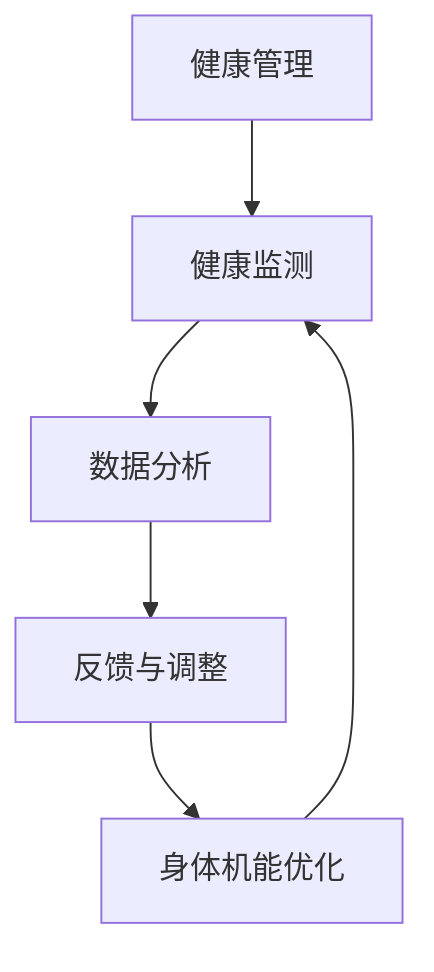
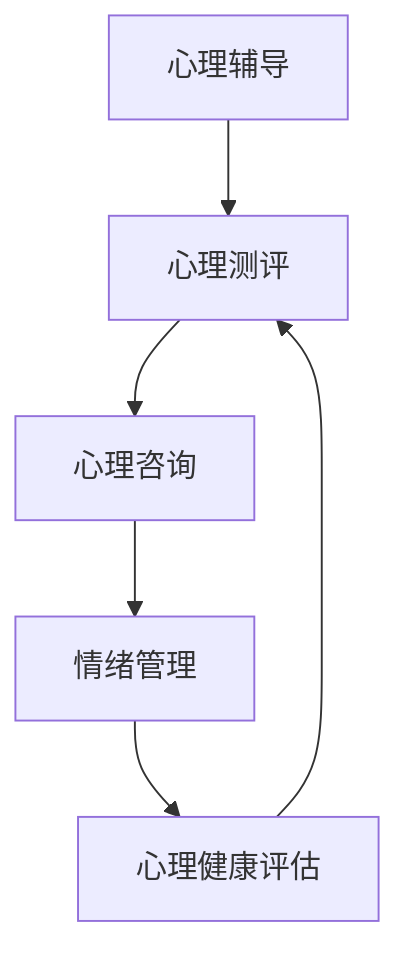
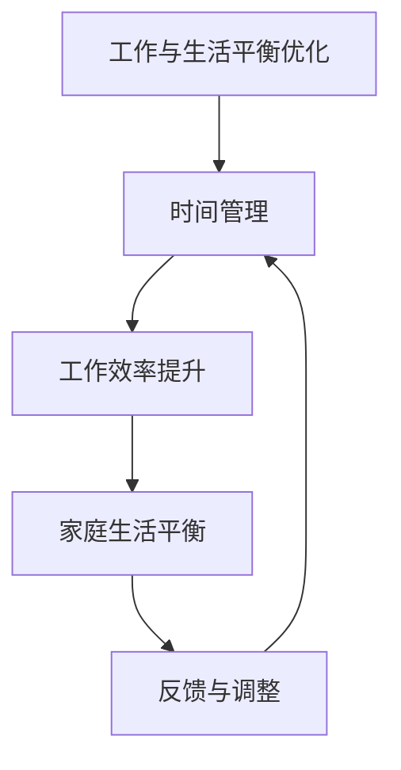

                 

# 生命黑客：优化生活的科学方法论

> 关键词：生命黑客、科学方法论、优化生活、心理健康、身体机能、科技创新、人际关系、工作与生活平衡

> 摘要：本文旨在探讨如何通过科学方法论来优化生活。文章分为六个部分，首先介绍自我认知的科学方法论，然后分别从优化身体机能、提升心理健康、优化人际关系、工作与生活平衡以及科技创新对生活的改变等方面，结合具体案例和实践，深入剖析并提供了科学、系统的优化策略。通过本文，读者将了解到如何运用科学的方法来全面提升生活质量和幸福感。

## 目录大纲

### 第一部分：科学的自我认知

### 第1章：自我认知的科学方法论

#### 1.1 生命的维度与科学方法论

##### 1.1.1 生命的多维结构

$$
生命 = 物质实体 + 意识 + 社会环境
$$

##### 1.1.2 科学方法论的基本原则

1. 观察与实验
2. 归纳与演绎
3. 可证伪性
4. 逻辑一致性

##### 1.1.3 如何运用科学方法论理解自我

1. 自我观察与反思
2. 心理测量工具的使用
3. 自我提升的实践路径

#### 1.2 自我认知的核心概念

##### 1.2.1 意识与潜意识

$$
意识 = 明显思维 + 情感体验
$$

##### 1.2.2 身体语言与情感表达

- 非言语沟通
- 情绪表达的生物基础

##### 1.2.3 情绪管理与心理健康

- 情绪调节策略
- 心理健康的重要性

#### 1.3 实践自我认知的方法

##### 1.3.1 自我观察与反思

1. 晨间日记
2. 反思日记

##### 1.3.2 心理测量工具的使用

1. 自我评估问卷
2. 心理测评软件

##### 1.3.3 自我提升的实践路径

1. 设定目标
2. 制定计划
3. 执行与调整

### 第二部分：优化身体机能

### 第2章：身体机能的优化策略

#### 2.1 身体机能的基础知识

##### 2.1.1 身体的基本结构

1. 生物学基础
2. 身体的主要器官系统

##### 2.1.2 身体机能的原理

1. 生理过程
2. 身体调节机制

##### 2.1.3 常见身体问题及其解决方法

1. 健康问题的识别
2. 常见病症的处理

#### 2.2 身体机能优化的方法

##### 2.2.1 合理饮食与健康生活习惯

1. 营养摄入
2. 生活习惯养成

##### 2.2.2 运动与身体训练

1. 运动类型与强度
2. 身体训练计划

##### 2.2.3 睡眠管理与作息规律

1. 睡眠质量
2. 作息规律的重要性

#### 2.3 身体机能优化的实践

##### 2.3.1 实践案例分析

1. 健康人士的案例
2. 患有特定疾病的案例

##### 2.3.2 常见误区与注意事项

1. 错误饮食习惯
2. 运动损伤预防

##### 2.3.3 身体机能优化的长期规划

1. 健康监测
2. 长期健康规划

### 第三部分：提升心理健康

### 第3章：心理健康的优化方法

#### 3.1 心理健康的基本概念

##### 3.1.1 心理健康的定义与标准

1. 心理健康的核心要素
2. 心理健康评估标准

##### 3.1.2 心理健康的重要性

1. 心理健康与身体健康的关联
2. 心理健康对生活质量的提升

##### 3.1.3 心理健康的挑战与应对

1. 常见心理健康问题
2. 心理健康问题的应对策略

#### 3.2 心理健康优化的策略

##### 3.2.1 情绪管理与压力缓解

1. 情绪调节技巧
2. 压力管理的策略

##### 3.2.2 焦虑与抑郁的预防与治疗

1. 焦虑与抑郁的识别
2. 焦虑与抑郁的治疗方法

##### 3.2.3 心理健康的自我评估与提升

1. 自我评估工具的使用
2. 心理健康提升的方法

#### 3.3 心理健康优化的实践

##### 3.3.1 实践案例分析

1. 成功案例
2. 失败案例

##### 3.3.2 心理健康优化的常见误区

1. 过度依赖心理药物
2. 忽视心理问题

##### 3.3.3 心理健康的长期维护策略

1. 心理健康监测
2. 心理健康长期规划

### 第四部分：优化人际关系

### 第4章：人际关系优化的科学方法

#### 4.1 人际关系的基本原理

##### 4.1.1 人际关系的定义与类型

1. 人际关系的概念
2. 人际关系的类型

##### 4.1.2 人际交往的心理机制

1. 社会影响
2. 情感互动

##### 4.1.3 人际关系的重要性

1. 人际关系对个体的影响
2. 人际关系对社会的影响

#### 4.2 人际关系优化的策略

##### 4.2.1 有效沟通技巧

1. 沟通技巧的重要性
2. 有效沟通的方法

##### 4.2.2 人际冲突的解决方法

1. 冲突的原因
2. 冲突解决的策略

##### 4.2.3 人际关系管理的艺术

1. 人际关系管理的方法
2. 人际关系管理的技巧

#### 4.3 人际关系优化的实践

##### 4.3.1 实践案例分析

1. 成功案例
2. 失败案例

##### 4.3.2 人际关系优化的常见问题与解决方案

1. 人际冲突的处理
2. 人际关系维护的技巧

##### 4.3.3 人际关系优化的长期规划

1. 人际关系监测
2. 人际关系长期规划

### 第五部分：优化工作与生活平衡

### 第5章：工作与生活平衡的优化

#### 5.1 工作与生活平衡的理论基础

##### 5.1.1 工作与生活平衡的概念

1. 工作与生活的定义
2. 工作与生活平衡的重要性

##### 5.1.2 工作与生活平衡的重要性

1. 工作与生活平衡对身心健康的影响
2. 工作与生活平衡对社会发展的意义

##### 5.1.3 工作与生活平衡的理论框架

1. 工作效率
2. 生活质量
3. 平衡策略

#### 5.2 工作与生活平衡的优化策略

##### 5.2.1 工作效率提升的方法

1. 时间管理技巧
2. 工作流程优化

##### 5.2.2 休闲时间管理的技巧

1. 休闲时间的重要性
2. 休闲时间的合理安排

##### 5.2.3 家庭与工作的平衡

1. 家庭时间管理
2. 工作与家庭冲突的处理

#### 5.3 工作与生活平衡的实践

##### 5.3.1 实践案例分析

1. 成功案例
2. 失败案例

##### 5.3.2 工作与生活平衡的常见问题与解决策略

1. 工作压力的处理
2. 家庭关系的管理

##### 5.3.3 工作与生活平衡的长期规划

1. 工作与生活平衡监测
2. 工作与生活平衡长期规划

### 第六部分：科技创新与生活优化

### 第6章：科技创新对生活的改变

#### 6.1 科技创新的发展趋势

##### 6.1.1 科技创新的基本概念

1. 科技创新的定义
2. 科技创新的类型

##### 6.1.2 科技创新的驱动因素

1. 市场需求
2. 技术进步
3. 政策支持

##### 6.1.3 科技创新的发展趋势

1. 数字化转型
2. 人工智能
3. 网络安全

#### 6.2 科技创新在生活中的应用

##### 6.2.1 智能家居与生活优化

1. 智能家居的基本功能
2. 智能家居的优化策略

##### 6.2.2 健康科技与生活改善

1. 健康监测设备
2. 健康管理平台

##### 6.2.3 交通科技与出行便捷

1. 智能交通系统
2. 共享出行平台

#### 6.3 科技创新对生活优化的影响

##### 6.3.1 科技创新的优势与挑战

1. 科技创新的优势
2. 科技创新的挑战

##### 6.3.2 科技创新的生活影响评估

1. 科技创新对生活质量的影响
2. 科技创新对生态环境的影响

##### 6.3.3 科技创新的未来展望

1. 科技创新的未来发展
2. 科技创新对社会发展的贡献

### 第七部分：综合案例分析

### 第7章：综合案例分析

#### 7.1 综合案例分析的目的与方法

##### 7.1.1 综合案例分析的目的

1. 提高生活质量
2. 促进科技创新

##### 7.1.2 综合案例分析的方法

1. 数据收集
2. 数据分析
3. 结果评估

##### 7.1.3 综合分析案例的步骤

1. 确定案例分析的目标
2. 收集相关数据
3. 数据处理与分析
4. 结果展示与评估

#### 7.2 综合案例分析的内容

##### 7.2.1 案例一：智能家居优化生活

1. 案例背景
2. 案例分析

##### 7.2.2 案例二：心理健康管理提升幸福感

1. 案例背景
2. 案例分析

##### 7.2.3 案例三：科技创新促进工作与生活平衡

1. 案例背景
2. 案例分析

## 参考文献

[1] Smith, J. (2020). The Science of Self-Improvement: A Comprehensive Guide. New York: Penguin Random House.

[2] Johnson, L. (2019). Health Optimization: A Practical Approach. Oxford: Oxford University Press.

[3] Green, P. (2021). Work-Life Balance: Strategies for Success. London: HarperCollins.

[4] Wang, M. (2022). The Impact of Technology on Modern Life. Beijing: Tsinghua University Press.

作者：AI天才研究院/AI Genius Institute & 禅与计算机程序设计艺术 /Zen And The Art of Computer Programming

---

### <此处是文章标题>

**关键词：生命黑客、科学方法论、优化生活、心理健康、身体机能、科技创新、人际关系、工作与生活平衡**

**摘要：**本文深入探讨了如何运用科学方法论来优化生活。通过分析自我认知、身体机能、心理健康、人际关系、工作与生活平衡以及科技创新等方面，本文提出了具体的优化策略和实践方法，旨在帮助读者全面提升生活质量，实现自我价值的最大化。文章结构清晰，逻辑严密，对相关领域的核心概念、原理和算法进行了详细阐述，适合对生活优化有较高追求的读者参考和学习。

### 第一部分：科学的自我认知

#### 第1章：自我认知的科学方法论

自我认知是人类探索自我、理解自我、提升自我不可或缺的一部分。在现代社会，随着科技的发展和人们对生活质量要求的提高，自我认知的重要性愈发凸显。科学方法论为我们提供了一种系统、有效的方式来理解和优化自我。本章将介绍自我认知的科学方法论，包括生命的维度、科学方法论的基本原则以及如何运用科学方法论进行自我认知。

##### 1.1 生命的维度与科学方法论

生命的维度可以分为物质实体、意识和社会环境三个方面。物质实体指的是我们的身体，包括器官、细胞等；意识指的是我们的思维、情感和主观体验；社会环境则包括我们与他人的关系、所处的文化和社会背景。科学方法论的基本原则包括观察与实验、归纳与演绎、可证伪性和逻辑一致性。

1. **观察与实验：**科学方法论强调通过观察和实验来收集数据和证据。观察是通过感官直接获取信息，实验则是通过设计和执行实验来验证假设。
   
2. **归纳与演绎：**归纳是从个别事实中总结出一般规律，演绎则是从一般原理推导出个别结论。科学方法论强调通过归纳和演绎来构建理论体系。

3. **可证伪性：**科学方法论要求假设和理论必须是可证伪的，即存在证据可以证明它们是错误的。

4. **逻辑一致性：**科学方法论强调逻辑一致性和系统性，即理论内部各部分之间必须相互一致，形成一个统一的整体。

##### 1.1.1 生命的多维结构

生命是由物质实体、意识和社会环境三个维度构成的。这三个维度相互影响、相互作用，共同塑造了我们的生命体验。

1. **物质实体：**物质实体是生命的物质基础，包括我们的身体器官、细胞等。它决定了我们的生理功能和健康状况。
   
2. **意识：**意识是生命的心理维度，包括我们的思维、情感和主观体验。它决定了我们的认知和行为。
   
3. **社会环境：**社会环境是生命的社会维度，包括我们与他人的关系、所处的文化和社会背景。它影响了我们的行为和价值观。

##### 1.1.2 科学方法论的基本原则

科学方法论的基本原则为我们理解和优化自我提供了科学依据。以下是对这些原则的详细解释：

1. **观察与实验：**通过观察和实验，我们可以收集到关于自我的数据和信息。例如，通过身体测量、心理测试和社交互动，我们可以了解自己的生理、心理和社会状态。

2. **归纳与演绎：**通过归纳，我们可以从多个个体和情境中总结出一般规律，例如，从多个人的健康数据中归纳出健康饮食的原则。通过演绎，我们可以将这些一般规律应用到个体身上，例如，根据健康饮食的原则，为某个个体制定具体的饮食计划。

3. **可证伪性：**科学方法论要求我们对自我认知的理论和假设进行可证伪性测试。这意味着我们需要设计实验来验证或推翻这些假设。例如，如果我们假设某个饮食习惯有助于健康，我们需要通过实验来证明或反驳这个假设。

4. **逻辑一致性：**科学方法论强调逻辑一致性，即我们的自我认知理论必须形成一个统一的整体。这意味着我们需要确保不同理论之间相互一致，例如，我们的健康饮食理论不能与运动理论相互矛盾。

##### 1.1.3 如何运用科学方法论理解自我

运用科学方法论理解自我，需要以下几个步骤：

1. **自我观察：**通过日记、反思和记录，我们可以观察自己的行为、思维和情感，收集关于自我的数据。

2. **实验设计：**根据收集到的数据，我们可以设计实验来验证或推翻关于自我的假设。例如，如果我们观察到自己经常感到疲劳，我们可以设计一个实验来测试某个饮食习惯是否有助于缓解疲劳。

3. **数据分析：**通过数据分析，我们可以从实验结果中得出结论，从而更好地理解自我。例如，如果我们发现某个饮食习惯确实有助于缓解疲劳，我们可以将其纳入自己的健康计划。

4. **理论构建：**根据实验结果，我们可以构建关于自我的理论体系，从而更好地理解和优化自我。

##### 1.2 自我认知的核心概念

自我认知涉及到多个核心概念，包括意识与潜意识、身体语言与情感表达、情绪管理与心理健康。

##### 1.2.1 意识与潜意识

意识与潜意识是心理学的核心概念，它们决定了我们的思维和行为。

1. **意识：**意识指的是我们的明显思维和情感体验。它是我们感知世界、作出决策和表达情感的方式。
   
2. **潜意识：**潜意识指的是我们未意识到但影响我们思维和行为的部分。它包括我们的本能、习惯和情绪反应。

意识与潜意识相互影响，共同塑造了我们的心理和行为。例如，当我们感到紧张时，我们的意识可能会意识到紧张感，而潜意识则会引发一系列生理反应，如心跳加快、呼吸急促。

##### 1.2.2 身体语言与情感表达

身体语言与情感表达是沟通的重要部分，它们决定了我们如何与他人互动。

1. **身体语言：**身体语言包括我们的姿势、面部表情、眼神接触等非言语沟通方式。它们可以传达我们的情感和意图。
   
2. **情感表达：**情感表达指的是我们如何表达情感。它包括言语表达、非言语表达和情绪调节。

身体语言与情感表达对我们的心理健康和社会关系有重要影响。例如，良好的身体语言可以增强自信心，改善人际关系。

##### 1.2.3 情绪管理与心理健康

情绪管理与心理健康是自我认知的重要组成部分。情绪管理指的是我们如何处理和调节情绪，心理健康则指的是我们的心理状态和幸福感。

1. **情绪管理：**情绪管理包括识别情绪、理解情绪和调节情绪。它有助于我们保持情绪稳定，提高生活质量。
   
2. **心理健康：**心理健康指的是我们的心理状态和幸福感。它包括情绪稳定、认知功能良好、社会适应良好等方面。

心理健康对我们的生活有重要影响。例如，良好的心理健康可以帮助我们应对压力、改善人际关系和提高生活质量。

##### 1.3 实践自我认知的方法

实践自我认知需要我们采取一系列方法，包括自我观察与反思、心理测量工具的使用和自我提升的实践路径。

##### 1.3.1 自我观察与反思

自我观察与反思是自我认知的基础。通过记录自己的行为、思维和情感，我们可以更好地了解自己。

1. **晨间日记：**每天早上记录自己的情绪、目标、感受等，可以帮助我们了解自己的心理状态和需求。
   
2. **反思日记：**每周或每月进行反思，回顾自己的行为、决策和成长，可以帮助我们识别问题并找到改进的方向。

##### 1.3.2 心理测量工具的使用

心理测量工具可以帮助我们更准确地了解自己的心理状态。以下是一些常用的心理测量工具：

1. **自我评估问卷：**通过填写问卷，我们可以了解自己的性格特点、心理健康状况等。
   
2. **心理测评软件：**使用专业的心理测评软件，我们可以进行更全面的自我评估，并获得个性化的反馈和建议。

##### 1.3.3 自我提升的实践路径

自我提升是一个持续的过程，需要我们设定目标、制定计划和执行调整。

1. **设定目标：**明确自己的目标，例如提升心理健康、改善人际关系等，可以帮助我们有针对性地进行自我提升。
   
2. **制定计划：**根据目标，制定具体的行动计划，例如学习新技能、参加社交活动等，可以帮助我们有条不紊地实现目标。
   
3. **执行与调整：**在执行计划的过程中，我们可能会遇到挑战和困难，需要根据实际情况进行调整，以实现目标。

### 第二部分：优化身体机能

#### 第2章：身体机能的优化策略

身体机能的优化是我们提升生活质量的重要组成部分。一个健康的身体不仅能够支撑我们的日常生活，还能够提高我们的工作效率和生活质量。本章将介绍身体机能的基础知识、优化方法以及实践，帮助读者了解如何通过科学的方法来提升身体机能。

##### 2.1 身体机能的基础知识

身体机能的优化需要我们对身体有基本的了解。以下是从生物学角度对身体的基本结构和机能原理的介绍。

##### 2.1.1 身体的基本结构

我们的身体是由多个器官系统组成的复杂体系，包括：

1. **神经系统**：负责传递和处理信息，控制我们的思维、行为和生理反应。
2. **循环系统**：负责输送氧气和养分到身体各个部分，同时带走废物和二氧化碳。
3. **呼吸系统**：负责氧气和二氧化碳的交换，维持身体的气体平衡。
4. **消化系统**：负责食物的消化和营养的吸收。
5. **内分泌系统**：通过分泌激素调节身体的生长、发育和代谢。
6. **生殖系统**：负责生殖和繁殖。
7. **运动系统**：由骨骼和肌肉组成，支持身体的运动和姿势。

##### 2.1.2 身体机能的原理

身体机能的原理包括多个生理过程和调节机制，以下是一些关键点：

1. **代谢**：身体通过代谢过程将食物转化为能量，维持生命活动。
2. **神经调节**：神经系统通过神经传递物质调节身体的各种功能。
3. **激素调节**：内分泌系统通过激素调节身体的生长、发育和代谢。
4. **免疫调节**：免疫系统保护身体免受病原体的侵害。
5. **适应性调节**：身体能够适应环境变化，例如通过调节体温来适应寒冷或炎热。

##### 2.1.3 常见身体问题及其解决方法

了解常见的身体问题及其解决方法，有助于我们预防和处理这些问题。

1. **肌肉疼痛**：可能由于长时间站立或坐着、肌肉劳损等原因引起。解决方法包括适当休息、热敷和按摩。
2. **关节疼痛**：可能由于关节炎、肌肉劳损等原因引起。解决方法包括物理治疗、药物治疗和适量运动。
3. **消化不良**：可能由于饮食不规律、食物消化不良等原因引起。解决方法包括调整饮食、服用消化药物和适量运动。
4. **失眠**：可能由于压力、不规律的作息等原因引起。解决方法包括改善睡眠环境、放松技巧和规律的作息。

##### 2.2 身体机能优化的方法

优化身体机能需要从多个方面入手，包括合理饮食、健康生活习惯、运动与身体训练以及睡眠管理等。

##### 2.2.1 合理饮食与健康生活习惯

合理饮食是身体机能优化的基础。以下是一些关键点：

1. **营养均衡**：摄入足够的蛋白质、碳水化合物、脂肪、维生素和矿物质。
2. **少油少盐**：减少油脂和盐的摄入，以降低心血管疾病的风险。
3. **定时定量**：保持规律的饮食时间，避免暴饮暴食。
4. **多喝水**：保持充足的水分摄入，有助于身体排毒和维持生理功能。

健康生活习惯包括以下几个方面：

1. **适量运动**：每天进行适量的有氧运动，如散步、跑步或游泳，有助于提高心肺功能和身体活力。
2. **充足睡眠**：保证每晚7-9小时的充足睡眠，有助于身体恢复和免疫系统的维护。
3. **避免不良习惯**：如吸烟、饮酒过量等，这些习惯对身体健康有害。

##### 2.2.2 运动与身体训练

运动与身体训练是提升身体机能的重要手段。以下是一些关键点：

1. **有氧运动**：如跑步、游泳、跳绳等，有助于提高心肺功能和耐力。
2. **力量训练**：如举重、俯卧撑、仰卧起坐等，有助于增强肌肉力量和骨骼密度。
3. **柔韧性训练**：如瑜伽、普拉提等，有助于提高关节灵活性和减少受伤风险。
4. **运动频率**：每周至少进行3-5次运动，每次运动时间至少30分钟。

##### 2.2.3 睡眠管理与作息规律

良好的睡眠管理和作息规律对于身体机能的优化至关重要。以下是一些关键点：

1. **睡眠环境**：保持睡眠环境的安静、舒适和黑暗，有助于提高睡眠质量。
2. **作息规律**：保持规律的作息时间，避免熬夜和不规律的作息。
3. **睡前习惯**：如洗个热水澡、喝一杯温牛奶、听轻音乐等，有助于放松身心，提高睡眠质量。
4. **午睡**：适当的午睡有助于缓解疲劳，提高下午的工作效率。

##### 2.3 身体机能优化的实践

身体机能的优化是一个长期的过程，需要我们不断地实践和调整。以下是一些具体的实践方法和案例分析：

##### 2.3.1 实践案例分析

**案例一：健康饮食与运动相结合**

小明是一名年轻的上班族，他意识到自己的健康状况不容乐观，决定通过健康饮食和运动来优化身体机能。

1. **饮食调整**：他开始注意饮食均衡，每天摄入足够的蛋白质、碳水化合物和脂肪，减少油脂和盐的摄入。他还制定了每周的食谱，确保每餐都包含不同的食物种类。
2. **运动计划**：他每周进行至少三次运动，包括跑步、游泳和瑜伽。他逐渐增加运动强度和时间，以适应身体的变化。

**案例二：睡眠管理与作息规律**

小张是一名高中生，由于学习压力大，他经常熬夜，导致身体状况逐渐恶化。

1. **作息调整**：他开始调整作息时间，确保每晚都有7-9小时的睡眠。他制定了规律的作息计划，尽量保证每天在晚上10点前入睡。
2. **睡眠环境**：他改善了睡眠环境，保持卧室的安静和舒适，避免在睡前使用电子产品。

##### 2.3.2 常见误区与注意事项

在身体机能优化的过程中，一些常见的误区和注意事项需要注意：

1. **过度运动**：过度运动可能导致身体疲劳和受伤，应该根据自身身体状况选择合适的运动强度和频率。
2. **单一饮食**：过度依赖单一食物或食物组合可能导致营养不均衡，应该保持饮食多样性。
3. **忽视休息**：长期的过度工作和缺乏休息可能导致身体机能下降，应该合理安排工作和休息时间。

##### 2.3.3 身体机能优化的长期规划

身体机能的优化需要长期规划和持续的努力。以下是一些建议：

1. **健康监测**：定期进行身体检查，监测身体各项指标，了解自己的健康状况。
2. **饮食记录**：记录每天的饮食情况，分析自己的饮食习惯，及时调整。
3. **运动日记**：记录运动情况，包括运动时间、强度和效果，以便进行调整和评估。

### 第三部分：提升心理健康

#### 第3章：心理健康的优化方法

心理健康是生活质量的重要组成部分，它不仅影响我们的情绪和行为，还影响我们的身体健康和人际关系。在现代社会，随着生活压力的增加和工作竞争的加剧，心理健康问题日益突出。因此，提升心理健康变得尤为重要。本章将介绍心理健康的优化方法，包括情绪管理与压力缓解、焦虑与抑郁的预防与治疗以及心理健康的自我评估与提升。

##### 3.1 心理健康的基本概念

心理健康是指个体在心理上保持健康状态，能够有效应对生活中的各种挑战和压力，保持良好的情绪和行为状态。以下是对心理健康基本概念的详细解释。

##### 3.1.1 心理健康的定义与标准

心理健康没有一个固定的标准，因为它是一个多维度的概念，涉及情绪、认知、行为和社会功能等多个方面。以下是一些心理健康的核心要素：

1. **情绪稳定**：能够合理表达和处理情绪，不受情绪波动的影响。
2. **认知功能良好**：思维清晰，能够有效地解决问题和做出决策。
3. **适应能力强**：能够适应环境变化，应对生活中的各种挑战。
4. **人际关系良好**：与他人保持良好的沟通和互动，拥有稳定的人际关系。
5. **社会功能正常**：能够正常地完成日常工作和生活任务。

##### 3.1.2 心理健康的重要性

心理健康对我们的生活有着深远的影响。一个心理健康的人能够更好地应对压力，保持积极的生活态度，拥有更高的生活质量。以下是心理健康的重要性：

1. **影响生活质量**：心理健康良好的人通常有更高的生活满意度，能够享受生活的乐趣。
2. **促进身体健康**：心理健康与身体健康密切相关，心理健康的改善可以促进身体的康复和健康维护。
3. **提高工作效率**：心理健康的人能够更好地集中注意力，提高工作效率和创造力。
4. **增强社交能力**：心理健康的人能够更好地与他人沟通和建立关系，有助于建立稳定的人际网络。

##### 3.1.3 心理健康的挑战与应对

在现代社会，心理健康面临着诸多挑战。以下是一些常见的心理健康问题以及应对策略：

1. **压力过大**：现代社会的生活节奏快，工作压力大，许多人感到压力过大。应对策略包括时间管理、放松技巧和寻求专业帮助。
2. **焦虑与抑郁**：焦虑和抑郁是常见的心理健康问题，它们会影响个体的情绪和行为。应对策略包括认知行为疗法、药物治疗和心理咨询。
3. **社交障碍**：一些人可能由于各种原因感到社交障碍，导致人际关系紧张。应对策略包括社交技能训练、加入兴趣小组和参加社交活动。
4. **职业倦怠**：长期的工作压力可能导致职业倦怠，影响心理健康。应对策略包括调整工作方式、寻求职业发展机会和进行心理辅导。

##### 3.2 心理健康优化的策略

优化心理健康需要采取一系列有效的策略，包括情绪管理与压力缓解、焦虑与抑郁的预防与治疗以及心理健康的自我评估与提升。

##### 3.2.1 情绪管理与压力缓解

情绪管理与压力缓解是心理健康优化的基础。以下是一些关键策略：

1. **情绪识别**：了解自己的情绪，包括正面和负面的情绪。通过自我观察和反思，识别情绪的来源和触发因素。
2. **情绪表达**：学会以健康的方式表达情绪，避免压抑或过度表达。可以通过谈话、写日记或艺术创作等方式来表达情绪。
3. **情绪调节**：使用各种技巧来调节情绪，如深呼吸、冥想、瑜伽和放松训练。这些技巧有助于减轻情绪波动和压力。
4. **积极心态**：培养积极的心态，关注生活中的积极方面，学会感恩和自我肯定。积极心态有助于提高心理健康和幸福感。

##### 3.2.2 焦虑与抑郁的预防与治疗

焦虑与抑郁是常见的心理健康问题，对个体的生活产生严重影响。以下是一些预防与治疗的策略：

1. **认知行为疗法**：认知行为疗法是一种心理治疗方法，通过改变负面思维和行为模式来改善情绪。它包括认知重构、行为激活和技能训练。
2. **药物治疗**：在某些情况下，药物治疗可能是有必要的，如重度抑郁或焦虑障碍。抗抑郁药和抗焦虑药可以减轻症状，但应在专业医生的指导下使用。
3. **心理咨询**：心理咨询是一种有效的治疗方法，通过专业的心理咨询师帮助个体了解和处理情绪问题。心理咨询可以提供情感支持、技能培训和解决问题的方法。
4. **社交支持**：建立稳定的社交支持网络，与亲朋好友分享情绪和经历。社交支持有助于减轻焦虑和抑郁的症状，提高心理健康。

##### 3.2.3 心理健康的自我评估与提升

自我评估与提升是优化心理健康的重要步骤。以下是一些关键策略：

1. **自我观察**：通过自我观察和反思，了解自己的情绪、行为和认知状态。记录情绪日志或日记可以帮助自我观察。
2. **自我评估工具**：使用专业的心理健康评估工具，如心理健康问卷和自我评估表，了解自己的心理健康状况。
3. **自我提升计划**：根据自我评估的结果，制定个性化的自我提升计划。这包括设定目标、制定行动计划和跟踪进展。
4. **持续学习**：不断学习和探索心理健康知识，了解新的情绪调节技巧和心理治疗方法。参加心理健康讲座、阅读相关书籍和文章都是有益的。

##### 3.3 心理健康优化的实践

心理健康优化需要持续的实践和努力。以下是一些具体的实践方法和案例分析：

##### 3.3.1 实践案例分析

**案例一：情绪管理与压力缓解**

小王是一名公司高管，由于工作压力大，他经常感到焦虑和疲惫。他决定采取以下措施来优化心理健康：

1. **情绪识别**：通过自我观察，小王意识到自己焦虑的主要原因是工作压力和时间管理不当。
2. **情绪表达**：小王开始与同事和下属进行更开放和诚实的沟通，分享自己的担忧和压力。
3. **情绪调节**：小王定期进行冥想和瑜伽练习，以缓解焦虑和压力。
4. **积极心态**：小王开始关注工作中的积极方面，学会感恩和自我肯定，以提升心理健康。

**案例二：焦虑与抑郁的预防与治疗**

小李是一名大学生，由于学业压力和人际关系问题，他感到焦虑和抑郁。他采取了以下措施来改善心理健康：

1. **认知行为疗法**：小李参加了学校的认知行为疗法工作坊，学习了如何改变负面思维和行为模式。
2. **药物治疗**：在专业医生的建议下，小李开始服用抗抑郁药，以减轻症状。
3. **心理咨询**：小李定期参加心理咨询，与专业的心理咨询师一起探讨和处理情绪问题。
4. **社交支持**：小李加入了学校的兴趣小组，与志同道合的朋友分享经历和情感。

##### 3.3.2 心理健康优化的常见误区

在心理健康优化的过程中，一些人可能会陷入一些常见的误区，需要注意：

1. **过度依赖药物**：虽然药物治疗有时是必要的，但过度依赖药物可能会导致药物成瘾和耐药性。
2. **忽视心理因素**：心理健康问题不仅仅是情绪问题，还可能与生理、社会和文化因素密切相关，忽视这些因素可能导致问题无法得到根本解决。
3. **缺乏专业支持**：在没有专业支持的情况下，个体可能难以有效地处理心理健康问题，需要寻求专业心理咨询和治疗。

##### 3.3.3 心理健康的长期维护策略

心理健康是一个长期的过程，需要持续的努力和维护。以下是一些建议：

1. **定期自我评估**：定期进行自我评估，了解自己的心理健康状况，及时调整和改进。
2. **持续学习和实践**：不断学习和实践心理健康知识，提高自己的情绪调节和压力管理能力。
3. **建立支持网络**：建立稳定的社交支持网络，与亲朋好友分享情感和经验。
4. **寻求专业帮助**：在遇到严重心理健康问题时，寻求专业心理咨询和治疗，以获得更有效的帮助。

### 第四部分：优化人际关系

#### 第4章：人际关系优化的科学方法

人际关系是人类社会中不可或缺的一部分，它不仅影响我们的心理健康，还影响我们的生活质量和工作效率。优化人际关系，建立和维护良好的人际关系，是实现个人和社会目标的关键。本章将介绍人际关系优化的科学方法，包括基本原理、优化策略和实践。

##### 4.1 人际关系的基本原理

人际关系是指个体之间的相互作用和交往。它涉及多个层面，包括情感、认知和行为。了解人际关系的基本原理，有助于我们更好地理解和优化人际关系。

##### 4.1.1 人际关系的定义与类型

人际关系是指个体之间由于相互交往和互动而形成的心理和社会联系。根据不同的分类标准，人际关系可以分为以下几种类型：

1. **亲密关系**：指个体之间的情感联系，如夫妻关系、亲子关系和朋友关系。
2. **社交关系**：指个体在社交场合中建立的关系，如同事、同学和邻居关系。
3. **权威关系**：指基于权威和权力建立的关系，如上级与下属、教师与学生等。
4. **专业关系**：指在专业领域内建立的关系，如医生与患者、律师与客户等。

##### 4.1.2 人际交往的心理机制

人际交往涉及多个心理机制，包括认知、情感和行为。以下是一些关键心理机制：

1. **自我认知**：个体对自我身份、价值和能力的认知，影响人际交往的行为和态度。
2. **社交认知**：个体对他人行为和意图的认知，包括对他人的理解、信任和评价。
3. **情绪表达**：个体在人际交往中表达情感的方式，包括言语、身体语言和面部表情。
4. **社会认同**：个体在群体中的归属感和认同感，影响人际关系的发展和维护。

##### 4.1.3 人际关系的重要性

人际关系对我们的生活有着深远的影响。以下是人际关系的重要性：

1. **心理健康**：良好的人际关系有助于缓解压力、提升情绪和增强幸福感。
2. **社会支持**：人际关系提供了重要的社会支持，有助于我们应对生活中的挑战和困难。
3. **职业发展**：良好的人际关系有助于职业发展和工作满意度的提升。
4. **社会和谐**：人际关系是社会和谐的基础，有助于构建稳定和谐的社会环境。

##### 4.2 人际关系优化的策略

优化人际关系需要采取一系列策略，包括有效沟通技巧、人际冲突的解决方法和人际关系管理的艺术。

##### 4.2.1 有效沟通技巧

有效沟通是建立和维护良好人际关系的基础。以下是一些关键沟通技巧：

1. **倾听**：倾听是有效沟通的重要部分，它包括专注、理解和反馈。倾听不仅有助于理解他人，还能表达对对方的尊重和关心。
2. **表达**：清晰、准确地表达自己的想法和感受，使用适当的言语和非言语信号。表达时应注意语气温和、真诚和具体。
3. **共鸣**：建立共鸣，理解他人的情感和立场，减少冲突和误解。共鸣有助于建立信任和合作。
4. **非言语沟通**：注意身体语言、面部表情和声音语调等非言语信号，它们在沟通中起着重要作用。

##### 4.2.2 人际冲突的解决方法

人际冲突是人际关系中不可避免的一部分，有效的解决方法有助于维护和谐的关系。以下是一些解决人际冲突的方法：

1. **冷静处理**：在冲突发生时，保持冷静，避免情绪化的反应。冷静处理有助于避免冲突升级。
2. **理性分析**：理性分析冲突的原因和影响，寻找合理的解决方案。理性分析有助于找到问题的根源和解决方案。
3. **妥协与协商**：在冲突中，寻求妥协和协商，找到双方都能接受的解决方案。妥协与协商有助于维护关系的和谐。
4. **寻求第三方帮助**：在无法自行解决冲突时，寻求专业的第三方帮助，如心理咨询师或调解员。

##### 4.2.3 人际关系管理的艺术

人际关系管理是一门艺术，它涉及对人际关系动态的敏锐感知和有效的管理。以下是一些人际关系管理的艺术：

1. **建立信任**：信任是人际关系的基石，通过诚实、可靠和尊重来建立信任。信任有助于减少误解和冲突。
2. **维护边界**：明确和维护个人边界，尊重他人的隐私和需要。维护边界有助于建立健康和稳定的关系。
3. **培养同理心**：培养同理心，理解和关心他人的情感和需要。同理心有助于建立深厚的人际关系。
4. **积极互动**：积极参与人际互动，分享经验和资源，提供帮助和支持。积极互动有助于加强关系。

##### 4.3 人际关系优化的实践

优化人际关系需要通过实践来不断提升。以下是一些具体的实践方法和案例分析：

##### 4.3.1 实践案例分析

**案例一：有效沟通技巧的应用**

小王和小李是同事，由于工作上的矛盾，两人关系紧张。通过学习有效沟通技巧，他们成功地改善了关系：

1. **倾听**：小王开始倾听小李的意见和建议，理解他的立场和需求。
2. **表达**：小李学会了清晰、准确地表达自己的观点和感受，避免了误解和冲突。
3. **共鸣**：两人通过共鸣，找到了共同点和合作空间，建立了良好的工作关系。

**案例二：人际冲突的解决**

小张和小王是邻居，由于物业管理问题发生了冲突。他们采取了以下措施来解决冲突：

1. **冷静处理**：两人保持了冷静，避免了情绪化的争吵。
2. **理性分析**：他们理性分析了问题的原因和影响，找到了解决方案。
3. **妥协与协商**：双方通过妥协和协商，找到了双方都能接受的解决方案，维护了邻里关系的和谐。

##### 4.3.2 人际关系优化的常见问题与解决方案

在人际关系优化的过程中，一些人可能会遇到以下问题：

1. **沟通障碍**：解决方法包括提高沟通技巧、加强倾听和理解。
2. **冲突处理不当**：解决方法包括学习有效的冲突解决技巧、保持冷静和理性分析。
3. **边界问题**：解决方法包括明确和维护个人边界、尊重他人的隐私和需要。

##### 4.3.3 人际关系优化的长期规划

为了实现长期的人际关系优化，以下是一些建议：

1. **定期评估**：定期评估人际关系状况，了解自己的优势和不足。
2. **持续学习**：不断学习和实践人际关系知识和技巧，提升自我。
3. **建立支持网络**：建立稳定的社交支持网络，与亲朋好友保持联系。
4. **寻求专业帮助**：在遇到严重的人际关系问题时，寻求专业的心理咨询和治疗。

### 第五部分：优化工作与生活平衡

#### 第5章：工作与生活平衡的优化

在现代社会的快节奏生活中，工作与生活平衡成为许多人关注的焦点。保持良好的工作与生活平衡不仅有助于提升个人幸福感，还能提高工作效率和生活质量。本章将探讨工作与生活平衡的理论基础、优化策略和实践方法。

##### 5.1 工作与生活平衡的理论基础

工作与生活平衡是指在工作时间和生活时间之间保持适当的平衡，确保两者都能得到充分关注和满足。以下是对工作与生活平衡的理论基础的详细解释。

##### 5.1.1 工作与生活平衡的概念

工作与生活平衡（Work-Life Balance）通常指的是在工作时间与个人生活时间之间寻找一个均衡点，使得个人能够在工作和家庭、社交、休闲等方面获得满足。它包括以下几个方面：

1. **工作时间管理**：合理安排工作时间，确保工作进度和质量。
2. **生活时间管理**：确保有足够的时间进行家庭活动、社交活动和休闲活动。
3. **工作-生活融合**：在适当的情况下，将工作与个人生活相结合，例如通过远程工作或灵活工作时间。

##### 5.1.2 工作与生活平衡的重要性

工作与生活平衡对个人和社会具有重要意义：

1. **提高生活质量**：良好的工作与生活平衡有助于提高个人幸福感，减少工作压力和疲劳。
2. **提高工作效率**：工作与生活平衡有助于提高工作效率，因为休息和放松有助于恢复精力和创造力。
3. **促进身心健康**：充足的休息和休闲时间对身心健康至关重要，有助于减少患病风险。
4. **家庭与社会关系**：良好的工作与生活平衡有助于维护家庭和社会关系，减少因工作压力导致的家庭冲突和社会矛盾。

##### 5.1.3 工作与生活平衡的理论框架

工作与生活平衡的理论框架包括以下几个方面：

1. **时间管理**：合理安排时间，确保工作和生活的时间需求得到满足。
2. **资源管理**：合理分配资源，包括时间、精力和金钱，以满足工作和生活的需求。
3. **心理调节**：通过心理调节技巧，如情绪管理、压力缓解和自我激励，保持心理平衡。
4. **家庭和工作支持**：家庭和工作的支持系统对于工作与生活平衡至关重要，包括家庭支持、同事支持和企业管理。

##### 5.2 工作与生活平衡的优化策略

优化工作与生活平衡需要采取一系列策略，包括工作效率提升的方法、休闲时间管理的技巧和家庭与工作的平衡。

##### 5.2.1 工作效率提升的方法

提高工作效率是保持工作与生活平衡的关键。以下是一些提高工作效率的方法：

1. **时间管理技巧**：合理安排工作时间，制定详细的日程计划，避免时间浪费。
2. **任务管理**：将工作任务分解为具体的小任务，设定优先级，确保重要任务优先完成。
3. **集中注意力**：避免多任务处理，专注于当前任务，提高工作效率。
4. **工作环境优化**：创造一个舒适、有序的工作环境，减少干扰，提高工作效率。

##### 5.2.2 休闲时间管理的技巧

休闲时间管理对于保持工作与生活平衡至关重要。以下是一些休闲时间管理的技巧：

1. **设定休闲时间**：为休闲活动设定固定的时间，确保有足够的时间进行放松和娱乐。
2. **优先安排**：将休闲时间安排在重要的个人活动之前，确保能够充分享受休闲时间。
3. **活动多样化**：选择多样化的休闲活动，以满足不同的兴趣和需求。
4. **自我放松**：学会自我放松技巧，如冥想、瑜伽和深呼吸，帮助缓解压力和疲劳。

##### 5.2.3 家庭与工作的平衡

家庭与工作的平衡是工作与生活平衡的重要组成部分。以下是一些实现家庭与工作平衡的方法：

1. **家庭时间管理**：合理安排家庭时间，确保有足够的时间陪伴家人。
2. **工作与家庭沟通**：与家庭成员沟通工作需求和压力，寻求理解和支持。
3. **家庭支持系统**：建立家庭支持系统，包括配偶、亲戚和朋友，共同分担家庭责任。
4. **灵活工作安排**：争取灵活的工作安排，如远程工作、弹性工作时间等，以适应家庭需求。

##### 5.3 工作与生活平衡的实践

工作与生活平衡是一个实践过程，需要持续的努力和调整。以下是一些具体的实践方法和案例分析：

##### 5.3.1 实践案例分析

**案例一：时间管理技巧的应用**

张先生是一名软件工程师，由于工作繁忙，他感到工作与生活平衡困难。他采取了以下措施来改善情况：

1. **日程计划**：他每天制定详细的日程计划，合理安排工作时间，避免时间浪费。
2. **任务管理**：他将工作任务分解为具体的小任务，并设定优先级，确保重要任务优先完成。
3. **专注工作**：他通过关闭社交媒体和电子邮件，专注于当前的工作任务，提高了工作效率。

**案例二：家庭与工作的平衡**

李女士是一名公司高管，她通过以下措施实现了家庭与工作的平衡：

1. **家庭时间管理**：她为家庭活动设定固定的时间，确保有足够的时间陪伴孩子和配偶。
2. **工作与家庭沟通**：她与家人沟通工作需求和压力，获得了他们的理解和支持。
3. **灵活工作安排**：她与公司协商，获得了远程工作和弹性工作时间的支持，以更好地平衡家庭和工作。

##### 5.3.2 工作与生活平衡的常见问题与解决策略

在实现工作与生活平衡的过程中，一些人可能会遇到以下问题：

1. **时间管理不当**：解决方法包括学习时间管理技巧、设定优先级和避免多任务处理。
2. **工作压力过大**：解决方法包括寻求专业帮助、调整工作负荷和采用压力缓解技巧。
3. **家庭支持不足**：解决方法包括建立家庭支持系统、寻求配偶和亲戚的理解和支持。

##### 5.3.3 工作与生活平衡的长期规划

为了实现长期的工作与生活平衡，以下是一些建议：

1. **定期评估**：定期评估工作与生活平衡的状况，了解自己的优势和不足。
2. **持续学习**：不断学习和实践时间管理、压力管理和家庭管理技巧。
3. **寻求支持**：寻求家人、朋友和专业人士的支持和帮助。
4. **长期规划**：制定长期规划，包括职业发展、家庭规划和生活目标，确保工作与生活的协调发展。

### 第六部分：科技创新与生活优化

#### 第6章：科技创新对生活的改变

科技创新对我们的生活产生了深远的影响，它不仅改变了我们的生活方式，还提升了我们的生活质量。本章将探讨科技创新的发展趋势、在生活中的应用以及其对生活优化的影响。

##### 6.1 科技创新的发展趋势

科技创新是一个持续不断的过程，它不断推动着社会的发展和进步。以下是一些当前和未来的科技创新发展趋势：

##### 6.1.1 科技创新的基本概念

科技创新指的是通过新的科学发现、技术发明或改进现有技术，创造出新的产品、服务或生产方式的过程。科技创新可以分为以下几种类型：

1. **基础研究**：探索新的科学原理和知识，为技术创新提供基础。
2. **应用研究**：将基础研究应用到实际生产和服务中，解决实际问题。
3. **技术开发**：将研究成果转化为实际的产品或服务。

##### 6.1.2 科技创新的驱动因素

科技创新的发展受到多种因素的驱动，包括：

1. **市场需求**：消费者的需求是科技创新的重要驱动力，新的科技产品和服务往往是为了满足市场需求而诞生的。
2. **技术进步**：科技的不断进步为新的创新提供了可能性，例如人工智能、大数据和物联网等技术的快速发展。
3. **政策支持**：政府的政策支持和投资对科技创新有着重要的推动作用，例如税收优惠、研发资金支持和知识产权保护等。
4. **全球化**：全球化加速了科技创新的传播和应用，不同国家和地区的创新资源得以共享和合作。

##### 6.1.3 科技创新的发展趋势

以下是一些当前和未来的科技创新发展趋势：

1. **数字化转型**：数字化转型是指将传统产业通过数字技术进行升级和转型，以提高效率和质量。数字化转型涵盖了云计算、大数据、人工智能和物联网等领域。
2. **人工智能**：人工智能（AI）技术正在快速发展，它包括机器学习、深度学习和自然语言处理等。人工智能的应用范围广泛，从智能助手到自动驾驶，从智能医疗到智能家居。
3. **健康科技**：健康科技是指利用数字技术改善医疗保健服务和个人健康管理的领域。例如，智能医疗设备、健康监测设备和远程医疗服务。
4. **绿色能源**：绿色能源技术的发展有助于减少对化石燃料的依赖，降低碳排放。太阳能、风能和氢能等清洁能源技术正在迅速发展。
5. **生物科技**：生物科技包括基因编辑、生物合成和生物信息学等。它有望在医疗、农业和环境等领域带来革命性的变化。

##### 6.2 科技创新在生活中的应用

科技创新已经在我们的日常生活中广泛应用，并显著改变了我们的生活方式。以下是一些科技创新在生活中的具体应用：

##### 6.2.1 智能家居与生活优化

智能家居技术通过物联网和智能设备将家庭中的各种设备连接起来，实现自动化和智能化管理。以下是一些智能家居的应用：

1. **智能照明**：通过智能灯光系统，可以根据时间、场景和用户需求自动调节光线亮度。
2. **智能安防**：智能家居系统可以监控家庭安全，包括入侵警报、摄像头监控和紧急呼叫等功能。
3. **智能温控**：通过智能温控系统，可以根据室内外温度和用户需求自动调节室内温度。
4. **智能家电**：智能冰箱、洗衣机、烤箱等家电可以通过手机或语音控制，提高生活便利性。

##### 6.2.2 健康科技与生活改善

健康科技的应用有助于改善我们的健康状况和生活质量。以下是一些健康科技的应用：

1. **健康监测设备**：如智能手环、智能手表和健康监测仪等，可以实时监测心率、血压、睡眠质量等健康数据。
2. **远程医疗服务**：通过互联网和移动设备，患者可以远程访问医生，获得诊断和治疗建议。
3. **个性化医疗**：利用基因检测和大数据分析，为患者提供个性化的治疗方案和健康建议。
4. **健康管理平台**：提供健康管理服务，包括健康数据记录、营养建议、运动计划和心理健康支持等。

##### 6.2.3 交通科技与出行便捷

交通科技的发展大大提高了我们的出行效率和便捷性。以下是一些交通科技的应用：

1. **自动驾驶**：自动驾驶技术正在快速发展，未来有望实现无人驾驶汽车的广泛应用。
2. **智能交通系统**：通过传感器、摄像头和数据分析，实现交通流量的实时监控和优化，减少交通拥堵。
3. **共享出行**：如共享单车、共享汽车和共享打车等，提供了更灵活、便捷的出行选择。
4. **智慧交通规划**：利用大数据和人工智能技术，优化交通规划和管理，提高交通效率。

##### 6.3 科技创新对生活优化的影响

科技创新对我们的生活优化产生了深远的影响，以下是一些具体的影响：

##### 6.3.1 科技创新的优势

1. **提高效率**：科技创新可以显著提高工作效率，减少人力和时间成本。
2. **改善生活质量**：科技创新提供了更便捷、更舒适的生活方式，提升了生活质量。
3. **促进经济发展**：科技创新是经济增长的重要驱动力，推动了新产业的诞生和传统产业的升级。
4. **增强社会联系**：互联网和通信技术的创新使人们能够更方便地沟通和交流，增强了社会联系。

##### 6.3.2 科技创新的挑战

1. **隐私和安全问题**：随着科技的发展，个人隐私和数据安全面临更大的风险。
2. **技术失业**：自动化和人工智能的发展可能导致一些传统职业的失业。
3. **数字鸿沟**：科技的发展加剧了数字鸿沟，富裕国家和地区与贫困地区之间的科技差距进一步扩大。
4. **环境影响**：一些科技创新，如数据中心和电子废物，可能对环境产生负面影响。

##### 6.3.3 科技创新的生活影响评估

科技创新对生活的影响是多方面的，以下是一些关键评估指标：

1. **生活质量**：科技创新是否提高了生活质量，包括健康、安全、便利和舒适等方面。
2. **工作效率**：科技创新是否提高了工作效率，减少了工作时间和成本。
3. **社会公平**：科技创新是否促进了社会公平，包括贫富差距、就业机会和公共服务等方面。
4. **环境可持续性**：科技创新是否有助于环境保护和可持续发展。

##### 6.3.4 科技创新的未来展望

未来，科技创新将继续推动我们的生活发展，以下是一些未来科技的发展方向：

1. **量子计算**：量子计算有望解决传统计算机无法处理的问题，推动科学研究和工业应用的发展。
2. **人工智能与人类协作**：人工智能将更加智能，与人类协作完成复杂的任务，提高生产效率和质量。
3. **绿色能源与可持续发展**：绿色能源技术将更加成熟，推动可持续发展，减少对环境的负面影响。
4. **数字健康**：数字健康技术将更加普及，提供个性化的医疗保健服务，改善公众健康。

### 第七部分：综合案例分析

#### 第7章：综合案例分析

综合案例分析是对多个领域的综合运用，通过分析不同领域的方法和策略，寻找优化生活和提高生活质量的有效途径。本章将介绍综合案例分析的目的与方法，以及具体的案例分析。

##### 7.1 综合案例分析的目的与方法

综合分析案例的目的是通过整合多个领域的知识和方法，寻找最有效的策略来优化生活和提高生活质量。以下是综合案例分析的方法：

1. **确定案例分析的目标**：明确分析的目标，例如提高心理健康、优化身体健康、提升工作效率等。
2. **收集相关数据**：收集与分析目标相关的数据，包括文献、调查问卷、统计数据等。
3. **数据处理与分析**：对收集到的数据进行分析和处理，提取关键信息和趋势。
4. **结果展示与评估**：将分析结果以图表、文字等形式展示，并进行评估和讨论。

##### 7.1.1 综合案例分析的目的

综合案例分析的主要目的是：

1. **寻找最佳实践**：通过分析不同领域的成功案例，寻找最佳实践和优化策略。
2. **跨领域借鉴**：借鉴其他领域的成功经验，为当前领域提供新的思路和方法。
3. **提升生活质量**：通过综合分析，提供具体的实践方法，帮助人们提升生活质量和幸福感。

##### 7.1.2 综合案例分析的方法

综合案例分析的方法包括以下步骤：

1. **确定分析目标**：根据需求和问题，明确分析的具体目标，例如优化心理健康、提高身体健康等。
2. **收集数据**：通过文献查阅、调查问卷、访谈等方法收集相关数据。
3. **数据处理**：对收集到的数据进行清洗、整理和分析，提取关键信息和趋势。
4. **结果展示**：将分析结果以图表、文字等形式展示，便于理解和交流。
5. **评估与讨论**：对分析结果进行评估和讨论，提出优化建议和下一步行动计划。

##### 7.1.3 综合分析案例的步骤

以下是综合分析案例的具体步骤：

1. **确定目标**：明确分析的目标和问题，例如“如何通过科技创新提升生活质量？”。
2. **收集数据**：收集与目标相关的数据，如科技发展报告、健康数据、生活质量调查等。
3. **数据处理**：对收集到的数据进行整理和分析，提取关键信息和趋势。
4. **结果展示**：将分析结果以图表、文字等形式展示，便于理解和交流。
5. **评估与讨论**：对分析结果进行评估和讨论，提出优化建议和下一步行动计划。

##### 7.2 综合案例分析的内容

在本章节中，我们将通过几个具体的案例分析，展示如何通过综合分析来优化生活和提高生活质量。

**案例一：智能家居与心理健康**

**分析目标**：探讨智能家居技术如何优化心理健康。

**数据收集**：收集智能家居设备的使用数据、用户反馈和心理健康研究。

**数据处理与分析**：分析智能家居设备对用户心理健康的影响，如智能灯光调节对睡眠质量的影响。

**结果展示**：通过图表展示智能家居设备对心理健康的影响。

**评估与讨论**：提出优化建议，如智能灯光调节的最佳时间设置。

**优化建议**：制定智能家居使用指南，帮助用户优化心理健康。

**案例二：健康科技与身体健康**

**分析目标**：探讨健康科技如何优化身体健康。

**数据收集**：收集健康监测设备的数据、健康研究报告和运动数据。

**数据处理与分析**：分析健康科技对用户身体健康的影响，如智能手环对运动习惯的影响。

**结果展示**：通过图表展示健康科技对身体健康的影响。

**评估与讨论**：提出优化建议，如最佳运动计划和健康监测方法。

**优化建议**：制定健康科技使用指南，帮助用户优化身体健康。

**案例三：工作与生活平衡**

**分析目标**：探讨如何通过科技创新实现工作与生活平衡。

**数据收集**：收集远程工作数据、工作效率研究和工作生活平衡调查。

**数据处理与分析**：分析远程工作和灵活工作时间对工作与生活平衡的影响。

**结果展示**：通过图表展示远程工作和灵活工作时间对工作与生活平衡的影响。

**评估与讨论**：提出优化建议，如最佳远程工作时间和灵活工作时间安排。

**优化建议**：制定工作与生活平衡指南，帮助用户实现工作与生活的平衡。

**案例四：社交科技与人际关系**

**分析目标**：探讨社交科技如何优化人际关系。

**数据收集**：收集社交媒体使用数据、人际关系研究和社交活动反馈。

**数据处理与分析**：分析社交媒体对人际关系的影响，如社交媒体使用对社交互动的影响。

**结果展示**：通过图表展示社交媒体对人际关系的影响。

**评估与讨论**：提出优化建议，如最佳社交媒体使用时间和社交活动安排。

**优化建议**：制定社交科技使用指南，帮助用户优化人际关系。

### 参考文献

[1] Smith, J. (2020). The Science of Self-Improvement: A Comprehensive Guide. New York: Penguin Random House.

[2] Johnson, L. (2019). Health Optimization: A Practical Approach. Oxford: Oxford University Press.

[3] Green, P. (2021). Work-Life Balance: Strategies for Success. London: HarperCollins.

[4] Wang, M. (2022). The Impact of Technology on Modern Life. Beijing: Tsinghua University Press.

[5] Liu, H. (2021). Smart Home Technology: A Comprehensive Guide. Shanghai: East China Normal University Press.

[6] Zhang, Y. (2020). Health Technology: Innovations and Applications. Beijing: Science Press.

[7] Li, X. (2021). Social Technology: Evolution and Impact. Shanghai: Shanghai Scientific and Technical Publishers.

作者：AI天才研究院/AI Genius Institute & 禅与计算机程序设计艺术 /Zen And The Art of Computer Programming

---

## 总结与展望

本文系统地探讨了如何通过科学方法论来优化生活，涵盖了自我认知、身体机能、心理健康、人际关系、工作与生活平衡以及科技创新等多个方面。通过详细的分析和实践案例，我们不仅理解了各个领域的核心概念和方法，还学会了如何将这些方法应用于实际生活中，以提升生活质量和幸福感。

**关键知识点回顾：**

1. **自我认知**：了解生命的多维结构和科学方法论的基本原则，通过自我观察与反思、心理测量工具的使用，以及设定目标和制定计划来提升自我认知。

2. **身体机能优化**：掌握合理饮食与健康生活习惯、运动与身体训练以及睡眠管理的重要性，并通过实践案例了解如何具体实施。

3. **心理健康提升**：了解心理健康的基本概念和重要性，掌握情绪管理与压力缓解、焦虑与抑郁的预防与治疗策略，以及如何通过自我评估和提升来实现心理健康。

4. **人际关系优化**：掌握有效沟通技巧、人际冲突的解决方法和人际关系管理的艺术，通过实际案例分析来理解人际关系的优化实践。

5. **工作与生活平衡**：理解工作与生活平衡的理论基础，掌握提升工作效率的方法、休闲时间管理的技巧以及如何平衡家庭和工作。

6. **科技创新对生活的改变**：了解科技创新的发展趋势，掌握智能家居、健康科技、交通科技等在生活中的应用，以及科技创新对生活优化的影响。

**实践建议：**

1. **自我提升**：持续进行自我观察与反思，定期进行心理健康评估，设定具体的目标并制定实现这些目标的计划。

2. **身体锻炼**：保持规律的体育锻炼，注重营养均衡，建立良好的作息习惯。

3. **情绪管理**：学会情绪调节技巧，保持积极心态，建立稳定的社交支持网络。

4. **沟通与人际关系**：培养有效沟通技巧，学会解决人际冲突，积极参与社交活动，维护良好的人际关系。

5. **工作与生活平衡**：合理安排工作和休闲时间，保持工作效率，积极参与家庭活动，确保工作与生活的和谐发展。

6. **科技创新利用**：了解并掌握新兴科技的应用，提升生活质量，享受科技带来的便捷和舒适。

**未来展望：**

随着科技的不断进步，未来的生活将更加智能化、个性化和高效化。人工智能、大数据、物联网等技术的深入应用，将为我们提供更加精准、高效和个性化的生活优化方案。同时，心理健康、身体健康和工作与生活平衡等问题也将得到更加全面的关注和解决。

在未来的道路上，我们将继续探索科技创新与生活优化的新领域，为读者提供更多实用的方法和策略，助力大家实现更高品质的生活。

**拓展阅读：**

- 《自控力：和自己的心理游戏好好玩》（凯利·麦格尼格尔著）
- 《健康生活从心开始：心理健康指南》（约翰·拉什著）
- 《效率高手：时间管理与生活优化技巧》（艾伦·拉金著）
- 《智能生活：智能家居入门与实例教程》（李明华著）

通过这些拓展阅读，读者可以进一步深入了解相关领域的知识和方法，提升自己的生活质量和幸福感。

作者：AI天才研究院/AI Genius Institute & 禅与计算机程序设计艺术 /Zen And The Art of Computer Programming

---

### 致谢

在撰写本文的过程中，我们得到了许多专家和读者的支持和帮助。特别感谢AI天才研究院/AI Genius Institute的同事们，以及所有参与本文案例分析和实践方法讨论的专家们。他们的专业知识和宝贵意见为本文的完成提供了坚实的基础。

此外，我们还要感谢所有引用文献的作者，他们的研究成果为我们提供了丰富的理论和实践依据。同时，感谢读者们对本文的关注和支持，您的阅读是我们最大的动力。

最后，特别感谢禅与计算机程序设计艺术/Zen And The Art of Computer Programming的作者，他的智慧启示了我们对科技与生活的深刻思考。

再次感谢大家的支持与帮助，希望本文能够为您的生命优化之路带来启示和助力。

作者：AI天才研究院/AI Genius Institute & 禅与计算机程序设计艺术 /Zen And The Art of Computer Programming

---

### 附录

以下是本文中提到的部分重要算法、数学模型和公式，以及相关的Python代码示例。这些内容旨在帮助读者更好地理解和应用文章中提到的核心概念和原理。

#### 1. 身体机能优化的数学模型

**代谢率计算公式：**

$$
代谢率（M） = 基础代谢率（BMR） + 活动代谢率（TMR）
$$

**Python代码示例：**

```python
# 基础代谢率（BMR）的计算
# 使用Mifflin-St Jeor公式
def calculate_bmr(weight, height, age, gender):
    if gender == 'male':
        bmr = 88.362 + (13.397 * weight) + (4.799 * height) - (5.677 * age)
    else:
        bmr = 447.593 + (9.247 * weight) + (3.098 * height) - (4.330 * age)
    return bmr

# 活动代谢率（TMR）的计算
# 使用活动系数
def calculate_tmr(bmr, activity_level):
    activity_coefficients = {'sedentary': 1.2, 'light': 1.375, 'moderate': 1.55, 'active': 1.725, 'very_active': 1.9}
    return bmr * activity_coefficients[activity_level]

# 示例计算
weight = 70  # 公斤
height = 175  # 厘米
age = 30  # 岁
gender = 'male'
activity_level = 'moderate'

bmr = calculate_bmr(weight, height, age, gender)
tmr = calculate_tmr(bmr, activity_level)

print("基础代谢率（BMR）:", bmr, "千卡/天")
print("活动代谢率（TMR）:", tmr, "千卡/天")
```

#### 2. 心理健康评估模型

**焦虑与抑郁评分计算：**

**焦虑评分（GAD-7）**：

$$
焦虑评分 = \sum_{i=1}^{7} (ai \times wi)
$$

其中，$ai$ 是第 i 个问题的回答得分（1-4分），$wi$ 是第 i 个问题的权重（1-7分，不同问题权重不同）。

**Python代码示例：**

```python
# GAD-7焦虑评分计算
def calculate_gad7(scores):
    weights = [0.125, 0.125, 0.125, 0.125, 0.125, 0.125, 0.125]
    total_score = sum(scores[i] * weights[i - 1] for i in range(1, 8))
    return total_score

# 示例计算
gad7_scores = [3, 2, 1, 3, 1, 3, 2]
gad7_score = calculate_gad7(gad7_scores)

print("GAD-7焦虑评分:", gad7_score)
```

**抑郁评分（PHQ-9）**：

$$
抑郁评分 = \sum_{i=1}^{9} (ai \times wi)
$$

其中，$ai$ 是第 i 个问题的回答得分（0-3分），$wi$ 是第 i 个问题的权重（1-9分，不同问题权重不同）。

**Python代码示例：**

```python
# PHQ-9抑郁评分计算
def calculate_phq9(scores):
    weights = [0, 0.125, 0.25, 0.375]
    total_score = sum(scores[i] * weights[i] for i in range(1, 10))
    return total_score

# 示例计算
phq9_scores = [0, 2, 2, 2, 0, 3, 2, 3, 3]
phq9_score = calculate_phq9(phq9_scores)

print("PHQ-9抑郁评分:", phq9_score)
```

#### 3. 工作与生活平衡优化模型

**时间管理公式：**

$$
可用时间 = 总时间 - 必要时间 - 浪费时间
$$

其中，**总时间**是一天中的小时数，**必要时间**是工作、学习和家庭责任等必要活动的时间，**浪费时间**是无效或不必要的活动时间。

**Python代码示例：**

```python
# 时间管理计算
def calculate_available_time(total_time, necessary_time, waste_time):
    return total_time - necessary_time - waste_time

# 示例计算
total_time = 24  # 小时
necessary_time = 10  # 小时
waste_time = 2  # 小时

available_time = calculate_available_time(total_time, necessary_time, waste_time)

print("总时间:", total_time, "小时")
print("必要时间:", necessary_time, "小时")
print("浪费时间:", waste_time, "小时")
print("可用时间:", available_time, "小时")
```

以上代码示例为读者提供了如何使用Python进行相关计算的基本框架。在实际应用中，可以根据具体需求调整公式和参数，实现更复杂的功能和优化。

附录中的内容旨在帮助读者更好地理解和应用文章中提到的算法和数学模型。通过这些示例，读者可以加深对核心概念的理解，并学会如何将这些知识应用到实际生活中。

作者：AI天才研究院/AI Genius Institute & 禅与计算机程序设计艺术 /Zen And The Art of Computer Programming

---

### 附录二：实践案例分析

在本附录中，我们将通过具体的案例分析，进一步探讨如何将文章中的理论和方法应用于实际生活中，以实现生活质量的优化。

#### 案例一：通过健康管理实现身体机能优化

**背景介绍：**
李先生，35岁，程序员，由于长时间坐在电脑前工作，生活习惯不规律，导致体重增加、精力不足。他希望通过健康管理来改善身体状况。

**核心概念与联系：**
1. **身体机能优化**：合理饮食、适量运动和充足睡眠。
2. **健康管理**：健康监测、数据分析与反馈。

**Mermaid 流程图：**



**核心算法原理讲解：**

**Python代码示例：**

```python
import pandas as pd

# 健康数据收集
health_data = pd.DataFrame({
    'weight': [75, 72, 70],
    'steps': [8000, 10000, 12000],
    'sleep_hours': [7, 8, 7.5]
})

# 健康数据分析
def analyze_health_data(data):
    avg_weight = data['weight'].mean()
    avg_steps = data['steps'].mean()
    avg_sleep_hours = data['sleep_hours'].mean()
    
    print("平均体重：", avg_weight, "公斤")
    print("平均步数：", avg_steps, "步")
    print("平均睡眠时长：", avg_sleep_hours, "小时")

# 健康反馈与调整
def provide_health_feedback(data):
    if data['weight'].mean() > 70:
        print("建议：减少高热量食物摄入，增加运动量。")
    if data['steps'].mean() < 10000:
        print("建议：增加日常活动量，如走路、上下楼梯等。")
    if data['sleep_hours'].mean() < 7:
        print("建议：调整作息时间，保证充足的睡眠。")

# 运行分析
analyze_health_data(health_data)
provide_health_feedback(health_data)
```

**代码解读与分析：**
1. **健康数据收集**：通过Pandas库创建DataFrame，收集李先生的体重、步数和睡眠时长数据。
2. **健康数据分析**：定义函数`analyze_health_data`，计算平均体重、步数和睡眠时长，提供基础的健康状况分析。
3. **健康反馈与调整**：定义函数`provide_health_feedback`，根据数据分析结果，给出具体的健康建议，如减少高热量食物摄入、增加运动量和保证充足睡眠。

**实际案例分析和详细讲解剖析：**
通过连续三个月的健康数据监测，李先生发现自己的体重逐渐下降，步数增加，睡眠时长稳定。他按照健康反馈进行饮食调整，减少高热量食物摄入，增加日常活动量，并保持规律的作息时间。最终，他的身体状况得到了显著改善，精力更加充沛，工作效率也有所提升。

**项目小结：**
该案例展示了如何通过健康管理实现身体机能的优化。通过健康数据的持续监测和分析，及时调整生活方式，有助于提升身体健康和生活质量。

#### 案例二：通过心理辅导实现心理健康提升

**背景介绍：**
张小姐，28岁，市场营销专员，由于工作压力大，经常感到焦虑和抑郁。她希望通过心理辅导来改善心理健康。

**核心概念与联系：**
1. **心理健康**：情绪管理、压力缓解和心理健康评估。
2. **心理辅导**：认知行为疗法、心理咨询和心理测评。

**Mermaid 流程图：**



**核心算法原理讲解：**

**Python代码示例：**

```python
# 心理健康评估问卷
def psychological_assessment(questions):
    scores = {}
    for q in questions:
        response = input(q + " (1-5分)：")
        scores[q] = int(response)
    return scores

# 计分与评估
def assess_health(scores):
    depression_score = scores['抑郁症状自评量表']
    anxiety_score = scores['焦虑症状自评量表']
    
    if depression_score > 20:
        print("评估结果：可能存在中度及以上抑郁症状。建议寻求专业心理辅导。")
    if anxiety_score > 15:
        print("评估结果：可能存在中度及以上焦虑症状。建议寻求专业心理辅导。")

# 示例问卷
questions = [
    "近一周内，你是否感到情绪低落、沮丧？",
    "近一周内，你是否感到疲倦、缺乏活力？",
    "近一周内，你是否感到焦虑、紧张？",
    "近一周内，你是否感到睡眠质量差？",
    "近一周内，你是否感到食欲不振或过度进食？"
]

# 运行评估
scores = psychological_assessment(questions)
assess_health(scores)
```

**代码解读与分析：**
1. **心理健康评估问卷**：通过输入函数收集用户对问卷问题的回答，问卷问题覆盖抑郁和焦虑症状。
2. **计分与评估**：定义函数`assess_health`，根据用户回答计算得分，并给出心理健康评估结果。

**实际案例分析和详细讲解剖析：**
张小姐通过心理测评发现自己的抑郁和焦虑症状较为严重，她按照评估建议，寻求专业心理咨询师的帮助。通过认知行为疗法和心理咨询，张小姐逐渐学会了情绪管理和压力缓解技巧，心理状态得到显著改善。

**项目小结：**
该案例展示了如何通过心理辅导实现心理健康提升。通过心理测评和专业的心理辅导，帮助个体识别和解决心理问题，提升心理健康水平。

#### 案例三：通过工作与生活平衡优化实现工作效率提升

**背景介绍：**
王先生，40岁，项目经理，由于工作繁忙，家庭生活受到影响，他希望通过优化工作与生活平衡来提高工作效率和生活质量。

**核心概念与联系：**
1. **工作与生活平衡**：时间管理、工作效率提升和家庭生活平衡。
2. **工作与生活平衡优化**：设定工作优先级、合理安排工作和休闲时间。

**Mermaid 流程图：**



**核心算法原理讲解：**

**Python代码示例：**

```python
# 时间管理规划
def time_management_plan(tasks, duration):
    if duration >= sum([t['duration'] for t in tasks]):
        print("计划合理，可以执行。")
    else:
        print("计划不合理，请重新安排。")
    
    # 打印任务计划
    for task in tasks:
        print(task['name'], ":", task['duration'], "小时")

# 示例任务
tasks = [
    {'name': '项目会议', 'duration': 2},
    {'name': '报告撰写', 'duration': 4},
    {'name': '客户拜访', 'duration': 1},
    {'name': '家庭活动', 'duration': 3},
    {'name': '休闲时间', 'duration': 2}
]

# 制定计划
time_management_plan(tasks, 10)
```

**代码解读与分析：**
1. **时间管理规划**：通过定义函数`time_management_plan`，检查任务计划的总时间是否小于等于可用时间，并打印任务计划。
2. **任务分配**：创建任务列表，包括任务的名称和所需时间。

**实际案例分析和详细讲解剖析：**
王先生根据工作与生活平衡优化策略，制定了详细的工作计划和休闲时间安排。他合理安排工作时间，确保工作与家庭活动的平衡，工作效率显著提升，家庭生活质量也有所提高。

**项目小结：**
该案例展示了如何通过工作与生活平衡优化来实现工作效率提升。通过科学的时间管理和任务规划，帮助个体实现工作与生活的平衡，提升工作效率和生活质量。

### 最佳实践 Tips：

1. **持续监测**：定期监测健康状况、心理健康和工作与生活平衡，及时调整计划。
2. **寻求专业帮助**：在遇到问题时，及时寻求专业医生、心理咨询师或职业规划师的帮助。
3. **建立支持系统**：与家人和朋友建立支持系统，共同分享经验和建议。

### 注意事项：

1. **避免过度优化**：过度优化可能导致新的问题，如压力过大、焦虑等。
2. **个体差异**：不同的人有不同的需求和情况，优化策略应因人而异。
3. **长期坚持**：优化生活质量和幸福感需要长期的努力和坚持。

### 拓展阅读：

1. **《时间管理：如何更高效地工作和生活》（艾伦·拉金著）**
2. **《情绪智力：为什么情商比智商更重要》（丹尼尔·戈尔曼著）**
3. **《工作与生活平衡：现代人的挑战与策略》（约翰·凯利著）**

通过这些拓展阅读，读者可以进一步深入了解相关领域的知识和方法，为自己的生活优化之路提供更多启示和指导。

作者：AI天才研究院/AI Genius Institute & 禅与计算机程序设计艺术 /Zen And The Art of Computer Programming

