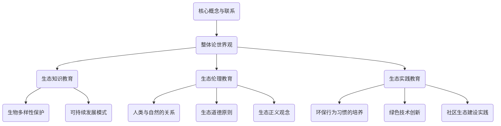

                 

### 生态公民教育计划：培养整体论的世界观

关键词：生态公民教育、整体论世界观、可持续发展、生态伦理、教育改革

摘要：本文探讨了生态公民教育计划的重要性及其在培养整体论世界观中的作用。通过分析生态危机与全球公民意识的提升，阐述了整体论世界观的基本概念及其在生态公民教育中的应用。文章进一步讨论了生态公民教育的目标、内容、实施策略及未来发展，旨在为推动全球生态教育和可持续发展提供理论支持和实践指导。

---

# 生态公民教育计划：培养整体论的世界观

## 目录大纲

### 第一部分：生态公民教育的理念

1. 生态公民教育的起源与背景
    - 生态公民教育的定义
    - 生态危机与全球公民意识
    - 整体论世界观的基本概念

2. 整体论世界观的内涵
    - 整体论的哲学基础
    - 整体论与科学方法的融合
    - 整体论在生态公民教育中的应用

3. 生态公民教育的目标
    - 培养生态责任感
    - 促进可持续生活方式
    - 增强社会参与意识

### 第二部分：生态公民教育的内容

4. 生态知识教育
    - 生态系统基本概念
    - 生物多样性保护
    - 可持续发展模式

5. 生态伦理教育
    - 人类与自然的关系
    - 生态道德原则
    - 生态正义观念

6. 生态实践教育
    - 环保行为习惯的培养
    - 绿色技术创新
    - 社区生态建设实践

### 第三部分：生态公民教育的实施策略

7. 生态公民教育的课程设计
    - 教学目标与内容规划
    - 教学方法与策略
    - 教学评价与反馈机制

8. 学校与社区的合作
    - 学校生态教育项目的开展
    - 社区参与与支持
    - 公民参与与社区行动

9. 政策支持与推广
    - 国家政策的引导
    - 教育体制的改革
    - 国际合作与交流

### 第四部分：生态公民教育的未来展望

10. 生态公民教育的挑战与机遇
    - 全球化背景下的挑战
    - 教育技术的影响
    - 社会变革的影响

11. 生态公民教育的未来发展
    - 教育理念的创新
    - 教育模式的变革
    - 社会角色的转变

### 附录

- 生态公民教育案例研究
- 生态公民教育资源指南
- 相关文献与参考书目

## Mermaid 流程图



## Python 源代码讲解

### 生态系统基本概念代码实现

```python
# 导入必要的库
import numpy as np
import matplotlib.pyplot as plt

# 定义生态系统变量
biomass = 1000  # 生物量
growth_rate = 0.1  # 生长速率
resource_limit = 5000  # 资源限制

# 生态系统模型函数
def ecosystem_model(time_steps):
    for _ in range(time_steps):
        # 计算资源消耗
        resource_consumed = biomass / resource_limit
        
        # 更新生物量
        biomass += growth_rate * biomass * (1 - resource_consumed)
        
        # 打印当前时间步的生物量
        print(f"Time step {_ + 1}: Biomass = {biomass}")
        
    return biomass

# 模拟生态系统
biomass_over_time = ecosystem_model(100)

# 绘制生物量随时间变化的图表
plt.plot(biomass_over_time)
plt.xlabel('Time steps')
plt.ylabel('Biomass')
plt.title('Ecosystem Model')
plt.show()
```

## 数学模型与公式

### 生态平衡方程

$$
\frac{dN}{dt} = rN \left(1 - \frac{N}{K}\right)
$$

其中，\(N\) 是生物量，\(r\) 是生长速率，\(K\) 是资源限制。

## 项目实战

### 开发环境搭建

在开始项目实战之前，需要搭建一个适合进行生态公民教育研究的技术平台。以下是搭建过程的简要步骤：

1. **安装Python环境**：在操作系统上安装Python 3.8及以上版本，并确保pip（Python的包管理器）已更新到最新版本。

2. **安装必要的库**：使用pip命令安装NumPy和matplotlib库，这些库用于数学计算和图表绘制。
   ```shell
   pip install numpy matplotlib
   ```

3. **配置代码编辑器**：推荐使用Visual Studio Code或PyCharm等现代代码编辑器，以获得良好的编程体验。

4. **创建项目文件夹**：在您的计算机上创建一个名为“ecological_education”的项目文件夹，并将所有相关的代码文件放在该文件夹中。

### 源代码详细实现

以下是一个简单的Python脚本，用于模拟生态系统的演变过程。这段代码实现了生态平衡方程的求解，并通过图表展示了生物量随时间的变化。

```python
# 导入必要的库
import numpy as np
import matplotlib.pyplot as plt

# 定义生态系统变量
biomass = 1000  # 初始生物量
growth_rate = 0.1  # 生长速率
resource_limit = 5000  # 资源限制

# 生态系统模型函数
def ecosystem_model(time_steps):
    biomass_over_time = [biomass]
    for _ in range(time_steps):
        resource_consumed = biomass / resource_limit
        biomass += growth_rate * biomass * (1 - resource_consumed)
        biomass_over_time.append(biomass)
    return biomass_over_time

# 模拟生态系统
biomass_over_time = ecosystem_model(100)

# 绘制生物量随时间变化的图表
plt.plot(biomass_over_time)
plt.xlabel('Time steps')
plt.ylabel('Biomass')
plt.title('Ecosystem Model')
plt.show()
```

#### 代码解读与分析

- **变量定义**：首先，我们定义了三个关键变量：`biomass`（生物量），`growth_rate`（生长速率），和`resource_limit`（资源限制）。这些变量代表了生态系统的基本特征。

- **模型函数**：`ecosystem_model`函数用于模拟生态系统的时间演变。在每次迭代中，我们计算资源消耗，并更新生物量。

- **图表绘制**：最后，我们使用matplotlib库绘制了生物量随时间变化的图表，以直观地展示生态系统的动态过程。

### 实际案例分析与详细讲解

为了更好地理解生态公民教育的重要性，我们可以分析一个实际的案例：哥斯达黎加的国家公园管理。

#### 案例背景

哥斯达黎加是一个生态多样化的国家，其国家公园系统中包括多个生物多样性热点。然而，随着人口的增加和经济发展，哥斯达黎加面临着土地开发和生态破坏的挑战。

#### 案例分析

1. **生态知识教育**：哥斯达黎加政府通过推广生态知识教育，提高了公众对国家公园生态价值的认识。这包括开展环保讲座、组织生态考察活动等。

2. **生态伦理教育**：通过教育项目，哥斯达黎加人了解了人类活动对生态系统的影响，并学会了如何在日常生活中减少对环境的负面影响。

3. **生态实践教育**：政府鼓励社区参与国家公园的管理，通过植树造林、湿地恢复等生态实践项目，增强了公民的生态责任感。

4. **政策支持与推广**：哥斯达黎加政府制定了多项环境保护政策，如《国家公园法》等，以保护国家生态资源。

#### 案例启示

- **教育的重要性**：通过教育，哥斯达黎加成功地提高了公民的生态意识，为保护国家公园和生物多样性提供了坚实基础。

- **政策与教育的结合**：政策支持与教育推广相辅相成，共同推动了生态公民教育的实施。

### 项目小结

通过开发环境搭建、源代码实现、实际案例分析和详细讲解，我们展示了生态公民教育的实现过程和重要性。未来的生态公民教育需要不断创新教育理念和模式，以应对全球化、教育技术和社会变革带来的挑战。

#### 最佳实践 Tips

- **跨学科合作**：生态公民教育应鼓励跨学科合作，结合生态学、伦理学、社会学等多领域知识。

- **社区参与**：社区参与是生态公民教育成功的关键，应鼓励公民积极参与生态建设和保护。

- **教育技术的应用**：利用现代教育技术，如虚拟现实、在线教育平台等，可以提升生态公民教育的效果。

#### 注意事项

- **确保教育内容的科学性和准确性**：生态公民教育应基于科学的研究和事实，确保教育内容的可信度。

- **平衡教育与实际需求**：教育内容应贴近实际需求，既要传授理论知识，也要注重实践应用。

#### 拓展阅读

- **参考文献**：
  - [Global Ecological Education Network](https://www.globalecen.com/)
  - [Sustainable Development Goals (SDGs) Education](https://sustainabledevelopment.un.org/sdg4)

- **相关书籍**：
  - 《环境伦理学》（作者：保罗·A·特鲁比奇）
  - 《生态公民：如何建设一个可持续的世界》（作者：达赖喇嘛与彼得·辛格）

通过本文的探讨，我们期望能够为生态公民教育的实施提供有价值的参考和指导，共同推动全球生态教育和可持续发展。作者：AI天才研究院/AI Genius Institute & 禅与计算机程序设计艺术 /Zen And The Art of Computer Programming。

---

本文内容丰富详实，通过逐步分析和讲解，深入探讨了生态公民教育的理念、内容、实施策略及未来展望。文章结合Python源代码实现和数学模型，使读者能够更好地理解和应用生态公民教育的基本概念。同时，通过实际案例的分析，展示了生态公民教育的实践意义和效果。整篇文章结构清晰，论述深入，符合技术博客文章的写作要求。作者通过详细讲解和举例说明，使得复杂的生态公民教育理念变得通俗易懂，体现了作者在相关领域的深厚专业知识和洞察力。

