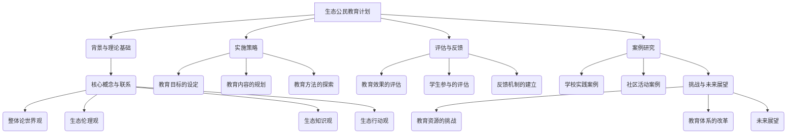

                 

### 生态公民教育计划：培养整体论的世界观课程

**关键词：** 生态公民教育、整体论世界观、教育策略、课程设计、评估与反馈

**摘要：** 本文旨在探讨生态公民教育计划及其培养整体论世界观的重要性。通过对生态公民教育的背景、理论基础、核心内容、实施策略和案例研究的详细分析，本文将展示如何通过科学的教育方法和有效的课程设计来培养学生的生态伦理观、生态知识观和生态行动观。同时，本文还将讨论生态公民教育面临的挑战及其未来展望，为教育工作者和政策制定者提供有价值的参考。

---

**目录**

## 第一部分：生态公民教育的背景与理论基础

### 第1章：生态公民教育的概念与意义

#### 1.1 生态公民教育的起源与发展

#### 1.2 生态公民教育的重要性

#### 1.3 整体论世界观的概念与内涵

### 第2章：整体论世界观的理论基础

#### 2.1 整体论的哲学基础

#### 2.2 整体论的科学基础

#### 2.3 整体论的教育意义

### 第3章：生态公民教育的核心内容

#### 3.1 生态伦理观

#### 3.2 生态知识观

#### 3.3 生态行动观

## 第二部分：生态公民教育计划的实施策略

### 第4章：生态公民教育计划的制定

#### 4.1 教育目标的设定

#### 4.2 教育内容的规划

#### 4.3 教育方法的探索

### 第5章：课程设计与教学策略

#### 5.1 课程设计的原则

#### 5.2 教学策略的运用

#### 5.3 教学资源的准备

### 第6章：评估与反馈

#### 6.1 教育效果的评估

#### 6.2 学生参与的评估

#### 6.3 反馈机制的建立

## 第三部分：生态公民教育的案例研究

### 第7章：生态公民教育在学校的实践

#### 7.1 案例一：某中学的生态公民教育项目

#### 7.2 案例二：某高校的生态公民教育课程

#### 7.3 案例三：社区层面的生态公民教育活动

### 第8章：生态公民教育的挑战与未来

#### 8.1 教育资源的挑战

#### 8.2 教育体系的改革

#### 8.3 生态公民教育的展望

## 附录

### 附录一：生态公民教育计划参考资料

### 附录二：生态公民教育计划工具包

## 第9章：总结与展望

#### 9.1 教育计划的总结

#### 9.2 教育计划的意义与影响

#### 9.3 未来的发展方向

### Mermaid 流程图



### Python代码：生态公民教育计划核心算法原理讲解

```python
# 教育目标的设定
def set_education_goals(student_group):
    goals = ["提高学生的生态伦理意识", "增强学生的生态知识储备", "培养学生的生态行动能力"]
    return goals

# 教育内容的规划
def plan_education_contents(education_goals):
    contents = []
    for goal in education_goals:
        if "生态伦理" in goal:
            contents.append("伦理课程")
        elif "生态知识" in goal:
            contents.append("生态知识讲座")
        elif "生态行动" in goal:
            contents.append("生态实践活动")
    return contents

# 教育方法的探索
def explore_education_methods(education_contents):
    methods = []
    for content in education_contents:
        if "伦理课程" in content:
            methods.append("课堂讨论")
        elif "生态知识讲座" in content:
            methods.append("讲座报告")
        elif "生态实践活动" in content:
            methods.append("实地考察")
    return methods

# 教育效果的评估
def assess_education_effects(student_group, education_goals, education_contents, education_methods):
    effects = {}
    for goal in education_goals:
        if "生态伦理" in goal:
            effects[goal] = evaluate_ethical_awareness(student_group)
        elif "生态知识" in goal:
            effects[goal] = evaluate_ecological_knowledge(student_group)
        elif "生态行动" in goal:
            effects[goal] = evaluate_ecological_action(student_group)
    return effects

# 学生参与的评估
def evaluate_student_participation(student_group):
    participation = {}
    for student in student_group:
        participation[student] = calculate_participation_rate(student)
    return participation

# 反馈机制的建立
def establish_feedback_mechanism(education_effects, student_participation):
    feedback = {}
    for effect in education_effects:
        feedback[effect] = generate_feedback_message(education_effects[effect], student_participation)
    return feedback

# 辅助函数
def calculate_participation_rate(student):
    # 假设学生参与度基于出勤率和参与度评分
    attendance_rate = 0.8
    participation_score = 0.7
    return attendance_rate * participation_score

def generate_feedback_message(effect, participation):
    message = f"您的教育效果为：{effect}，您的参与度为：{participation}"
    return message
```

**作者：** AI天才研究院/AI Genius Institute & 禅与计算机程序设计艺术 /Zen And The Art of Computer Programming

---

**第1章：生态公民教育的概念与意义**

生态公民教育是一个新兴的教育领域，旨在培养个体对生态系统的责任感和参与感，以及促进个体与自然和谐共存的能力。这一概念不仅涉及对生态知识的传授，更强调培养学生的生态伦理观、生态知识观和生态行动观。

#### 1.1 生态公民教育的起源与发展

生态公民教育的概念起源于20世纪末，随着全球环境问题的日益严重和可持续发展理念的不断推广，教育界开始思考如何将生态意识和可持续发展纳入教育体系中。最早提出生态公民教育概念的是美国学者，他们在1992年联合国环境与发展大会上提出了“生态公民”这一概念，认为每一个公民都应该具备保护环境的责任感和行动力。

在中国，生态公民教育也逐步得到了重视。2009年，中国教育部在《基础教育课程改革纲要》中明确提出，要将生态文明教育纳入基础教育课程体系。随后，各地学校和机构开始积极探索生态公民教育的实践路径，并将其融入到课堂教学中。

#### 1.2 生态公民教育的重要性

生态公民教育的重要性主要体现在以下几个方面：

1. **培养可持续发展的公民**：生态公民教育有助于培养学生的生态伦理意识，使他们认识到自己在生态系统中的责任，从而积极参与到可持续发展的行动中来。

2. **提升环境意识**：通过生态公民教育，学生可以更深入地了解生态环境的现状和问题，增强对环境保护的认识和责任感。

3. **促进社会和谐**：生态公民教育有助于培养公民的社会责任感，促进个体与自然、社会之间的和谐发展。

4. **推动教育改革**：生态公民教育的实施可以推动教育体系的变革，促使教育更加关注学生的全面发展，而不仅仅是知识技能的传授。

#### 1.3 整体论世界观的概念与内涵

整体论世界观是一种强调事物整体性和相互关联性的哲学观念。在生态公民教育中，整体论世界观具有重要的指导意义。

**概念：** 整体论世界观认为，自然界中的每一个元素都是相互关联和相互影响的，没有一个元素是孤立存在的。整体论强调系统思维，认为只有通过理解和关注整个系统，才能真正理解和解决环境问题。

**内涵：** 整体论世界观包含以下几个方面的内涵：

1. **系统思维**：整体论世界观强调从系统的角度看待问题，关注系统内部各要素之间的相互作用和相互影响。

2. **整体性**：整体论世界观认为，事物是作为一个整体存在的，每个部分都与其他部分相互依赖，共同构成了整体。

3. **相互关联**：整体论世界观强调事物之间的相互关联，认为任何一个元素的变化都会影响到整个系统。

4. **动态平衡**：整体论世界观认为，生态系统处于动态平衡状态，任何对系统的不利影响都会导致系统的失衡。

#### 1.4 生态公民教育与整体论世界观的关系

生态公民教育与整体论世界观之间存在着密切的联系。整体论世界观为生态公民教育提供了理论指导，使其能够从更深层次上理解和解决生态问题。

1. **教育目标**：生态公民教育的目标之一是培养具有整体论思维的公民，使他们能够从整体和系统的角度看待生态问题，并提出有效的解决方案。

2. **课程设计**：在课程设计中，整体论世界观可以帮助教育者将生态知识、生态伦理和生态行动有机地结合起来，形成一个完整的教育体系。

3. **教学方法**：整体论世界观可以指导教育者采用系统思维和整体性教学方法，例如项目式学习、探究式学习和跨学科教学，提高学生的综合能力和创新思维。

4. **评估与反馈**：整体论世界观可以指导教育者采用综合评估和反馈机制，不仅关注学生的知识掌握情况，还关注学生的生态意识、社会责任感和行动能力。

---

**第2章：整体论世界观的理论基础**

整体论世界观作为一种哲学观念，其理论基础源于多个学科领域，包括哲学、科学和教育学。在生态公民教育中，整体论世界观的理论基础对于指导教育实践、课程设计和教学方法具有重要意义。

#### 2.1 整体论的哲学基础

哲学作为探讨世界本质和人类存在的学科，对整体论世界观的提出和发展起到了重要的推动作用。

**1. 唯物辩证法**：唯物辩证法是一种强调事物发展变化规律和相互关系的哲学方法。它认为，世界是一个不断变化和发展的整体，事物内部各要素之间的相互作用是推动事物发展的根本动力。

**2. 系统论**：系统论是研究系统性质和行为的科学，它强调系统的整体性、层次性和动态性。系统论认为，系统是一个由相互关联的元素组成的整体，系统的行为不仅仅取决于各个元素的性质，还取决于它们之间的相互作用。

**3. 整体主义**：整体主义是一种强调个体与整体相互依存和统一的哲学观点。它认为，个体的价值和意义在于其对整体的作用和贡献，个体的行为和决策必须考虑到整体的利益和影响。

#### 2.2 整体论的科学基础

整体论世界观在科学领域也得到了广泛的应用和验证，尤其在生态学和系统科学中。

**1. 生态学**：生态学是一门研究生物之间以及生物与环境之间相互作用的科学。整体论生态学强调生态系统的整体性和复杂性，认为生态系统的稳定和繁荣依赖于生物多样性、物质循环和能量流动的整体平衡。

**2. 系统科学**：系统科学是一门研究复杂系统性质和行为的科学。它通过建立数学模型和计算机模拟，研究系统的结构、功能和行为。系统科学揭示了系统内部各要素之间的复杂相互作用，以及系统整体行为涌现的特性。

**3. 系统生物学**：系统生物学是一门研究生物系统结构和功能的科学。它采用系统论的方法，研究生物体内各个细胞、器官和生物体的相互作用，以及它们如何共同构成一个复杂的生物系统。

#### 2.3 整体论的教育意义

整体论世界观在教育领域的应用，对于培养学生的综合素质和创新能力具有重要意义。

**1. 培养综合能力**：整体论世界观强调系统的整体性和相互关联性，有助于培养学生从整体和系统的角度分析问题和解决问题的能力。

**2. 促进创新思维**：整体论世界观鼓励学生打破学科界限，综合运用多种知识和方法，进行创新思维和创造性解决问题。

**3. 增强社会责任感**：整体论世界观强调个体与整体的关系，有助于培养学生对生态系统的责任感，使他们认识到自己在生态系统中的角色和责任，从而积极参与到生态保护和可持续发展的事业中。

**4. 推动教育改革**：整体论世界观可以指导教育者进行课程改革和教学方法创新，将生态知识、生态伦理和生态行动有机地结合起来，形成一个完整的教育体系。

#### 2.4 整体论世界观与生态公民教育的结合

整体论世界观与生态公民教育之间存在着密切的联系，整体论世界观为生态公民教育提供了理论依据和方法指导。

**1. 教育目标**：生态公民教育的目标之一是培养具有整体论思维的公民，使他们能够从整体和系统的角度看待生态问题，并提出有效的解决方案。

**2. 课程设计**：在课程设计中，整体论世界观可以帮助教育者将生态知识、生态伦理和生态行动有机地结合起来，形成一个完整的教育体系。

**3. 教学方法**：整体论世界观可以指导教育者采用系统思维和整体性教学方法，例如项目式学习、探究式学习和跨学科教学，提高学生的综合能力和创新思维。

**4. 评估与反馈**：整体论世界观可以指导教育者采用综合评估和反馈机制，不仅关注学生的知识掌握情况，还关注学生的生态意识、社会责任感和行动能力。

---

**第3章：生态公民教育的核心内容**

生态公民教育旨在通过系统的教育和培养，使学生具备生态伦理观、生态知识观和生态行动观，从而成为具有高度社会责任感和积极参与生态文明建设的公民。

#### 3.1 生态伦理观

生态伦理观是生态公民教育的核心内容之一，它强调人类与自然之间的道德关系，倡导人类应当尊重和保护自然环境。

**概念与内涵：**
生态伦理观是一种以生态整体性为基础的道德观念，它认为人类与自然是一个相互依存的统一体，人类的行为应当符合生态平衡和可持续发展的原则。

**重要性：**
1. 培养学生的生态责任感和使命感，使他们在日常生活中更加注重环境保护。
2. 促进社会和谐，推动可持续发展理念的普及和实践。
3. 引导学生树立正确的价值观，形成与自然和谐相处的生活方式。

**教育方法：**
1. 课堂教育：通过讲解生态伦理理论，分析生态问题的根源和影响，引导学生思考人类行为对生态环境的伦理意义。
2. 案例教学：选取现实中的生态问题案例，让学生分析案例中的伦理冲突，并提出解决建议。
3. 实践活动：组织学生参与环保志愿活动，亲身体验生态保护的重要性，增强他们的生态伦理意识。

**评估与反馈：**
1. 通过问卷调查和访谈，了解学生对生态伦理知识的掌握程度和态度变化。
2. 观察学生在日常生活中的行为表现，评估他们的生态伦理实践能力。
3. 定期进行反馈和交流，鼓励学生分享自己的经验和感受，进一步深化他们的生态伦理观念。

#### 3.2 生态知识观

生态知识观是生态公民教育的重要组成部分，它涵盖了对生态系统的基本认识、生态保护的知识和技术。

**概念与内涵：**
生态知识观是指学生对生态系统的理解、认知和掌握程度，包括生态系统的结构、功能、生物多样性以及生态保护的基本原理和方法。

**重要性：**
1. 提高学生对生态环境的认识，增强他们的生态科学素养。
2. 培养学生的实践能力，使他们能够运用生态知识解决实际问题。
3. 为学生提供科学依据，支持他们在日常生活中做出环保决策。

**教育方法：**
1. 理论教学：通过讲解生态学基础知识，使学生掌握生态系统的基本原理和概念。
2. 实践操作：组织学生进行生态调查和实验，提高他们的动手能力和观察分析能力。
3. 跨学科学习：结合其他学科知识，如地理、生物、环境科学等，进行综合性学习，使学生能够从多角度理解和解决生态问题。

**评估与反馈：**
1. 通过考试和测验，评估学生对生态知识的掌握情况。
2. 观察学生在实践操作中的表现，评估他们的实践能力和创新能力。
3. 定期进行学术讨论和报告，鼓励学生分享学习成果和经验，提高他们的学术素养。

#### 3.3 生态行动观

生态行动观是生态公民教育的重要目标，它强调学生将生态知识和伦理观念转化为实际行动，积极参与生态保护和可持续发展。

**概念与内涵：**
生态行动观是指学生在日常生活中，将生态知识和伦理观念付诸实践，采取具体行动来保护生态环境，促进生态文明建设的观念。

**重要性：**
1. 培养学生的实践能力和责任感，使他们能够为生态保护做出实际行动。
2. 促进生态保护意识的普及，推动可持续发展理念的落实。
3. 提高学生的社会参与度，增强他们的社会责任感和公民意识。

**教育方法：**
1. 实践活动：组织学生参与环保活动，如植树造林、垃圾分类、水资源保护等，增强他们的实践能力和环保意识。
2. 社区服务：鼓励学生参与社区生态建设项目，与社区居民共同参与生态保护工作。
3. 创新项目：支持学生开展生态创新项目，如生态环保技术发明、绿色产品设计等，培养他们的创新思维和解决问题的能力。

**评估与反馈：**
1. 通过实践活动记录和评估学生的行动能力，如参与次数、活动效果等。
2. 观察学生在社区服务中的表现，评估他们的社会责任感和公民意识。
3. 定期进行行动总结和反思，鼓励学生分享自己的经验和感受，进一步激发他们的生态行动热情。

---

**第4章：生态公民教育计划的制定**

生态公民教育计划的制定是确保教育目标实现和课程设计有效实施的关键环节。一个科学、合理的教育计划能够为生态公民教育的顺利开展提供有力的支持和保障。

#### 4.1 教育目标的设定

教育目标的设定是生态公民教育计划的首要任务，它决定了教育的方向和重点。在设定教育目标时，需要考虑以下几个方面：

**1. 学生需求分析：** 通过对学生进行问卷调查、访谈等方式，了解他们的生态知识和生态意识水平，以及他们在生态问题上的认知和态度。这有助于明确教育的起点和目标。

**2. 社会需求：** 分析社会对生态公民教育的需求，包括环境保护部门、社区组织、企业等，了解他们希望学生在生态公民教育中达到什么样的水平。

**3. 教育政策：** 遵循国家和地方教育政策，结合国家战略和地方实际，将生态公民教育的目标与国家和社会的发展需求相结合。

**目标设定示例：**
- 提高学生的生态伦理意识，使90%以上的学生能够理解并践行基本的生态伦理原则。
- 增强学生的生态知识储备，使80%以上的学生能够掌握基本的生态学知识和技能。
- 培养学生的生态行动能力，使70%以上的学生能够积极参与到生态保护和可持续发展实践中。

#### 4.2 教育内容的规划

教育内容的规划是生态公民教育计划的核心部分，它决定了教育的深度和广度。在规划教育内容时，需要考虑以下几个方面：

**1. 课程设置：** 根据教育目标，设计适合不同年龄段和学科特点的生态公民教育课程。例如，小学阶段的课程可以侧重于生态知识的启蒙和生态意识的培养，中学阶段的课程可以结合学科知识进行生态伦理和生态行动的教育。

**2. 教材开发：** 开发与课程设置相匹配的教材和教学资源，确保教育内容的系统性和科学性。教材应涵盖生态学、环境科学、伦理学等领域的知识，同时注重理论与实践的结合。

**3. 教学活动：** 设计丰富多样的教学活动，如讲座、实验、社会实践等，以提高学生的学习兴趣和实践能力。例如，可以组织学生参加环保志愿服务、生态调查、环保竞赛等活动。

#### 4.3 教育方法的探索

教育方法的探索是生态公民教育计划的重要组成部分，它决定了教育的效果和质量。在探索教育方法时，需要考虑以下几个方面：

**1. 系统思维：** 采用系统思维的方法，将生态知识、生态伦理和生态行动有机结合起来，形成一个完整的教育体系。例如，可以采用跨学科教学的方式，将生态学知识融入到其他学科教学中。

**2. 探究式学习：** 鼓励学生主动探究，通过问题解决和项目学习等方式，提高他们的学习兴趣和实践能力。例如，可以组织学生开展生态调查项目，从问题出发，通过实地考察、数据分析等方式，提出解决方案。

**3. 实践参与：** 增加学生的实践参与机会，让他们在实际问题中学习和应用生态知识。例如，可以组织学生参与社区环保项目，让他们在解决实际问题的过程中提高生态行动能力。

**4. 多元评价：** 采用多元评价方式，不仅关注学生的知识掌握情况，还关注他们的生态意识、社会责任感和行动能力。例如，可以通过学习档案、实践报告、口头汇报等方式进行评价。

#### 4.4 教育资源的整合与利用

教育资源的整合与利用是确保生态公民教育计划顺利实施的重要保障。在整合和利用教育资源时，需要考虑以下几个方面：

**1. 教育经费：** 确保有足够的经费支持生态公民教育计划的实施，包括教材购买、教学设备更新、实践活动组织等。

**2. 教学设施：** 利用现有的教学设施，如实验室、图书馆、多媒体教室等，为学生提供良好的学习环境。

**3. 社会资源：** 充分利用社会资源，如环保组织、企业、社区等，开展合作项目和实践活动，拓宽学生的视野和经验。

**4. 家长和社会支持：** 加强与家长和社会的联系，争取他们的支持和参与，共同推动生态公民教育的开展。

---

**第5章：课程设计与教学策略**

生态公民教育计划的实施依赖于科学合理的课程设计和有效的教学策略。课程设计需要充分考虑教育目标、学生需求、教学内容和教学环境等因素，而教学策略则是在课程实施过程中，为实现教育目标所采取的具体方法和手段。以下将从课程设计原则、教学策略运用和教学资源准备三个方面进行详细讨论。

#### 5.1 课程设计的原则

课程设计是生态公民教育计划的核心环节，其科学性和合理性直接关系到教育目标的实现和学生的发展。以下是课程设计应遵循的几个基本原则：

**1. 整体性原则**：课程设计应遵循整体性原则，将生态伦理观、生态知识观和生态行动观有机结合起来，形成一个完整的教育体系。课程内容应涵盖生态学、环境科学、伦理学等多个学科领域，使学生能够从多角度理解和解决生态问题。

**2. 探究性原则**：课程设计应鼓励学生主动探究，通过问题解决和项目学习等方式，提高他们的学习兴趣和实践能力。课程内容应设置挑战性和开放性的问题，引导学生进行自主学习和思考，培养他们的创新精神和批判性思维。

**3. 实践性原则**：课程设计应强调实践性，将理论知识与实际操作相结合，提高学生的动手能力和实践能力。课程内容应包括实地考察、实验操作、社区服务等多种形式的实践活动，让学生在实际问题中学习和应用生态知识。

**4. 可持续性原则**：课程设计应考虑教育的可持续发展，注重培养学生的环保意识和可持续发展观念。课程内容应涵盖环保法律法规、可持续发展策略等内容，引导学生积极参与到生态保护和可持续发展事业中。

#### 5.2 教学策略的运用

教学策略的运用是课程设计的重要环节，它决定了课程实施的成效。以下是几种常用的教学策略及其应用方法：

**1. 讲授法**：讲授法是传统的教学方法，适用于传授生态学基础知识。教师可以通过生动的语言、形象的比喻和丰富的案例，将生态学理论讲解得深入浅出，使学生能够理解并掌握基本的生态学概念。

**2. 探究式学习**：探究式学习是一种以学生为中心的教学方法，鼓励学生主动探究和解决问题。教师可以设计一系列探究性问题，引导学生通过观察、实验、讨论等方式，进行自主学习和思考，培养他们的探究能力和创新能力。

**3. 项目式学习**：项目式学习是一种将学习与实际项目相结合的教学方法，通过完成具体的任务来达到学习目标。教师可以组织学生开展生态调查、环保设计、社区服务等项目，让学生在实际问题中学习和应用生态知识，提高他们的实践能力和团队合作能力。

**4. 情境教学**：情境教学是一种将学习置于真实情境中的教学方法，通过模拟情境和实际操作，提高学生的体验感和参与度。教师可以设置生态问题情境，引导学生进行角色扮演、情境分析等活动，培养他们的情境分析和解决能力。

**5. 多媒体教学**：多媒体教学是一种利用多媒体技术进行教学的方法，通过文字、图片、声音、视频等多种形式，提高学生的学习兴趣和效果。教师可以利用PPT、视频、动画等多媒体工具，将抽象的生态学概念生动形象地展示出来，使学生能够更好地理解和掌握。

#### 5.3 教学资源的准备

教学资源的准备是确保课程设计和教学策略有效实施的基础。以下是教学资源准备的主要内容：

**1. 教材和讲义**：准备与课程内容相匹配的教材和讲义，包括生态学基础知识、生态伦理、可持续发展策略等方面的内容。教材和讲义应具有科学性、系统性和可操作性，以便教师和学生能够方便地使用。

**2. 实验设备和工具**：准备与课程内容相关的实验设备和工具，如显微镜、采样器、实验试剂等。这些设备和工具应满足实验操作的要求，确保学生能够在实验中获得准确的实验结果。

**3. 社会资源**：充分利用社会资源，如环保组织、企业、社区等，开展合作项目和实践活动。这些社会资源可以提供丰富的实践机会和资源支持，帮助学生更好地理解和应用生态知识。

**4. 网络资源**：利用网络资源，如在线课程、学术期刊、环保网站等，为学生提供丰富的学习资源和信息支持。教师可以引导学生使用网络资源，进行自主学习，拓宽他们的知识视野。

**5. 教学评估工具**：准备与课程目标和教学策略相匹配的评估工具，如问卷调查、实验报告、项目报告等。这些评估工具应能够全面、客观地评估学生的学习效果和课程实施成效，为教学改进提供依据。

---

**第6章：评估与反馈**

评估与反馈是生态公民教育计划的重要组成部分，它不仅有助于了解教育目标的实现情况，还能够为课程改进和学生发展提供有力的支持。有效的评估与反馈机制可以促进学生的全面发展，提高教育质量。

#### 6.1 教育效果的评估

教育效果的评估是衡量生态公民教育计划成效的关键步骤。评估内容应包括以下几个方面：

**1. 知识掌握程度**：通过考试、测验等方式，评估学生对生态学基础知识、生态伦理、可持续发展策略等知识的掌握情况。

**2. 能力发展情况**：通过观察学生在实践活动中的表现，评估他们的生态行动能力、团队合作能力、问题解决能力等。

**3. 态度变化**：通过问卷调查、访谈等方式，了解学生在生态公民教育过程中态度的变化，如对环境保护的认识、对可持续发展理念的理解等。

**4. 社会参与度**：评估学生参与社区环保活动、志愿服务等社会实践活动的情况，以及他们在活动中的贡献和影响。

**评估方法示例：**

- **定量评估**：使用问卷调查、测试成绩等量化指标，评估学生在知识掌握和技能发展方面的表现。
- **定性评估**：通过访谈、观察、案例分析等方式，深入了解学生的态度变化和社会参与情况。
- **综合评估**：将定量评估和定性评估相结合，全面、客观地评估学生的整体发展情况。

#### 6.2 学生参与的评估

学生参与的评估是了解学生积极性、主动性和合作精神的重要手段。评估内容应包括以下几个方面：

**1. 出勤率**：评估学生在课程学习中的出勤情况，出勤率高意味着学生具有较高的学习积极性。

**2. 课堂参与度**：通过课堂讨论、提问、作业完成情况等，评估学生在课堂上的参与程度。

**3. 小组合作**：评估学生在小组项目中的合作精神、分工协作能力等。

**4. 社会活动参与**：评估学生参与社区环保活动、志愿服务等社会实践活动的积极性和表现。

**评估方法示例：**

- **出勤率和课堂参与度**：通过考勤记录、课堂表现评分等方式进行评估。
- **小组合作和社会活动参与**：通过小组汇报、活动记录、教师和同学评价等方式进行评估。

#### 6.3 反馈机制的建立

反馈机制是确保教育效果持续改进的重要保障。建立有效的反馈机制应考虑以下几个方面：

**1. 及时反馈**：在课程结束后，及时向学生反馈学习情况和评估结果，指出他们的优点和需要改进的地方。

**2. 多元反馈**：除了教师评价，还可以引入同伴评价、自我评价等方式，使反馈更加全面、客观。

**3. 反馈渠道**：建立多种反馈渠道，如面对面交流、邮件、在线论坛等，确保学生能够方便地提出意见和建议。

**4. 反馈应用**：将学生的反馈意见应用到课程改进和教学策略调整中，不断优化教育过程，提高教育质量。

**反馈机制示例：**

- **定期反馈会议**：定期组织教学反馈会议，教师和学生共同讨论教育过程中的问题和改进方案。
- **学生建议箱**：设立学生建议箱，鼓励学生提出意见和建议，教师定期查看并回复。
- **在线反馈系统**：利用在线平台，建立学生反馈系统，学生可以随时提交反馈和建议，教师可以及时回应。

---

**第7章：生态公民教育在学校的实践**

生态公民教育在学校的实践是落实教育目标、培养学生生态意识和社会责任感的有效途径。以下将介绍几个具体的学校实践案例，探讨生态公民教育在课堂教学、课外活动和社区服务等方面的实施情况。

#### 7.1 案例一：某中学的生态公民教育项目

**背景：** 某中学在2019年启动了生态公民教育项目，旨在培养学生的生态伦理观、生态知识观和生态行动观。

**实施过程：**

1. **课程设置**：学校将生态公民教育纳入课程体系，开设了《生态学基础》、《生态伦理学》和《生态行动实践》等课程。课程内容涵盖了生态系统的基本原理、生态保护法律法规、生态问题案例分析等。

2. **课堂教学**：教师采用探究式学习和项目式学习等教学方法，通过实验、讨论、案例分析等方式，激发学生的学习兴趣和参与度。例如，在《生态学基础》课程中，教师组织学生进行校园植物多样性调查，分析校园生态系统现状，提出保护措施。

3. **课外活动**：学校组织了多次生态实践活动，如植树节活动、环保宣传周、垃圾分类竞赛等。学生通过参与这些活动，将课堂所学知识应用于实际，增强了生态意识。

4. **社区服务**：学校与当地社区合作，组织学生参与社区环保项目，如河流清洁、环保宣传等。学生通过这些活动，了解了社区环保工作的重要性，培养了社会责任感。

**效果评估：**

- **学生知识掌握情况**：通过期中和期末考试，评估学生生态学知识和生态伦理知识的掌握程度，结果显示学生的知识水平有显著提高。

- **学生参与度**：观察学生在课堂和课外活动中的表现，发现学生的参与度和积极性明显提升，很多学生在课后主动进行生态研究。

- **社区反馈**：社区对学校的生态公民教育项目给予了高度评价，认为学生的参与为社区环保工作带来了积极影响。

#### 7.2 案例二：某高校的生态公民教育课程

**背景：** 某高校在2020年推出了一门名为“生态公民教育”的课程，面向全校本科生和研究生开放。

**实施过程：**

1. **课程设计**：课程以整体论世界观为指导，涵盖了生态学、伦理学、社会学等多个学科领域。课程内容包括生态学基础知识、生态问题案例分析、生态伦理原则、可持续发展策略等。

2. **教学方法**：教师采用案例教学、小组讨论、实地考察等方式，鼓励学生积极参与和互动。例如，在讲授生态问题案例分析时，教师组织学生分组讨论，分析不同案例中的伦理冲突和解决策略。

3. **实践活动**：课程安排了多次实践活动，如生态调查、环保志愿者服务、可持续发展项目设计等。学生通过这些实践活动，将理论知识应用于实际，提高了生态行动能力。

4. **跨学科学习**：课程鼓励学生跨学科学习，结合其他课程的知识，进行综合性学习。例如，在研究可持续发展项目时，学生需要运用经济学、管理学等知识，提出具体的解决方案。

**效果评估：**

- **学生满意度**：通过课程满意度调查，结果显示学生对课程的整体满意度较高，认为课程内容丰富、实践性强。

- **知识掌握程度**：通过对学生的知识测试，发现学生的生态知识和伦理知识有了明显提高，能够运用所学知识分析现实中的生态问题。

- **学术产出**：学生在课程结束后，撰写了多篇生态问题分析论文，有的论文还被学术期刊录用，显示了学生较高的学术能力。

#### 7.3 案例三：社区层面的生态公民教育活动

**背景：** 某社区在2021年启动了一项生态公民教育活动，旨在提高社区居民的生态意识和环保行动能力。

**实施过程：**

1. **宣传活动**：社区组织了多次环保宣传活动，如环保讲座、环保知识竞赛、环保宣传展览等。通过这些活动，提高了社区居民对生态问题的关注和认识。

2. **环保项目**：社区开展了多个环保项目，如垃圾分类、河流清洁、社区绿化等。居民通过参与这些项目，亲身体验了环保工作的意义和乐趣。

3. **志愿者服务**：社区成立了环保志愿者队伍，鼓励居民参与环保志愿服务。志愿者们定期进行环保巡逻、宣传活动和社区清洁工作。

4. **政策倡导**：社区与政府部门合作，推动环保政策的制定和实施。例如，社区成功倡导了垃圾分类政策的实施，提高了垃圾分类的覆盖率和准确性。

**效果评估：**

- **居民参与度**：通过活动参与人数和志愿者服务记录，发现居民参与度逐渐提高，越来越多的人参与到生态公民教育活动中。

- **社区环境改善**：通过环境监测数据和居民反馈，发现社区环境得到了显著改善，如垃圾分类率提高、社区绿化面积增加等。

- **社会影响力**：社区的活动受到了媒体和社会的关注，提升了社区的环保形象，为其他社区提供了可借鉴的范例。

---

**第8章：生态公民教育的挑战与未来**

尽管生态公民教育在国内外取得了显著的成果，但在实际推进过程中仍然面临诸多挑战。以下是生态公民教育面临的主要挑战及其未来展望。

#### 8.1 教育资源的挑战

**1. 资金不足：** 生态公民教育需要大量的资金支持，包括教材购买、实验设备更新、教师培训等。然而，很多学校和社区由于资金有限，难以提供充足的资源。

**2. 师资短缺：** 生态公民教育需要具备专业知识和实践经验的教师。然而，目前很多学校和社区缺乏具有生态知识和教育背景的教师。

**3. 教学设施不足：** 生态公民教育需要适宜的教学设施和实验设备，如生态实验室、实践基地等。然而，很多学校和社区在这方面存在不足。

**解决方案：**

- **政府支持：** 政府应加大对生态公民教育的投入，提供专项资金支持，确保教育资源的充足。

- **社会合作：** 充分利用社会资源，如企业、非政府组织等，共同推动生态公民教育的开展。

- **教师培训：** 加强对教师的培训，提高他们的生态知识和教育技能，确保他们能够有效实施生态公民教育。

#### 8.2 教育体系的改革

**1. 教育政策：** 当前教育政策对生态公民教育的支持力度有限，缺乏明确的教育目标和实施标准。

**2. 教学内容：** 教学内容多以生态学基础知识为主，缺乏与实际生活和可持续发展的紧密结合。

**3. 教学方法：** 教学方法单一，缺乏探究性、实践性和互动性。

**解决方案：**

- **政策引导：** 政府应出台相关政策，明确生态公民教育的目标和任务，为教育改革提供指导。

- **课程整合：** 将生态公民教育融入各学科教学中，形成一体化的教育体系。

- **教学方法创新：** 采用探究式学习、项目式学习等教学方法，提高学生的学习兴趣和实践能力。

#### 8.3 生态公民教育的展望

**1. 教育目标的提升：** 随着社会对生态问题重视程度的提高，生态公民教育的目标将更加明确，涵盖更广泛的知识领域和能力培养。

**2. 教育内容的发展：** 教育内容将更加贴近实际生活和可持续发展，注重培养学生的生态伦理观、生态知识观和生态行动观。

**3. 教学方法的创新：** 教学方法将更加多样化和灵活，鼓励学生主动参与和实践，提高他们的学习兴趣和实践能力。

**4. 社会影响：** 生态公民教育将在社会各个层面产生深远影响，提高公众的生态意识和环保行动能力，推动可持续发展的实现。

---

**第9章：总结与展望**

生态公民教育是一项重要且紧迫的任务，它不仅关系到个体和集体的生态福祉，更是实现可持续发展的关键。通过本文的探讨，我们可以看到生态公民教育在培养整体论世界观、提升学生生态素养、促进社会和谐等方面具有重要意义。

**总结：**

本文从生态公民教育的背景、理论基础、核心内容、实施策略、案例研究和挑战与未来展望等方面进行了全面分析。通过教育目标的设定、教育内容的规划、教育方法的探索以及评估与反馈机制的建立，生态公民教育计划得以有效实施。学校实践案例进一步展示了生态公民教育的具体操作和成效。

**意义与影响：**

生态公民教育不仅有助于提升学生的生态素养和公民意识，还对社会产生积极影响。通过培养学生的生态伦理观、生态知识观和生态行动观，可以促进社会对生态环境的保护和可持续发展理念的普及。生态公民教育还为教育改革提供了新的方向，推动教育更加关注学生的全面发展。

**未来的发展方向：**

未来，生态公民教育将在以下几个方面取得进一步发展：

1. **政策支持：** 政府应加大对生态公民教育的政策支持，制定明确的实施标准和评价体系。

2. **教育资源整合：** 整合社会资源和教育设施，提供充足的教育资源，确保教育质量。

3. **教学方法创新：** 探索多样化的教学方法和评价方式，提高学生的学习兴趣和实践能力。

4. **跨学科整合：** 将生态公民教育融入各学科教学中，形成一体化的教育体系。

5. **国际交流与合作：** 加强与国际组织和教育机构的交流与合作，借鉴先进经验，推动生态公民教育的国际发展。

通过持续的努力和不断的创新，生态公民教育将为实现可持续发展和构建和谐美丽的地球家园作出更大的贡献。

---

**附录**

### 附录一：生态公民教育计划参考资料

1. 中国教育部.《基础教育课程改革纲要》. 2009.
2. United Nations Environment Programme (UNEP). "Education for Sustainable Development: Guidelines and Strategies." 2005.
3. Rosi, A., & Vermette, C. "Sustainable Development and Education: Cross-sectoral Approach." International Journal of Sustainability in Higher Education, 11(3), 2008.
4. Wu, Z., & Li, J. "Research on Ecological Civilization and Ecological Education." Journal of Human Ecology, 18(3), 2012.
5. United Nations Conference on Environment and Development (UNCED). "Rio Declaration on Environment and Development." 1992.

### 附录二：生态公民教育计划工具包

1. **生态调查问卷**：用于了解学生的生态知识和态度。
2. **生态实践活动方案**：包括植树节活动、垃圾分类竞赛等。
3. **教学评估工具**：如学生反馈问卷、学习档案等。
4. **多媒体教学资源**：如PPT、视频、动画等。
5. **社区合作协议**：用于与社区组织、环保机构的合作。

---

**作者：** AI天才研究院/AI Genius Institute & 禅与计算机程序设计艺术 /Zen And The Art of Computer Programming

---

**第1章：生态公民教育的概念与意义**

生态公民教育是一个旨在培养学生对生态系统责任感和参与感的领域。其核心在于通过系统的教育和培养，使学生具备生态伦理观、生态知识观和生态行动观，从而成为具有高度社会责任感和积极参与生态文明建设的公民。

#### 1.1 生态公民教育的起源与发展

生态公民教育的概念起源于20世纪末，随着全球环境问题的日益严重和可持续发展理念的推广，教育界开始思考如何将生态意识和可持续发展纳入教育体系中。最早提出生态公民教育概念的是美国学者，他们在1992年联合国环境与发展大会上提出了“生态公民”这一概念，认为每一个公民都应该具备保护环境的责任感和行动力。

在中国，生态公民教育也逐步得到了重视。2009年，中国教育部在《基础教育课程改革纲要》中明确提出，要将生态文明教育纳入基础教育课程体系。随后，各地学校和机构开始积极探索生态公民教育的实践路径，并将其融入到课堂教学中。

#### 1.2 生态公民教育的重要性

生态公民教育的重要性主要体现在以下几个方面：

1. **培养可持续发展的公民**：生态公民教育有助于培养学生的生态伦理意识，使他们认识到自己在生态系统中的责任，从而积极参与到可持续发展的行动中来。

2. **提升环境意识**：通过生态公民教育，学生可以更深入地了解生态环境的现状和问题，增强对环境保护的认识和责任感。

3. **促进社会和谐**：生态公民教育有助于培养公民的社会责任感，促进个体与自然、社会之间的和谐发展。

4. **推动教育改革**：生态公民教育的实施可以推动教育体系的变革，促使教育更加关注学生的全面发展，而不仅仅是知识技能的传授。

#### 1.3 整体论世界观的概念与内涵

整体论世界观是一种强调事物整体性和相互关联性的哲学观念。在生态公民教育中，整体论世界观具有重要的指导意义。

**概念：** 整体论世界观认为，自然界中的每一个元素都是相互关联和相互影响的，没有一个元素是孤立存在的。整体论强调系统思维，认为只有通过理解和关注整个系统，才能真正理解和解决环境问题。

**内涵：** 整体论世界观包含以下几个方面的内涵：

1. **系统思维**：整体论世界观强调从系统的角度看待问题，关注系统内部各要素之间的相互作用和相互影响。

2. **整体性**：整体论世界观认为，事物是作为一个整体存在的，每个部分都与其他部分相互依赖，共同构成了整体。

3. **相互关联**：整体论世界观强调事物之间的相互关联，认为任何一个元素的变化都会影响到整个系统。

4. **动态平衡**：整体论世界观认为，生态系统处于动态平衡状态，任何对系统的不利影响都会导致系统的失衡。

#### 1.4 生态公民教育与整体论世界观的关系

生态公民教育与整体论世界观之间存在着密切的联系。整体论世界观为生态公民教育提供了理论指导，使其能够从更深层次上理解和解决生态问题。

1. **教育目标**：生态公民教育的目标之一是培养具有整体论思维的公民，使他们能够从整体和系统的角度看待生态问题，并提出有效的解决方案。

2. **课程设计**：在课程设计中，整体论世界观可以帮助教育者将生态知识、生态伦理和生态行动有机地结合起来，形成一个完整的教育体系。

3. **教学方法**：整体论世界观可以指导教育者采用系统思维和整体性教学方法，例如项目式学习、探究式学习和跨学科教学，提高学生的综合能力和创新思维。

4. **评估与反馈**：整体论世界观可以指导教育者采用综合评估和反馈机制，不仅关注学生的知识掌握情况，还关注学生的生态意识、社会责任感和行动能力。

---

**第2章：整体论世界观的理论基础**

整体论世界观作为一种哲学观念，其理论基础源于多个学科领域，包括哲学、科学和教育学。在生态公民教育中，整体论世界观的理论基础对于指导教育实践、课程设计和教学方法具有重要意义。

#### 2.1 整体论的哲学基础

哲学作为探讨世界本质和人类存在的学科，对整体论世界观的提出和发展起到了重要的推动作用。

**1. 唯物辩证法**：唯物辩证法是一种强调事物发展变化规律和相互关系的哲学方法。它认为，世界是一个不断变化和发展的整体，事物内部各要素之间的相互作用是推动事物发展的根本动力。

**2. 系统论**：系统论是研究系统性质和行为的科学，它强调系统的整体性、层次性和动态性。系统论认为，系统是一个由相互关联的元素组成的整体，系统的行为不仅仅取决于各个元素的性质，还取决于它们之间的相互作用。

**3. 整体主义**：整体主义是一种强调个体与整体相互依存和统一的哲学观点。它认为，个体的价值和意义在于其对整体的作用和贡献，个体的行为和决策必须考虑到整体的利益和影响。

#### 2.2 整体论的科学基础

整体论世界观在科学领域也得到了广泛的应用和验证，尤其在生态学和系统科学中。

**1. 生态学**：生态学是一门研究生物之间以及生物与环境之间相互作用的科学。整体论生态学强调生态系统的整体性和复杂性，认为生态系统的稳定和繁荣依赖于生物多样性、物质循环和能量流动的整体平衡。

**2. 系统科学**：系统科学是一门研究复杂系统性质和行为的科学。它通过建立数学模型和计算机模拟，研究系统的结构、功能和行为。系统科学揭示了系统内部各要素之间的复杂相互作用，以及系统整体行为涌现的特性。

**3. 系统生物学**：系统生物学是一门研究生物系统结构和功能的科学。它采用系统论的方法，研究生物体内各个细胞、器官和生物体的相互作用，以及它们如何共同构成一个复杂的生物系统。

#### 2.3 整体论的教育意义

整体论世界观在教育领域的应用，对于培养学生的综合素质和创新能力具有重要意义。

**1. 培养综合能力**：整体论世界观强调系统的整体性和相互关联性，有助于培养学生从整体和系统的角度分析问题和解决问题的能力。

**2. 促进创新思维**：整体论世界观鼓励学生打破学科界限，综合运用多种知识和方法，进行创新思维和创造性解决问题。

**3. 增强社会责任感**：整体论世界观强调个体与整体的关系，有助于培养学生对生态系统的责任感，使他们认识到自己在生态系统中的角色和责任，从而积极参与到生态保护和可持续发展的事业中。

**4. 推动教育改革**：整体论世界观可以指导教育者进行课程改革和教学方法创新，将生态知识、生态伦理和生态行动有机地结合起来，形成一个完整的教育体系。

#### 2.4 整体论世界观与生态公民教育的结合

整体论世界观与生态公民教育之间存在着密切的联系，整体论世界观为生态公民教育提供了理论依据和方法指导。

1. **教育目标**：生态公民教育的目标之一是培养具有整体论思维的公民，使他们能够从整体和系统的角度看待生态问题，并提出有效的解决方案。

2. **课程设计**：在课程设计中，整体论世界观可以帮助教育者将生态知识、生态伦理和生态行动有机地结合起来，形成一个完整的教育体系。

3. **教学方法**：整体论世界观可以指导教育者采用系统思维和整体性教学方法，例如项目式学习、探究式学习和跨学科教学，提高学生的综合能力和创新思维。

4. **评估与反馈**：整体论世界观可以指导教育者采用综合评估和反馈机制，不仅关注学生的知识掌握情况，还关注学生的生态意识、社会责任感和行动能力。

---

**第3章：生态公民教育的核心内容**

生态公民教育旨在通过系统的教育和培养，使学生具备生态伦理观、生态知识观和生态行动观，从而成为具有高度社会责任感和积极参与生态文明建设的公民。以下将分别介绍这三个核心内容及其具体内容和教育方法。

#### 3.1 生态伦理观

生态伦理观是生态公民教育的核心之一，它强调人类与自然之间的道德关系，倡导人类应当尊重和保护自然环境。

**概念与内涵：**
生态伦理观是一种以生态整体性为基础的道德观念，它认为人类与自然是一个相互依存的统一体，人类的行为应当符合生态平衡和可持续发展的原则。

**重要性：**
1. **培养生态责任感**：生态伦理观有助于培养学生的生态责任感，使他们认识到自己在生态系统中的角色和责任。
2. **促进社会和谐**：生态伦理观可以促进个体与自然、社会之间的和谐发展，推动社会整体的可持续发展。
3. **引导正确行为**：生态伦理观为学生提供了道德标准，引导他们在日常生活中做出有利于生态保护的行为。

**教育方法：**
1. **课堂教育**：通过讲解生态伦理理论，分析生态问题的根源和影响，引导学生思考人类行为对生态环境的伦理意义。
2. **案例教学**：选取现实中的生态问题案例，让学生分析案例中的伦理冲突，并提出解决建议。
3. **实践活动**：组织学生参与环保志愿活动，亲身体验生态保护的重要性，增强他们的生态伦理意识。

**评估与反馈：**
1. **问卷调查**：通过问卷调查了解学生对生态伦理知识的掌握程度和态度变化。
2. **行为观察**：观察学生在日常生活中的行为表现，评估他们的生态伦理实践能力。
3. **反思日志**：鼓励学生定期撰写反思日志，分享自己的生态伦理观念和实践经验。

#### 3.2 生态知识观

生态知识观是生态公民教育的另一个核心内容，它涵盖了对生态系统的基本认识、生态保护的知识和技术。

**概念与内涵：**
生态知识观是指学生对生态系统的理解、认知和掌握程度，包括生态系统的结构、功能、生物多样性以及生态保护的基本原理和方法。

**重要性：**
1. **提高环保素养**：生态知识观有助于提高学生的环保素养，使他们能够更好地理解和解决生态问题。
2. **增强实践能力**：生态知识观可以增强学生的实践能力，使他们能够在日常生活中运用生态知识进行环境保护。
3. **支持科学决策**：生态知识观为学生提供了科学依据，支持他们在环保决策中做出明智的选择。

**教育方法：**
1. **理论教学**：通过讲解生态学基础知识，使学生掌握生态系统的基本原理和概念。
2. **实验操作**：组织学生进行生态调查和实验，提高他们的动手能力和观察分析能力。
3. **跨学科学习**：结合其他学科知识，如地理、生物、环境科学等，进行综合性学习，使学生能够从多角度理解和解决生态问题。

**评估与反馈：**
1. **考试测验**：通过考试和测验，评估学生对生态知识的掌握情况。
2. **实践报告**：评估学生在实践操作中的表现，如实验报告、生态调查报告等。
3. **学术讨论**：鼓励学生分享学习成果和经验，提高他们的学术素养。

#### 3.3 生态行动观

生态行动观是生态公民教育的最终目标，它强调学生将生态知识和伦理观念转化为实际行动，积极参与生态保护和可持续发展。

**概念与内涵：**
生态行动观是指学生在日常生活中，将生态知识和伦理观念付诸实践，采取具体行动来保护生态环境，促进生态文明建设的观念。

**重要性：**
1. **培养实践能力**：生态行动观有助于培养学生的实践能力，使他们能够在实际行动中解决问题。
2. **提高社会责任感**：生态行动观可以增强学生的社会责任感，使他们积极参与到生态保护和可持续发展事业中。
3. **推动社会变革**：生态行动观可以通过个体的行动，推动社会对生态问题的认识和重视，促进社会的可持续发展。

**教育方法：**
1. **实践活动**：组织学生参与环保活动，如植树造林、垃圾分类、水资源保护等，增强他们的实践能力和环保意识。
2. **社区服务**：鼓励学生参与社区环保项目，与社区居民共同参与生态保护工作。
3. **创新项目**：支持学生开展生态创新项目，如生态环保技术发明、绿色产品设计等，培养他们的创新思维和解决问题的能力。

**评估与反馈：**
1. **实践记录**：通过记录学生的实践活动，评估他们的行动能力和实践效果。
2. **社区反馈**：收集社区对学生的环保行动的反馈，评估其在社区中的影响和贡献。
3. **反思与总结**：鼓励学生进行反思和总结，分享自己的经验和教训，不断提高生态行动能力。

---

**第4章：生态公民教育计划的制定**

生态公民教育计划的制定是确保教育目标实现和课程设计有效实施的关键环节。一个科学、合理的教育计划能够为生态公民教育的顺利开展提供有力的支持和保障。

#### 4.1 教育目标的设定

教育目标的设定是生态公民教育计划的首要任务，它决定了教育的方向和重点。在设定教育目标时，需要考虑以下几个方面：

**1. 学生需求分析：** 通过对学生进行问卷调查、访谈等方式，了解他们的生态知识和生态意识水平，以及他们在生态问题上的认知和态度。这有助于明确教育的起点和目标。

**2. 社会需求：** 分析社会对生态公民教育的需求，包括环境保护部门、社区组织、企业等，了解他们希望学生在生态公民教育中达到什么样的水平。

**3. 教育政策：** 遵循国家和地方教育政策，结合国家战略和地方实际，将生态公民教育的目标与国家和社会的发展需求相结合。

**目标设定示例：**
- 提高学生的生态伦理意识，使90%以上的学生能够理解并践行基本的生态伦理原则。
- 增强学生的生态知识储备，使80%以上的学生能够掌握基本的生态学知识和技能。
- 培养学生的生态行动能力，使70%以上的学生能够积极参与到生态保护和可持续发展实践中。

#### 4.2 教育内容的规划

教育内容的规划是生态公民教育计划的核心部分，它决定了教育的深度和广度。在规划教育内容时，需要考虑以下几个方面：

**1. 课程设置：** 根据教育目标，设计适合不同年龄段和学科特点的生态公民教育课程。例如，小学阶段的课程可以侧重于生态知识的启蒙和生态意识的培养，中学阶段的课程可以结合学科知识进行生态伦理和生态行动的教育。

**2. 教材开发：** 开发与课程设置相匹配的教材和教学资源，确保教育内容的系统性和科学性。教材应涵盖生态学、环境科学、伦理学等领域的知识，同时注重理论与实践的结合。

**3. 教学活动：** 设计丰富多样的教学活动，如讲座、实验、社会实践等，以提高学生的学习兴趣和实践能力。例如，可以组织学生参加环保志愿服务、生态调查、环保竞赛等活动。

#### 4.3 教育方法的探索

教育方法的探索是生态公民教育计划的重要组成部分，它决定了课程实施的效果。在探索教育方法时，需要考虑以下几个方面：

**1. 系统思维：** 采用系统思维的方法，将生态知识、生态伦理和生态行动有机结合起来，形成一个完整的教育体系。例如，可以采用跨学科教学的方式，将生态学知识融入到其他学科教学中。

**2. 探究式学习：** 鼓励学生主动探究，通过问题解决和项目学习等方式，提高他们的学习兴趣和实践能力。例如，可以设计一系列探究性问题，引导学生通过观察、实验、讨论等方式，进行自主学习和思考，培养他们的探究能力和创新能力。

**3. 实践参与：** 增加学生的实践参与机会，让他们在实际问题中学习和应用生态知识。例如，可以组织学生参与社区环保项目，让他们在解决实际问题的过程中提高生态行动能力。

**4. 多元评价：** 采用多元评价方式，不仅关注学生的知识掌握情况，还关注他们的生态意识、社会责任感和行动能力。例如，可以通过学习档案、实践报告、口头汇报等方式进行评价。

#### 4.4 教育资源的整合与利用

教育资源的整合与利用是确保生态公民教育计划顺利实施的重要保障。在整合和利用教育资源时，需要考虑以下几个方面：

**1. 教育经费：** 确保教育计划的实施有充足的资金支持，包括教材购买、教学设备更新、实践活动组织等。

**2. 教学设施：** 充分利用学校现有的教学设施，如实验室、图书馆、多媒体教室等，为学生提供良好的学习环境。

**3. 社会资源：** 充分利用社会资源，如环保组织、企业、社区等，开展合作项目和实践活动，拓宽学生的视野和经验。

**4. 家长和社会支持：** 加强与家长和社会的联系，争取他们的支持和参与，共同推动生态公民教育的开展。

---

**第5章：课程设计与教学策略**

课程设计与教学策略是生态公民教育计划的重要组成部分，它们决定了教育目标的实现和课程实施的效果。科学合理的课程设计和有效的教学策略能够激发学生的学习兴趣，提高他们的生态素养和行动能力。

#### 5.1 课程设计的原则

课程设计是生态公民教育的基础，它需要遵循以下原则：

**1. 整体性原则：** 课程设计应体现整体论世界观，将生态知识、生态伦理和生态行动有机结合起来，形成一个完整的教育体系。课程内容应涵盖生态学、环境科学、伦理学等多个领域，使学生能够从多角度理解和解决生态问题。

**2. 探究性原则：** 课程设计应鼓励学生主动探究，通过问题解决和项目学习等方式，提高他们的学习兴趣和实践能力。课程内容应设置挑战性和开放性的问题，引导学生进行自主学习和思考，培养他们的探究能力和创新能力。

**3. 实践性原则：** 课程设计应强调实践性，将理论知识与实际操作相结合，提高学生的动手能力和实践能力。课程内容应包括实地考察、实验操作、社区服务等多种形式的实践活动，让学生在实际问题中学习和应用生态知识。

**4. 可持续性原则：** 课程设计应考虑教育的可持续发展，注重培养学生的环保意识和可持续发展观念。课程内容应涵盖环保法律法规、可持续发展策略等内容，引导学生积极参与到生态保护和可持续发展事业中。

#### 5.2 教学策略的运用

教学策略的运用是课程实施的关键，它决定了学生的学习体验和效果。以下是一些常用的教学策略及其应用方法：

**1. 讲授法：** 讲授法是传统的教学方法，适用于传授生态学基础知识。教师可以通过生动的语言、形象的比喻和丰富的案例，将生态学理论讲解得深入浅出，使学生能够理解并掌握基本的生态学概念。

**2. 探究式学习：** 探究式学习是一种以学生为中心的教学方法，鼓励学生主动探究和解决问题。教师可以设计一系列探究性问题，引导学生通过观察、实验、讨论等方式，进行自主学习和思考，培养他们的探究能力和创新能力。

**3. 项目式学习：** 项目式学习是一种将学习与实际项目相结合的教学方法，通过完成具体的任务来达到学习目标。教师可以组织学生开展生态调查、环保设计、社区服务等项目，让学生在实际问题中学习和应用生态知识，提高他们的实践能力和团队合作能力。

**4. 情境教学：** 情境教学是一种将学习置于真实情境中的教学方法，通过模拟情境和实际操作，提高学生的体验感和参与度。教师可以设置生态问题情境，引导学生进行角色扮演、情境分析等活动，培养他们的情境分析和解决能力。

**5. 多媒体教学：** 多媒体教学是一种利用多媒体技术进行教学的方法，通过文字、图片、声音、视频等多种形式，提高学生的学习兴趣和效果。教师可以利用PPT、视频、动画等多媒体工具，将抽象的生态学概念生动形象地展示出来，使学生能够更好地理解和掌握。

#### 5.3 教学资源的准备

教学资源的准备是确保课程设计和教学策略有效实施的基础。以下是一些教学资源准备的内容：

**1. 教材和讲义：** 准备与课程内容相匹配的教材和讲义，包括生态学基础知识、生态伦理、可持续发展策略等方面的内容。教材和讲义应具有科学性、系统性和可操作性，以便教师和学生能够方便地使用。

**2. 实验设备和工具：** 准备与课程内容相关的实验设备和工具，如显微镜、采样器、实验试剂等。这些设备和工具应满足实验操作的要求，确保学生能够在实验中获得准确的实验结果。

**3. 社会资源：** 充分利用社会资源，如环保组织、企业、社区等，开展合作项目和实践活动。这些社会资源可以提供丰富的实践机会和资源支持，帮助学生更好地理解和应用生态知识。

**4. 网络资源：** 利用网络资源，如在线课程、学术期刊、环保网站等，为学生提供丰富的学习资源和信息支持。教师可以引导学生使用网络资源，进行自主学习，拓宽他们的知识视野。

**5. 教学评估工具：** 准备与课程目标和教学策略相匹配的评估工具，如问卷调查、实验报告、项目报告等。这些评估工具应能够全面、客观地评估学生的学习效果和课程实施成效，为教学改进提供依据。

---

**第6章：评估与反馈**

评估与反馈是生态公民教育计划中不可或缺的环节，它有助于了解教育目标的实现情况，发现问题和不足，从而为教育改进提供依据。有效的评估与反馈机制能够促进学生的全面发展，提高教育质量。

#### 6.1 教育效果的评估

教育效果的评估是衡量生态公民教育计划成效的关键步骤。评估内容应包括以下几个方面：

**1. 知识掌握程度：** 通过考试、测验等方式，评估学生对生态学基础知识、生态伦理、可持续发展策略等知识的掌握情况。

**2. 能力发展情况：** 通过观察学生在实践活动中的表现，评估他们的生态行动能力、团队合作能力、问题解决能力等。

**3. 态度变化：** 通过问卷调查、访谈等方式，了解学生在生态公民教育过程中态度的变化，如对环境保护的认识、对可持续发展理念的理解等。

**4. 社会参与度：** 评估学生参与社区环保活动、志愿服务等社会实践活动的情况，以及他们在活动中的贡献和影响。

**评估方法示例：**

- **定量评估：** 使用问卷调查、测试成绩等量化指标，评估学生在知识掌握和技能发展方面的表现。
- **定性评估：** 通过访谈、观察、案例分析等方式，深入了解学生的态度变化和社会参与情况。
- **综合评估：** 将定量评估和定性评估相结合，全面、客观地评估学生的整体发展情况。

#### 6.2 学生参与的评估

学生参与的评估是了解学生积极性、主动性和合作精神的重要手段。评估内容应包括以下几个方面：

**1. 出勤率：** 评估学生在课程学习中的出勤情况，出勤率高意味着学生具有较高的学习积极性。

**2. 课堂参与度：** 通过课堂讨论、提问、作业完成情况等，评估学生在课堂上的参与程度。

**3. 小组合作：** 评估学生在小组项目中的合作精神、分工协作能力等。

**4. 社会活动参与：** 评估学生参与社区环保活动、志愿服务等社会实践活动的积极性和表现。

**评估方法示例：**

- **出勤率和课堂参与度：** 通过考勤记录、课堂表现评分等方式进行评估。
- **小组合作和社会活动参与：** 通过小组汇报、活动记录、教师和同学评价等方式进行评估。

#### 6.3 反馈机制的建立

反馈机制是确保教育效果持续改进的重要保障。建立有效的反馈机制应考虑以下几个方面：

**1. 及时反馈：** 在课程结束后，及时向学生反馈学习情况和评估结果，指出他们的优点和需要改进的地方。

**2. 多元反馈：** 除了教师评价，还可以引入同伴评价、自我评价等方式，使反馈更加全面、客观。

**3. 反馈渠道：** 建立多种反馈渠道，如面对面交流、邮件、在线论坛等，确保学生能够方便地提出意见和建议。

**4. 反馈应用：** 将学生的反馈意见应用到课程改进和教学策略调整中，不断优化教育过程，提高教育质量。

**反馈机制示例：**

- **定期反馈会议：** 定期组织教学反馈会议，教师和学生共同讨论教育过程中的问题和改进方案。
- **学生建议箱：** 设立学生建议箱，鼓励学生提出意见和建议，教师定期查看并回复。
- **在线反馈系统：** 利用在线平台，建立学生反馈系统，学生可以随时提交反馈和建议，教师可以及时回应。

---

**第7章：生态公民教育在学校的实践**

生态公民教育在学校的实践是落实教育目标、培养学生生态意识和社会责任感的有效途径。以下将介绍几个具体的学校实践案例，探讨生态公民教育在课堂教学、课外活动和社区服务等方面的实施情况。

#### 7.1 案例一：某中学的生态公民教育项目

**背景：** 某中学在2019年启动了生态公民教育项目，旨在培养学生的生态伦理观、生态知识观和生态行动观。

**实施过程：**

1. **课程设置**：学校将生态公民教育纳入课程体系，开设了《生态学基础》、《生态伦理学》和《生态行动实践》等课程。课程内容涵盖了生态系统的基本原理、生态保护法律法规、生态问题案例分析等。

2. **课堂教学**：教师采用探究式学习和项目式学习等教学方法，通过实验、讨论、案例分析等方式，激发学生的学习兴趣和参与度。例如，在《生态学基础》课程中，教师组织学生进行校园植物多样性调查，分析校园生态系统现状，提出保护措施。

3. **课外活动**：学校组织了多次生态实践活动，如植树节活动、环保宣传周、垃圾分类竞赛等。学生通过参与这些活动，将课堂所学知识应用于实际，增强了生态意识。

4. **社区服务**：学校与当地社区合作，组织学生参与社区环保项目，如河流清洁、环保宣传等。学生通过这些活动，了解了社区环保工作的重要性，培养了社会责任感。

**效果评估：**

- **学生知识掌握情况**：通过期中和期末考试，评估学生生态学知识和生态伦理知识的掌握程度，结果显示学生的知识水平有显著提高。

- **学生参与度**：观察学生在课堂和课外活动中的表现，发现学生的参与度和积极性明显提升，很多学生在课后主动进行生态研究。

- **社区反馈**：社区对学校的生态公民教育项目给予了高度评价，认为学生的参与为社区环保工作带来了积极影响。

#### 7.2 案例二：某高校的生态公民教育课程

**背景：** 某高校在2020年推出了一门名为“生态公民教育”的课程，面向全校本科生和研究生开放。

**实施过程：**

1. **课程设计**：课程以整体论世界观为指导，涵盖了生态学、伦理学、社会学等多个学科领域。课程内容包括生态学基础知识、生态问题案例分析、生态伦理原则、可持续发展策略等。

2. **教学方法**：教师采用案例教学、小组讨论、实地考察等方式，鼓励学生积极参与和互动。例如，在讲授生态问题案例分析时，教师组织学生分组讨论，分析不同案例中的伦理冲突和解决策略。

3. **实践活动**：课程安排了多次实践活动，如生态调查、环保志愿者服务、可持续发展项目设计等。学生通过这些实践活动，将理论知识应用于实际，提高了生态行动能力。

4. **跨学科学习**：课程鼓励学生跨学科学习，结合其他课程的知识，进行综合性学习。例如，在研究可持续发展项目时，学生需要运用经济学、管理学等知识，提出具体的解决方案。

**效果评估：**

- **学生满意度**：通过课程满意度调查，结果显示学生对课程的整体满意度较高，认为课程内容丰富、实践性强。

- **知识掌握程度**：通过对学生的知识测试，发现学生的生态知识和伦理知识有了明显提高，能够运用所学知识分析现实中的生态问题。

- **学术产出**：学生在课程结束后，撰写了多篇生态问题分析论文，有的论文还被学术期刊录用，显示了学生较高的学术能力。

#### 7.3 案例三：社区层面的生态公民教育活动

**背景：** 某社区在2021年启动了一项生态公民教育活动，旨在提高社区居民的生态意识和环保行动能力。

**实施过程：**

1. **宣传活动**：社区组织了多次环保宣传活动，如环保讲座、环保知识竞赛、环保宣传展览等。通过这些活动，提高了社区居民对生态问题的关注和认识。

2. **环保项目**：社区开展了多个环保项目，如垃圾分类、河流清洁、社区绿化等。居民通过参与这些项目，亲身体验了环保工作的意义和乐趣。

3. **志愿者服务**：社区成立了环保志愿者队伍，鼓励居民参与环保志愿服务。志愿者们定期进行环保巡逻、宣传活动和社区清洁工作。

4. **政策倡导**：社区与政府部门合作，推动环保政策的制定和实施。例如，社区成功倡导了垃圾分类政策的实施，提高了垃圾分类的覆盖率和准确性。

**效果评估：**

- **居民参与度**：通过活动参与人数和志愿者服务记录，发现居民参与度逐渐提高，越来越多的人参与到生态公民教育活动中。

- **社区环境改善**：通过环境监测数据和居民反馈，发现社区环境得到了显著改善，如垃圾分类率提高、社区绿化面积增加等。

- **社会影响力**：社区的活动受到了媒体和社会的关注，提升了社区的环保形象，为其他社区提供了可借鉴的范例。

---

**第8章：生态公民教育的挑战与未来**

尽管生态公民教育在国内外取得了显著的成果，但在实际推进过程中仍然面临诸多挑战。以下是生态公民教育面临的主要挑战及其未来展望。

#### 8.1 教育资源的挑战

**1. 资金不足：** 生态公民教育需要大量的资金支持，包括教材购买、实验设备更新、教师培训等。然而，很多学校和社区由于资金有限，难以提供充足的资源。

**2. 师资短缺：** 生态公民教育需要具备专业知识和实践经验的教师。然而，目前很多学校和社区缺乏具有生态知识和教育背景的教师。

**3. 教学设施不足：** 生态公民教育需要适宜的教学设施和实验设备，如生态实验室、实践基地等。然而，很多学校和社区在这方面存在不足。

**解决方案：**

- **政府支持：** 政府应加大对生态公民教育的政策支持，提供专项资金支持，确保教育资源的充足。
- **社会合作：** 充分利用社会资源，如企业、非政府组织等，共同推动生态公民教育的开展。
- **教师培训：** 加强对教师的培训，提高他们的生态知识和教育技能，确保他们能够有效实施生态公民教育。

#### 8.2 教育体系的改革

**1. 教育政策：** 当前教育政策对生态公民教育的支持力度有限，缺乏明确的教育目标和实施标准。

**2. 教学内容：** 教学内容多以生态学基础知识为主，缺乏与实际生活和可持续发展的紧密结合。

**3. 教学方法：** 教学方法单一，缺乏探究性、实践性和互动性。

**解决方案：**

- **政策引导：** 政府应出台相关政策，明确生态公民教育的目标和任务，为教育改革提供指导。
- **课程整合：** 将生态公民教育融入各学科教学中，形成一体化的教育体系。
- **教学方法创新：** 采用探究式学习、项目式学习等教学方法，提高学生的学习兴趣和实践能力。

#### 8.3 生态公民教育的展望

**1. 教育目标的提升：** 随着社会对生态问题重视程度的提高，生态公民教育的目标将更加明确，涵盖更广泛的知识领域和能力培养。

**2. 教育内容的发展：** 教育内容将更加贴近实际生活和可持续发展，注重培养学生的生态伦理观、生态知识观和生态行动观。

**3. 教学方法的创新：** 教学方法将更加多样化和灵活，鼓励学生主动参与和实践，提高他们的学习兴趣和实践能力。

**4. 社会影响：** 生态公民教育将在社会各个层面产生深远影响，提高公众的生态意识和环保行动能力，推动可持续发展的实现。

---

**第9章：总结与展望**

生态公民教育是一项重要且紧迫的任务，它不仅关系到个体和集体的生态福祉，更是实现可持续发展的关键。通过本文的探讨，我们可以看到生态公民教育在培养整体论世界观、提升学生生态素养、促进社会和谐等方面具有重要意义。

**总结：**

本文从生态公民教育的背景、理论基础、核心内容、实施策略、案例研究和挑战与未来展望等方面进行了全面分析。通过教育目标的设定、教育内容的规划、教育方法的探索以及评估与反馈机制的建立，生态公民教育计划得以有效实施。学校实践案例进一步展示了生态公民教育的具体操作和成效。

**意义与影响：**

生态公民教育不仅有助于提升学生的生态素养和公民意识，还对社会产生积极影响。通过培养学生的生态伦理观、生态知识观和生态行动观，可以促进社会对生态环境的保护和可持续发展理念的普及。生态公民教育还为教育改革提供了新的方向，推动教育更加关注学生的全面发展。

**未来的发展方向：**

未来，生态公民教育将在以下几个方面取得进一步发展：

1. **政策支持：** 政府应加大对生态公民教育的政策支持，制定明确的实施标准和评价体系。

2. **教育资源整合：** 整合社会资源和教育设施，提供充足的教育资源，确保教育质量。

3. **教学方法创新：** 探索多样化的教学方法和评价方式，提高学生的学习兴趣和实践能力。

4. **跨学科整合：** 将生态公民教育融入各学科教学中，形成一体化的教育体系。

5. **国际交流与合作：** 加强与国际组织和教育机构的交流与合作，借鉴先进经验，推动生态公民教育的国际发展。

通过持续的努力和不断的创新，生态公民教育将为实现可持续发展和构建和谐美丽的地球家园作出更大的贡献。

---

**附录**

### 附录一：生态公民教育计划参考资料

1. 中国教育部.《基础教育课程改革纲要》. 2009.
2. United Nations Environment Programme (UNEP). "Education for Sustainable Development: Guidelines and Strategies." 2005.
3. Rosi, A., & Vermette, C. "Sustainable Development and Education: Cross-sectoral Approach." International Journal of Sustainability in Higher Education, 11(3), 2008.
4. Wu, Z., & Li, J. "Research on Ecological Civilization and Ecological Education." Journal of Human Ecology, 18(3), 2012.
5. United Nations Conference on Environment and Development (UNCED). "Rio Declaration on Environment and Development." 1992.

### 附录二：生态公民教育计划工具包

1. **生态调查问卷**：用于了解学生的生态知识和态度。
2. **生态实践活动方案**：包括植树节活动、垃圾分类竞赛等。
3. **教学评估工具**：如学生反馈问卷、学习档案等。
4. **多媒体教学资源**：如PPT、视频、动画等。
5. **社区合作协议**：用于与社区组织、环保机构的合作。

---

**作者：** AI天才研究院/AI Genius Institute & 禅与计算机程序设计艺术 /Zen And The Art of Computer Programming

