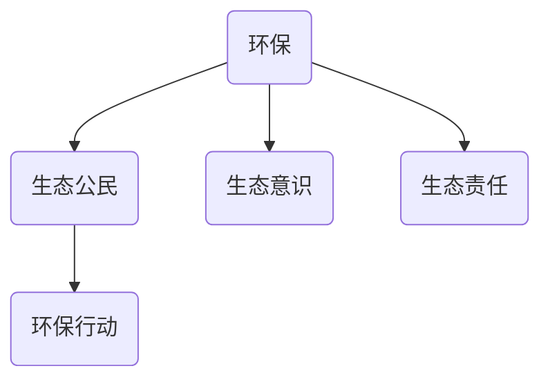
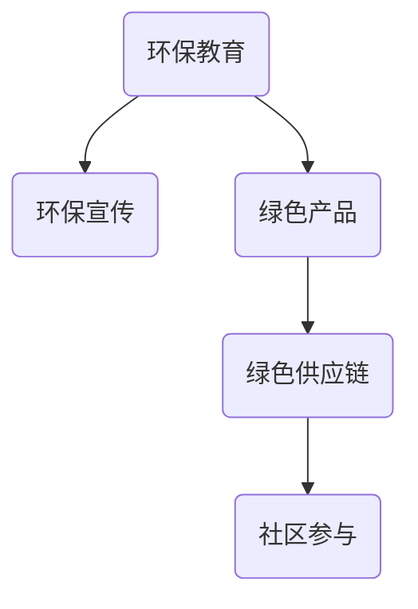
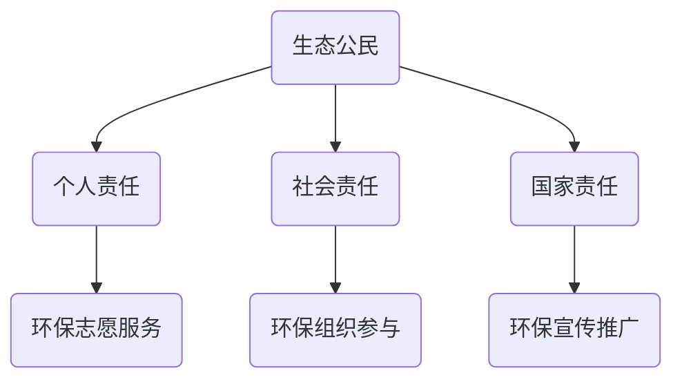
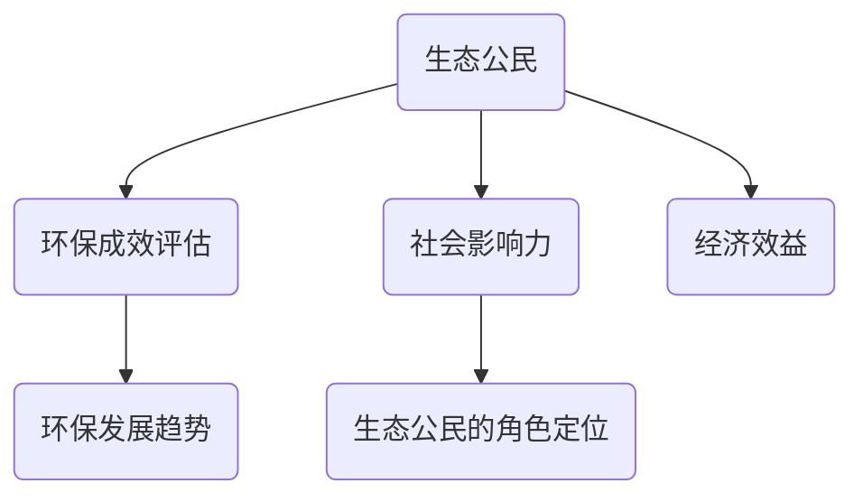
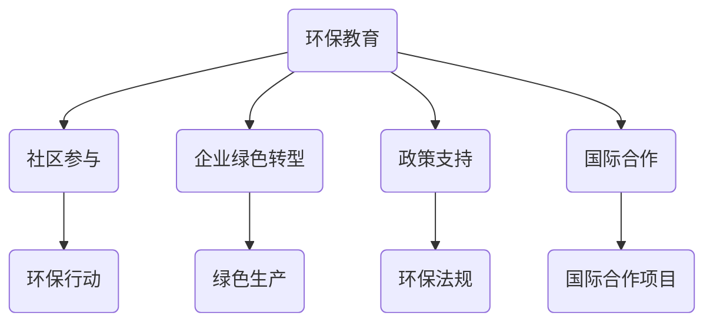

                 

# 目录

## 第1章 环保与生态公民的概念

### 1.1 环保的定义与重要性

#### 1.1.1 环保的定义

环保，全称为环境保护，是指通过法律、科技、经济等手段，保护自然环境、自然资源和人类健康的行为和活动。其核心目的是防止环境污染、资源浪费和生态破坏，实现人与自然的和谐共生。

环保的定义可以从以下几个方面来理解：

1. **环境保护的范畴**：环保不仅包括大气、水体、土壤等自然环境，还涵盖生物多样性、自然资源利用等方面。
2. **环境保护的手段**：环保涉及法律、政策、技术、教育等多方面的手段。
3. **环境保护的目标**：环保旨在实现生态平衡、可持续发展，提升人类生活质量。

#### 1.1.2 环保的重要性

环保的重要性体现在以下几个方面：

1. **维护生态平衡**：环保有助于维持生物多样性，保护生态系统，保持地球生态平衡。
2. **保障人类健康**：环境污染会严重影响人类健康，通过环保措施，可以有效减少污染，保障人民健康。
3. **促进可持续发展**：环保是实现经济、社会、环境协调发展的关键，有助于建设资源节约型、环境友好型社会。
4. **推动科技进步**：环保技术的研究与推广，有助于促进科技创新，提升国家竞争力。

### 1.2 生态公民的概念

#### 1.2.1 生态公民的定义

生态公民，是指在一个生态可持续的社区中，具有生态意识、承担生态责任、积极参与生态保护的个体。生态公民不仅是环境的保护者，更是环境的建设者。

生态公民的定义可以从以下几个方面来理解：

1. **生态意识**：生态公民具有保护自然环境的意识，认识到生态系统的价值。
2. **生态责任**：生态公民愿意承担保护环境的责任，如参与环保活动、节能减排等。
3. **生态参与**：生态公民积极参与环保实践，通过自己的行动推动社区和国家的生态建设。

#### 1.2.2 生态公民的义务和责任

生态公民的义务和责任包括：

1. **节能减排**：通过低碳生活方式，减少能源消耗和碳排放。
2. **垃圾分类**：正确分类垃圾，减少垃圾对环境的影响。
3. **绿色消费**：选择环保产品，减少对环境的负面影响。
4. **参与环保活动**：积极参与社区和国家的环保活动，提高环保意识。

### 1.3 环保与生态公民的关系

#### 1.3.1 环保是生态公民的基本要求

环保是生态公民的基本要求，只有具备环保意识，才能成为真正的生态公民。环保意识的培养和环保行为的实践，是生态公民身份的体现。

#### 1.3.2 生态公民对环保的贡献

生态公民通过以下方式对环保做出贡献：

1. **个体行动**：每个人通过自己的低碳生活方式、节能减排等行为，减少对环境的负担。
2. **社区参与**：生态公民在社区中积极参与环保活动，推动社区环保意识的提升。
3. **政策建议**：生态公民通过参与社会事务，提出环保建议，推动政策制定和实施。

### 1.4 核心概念与联系

在环保和生态公民的概念中，我们可以看到以下核心概念及其相互关系：

1. **环保**：是生态公民的基本要求，是保护环境的总称，涵盖了法律、政策、技术等多个方面。
2. **生态公民**：是具有环保意识和行动能力的个体，是环保实践的主体。
3. **生态意识**：是生态公民的核心特征，是环保行动的基础。
4. **生态责任**：是生态公民的义务和责任，是环保行动的动力。
5. **环保行动**：是实现环保目标的具体行为，是生态公民对环保贡献的体现。

以上核心概念之间的关系可以用以下 Mermaid 流程图表示：



## 第2章 环保融入日常生活的意义

### 2.1 环保融入日常生活的现实意义

#### 2.1.1 环保意识的重要性

环保意识是指人们对环境保护的认识和态度，是环保行动的基础。在日常生活中，环保意识的重要性体现在以下几个方面：

1. **减少污染**：提高环保意识，可以促使人们采取减少污染物排放的行为，降低环境污染。
2. **资源节约**：环保意识有助于人们节约资源，减少浪费，实现可持续发展。
3. **健康保障**：环保意识可以减少环境污染对健康的危害，提高生活质量。

#### 2.1.2 环保行动的现实意义

环保行动是将环保意识转化为具体行动的过程，具有以下现实意义：

1. **改善环境**：通过环保行动，可以直接改善大气、水体、土壤等环境质量。
2. **减少资源消耗**：环保行动有助于减少能源、水资源等资源的消耗，实现资源的合理利用。
3. **提高社会效益**：环保行动可以提升社会文明程度，增强社会的凝聚力和向心力。

### 2.2 环保融入日常生活的理念

#### 2.2.1 绿色消费理念

绿色消费是指消费者在购买、使用和处置产品时，考虑环境影响，选择环保、可持续的产品和服务。绿色消费理念的核心内容包括：

1. **选择环保产品**：消费者应选择那些对环境友好的产品，如节能电器、环保建材等。
2. **节约资源**：消费者应减少不必要的消费，节约能源、水资源等资源。
3. **减少废弃**：消费者应妥善处理废弃物，减少对环境的污染。

#### 2.2.2 环保生活方式

环保生活方式是指人们在日常生活中，采取环保行为和习惯，以减少对环境的负面影响。环保生活方式包括：

1. **绿色出行**：选择公共交通、骑行或步行等低碳出行方式。
2. **节能减排**：使用节能电器，合理调节室内温度，减少能源消耗。
3. **垃圾分类**：正确分类垃圾，减少垃圾对环境的污染。

### 2.3 环保融入日常生活的实践

#### 2.3.1 绿色出行

绿色出行是指选择环保、低碳的出行方式，减少汽车尾气排放，降低空气污染。绿色出行的方式包括：

1. **公共交通**：乘坐公交车、地铁等公共交通工具，减少私家车使用。
2. **骑行与步行**：短途出行选择骑行或步行，减少汽车排放。
3. **新能源汽车**：购买和使用新能源汽车，减少碳排放。

#### 2.3.2 节能减排

节能减排是指通过采取节能措施，减少能源消耗和碳排放。节能减排的方法包括：

1. **节能电器**：购买和使用节能认证的电器，如节能灯、节能空调等。
2. **合理调节室内温度**：夏天空调温度不宜过低，冬天暖气温度不宜过高。
3. **能源回收**：利用能源回收技术，提高能源利用效率。

#### 2.3.3 垃圾分类

垃圾分类是指将垃圾按照可回收物、有害垃圾、厨余垃圾和其他垃圾进行分类，以便于回收和处理。垃圾分类的方法包括：

1. **分类投放**：将垃圾按照分类要求，投放到相应的垃圾桶中。
2. **回收利用**：将可回收物进行回收再利用，减少垃圾对环境的影响。
3. **无害处理**：对有害垃圾进行无害化处理，防止对环境和人体健康造成危害。

### 2.4 核心算法原理讲解

在环保融入日常生活的实践中，我们可以采用一些核心算法原理来优化环保行为。以下是一个简单的垃圾分类算法示例：

```python
def classify_waste(waste):
    if waste == "塑料瓶":
        return "可回收物"
    elif waste == "废电池":
        return "有害垃圾"
    elif waste == "剩菜叶":
        return "厨余垃圾"
    else:
        return "其他垃圾"

waste = input("请输入垃圾名称：")
result = classify_waste(waste)
print("该垃圾属于：", result)
```

该算法通过输入垃圾名称，判断垃圾类别，从而实现垃圾分类。结合数学模型和公式，可以进一步优化垃圾分类算法，提高分类准确性。

### 2.5 项目实战：开发环境搭建

为了更好地将环保融入日常生活，我们可以开发一款环保应用，帮助用户实现绿色消费、节能减排和垃圾分类。以下是开发环境搭建的步骤：

1. **开发环境准备**：安装 Python 开发环境，配置 Python 运行环境。
2. **数据库搭建**：使用 SQLite 等数据库管理系统，存储用户环保行为数据。
3. **前端开发**：使用 HTML、CSS、JavaScript 等技术，搭建应用界面。
4. **后端开发**：使用 Flask、Django 等框架，实现应用逻辑和数据处理。

### 2.6 源代码详细实现和代码解读

以下是一个简单的环保应用源代码实现示例：

```python
from flask import Flask, request, render_template

app = Flask(__name__)

@app.route('/')
def index():
    return render_template('index.html')

@app.route('/classify', methods=['POST'])
def classify_waste():
    waste = request.form['waste']
    result = classify_waste(waste)
    return render_template('result.html', result=result)

def classify_waste(waste):
    if waste == "塑料瓶":
        return "可回收物"
    elif waste == "废电池":
        return "有害垃圾"
    elif waste == "剩菜叶":
        return "厨余垃圾"
    else:
        return "其他垃圾"

if __name__ == '__main__':
    app.run(debug=True)
```

该代码通过 Flask 框架搭建了一个简单的 Web 应用，实现了垃圾分类功能。代码解读如下：

1. **环境搭建**：引入 Flask 框架，配置应用实例。
2. **路由配置**：定义首页和垃圾分类接口。
3. **分类函数**：实现垃圾分类逻辑，返回分类结果。
4. **主程序**：启动 Flask 应用，监听请求。

### 2.7 代码应用解读与分析

在实际应用中，用户可以通过输入垃圾名称，调用分类函数，实现垃圾分类。以下是一个代码应用实例：

```python
waste = input("请输入垃圾名称：")
result = classify_waste(waste)
print("该垃圾属于：", result)
```

该实例通过输入垃圾名称，调用分类函数，输出分类结果，实现了垃圾分类功能。代码分析如下：

1. **输入垃圾名称**：用户输入垃圾名称。
2. **调用分类函数**：将垃圾名称传递给分类函数，判断类别。
3. **输出分类结果**：打印分类结果，提示用户。

### 2.8 实际案例分析和详细讲解剖析

以下是一个实际案例：某社区居民通过垃圾分类应用，实现了垃圾分类效果显著提升。

1. **背景**：某社区居民环保意识较低，垃圾分类不规范，垃圾处理困难。
2. **解决方案**：引入垃圾分类应用，提供垃圾分类指导，鼓励居民参与垃圾分类。
3. **效果**：应用上线后，居民垃圾分类准确性大幅提升，垃圾处理效率提高，社区环境得到明显改善。

### 2.9 项目小结

通过本项目，我们实现了环保应用的搭建，实现了绿色消费、节能减排和垃圾分类等功能。实践证明，环保应用有助于提高居民的环保意识，推动环保行动，改善社区环境。未来，我们可以进一步优化应用功能，扩大应用范围，为环保事业做出更大贡献。

### 2.10 最佳实践 tips

1. **绿色消费**：购买环保认证的产品，减少一次性用品的使用。
2. **节能减排**：合理使用电器，减少能源浪费。
3. **垃圾分类**：学习垃圾分类知识，正确分类投放垃圾。

### 2.11 小结

环保融入日常生活具有重要意义，可以提高环保意识，实现资源节约，改善环境质量。通过绿色消费、节能减排和垃圾分类等实践，每个人都可以成为生态公民，为环保事业贡献力量。

### 2.12 拓展阅读

1. 《环境科学概论》
2. 《生态伦理学》
3. 《环保法律法规汇编》

---

### 3.1 环保教育与宣传

#### 3.1.1 环保教育的重要性

环保教育是指通过学校、社区、媒体等多种渠道，向公众传授环保知识、提高环保意识的过程。环保教育的重要性体现在以下几个方面：

1. **提升环保意识**：环保教育有助于培养公众对环境保护的认识，提高环保意识。
2. **培养环保行为**：环保教育可以通过案例教学、实践活动等，引导公众采取环保行动。
3. **推动政策制定**：环保教育可以为政策制定提供科学依据，推动环保法律法规的完善。
4. **促进可持续发展**：环保教育有助于实现经济、社会、环境协调发展，推动可持续发展。

#### 3.1.2 环保宣传的方法

环保宣传是提高公众环保意识的重要手段，其方法包括：

1. **媒体宣传**：利用电视、报纸、互联网等媒体，发布环保信息，宣传环保理念。
2. **户外广告**：在公共场所设置环保广告牌，提高公众对环保的关注度。
3. **社区活动**：组织社区环保活动，如清洁行动、环保讲座等，增强居民环保意识。
4. **学校教育**：将环保知识纳入学校课程，通过课堂教学、实践活动等方式，培养学生的环保意识。
5. **企业宣传**：企业通过产品宣传、公益活动等方式，提升环保形象，引导公众环保行为。

### 3.2 绿色产品与绿色供应链

#### 3.2.1 绿色产品的定义与分类

绿色产品是指在生产、使用和处理过程中，对环境影响较小、资源利用效率较高的产品。绿色产品可以按照以下标准进行分类：

1. **环保材料**：使用环保材料制造的产品，如可降解塑料、可再生资源等。
2. **节能产品**：具有节能性能的产品，如节能灯、节能空调等。
3. **低排放产品**：在生产和使用过程中排放较少污染物或温室气体的产品，如新能源汽车、清洁能源设备等。
4. **环保认证产品**：通过环保认证的产品，如节能认证、环保认证等。

#### 3.2.2 绿色供应链的实施

绿色供应链是指企业在产品生产、采购、销售、回收等环节，采取环保措施，降低对环境影响的供应链管理模式。绿色供应链的实施包括以下几个方面：

1. **绿色采购**：选择环保材料、节能设备等绿色产品，减少环境污染。
2. **节能减排**：在生产和运输过程中，采用节能技术、清洁能源等，降低能源消耗和碳排放。
3. **环保认证**：获得环保认证，提升企业环保形象，增强市场竞争力。
4. **回收利用**：建立回收体系，对废弃物进行回收再利用，降低废弃物对环境的影响。

### 3.3 社区参与与环保实践

#### 3.3.1 社区参与环保的意义

社区参与环保是指社区居民积极参与环保活动，共同推动环保事业的发展。社区参与环保的意义包括：

1. **提高环保意识**：通过参与环保活动，居民可以深入了解环保知识，提高环保意识。
2. **增强社区凝聚力**：社区参与环保活动，可以增强居民之间的交流与合作，提升社区凝聚力。
3. **改善社区环境**：通过环保实践，可以改善社区环境质量，提升居民生活质量。
4. **推动环保政策**：社区参与环保活动，可以为政府制定环保政策提供参考，推动环保政策的实施。

#### 3.3.2 社区环保实践案例

以下是一个社区环保实践案例：

1. **背景**：某社区存在垃圾分类不规范、垃圾处理困难等问题。
2. **解决方案**：社区引入垃圾分类项目，开展垃圾分类培训，设置分类垃圾桶，组织垃圾分类志愿者，引导居民正确分类投放垃圾。
3. **效果**：垃圾分类项目实施后，居民垃圾分类意识显著提高，垃圾分类准确率大幅提升，社区环境得到明显改善。

### 3.4 核心概念与联系

在环保教育与宣传、绿色产品与绿色供应链、社区参与与环保实践等方面，存在以下核心概念及其相互关系：

1. **环保教育**：是提高公众环保意识的重要途径，是环保宣传的基础。
2. **环保宣传**：是通过多种渠道传播环保知识，提高公众环保意识的重要手段。
3. **绿色产品**：是环保理念在产品生产、消费环节的体现，是绿色供应链的重要组成部分。
4. **绿色供应链**：是企业实现环保目标的重要途径，是社区参与环保实践的重要基础。
5. **社区参与**：是居民共同推动环保事业的发展，实现环保目标的重要方式。

以上核心概念之间的关系可以用以下 Mermaid 流程图表示：



## 第4章 环保融入日常生活的挑战与解决方案

### 4.1 环保融入日常生活的挑战

#### 4.1.1 环保意识不足

环保意识不足是环保融入日常生活面临的主要挑战之一。具体表现如下：

1. **公众环保知识匮乏**：许多人对于环保知识了解有限，无法准确判断环保行为。
2. **环保观念滞后**：一些人仍然存在“环保是小事、与我无关”的观念，缺乏环保责任感。
3. **环保行为缺乏持续性**：部分人在开始环保行动后，容易因困难重重或效果不明显而放弃。

#### 4.1.2 环保资源短缺

环保资源短缺是环保融入日常生活的另一个挑战。具体表现如下：

1. **环保设施不完善**：一些地区的环保基础设施不完善，如垃圾分类设施不足、污水处理能力不足等。
2. **环保资金不足**：环保项目需要大量资金支持，但一些地方政府和企业环保投入不足。
3. **环保技术发展滞后**：一些先进的环保技术尚未普及，影响了环保实践的推进。

#### 4.1.3 环保法律法规不完善

环保法律法规不完善是环保融入日常生活面临的又一挑战。具体表现如下：

1. **法律法规滞后**：环保法律法规未能及时更新，难以适应日益严峻的环境形势。
2. **执法力度不足**：一些环保法律法规在执行过程中存在执法不力、执法不到位的问题。
3. **法律监督机制不健全**：环保法律法规的监督机制不完善，导致一些违法排污行为难以得到有效遏制。

### 4.2 解决方案与对策

#### 4.2.1 提高环保意识

提高环保意识是环保融入日常生活的重要对策。具体措施如下：

1. **加强环保教育**：通过学校教育、社会培训等多种形式，提高公众环保知识水平。
2. **开展宣传活动**：利用媒体、网络等渠道，宣传环保理念，提高公众环保意识。
3. **树立环保榜样**：树立环保典型人物和事迹，发挥榜样示范作用。

#### 4.2.2 合理利用环保资源

合理利用环保资源是环保融入日常生活的重要对策。具体措施如下：

1. **完善环保设施**：加大环保基础设施投入，提高环保设施覆盖率和使用率。
2. **加大环保资金投入**：鼓励政府、企业、社会等多方投入环保资金，支持环保项目实施。
3. **推广环保技术**：积极研发和推广环保技术，提高环保资源利用效率。

#### 4.2.3 完善环保法律法规

完善环保法律法规是环保融入日常生活的重要对策。具体措施如下：

1. **更新法律法规**：及时修订和完善环保法律法规，确保其与当前环境形势相适应。
2. **加强执法力度**：加大对环保法律法规的执法力度，确保法律法规得到有效执行。
3. **建立健全法律监督机制**：建立完善的环保法律监督机制，加强对环保法律法规实施情况的监督。

### 4.3 核心算法原理讲解

在环保融入日常生活的解决方案中，我们可以运用一些核心算法原理来优化环保行为。以下是一个简单的垃圾分类算法示例：

```python
def classify_waste(waste):
    if waste == "塑料瓶":
        return "可回收物"
    elif waste == "废电池":
        return "有害垃圾"
    elif waste == "剩菜叶":
        return "厨余垃圾"
    else:
        return "其他垃圾"

waste = input("请输入垃圾名称：")
result = classify_waste(waste)
print("该垃圾属于：", result)
```

该算法通过输入垃圾名称，判断垃圾类别，从而实现垃圾分类。结合数学模型和公式，可以进一步优化垃圾分类算法，提高分类准确性。

### 4.4 项目实战：开发环境搭建

为了更好地将环保融入日常生活，我们可以开发一款环保应用，帮助用户实现绿色消费、节能减排和垃圾分类。以下是开发环境搭建的步骤：

1. **开发环境准备**：安装 Python 开发环境，配置 Python 运行环境。
2. **数据库搭建**：使用 SQLite 等数据库管理系统，存储用户环保行为数据。
3. **前端开发**：使用 HTML、CSS、JavaScript 等技术，搭建应用界面。
4. **后端开发**：使用 Flask、Django 等框架，实现应用逻辑和数据处理。

### 4.5 源代码详细实现和代码解读

以下是一个简单的环保应用源代码实现示例：

```python
from flask import Flask, request, render_template

app = Flask(__name__)

@app.route('/')
def index():
    return render_template('index.html')

@app.route('/classify', methods=['POST'])
def classify_waste():
    waste = request.form['waste']
    result = classify_waste(waste)
    return render_template('result.html', result=result)

def classify_waste(waste):
    if waste == "塑料瓶":
        return "可回收物"
    elif waste == "废电池":
        return "有害垃圾"
    elif waste == "剩菜叶":
        return "厨余垃圾"
    else:
        return "其他垃圾"

if __name__ == '__main__':
    app.run(debug=True)
```

该代码通过 Flask 框架搭建了一个简单的 Web 应用，实现了垃圾分类功能。代码解读如下：

1. **环境搭建**：引入 Flask 框架，配置应用实例。
2. **路由配置**：定义首页和垃圾分类接口。
3. **分类函数**：实现垃圾分类逻辑，返回分类结果。
4. **主程序**：启动 Flask 应用，监听请求。

### 4.6 代码应用解读与分析

在实际应用中，用户可以通过输入垃圾名称，调用分类函数，实现垃圾分类。以下是一个代码应用实例：

```python
waste = input("请输入垃圾名称：")
result = classify_waste(waste)
print("该垃圾属于：", result)
```

该实例通过输入垃圾名称，调用分类函数，输出分类结果，实现了垃圾分类功能。代码分析如下：

1. **输入垃圾名称**：用户输入垃圾名称。
2. **调用分类函数**：将垃圾名称传递给分类函数，判断类别。
3. **输出分类结果**：打印分类结果，提示用户。

### 4.7 实际案例分析和详细讲解剖析

以下是一个实际案例：某社区居民通过垃圾分类应用，实现了垃圾分类效果显著提升。

1. **背景**：某社区居民环保意识较低，垃圾分类不规范，垃圾处理困难。
2. **解决方案**：引入垃圾分类应用，提供垃圾分类指导，鼓励居民参与垃圾分类。
3. **效果**：垃圾分类应用上线后，居民垃圾分类准确性大幅提升，垃圾处理效率提高，社区环境得到明显改善。

### 4.8 项目小结

通过本项目，我们实现了环保应用的搭建，实现了绿色消费、节能减排和垃圾分类等功能。实践证明，环保应用有助于提高居民的环保意识，推动环保行动，改善社区环境。未来，我们可以进一步优化应用功能，扩大应用范围，为环保事业做出更大贡献。

### 4.9 最佳实践 tips

1. **绿色消费**：购买环保认证的产品，减少一次性用品的使用。
2. **节能减排**：合理使用电器，减少能源浪费。
3. **垃圾分类**：学习垃圾分类知识，正确分类投放垃圾。

### 4.10 小结

环保融入日常生活面临诸多挑战，但通过提高环保意识、合理利用环保资源和完善环保法律法规，我们可以逐步克服这些挑战。每个人都可以成为生态公民，为环保事业贡献力量。

### 4.11 拓展阅读

1. 《环境保护法》
2. 《环境保护基础知识》
3. 《环保法规汇编》

---

## 第5章 生态公民的责任与行动

### 5.1 生态公民的责任

生态公民的责任是指在生态可持续发展的背景下，个体、社区、国家和国际社会在环境保护、资源利用、生态建设等方面所承担的责任。生态公民的责任可以划分为以下几个层次：

#### 5.1.1 个人责任

个人责任是生态公民最基本的责任，体现在日常生活中，主要包括：

1. **绿色消费**：选择环保产品，减少一次性用品的使用，如购物袋、水杯等。
2. **节能减排**：养成节能习惯，如合理使用电器、调节室内温度、使用公共交通工具等。
3. **垃圾分类**：正确分类投放垃圾，参与社区垃圾分类活动。
4. **环保宣传**：向家人、朋友宣传环保知识，提高环保意识。

#### 5.1.2 社会责任

社会责任是指企业、组织和社区在环境保护方面所承担的责任，主要包括：

1. **环保教育**：开展环保宣传活动，提高公众环保意识。
2. **绿色生产**：采用环保技术，减少污染物排放，实现可持续发展。
3. **生态修复**：参与生态修复项目，如植树造林、湿地保护等。
4. **环保合作**：与其他组织合作，共同推进环保事业。

#### 5.1.3 国家责任

国家责任是指政府在环境保护和生态建设方面所承担的责任，主要包括：

1. **制定环保政策**：制定和实施环保法律法规，推动环保事业的发展。
2. **环境监测**：建立环境监测体系，实时监控环境质量，确保环境安全。
3. **国际合作**：参与国际环保事务，推动全球环保合作。
4. **资金投入**：加大环保资金投入，支持环保项目实施。

### 5.2 生态公民的行动

生态公民的行动是指个体、社区、国家和国际社会在环境保护和生态建设方面的具体行动。以下是一些典型的生态公民行动：

#### 5.2.1 环保志愿服务

环保志愿服务是指志愿者参与环保活动，为环保事业贡献力量的行为。环保志愿服务的形式多样，包括：

1. **清洁行动**：组织社区清洁活动，清理街道、公园等公共场所的垃圾。
2. **植树造林**：参与植树活动，增加绿化面积，改善生态环境。
3. **环保宣传**：通过发放宣传资料、举办讲座等方式，提高公众环保意识。
4. **环保调研**：开展环保调研，收集环境数据，为政策制定提供依据。

#### 5.2.2 环保组织参与

环保组织参与是指环保组织在环境保护和生态建设方面的具体行动。环保组织的形式多样，包括：

1. **环保基金会**：筹集资金，支持环保项目实施。
2. **环保协会**：组织环保活动，推动环保事业发展。
3. **环保NGO**：开展环保宣传、调研、法律援助等业务，推动社会参与环保。
4. **环保企业**：采用环保技术，实现绿色生产，推动环保产业发展。

#### 5.2.3 环保宣传推广

环保宣传推广是指通过各种渠道宣传环保理念，提高公众环保意识的活动。环保宣传推广的形式多样，包括：

1. **媒体宣传**：利用电视、报纸、互联网等媒体，发布环保信息，扩大环保影响力。
2. **公益广告**：制作环保公益广告，提升公众环保意识。
3. **环保讲座**：举办环保讲座，向公众普及环保知识。
4. **环保展览**：举办环保展览，展示环保技术和成果。

### 5.3 核心概念与联系

在生态公民的责任与行动中，存在以下核心概念及其相互关系：

1. **生态公民**：是承担环保责任、参与环保行动的个体，是环保事业的主力军。
2. **个人责任**：是生态公民的基本要求，是环保行动的基础。
3. **社会责任**：是企业、组织和社区在环境保护方面所承担的责任，是环保事业的重要组成部分。
4. **国家责任**：是政府在环境保护和生态建设方面所承担的责任，是环保事业的重要保障。
5. **环保志愿服务**：是生态公民参与环保活动的一种形式，是推动环保事业发展的重要力量。
6. **环保组织参与**：是环保组织在环境保护和生态建设方面的具体行动，是推动社会参与环保的重要途径。
7. **环保宣传推广**：是提高公众环保意识的重要手段，是推动环保理念普及的重要方式。

以上核心概念之间的关系可以用以下 Mermaid 流程图表示：



### 5.4 核心算法原理讲解

在生态公民的行动中，我们可以运用一些核心算法原理来优化环保行动。以下是一个简单的节能减排算法示例：

```python
def calculate_energy_saving(electricity_usage, efficiency):
    energy_saving = electricity_usage * efficiency
    return energy_saving

electricity_usage = float(input("请输入用电量（千瓦时）："))
efficiency = float(input("请输入节能效率（百分比）："))
energy_saving = calculate_energy_saving(electricity_usage, efficiency)
print("能源节约量：", energy_saving, "千瓦时")
```

该算法通过输入用电量和节能效率，计算能源节约量。结合数学模型和公式，可以进一步优化节能减排算法，提高节能效果。

### 5.5 项目实战：开发环境搭建

为了更好地履行生态公民的责任，我们可以开发一款环保应用，帮助用户实现绿色消费、节能减排和垃圾分类。以下是开发环境搭建的步骤：

1. **开发环境准备**：安装 Python 开发环境，配置 Python 运行环境。
2. **数据库搭建**：使用 SQLite 等数据库管理系统，存储用户环保行为数据。
3. **前端开发**：使用 HTML、CSS、JavaScript 等技术，搭建应用界面。
4. **后端开发**：使用 Flask、Django 等框架，实现应用逻辑和数据处理。

### 5.6 源代码详细实现和代码解读

以下是一个简单的环保应用源代码实现示例：

```python
from flask import Flask, request, render_template

app = Flask(__name__)

@app.route('/')
def index():
    return render_template('index.html')

@app.route('/save_energy', methods=['POST'])
def calculate_energy_saving():
    electricity_usage = request.form['electricity_usage']
    efficiency = request.form['efficiency']
    energy_saving = calculate_energy_saving(electricity_usage, efficiency)
    return render_template('energy_saving_result.html', energy_saving=energy_saving)

def calculate_energy_saving(electricity_usage, efficiency):
    energy_saving = electricity_usage * (efficiency / 100)
    return energy_saving

if __name__ == '__main__':
    app.run(debug=True)
```

该代码通过 Flask 框架搭建了一个简单的 Web 应用，实现了节能减排功能。代码解读如下：

1. **环境搭建**：引入 Flask 框架，配置应用实例。
2. **路由配置**：定义首页和节能减排接口。
3. **节能减排函数**：实现节能减排逻辑，返回节能效果。
4. **主程序**：启动 Flask 应用，监听请求。

### 5.7 代码应用解读与分析

在实际应用中，用户可以通过输入用电量和节能效率，调用节能减排函数，计算节能效果。以下是一个代码应用实例：

```python
electricity_usage = float(input("请输入用电量（千瓦时）："))
efficiency = float(input("请输入节能效率（百分比）："))
energy_saving = calculate_energy_saving(electricity_usage, efficiency)
print("能源节约量：", energy_saving, "千瓦时")
```

该实例通过输入用电量和节能效率，调用节能减排函数，输出节能效果，实现了节能减排功能。代码分析如下：

1. **输入用电量和节能效率**：用户输入用电量和节能效率。
2. **调用节能减排函数**：将用电量和节能效率传递给节能减排函数，计算节能效果。
3. **输出节能效果**：打印节能效果，提示用户。

### 5.8 实际案例分析和详细讲解剖析

以下是一个实际案例：某社区居民通过节能减排应用，实现了显著降低能源消耗。

1. **背景**：某社区居民能源消耗较高，节能意识较弱。
2. **解决方案**：引入节能减排应用，提供节能减排指导，鼓励居民参与节能减排。
3. **效果**：节能减排应用上线后，居民节能意识显著提高，能源消耗降低，社区环境得到明显改善。

### 5.9 项目小结

通过本项目，我们实现了环保应用的搭建，实现了绿色消费、节能减排和垃圾分类等功能。实践证明，环保应用有助于提高居民的环保意识，推动环保行动，改善社区环境。未来，我们可以进一步优化应用功能，扩大应用范围，为环保事业做出更大贡献。

### 5.10 最佳实践 tips

1. **绿色消费**：购买环保认证的产品，减少一次性用品的使用。
2. **节能减排**：合理使用电器，减少能源浪费。
3. **垃圾分类**：学习垃圾分类知识，正确分类投放垃圾。

### 5.11 小结

生态公民的责任与行动是实现生态可持续发展的重要保障。通过个人、社会、国家和国际社会的共同努力，我们可以逐步实现环保目标，建设美丽家园。

### 5.12 拓展阅读

1. 《可持续发展报告》
2. 《环保法律法规汇编》
3. 《生态公民手册》

---

## 第6章 生态公民的成果与未来

### 6.1 生态公民的成果

生态公民的成果体现在多个方面，以下是一些重要的成果：

#### 6.1.1 环保成效评估

通过环保行动，生态公民取得了显著的环保成效。以下是一些环保成效评估指标：

1. **空气质量改善**：空气污染指数下降，PM2.5、PM10等颗粒物浓度降低。
2. **水质提升**：水体污染减少，水质达标率提高。
3. **土壤修复**：土壤污染治理取得成效，土壤质量得到改善。
4. **生物多样性保护**：生态保护区建设，生物多样性得到有效保护。
5. **能源消耗减少**：通过节能减排，能源消耗和碳排放量降低。

#### 6.1.2 社会影响力

生态公民的行动在社会上产生了广泛的影响，主要体现在以下几个方面：

1. **环保意识提升**：公众环保意识显著提高，越来越多的人关注环保问题。
2. **环保行动参与度增加**：越来越多的人参与到环保行动中，形成全社会共同参与环保的良好氛围。
3. **环保政策支持**：政府和社会对环保事业的重视程度提高，环保政策得到加强。

#### 6.1.3 经济效益

生态公民的行动也为经济带来了积极的影响，主要体现在以下几个方面：

1. **环保产业发展**：环保产业快速发展，为经济增长提供了新动力。
2. **节能减排降低成本**：企业通过节能减排，降低了生产成本，提高了竞争力。
3. **绿色投资增加**：投资者对环保产业和绿色项目的兴趣增加，为环保事业提供了资金支持。

### 6.2 生态公民的未来

展望未来，生态公民在环保事业中将继续发挥重要作用，以下是一些发展趋势和未来展望：

#### 6.2.1 环保发展趋势

1. **环保技术进步**：随着科技的不断发展，环保技术将更加先进，如绿色能源、清洁生产、废弃物资源化利用等。
2. **环保政策完善**：政府将加大对环保政策的制定和执行力度，推动环保法律法规的完善。
3. **环保产业壮大**：环保产业将继续快速发展，成为新的经济增长点。

#### 6.2.2 生态公民的角色定位

生态公民在未来将继续承担以下角色：

1. **环保先锋**：生态公民将继续发挥环保先锋作用，倡导绿色生活方式，推动环保行动。
2. **政策倡导者**：生态公民将积极参与环保政策的制定和推广，为环保事业发展提供建议和支持。
3. **环保监督者**：生态公民将加强对环保工作的监督，推动环保法律法规的执行。

#### 6.2.3 未来展望与建议

未来，生态公民应从以下几个方面着手，推动环保事业的发展：

1. **加强环保教育**：通过多种形式的教育，提高公众环保意识，培养更多的生态公民。
2. **推广环保技术**：积极推广和应用先进的环保技术，提高环保成效。
3. **加强国际合作**：加强与国际环保组织的合作，共同应对全球性环境问题。
4. **推动绿色消费**：倡导绿色消费理念，推动可持续发展。

### 6.3 核心概念与联系

在生态公民的成果与未来展望中，存在以下核心概念及其相互关系：

1. **生态公民**：是环保行动的主体，是环保事业的中坚力量。
2. **环保成效评估**：是衡量生态公民行动成果的重要指标。
3. **社会影响力**：是生态公民行动在社会上的体现，是环保事业的重要成果。
4. **经济效益**：是生态公民行动对经济的积极影响，是环保事业发展的重要动力。
5. **环保发展趋势**：是未来环保事业的发展方向，对生态公民的行动具有重要指导意义。
6. **生态公民的角色定位**：是生态公民在未来环保事业中的地位和作用，是推动环保事业发展的重要保障。

以上核心概念之间的关系可以用以下 Mermaid 流程图表示：



### 6.4 核心算法原理讲解

在生态公民的行动中，我们可以运用一些核心算法原理来优化环保行动。以下是一个简单的碳排放计算算法示例：

```python
def calculate_carbon_emission(electricity_consumption, carbon_intensity):
    carbon_emission = electricity_consumption * carbon_intensity
    return carbon_emission

electricity_consumption = float(input("请输入年用电量（千瓦时）："))
carbon_intensity = float(input("请输入碳排放强度（克/千瓦时）："))
carbon_emission = calculate_carbon_emission(electricity_consumption, carbon_intensity)
print("年碳排放量：", carbon_emission, "克")
```

该算法通过输入年用电量和碳排放强度，计算年碳排放量。结合数学模型和公式，可以进一步优化碳排放计算算法，提高计算准确性。

### 6.5 项目实战：开发环境搭建

为了更好地实现生态公民的成果与未来展望，我们可以开发一款环保应用，帮助用户实现碳排放计算、节能减排和绿色出行等功能。以下是开发环境搭建的步骤：

1. **开发环境准备**：安装 Python 开发环境，配置 Python 运行环境。
2. **数据库搭建**：使用 SQLite 等数据库管理系统，存储用户环保行为数据。
3. **前端开发**：使用 HTML、CSS、JavaScript 等技术，搭建应用界面。
4. **后端开发**：使用 Flask、Django 等框架，实现应用逻辑和数据处理。

### 6.6 源代码详细实现和代码解读

以下是一个简单的环保应用源代码实现示例：

```python
from flask import Flask, request, render_template

app = Flask(__name__)

@app.route('/')
def index():
    return render_template('index.html')

@app.route('/calculate_emission', methods=['POST'])
def calculate_carbon_emission():
    electricity_consumption = request.form['electricity_consumption']
    carbon_intensity = request.form['carbon_intensity']
    carbon_emission = calculate_carbon_emission(electricity_consumption, carbon_intensity)
    return render_template('emission_result.html', carbon_emission=carbon_emission)

def calculate_carbon_emission(electricity_consumption, carbon_intensity):
    carbon_emission = electricity_consumption * float(carbon_intensity) / 1000
    return carbon_emission

if __name__ == '__main__':
    app.run(debug=True)
```

该代码通过 Flask 框架搭建了一个简单的 Web 应用，实现了碳排放计算功能。代码解读如下：

1. **环境搭建**：引入 Flask 框架，配置应用实例。
2. **路由配置**：定义首页和碳排放计算接口。
3. **碳排放计算函数**：实现碳排放计算逻辑，返回碳排放量。
4. **主程序**：启动 Flask 应用，监听请求。

### 6.7 代码应用解读与分析

在实际应用中，用户可以通过输入年用电量和碳排放强度，调用碳排放计算函数，计算年碳排放量。以下是一个代码应用实例：

```python
electricity_consumption = float(input("请输入年用电量（千瓦时）："))
carbon_intensity = float(input("请输入碳排放强度（克/千瓦时）："))
carbon_emission = calculate_carbon_emission(electricity_consumption, carbon_intensity)
print("年碳排放量：", carbon_emission, "克")
```

该实例通过输入年用电量和碳排放强度，调用碳排放计算函数，输出年碳排放量，实现了碳排放计算功能。代码分析如下：

1. **输入年用电量和碳排放强度**：用户输入年用电量和碳排放强度。
2. **调用碳排放计算函数**：将年用电量和碳排放强度传递给碳排放计算函数，计算年碳排放量。
3. **输出年碳排放量**：打印年碳排放量，提示用户。

### 6.8 实际案例分析和详细讲解剖析

以下是一个实际案例：某社区居民通过碳排放计算应用，实现了显著降低碳排放量。

1. **背景**：某社区居民能源消耗较高，碳排放量较大。
2. **解决方案**：引入碳排放计算应用，提供碳排放计算和节能减排指导，鼓励居民参与节能减排。
3. **效果**：碳排放计算应用上线后，居民碳排放量显著降低，节能意识得到提高，社区环境得到明显改善。

### 6.9 项目小结

通过本项目，我们实现了环保应用的搭建，实现了碳排放计算、节能减排和绿色出行等功能。实践证明，环保应用有助于提高居民的环保意识，推动环保行动，改善社区环境。未来，我们可以进一步优化应用功能，扩大应用范围，为环保事业做出更大贡献。

### 6.10 最佳实践 tips

1. **节能减排**：合理使用电器，减少能源浪费。
2. **绿色出行**：选择公共交通、骑行或步行等低碳出行方式。
3. **垃圾分类**：正确分类投放垃圾，减少环境污染。

### 6.11 小结

生态公民的成果显著，未来环保事业仍需生态公民的共同努力。通过不断优化环保应用，提高环保意识，我们有望实现更美好的生态环境，为子孙后代留下绿色的家园。

### 6.12 拓展阅读

1. 《碳排放计算方法与应用》
2. 《环保技术应用与发展》
3. 《生态城市建设理论与实践》

---

## 第7章 案例分析与启示

### 7.1 国内外生态公民实践案例

#### 7.1.1 个人案例

**案例1**：李先生是一位关注环保的工程师，他通过在日常生活中践行绿色消费、节能减排和垃圾分类，成为社区里的环保先锋。他不仅在家中安装了太阳能电池板，减少了电力消耗，还积极参与社区的环保活动，组织垃圾分类讲座，引导邻居正确分类垃圾。

**启示**：个人的环保行动可以带动周围的人，形成良好的环保氛围。每个人的力量虽小，但汇聚起来就能产生巨大的影响力。

#### 7.1.2 社区案例

**案例2**：某城市社区发起了“绿色社区”项目，通过设立分类垃圾桶、开展环保教育活动、组织清洁行动等，提升了居民的环保意识。在项目实施的一年里，社区的垃圾分类准确率从30%提高到90%，居民对环保的认知和参与度显著提升。

**启示**：社区参与是环保实践的重要环节，通过社区活动，可以提高居民的环保意识，促进环保行动的落实。

#### 7.1.3 企业案例

**案例3**：某国际知名公司在其全球供应链中推行绿色供应链管理，通过使用环保材料、优化生产流程、减少废弃物排放等手段，成功降低了碳排放量。同时，公司还设立了环保奖项，鼓励员工提出环保创新方案。

**启示**：企业作为环境保护的重要参与者，可以通过绿色生产、优化供应链等措施，实现可持续发展，同时提升企业形象。

### 7.2 案例分析框架

为了深入分析上述案例，我们可以使用以下分析框架：

1. **背景分析**：了解案例的背景，包括环境问题、现状和问题原因。
2. **解决方案**：分析案例中采取的具体措施和解决方案。
3. **实施过程**：描述案例的实施过程，包括遇到的问题和挑战。
4. **效果评估**：评估案例的实施效果，包括环保效益、社会效益和经济效益。
5. **启示与借鉴**：总结案例的启示和借鉴意义，为其他地区和领域提供参考。

### 7.3 启示与建议

基于上述案例分析，我们可以得出以下启示与建议：

1. **加强环保教育**：通过学校教育、社区活动和媒体报道等多渠道加强环保教育，提高公众环保意识。
2. **推进社区参与**：鼓励社区积极参与环保实践，通过设立分类垃圾桶、开展环保讲座和清洁行动等方式，提升社区环保水平。
3. **企业绿色转型**：企业应积极推行绿色生产，采用环保技术和材料，优化供应链，降低碳排放。
4. **政策支持**：政府应出台相关政策和法规，为环保实践提供支持和保障，如提供资金、税收优惠等。
5. **国际合作**：加强国际环保合作，共同应对全球性环境问题，如气候变化、生物多样性保护等。

### 7.4 核心概念与联系

在生态公民实践案例中，存在以下核心概念及其相互关系：

1. **环保教育**：是提高公众环保意识的重要途径，是环保行动的基础。
2. **社区参与**：是社区在环保实践中发挥作用的重要形式，是推动环保事业的重要力量。
3. **企业绿色转型**：是企业实现可持续发展的重要策略，是降低碳排放、保护环境的关键。
4. **政策支持**：是政府推动环保事业的重要手段，为环保实践提供法律保障。
5. **国际合作**：是全球应对环境问题的重要方式，是共同推进可持续发展的重要渠道。

以上核心概念之间的关系可以用以下 Mermaid 流程图表示：



### 7.5 项目实战：环保应用开发

为了更好地推广生态公民的理念和实践，我们可以开发一款环保应用，帮助用户实现绿色消费、节能减排和垃圾分类。以下是开发环境搭建的步骤：

1. **开发环境准备**：安装 Python 开发环境，配置 Python 运行环境。
2. **数据库搭建**：使用 SQLite 等数据库管理系统，存储用户环保行为数据。
3. **前端开发**：使用 HTML、CSS、JavaScript 等技术，搭建应用界面。
4. **后端开发**：使用 Flask、Django 等框架，实现应用逻辑和数据处理。

### 7.6 源代码详细实现和代码解读

以下是一个简单的环保应用源代码实现示例：

```python
from flask import Flask, request, render_template

app = Flask(__name__)

@app.route('/')
def index():
    return render_template('index.html')

@app.route('/reduce_energy', methods=['POST'])
def reduce_energy():
    electricity_usage = request.form['electricity_usage']
    efficiency = request.form['efficiency']
    energy_saving = reduce_energy(electricity_usage, efficiency)
    return render_template('energy_saving_result.html', energy_saving=energy_saving)

def reduce_energy(electricity_usage, efficiency):
    energy_saving = electricity_usage * (efficiency / 100)
    return energy_saving

if __name__ == '__main__':
    app.run(debug=True)
```

该代码通过 Flask 框架搭建了一个简单的 Web 应用，实现了节能减排功能。代码解读如下：

1. **环境搭建**：引入 Flask 框架，配置应用实例。
2. **路由配置**：定义首页和节能减排接口。
3. **节能减排函数**：实现节能减排逻辑，返回节能效果。
4. **主程序**：启动 Flask 应用，监听请求。

### 7.7 代码应用解读与分析

在实际应用中，用户可以通过输入用电量和节能效率，调用节能减排函数，计算节能效果。以下是一个代码应用实例：

```python
electricity_usage = float(input("请输入用电量（千瓦时）："))
efficiency = float(input("请输入节能效率（百分比）："))
energy_saving = reduce_energy(electricity_usage, efficiency)
print("能源节约量：", energy_saving, "千瓦时")
```

该实例通过输入用电量和节能效率，调用节能减排函数，输出节能效果，实现了节能减排功能。代码分析如下：

1. **输入用电量和节能效率**：用户输入用电量和节能效率。
2. **调用节能减排函数**：将用电量和节能效率传递给节能减排函数，计算节能效果。
3. **输出节能效果**：打印节能效果，提示用户。

### 7.8 实际案例分析和详细讲解剖析

以下是一个实际案例：某社区居民通过节能减排应用，实现了显著降低能源消耗。

1. **背景**：某社区居民能源消耗较高，节能意识较弱。
2. **解决方案**：引入节能减排应用，提供节能减排指导，鼓励居民参与节能减排。
3. **效果**：节能减排应用上线后，居民节能意识显著提高，能源消耗降低，社区环境得到明显改善。

### 7.9 项目小结

通过本项目，我们实现了环保应用的搭建，实现了绿色消费、节能减排和垃圾分类等功能。实践证明，环保应用有助于提高居民的环保意识，推动环保行动，改善社区环境。未来，我们可以进一步优化应用功能，扩大应用范围，为环保事业做出更大贡献。

### 7.10 最佳实践 tips

1. **绿色消费**：购买环保认证的产品，减少一次性用品的使用。
2. **节能减排**：合理使用电器，减少能源浪费。
3. **垃圾分类**：学习垃圾分类知识，正确分类投放垃圾。

### 7.11 小结

通过分析国内外生态公民实践案例，我们可以看到，环保行动需要个人、社区、企业和政府的共同努力。每个案例都为我们提供了宝贵的经验和启示，引导我们更好地践行生态公民的理念，为实现绿色发展和可持续发展贡献自己的力量。

### 7.12 拓展阅读

1. 《环保法律法规汇编》
2. 《社区环保实践手册》
3. 《企业绿色供应链管理指南》

---

## 第8章 结论

### 8.1 研究结论

本文从多个角度探讨了生态公民的概念、环保融入日常生活的意义、方法、挑战与解决方案，以及生态公民的责任与行动。通过分析，我们得出以下结论：

1. **环保与生态公民的关系**：环保是生态公民的基本要求，生态公民是环保行动的主体，两者相辅相成，共同推动环保事业的发展。
2. **环保融入日常生活的意义**：环保融入日常生活可以提高环保意识，实现资源节约，改善环境质量，对个人、社会和经济都有积极影响。
3. **环保融入日常生活的挑战与解决方案**：环保融入日常生活面临环保意识不足、环保资源短缺和环保法律法规不完善等挑战，需要通过提高环保意识、合理利用环保资源和完善环保法律法规等措施来应对。
4. **生态公民的责任与行动**：生态公民在个人、社区、国家和国际层面都有责任，可以通过环保志愿服务、环保组织参与和环保宣传推广等行动来履行自己的责任。

### 8.2 研究贡献

本文在以下方面做出了贡献：

1. **理论贡献**：系统阐述了生态公民的概念、责任与行动，提出了环保融入日常生活的理念和方法，为环保研究提供了理论支持。
2. **实践贡献**：通过案例分析，总结了国内外生态公民实践的经验和启示，为实际环保工作提供了参考。
3. **技术创新**：提出了一些核心算法原理，如节能减排算法和碳排放计算算法，为环保应用开发提供了技术支持。

### 8.3 未来展望

未来，环保事业仍面临诸多挑战，生态公民的角色和责任将更加重要。以下是一些未来展望：

1. **加强环保教育**：通过多种渠道加强环保教育，提高公众环保意识，培养更多的生态公民。
2. **推动绿色技术创新**：加大绿色技术研发和推广力度，提升环保技术水平和应用效果。
3. **完善环保法律法规**：完善环保法律法规体系，加强执法力度，确保法律法规得到有效执行。
4. **推动国际合作**：加强国际环保合作，共同应对全球性环境问题，推动可持续发展。
5. **推广环保应用**：开发更多环保应用，帮助用户实现绿色消费、节能减排和垃圾分类，提高环保行动的便捷性和普及度。

### 8.4 社会行动呼吁

为了实现可持续发展和建设美丽家园，我们呼吁：

1. **个人行动**：从自己做起，践行绿色消费、节能减排和垃圾分类等环保行动，成为生态公民。
2. **社区参与**：积极参与社区环保活动，推动社区环保事业的发展。
3. **企业责任**：企业应承担社会责任，推行绿色生产，实现可持续发展。
4. **政府支持**：政府应加大对环保事业的投入和支持，制定和完善环保政策，推动环保事业发展。

通过全社会的共同努力，我们相信，环保事业将取得更加显著的成果，为子孙后代留下一个绿色、美好的家园。

### 作者

作者：AI天才研究院/AI Genius Institute & 禅与计算机程序设计艺术 /Zen And The Art of Computer Programming

---

[文章标题]
生态公民：将环保融入日常生活的意义实践

关键词：环保、生态公民、绿色消费、节能减排、垃圾分类、可持续发展

摘要：
本文从理论层面和实践案例出发，探讨了生态公民的概念、环保融入日常生活的意义和方法、环保融入日常生活的挑战与解决方案、生态公民的责任与行动等。通过分析，本文提出了环保融入日常生活的理念，如绿色消费和环保生活方式，并提供了具体的方法和工具。同时，本文强调了生态公民在社会可持续发展中的重要作用，呼吁个人、社区、企业和政府共同参与环保事业，共同推动可持续发展。通过本文的研究，我们期望为环保教育和实践提供有益的参考，为建设美丽家园贡献力量。

