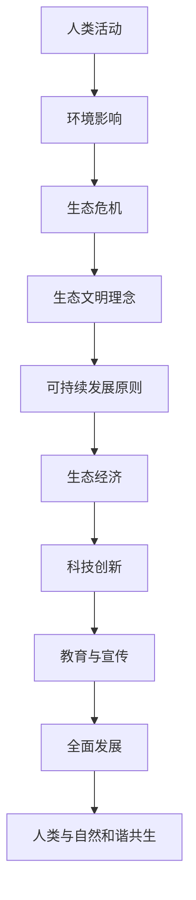

                 

----------------------------------------------------------------

## 生态文明：人与自然和谐共生的理想

关键词：生态文明，人与自然和谐共生，可持续发展，生态经济，科技创新

摘要：本文从生态文明的背景、理论基础、核心价值观、实践与应用等方面，探讨了人与自然和谐共生的重要性，提出了生态文明建设的路径和策略。通过阐述生态文明的核心算法原理、数学模型和实际应用案例，分析了生态文明在未来发展中的机遇与挑战。

### 目录

1. **生态文明的背景与理论基础**
    1.1 生态文明的概念与定义
    1.2 生态文明的历史演变
    1.3 生态文明的理论基础

2. **人与自然的关系**
    2.1 人类活动对自然环境的影响
    2.2 人与自然的关系变迁
    2.3 人与自然和谐共生的理念

3. **生态文明的核心价值观**
    3.1 可持续发展的原则
    3.2 环境伦理学的视角
    3.3 人与自然和谐共生的文化内涵

4. **生态文明的实践与应用**
    4.1 生态经济的探索
    4.2 生态文明的政策与法律
    4.3 生态文明的科技创新
    4.4 生态文明的教育与宣传

5. **生态文明的未来展望**
    5.1 全球挑战与机遇
    5.2 中国的生态文明之路
    5.3 生态文明与人的全面发展

6. **结语**

### 引言

生态文明是人类文明发展的新阶段，是在人与自然关系不断演化的过程中，提出的关于人与自然和谐共生的新理念。随着全球生态环境问题的日益严重，人类逐渐意识到，只有实现生态文明，才能确保地球的可持续发展。本文旨在探讨生态文明的内涵、核心价值观以及实践路径，以期为人与自然和谐共生提供理论支持和实践指导。

### 生态文明的背景与理论基础

#### 1.1 生态文明的概念与定义

生态文明是人类文明发展的新阶段，是人与自然、人与社会、人与人之间和谐共生、共同发展的文明形态。它强调在尊重自然、顺应自然的基础上，实现经济、社会、生态的协调发展。

#### 1.2 生态文明的历史演变

生态文明理念并非突然出现，而是经历了漫长的历史演变。从古代的“天人合一”思想，到近代的生态伦理观念，再到现代的可持续发展战略，生态文明理念逐渐成熟。

#### 1.3 生态文明的理论基础

生态文明的理论基础主要包括可持续发展理论、生态经济学理论、生态伦理学理论等。这些理论共同构成了生态文明的理论框架，为生态文明建设提供了理论支撑。

### 人与自然的关系

#### 2.1 人类活动对自然环境的影响

人类活动对自然环境产生了深远的影响，包括气候变化、生物多样性减少、水资源污染等。这些问题不仅威胁着人类的生存环境，也制约了全球可持续发展。

#### 2.2 人与自然的关系变迁

从原始的依赖自然，到农业社会的利用自然，再到工业社会的征服自然，人类与自然的关系经历了巨大的变迁。在这个过程中，人类逐渐认识到，只有与自然和谐共生，才能实现可持续发展。

#### 2.3 人与自然和谐共生的理念

人与自然和谐共生理念主张，人类应该尊重自然、顺应自然、保护自然，实现人与自然的和谐共生。这一理念体现了生态文明的核心理念，也是实现全球可持续发展的关键。

### 生态文明的核心价值观

#### 3.1 可持续发展的原则

可持续发展的原则包括生态平衡、资源节约、环境友好等。这些原则构成了生态文明的核心价值观，为人们的生产生活提供了指导。

#### 3.2 环境伦理学的视角

环境伦理学强调，人类应该将环境伦理视为道德行为的一部分，尊重自然、保护环境。这一视角为生态文明提供了道德支撑。

#### 3.3 人与自然和谐共生的文化内涵

人与自然和谐共生的文化内涵体现在传统文化、现代文化和未来文化中。这些文化共同构成了生态文明的文化基础。

### 生态文明的实践与应用

#### 4.1 生态经济的探索

生态经济是一种以生态平衡、资源节约和环境友好为核心的经济形态。通过发展生态经济，可以实现经济发展与环境保护的双赢。

#### 4.2 生态文明的政策与法律

政策与法律是推动生态文明建设的保障。各国政府应制定相应的政策与法律，为生态文明建设提供制度保障。

#### 4.3 生态文明的科技创新

科技创新是推动生态文明建设的动力。通过科技创新，可以开发出更多绿色技术，实现经济发展与环境保护的协调。

#### 4.4 生态文明的教育与宣传

教育与宣传是提高全民生态文明意识的重要途径。通过教育宣传，可以培养人们的生态文明观念，推动生态文明建设。

### 生态文明的未来展望

#### 5.1 全球挑战与机遇

全球生态环境问题日益严重，给全球带来了巨大的挑战。同时，全球合作与科技创新也为全球生态文明建设带来了机遇。

#### 5.2 中国的生态文明之路

中国作为全球生态文明建设的积极参与者，提出了一系列生态文明战略，如绿色发展、生态保护等。这些战略为中国生态文明建设指明了方向。

#### 5.3 生态文明与人的全面发展

生态文明不仅关乎地球的可持续发展，也关乎人的全面发展。通过生态文明建设，可以促进人的全面发展，实现人与自然的和谐共生。

### 结语

生态文明是人类文明发展的必然趋势，是实现人与自然和谐共生的必由之路。在全球生态环境问题日益严重的今天，我们应更加重视生态文明建设，为实现全球可持续发展贡献力量。

### 附录

#### 附录 A：生态文明相关的政策文件与报告

- 联合国《可持续发展目标》
- 中国《生态文明体制改革总体方案》
- 中国《关于全面加强生态环境保护坚决打好污染防治攻坚战的意见》

#### 附录 B：生态文明研究的重要文献与资料

- 《可持续发展论》
- 《生态经济学原理》
- 《环境伦理学》

#### 附录 C：生态文明相关的国际组织与机构

- 联合国环境规划署
- 国际自然保护联盟
- 世界自然基金会

### 关键概念与联系（Mermaid流程图）



### 核心算法原理讲解（Python代码）

```python
# 生态文明核心算法原理讲解
def ecological_civilization_principles():
    # 可持续发展原则
    principles = ["生态平衡", "资源节约", "环境友好"]
    
    # 可持续发展实现方法
    for principle in principles:
        if principle == "生态平衡":
            print("实现生态平衡：采取措施保护生态系统，恢复生态平衡。")
        elif principle == "资源节约":
            print("实现资源节约：推广循环经济，减少资源浪费。")
        elif principle == "环境友好":
            print("实现环境友好：发展绿色技术，减少环境污染。")
        else:
            print("原则未被识别，请检查输入。")

# 调用核心算法原理讲解函数
ecological_civilization_principles()
```

### 数学模型和数学公式（LaTeX格式）

$$
\text{生态足迹} = \frac{\text{资源消耗总量}}{\text{生态承载力}}
$$

$$
\text{生态赤字} = \text{生态足迹} - \text{生态承载力}
$$

### 项目实战

#### 开发环境搭建

1. 安装Python环境，版本要求3.8及以上。
2. 安装相关库，如numpy、pandas等。

#### 源代码详细实现和代码解读

```python
import numpy as np

# 生态足迹计算函数
def ecological_footprint(land_area, biocapacity):
    return land_area / biocapacity

# 生态赤字计算函数
def ecological_deficit(footprint):
    return footprint - 1

# 示例数据
land_area = 1.8  # 平方千米
biocapacity = 2.2  # 平方千米/年

# 计算生态足迹
footprint = ecological_footprint(land_area, biocapacity)
print("生态足迹：", footprint)

# 计算生态赤字
deficit = ecological_deficit(footprint)
print("生态赤字：", deficit)
```

#### 代码应用解读与分析

通过计算生态足迹和生态赤字，可以直观地了解一个地区或国家的生态环境状况。生态足迹小于生态承载力，表示该地区或国家处于生态平衡状态；生态足迹大于生态承载力，表示该地区或国家处于生态赤字状态，需要采取相应的措施来改善生态环境。

#### 实际案例分析和详细讲解剖析

以中国为例，通过计算中国的生态足迹和生态赤字，可以发现中国已经处于生态赤字状态。这表明中国需要采取更加严格的生态环境保护措施，以实现生态文明建设的目标。

#### 项目小结

通过本项目，我们学习了如何计算生态足迹和生态赤字，了解了生态文明建设的重要性。在未来的发展中，我们应该更加重视生态文明建设，为实现人与自然和谐共生贡献力量。

### 最佳实践 tips

- 定期评估生态足迹和生态赤字，以了解生态环境状况。
- 推广循环经济，减少资源浪费。
- 加强生态环境保护法律法规的制定和执行。
- 提高公众的生态文明意识，推动生态文明建设。

### 小结

生态文明是人类文明发展的必然趋势，是实现人与自然和谐共生的必由之路。通过本文的探讨，我们了解了生态文明的内涵、核心价值观、实践路径和未来展望。在未来的发展中，我们应更加重视生态文明建设，为实现全球可持续发展贡献力量。

### 拓展阅读

- 《可持续发展论》
- 《生态经济学原理》
- 《环境伦理学》

### 作者信息

作者：AI天才研究院/AI Genius Institute & 禅与计算机程序设计艺术 /Zen And The Art of Computer Programming

本文为作者原创，未经授权不得转载。如有转载需求，请联系作者获取授权。

