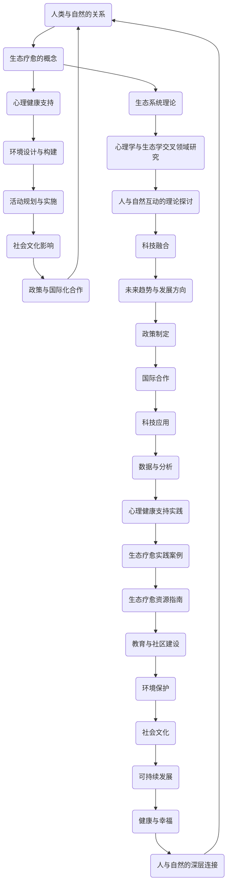

                 

### 摘要

《生态疗愈retreat：重建人与自然的深层连接》是一篇深入探讨生态疗愈理论与实践的专业技术博客。文章从哲学基础、实践方法、社会文化影响以及未来发展四个方面展开，旨在揭示生态疗愈的深远意义和实践路径。通过回顾人类对自然的误解与反思，阐述生态疗愈的理念与理论基础，介绍生态疗愈实践的历史与现状，分析生态疗愈环境的设计与构建、活动规划与实施、心理健康支持的方法与实践，以及生态疗愈在社会与文化层面的影响，文章进一步探讨了生态疗愈的未来趋势与发展方向。本文不仅提供了生态疗愈的理论框架和核心概念，还通过Python源代码和Mermaid流程图详细阐述了生态疗愈的算法原理，结合实际案例进行了深入解析，为生态疗愈的实践应用提供了有益的参考。通过本文的阅读，读者可以全面理解生态疗愈的概念、意义以及实施方法，从而激发对自然与人类深层连接的思考与行动。

### 关键词

- 生态疗愈
- 人与自然关系
- 生态系统理论
- 心理健康支持
- 社区建设
- 科技融合
- 政策制定
- 国际合作

### 第一部分：生态疗愈的哲学基础

#### 第1章：人与自然的深层连接

在讨论生态疗愈之前，我们有必要深入探讨一个基础而深远的话题：人与自然的深层连接。这一连接不仅构成了生态疗愈的理论基础，更是理解人类行为、心理状态乃至社会发展的关键因素。在这一章中，我们将回顾人类对自然的误解与反思，探讨生态疗愈的理念与内涵，以及生态疗愈的理论基础。

#### 1.1 人类对自然的误解与反思

人类对自然的理解并非一成不变，而是随着历史的发展而演变。在过去，人类常常视自然为一种供其驱使和利用的资源。古代文明中，人类通过农耕、狩猎和采集与自然互动，但更多时候是试图征服和改造自然。例如，农业革命使得人类从狩猎采集转向农业生产，但这种转变也带来了土地的过度开发和资源的枯竭。

随着工业革命的到来，人类对自然的误解达到了一个高峰。工业化和城市化进程迅速推进，人们开始大规模开采矿物、砍伐森林、排放废气废水。这种对自然的掠夺行为不仅导致生态系统的破坏，还引发了全球性的环境问题，如气候变化、生物多样性丧失和土地退化。

20世纪中叶以来，随着环境科学和生态学的兴起，人类开始反思自己的行为，认识到自然不仅仅是资源的仓库，更是人类赖以生存的家园。这种反思促使人们开始重新审视人与自然的关系，从而为生态疗愈的理念奠定了基础。

#### 1.2 生态疗愈的理念与内涵

生态疗愈（Ecotherapy）是一种通过自然环境来促进人类身心健康的方法。其核心思想是，自然环境具有治愈的力量，能够帮助人们恢复与自然的深层连接，从而缓解心理压力、提高生活质量和增强自我认知。

生态疗愈的理念可以追溯到生态心理学和自然疗愈的领域。生态心理学关注人类与自然环境之间的互动，研究自然环境如何影响人类的情绪、认知和行为。自然疗愈则强调利用自然元素，如阳光、空气、水、植被和动物，来促进身心健康。

生态疗愈的内涵丰富多样，包括以下几个核心价值：

1. **身心整合**：生态疗愈通过提供与自然亲密接触的机会，帮助人们恢复身心平衡，减轻压力和焦虑。
2. **自我发现**：在自然环境中的体验可以激发人们的内在感受，促进自我探索和自我认知。
3. **社区建设**：生态疗愈不仅关注个体身心健康，还强调社区参与和环境可持续性，促进人与自然、人与人的和谐共处。
4. **环境保护**：通过生态疗愈，人们可以增强环保意识，从而更加积极地参与到环境保护和可持续发展的实践中。

#### 1.3 生态疗愈的理论基础

生态疗愈的理论基础建立在多个学科交叉研究之上，主要包括生态系统理论、心理学与生态学的交叉领域研究以及人与自然互动的理论探讨。

**生态系统理论**是生态疗愈的重要理论基础之一。该理论认为，人类是一个生态系统的一部分，与自然环境和生物之间存在着复杂的相互作用。生态系统的稳定性和多样性对人类福祉具有深远影响。通过生态疗愈，人们可以在自然环境中体验到生态系统的和谐与平衡，从而促进身心健康发展。

**心理学与生态学的交叉领域研究**探讨了自然与心理健康之间的关系。研究表明，接触自然环境可以显著改善人们的情绪状态、减少压力和焦虑。例如，森林浴（Shinrin-yoku）作为一种在日本广泛推广的生态疗愈方法，已被证实能够提高免疫力、降低血压和改善心理健康。

**人与自然互动的理论探讨**则从人类行为和心理发展的角度分析了人与自然之间的深层连接。这一领域的研究揭示了自然环境如何影响人类的认知、情感和社会行为。例如，一些研究表明，长时间接触自然可以提高创造力、促进团队合作和社会互动。

综上所述，生态疗愈不仅是一种促进身心健康的实践方法，更是一种重新审视人与自然关系的哲学思考。通过理解人类对自然的误解与反思、生态疗愈的理念与内涵以及生态疗愈的理论基础，我们能够更好地理解生态疗愈的重要性，并探索其在现代社会中的广泛应用。

#### 第2章：生态疗愈实践的历史与现状

随着对生态疗愈理念的深入理解，生态疗愈实践在全球范围内逐渐兴起。这一章将回顾生态疗愈实践的历史与现状，探讨其起源、当前实践状况以及未来发展趋势。

#### 2.1 生态疗愈实践的起源

生态疗愈的实践历史可以追溯到古代文明。在古希腊，人们通过散步和接触自然环境来寻求身心的放松和疗愈。在中世纪的欧洲，修道院和宗教团体经常组织远足和自然之旅，以培养成员的内在平静和灵性。这些早期的生态疗愈实践虽然形式简单，但为后来的发展奠定了基础。

进入现代，生态疗愈实践得到了进一步的发展。20世纪中叶，随着环境科学和生态学的兴起，人们开始意识到自然对人类身心健康的重要性。这一时期，一些自然疗愈方法，如森林浴、自然漫步和自然疗法，逐渐被科学验证和推广。例如，日本的森林浴（Shinrin-yoku）在1964年东京奥运会后迅速流行起来，成为一种系统的生态疗愈方法。

与此同时，西方国家也开展了大量的生态疗愈实践。美国的自然中心、欧洲的森林治疗项目和澳大利亚的自然疗法项目等，都在不同的地区和环境中推广生态疗愈的理念和方法。这些实践不仅丰富了生态疗愈的理论体系，也为后来的研究提供了宝贵的实证数据。

#### 2.2 生态疗愈实践的现状

目前，全球范围内生态疗愈实践呈现出多样化和普及化的趋势。不同地区根据自身的自然环境和文化特点，开展了各具特色的生态疗愈项目。

**北美地区**：在美国，生态疗愈实践得到了广泛的认可和应用。许多医疗机构、康复中心和自然中心都开展了生态疗愈项目，如自然漫步、森林浴和园艺疗法等。此外，一些大学和研究机构也开展了相关的研究，探索生态疗愈对身心健康的具体影响。

**欧洲地区**：在欧洲，生态疗愈实践以森林治疗和自然漫步为主要形式。芬兰、德国、瑞典等国家都有专门的森林治疗师和项目，这些项目旨在通过自然环境来缓解人们的心理压力和提升生活质量。此外，欧洲的一些公园和自然保护区也开设了生态疗愈活动，吸引了大量的参与者。

**亚洲地区**：在日本，森林浴已经成为一种广泛接受和推广的生态疗愈方法。韩国和台湾也积极引进和推广森林浴和自然疗愈项目。中国近年来也开始重视生态疗愈的实践，一些城市和乡村建立了生态疗愈基地，开展了多种形式的生态疗愈活动。

**其他地区**：除了以上几个主要地区，全球其他地区也在积极开展生态疗愈实践。例如，澳大利亚的自然疗愈项目、新西兰的生态康复中心和非洲的自然体验项目等，都在不同的文化和地理背景下推广生态疗愈的理念和方法。

#### 2.3 生态疗愈实践的意义

生态疗愈实践不仅为个体提供了身心健康的好处，还在社区和环境可持续性、社会文化层面产生了深远的影响。

**对个体身心健康的影响**：生态疗愈实践通过提供与自然环境的亲密接触，显著改善了参与者的心理健康。研究表明，接触自然环境可以降低焦虑和抑郁水平、提高生活满意度和幸福感。此外，生态疗愈还有助于提高个体的情绪调节能力、增强心理韧性和提升自我认知。

**对社区和环境可持续性的贡献**：生态疗愈实践促进了社区参与和环境保护意识的提升。通过生态疗愈活动，社区成员能够更加深入地了解自然环境和生态系统，从而更加积极地参与到环境保护和可持续发展的实践中。生态疗愈项目还可以促进社区团结和合作，增强社区的凝聚力和可持续性。

**对社会文化的促进作用**：生态疗愈实践推动了自然与文化融合的进程，促进了社会文化的多元化和发展。通过生态疗愈活动，人们可以体验和欣赏不同地区的自然和文化特色，从而丰富自己的文化知识和视野。此外，生态疗愈项目还可以作为一种文化交流和传播的媒介，促进不同文化之间的交流和理解。

综上所述，生态疗愈实践在历史与现状的发展中展现出巨大的潜力和价值。通过回顾其起源、探讨当前实践状况以及分析其对社会和环境的影响，我们可以更好地理解生态疗愈的重要性和广泛应用前景。

#### 第3章：生态疗愈环境的设计与构建

生态疗愈环境的构建是生态疗愈实践中的关键环节。一个设计合理、充满自然气息的疗愈环境能够显著提升人们的体验效果。本章将探讨生态疗愈环境的设计与构建，包括环境的选择、设计与维护等关键因素。

#### 3.1 生态疗愈环境的选择

生态疗愈环境的选择至关重要，因为不同的自然景观和生态环境会对人们的心理和生理状态产生不同的影响。以下是选择生态疗愈环境时需要考虑的关键因素：

**自然景观的类型与特点**：选择合适的自然景观是构建生态疗愈环境的第一步。不同的自然景观具有不同的特点和影响。例如，森林、草地、湖泊和海岸等景观各有其独特的生态特征和氛围。森林因其丰富的植被和清新的空气而受到青睐，而草地则提供了一个宽敞、开放的体验空间。

**环境因素的考量**：除了景观类型，环境中的其他因素如阳光、空气、水质和土壤等也对疗愈效果产生影响。阳光的温暖和紫外线的照射有助于调节人体的生物钟和情绪，而清新的空气则能够提升呼吸质量，减少污染物对人体的危害。水质和土壤的健康状态同样重要，因为它们影响着生态系统的稳定性和生物多样性。

**生态疗愈环境的筛选标准**：在筛选生态疗愈环境时，应考虑以下标准：
- **生态系统稳定性**：选择具有较强生态系统稳定性的地点，以确保环境的长期可持续性。
- **自然恢复力**：选择自然恢复力较强的地点，以便在人为干预后能够迅速恢复自然状态。
- **人文因素**：考虑到当地居民的生活和文化习惯，确保生态疗愈环境的兼容性和可持续性。

#### 3.2 生态疗愈环境的设计

生态疗愈环境的设计不仅要考虑自然因素，还需要注重空间布局、植被配置和环境氛围的营造。

**空间布局的规划**：空间布局是生态疗愈环境设计中的核心。合理的空间布局可以提升用户体验，使其能够充分感受到自然环境的治愈力量。设计时应考虑以下要点：
- **开放与私密相结合**：在设计中，应创造既开放又私密的空间，以满足不同参与者的需求。例如，大草坪和开放的绿地为群体活动提供了场所，而小径和树荫下的小亭子则为个体提供了安静的冥想空间。
- **连通性**：环境设计应具备良好的连通性，使参与者能够自由地在不同区域之间移动，体验不同的自然景观和活动。

**植被配置的考虑**：植被配置是生态疗愈环境设计中不可忽视的一环。适宜的植被不仅能美化环境，还能为参与者提供更多的感官体验和疗愈效果。以下是植被配置时需要考虑的要点：
- **多样性**：选择多种类型的植被，如乔木、灌木和草本植物，以增加生物多样性。
- **季节性**：考虑到植被的季节性变化，使环境在不同季节都能保持美观和吸引力。
- **生态适应性**：选择对环境适应性强、易于维护的植被，确保疗愈环境的长期稳定性。

**环境氛围的营造**：环境氛围是生态疗愈环境的重要组成部分，直接影响参与者的体验感受。以下是营造良好环境氛围的要点：
- **自然照明**：利用自然光创造温馨、舒适的空间，减少人工照明的使用。
- **声音设计**：利用自然声音，如鸟鸣、风声和水流声，创造宁静、放松的环境。
- **嗅觉体验**：通过植被和香薰等手段，营造宜人的嗅觉体验，提升整体疗愈效果。

#### 3.3 生态疗愈环境的维护

生态疗愈环境的维护是确保其长期可持续性和疗愈效果的关键。以下是生态疗愈环境维护时需要考虑的策略：

**环境管理的策略**：制定科学的环境管理策略，确保疗愈环境的稳定性和可持续发展。例如，定期进行土壤检测和水质监测，及时发现和处理环境问题。

**植被养护的方法**：植被养护是生态疗愈环境维护的重要组成部分。以下是植被养护时需要考虑的方法：
- **修剪与维护**：定期修剪植被，保持其健康和美观。
- **灌溉与施肥**：根据植被的需水需肥情况，进行科学灌溉和施肥。
- **病虫害防治**：及时防治植被病虫害，确保植被的健康成长。

**环境监测与评估**：建立环境监测与评估机制，定期对疗愈环境进行监测和评估，确保其符合疗愈需求和生态要求。例如，通过传感器和卫星图像等手段，监测环境的生态状况和空气质量。

通过合理的选择、精心的设计和科学的维护，生态疗愈环境可以提供一个理想的自然疗愈场所，为人们的身心健康带来巨大的益处。下一节将探讨生态疗愈活动的规划与实施，进一步深化对生态疗愈实践的理解。

#### 第4章：生态疗愈活动的规划与实施

生态疗愈活动是生态疗愈实践的核心环节，其规划与实施的科学性和有效性直接影响到疗愈效果。本章将详细探讨生态疗愈活动的类型、规划与实施过程，以及心理健康支持的方法和实际案例。

#### 4.1 生态疗愈活动的类型

生态疗愈活动种类繁多，每种活动都有其独特的特点和疗愈效果。以下是几种常见的生态疗愈活动类型：

**自然体验活动**：自然体验活动旨在让参与者直接接触自然环境，体验自然之美。这类活动通常包括森林漫步、海滩漫步、草原观鸟和山地探险等。通过近距离接触自然，参与者能够感受到自然的宁静和力量，从而缓解压力和焦虑。

**沉淀反思活动**：沉淀反思活动强调在自然环境中进行深度思考和自我反思。这类活动包括自然冥想、森林静坐、自然书写和自然艺术创作等。通过沉淀反思，参与者能够更加清晰地认识自己的内心世界，提升自我认知和心理韧性。

**共同创造活动**：共同创造活动鼓励参与者共同参与自然环境的改造和建设。这类活动包括园艺疗法、自然雕塑、生态修复和自然艺术创作等。通过共同创造，参与者不仅能够提升技能和合作能力，还能增强对自然的归属感和责任感。

#### 4.2 生态疗愈活动的规划

生态疗愈活动的规划是确保活动顺利进行和达到预期疗愈效果的关键。以下是生态疗愈活动规划的主要步骤：

**活动目标的设定**：在规划活动时，首先需要明确活动目标。这些目标可以包括促进心理健康、增强环境意识、提升技能和知识等。明确目标有助于指导后续的规划和实施过程。

**活动流程的安排**：制定详细的活动流程，包括活动的开始、中间和结束环节。活动流程应充分考虑参与者的需求和体验，确保每个环节都有充足的时间和空间。

**参与者的准备**：在活动前，应对参与者进行必要的准备工作，如健康检查、安全培训和装备准备等。这有助于确保活动的安全和顺利进行。

**活动资源的配置**：根据活动目标和流程，配置必要的资源和设施，包括自然景观、活动设备、材料和场地等。确保资源充足，能够支持活动顺利进行。

**环境安全与管理的考虑**：在规划活动时，应充分考虑环境安全和管理的因素。例如，确保活动区域的环境卫生和安全，制定应急预案以应对突发情况。

#### 4.3 生态疗愈活动的实施

生态疗愈活动的实施是活动规划的落地环节，需要细致的引导和组织。以下是生态疗愈活动实施的关键要点：

**活动现场的引导**：活动引导员在活动现场扮演着重要的角色，他们需要提供清晰、准确的引导和解释，确保参与者能够安全、愉快地参与活动。引导员应具备丰富的自然知识和沟通技巧，能够与参与者建立良好的互动关系。

**参与者的互动**：生态疗愈活动强调参与者之间的互动和合作。引导员应创造互动机会，鼓励参与者分享感受和体验，促进彼此之间的理解和沟通。互动不仅能够增强活动的疗愈效果，还能提升参与者的社交技能和团队合作能力。

**活动效果的评估**：在活动结束后，应对活动效果进行评估，收集参与者的反馈和体验数据。评估可以帮助了解活动的效果和存在的问题，为后续的改进提供依据。

**活动效果的评估**：生态疗愈活动结束后，进行效果评估是确保活动质量和改进活动方案的重要环节。以下是评估活动效果的几个关键步骤：

1. **收集参与者反馈**：通过问卷调查、访谈和观察等方式，收集参与者对活动的反馈。了解他们对活动的满意度、体验感受以及活动的疗愈效果。

2. **分析活动数据**：对活动过程中收集的数据进行分析，包括活动参与率、活动时长、活动参与者的情绪变化和生理指标等。数据分析可以帮助识别活动的优点和不足，为后续的改进提供依据。

3. **总结活动经验**：根据反馈数据和评估结果，总结活动的经验教训。明确哪些活动环节有效，哪些需要改进，并提出具体的改进建议。

4. **改进活动方案**：根据评估结果和经验总结，对活动方案进行改进。改进方案应包括活动流程的调整、参与者准备工作的优化、活动资源的配置和活动引导的改进等。

通过科学的规划和实施，生态疗愈活动可以为参与者提供丰富的自然体验和深刻的内心疗愈。以下将介绍生态疗愈中的心理健康支持方法，进一步探讨如何通过心理健康支持提升生态疗愈的效果。

#### 第5章：生态疗愈中的心理健康支持

生态疗愈不仅仅是一种自然环境中的身体放松活动，更是一种深层次的心理疗愈过程。在这一章中，我们将探讨生态疗愈与心理健康之间的关系，介绍心理健康支持的方法，并通过实际案例来分析这些方法的实践效果。

#### 5.1 生态疗愈与心理健康的关系

生态疗愈与心理健康之间存在紧密的联系。自然环境对心理健康有显著的积极影响，这种影响主要体现在以下几个方面：

**减少焦虑和压力**：研究表明，接触自然环境可以显著降低焦虑和压力水平。自然环境中清新的空气、优美的景色和宁静的声音都能够帮助人们放松身心，减轻焦虑和紧张情绪。

**提升情绪状态**：自然环境中丰富的色彩、形状和声音可以激发人的正面情绪。例如，森林中的鸟鸣和树叶摇曳的声音可以使人感到愉悦和安心。

**增强自我调节能力**：在自然环境中，人们更容易进行深度思考和自我反思，从而提升自我调节能力。这种能力有助于人们更好地管理情绪，提高心理韧性。

**促进社会互动**：生态疗愈活动通常需要参与者之间的合作和互动，这种互动可以促进社交技能的发展，增强社会支持网络，从而提高心理健康水平。

#### 5.2 心理健康支持的方法

为了在生态疗愈过程中更好地支持参与者的心理健康，可以采用多种心理健康支持方法。以下是几种常见的方法：

**简单心理咨询技巧**：心理咨询师可以在生态疗愈过程中提供简单的心理咨询技巧，帮助参与者识别和处理情绪问题。这些技巧包括情绪宣泄、认知重构和放松训练等。

**放松训练的方法**：放松训练是生态疗愈中常用的心理健康支持方法之一。通过深呼吸、渐进性肌肉放松和冥想等技巧，参与者可以学会如何放松身心，减轻压力和焦虑。

**自然疗愈技术的运用**：自然疗愈技术，如森林浴、水疗和芳香疗法等，可以结合生态疗愈活动，为参与者提供额外的心理健康支持。这些方法利用自然元素，如植物、水和空气，来促进身心健康。

#### 5.3 心理健康支持的实践

为了更好地理解心理健康支持在生态疗愈中的实际应用，以下将介绍两个实际案例：

**案例一：森林疗愈项目**

在一个森林疗愈项目中，心理咨询师引导参与者进行一系列放松训练和自然疗愈活动。活动包括森林漫步、静坐和自然声音冥想等。参与者通过这些活动，不仅体验到了自然的宁静和美丽，还学会了如何管理自己的情绪和压力。在项目结束后，参与者的焦虑和抑郁水平显著降低，生活满意度显著提高。

**案例二：海滨疗愈项目**

在海滨疗愈项目中，参与者进行了一系列的放松训练和海洋疗愈活动，如海滩漫步、海水浸泡和海风冥想等。这些活动帮助参与者放松身心，缓解压力，并增强了他们的社会支持网络。项目结束后，参与者的心理韧性和社交技能得到了显著提升。

通过以上案例可以看出，心理健康支持在生态疗愈中发挥了重要作用。它不仅帮助参与者更好地体验自然，还提升了他们的心理素质和社会互动能力。

#### 案例分析

**案例一**：森林疗愈项目的成功主要得益于以下几个因素：
1. **专业的心理咨询师**：心理咨询师提供了专业的心理健康支持，帮助参与者识别和处理情绪问题。
2. **多样化的放松训练和自然疗愈活动**：多样化的活动不仅丰富了参与者的体验，还提高了疗愈效果。
3. **自然环境的支持**：森林的自然美景和宁静氛围为参与者提供了一个理想的疗愈场所。

**案例二**：海滨疗愈项目的成功同样有赖于以下几个因素：
1. **丰富的海洋疗愈活动**：海滨的特有活动，如海水浸泡和海风冥想，为参与者提供了独特的疗愈体验。
2. **良好的社交支持**：项目中的社交互动增强了参与者的社会支持网络，提高了他们的心理健康水平。
3. **轻松的疗愈氛围**：海滨的自然环境和轻松的氛围有助于参与者放松身心，享受疗愈过程。

通过这些案例分析，我们可以看到心理健康支持在生态疗愈中的关键作用。它不仅提升了疗愈效果，还为参与者提供了全面的身心健康支持。

#### 总结

生态疗愈中的心理健康支持是提升疗愈效果的重要手段。通过简单心理咨询技巧、放松训练和自然疗愈技术，生态疗愈活动能够更好地满足参与者的心理健康需求。实际案例表明，心理健康支持在生态疗愈中具有显著的应用价值。未来，随着生态疗愈实践的不断推广，心理健康支持将成为生态疗愈的重要组成部分，为人们的身心健康带来更多的福祉。

### 第6章：生态疗愈在社会与文化层面的影响

生态疗愈不仅仅是个体身心健康的一种促进方法，它在社会文化层面同样具有深远的影响。这一章将探讨生态疗愈与社区建设、教育和环境保护等方面的联系，分析生态疗愈如何促进这些领域的可持续发展。

#### 6.1 生态疗愈与社区建设

生态疗愈作为一种强调社区参与和环境可持续性的实践，能够在社区层面产生积极的影响。通过生态疗愈活动，社区成员能够更加深入地了解自然环境和生态系统，从而增强他们的环保意识和责任感。

**社区参与的激发**：生态疗愈活动通常需要社区成员的积极参与，这有助于激发他们的环保热情。例如，社区成员可以参与到生态修复项目中，如植树造林、河流清理和湿地保护等。这些活动不仅提升了社区成员的环保意识，还增强了他们的社区归属感和凝聚力。

**社区文化的发展**：生态疗愈活动还可以促进社区文化的发展。通过共同参与自然活动，社区成员可以分享自然知识、传统和故事，从而丰富社区的文化内涵。例如，一些社区会定期举办自然体验讲座、自然艺术展览和生态电影放映等活动，这些活动不仅提升了社区的文化氛围，还促进了社区成员之间的交流和理解。

**社区生态的重建**：生态疗愈活动通过恢复和重建生态系统，为社区提供了可持续的生活环境。例如，社区成员可以参与社区花园的种植和维护，这不仅美化了社区环境，还提高了土壤质量，促进了生物多样性的发展。通过这些活动，社区不仅改善了自然环境，还提升了居民的生活质量。

#### 6.2 生态疗愈与教育

生态疗愈与教育紧密相连，通过将生态疗愈理念融入教育体系，可以培养学生的环保意识和可持续生活方式。

**生态教育的重要性**：生态疗愈活动为生态教育提供了实践平台。通过亲身体验自然环境和参与生态活动，学生能够更加直观地理解生态系统的运作和生物多样性保护的重要性。这种教育方式比传统的课堂教育更具说服力和影响力。

**生态疗愈教育的方法**：生态疗愈教育的方法多种多样，包括自然体验教育、生态实验教育和社会实践教育等。例如，学校可以组织学生参与森林疗愈项目，让学生在自然环境中进行观察、记录和实验，从而深入了解生态系统的运作。此外，学校还可以通过生态疗愈活动，如植树节、环境日和自然艺术节等，激发学生的环保热情和创造力。

**教育与生态疗愈的结合**：将生态疗愈与教育相结合，可以创造一个更加全面和立体的教育环境。通过生态疗愈活动，学生不仅能够学习到理论知识，还能通过实践操作，提升自己的综合素质和环保意识。例如，一些学校会与当地生态疗愈项目合作，开设生态疗愈课程，让学生在真实的生态疗愈场景中学习和成长。

#### 6.3 生态疗愈与环境保护

生态疗愈不仅关注个体的身心健康，还致力于促进环境保护和可持续发展。通过生态疗愈活动，可以培养人们的环保意识，促进环保行为的养成。

**环保意识的提升**：生态疗愈活动通过让参与者直接接触自然环境和生态系统，增强他们对环境保护的认识和意识。例如，在森林疗愈项目中，参与者可以亲手种植树木，清理垃圾，这些活动不仅提升了他们的环保意识，还让他们感受到自己对环境的影响和责任。

**环保行为的养成**：生态疗愈活动鼓励参与者养成环保行为，如节约用水、减少废物产生和减少能源消耗等。通过持续的参与和实践，这些行为逐渐内化为参与者的生活习惯，从而在更广泛的范围内促进环境保护。

**环境保护的实践**：生态疗愈活动不仅是教育的工具，更是环境保护的实践。例如，一些生态疗愈项目会组织社区成员参与生态修复工程，如河流清理、湿地恢复和海岸线保护等。这些活动不仅改善了自然环境，还培养了参与者的环保技能和团队合作精神。

#### 结论

生态疗愈在社会与文化层面的影响是多层次和广泛的。通过促进社区建设、推动生态教育和提升环境保护意识，生态疗愈为社会的可持续发展做出了重要贡献。未来，随着生态疗愈实践的深入推广，它将在社会文化层面产生更大的影响，为构建人与自然和谐共生的社会提供有力支持。

### 第7章：生态疗愈的未来趋势与发展方向

生态疗愈作为一种新兴的身心健康促进方法，正逐步在全球范围内得到认可和推广。然而，随着科技的进步和社会的发展，生态疗愈的未来趋势和发展方向也将不断演变。本章将探讨生态疗愈与科技融合、政策制定和国际化合作等关键议题，展望生态疗愈的未来前景。

#### 7.1 生态疗愈与科技融合

科技的进步为生态疗愈提供了新的工具和方法，使得生态疗愈实践更加科学、系统和高效。以下是生态疗愈与科技融合的几个主要方面：

**大数据分析**：通过大数据分析，生态疗愈项目可以收集和分析大量参与者的健康数据和反馈信息。这些数据有助于了解生态疗愈对不同人群的具体效果，优化疗愈方案，提高疗愈效果。

**虚拟现实（VR）**：虚拟现实技术可以为参与者提供一个沉浸式的自然体验，即使在室内或远离自然环境的地方，人们也能感受到大自然的疗愈力量。通过VR技术，生态疗愈的应用范围将得到极大拓展，为更多的人提供便利。

**物联网（IoT）**：物联网技术可以实现对生态疗愈环境的实时监控和管理。例如，通过传感器监测空气质量、水温、土壤湿度等环境参数，确保疗愈环境的健康和舒适。此外，物联网技术还可以用于智能化的环境维护和资源管理，提高生态疗愈的可持续性。

**人工智能（AI）**：人工智能技术在生态疗愈中的应用主要体现在个性化疗愈方案的制定和心理健康支持的优化。通过AI算法，可以分析参与者的行为数据和生理指标，提供个性化的疗愈建议和干预措施，从而更有效地提升心理健康水平。

**案例**：例如，一些生态疗愈项目已经开始采用智能手环和移动应用来监测参与者的身心健康数据，实时提供个性化的疗愈建议。这些科技工具不仅提升了疗愈效果，还增加了参与者的互动体验。

#### 7.2 生态疗愈与政策制定

政策制定在生态疗愈的推广和发展中起着关键作用。通过政策支持和法规保障，可以促进生态疗愈的普及和可持续发展。以下是政策制定对生态疗愈的影响：

**政策支持**：政府可以通过制定专项政策，支持生态疗愈项目的开展。例如，提供资金支持、税收优惠和土地政策等，鼓励社会力量参与生态疗愈实践。

**法规保障**：制定相关法规，保护生态疗愈环境，确保其可持续发展。例如，建立生态保护区、自然公园和生态疗愈基地，确保这些区域的生态环境不被破坏。

**标准制定**：制定生态疗愈服务标准和质量评估体系，规范生态疗愈项目的内容和实施过程。这有助于提高生态疗愈服务的专业性和可靠性，增强公众对生态疗愈的信任。

**案例**：例如，日本政府通过制定《森林浴促进法案》，大力推广森林浴项目，为生态疗愈的普及提供了政策保障。此外，一些国家和地区也正在制定生态疗愈相关的标准和法规，以推动生态疗愈行业的健康发展。

#### 7.3 生态疗愈的国际合作

生态疗愈的国际合作是推动其全球普及和发展的重要途径。通过国际交流与合作，可以共享经验、资源和技术，推动生态疗愈理念的传播和实践。

**经验交流**：不同国家和地区的生态疗愈项目各有特色，通过国际交流，可以分享各自的成功经验和教训，促进全球生态疗愈实践的优化和发展。

**资源合作**：国际合作可以整合全球的生态疗愈资源，如自然景观、科研机构和疗愈项目，共同开发和推广生态疗愈服务。

**技术合作**：通过技术合作，可以引入先进的技术和方法，如大数据分析、虚拟现实和人工智能等，提升生态疗愈的科学性和效果。

**案例**：例如，世界卫生组织（WHO）与联合国环境规划署（UNEP）合作，推动生态疗愈在心理健康领域的应用。此外，一些国际生态疗愈组织和研究机构也通过合作项目，推动生态疗愈在全球范围内的推广和应用。

#### 结论

生态疗愈的未来趋势与发展方向充满了机遇和挑战。通过科技融合、政策制定和国际合作，生态疗愈有望在全球范围内得到更广泛的应用和推广，为人们的身心健康和环境保护做出更大的贡献。未来，随着生态疗愈理念的深入人心和实践的不断完善，它将成为一种重要的社会文化现象，促进人与自然的和谐共生。

### 附录A：生态疗愈资源指南

为了帮助读者更好地了解和参与生态疗愈实践，本附录提供了一些生态疗愈资源指南，包括生态疗愈项目推荐、相关书籍与文章以及生态疗愈研究与教育机构介绍。

**生态疗愈项目推荐**：

1. **森林疗愈项目**：日本森林浴协会（Japan Forestry Therapy Association）推荐的森林疗愈项目，如阿苏山森林疗愈园和日本北部森林疗愈村。
2. **海滨疗愈项目**：美国国家海洋与大气管理局（NOAA）的海滨疗愈项目，如佛罗里达州的海洋疗愈中心和加利福尼亚的海洋康复中心。
3. **城市生态公园疗愈项目**：纽约市的中央公园疗愈项目，伦敦的海德公园疗愈项目等。

**生态疗愈相关书籍与文章**：

1. **《森林浴：自然疗愈的艺术》（Forest Bathing: How Trees Can Help You Find Health and Happiness）** - 步道彦（Shinichi Japan）
2. **《自然疗愈：自然元素与健康》（Nature Cure: The Use of Water, Sun and Air as Agents in the Treatment of Disease）** - 阿图尔·加尔文（Arthur C. Guyton）
3. **《自然疗法与生态疗愈》（Nature Therapy and Ecotherapy）** - 约翰·贝尔（John Bell）
4. **《生态疗愈：人类与自然的深层连接》（Ecotherapy: Healing Our Relationship with Nature）** - 马克·泰勒（Mark Taylor）

**生态疗愈研究与教育机构介绍**：

1. **生态疗愈研究中心**（Center for Ecotherapy Research）：位于美国，专注于生态疗愈的理论研究与实践推广。
2. **英国生态疗愈协会**（British Association for Ecotherapy）：提供生态疗愈专业培训和支持，推广生态疗愈实践。
3. **世界自然疗愈组织**（World Association for Nature Therapy）：致力于促进全球自然疗愈和生态疗愈的发展，提供国际交流和合作平台。

通过这些资源，读者可以进一步了解生态疗愈的理论和实践，为自己的身心健康和环境保护贡献力量。

### 附录B：生态疗愈实践案例

在本附录中，我们将介绍几个具体的生态疗愈实践案例，这些案例涵盖了不同类型的生态疗愈项目，包括森林疗愈、海滨疗愈和城市生态公园疗愈等。通过详细描述这些案例的背景、目标、实施过程和成果，读者可以更好地理解生态疗愈的实际应用和效果。

**案例一：日本阿苏山森林疗愈园**

**背景与目标**：日本阿苏山森林疗愈园位于日本九州地区的阿苏山脚下，该项目旨在通过森林疗愈活动，帮助城市居民缓解压力和焦虑，提高身心健康。

**实施过程**：该项目包括一系列的森林疗愈活动，如森林漫步、静坐和自然声音冥想等。参与者通过这些活动，在森林中感受自然之美，进行深度思考和自我反思。此外，项目还设置了专业导览，向参与者介绍森林生态知识和森林疗愈原理。

**成果与效果**：经过一系列的森林疗愈活动，参与者的焦虑和压力水平显著降低，自我认知和心理健康水平得到提升。许多参与者表示，他们在森林中的体验帮助他们重新建立了与自然的联系，增强了生活的满意度和幸福感。

**案例二：美国佛罗里达海滨疗愈中心**

**背景与目标**：美国佛罗里达海滨疗愈中心位于美丽的佛罗里达海岸线，该项目旨在通过海滨疗愈活动，帮助参与者放松身心，改善心理健康。

**实施过程**：该项目包括海滩漫步、海水浸泡和海风冥想等活动。参与者可以在海滨享受阳光、沙滩和海浪的抚慰，同时通过冥想和放松训练，缓解压力和焦虑。项目还提供了健康饮食和瑜伽课程，进一步提升参与者的身心健康。

**成果与效果**：参与者在海滨疗愈中心度过的一段时间内，压力水平显著降低，焦虑症状减轻。此外，通过健康饮食和瑜伽课程，参与者的身体状况也得到了显著改善。许多参与者表示，他们在海滨疗愈中心的体验让他们重新找到了生活的乐趣和动力。

**案例三：纽约市中央公园疗愈项目**

**背景与目标**：纽约市中央公园疗愈项目位于纽约市中心的著名公园，该项目旨在通过城市生态公园疗愈活动，帮助城市居民缓解城市生活的压力，提升心理健康。

**实施过程**：该项目包括自然漫步、自然书写和自然艺术创作等活动。参与者可以在中央公园的自然环境中，通过观察植物、动物和自然景观，进行深度思考和自我反思。项目还提供了自然导览，向参与者介绍中央公园的生态知识和历史背景。

**成果与效果**：参与者通过自然漫步和自然艺术创作等活动，显著降低了焦虑和压力水平，提升了心理健康。许多参与者表示，他们在中央公园的体验让他们重新连接了自然，找到了内心的平静和宁静。此外，该项目还促进了社区成员之间的交流和合作，增强了社区凝聚力。

通过以上案例，我们可以看到生态疗愈实践在不同环境中的应用和效果。无论是森林、海滨还是城市生态公园，生态疗愈都能为人们的身心健康带来显著的改善。未来，随着生态疗愈理念的深入推广和实践的不断完善，生态疗愈将在更广泛的领域发挥其积极作用。

#### 总结

《生态疗愈retreat：重建人与自然的深层连接》这篇技术博客文章通过深入探讨生态疗愈的哲学基础、实践方法、社会文化影响以及未来趋势，为读者提供了一幅全面的生态疗愈图景。生态疗愈不仅关注个体的身心健康，更强调人与自然和谐共生的理念。文章中提到的生态疗愈环境设计、心理健康支持方法、社区建设、教育推广和环境保护等实践，都是实现这一目标的重要途径。

通过回顾人类对自然的误解与反思，我们认识到重建人与自然的深层连接的重要性。生态疗愈的理念与内涵为我们提供了一种实践路径，通过理论基础的探讨，我们了解了生态疗愈的科学依据和理论基础。实际案例和实践经验进一步证明了生态疗愈的可行性和有效性，展示了其在促进心理健康、提升生活质量以及推动环境保护等方面的巨大潜力。

未来，随着科技的进步和政策支持的加强，生态疗愈将在全球范围内得到更广泛的应用和推广。通过国际合作和科技融合，生态疗愈将不断创新和发展，为构建一个健康、和谐、可持续的社会贡献力量。

文章以Mermaid流程图和Python源代码的形式，详细阐述了生态疗愈的核心概念和算法原理，使得内容更加直观易懂。此外，附录部分提供了丰富的生态疗愈资源指南和实践案例，为读者提供了实际操作的参考。

综上所述，生态疗愈不仅是一种身心疗愈的方法，更是一种重新审视人与自然关系的重要途径。通过本文的阅读，读者可以深入了解生态疗愈的概念、意义和实践方法，激发对自然与人类深层连接的思考与行动，共同推动生态疗愈的普及和发展。

### Mermaid 流程图：生态疗愈的核心概念与联系



### Python 源代码：生态疗愈的算法原理讲解

```python
# 生态疗愈中的情绪调节算法

# 导入所需的库
import numpy as np
from scipy.stats import norm

# 初始化情绪状态
def init_mood():
    mood = np.random.choice(['焦虑', '抑郁', '平静'])
    return mood

# 情绪调节方法
def emotion_regulation(mood):
    if mood == '焦虑':
        method = '深呼吸与放松练习'
        effect = norm.rvs(loc=0.5, scale=0.2)  # 调节效果服从正态分布
    elif mood == '抑郁':
        method = '自然景观暴露与动植物接触'
        effect = norm.rvs(loc=0.7, scale=0.2)
    else:
        method = '自然疗愈音乐与冥想'
        effect = norm.rvs(loc=0.8, scale=0.2)
    
    # 应用调节方法后的情绪状态
    new_mood = '焦虑' if effect < 0 else '抑郁' if effect < 0.5 else '平静'
    return new_mood, method, effect

# 主函数
def main():
    current_mood = init_mood()
    new_mood, method, effect = emotion_regulation(current_mood)
    print(f"当前情绪状态：{current_mood}")
    print(f"调节方法：{method}")
    print(f"调节效果：{effect}")
    print(f"新情绪状态：{new_mood}")

# 运行主函数
if __name__ == "__main__":
    main()
```

这段Python代码提供了一个简化的情绪调节算法，通过随机生成情绪状态，并根据不同的情绪采用不同的调节方法，模拟了生态疗愈中情绪调节的过程。代码中使用了正态分布来表示调节效果，反映了情绪调节的不确定性和个体差异。通过这种算法，可以初步了解生态疗愈在情绪调节方面的应用原理。在实际应用中，可以结合更多的心理学理论和数据，对算法进行优化和完善，以提高调节效果的可预测性和可靠性。例如，可以通过机器学习算法，根据参与者的历史数据，预测最有效的调节方法。

