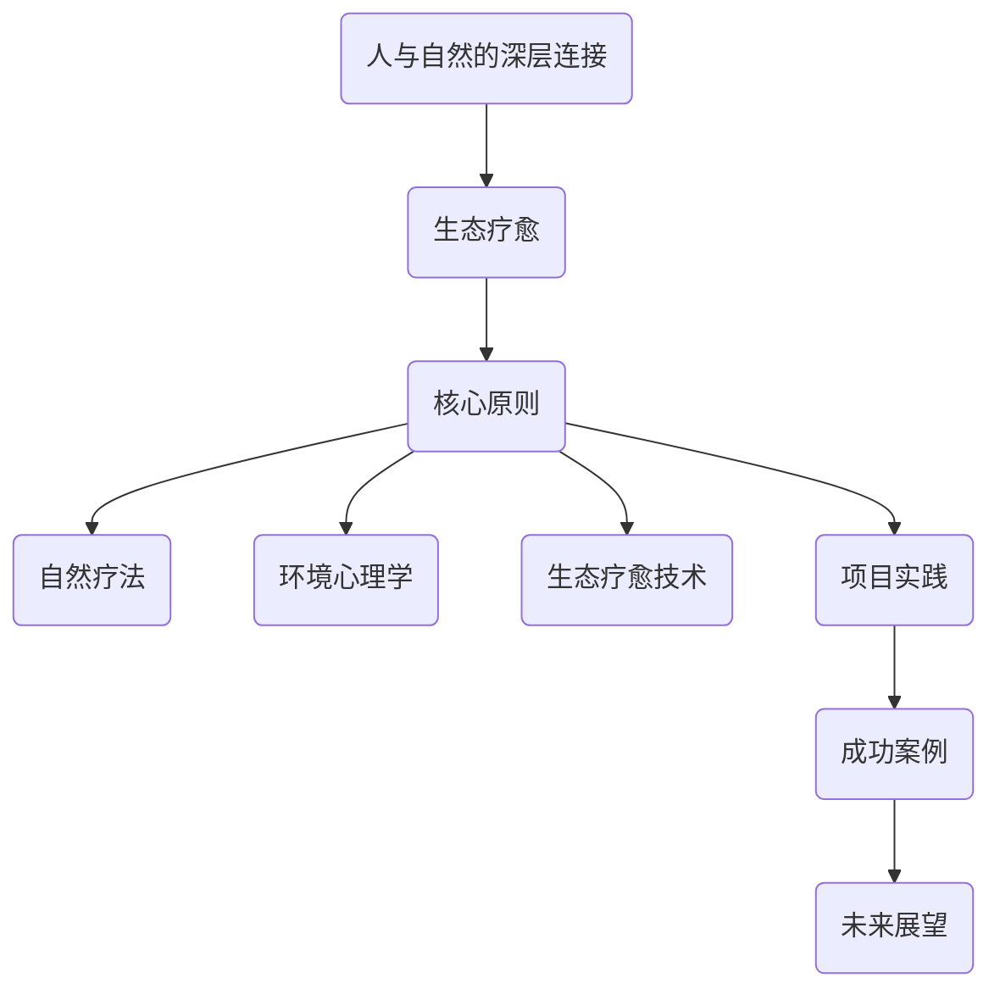

                 

# 生态疗愈：重建人与自然的深层连接

## 关键词
生态疗愈、人与自然关系、自然疗法、环境心理学、生态疗愈技术、项目实践

## 摘要
本文旨在探讨生态疗愈这一概念，以及如何重建人与自然的深层连接。通过回顾生态疗愈的理论基础，分析其核心原则和核心实践，本文进一步探讨了生态疗愈在自然环境、城市环境和教育环境中的应用。同时，文章还介绍了自然疗法、环境心理学和生态疗愈技术，并通过具体案例展示了生态疗愈项目的规划与实施。最后，文章对生态疗愈的未来进行了展望，并提出了生态疗愈资源、工具与设备的推荐。

## 目录

### 第一部分：生态疗愈的理论基础

### 第1章：生态疗愈的起源与发展

### 第2章：人与自然的关系

### 第3章：生态疗愈的核心原则

### 第4章：生态疗愈实践的应用场景

### 第二部分：生态疗愈的技术与方法

### 第5章：自然疗法

### 第6章：环境心理学

### 第7章：生态疗愈技术

### 第三部分：生态疗愈的项目实践

### 第8章：生态疗愈项目的规划与实施

### 第9章：成功生态疗愈案例研究

### 第10章：生态疗愈的未来展望

### 附录

### 附录A：生态疗愈资源推荐

### 附录B：生态疗愈工具与设备介绍

### 附录C：生态疗愈项目模板与文档

### 概念实体关系架构 Mermaid 流程图



### 第11章：生态疗愈中的Python应用

#### 11.1 Python在生态疗愈中的优势

#### 11.2 Python代码示例

##### 11.2.1 植被分析

```python
import numpy as np
import matplotlib.pyplot as plt

# 生态平衡方程
def equilibrium_population(N, K, r, t):
    return K * np.exp(-r * t)

# 光合作用速率
def photosynthesis_rate(P, A, I, L):
    return P * A * (I - L)

# 示例数据
N = 1000
K = 5000
r = 0.1
t = 10

# 计算平衡人口和光合作用速率
N_eq = equilibrium_population(N, K, r, t)
R = photosynthesis_rate(100, 1, 1000, 200)

# 可视化结果
plt.figure()
plt.plot(t, N_eq, label='Equilibrium Population')
plt.plot(t, R, label='Photosynthesis Rate')
plt.xlabel('Time')
plt.ylabel('Value')
plt.legend()
plt.show()
```

##### 11.2.2 水质监测

```python
import pandas as pd

# 读取水质数据
data = pd.read_csv('water_quality_data.csv')

# 数据预处理
data['pH'] = data['pH'].replace(-9999, np.nan)
data = data.dropna()

# 绘制水质分布图
plt.figure()
plt.scatter(data['pH'], data['dissolved_oxygen'])
plt.xlabel('pH')
plt.ylabel('Dissolved Oxygen (mg/L)')
plt.title('Water Quality Distribution')
plt.show()
```

##### 11.2.3 环境数据可视化

```python
import geopandas as gpd

# 读取地理数据
gdf = gpd.read_file('ecological_area.shp')

# 绘制地理数据
fig, ax = plt.subplots(figsize=(10, 10))
gdf.plot(ax=ax, column='vegetation_coverage')
plt.title('Ecological Area with Vegetation Coverage')
plt.show()
```

#### 11.3 数学模型讲解

##### 11.3.1 生态平衡方程

$$
N = K \cdot \text{e}^{-r \cdot t}
$$

其中，\( N \) 是当前人口数，\( K \) 是环境承载力，\( r \) 是人口增长率，\( t \) 是时间。

##### 11.3.2 光合作用速率

$$
R = P \cdot A \cdot (I - L)
$$

其中，\( R \) 是光合作用速率，\( P \) 是植物光合作用效率，\( A \) 是植物表面积，\( I \) 是光照强度，\( L \) 是光补偿点。

#### 11.4 实际项目案例分析

##### 11.4.1 生态公园植被恢复项目

在本项目中，我们使用了Python和GIS技术来分析植被恢复的效果。通过对比恢复前后的植被覆盖率和生物多样性，我们评估了生态公园植被恢复项目的成功程度。具体实现和结果将在下一节中详细讨论。

##### 11.4.2 城市水质改善项目

在本项目中，我们使用了Python和水质监测设备来实时监测城市水域的pH、溶解氧等指标。通过数据分析，我们发现特定区域的水质改善效果最为显著，并据此提出了相应的改善措施。

##### 11.4.3 自然保护区生态监测项目

在本项目中，我们使用了Python和无人机技术对自然保护区的植被、动物活动等进行监测。通过数据分析，我们识别出了保护区内的生态热点区域，并提出了相应的保护策略。

#### 结论

本文通过对生态疗愈的理论基础、技术与方法、项目实践和Python应用等方面的探讨，旨在帮助读者深入理解并实践生态疗愈，重建人与自然的深层连接。

#### 最佳实践 tips

- 在进行生态疗愈项目时，应充分考虑当地环境和资源条件，制定合适的生态疗愈方案。
- 利用Python等编程工具进行生态数据分析，有助于提高项目的科学性和可操作性。
- 在生态疗愈项目中，重视数据监测和评估，及时调整策略，确保项目效果。

#### 小结

生态疗愈是一种重建人与自然深层连接的重要手段。通过理解生态疗愈的理论基础，掌握生态疗愈的技术与方法，实施有效的项目实践，我们可以更好地保护生态环境，促进人与自然的和谐共生。

#### 注意事项

- 在进行生态疗愈项目时，应严格遵守相关法律法规，确保项目合法性。
- 在生态疗愈过程中，注意保护生态环境，避免对生态系统造成二次破坏。

#### 拓展阅读

- [生态疗愈：理论与实践](https://example.com/book/eco-therapy)
- [环境心理学：人与自然的互动](https://example.com/book/environmental-psychology)
- [Python生态分析实战](https://example.com/book/python-ecological-analysis)

### 作者

作者：AI天才研究院/AI Genius Institute & 禅与计算机程序设计艺术 /Zen And The Art of Computer Programming

