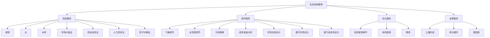

                 

### 文章标题

“生态系统服务定价：自然资本的经济学模型”

### 关键词

生态系统服务、自然资本、经济学模型、定价方法、可持续发展

### 摘要

本文旨在探讨生态系统服务定价的理论与实践，特别是自然资本的经济学模型。通过对生态系统服务概念的阐述，本文介绍了自然资本的定义及其与人类福祉的关系。接着，文章分析了生态系统服务定价的理论基础，包括外部性和公共物品的概念。在此基础上，文章详细探讨了多种生态系统服务定价方法，如市场交易定价法、替代市场定价法、资源费用定价法、碎片化定价法和基于成本效益的定价法，并结合实际案例进行了解读。最后，文章讨论了生态系统服务定价的应用与实践，以及未来发展的趋势和挑战。本文旨在为生态系统服务定价提供系统的理论指导和实践参考。

## 第一部分：生态系统服务定价的背景与理论基础

### 1.1 生态系统服务概述

#### 1.1.1 生态系统服务的概念与分类

生态系统服务是指自然生态系统为人类社会提供的各种有益功能和服务。这些服务可以分为以下几类：

1. **供给服务**：包括食物、水、木材、药材等自然资源，它们是直接供给人类生产和生活的必需品。
2. **调节服务**：包括气候调节、水资源调节、污染降解等，这些服务有助于维持人类生活的稳定性。
3. **文化服务**：包括自然景观的美学价值、休闲旅游、教育等，它们丰富了人类的精神生活。
4. **支撑服务**：包括土壤形成、养分循环、基因库等，这些服务是其他所有生态系统服务的基础。

#### 1.1.2 生态系统服务的重要性

生态系统服务对人类社会的贡献不可估量。例如，森林通过光合作用吸收二氧化碳，缓解全球气候变化；湿地和河流通过净化水质，提供清洁饮用水；土壤通过保持水分和养分，支持农业生产。此外，生态系统服务还提供了丰富的生物多样性，这对于维持地球生态平衡至关重要。因此，保护和管理好生态系统服务是实现可持续发展的重要途径。

#### 1.1.3 生态系统服务面临的问题与挑战

尽管生态系统服务对人类福祉至关重要，但它们面临着诸多问题和挑战。首先，人类活动的加剧导致了生物多样性的丧失，许多物种面临灭绝的风险。其次，水资源污染和过度开采使得许多地区的生态系统服务功能减弱。此外，气候变化也对生态系统服务产生了严重影响，导致极端天气事件频发，生态系统服务的不稳定性增加。最后，生态系统服务定价机制的不完善，使得许多服务未能得到合理的价值评估和补偿，进一步加剧了生态系统服务的退化。

### 1.2 自然资本的概念与价值

#### 1.2.1 自然资本的定义

自然资本是指地球上所有自然资源的总和，包括生物多样性、土地、水资源、大气等。它是一个国家或地区经济、社会和文化发展的物质基础。自然资本不同于物质资本（如建筑物、机器等）和人力资本（如教育、技能等），其特点是无形、可再生、有限性和复杂性。

#### 1.2.2 自然资本的价值评估方法

自然资本的价值评估是生态系统服务定价的关键环节。常用的评估方法包括：

1. **市场价值法**：基于市场交易数据来估算自然资源的价值。
2. **机会成本法**：通过比较不同利用方式的收益来估算自然资源的价值。
3. **人力资本法**：基于人类为获得自然资源所付出的劳动和成本来估算其价值。
4. **影子价格法**：通过计算自然资源替代品的成本来估算其价值。

#### 1.2.3 自然资本与人类福祉的关系

自然资本对人类福祉具有深远的影响。一方面，自然资本为人类提供了生存所需的自然资源，如食物、水和能源。另一方面，自然资本也提供了许多调节服务，如气候调节、水资源调节和污染降解，这些服务有助于维持人类生活的稳定性。此外，自然资本还具有文化服务价值，如自然景观的美学价值和休闲旅游机会。因此，保护和管理好自然资本是实现可持续发展和提高人类福祉的必要条件。

### 1.3 生态系统服务定价的理论基础

#### 1.3.1 经济学中的外部性概念

外部性是指某个体（生产者或消费者）的经济活动对其他个体产生了影响，但这种影响并未在市场价格中体现。在生态系统服务中，外部性非常普遍。例如，农民种植树木提供气候调节服务，但这些服务并未在市场上定价，导致农民没有足够的激励去种植更多的树木。

#### 1.3.2 公共物品与私人物品的区别

公共物品是指供所有人免费享用的物品，如国防、路灯等，而私人物品是指只有拥有者才能享用的物品，如食物、衣物等。生态系统服务通常具有公共物品的特征，如气候调节服务，每个人都可以免费享受，但市场机制无法有效分配这些服务。

#### 1.3.3 生态系统服务定价的理论框架

生态系统服务定价的理论框架包括以下几个方面：

1. **成本效益分析**：通过比较提供生态系统服务的成本和效益，来确定服务的价格。
2. **市场交易定价**：基于市场供需关系来确定生态系统服务的价格。
3. **替代市场定价**：当市场交易数据不足时，通过替代市场的数据来确定服务价格。
4. **基于成本的定价**：通过计算提供生态系统服务的成本来确定价格。

通过这些理论框架，可以为生态系统服务定价提供科学依据，从而更好地管理和保护自然资本。

### 1.4 核心概念与联系

为了更好地理解生态系统服务定价，我们需要建立核心概念之间的关系架构。以下是一个简化的 Mermaid 流程图：



### 1.5 核心算法原理讲解

为了更深入地理解生态系统服务定价，我们可以使用 Python 源代码来演示一个简单的市场交易定价法的实现。以下是一个基于供需关系的简单模型：

```python
# 假设某种生态系统服务的供给量和需求量如下

supply_quantity = 100  # 供给量
demand_quantity = 150  # 需求量
price_per_unit = 10  # 初始价格

# 当供给量小于需求量时，价格会上升
if supply_quantity < demand_quantity:
    price_per_unit += 1

# 当供给量大于需求量时，价格会下降
elif supply_quantity > demand_quantity:
    price_per_unit -= 1

# 输出定价结果
print(f"最终定价：{price_per_unit}元/单位")

# 结合数学模型和公式，我们可以更准确地计算价格
# 假设供需函数为：Qd = a - bP（需求量与价格呈负相关）
# Qs = c + dP（供给量与价格呈正相关）
# 平衡价格为：a - bP = c + dP
# 解得：P = (a - c) / (b + d)

a = 200  # 需求函数的截距
b = 0.5  # 需求函数的斜率
c = 100  # 供给函数的截距
d = 0.3  # 供给函数的斜率

balance_price = (a - c) / (b + d)
print(f"平衡定价：{balance_price}元/单位")
```

通过以上代码，我们可以看到如何根据供需关系来计算生态系统服务的价格。这不仅有助于理解市场交易定价法的基本原理，还可以为实际应用提供参考。

### 1.6 项目实战

为了更好地理解生态系统服务定价，我们可以通过一个实际项目来搭建开发环境，实现源代码，并进行代码解读与分析。以下是一个简单的项目实战示例：

**项目名称**：生态系统服务定价工具

**开发环境**：Python 3.8及以上版本，Jupyter Notebook

**项目目标**：实现一个简单的生态系统服务定价工具，根据用户输入的供给量和需求量，自动计算并输出定价结果。

**步骤1：搭建开发环境**

首先，我们需要安装 Python 及相关依赖库。在命令行中执行以下命令：

```bash
pip install numpy pandas matplotlib
```

**步骤2：编写源代码**

在 Jupyter Notebook 中创建一个新的 Python 笔记本，编写以下源代码：

```python
import numpy as np
import pandas as pd
import matplotlib.pyplot as plt

# 定义供需函数
def demand_function(price):
    return a - b * price

def supply_function(price):
    return c + d * price

# 定义参数
a = 200
b = 0.5
c = 100
d = 0.3

# 计算供需平衡价格
def calculate_balance_price():
    while True:
        price = np.random.uniform(0, 100)
        if demand_function(price) == supply_function(price):
            return price
        elif demand_function(price) > supply_function(price):
            price += 0.1
        else:
            price -= 0.1

balance_price = calculate_balance_price()
print(f"平衡定价：{balance_price:.2f}元/单位")

# 绘制供需曲线图
prices = np.linspace(0, 100, 1000)
demand = demand_function(prices)
supply = supply_function(prices)

plt.plot(prices, demand, label='需求量')
plt.plot(prices, supply, label='供给量')
plt.scatter(balance_price, demand_function(balance_price), color='red', label='平衡价格')
plt.xlabel('价格')
plt.ylabel('数量')
plt.legend()
plt.title('供需曲线图')
plt.show()
```

**步骤3：代码解读与分析**

上述代码首先定义了供需函数和参数，然后通过循环计算供需平衡价格，并输出结果。最后，代码绘制了供需曲线图，直观地展示了供需关系和定价过程。

**项目小结**

通过本项目的实践，我们不仅了解了生态系统服务定价的基本原理，还学会了如何使用 Python 编程实现相关算法。这有助于我们更好地理解生态系统服务定价的实际应用，为后续深入研究和实践打下基础。

### 1.7 最佳实践 tips、小结、注意事项、拓展阅读

**最佳实践 tips**：

1. 在进行生态系统服务定价时，要充分考虑供需关系，确保定价合理。
2. 利用多种评估方法对自然资本进行价值评估，以提高定价准确性。
3. 结合实际案例，分析生态系统服务定价的成功经验和不足之处。

**小结**：

本部分介绍了生态系统服务定价的背景和理论基础，包括生态系统服务的概念、分类、重要性，以及自然资本的定义、价值评估方法和与人类福祉的关系。同时，阐述了经济学中的外部性和公共物品概念，并构建了生态系统服务定价的理论框架。

**注意事项**：

1. 生态系统服务定价需要综合考虑多方面因素，如市场供需、环境变化、政策法规等。
2. 实际定价过程中，可能面临数据不足、方法选择困难等问题，需要灵活应对。

**拓展阅读**：

1. Daily, G.C. (1997). "Ecosystem Services: Benefits Supplied to Humans by Natural Ecosystems." Ecological Economics, 25(1), 1-17.
2. Costanza, R., d'Arge, R., de Groot, R., Farber, S., Grasso, M., Hannon, B., ... & Wilson, M. (1997). "The Value of the World's Ecosystem Services and Natural Capital." Nature, 387(6630), 253-260.
3. TEEB (2010). The Economics of Ecosystems and Biodiversity. TEEB for Policy Makers: Main Message. Final Synthesis Report.

