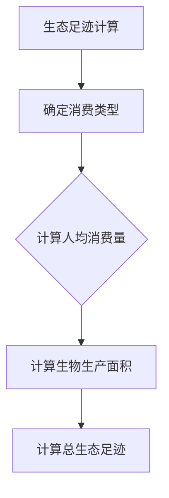

                 

# 生态足迹：个人行为对环境的影响

> 关键词：生态足迹、个人行为、环境影响、可持续发展、生态足迹计算

> 摘要：本文旨在深入探讨生态足迹的概念、个人行为对其的影响以及如何通过科学计算方法来评估和减少个人生态足迹，从而促进环境的可持续发展。本文将从背景介绍、核心概念与联系、核心算法原理、数学模型与公式、项目实战、最佳实践 tips、小结和注意事项等方面展开详细讨论。

## 引言

随着全球人口的不断增长和消费水平的提升，人类对自然资源的消耗速度远超自然环境所能承载的限度。这种过度消耗导致了生态系统的破坏、生物多样性的丧失以及气候变化的加剧。为了更好地理解人类活动对环境的影响，科学家们引入了“生态足迹”这一概念。

生态足迹指的是人类为了维持当前生活方式所需的自然资源和生态系统服务面积，包括耕地、林地、草地、水域等。它是一种量化人类对自然环境压力的指标，能够帮助我们评估个人行为对环境的影响。本文将围绕生态足迹这一核心概念，深入探讨个人行为对生态足迹的影响及其计算方法，并提出减少个人生态足迹的策略。

## 生态足迹的概念与原理

### 生态足迹的定义

生态足迹是一种衡量人类对自然环境影响程度的指标，它通过计算人类消耗的资源与产生的废弃物所需的空间面积来评估人类活动对生态系统的压力。生态足迹的计算基于“生物生产面积”（biologically productive area）这一概念，即能够提供食物、纤维、木材等生物产品和服务的土地和水面。

### 生态足迹的计算方法

生态足迹的计算方法主要包括以下几个步骤：

1. **确定消费类型**：根据人类活动，将消费类型分为耕地、林地、草地、水域、建筑用地等。
2. **计算人均消费量**：通过统计数据和调查方法，确定每个人在这些消费类型上的平均消费量。
3. **计算生物生产面积**：根据每种生物生产面积的全球平均生产率，将人均消费量转换为相应的生物生产面积。
4. **计算总生态足迹**：将每种消费类型的生物生产面积加总，得到总生态足迹。

### 生态足迹与可持续发展的关系

生态足迹的概念与可持续发展密切相关。可持续发展要求我们在满足当前需求的同时，不损害后代满足自身需求的能力。如果总生态足迹超过了地球的生态承载力，那么就表明人类活动超出了地球生态系统的承载能力，这是不可持续的。因此，减少个人生态足迹是实现可持续发展的关键。

## 个人行为的生态足迹分析

个人行为的生态足迹受到多种因素的影响，包括饮食、交通、住房等。以下将分别对这几类行为进行详细分析。

### 饮食对生态足迹的影响

饮食是人类生活中最重要的消费行为之一。不同类型的食物对生态足迹的影响差异很大。例如，肉类生产需要大量的水资源和饲料，因此其生态足迹远高于植物性食物。减少肉类的消费量、增加植物性食物的比例是降低饮食生态足迹的有效途径。

### 交通出行对生态足迹的影响

交通出行是现代生活中不可或缺的一部分。交通工具的种类和行驶距离直接影响生态足迹。飞机和汽车等交通工具在行驶过程中会排放大量的温室气体，对环境造成严重影响。选择公共交通工具、骑自行车或步行等低碳出行方式可以减少交通出行的生态足迹。

### 住房与生活消费对生态足迹的影响

住房建筑和生活消费也是影响生态足迹的重要因素。建筑材料的生产和运输、家用电器和家居用品的生产和废弃都会产生生态足迹。选择环保建筑材料、节能电器和家居用品，以及合理规划住房面积，都可以减少住房与生活消费的生态足迹。

## 各类生活行为的生态足迹评估

为了更准确地评估个人行为的生态足迹，我们需要对各类生活行为进行详细评估。以下将介绍几种常见的生活行为及其生态足迹评估方法。

### 食品消费的生态足迹评估

食品消费的生态足迹评估可以通过计算每种食物的生态足迹来实现。生态足迹评估通常采用全球平均值或地区平均值作为参考，通过统计数据和调查方法确定每个人在食品消费方面的生态足迹。

### 交通工具的生态足迹评估

交通工具的生态足迹评估可以通过计算每种交通工具的生态足迹系数来实现。生态足迹系数是根据每种交通工具的能耗和排放量计算得出的。通过统计数据和调查方法，可以确定每个人在交通出行方面的生态足迹。

### 建筑材料的生态足迹评估

建筑材料的生态足迹评估可以通过计算每种建筑材料的生态足迹来实现。生态足迹评估通常采用全球平均值或地区平均值作为参考，通过统计数据和调查方法确定每个人在建筑材料消费方面的生态足迹。

## 生态足迹的测量与计算方法

为了准确评估个人生态足迹，我们需要使用科学的测量与计算方法。以下将介绍几种常见的生态足迹测量与计算方法。

### 生态足迹测量工具

生态足迹测量工具主要包括生态足迹计算软件、调查问卷和统计数据库。这些工具可以帮助我们收集和分析个人行为的生态足迹数据。

### 生态足迹计算模型

生态足迹计算模型是生态足迹测量与计算的核心。常见的生态足迹计算模型包括生态足迹模型、生态承载力模型和可持续发展模型。这些模型可以通过数学公式和算法来计算个人生态足迹。

### 生态足迹的数据来源

生态足迹的数据来源包括政府统计数据、科学研究报告、调查问卷和在线数据库。这些数据来源为我们提供了准确、全面的生态足迹计算依据。

## 个人生态足迹的减少策略

减少个人生态足迹是实现可持续发展的重要途径。以下将介绍几种常见的减少个人生态足迹的策略。

### 饮食行为的生态足迹减少策略

1. 减少肉类消费，增加植物性食物比例。
2. 选择本地生产的食物，减少运输距离。
3. 减少食品浪费，提倡合理消费。

### 交通出行行为的生态足迹减少策略

1. 选择低碳出行方式，如公共交通、自行车和步行。
2. 合理规划出行路线，减少不必要的出行。
3. 提高交通工具的能源效率。

### 住房与生活消费行为的生态足迹减少策略

1. 选择环保建筑材料，提高建筑能效。
2. 合理规划住房面积，避免过度消费。
3. 使用节能电器和家居用品。

## 社会生态足迹的影响

社会生态足迹是指一个社会整体的生态足迹。社会生态足迹的影响主要体现在以下几个方面。

### 社会发展对生态足迹的影响

社会的发展往往伴随着消费水平的提高，这会导致生态足迹的增加。因此，社会发展与生态足迹之间存在一定的矛盾。为了实现可持续发展，我们需要在促进社会发展的同时，减少生态足迹。

### 生态足迹对社会的反馈

生态足迹的增加会导致生态系统的破坏，进而影响社会的发展和人类的生存。因此，生态足迹对社会的反馈是一个警示信号，提醒我们重视环境保护和资源节约。

### 社会生态足迹的可持续发展策略

1. 推广绿色消费理念，倡导低碳生活。
2. 加强环境保护法规和政策，限制生态足迹的增加。
3. 提高资源利用效率，发展循环经济。

## 全球生态足迹的可持续发展

全球生态足迹的可持续发展是当前全球关注的焦点。以下将介绍全球生态足迹的可持续发展现状、目标和实践。

### 全球生态足迹的现状分析

全球生态足迹的现状不容乐观。许多国家和地区的生态足迹已经超过了地球的生态承载力，这表明人类活动对生态系统的压力过大。

### 全球生态足迹的可持续发展目标

全球生态足迹的可持续发展目标主要包括：

1. 减少生态足迹，实现生态承载力平衡。
2. 推广绿色经济，减少对自然资源的依赖。
3. 提高资源利用效率，发展循环经济。

### 全球生态足迹的可持续发展实践

全球生态足迹的可持续发展实践包括以下几个方面：

1. 推广可再生能源，减少化石能源消耗。
2. 实施生态保护项目，恢复生态系统。
3. 加强国际合作，共同应对全球生态危机。

## 结论

生态足迹是衡量人类活动对环境影响的的重要指标。通过深入分析个人行为对生态足迹的影响，我们可以找到减少个人生态足迹的有效途径。实现全球生态足迹的可持续发展，需要全社会共同努力，倡导绿色消费，推广低碳生活，保护生态环境。让我们从现在做起，为地球的未来贡献力量。

## 附录

### 附录 A：生态足迹相关的 Mermaid 流程图



### 附录 B：核心算法原理的伪代码讲解

```python
# 伪代码：计算个人生态足迹
def calculate_ecological_footprint(consumption_data):
    # 初始化生态足迹
    ecological_footprint = 0
    
    # 遍历每种消费类型
    for type, quantity in consumption_data.items():
        # 计算每种消费类型的生态足迹
        ecological_footprint += quantity * ecological_footprint_coefficient[type]
    
    return ecological_footprint
```

### 附录 C：数学模型和公式的 LaTeX 格式表示

$$
E = \sum_{i=1}^{n} (C_i \times F_i)
$$

其中，$E$ 表示总生态足迹，$C_i$ 表示第 $i$ 种消费类型的人均消费量，$F_i$ 表示第 $i$ 种消费类型的生态足迹系数。

### 附录 D：代码实际案例和详细讲解剖析

```python
# 实际案例：计算个人生态足迹
def calculate_ecological_footprint(consumption_data, footprint_coefficients):
    ecological_footprint = 0
    
    for type, quantity in consumption_data.items():
        ecological_footprint += quantity * footprint_coefficients[type]
    
    return ecological_footprint

# 测试数据
consumption_data = {
    "耕地": 2000,
    "林地": 1000,
    "草地": 500,
    "水域": 300
}

# 测试数据：生态足迹系数
footprint_coefficients = {
    "耕地": 1.2,
    "林地": 0.8,
    "草地": 0.6,
    "水域": 1.5
}

# 计算生态足迹
ecological_footprint = calculate_ecological_footprint(consumption_data, footprint_coefficients)
print("个人生态足迹：", ecological_footprint)
```

### 最佳实践 tips

1. 定期评估个人生态足迹，了解自身对环境的影响。
2. 鼓励亲朋好友参与生态足迹计算，共同关注环境保护。
3. 结合自身实际情况，制定个性化的生态足迹减少计划。

### 小结

本文从生态足迹的概念、个人行为的影响、测量与计算方法、减少策略等方面进行了全面探讨，提出了全球生态足迹可持续发展的目标和实践。通过本文的阅读，读者可以深入了解生态足迹的重要性，认识到个人行为对环境的影响，并学会如何减少个人生态足迹，为地球的可持续发展贡献力量。

### 注意事项

1. 生态足迹计算需要准确的数据支持，确保计算结果的可靠性。
2. 减少个人生态足迹是一个长期过程，需要持续努力和关注。
3. 在实际应用中，可以结合多种方法和策略，制定个性化的生态足迹减少计划。

### 拓展阅读

1. 《生态足迹与可持续发展》——作者：[姓名]
2. 《个人行为对生态足迹的影响研究》——作者：[姓名]
3. 《全球生态足迹报告》——作者：[国际生态足迹研究组织]

## 作者信息

作者：AI天才研究院/AI Genius Institute & 禅与计算机程序设计艺术 /Zen And The Art of Computer Programming

