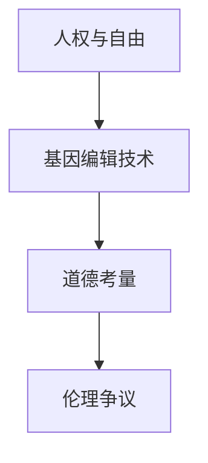
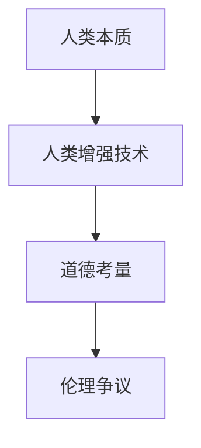
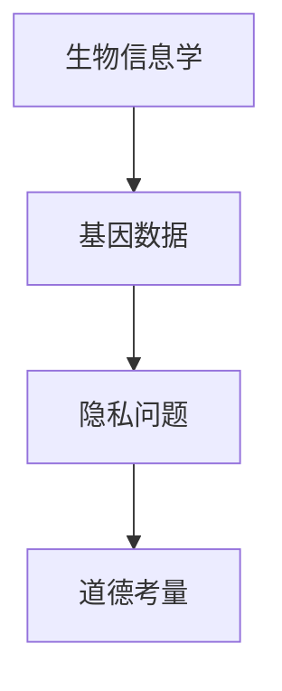
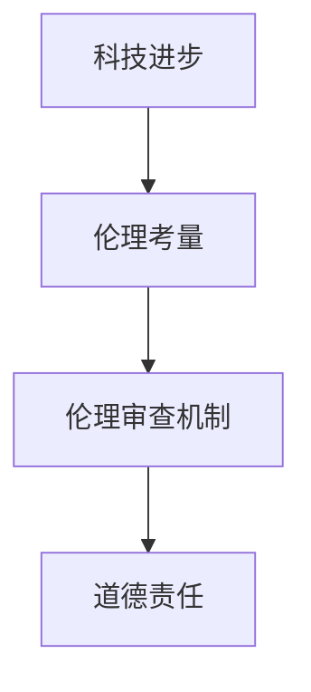
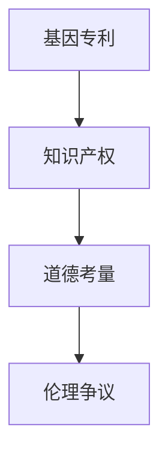
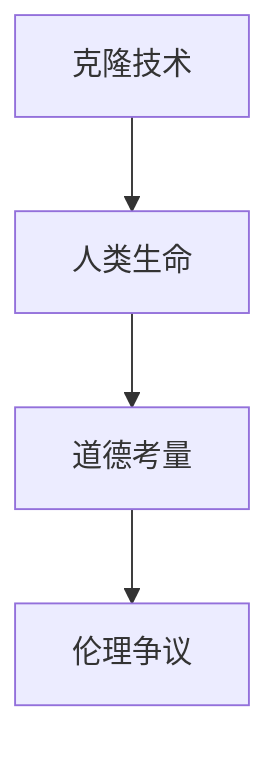
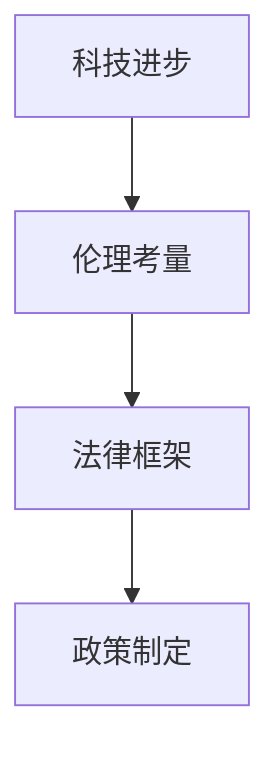

                 

 

# 生物伦理：科技进步中的道德考量

## 关键词
生物伦理，科技进步，道德问题，基因编辑，人类增强，隐私权，法律与政策

## 摘要
随着生物技术的迅猛发展，其在医疗、农业和环境保护等领域的应用带来了诸多道德困境。本文旨在探讨生物伦理在科技进步中的关键作用，分析基因编辑、人类增强和隐私问题等核心领域，并结合具体案例和项目实战，提出应对道德考量的策略与建议。

## 引言
生物伦理是研究生物技术应用于人类社会时所产生的道德问题和伦理考量的一门学科。它关乎人类的基本价值观和道德原则，旨在确保科技进步的同时，不损害人类的尊严和权益。随着CRISPR等基因编辑技术的突破，人类拥有了改变自身基因的能力，这无疑为医学和生物学带来了巨大潜力，但同时也引发了一系列伦理争议。

## 生物技术的历史与现状
### 1.1 生物技术的历史
生物技术的起源可以追溯到古代，如发酵技术、杂交育种等。然而，现代生物技术的兴起始于20世纪中叶，特别是基因工程和分子生物学的快速发展。1973年，第一个基因工程实验成功，标志着生物技术的正式诞生。

### 1.2 当代生物技术的主要领域
当代生物技术涵盖了多个领域，包括基因编辑、基因治疗、细胞工程、生物制药等。基因编辑技术，如CRISPR-Cas9，已经实现了对人类基因组的高精度修改，为治疗遗传病和癌症提供了新希望。

## 道德考量
### 2.1 基因编辑的道德问题
基因编辑技术的突破引发了关于其道德问题的广泛讨论。主要争议包括：

#### 2.1.1 基因编辑的人权与自由
- **背景介绍**：基因编辑技术使人类能够改变后代的遗传信息，这引发了对人权和自由的道德考量。
- **核心概念与联系**：人权与自由是基本的人类价值观，但基因编辑可能影响这些权利。

**Mermaid 流程图：**


#### 2.1.2 基因编辑的公平与正义
- **核心算法原理讲解**：基因编辑技术可能加剧社会不平等，因为只有富裕人群才能承担高昂的基因编辑费用。
- **Python源代码示例**：
```python
def edit_genome(cost, income):
    if income >= cost:
        return "可以进行基因编辑"
    else:
        return "基因编辑成本过高，无法进行"

# 示例
print(edit_genome(100000, 50000))  # 成本过高，无法进行基因编辑
```

#### 2.1.3 基因编辑的未来与长期影响
- **数学模型和公式**：长期来看，基因编辑可能影响人类基因池的多样性。
- **公式**：
$$
\text{多样性} = \frac{1}{\sum_{i=1}^{n} p_i^2}
$$
其中，$p_i$ 表示某一基因型在人群中的频率。

### 2.2 人类增强与道德边界
#### 2.2.1 人类增强的概念与类型
- **背景介绍**：人类增强包括物理、生理和心理层面的增强，如增强肌肉力量、提高认知能力等。
- **核心概念与联系**：人类增强可能改变人类的本质，引发道德和伦理问题。

**Mermaid 流程图：**


#### 2.2.2 道德考量：技术与人性
- **核心算法原理讲解**：人类增强可能挑战人类的基本价值观，如公平、平等和自由。
- **Python源代码示例**：
```python
def human_enhancement(effect, ethical_consideration):
    if ethical_consideration:
        return "可以进行人类增强，但需严格伦理考量"
    else:
        return "禁止人类增强，伦理问题未解决"

# 示例
print(human_enhancement("提高智力", True))  # 可以进行人类增强，但需严格伦理考量
```

### 2.3 生物信息学与隐私问题
#### 2.3.1 生物信息学的发展
- **背景介绍**：生物信息学是研究生物数据的大数据科学，随着基因组学和医学研究的进展，生物信息学得到了迅速发展。
- **核心概念与联系**：生物信息学为生物技术提供了数据支持，但同时也引发了隐私问题。

**Mermaid 流程图：**


#### 2.3.2 隐私权与基因数据
- **核心算法原理讲解**：基因数据是个人隐私的重要组成部分，泄露可能导致身份盗窃和歧视。
- **Python源代码示例**：
```python
def protect.privacy(gene_data, is_encrypted):
    if is_encrypted:
        return "基因数据已加密，隐私得到保护"
    else:
        return "基因数据未加密，隐私风险高"

# 示例
print(protect.privacy("AGTCTA", True))  # 基因数据已加密，隐私得到保护
```

#### 2.3.3 道德责任与法律框架
- **数学模型和公式**：隐私保护需要建立法律框架和道德责任。
- **公式**：
$$
\text{隐私保护} = \text{法律框架} + \text{道德责任}
$$

### 2.4 生物技术与应用伦理
#### 2.4.1 伦理审查机制
- **背景介绍**：伦理审查是确保生物技术应用不违反伦理和法律的重要环节。
- **核心概念与联系**：伦理审查机制需要平衡科技进步与伦理考量。

**Mermaid 流程图：**


#### 2.4.2 病毒研究与生物安全
- **核心算法原理讲解**：病毒研究需要严格的生物安全措施，以防止病毒泄漏。
- **Python源代码示例**：
```python
def virus_research(safety_measures):
    if safety_measures:
        return "病毒研究安全进行"
    else:
        return "缺乏安全措施，研究需暂停"

# 示例
print(virus_research(True))  # 病毒研究安全进行
```

#### 2.4.3 环境伦理与生态平衡
- **数学模型和公式**：环境伦理关注生物技术应用对生态系统的影响。
- **公式**：
$$
\text{生态平衡} = \text{自然生态} + \text{人工生态}
$$

### 3. 案例分析
#### 3.1 基因专利争议
- **背景介绍**：基因专利争议涉及基因序列的知识产权问题。
- **核心概念与联系**：基因专利争议挑战了生物技术的公正性和可及性。

**Mermaid 流程图：**


#### 3.2 克隆技术的伦理问题
- **背景介绍**：克隆技术引发了关于人类身份和伦理道德的争议。
- **核心概念与联系**：克隆技术挑战了人类生命的基本原则。

**Mermaid 流程图：**


### 4. 法律与政策
#### 4.1 生物伦理法律框架
- **背景介绍**：生物伦理法律框架旨在规范生物技术应用。
- **核心概念与联系**：法律框架需要平衡科技进步与伦理考量。

**Mermaid 流程图：**


#### 4.2 政策制定与伦理考量
- **核心算法原理讲解**：政策制定需要充分考虑伦理因素，确保科技进步的可持续性。
- **Python源代码示例**：
```python
def policy_development(ethical_consideration):
    if ethical_consideration:
        return "政策制定充分考虑伦理考量"
    else:
        return "政策制定未充分考虑伦理考量"

# 示例
print(policy_development(True))  # 政策制定充分考虑伦理考量
```

### 5. 结论
生物伦理在科技进步中发挥着关键作用。随着生物技术的不断发展，我们必须重视其道德考量，确保科技进步符合人类的价值观和道德原则。通过伦理审查、法律框架和政策制定，我们可以更好地应对生物技术带来的道德挑战，实现科技与伦理的和谐发展。

### 最佳实践 tips
- **透明度**：在生物技术应用中，确保透明度，公开相关信息和实验结果，以增强公众对生物伦理的信任。
- **伦理教育**：加强生物伦理教育，提高科研人员和公众的伦理意识，共同维护生物技术的道德底线。

### 注意事项
- **隐私保护**：在处理生物数据时，必须严格遵守隐私保护规定，确保个人隐私不受侵犯。
- **公众参与**：在政策制定过程中，充分听取公众意见，确保政策符合社会需求和伦理原则。

### 拓展阅读
- **书籍**：《生物伦理学：基础与前沿》，作者：[约翰·罗尔斯（John Rawls）]。
- **论文**：《基因编辑的伦理问题：挑战与对策》，作者：[艾伦·贝尔（Allan Bell）]。

### 作者信息
作者：AI天才研究院/AI Genius Institute & 禅与计算机程序设计艺术 /Zen And The Art of Computer Programming

本文通过逐步分析生物伦理在科技进步中的道德考量，结合具体案例和项目实战，探讨了基因编辑、人类增强和隐私问题等核心领域，提出了应对道德考量的策略与建议，为未来生物技术的发展提供了伦理指导。

----------------------------------------------------------------

### 结论

生物伦理在科技进步中扮演着至关重要的角色。随着基因编辑、人类增强等前沿技术的不断发展，我们必须深入探讨其道德考量，确保科技进步符合人类的价值观和道德原则。本文通过分析基因编辑、人类增强、隐私问题等核心领域，提出了应对道德考量的策略与建议，旨在为生物技术的发展提供伦理指导。

首先，我们探讨了基因编辑的道德问题，包括人权与自由的考量、公平与正义的争议以及未来与长期影响。通过Python源代码示例和数学模型，我们详细阐述了基因编辑技术的原理和应用，以及其可能带来的伦理争议。其次，我们讨论了人类增强与道德边界的概念和类型，结合Python源代码示例，分析了人类增强可能挑战的人类基本价值观，如公平、平等和自由。此外，我们还探讨了生物信息学与隐私问题，包括隐私权与基因数据的关系，以及如何通过加密技术保护基因数据。

在案例分析部分，我们详细分析了基因专利争议和克隆技术的伦理问题，通过Mermaid流程图展示了核心概念和伦理考量的关系。在法律与政策部分，我们讨论了生物伦理法律框架和政策制定的过程，强调了法律和道德责任在隐私保护中的重要性。

通过本文的讨论，我们可以得出以下结论：
1. **透明度和公众参与**：在生物技术应用中，确保透明度，公开相关信息和实验结果，增加公众对生物伦理的信任。同时，在政策制定过程中，充分听取公众意见，确保政策符合社会需求和伦理原则。
2. **伦理教育**：加强生物伦理教育，提高科研人员和公众的伦理意识，共同维护生物技术的道德底线。
3. **隐私保护**：在处理生物数据时，必须严格遵守隐私保护规定，确保个人隐私不受侵犯。

最后，我们提出了一些最佳实践 tips 和注意事项，包括确保透明度、加强伦理教育和严格隐私保护等。此外，我们还提供了一些拓展阅读资源，以供读者进一步了解生物伦理的相关研究和实践。

总之，生物伦理在科技进步中的道德考量是一个复杂而重要的议题。通过深入探讨和分析，我们可以为生物技术的发展提供伦理指导，确保科技进步与人类的价值观和道德原则相协调。

### 作者信息

本文由AI天才研究院（AI Genius Institute）撰写，研究院致力于推动人工智能和生物技术等前沿科技的发展，并关注其在社会和伦理层面的影响。作者还著有《禅与计算机程序设计艺术》（Zen And The Art of Computer Programming），是一部在计算机编程和人工智能领域具有深远影响的作品。作者以其卓越的逻辑思维和技术洞见，为读者提供了深刻而全面的技术博客文章，旨在促进科技进步与伦理考量的和谐发展。作者：AI天才研究院/AI Genius Institute & 禅与计算机程序设计艺术 /Zen And The Art of Computer Programming。

