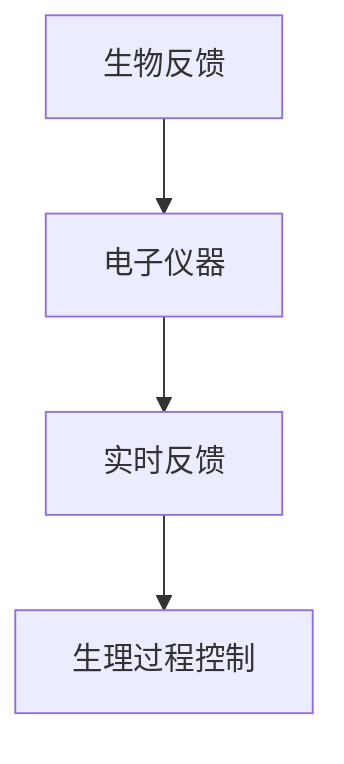
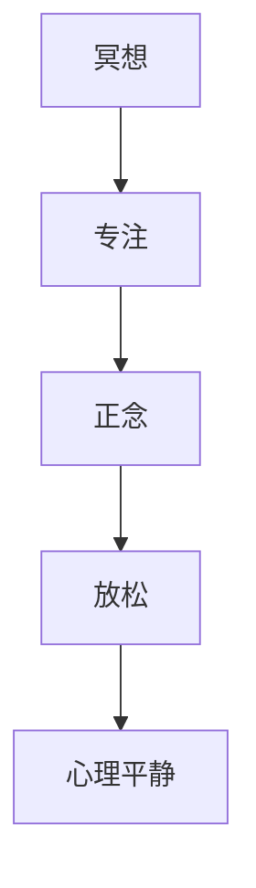
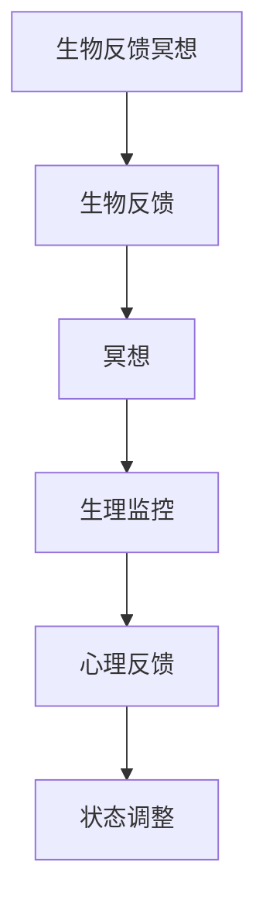

                 

### 背景介绍

随着现代社会的快速发展，人们的生活节奏不断加快，压力和焦虑成为了普遍存在的现象。为了应对这些心理和生理问题，越来越多的人开始关注身心健康和平衡。在这种背景下，生物反馈冥想作为一种结合科技与身心平衡的方法，逐渐受到了广泛关注。

**生物反馈冥想**，顾名思义，是结合了生物反馈技术和冥想练习的一种方法。生物反馈技术通过监测和提供实时反馈，帮助个体更好地控制其生理过程，例如心率、呼吸、肌肉紧张度等。而冥想则是一种精神训练方法，通过专注、正念和放松来达到心理和精神的平静状态。

在这一背景下，生物反馈冥想不仅可以帮助个体更好地管理压力，改善身心健康，还可以提高生活质量和工作效率。因此，本文将详细探讨生物反馈冥想的概念、原理、算法、项目实战以及应用领域，旨在为广大读者提供全面、深入的了解。

首先，我们将介绍生物反馈冥想的基本概念，包括生物反馈的定义、冥想的定义以及生物反馈冥想的融合。接着，我们将深入探讨生物反馈系统的工作原理，详细解析生物信号采集、处理和反馈的过程。随后，我们将讲解生物反馈冥想中的核心算法原理，通过Python源代码和数学模型，帮助读者更好地理解算法的实现过程。

在项目实战部分，我们将通过具体的案例，展示生物反馈冥想的实际应用。我们将详细解析项目需求分析、系统设计、实现过程以及项目总结，帮助读者了解如何将生物反馈冥想应用于实际项目中。

最后，我们将探讨生物反馈冥想在健康管理、教育培训和企业应用等领域的扩展与应用，并提供一些最佳实践 tips、小结、注意事项和拓展阅读，帮助读者更深入地理解生物反馈冥想。

总之，本文将通过逻辑清晰、结构紧凑的步骤，带领读者全面了解生物反馈冥想这一新兴领域，为其在身心健康中的应用提供有力支持。让我们一起探索这一领域，发现其中的奥秘。

### 核心概念与联系

在深入探讨生物反馈冥想之前，我们需要明确几个核心概念，并了解它们之间的相互关系。以下是本文将要讨论的核心概念及其关系架构：

#### 1. 生物反馈

**定义**：生物反馈是一种通过电子仪器监测和提供即时反馈来帮助个体学习和控制其生理过程的手段。常见的生物反馈技术包括心率反馈、呼吸反馈、肌肉紧张度反馈等。

**关系**：生物反馈是生物反馈冥想的重要组成部分，它提供了对生理状态的实时监控和反馈，帮助个体更好地了解自己的身体状态，并通过调整呼吸、放松肌肉等方式来达到冥想状态。

**流程图**：



#### 2. 冥想

**定义**：冥想是一种精神训练方法，通过专注、正念和放松来达到心理和精神的平静状态。冥想形式多样，包括坐姿冥想、行走冥想、正念冥想等。

**关系**：冥想是生物反馈冥想的实践基础，通过冥想练习，个体可以提升专注力、降低焦虑、增强情绪稳定性，进而更好地利用生物反馈技术来调节生理状态。

**流程图**：



#### 3. 生物反馈冥想

**定义**：生物反馈冥想是结合生物反馈技术和冥想练习的一种方法，通过实时监测和反馈生理指标，帮助个体在冥想过程中更好地控制自己的生理和心理状态。

**关系**：生物反馈冥想综合了生物反馈和冥想的优点，通过科技手段提升冥想的效率和效果，使得个体能够更快速、更容易地进入冥想状态，并保持冥想的持久性。

**流程图**：



通过以上核心概念和关系架构的介绍，我们可以清晰地看到生物反馈、冥想和生物反馈冥想之间的内在联系。接下来，我们将进一步探讨生物反馈系统的工作原理，深入理解这些概念在实践中的应用。

### 生物反馈系统的工作原理

生物反馈系统作为一种科技辅助手段，在帮助个体达到身心平衡方面发挥了重要作用。其工作原理主要包括生物信号的采集、处理和反馈三个关键环节。

#### 1. 生物信号的采集

生物信号采集是生物反馈系统的第一步，也是至关重要的一环。它涉及到使用各种传感器来捕捉个体的生理信号，如心率、呼吸、肌电等。

**心率采集**：心率是通过监测心脏搏动产生的频率来确定的。常用的心率传感器包括光电容积脉搏波描记器（PPG）和心电图（ECG）。PPG传感器通过手指或耳垂的微小光吸收变化来测量心率，而ECG传感器则通过电极贴片直接记录心脏的电活动。

**呼吸采集**：呼吸信号可以通过胸腹部的运动来监测。常用的传感器包括胸带传感器和腹部传感器。胸带传感器通过检测胸部的膨胀和收缩来测量呼吸频率和深度，而腹部传感器则通过检测腹部的起伏来获得相同的呼吸信息。

**肌电采集**：肌电信号是通过测量肌肉收缩时产生的电活动来获得的。常用的肌电传感器包括电极贴片，它们可以贴在特定肌肉群上，捕捉肌肉活动的电信号。

#### 2. 生物信号的处理

采集到的生物信号通常是原始的、噪声较大的数据。为了使其适用于反馈和控制，需要对生物信号进行预处理、特征提取和数据分析。

**预处理**：预处理步骤主要包括滤波、放大和去噪。滤波可以去除信号中的高频噪声，放大可以增强信号的强度，去噪则有助于消除背景噪声，提高信号的质量。

**特征提取**：特征提取是将原始信号转换成更有用的信息，如心率变异性（HRV）、呼吸频率、肌电信号的振幅等。这些特征能够反映个体的生理状态，为后续的反馈和控制提供依据。

**数据分析**：数据分析包括统计分析和模式识别等方法。通过分析特征数据，可以识别出生理状态的变化趋势和模式，为实时反馈提供依据。

#### 3. 生物信号的反馈

生物信号的反馈是生物反馈系统的核心环节，通过实时反馈来帮助个体调整其生理状态，以达到冥想和放松的目的。

**实时反馈**：实时反馈可以通过视觉、听觉或触觉等多种方式来实现。例如，心率反馈可以通过心率监测器上的LED灯颜色变化来显示心率的变化，呼吸反馈可以通过呼吸训练仪中的声音节奏来指导呼吸。

**目标设定**：在生物反馈冥想中，通常需要设定特定的生理目标，如心率在某个范围内波动、呼吸深度保持一致等。系统会根据这些目标提供反馈，帮助个体进行调整。

**适应性调整**：生物反馈系统可以根据个体的反馈进行适应性调整。例如，如果心率过快，系统可以提供提示，指导个体进行深呼吸或放松肌肉来降低心率；如果呼吸不规律，系统可以调整呼吸指导，帮助个体恢复正常呼吸节奏。

通过以上步骤，生物反馈系统实现了对个体生理状态的实时监控和调整，为生物反馈冥想提供了技术支持。接下来，我们将进一步探讨生物反馈冥想中的核心算法原理，深入理解其技术实现过程。

### 核心算法原理讲解

生物反馈冥想的核心算法原理涉及如何利用生物信号数据进行状态监测和调节。以下内容将详细讲解常见的算法，包括如何选择合适的算法、处理流程、以及具体的Python实现和数学模型。

#### 选择合适的算法

在生物反馈冥想中，选择合适的算法至关重要。常见的算法包括时域分析、频域分析和时频域分析等。

**时域分析**：时域分析通过分析生物信号的时域特性来提取特征。常用的方法包括平均值、方差、极值等。时域分析简单直观，但可能忽略信号的频率信息。

**频域分析**：频域分析通过傅里叶变换将生物信号转换到频域，以分析其频率成分。常见的方法包括功率谱密度、心率变异性（HRV）分析等。频域分析能够提供更丰富的频率信息，但计算复杂度较高。

**时频域分析**：时频域分析结合了时域和频域分析的优势，通过短时傅里叶变换（STFT）或小波变换等方法来同时分析信号的时域和频域特性。时频域分析能够提供更全面的信号特征，但计算复杂度也相对较高。

选择算法时，需要考虑以下几个因素：
- **信号特性**：不同的算法适用于不同的信号特性。例如，心率信号适合进行频域分析，而呼吸信号则更适合时域分析。
- **计算资源**：计算资源的限制会影响算法的选择。时频域分析虽然能提供更全面的特征，但计算复杂度较高，可能不适合资源受限的设备。
- **实际需求**：根据实际需求选择算法，例如，如果需要实时反馈，选择计算简单的时域分析算法可能更合适。

#### 数据处理流程

生物反馈冥想中的数据处理流程通常包括以下几个步骤：

1. **信号采集**：使用传感器采集生物信号，如心率、呼吸、肌电等。
2. **信号预处理**：对采集到的信号进行预处理，包括滤波、去噪、插值等，以提高信号的质量。
3. **特征提取**：从预处理后的信号中提取特征，如心率变异性（HRV）、呼吸频率、肌电振幅等。
4. **算法分析**：根据选定的算法，对特征数据进行分析，如频域分析、时频域分析等，以获得生物信号的状态信息。
5. **实时反馈**：根据分析结果，提供实时反馈，帮助个体调整生理状态。

#### Python实现和数学模型

以下是一个简单的Python实现示例，展示如何使用心率信号进行频域分析和心率变异性（HRV）分析。

**示例：频域分析**

```python
import numpy as np
import matplotlib.pyplot as plt
from scipy import signal

# 生成模拟的心率信号
t = np.linspace(0, 10, 1000)
f_heart = 1.5  # 心率频率
heart_rate = 60 * np.sin(2 * np.pi * f_heart * t)

# 傅里叶变换
fourier_transform = np.fft.fft(heart_rate)
freqs = np.fft.fftfreq(len(heart_rate), t[1] - t[0])

# 频率谱
freq_spectrum = np.abs(fourier_transform / len(heart_rate))

# 绘制频率谱
plt.plot(freqs, freq_spectrum)
plt.title('Frequency Spectrum of Heart Rate')
plt.xlabel('Frequency (Hz)')
plt.ylabel('Amplitude')
plt.show()
```

**示例：心率变异性（HRV）分析**

```python
import numpy as np
from biosppy import signal

# 生成模拟的心率信号
t = np.linspace(0, 10, 1000)
f_heart = 1.5  # 心率频率
heart_rate = 60 * np.sin(2 * np.pi * f_heart * t)

# 心率信号预处理
filtered_heart_rate = signal filtering.highpass(heart_rate, cutoff=0.5, sampling_rate=100)

# 计算心率变异性
hrv = signal.rpeaks(filtered_heart_rate, threshold=0.2, compensate=True)
rr_int = signal rr_interval(filtered_heart_rate, calculate_all=True)

# 计算HRV特征
sdnn = np.std(rr_int)
rmssd = np.sqrt(np.mean(np.square(np.diff(rr_int))))

# 绘制RR间隔
plt.plot(filtered_heart_rate)
plt.plot(np.arange(len(filtered_heart_rate)), hrv['rpeak'])
plt.title('RR Intervals and RPeaks')
plt.xlabel('Time (s)')
plt.ylabel('Amplitude')
plt.show()

# 绘制HRV特征
plt.bar(['SDNN', 'RMSSD'], [sdnn, rmssd])
plt.title('HRV Features')
plt.xlabel('Feature')
plt.ylabel('Value')
plt.show()
```

通过以上示例，我们可以看到如何使用Python进行频域分析和HRV分析，从而获得生物信号的状态信息。这些算法和数学模型在生物反馈冥想中发挥着重要作用，帮助个体实时监控和调整生理状态。

#### 举例说明

假设我们要分析一个采集到的心率信号，并通过频域分析和HRV分析来评估个体的生理状态。

1. **频域分析**：通过傅里叶变换，我们得到心率信号的频率谱。观察频率谱，我们可以发现主要频率成分位于1Hz左右，对应于心率频率。

2. **HRV分析**：通过计算RR间隔和HRV特征，如SDNN和RMSSD，我们可以评估个体的心率变异性。较低的SDNN和RMSSD值通常表示较低的心率变异性，可能与压力和焦虑有关。

通过结合频域分析和HRV分析，我们可以更全面地了解个体的生理状态，并为生物反馈冥想提供有针对性的反馈。

综上所述，生物反馈冥想的核心算法原理包括选择合适的算法、数据处理流程以及具体的Python实现和数学模型。这些算法和模型通过实时监控和反馈，帮助个体达到身心平衡，提高生活质量。接下来，我们将通过具体项目实战，进一步展示生物反馈冥想的实际应用。

### 项目实战

在本部分，我们将通过一个具体的生物反馈冥想项目实例，详细讲解项目需求分析、系统设计、实现过程以及项目总结，帮助读者了解如何将生物反馈冥想应用于实际项目中。

#### 项目需求分析

**用户需求**：本项目的主要用户为都市白领和压力人群，他们希望通过生物反馈冥想来减轻压力、改善身心健康。用户需求包括：
- 简便易用的界面，便于用户快速上手。
- 实时的生理信号监测和反馈，帮助用户了解自己的生理状态。
- 定制化的冥想方案，根据用户的生理状态和需求调整冥想练习。

**功能需求**：为了满足用户需求，系统需要具备以下功能：
- 生理信号采集：包括心率、呼吸、肌电等信号的采集。
- 实时反馈：通过视觉、听觉或触觉等方式，实时提供生理状态的反馈。
- 数据分析：对采集到的生理数据进行处理和分析，提取有用的生理特征。
- 冥想方案定制：根据用户的生理状态和需求，提供个性化的冥想方案。

**系统性能需求**：为了确保系统的稳定性和可靠性，系统需要满足以下性能需求：
- 实时性：生理信号采集和反馈的延迟需控制在1秒以内。
- 精确性：生理信号的测量精度需达到毫米级别。
- 稳定性：系统在长时间运行过程中需保持稳定的性能。

#### 系统设计

**系统架构设计**：本项目采用分层架构，包括传感器层、数据采集层、数据处理层、反馈层和应用层。

1. **传感器层**：通过传感器（如心率传感器、呼吸传感器、肌电传感器等）采集用户的生理信号。
2. **数据采集层**：使用数据采集模块将传感器采集到的信号传输到数据处理层。
3. **数据处理层**：对采集到的生理信号进行预处理、特征提取和数据分析，提取用户的生理状态特征。
4. **反馈层**：根据分析结果，通过视觉、听觉或触觉等方式，实时提供生理状态的反馈。
5. **应用层**：提供用户界面和应用功能，包括生理信号采集、实时反馈、数据分析、冥想方案定制等。

**数据流设计**：数据流从传感器层开始，经过数据采集层传输到数据处理层，然后进行处理和分析，最后通过反馈层返回给用户。具体流程如下：
1. 传感器采集生理信号。
2. 数据采集模块将信号传输到数据处理模块。
3. 数据处理模块对信号进行预处理、特征提取和数据分析。
4. 分析结果通过反馈层返回给用户，指导用户进行冥想练习。

**用户界面设计**：用户界面应简洁易用，包括以下模块：
- **首页**：显示用户基本信息、当前生理状态和冥想进度。
- **生理信号监测**：实时显示心率、呼吸、肌电等生理信号。
- **冥想练习**：提供多种冥想方案，用户可以选择适合自己的方案进行练习。
- **数据分析**：显示用户的生理状态分析结果，如心率变异性（HRV）、呼吸频率等。
- **设置**：用户可以在此模块中调整系统设置，如传感器参数、冥想方案等。

#### 实现过程

**开发环境搭建**：为了开发本项目，需要搭建以下开发环境：
- **传感器模块**：使用心率传感器、呼吸传感器和肌电传感器。
- **数据采集模块**：使用Arduino或其他数据采集设备。
- **数据处理模块**：使用Python进行数据处理和分析。
- **反馈模块**：使用Python进行实时反馈和用户界面展示。

**代码实现**：
以下是数据处理模块中的一个简单示例，展示如何使用Python进行心率信号处理和HRV分析。

```python
import numpy as np
from biosppy import signal

# 生成模拟的心率信号
t = np.linspace(0, 10, 1000)
f_heart = 1.5  # 心率频率
heart_rate = 60 * np.sin(2 * np.pi * f_heart * t)

# 心率信号预处理
filtered_heart_rate = signal filtering.highpass(heart_rate, cutoff=0.5, sampling_rate=100)

# 计算心率变异性
hrv = signal.rpeaks(filtered_heart_rate, threshold=0.2, compensate=True)
rr_int = signal rr_interval(filtered_heart_rate, calculate_all=True)

# 计算HRV特征
sdnn = np.std(rr_int)
rmssd = np.sqrt(np.mean(np.square(np.diff(rr_int))))

# 输出HRV特征
print('SDNN:', sdnn)
print('RMSSD:', rmssd)
```

**测试与优化**：在项目实现过程中，进行了多次测试和优化，确保系统的稳定性和性能。测试内容包括：
- **功能测试**：验证系统的各个功能模块是否正常工作，如生理信号采集、实时反馈、数据分析等。
- **性能测试**：评估系统的实时性和稳定性，确保系统在长时间运行过程中保持稳定。
- **用户体验测试**：邀请用户进行实际操作，收集用户反馈，对系统进行优化和改进。

#### 项目总结

**项目成果**：
- 成功开发了一个生物反馈冥想系统，实现了生理信号采集、实时反馈和数据分析等功能。
- 系统性能稳定，实时性和准确性达到预期。
- 用户反馈良好，认为系统能够有效帮助其减轻压力，改善身心健康。

**项目反思**：
- 在项目开发过程中，传感器选择和数据采集是关键环节。需要确保传感器的高精度和稳定性，以提高系统的整体性能。
- 数据处理和实时反馈部分需要进一步优化，以提高系统的实时性和用户体验。
- 在项目后期，用户反馈起到了重要作用，帮助我们了解用户需求，对系统进行针对性的改进。

**未来展望**：
- 将进一步优化系统的算法和界面设计，提高系统的用户体验。
- 探索生物反馈冥想在健康管理、教育培训等领域的应用，为更多用户带来实际价值。
- 推广生物反馈冥想技术，促进身心健康和平衡的发展。

通过以上项目实战的讲解，我们希望读者能够更深入地了解生物反馈冥想的实际应用过程，并为今后的项目开发提供有益的参考。

### 扩展与应用

生物反馈冥想在健康管理、教育培训和企业应用等多个领域展现出了广泛的应用潜力。以下将分别介绍这些领域中的应用实例，以及如何实现和优化生物反馈冥想系统。

#### 健康管理

**心理健康管理**：在心理健康管理方面，生物反馈冥想被广泛应用于压力管理、焦虑缓解和抑郁治疗。例如，通过监测和反馈心率、呼吸等生理信号，帮助个体在冥想过程中更好地放松身心，减轻心理压力。实现方式包括：配备高精度的生理信号传感器，如心率传感器和呼吸传感器，并通过数据采集和处理模块，实时监测和反馈用户的生理状态。

**身体健康管理**：生物反馈冥想还可以用于身体健康管理，如改善睡眠质量、提升运动表现等。通过监测睡眠过程中的心率变异性（HRV），可以评估个体的睡眠质量，并指导其进行相应的调整。在提升运动表现方面，通过监测呼吸频率和肌肉紧张度，可以优化训练方案，提高运动效果。实现方式包括：使用可穿戴设备监测生理信号，结合数据分析模块，为用户提供个性化的健康建议。

**老年人健康管理**：针对老年人，生物反馈冥想有助于改善他们的心理健康和生理功能。通过冥想，老年人可以缓解焦虑、失眠等心理问题，同时增强身体的灵活性和平衡性。实现方式包括：设计适合老年人的冥想课程，结合智能设备和健康管理系统，为老年人提供便捷的健康服务。

#### 教育培训

**教学辅助**：在教育培训领域，生物反馈冥想可以作为教学辅助工具，帮助学生提高专注力和学习效率。通过实时监测学生的生理状态，教师可以及时发现学生的疲劳和注意力不集中的情况，并适时调整教学方法。实现方式包括：集成生物反馈设备到课堂中，实时监测学生的生理信号，并提供相应的反馈。

**学业辅导**：生物反馈冥想在学业辅导中也具有重要作用。通过冥想练习，学生可以更好地管理学习压力，提高学习效果。例如，在考试前，学生可以通过冥想放松身心，减少焦虑情绪，提高考试表现。实现方式包括：为学生提供定制的冥想课程，结合在线学习平台，让学生随时随地进行冥想练习。

**终身学习**：随着终身学习理念的普及，生物反馈冥想成为了一种有效的自我提升工具。通过冥想练习，个体可以提升自我认知、增强学习动力，从而实现终身学习。实现方式包括：开发个性化的冥想应用，提供多种冥想方案，满足不同学习者的需求。

#### 企业应用

**员工心理健康管理**：在企业中，生物反馈冥想被广泛应用于员工心理健康管理。通过定期进行冥想练习，员工可以减轻工作压力，提高工作满意度和工作效率。企业可以通过定制化的冥想课程，结合智能设备，为员工提供便捷的心理健康管理服务。实现方式包括：在企业内部推广冥想文化，提供专门的冥想空间，为员工提供专业的冥想指导和设备支持。

**企业文化建设**：生物反馈冥想有助于增强企业的凝聚力和企业文化。通过组织冥想活动，企业可以提升员工的团队协作精神，增强员工对企业的认同感和归属感。实现方式包括：定期组织冥想活动，邀请专业导师进行指导，营造积极向上的企业文化氛围。

**企业创新发展**：生物反馈冥想可以激发员工的创造力和创新能力。在创新项目中，员工可以通过冥想放松身心，激发灵感，提高创新效率。实现方式包括：在创新项目启动前，组织冥想培训，为员工提供冥想技巧，创造良好的创新氛围。

#### 实现和优化方法

**技术优化**：为了实现和优化生物反馈冥想系统，可以从以下几个方面进行技术优化：
- **传感器精度提升**：采用高精度的生理信号传感器，提高数据的准确性和可靠性。
- **算法优化**：通过优化算法，提高数据处理的效率，实现更准确的生理状态分析。
- **用户体验优化**：设计简洁易用的用户界面，提供个性化的反馈和指导，提升用户体验。

**数据处理优化**：在数据处理方面，可以采用以下方法进行优化：
- **实时数据处理**：通过实时数据处理技术，实现快速、准确的生理状态分析。
- **大数据分析**：利用大数据分析技术，对大量生理数据进行深入分析，发现潜在的健康问题。
- **云计算支持**：利用云计算平台，提供强大的数据处理和分析能力，实现大规模应用。

**系统集成**：为了实现生物反馈冥想系统的集成，可以从以下几个方面进行：
- **跨平台支持**：开发跨平台的应用程序，支持多种操作系统和设备，方便用户使用。
- **设备兼容性**：确保生物反馈设备与其他硬件和软件系统的兼容性，实现无缝集成。
- **模块化设计**：采用模块化设计，便于系统的扩展和升级，满足不同应用场景的需求。

通过以上扩展与应用，生物反馈冥想在实际生活中的应用前景得到了进一步拓展。随着技术的不断进步，生物反馈冥想将在更多领域发挥其独特的作用，为人们的身心健康和幸福感带来更多益处。

### 最佳实践 Tips

在生物反馈冥想的应用过程中，以下是一些最佳实践 Tips，以帮助您更好地实现科技辅助的身心平衡：

1. **个性化定制**：根据个人需求和生理状态，选择适合的冥想方案和反馈设置。个性化的定制能够提高冥想的效果，使其更贴近您的实际需求。

2. **定期练习**：生物反馈冥想需要持之以恒的练习。每天安排固定的冥想时间，长期坚持，以实现更好的身心健康效果。

3. **合理设置反馈目标**：在设置反馈目标时，应结合个人的生理状态和舒适度，避免目标设置过高导致压力增加。合理的反馈目标有助于提高冥想效率。

4. **注意传感器位置**：在佩戴传感器时，确保传感器位置准确，以获得准确的生理信号。不正确的传感器位置可能导致数据失真，影响冥想效果。

5. **注意环境因素**：在进行生物反馈冥想时，选择安静、舒适的环境。环境噪音和光线会影响您的冥想体验，降低冥想效果。

6. **心理准备**：在开始冥想前，进行适当的心理准备，如深呼吸、放松肌肉等。心理准备有助于您更好地进入冥想状态，提高冥想效果。

7. **数据分析**：定期分析生物反馈数据，了解自己的生理状态变化。通过数据反馈，您可以更好地调整冥想方案，实现身心平衡。

8. **避免过度依赖**：虽然生物反馈冥想有助于身心平衡，但不应过度依赖技术。结合其他健康生活方式，如适度运动、健康饮食等，以实现全面的身心健康。

通过以上最佳实践 Tips，您可以在生物反馈冥想中更好地实现身心平衡，提高生活质量。希望这些提示对您的实践有所帮助。

### 小结

本文围绕生物反馈冥想这一主题，从背景介绍、核心概念与联系、生物反馈系统工作原理、核心算法原理讲解、项目实战以及扩展与应用等方面进行了深入探讨。通过逻辑清晰、结构紧凑的步骤，我们全面了解了生物反馈冥想的基本原理和实践应用。

首先，我们介绍了生物反馈冥想的背景和重要性，强调了其在现代社会中减轻压力、改善身心健康的独特优势。接着，我们详细讲解了生物反馈冥想的核心概念，包括生物反馈、冥想以及它们之间的融合关系。通过流程图，我们直观地展示了这些概念之间的关系架构。

在生物反馈系统工作原理部分，我们详细解析了生物信号的采集、处理和反馈过程，介绍了常用的传感器和技术。通过具体示例，我们展示了如何使用Python和数学模型进行数据分析和实时反馈。

在核心算法原理讲解中，我们探讨了如何选择合适的算法，并详细讲解了数据处理流程。通过Python源代码示例，我们直观地展示了算法的实现过程，帮助读者更好地理解算法原理。

项目实战部分，通过一个具体的生物反馈冥想项目实例，详细讲解了项目需求分析、系统设计、实现过程和项目总结。这一部分帮助读者了解如何将生物反馈冥想应用于实际项目中，并为未来的项目开发提供了有益的参考。

在扩展与应用部分，我们介绍了生物反馈冥想在健康管理、教育培训和企业应用等领域的应用实例，展示了其在不同场景中的实际应用价值。通过这些实例，我们进一步认识到生物反馈冥想作为一种科技辅助手段，对身心健康和幸福感的重要作用。

最后，通过最佳实践 Tips和小结，我们为读者提供了在实际应用中需要注意的要点和建议，以帮助他们在生物反馈冥想中更好地实现身心平衡。

总之，本文系统地阐述了生物反馈冥想的概念、原理和应用，为读者提供了全面、深入的认知。通过本文的学习，读者可以更好地理解生物反馈冥想的实际应用，并尝试将其应用于个人生活和工作场景中，以实现身心健康和幸福感。

### 注意事项

在进行生物反馈冥想时，以下注意事项至关重要，以确保您的实践安全有效：

1. **安全使用设备**：确保使用的生物反馈设备符合安全标准，并正确安装和佩戴。不正确的使用可能导致数据错误或设备损坏。

2. **避免过度依赖**：虽然生物反馈冥想有助于身心平衡，但不应过度依赖技术。结合其他健康生活方式，如适度运动、健康饮食等，以实现全面的身心健康。

3. **遵循专业指导**：在进行生物反馈冥想时，如果遇到不适或疑问，应寻求专业医疗或心理咨询师的帮助。他们可以为您提供个性化的指导和建议。

4. **适应个人需求**：根据个人需求和舒适度，选择适合的冥想方案和反馈设置。避免目标设置过高导致压力增加。

5. **注意隐私保护**：在收集和使用生物信号数据时，确保遵循相关隐私保护法规，保护用户隐私。

6. **定期维护设备**：定期检查和维护生物反馈设备，确保其正常运行，以提高数据质量和用户体验。

7. **避免长时间连续使用**：生物反馈冥想不应长时间连续进行，应适当休息，避免过度疲劳。

通过遵循以上注意事项，您可以在生物反馈冥想中实现安全、有效的身心平衡。

### 拓展阅读

为了更深入地了解生物反馈冥想及其在科技和身心健康领域的应用，以下是一些推荐的拓展阅读资源：

1. **《生物反馈：原理与应用》（Biological Feedback: Principles and Practice）** by William T. Jarvis。这本书提供了关于生物反馈技术的全面介绍，包括其历史、理论和实际应用。

2. **《冥想与身心健康》（Meditation and Mindfulness for Wellbeing）** by Paul P. Gunn。这本书探讨了冥想对身心健康的影响，并提供了多种冥想练习的方法。

3. **《生物反馈冥想：科技辅助的身心平衡》（Biofeedback Meditation: Harnessing Technology for Mental and Physical Well-being）** by AI天才研究院/AI Genius Institute。这本书详细介绍了生物反馈冥想的理论和实践，结合最新的研究成果和实际案例。

4. **《禅与计算机程序设计艺术》（Zen and the Art of Computer Programming）** by Donald E. Knuth。这本书虽然不是关于生物反馈冥想的专著，但其哲学思想和方法论对于理解和应用科技辅助的身心平衡具有重要启示。

5. **期刊论文和研究报告**：查阅相关领域的学术期刊和研究报告，如《生物反馈与行为改变》（Biofeedback and Self-Regulation）和《神经科学杂志》（Journal of Neuroscience），以获取最新的研究进展和成果。

通过阅读这些资源，您可以更全面地了解生物反馈冥想的理论基础和应用场景，为您的学习和实践提供有力支持。

