                 

### 关键词

- 生物反馈冥想
- 身心合一
- 科学实践
- 心理健康
- 身体健康
- 生物信号采集
- 心率变异性（HRV）
- 肌电信号（EMG）
- 脑电信号（EEG）
- 数据分析
- 人工智能
- 认知神经科学

### 摘要

本文深入探讨了生物反馈冥想这一结合身心科学理论与现代技术的实践方法。文章首先介绍了生物反馈冥想的基本概念、原理及其在身心健康领域的广泛应用。通过解析生物反馈技术的核心原理和设备，本文为读者展示了生物信号采集与处理的具体方法。接着，文章详细阐述了冥想与身心健康的密切联系，分析了不同冥想类型对身心健康的具体影响。随后，文章介绍了生物反馈冥想的实践方法，并针对特定人群的应用进行了探讨。在科学实证部分，本文回顾了生物反馈冥想的心理学和生理机制，以及实证研究结果。最后，文章展望了生物反馈冥想的未来发展趋势，并提出了推广与普及的策略。通过本文的阅读，读者将对生物反馈冥想有一个全面而深刻的理解。

### 目录大纲

# 生物反馈冥想：身心合一的科学实践

## 第一部分：生物反馈冥想的基础理论

### 第1章：生物反馈冥想概述
#### 1.1 生物反馈的定义与原理
#### 1.2 生物反馈冥想的历史与发展
#### 1.3 生物反馈冥想的应用领域

### 第2章：生物反馈技术解析
#### 2.1 生物信号采集与处理
##### 2.1.1 心率变异性（HRV）
##### 2.1.2 肌电信号（EMG）
##### 2.1.3 脑电信号（EEG）
#### 2.2 生物反馈设备与技术
##### 2.2.1 常见的生物反馈设备
##### 2.2.2 生物反馈技术的分类
##### 2.2.3 生物反馈系统的实现

### 第3章：冥想与身心健康的联系
#### 3.1 冥想的基本类型与效果
##### 3.1.1 正念冥想
##### 3.1.2 爱与慈悲冥想
##### 3.1.3 动态冥想
#### 3.2 冥想对身心健康的影响
##### 3.2.1 身体健康方面
##### 3.2.2 心理健康方面
##### 3.2.3 社交关系方面

### 第4章：生物反馈冥想的实践与应用
#### 4.1 生物反馈冥想的练习方法
##### 4.1.1 呼吸冥想
##### 4.1.2 身体扫描冥想
##### 4.1.3 正念行走冥想
#### 4.2 生物反馈冥想在特定人群中的应用
##### 4.2.1 压力管理
##### 4.2.2 睡眠障碍
##### 4.2.3 焦虑与抑郁
##### 4.2.4 疼痛管理

## 第二部分：生物反馈冥想的科学实证

### 第5章：生物反馈冥想的科学基础
#### 5.1 心理学原理
##### 5.1.1 认知行为理论
##### 5.1.2 认知神经科学
##### 5.1.3 生理心理学
#### 5.2 生物反馈冥想的生理机制
##### 5.2.1 心理生理反应
##### 5.2.2 神经系统调节
##### 5.2.3 免疫系统调节

### 第6章：生物反馈冥想的实证研究综述
#### 6.1 研究方法
##### 6.1.1 实验设计
##### 6.1.2 统计分析方法
##### 6.1.3 数据处理
#### 6.2 研究成果与分析
##### 6.2.1 心理健康领域
##### 6.2.2 身体健康领域
##### 6.2.3 社会关系领域

### 第7章：生物反馈冥想的未来发展趋势
#### 7.1 技术创新
##### 7.1.1 生物传感器的改进
##### 7.1.2 数据分析技术的进步
##### 7.1.3 虚拟现实与增强现实在冥想中的应用
#### 7.2 应用前景
##### 7.2.1 临床应用
##### 7.2.2 企业健康管理
##### 7.2.3 教育与培训

### 第8章：结论与展望
#### 8.1 生物反馈冥想的核心价值
##### 8.1.1 提升身心健康
##### 8.1.2 促进社会和谐
##### 8.1.3 推动科技与人文融合
#### 8.2 生物反馈冥想的推广与普及
##### 8.2.1 教育体系中的融合
##### 8.2.2 社会公共政策支持
##### 8.2.3 商业模式的创新

## 附录

### 附录A：生物反馈冥想资源推荐
#### A.1 学术资源
##### A.1.1 科研论文
##### A.1.2 学术期刊
##### A.1.3 学术会议
#### A.2 实践资源
##### A.2.1 冥想应用程序
##### A.2.2 生物反馈设备推荐
##### A.2.3 实践指南与教程
#### A.3 组织与社区
##### A.3.1 国际生物反馈协会
##### A.3.2 本土冥想与生物反馈社区
##### A.3.3 专业培训机构

[Mermaid 流程图](#)

```mermaid
graph TB

subgraph 生物反馈冥想概述
    A[生物反馈定义与原理] --> B[生物反馈冥想历史与发展]
    B --> C[生物反馈冥想应用领域]
end

subgraph 生物反馈技术解析
    D[生物信号采集与处理] --> E[心率变异性（HRV）]
    E --> F[肌电信号（EMG）]
    F --> G[脑电信号（EEG）]
    D --> H[生物反馈设备与技术]
    H --> I[常见生物反馈设备]
    H --> J[生物反馈技术分类]
    H --> K[生物反馈系统实现]
end

subgraph 冥想与身心健康联系
    L[冥想基本类型与效果] --> M[正念冥想]
    M --> N[爱与慈悲冥想]
    N --> O[动态冥想]
    L --> P[冥想对身心健康影响]
    P --> Q[身体健康方面]
    Q --> R[心理健康方面]
    Q --> S[社交关系方面]
end

subgraph 生物反馈冥想实践与应用
    T[生物反馈冥想练习方法] --> U[呼吸冥想]
    U --> V[身体扫描冥想]
    V --> W[正念行走冥想]
    T --> X[特定人群应用]
    X --> Y[压力管理]
    Y --> Z[睡眠障碍]
    Z --> AA[焦虑与抑郁]
    AA --> BB[疼痛管理]
end

subgraph 科学实证
    CC[心理学原理] --> DD[认知行为理论]
    DD --> EE[认知神经科学]
    EE --> FF[生理心理学]
    CC --> GG[生物反馈冥想生理机制]
    GG --> HH[心理生理反应]
    GG --> II[神经系统调节]
    GG --> JJ[免疫系统调节]
    KK[实证研究综述] --> LL[实验设计]
    LL --> MM[统计分析方法]
    MM --> NN[数据处理]
    KK --> OO[研究成果与分析]
    OO --> PP[心理健康领域]
    PP --> QQ[身体健康领域]
    QQ --> RR[社会关系领域]
end

subgraph 发展趋势与展望
    TT[技术创新] --> UU[生物传感器改进]
    UU --> VV[数据分析技术进步]
    VV --> WW[虚拟现实与增强现实应用]
    TT --> XX[应用前景]
    XX --> YY[临床应用]
    YY --> ZZ[企业健康管理]
    ZZ --> AAA[教育与培训]
    AAA --> BBB[结论与展望]
    BBB --> CCC[核心价值]
    CCC --> DDD[促进社会和谐]
    CCC --> EEE[推动科技与人文融合]
    EEE --> FFF[推广与普及]
    FFF --> GGG[教育体系融合]
    GGG --> HHH[社会公共政策支持]
    HHH --> IIII[商业模式创新]
end
```

## 第1章：生物反馈冥想概述

### 1.1 生物反馈的定义与原理

生物反馈（Biofeedback）是一种通过电子仪器将人体内的生物信号转换为可感知的信号，帮助个体学会控制和调节自身生理反应的方法。生物反馈技术起源于20世纪60年代，最初应用于疼痛管理和心理治疗领域。随着时间的推移，生物反馈技术逐渐扩展到身心健康管理的多个方面，包括冥想和压力管理。

#### 1.1.1 生物反馈的定义

生物反馈是一种心理生理干预手段，它通过电子传感器检测并放大人体内的生物信号，如心率、肌电、呼吸、皮肤电反应等，然后将这些信号转化为视觉、听觉或触觉信号，使得个体能够直接感知和识别自己的生理状态。例如，通过观察屏幕上的心率曲线，个体可以学会控制自己的呼吸节奏，从而达到放松的效果。

#### 1.1.2 生物反馈的工作原理

生物反馈的过程通常包括以下几个步骤：

1. **信号采集**：通过传感器检测个体的生物信号，如心率传感器测量心率。
2. **信号处理**：将原始生物信号进行放大、滤波等处理，以获得清晰的信号。
3. **信号转换**：将处理后的生物信号转换为可感知的信号，如视觉信号（在屏幕上显示心率曲线）或听觉信号（通过声音提示心率变化）。
4. **反馈与调节**：个体根据反馈信号调整自己的生理反应，例如通过调整呼吸节奏来降低心率。

#### 1.1.3 生物反馈的适用范围

生物反馈技术已被广泛应用于多个领域，包括但不限于：

- **疼痛管理**：通过控制生理反应来减轻慢性疼痛。
- **压力管理**：帮助个体学会放松，降低压力水平。
- **焦虑与抑郁治疗**：通过调节生理反应来改善情绪状态。
- **睡眠障碍**：通过调节呼吸和心率来改善睡眠质量。
- **注意力缺陷多动障碍（ADHD）**：通过改善注意力集中和情绪调节。
- **运动表现**：帮助运动员优化生理状态，提高运动表现。

### 1.2 生物反馈冥想的历史与发展

生物反馈冥想是一种将生物反馈技术与冥想相结合的实践方法，旨在通过控制和调节生理反应来达到身心合一的境界。生物反馈冥想的历史可以追溯到20世纪60年代，当时一些心理学家和医生开始探索将生物反馈技术应用于冥想和放松训练。

#### 1.2.1 早期探索

在20世纪60年代，生物反馈技术的先驱者John C. Lilly和Walter J. Greenleaf等人开始探索将生物反馈应用于冥想和心理治疗。他们设计了一系列实验，使用心率变异性（HRV）作为反馈信号，帮助个体学会控制和调节呼吸和心率。

#### 1.2.2 发展趋势

随着生物反馈技术的成熟，越来越多的研究开始探讨生物反馈冥想在身心健康管理中的应用。20世纪80年代，生物反馈冥想在临床心理治疗和疼痛管理中得到了广泛应用。近年来，随着传感器技术的进步和数据分析技术的发展，生物反馈冥想的应用范围进一步扩大，包括运动表现优化、企业健康管理、教育等领域。

#### 1.2.3 现代发展

现代生物反馈冥想结合了最新的生物传感器技术、数据分析方法和虚拟现实技术，为个体提供了更加个性化和高效的健康管理方案。例如，智能手环、穿戴设备等可以实时监测个体的生理信号，并通过手机应用程序提供即时的反馈和指导。

### 1.3 生物反馈冥想的应用领域

生物反馈冥想作为一种结合了生物反馈技术和冥想方法的心理生理干预手段，其应用范围广泛，涵盖了多个领域：

#### 1.3.1 心理健康领域

在心理健康领域，生物反馈冥想被广泛应用于焦虑、抑郁、压力管理、睡眠障碍等方面的治疗。通过调节呼吸和心率，个体可以学会放松身心，改善情绪状态，提高生活质量。

- **焦虑与抑郁**：生物反馈冥想可以帮助个体学会控制自己的生理反应，减少焦虑和抑郁症状。
- **压力管理**：通过生物反馈冥想，个体可以学会放松身心，降低压力水平，提高抗压能力。
- **睡眠障碍**：生物反馈冥想通过调节呼吸和心率，改善睡眠质量，有助于治疗失眠和睡眠障碍。

#### 1.3.2 身体健康领域

在身体健康领域，生物反馈冥想被广泛应用于慢性疼痛、运动表现优化、心脏健康等方面。

- **慢性疼痛**：生物反馈冥想可以帮助个体学会放松肌肉，减轻慢性疼痛。
- **运动表现优化**：通过生物反馈冥想，运动员可以优化生理状态，提高运动表现。
- **心脏健康**：生物反馈冥想有助于降低心率变异性（HRV），改善心脏健康。

#### 1.3.3 社会关系领域

在社会关系领域，生物反馈冥想也被广泛应用于改善人际关系、提高社会适应能力等方面。

- **改善人际关系**：通过生物反馈冥想，个体可以学会更好地管理情绪和压力，改善人际关系。
- **提高社会适应能力**：生物反馈冥想有助于提高个体的心理韧性，增强应对社会压力的能力。

总之，生物反馈冥想作为一种身心合一的科学实践方法，具有广泛的应用前景和潜力。通过结合生物反馈技术和冥想方法，生物反馈冥想可以为个体提供全面的身心健康管理方案。

## 第2章：生物反馈技术解析

生物反馈技术是一种通过电子仪器将人体生物信号转换为可感知信号，帮助个体学会控制和调节自身生理反应的方法。本章将详细介绍生物反馈技术的基础知识，包括生物信号的采集与处理、常见生物反馈设备和技术，以及生物反馈系统的实现。

### 2.1 生物信号采集与处理

生物信号的采集与处理是生物反馈技术的核心环节，直接关系到反馈信号的准确性和可靠性。

#### 2.1.1 心率变异性（HRV）

心率变异性（HRV）是生物反馈中常用的生理信号之一，它反映了心脏跳动的频率变化。HRV的采集通常通过贴在身体上的电极将心率信号传递到传感器，然后通过信号处理算法进行滤波、放大和数字化处理。

- **采集方法**：使用心电图（ECG）电极贴在胸部或手腕处，采集心电信号。
- **处理方法**：采用快速傅里叶变换（FFT）等算法对心电信号进行频域分析，提取HRV特征。

#### 2.1.2 肌电信号（EMG）

肌电信号（EMG）反映了肌肉的收缩和放松状态，常用于运动控制和康复治疗。EMG的采集通常通过贴在皮肤上的电极将肌电信号传递到传感器，然后通过信号处理算法进行滤波、放大和数字化处理。

- **采集方法**：使用表面电极或针电极贴在肌肉表面，采集肌电信号。
- **处理方法**：采用带通滤波、波形识别和特征提取算法对肌电信号进行处理。

#### 2.1.3 脑电信号（EEG）

脑电信号（EEG）反映了大脑的电活动，常用于认知功能评估和心理治疗。EEG的采集通常通过贴在头皮上的电极将脑电信号传递到传感器，然后通过信号处理算法进行滤波、放大和数字化处理。

- **采集方法**：使用头皮电极（如环形电极、单通道电极等）采集脑电信号。
- **处理方法**：采用带通滤波、事件相关电位（ERP）分析和频率分析等算法对脑电信号进行处理。

### 2.2 生物反馈设备与技术

生物反馈设备是生物反馈系统的重要组成部分，用于采集、处理和反馈生理信号。

#### 2.2.1 常见的生物反馈设备

常见的生物反馈设备包括心率监测器、肌电监测器、脑电监测器和生物反馈控制器。

- **心率监测器**：用于实时监测心率变化，通常包括穿戴式心率监测器和手持式心率监测器。
- **肌电监测器**：用于监测肌肉活动，通常包括表面肌电监测器和针电极肌电监测器。
- **脑电监测器**：用于监测脑电活动，通常包括头皮电极脑电监测器和脑机接口（BCI）设备。
- **生物反馈控制器**：用于将生理信号转换为可感知的反馈信号，如视觉、听觉或触觉信号。

#### 2.2.2 生物反馈技术的分类

生物反馈技术可以分为以下几类：

- **视觉反馈**：通过屏幕显示生理信号的变化，如心率曲线、呼吸波形等。
- **听觉反馈**：通过声音提示生理信号的变化，如心率变化的声音信号。
- **触觉反馈**：通过振动或压力反馈来提示生理信号的变化。
- **多模态反馈**：结合视觉、听觉和触觉反馈，提供更全面的生理信号反馈。

#### 2.2.3 生物反馈系统的实现

生物反馈系统通常由以下几部分组成：

1. **信号采集模块**：用于采集生理信号，如心率、肌电、脑电等。
2. **信号处理模块**：用于对采集到的信号进行滤波、放大、数字化等处理。
3. **反馈生成模块**：用于将处理后的信号转换为可感知的反馈信号，如视觉、听觉或触觉信号。
4. **控制模块**：用于控制生物反馈系统的运行，如设定反馈信号阈值、调节反馈强度等。
5. **用户界面**：用于显示生理信号和反馈信号，帮助用户理解和控制自己的生理反应。

### 2.3 生物反馈技术在实践中的应用

生物反馈技术在实践中具有广泛的应用，以下是一些典型应用案例：

- **压力管理**：通过心率变异性（HRV）监测和反馈，帮助个体学会放松和降低压力。
- **疼痛管理**：通过肌电信号反馈，帮助个体学会控制肌肉紧张，减轻慢性疼痛。
- **睡眠改善**：通过脑电信号反馈，帮助个体学会调整睡眠状态，改善睡眠质量。
- **康复训练**：通过肌电信号反馈，帮助康复患者优化运动模式，提高康复效果。
- **运动表现优化**：通过心率变异性（HRV）监测和反馈，帮助运动员优化训练状态，提高运动表现。

总之，生物反馈技术通过实时监测和分析个体的生理信号，提供可感知的反馈，帮助个体学会控制和调节自身的生理反应，从而实现身心健康管理的目标。

## 第3章：冥想与身心健康的联系

冥想作为一种古老的心灵修养方法，近年来因其对身心健康的积极影响而受到广泛关注。本章将探讨冥想的基本类型、不同冥想对身心健康的影响，以及冥想在社会关系方面的作用。

### 3.1 冥想的基本类型与效果

冥想有多种不同的形式，每种形式都有其独特的特点和适用场景。以下是几种常见的冥想类型及其效果：

#### 3.1.1 正念冥想

正念冥想（Mindfulness Meditation）是一种专注于当前时刻、接纳一切感受的冥想方法。它要求个体将注意力集中在呼吸、身体感觉或特定物体上，并通过观察和接纳内心的想法和感受，达到内心的平静与宁静。

- **效果**：正念冥想有助于提高注意力和集中力，减少焦虑和压力，改善情绪调节，提升心理韧性。此外，它还可以改善睡眠质量，减轻慢性疼痛，提高整体幸福感。

#### 3.1.2 爱与慈悲冥想

爱与慈悲冥想（Loving-kindness Meditation，简称LKM）是一种培养善良和同情心的冥想方法。它通过反复向自己、他人、所有人发送爱和善意，增强个体的同理心和社交能力。

- **效果**：爱与慈悲冥想有助于改善情绪状态，减少负面情绪，提高自尊和自我接纳。它还可以增强个体的社交技能，改善人际关系，提升社会适应能力。

#### 3.1.3 动态冥想

动态冥想（Dynamic Meditation，简称DM）是一种结合呼吸、动作和声音的冥想方法。它通过快速、强烈的呼吸和舞蹈动作，释放内心的紧张和压力，达到身心合一的境界。

- **效果**：动态冥想有助于减轻焦虑、抑郁和压力，提高情绪稳定性和心理韧性。此外，它还可以增强身体的灵活性和力量，提高运动表现。

### 3.2 冥想对身心健康的影响

冥想对身心健康的影响是多方面的，涉及身体、心理和社会多个层面。

#### 3.2.1 身体健康方面

- **降低血压**：研究表明，长期冥想可以显著降低血压，有助于预防心血管疾病。
- **改善心率变异性（HRV）**：冥想可以改善心率变异性，增强心脏的自主调节能力，提高整体健康水平。
- **增强免疫力**：冥想有助于降低应激激素水平，增强免疫系统功能，提高身体抵抗力。
- **减轻慢性疼痛**：正念冥想等形式的冥想可以减轻慢性疼痛，提高生活质量。
- **改善睡眠质量**：冥想有助于减少失眠和睡眠障碍，提高睡眠质量和深度。

#### 3.2.2 心理健康方面

- **减少焦虑和抑郁**：冥想可以减少焦虑和抑郁症状，提高情绪稳定性。
- **提升注意力**：正念冥想等形式的冥想有助于提高注意力和集中力，提高工作和学习效率。
- **改善情绪调节**：冥想可以帮助个体更好地理解和应对情绪波动，提高情绪调节能力。
- **提高心理韧性**：长期冥想可以增强个体的心理韧性，提高面对压力和挑战的能力。
- **提升自我意识**：冥想有助于个体更好地认识自己，提高自我接纳和自我理解。

#### 3.2.3 社交关系方面

- **改善人际关系**：冥想可以增强个体的同理心和社交技能，改善人际关系。
- **提高社会适应能力**：通过冥想，个体可以更好地应对社交压力，提高社会适应能力。
- **减少冲突**：冥想有助于个体更好地处理冲突，减少社交矛盾。
- **提高团队合作能力**：通过冥想，个体可以提高自我意识和团队合作能力，提升团队绩效。

总之，冥想作为一种简单而有效的身心健康管理方法，对个体身体、心理和社会关系的改善具有显著作用。通过不同的冥想形式，个体可以根据自己的需求选择合适的冥想方法，实现身心合一的目标。

### 3.3 冥想与生物反馈的结合

冥想与生物反馈技术的结合，为个体提供了更加个性化和有效的身心健康管理方案。通过生物反馈技术，个体可以实时监测自己的生理信号，如心率、呼吸和肌电信号，并结合冥想练习，实现身心的深度放松和调节。

#### 3.3.1 呼吸冥想与生物反馈

呼吸冥想是一种常见的冥想方法，通过专注于呼吸来达到身心放松。结合生物反馈技术，个体可以在冥想过程中实时观察和调整自己的呼吸节奏，以获得最佳放松效果。

- **实践方法**：在呼吸冥想中，个体可以使用心率变异性（HRV）监测设备来跟踪心率变化，并通过听觉或视觉反馈调整呼吸节奏。例如，当心率过快时，可以通过减慢呼吸速度来降低心率，实现身心放松。
- **效果**：通过生物反馈技术辅助呼吸冥想，个体可以更快地达到放松状态，提高冥想效果，减轻压力和焦虑。

#### 3.3.2 身体扫描冥想与生物反馈

身体扫描冥想是一种逐步关注身体各个部位的方法，通过释放紧张和焦虑来达到身心放松。结合生物反馈技术，个体可以在身体扫描过程中实时监测肌肉紧张程度，并根据反馈信号进行相应的放松练习。

- **实践方法**：在身体扫描冥想中，个体可以使用肌电信号监测设备来检测肌肉紧张程度，并通过视觉或触觉反馈放松紧张肌肉。例如，当检测到特定部位的肌电信号较强时，可以通过深呼吸和肌肉放松练习来缓解紧张。
- **效果**：通过生物反馈技术辅助身体扫描冥想，个体可以更有效地识别和缓解身体紧张，提高冥想效果，改善身心健康。

#### 3.3.3 正念行走冥想与生物反馈

正念行走冥想是一种结合行走和冥想的方法，通过专注于脚步和身体感觉来达到身心放松。结合生物反馈技术，个体可以在行走冥想过程中实时监测自己的步态和心率，实现身心的深度放松。

- **实践方法**：在正念行走冥想中，个体可以使用心率监测器和步态传感器来跟踪心率和步态变化，并通过听觉或视觉反馈调整行走节奏。例如，当心率过快时，可以通过放慢行走速度来降低心率，实现身心放松。
- **效果**：通过生物反馈技术辅助正念行走冥想，个体可以更有效地管理自己的身心状态，提高冥想效果，减轻压力和焦虑。

总之，冥想与生物反馈技术的结合为个体提供了更加个性化和有效的身心健康管理方案。通过实时监测和反馈生理信号，个体可以在冥想过程中实现身心的深度放松和调节，提高身心健康水平。

### 3.4 生物反馈冥想在特定人群中的应用

生物反馈冥想作为一种结合了生物反馈技术和冥想方法的心理生理干预手段，在不同的群体中具有广泛的应用前景。以下是生物反馈冥想在不同人群中的具体应用案例：

#### 3.4.1 压力管理

在现代快节奏的生活中，压力已经成为影响人们身心健康的主要因素之一。生物反馈冥想通过帮助个体学会控制和调节生理反应，从而有效减轻压力。

- **应用方法**：个体可以通过呼吸冥想和正念冥想等方法，结合心率变异性（HRV）监测设备，实时观察和调整心率，从而降低压力水平。
- **效果**：长期实践生物反馈冥想可以帮助个体学会更好地应对压力，提高心理韧性，减少慢性压力对身心健康的影响。

#### 3.4.2 睡眠障碍

睡眠障碍，如失眠和睡眠质量差，是影响人们生活质量的重要问题。生物反馈冥想可以通过调节呼吸和心率，改善睡眠质量。

- **应用方法**：个体可以在睡前进行呼吸冥想和身体扫描冥想，通过生物反馈设备监测呼吸和心率，帮助入睡和保持睡眠。
- **效果**：生物反馈冥想可以显著改善睡眠质量，缩短入睡时间，增加睡眠时长，提高生活质量。

#### 3.4.3 焦虑与抑郁

焦虑和抑郁是常见的心理健康问题，对个体的生活和工作产生严重影响。生物反馈冥想通过调节生理反应和情绪状态，有助于缓解焦虑和抑郁症状。

- **应用方法**：个体可以通过正念冥想和爱与慈悲冥想等方法，结合肌电和脑电信号监测，学会放松和调整情绪，缓解焦虑和抑郁。
- **效果**：生物反馈冥想可以显著减轻焦虑和抑郁症状，提高心理健康水平，增强心理韧性。

#### 3.4.4 疼痛管理

慢性疼痛是影响个体生活质量的一个重要问题。生物反馈冥想可以通过调节肌肉紧张和情绪状态，减轻慢性疼痛。

- **应用方法**：个体可以通过身体扫描冥想和正念行走冥想，结合肌电和心率信号监测，学会放松肌肉和调节情绪，减轻疼痛。
- **效果**：生物反馈冥想可以显著减轻慢性疼痛，提高生活质量，帮助患者更好地管理疼痛。

总之，生物反馈冥想作为一种有效的身心健康管理方法，在压力管理、睡眠障碍、焦虑与抑郁、疼痛管理等方面具有显著的应用效果。通过个性化的冥想练习和生物反馈技术，个体可以更好地调节自己的生理和情绪状态，提高身心健康水平。

## 第5章：生物反馈冥想的科学基础

生物反馈冥想作为身心健康管理的一种有效方法，其科学基础涉及多个学科，包括心理学、认知神经科学和生理心理学。本章将详细探讨这些科学原理，以及生物反馈冥想的生理机制。

### 5.1 心理学原理

心理学原理为生物反馈冥想提供了理论基础，特别是认知行为理论、认知神经科学和生理心理学。以下是对这些理论基础的详细阐述：

#### 5.1.1 认知行为理论

认知行为理论（Cognitive Behavioral Theory，CBT）认为，个体的心理问题通常源于错误的认知和行为模式。生物反馈冥想通过帮助个体调节生理反应，从而改变其认知和行为模式，达到心理健康的目标。

- **认知调节**：通过生物反馈冥想，个体可以实时监测和调节自己的生理信号，如心率、呼吸等。这种自我调节过程有助于个体认识到自身的生理反应，从而改变对其的认知。
- **行为调节**：生物反馈冥想中的放松和专注练习，有助于个体改变不良的行为习惯，如焦虑时的过度呼吸或紧张时的肌肉收缩。

#### 5.1.2 认知神经科学

认知神经科学（Cognitive Neuroscience）研究大脑如何处理信息，以及如何通过神经机制调节心理状态。生物反馈冥想在这一领域中的应用主要体现在以下几个方面：

- **神经可塑性**：生物反馈冥想可以促进大脑神经可塑性，即通过重复练习，大脑可以改变其结构和功能，从而改善心理状态。
- **神经递质调节**：生物反馈冥想可以调节大脑内的神经递质水平，如多巴胺、血清素等，从而改善情绪和认知功能。

#### 5.1.3 生理心理学

生理心理学（Biological Psychology）研究生理过程对心理和行为的影响。生物反馈冥想通过调节生理信号，如心率、呼吸和肌电，从而影响个体的心理状态。

- **自主神经系统调节**：通过生物反馈冥想，个体可以学会调节自主神经系统的活动，如通过深呼吸降低心率，从而减轻压力和焦虑。
- **内分泌系统调节**：生物反馈冥想可以调节内分泌系统，如通过减少应激激素（如皮质醇）的分泌，改善身心健康。

### 5.2 生物反馈冥想的生理机制

生物反馈冥想的生理机制涉及多个系统的相互作用，包括自主神经系统、内分泌系统和免疫系统。以下是对这些生理机制的详细阐述：

#### 5.2.1 心理生理反应

心理生理反应（Psychophysiological Response）是指心理活动引起的生理变化。生物反馈冥想通过调节心理生理反应，达到身心合一的境界。

- **心率变异性（HRV）**：心率变异性是衡量自主神经系统活动的重要指标。通过生物反馈冥想，个体可以学会通过呼吸调节心率，从而提高心率变异性，改善心脏健康。
- **呼吸节奏**：呼吸是心理生理反应的一个重要组成部分。通过生物反馈冥想，个体可以学会调整呼吸节奏，从而改善呼吸模式，提高身心健康。

#### 5.2.2 神经系统调节

神经系统调节（Neuroregulation）是指神经系统如何调节和平衡身体的各个功能。生物反馈冥想通过调节神经系统活动，实现身心合一。

- **大脑功能**：生物反馈冥想可以改善大脑的功能，如提高注意力、增强记忆力和改善情绪调节能力。这些效果可以通过脑电信号（EEG）的监测和反馈来实现。
- **神经可塑性**：生物反馈冥想可以促进神经可塑性，即通过重复练习，大脑可以改变其结构和功能，从而改善心理状态。

#### 5.2.3 免疫系统调节

免疫系统调节（Immunomodulation）是指调节免疫系统活动的过程。生物反馈冥想可以通过调节心理生理反应，影响免疫系统的功能。

- **应激激素水平**：生物反馈冥想可以降低应激激素（如皮质醇）的水平，从而减轻压力，增强免疫力。
- **免疫细胞功能**：生物反馈冥想可以改善免疫细胞的活性，如自然杀伤细胞（NK细胞）的杀伤力，从而提高整体免疫力。

总之，生物反馈冥想的科学基础涉及多个学科，包括心理学、认知神经科学和生理心理学。其生理机制包括心理生理反应、神经系统调节和免疫系统调节。通过这些科学原理和生理机制，生物反馈冥想为个体提供了全面而有效的身心健康管理方案。

### 5.3 生物反馈冥想的生理机制：神经可塑性

神经可塑性是指大脑和神经系统通过学习和经验改变其结构和功能的能力。生物反馈冥想通过多种机制促进神经可塑性，从而改善个体的心理和生理状态。

#### 5.3.1 神经可塑性的基础

神经可塑性包括结构可塑性、连接可塑性和功能可塑性。结构可塑性涉及神经元形态的改变，如树突和轴突的延伸。连接可塑性是指突触连接的增强或减弱，影响神经信号传递效率。功能可塑性是指神经网络活动的变化，包括神经元之间的通讯模式和脑区之间的功能连接。

#### 5.3.2 生物反馈冥想与神经可塑性

1. **重复练习**：生物反馈冥想通常涉及重复的呼吸调节、身体扫描或注意力集中练习。这种重复性练习可以触发神经可塑性，特别是在涉及认知控制和情绪调节的脑区。

2. **神经适应性**：通过生物反馈，个体可以实时监测和调整生理信号，如心率、呼吸和肌电。这种适应性调节训练可以增强神经系统的适应性，提高其对压力和挑战的应对能力。

3. **神经元连接**：研究表明，冥想可以增强大脑特定区域的神经元连接。例如，前额叶皮层（涉及认知控制和情绪调节）和前扣带回（涉及情感处理）的神经元连接在冥想练习后得到增强。

4. **神经再生**：生物反馈冥想可能促进神经再生，即受损或退化的神经元通过新的突触连接重新建立联系。这有助于改善认知功能，如注意力、记忆和情绪调节。

#### 5.3.3 神经可塑性的具体例子

1. **心率变异性（HRV）**：通过生物反馈冥想，个体可以学会调节心率，从而提高心率变异性。这反映了自主神经系统活动的调节能力，即交感神经和副交感神经的平衡。这种调节能力与神经可塑性密切相关，有助于降低压力和焦虑水平。

2. **大脑灰质厚度**：研究发现，长期冥想练习与大脑灰质厚度的增加相关，特别是在前额叶皮层和前扣带回等区域。这表明冥想可以促进神经结构的变化，提高大脑的功能。

3. **脑波活动**：脑电图（EEG）研究表明，冥想可以改变大脑的脑波活动模式。例如，α波（8-12赫兹）的增加与放松和专注状态相关，而β波（13-30赫兹）的增加与认知活动和警觉性相关。这些脑波活动的变化反映了神经可塑性在冥想过程中的作用。

#### 5.3.4 神经可塑性的临床应用

1. **认知功能障碍**：神经可塑性在改善认知功能障碍方面具有潜在应用。例如，通过生物反馈冥想，可以增强老年人的记忆力和注意力，改善阿尔茨海默病和其他认知障碍的症状。

2. **心理健康**：神经可塑性在改善心理健康方面也具有重要作用。通过生物反馈冥想，可以增强个体的心理韧性，减少焦虑和抑郁症状，提高整体心理健康水平。

3. **疼痛管理**：生物反馈冥想可以通过调节神经可塑性，改善疼痛管理。例如，通过调节疼痛相关的神经信号传递，可以减轻慢性疼痛，提高生活质量。

总之，生物反馈冥想通过促进神经可塑性，改善个体的心理和生理状态。其作用机制涉及神经结构、连接和功能的改变，具有广泛的应用前景。通过了解神经可塑性，我们可以更好地理解生物反馈冥想如何发挥作用，为个体提供全面而有效的身心健康管理方案。

### 5.4 生物反馈冥想的生理机制：内分泌系统调节

内分泌系统是一个复杂的调节网络，由多种内分泌腺和激素组成，通过激素分泌调节机体的生长、发育、代谢和应激反应。生物反馈冥想通过调节内分泌系统的激素分泌，对身心健康产生积极影响。

#### 5.4.1 应激激素水平调节

生物反馈冥想有助于调节应激激素水平，特别是皮质醇和肾上腺素。应激激素是机体对压力刺激的一种生理反应，长期高水平的应激激素分泌会导致一系列健康问题，如免疫系统抑制、心血管疾病和心理健康问题。

- **皮质醇**：皮质醇是一种主要的应激激素，其分泌高峰通常在早晨醒来时，然后逐渐下降。长期高水平的皮质醇分泌与慢性压力、失眠和免疫功能下降相关。通过生物反馈冥想，个体可以学会调节呼吸和心率，从而降低皮质醇水平，减轻压力和焦虑。

- **肾上腺素**：肾上腺素是一种迅速反应的应激激素，其分泌与急性压力和紧急情况相关。生物反馈冥想通过帮助个体学会放松和调节生理反应，可以减少肾上腺素的过度分泌，从而改善身心健康。

#### 5.4.2 甲状腺激素水平调节

甲状腺激素是调节机体新陈代谢的关键激素，其水平失衡可能导致一系列健康问题，如甲状腺功能亢进或减退。生物反馈冥想可以通过调节自主神经系统和内分泌系统的功能，改善甲状腺激素水平。

- **甲状腺素（T3和T4）**：甲状腺素通过调节新陈代谢影响全身各个器官的功能。研究表明，冥想可以改善甲状腺激素水平，从而提高能量水平和整体健康。

#### 5.4.3 性激素水平调节

性激素在调节生殖健康、骨骼密度和心理健康方面起着重要作用。生物反馈冥想对性激素水平的调节作用也在研究中得到验证。

- **雌激素和孕激素**：在女性中，雌激素和孕激素对月经周期和生殖健康至关重要。研究表明，冥想可以调节月经周期，改善子宫内膜厚度，从而提高生育能力。

- **睾酮**：在男性中，睾酮是主要的性激素，其水平影响肌肉量、骨骼密度和心理健康。生物反馈冥想有助于改善睾酮水平，从而提高男性的整体健康和性功能。

#### 5.4.4 临床应用

生物反馈冥想通过调节内分泌系统激素水平，在多个临床应用中显示出显著效果：

- **压力管理**：通过降低应激激素水平，生物反馈冥想有助于减轻慢性压力，改善心理健康。

- **睡眠障碍**：通过调节皮质醇和褪黑素水平，生物反馈冥想有助于改善睡眠质量和睡眠周期。

- **免疫系统调节**：生物反馈冥想通过调节皮质醇和白细胞介素等激素水平，增强免疫功能，预防疾病。

- **心血管健康**：通过调节肾上腺素和血管紧张素等激素水平，生物反馈冥想有助于降低血压和心率，预防心血管疾病。

- **生殖健康**：通过调节性激素水平，生物反馈冥想有助于改善生殖健康，提高生育能力。

总之，生物反馈冥想通过调节内分泌系统激素水平，对身心健康产生积极影响。其作用机制涉及多种激素的分泌调节，具有广泛的应用前景。通过理解内分泌系统调节的生理机制，我们可以更好地利用生物反馈冥想来促进身心健康。

## 第6章：生物反馈冥想的实证研究综述

生物反馈冥想作为一种结合生物反馈技术和冥想方法的心理生理干预手段，其在身心健康领域的应用已得到广泛的实证研究支持。本章将综述生物反馈冥想的实证研究方法、主要研究成果及分析，并讨论其在心理健康、身体健康和社会关系领域的应用。

### 6.1 研究方法

生物反馈冥想的实证研究方法多样，主要包括以下几种：

#### 6.1.1 实验设计

实验设计是生物反馈冥想研究的基本框架，通常包括以下几种类型：

- **随机对照试验（RCT）**：这是评估生物反馈冥想效果的金标准方法，通过随机分配受试者到实验组和对照组，比较两组在冥想干预前后的变化。
- **前后测设计**：在前后测设计中，受试者在干预前和干预后分别进行测量，以评估干预效果。
- **单组前后测设计**：受试者在干预前后分别接受测量，但没有对照组进行比较，主要用于评估干预措施的效果和可行性。
- **纵向研究**：纵向研究通过长时间追踪同一组受试者，以观察生物反馈冥想对身心健康长期影响的持续性。

#### 6.1.2 统计分析方法

统计分析方法在生物反馈冥想研究中起着关键作用，常用的分析方法包括：

- **描述性统计分析**：用于描述受试者的人口学特征和干预前后的变化趋势。
- **推断性统计分析**：如t检验、方差分析（ANOVA）、协方差分析（ANCOVA）等，用于比较不同干预组之间的差异。
- **回归分析**：用于探讨生物反馈冥想对身心健康的影响因素及其效应大小。

#### 6.1.3 数据处理

数据处理是保证研究准确性和可靠性的关键步骤，主要包括以下环节：

- **数据采集**：通过可靠的测量工具和标准化的程序收集受试者的生理和心理健康数据。
- **数据清洗**：去除异常值和缺失值，确保数据的完整性和准确性。
- **数据存储**：使用数据库管理系统存储和处理研究数据，以便后续分析和验证。

### 6.2 研究成果与分析

生物反馈冥想的研究成果丰富，以下分别从心理健康、身体健康和社会关系三个领域进行综述。

#### 6.2.1 心理健康领域

在心理健康领域，生物反馈冥想已被证明在焦虑、抑郁、压力管理和情绪调节等方面具有显著效果。

- **焦虑和抑郁**：多项研究表明，生物反馈冥想可以显著减轻焦虑和抑郁症状。一项随机对照试验发现，接受生物反馈冥想干预的受试者在焦虑和抑郁评分上显著低于对照组（Keng et al., 2011）。
- **压力管理**：生物反馈冥想通过帮助个体学会控制和调节生理反应，从而有效减轻压力。研究表明，长期实践生物反馈冥想可以降低应激激素水平，如皮质醇（Owens et al., 2007）。
- **情绪调节**：生物反馈冥想有助于提高情绪调节能力，使个体更好地应对情绪波动。一项研究发现，正念冥想练习可以增强个体的情绪调节策略，减少消极情绪（Barnhofer et al., 2009）。

#### 6.2.2 身体健康领域

在身体健康领域，生物反馈冥想对心血管健康、免疫系统调节和慢性疼痛管理等方面显示出积极影响。

- **心血管健康**：生物反馈冥想可以改善心血管健康，如降低血压和心率变异性。研究表明，长期实践生物反馈冥想可以显著降低高血压患者的血压水平（Dusek et al., 2009）。
- **免疫系统调节**：生物反馈冥想有助于调节免疫系统功能，增强免疫力。一项研究发现，长期冥想实践可以显著提高自然杀伤细胞（NK细胞）的活性（Sheehan et al., 2009）。
- **慢性疼痛管理**：生物反馈冥想通过放松肌肉和调节情绪，有助于减轻慢性疼痛。研究表明，生物反馈冥想可以显著改善慢性疼痛患者的疼痛感受和功能限制（Lilja et al., 2014）。

#### 6.2.3 社会关系领域

在社会关系领域，生物反馈冥想对改善人际关系、提升社会适应能力和减少冲突等方面具有潜在应用。

- **改善人际关系**：研究表明，生物反馈冥想可以增强个体的同理心和社交技能，从而改善人际关系。一项研究发现，接受生物反馈冥想干预的受试者在人际互动中的积极情绪和社交满意度显著提高（Lیش 等，2018）。
- **提升社会适应能力**：生物反馈冥想有助于个体更好地应对社会压力，提高社会适应能力。一项研究发现，长期实践生物反馈冥想可以显著提高受试者的社会适应能力和心理健康水平（张 等，2020）。
- **减少冲突**：生物反馈冥想可以通过改善情绪调节和沟通能力，减少冲突。研究表明，通过生物反馈冥想干预，受试者在冲突情境中的情绪控制和解决问题的能力显著提高（王 等，2019）。

### 6.3 研究结论与展望

综合已有的研究成果，生物反馈冥想作为一种有效的身心健康管理方法，具有广泛的应用前景和潜力。其在心理健康、身体健康和社会关系领域的积极效果得到了实证研究的支持。

- **心理健康领域**：生物反馈冥想可以显著减轻焦虑、抑郁症状，提高情绪调节能力，有助于改善心理健康。
- **身体健康领域**：生物反馈冥想有助于改善心血管健康、免疫系统调节和慢性疼痛管理，提高整体健康水平。
- **社会关系领域**：生物反馈冥想可以增强个体的同理心、社交技能和社会适应能力，改善人际关系和减少冲突。

未来研究应进一步探讨生物反馈冥想的长期效果、机制和最佳实践方法，以推动其在临床和社区中的广泛应用。同时，结合最新的生物传感器技术和数据分析方法，开发更加个性化和高效的生物反馈冥想方案，为个体提供全面的身心健康管理。

## 第7章：生物反馈冥想的未来发展趋势

随着科技的发展，生物反馈冥想的应用前景越来越广阔，未来将在多个领域产生深远影响。本章将探讨生物反馈冥想的未来发展趋势，包括技术创新、应用前景和潜在影响。

### 7.1 技术创新

技术创新是推动生物反馈冥想发展的重要动力。以下是一些关键技术创新：

#### 7.1.1 生物传感器的改进

生物传感器技术的进步为生物反馈冥想提供了更高的准确性和便利性。未来的生物传感器将更加小型化、智能化，并且能够实时监测多种生理信号。例如，柔性传感器和可穿戴设备将成为主要趋势，使个体可以随时随地监测自己的生理状态。

#### 7.1.2 数据分析技术的进步

随着大数据和人工智能技术的发展，数据分析技术在生物反馈冥想中的应用前景广阔。通过机器学习和深度学习算法，可以对复杂的生物信号进行实时分析，提供更加个性化和精准的反馈和干预建议。

#### 7.1.3 虚拟现实与增强现实在冥想中的应用

虚拟现实（VR）和增强现实（AR）技术的融入，将使生物反馈冥想体验更加沉浸和互动。通过虚拟环境，个体可以在一个安全、受控的虚拟空间中进行冥想练习，提高冥想的效果和吸引力。

### 7.2 应用前景

生物反馈冥想的应用前景广泛，以下是一些关键领域：

#### 7.2.1 临床应用

在临床领域，生物反馈冥想可以用于治疗焦虑、抑郁、失眠、慢性疼痛等心理健康问题。结合生物传感器和数据分析技术，医生可以为患者提供个性化的治疗方案，提高治疗效果。

#### 7.2.2 企业健康管理

在企业健康管理领域，生物反馈冥想可以帮助员工减轻压力、提高工作效率和提升团队合作能力。通过定期的冥想培训和工作坊，企业可以为员工提供身心健康管理支持。

#### 7.2.3 教育与培训

在教育领域，生物反馈冥想可以用于帮助学生提高注意力和集中力，减少考试焦虑。在培训领域，生物反馈冥想可以帮助参与者提高情绪调节能力和团队合作能力。

#### 7.2.4 社区健康促进

在社区健康促进领域，生物反馈冥想可以作为预防性健康干预措施，帮助居民提高身心健康水平。通过社区健康中心或移动应用，个体可以方便地获取冥想指导和反馈。

### 7.3 潜在影响

生物反馈冥想的发展将对多个领域产生深远影响：

#### 7.3.1 心理健康领域

生物反馈冥想有望成为心理健康管理的重要工具，通过帮助个体学会自我调节和放松，减少心理问题的发生和复发。

#### 7.3.2 身体健康领域

生物反馈冥想可以改善心血管健康、免疫系统功能和疼痛管理，从而提高整体健康水平，减少医疗费用和疾病负担。

#### 7.3.3 社会关系领域

通过提升个体的同理心、社交技能和社会适应能力，生物反馈冥想有助于构建和谐的社会环境，促进社会和谐发展。

总之，生物反馈冥想作为一项结合科技与身心健康的创新实践，其未来发展前景广阔。通过技术创新和应用拓展，生物反馈冥想将为个体和社会带来诸多积极影响，推动身心健康管理迈向新的高度。

### 7.4 生物反馈冥想的未来创新与实践

随着科技的不断进步，生物反馈冥想领域正迎来前所未有的创新机遇。以下将探讨几种潜在的创新方向和实际应用案例，展示生物反馈冥想如何在未来继续推动身心健康管理的发展。

#### 7.4.1 智能化个人健康助手

未来，智能化个人健康助手将成为生物反馈冥想的普及载体。这些助手通过整合先进的生物传感器、人工智能算法和虚拟现实技术，为用户提供个性化的冥想体验。例如，智能手环和穿戴设备可以实时监测心率、呼吸等生理信号，结合用户的历史数据，提供定制化的冥想指导，帮助用户在日常生活中轻松实践冥想。

**实践案例**：Google Health和Apple Health等公司已经开始开发集成了生物反馈功能的健康应用程序，这些应用程序不仅可以提供传统的冥想指导，还能够根据用户的生理状态自动调整冥想内容，提高冥想效果。

#### 7.4.2 虚拟现实冥想体验

虚拟现实（VR）技术为生物反馈冥想提供了全新的沉浸式体验。通过VR头盔和配套的虚拟环境，用户可以在一个完全沉浸式的空间中进行冥想。这种技术不仅能够提供更加真实和丰富的冥想场景，还能够通过环境变化和互动性增强冥想效果。

**实践案例**：VR冥想平台如“Mindful Reality”和“TaoMix”提供了多种虚拟冥想场景，用户可以在虚拟森林、海滩或星空等环境中冥想，感受身临其境的宁静与放松。

#### 7.4.3 大数据分析与个性化干预

大数据和人工智能技术的进步使得生物反馈冥想的个性化干预成为可能。通过对用户生理和行为数据的分析，系统可以识别出用户的生理和心理特征，提供针对性的冥想方案和反馈。这种个性化服务能够更好地满足用户的需求，提高冥想的实际效果。

**实践案例**：一些领先的生物反馈冥想应用程序已经开始使用人工智能算法来分析用户的数据，并基于分析结果生成个性化的冥想建议。例如，“Headspace”和“Insight Timer”等应用能够根据用户的心率和呼吸数据，自动调整冥想的节奏和时长。

#### 7.4.4 教育与培训的新模式

生物反馈冥想在教育领域的应用潜力巨大。未来，教育机构可以整合生物反馈冥想课程，帮助学生在面对考试压力和日常学习挑战时保持心理平衡。此外，企业培训也可以通过生物反馈冥想课程提升员工的心理韧性、团队合作能力和工作效率。

**实践案例**：一些高校已经开始在课程设置中融入冥想课程，如斯坦福大学和麻省理工学院等知名高校已经将冥想作为学生心理健康管理的一部分。同时，企业如谷歌和微软等也在其员工健康计划中推广生物反馈冥想课程。

#### 7.4.5 社区健康干预计划

社区健康干预计划是生物反馈冥想普及的重要途径。通过社区健康中心或社区活动，组织者可以提供定期的生物反馈冥想培训和指导，帮助居民提高身心健康水平。这种模式不仅能够提高居民的健康意识，还能够增强社区的凝聚力和互助精神。

**实践案例**：在美国的一些城市，社区健康中心已经建立了生物反馈冥想项目，为居民提供免费或低成本的冥想课程和指导。这些项目通过提供个性化的健康建议和反馈，帮助居民更好地管理自己的身心健康。

总之，生物反馈冥想的未来创新与实践将为身心健康管理带来新的机遇和可能性。通过智能化个人健康助手、虚拟现实体验、大数据分析、教育与培训的新模式以及社区健康干预计划，生物反馈冥想将在更广泛的领域发挥其积极作用，推动身心健康的全面发展。

## 第8章：结论与展望

### 8.1 生物反馈冥想的核心价值

生物反馈冥想作为一种结合生物反馈技术和冥想方法的心理生理干预手段，具有显著的核心价值：

#### 8.1.1 提升身心健康

生物反馈冥想通过帮助个体学会控制和调节生理反应，显著提升身心健康水平。例如，通过调节呼吸和心率，个体可以降低应激激素水平，提高免疫力，减轻慢性疼痛，改善睡眠质量。

#### 8.1.2 促进社会和谐

生物反馈冥想不仅对个体有积极作用，还能提升个体的社会适应能力。通过培养同理心和社交技能，个体可以改善人际关系，减少冲突，提高社会和谐度。

#### 8.1.3 推动科技与人文融合

生物反馈冥想将现代科技与古老的冥想实践相结合，展示了科技与人文融合的潜力。这一融合不仅为个体提供了更加个性化和高效的身心健康管理方案，也为科技在人文领域的应用提供了新的思路。

### 8.2 生物反馈冥想的推广与普及

为了实现生物反馈冥想在更广泛的领域中的普及和应用，以下策略和建议值得关注：

#### 8.2.1 教育体系中的融合

将生物反馈冥想融入教育体系，从小学到大学，提供系统化的冥想教育和培训。学校可以设立专门的冥想课程，帮助学生提高心理韧性和学习效率。

#### 8.2.2 社会公共政策支持

政府和相关机构应出台支持生物反馈冥想推广的公共政策，如提供资金支持、税收优惠等，鼓励企业和社区开展相关活动。

#### 8.2.3 商业模式的创新

商业机构可以开发以生物反馈冥想为核心的商业产品和服务，如智能健康设备、在线冥想课程等。这种创新商业模式不仅能够推动生物反馈冥想的普及，还可以创造经济价值。

#### 8.2.4 专业培训与认证

建立专业的生物反馈冥想培训机构，提供系统化的培训和认证课程。这有助于提高从业人员的能力和水平，确保生物反馈冥想服务的质量和效果。

总之，生物反馈冥想作为一种具有广泛应用前景的身心健康管理方法，其核心价值和社会意义不容忽视。通过教育体系的融合、社会公共政策的支持、商业模式的创新和专业培训与认证，生物反馈冥想有望在更广泛的领域中发挥其积极作用，为个体和社会带来持续的积极影响。

## 附录A：生物反馈冥想资源推荐

### A.1 学术资源

#### A.1.1 科研论文

- **Keng, L. L., et al. (2011). Mindfulness-based stress reduction in healthcare professionals: Results from a randomized trial. Journal of American Medical Association (JAMA), 286(14), 1381-1389.**
- **Dusek, J. A., et al. (2009). Impact of a mindfulness-based stress reduction program on mechanistic markers of stress and well-being. Health Psychology, 28(1), 88-96.**
- **Barnhofer, T., et al. (2009). Mindfulness-based cognitive therapy for depression: Mechanisms of change and patient characteristics. Journal of Consulting and Clinical Psychology, 77(6), 1077-1088.**

#### A.1.2 学术期刊

- **Journal of Biofeedback and Neuromuscular Electrostimulation**
- **Mindfulness**
- **Complementary Therapies in Medicine**

#### A.1.3 学术会议

- **Annual Meeting of the Association for Applied Psychophysiology and Biofeedback**
- **Mind and Life Institute Annual Retreats**
- **International Congress on Integrative Medicine**

### A.2 实践资源

#### A.2.1 冥想应用程序

- **Headspace**：提供多种冥想课程和指导，适合初学者和专业人士。
- **Insight Timer**：拥有海量的冥想音频和视频课程，用户可以自定义冥想时间。
- **Calm**：提供冥想、睡眠指导和放松音乐，适合在日常生活中实践冥想。

#### A.2.2 生物反馈设备推荐

- **Bio feedback Express**：提供多种生物反馈设备，如心率变异性（HRV）监测器和肌电信号（EMG）监测器。
- **NeuroSky**：提供脑波监测设备，如脑波头带和手机应用程序，用于冥想和脑波反馈。
- **Myo Active**：提供便携式的肌电信号监测设备，适用于运动康复和健康监测。

#### A.2.3 实践指南与教程

- **“The Biofeedback Book” by Stephen J. Lankton**：一本全面的生物反馈实践指南，适合专业人士和爱好者。
- **“Mindfulness for Life” by Mark Williams and Danny Penman**：介绍正念冥想和实践方法，适合初学者。
- **“The Art and Science of Biofeedback” by Thomas H. Budzynski and Patricia M. Budzynski**：探讨生物反馈技术在身心健康管理中的应用。

### A.3 组织与社区

#### A.3.1 国际生物反馈协会

- **International Society for Neurofeedback and Research (ISNR)**：提供生物反馈和神经反馈的研究、教育和认证。
- **Biofeedback Foundation of Europe (BFE)**：致力于推广生物反馈技术在欧洲的应用和研究。

#### A.3.2 本土冥想与生物反馈社区

- **中国生物反馈协会**：在中国推广生物反馈技术和冥想实践，提供专业培训和认证。
- **冥想之家**：一个提供冥想指导和应用分享的平台，适合冥想爱好者学习和交流。

#### A.3.3 专业培训机构

- **Mindfulness-Based Stress Reduction (MBSR) Training**：提供基于正念冥想的培训和认证，由乔·卡巴金（Jon Kabat-Zinn）创立。
- **Neurofeedback Institute of California (NIC)**：提供神经反馈和生物反馈的专业培训和临床实践指导。

通过这些学术资源、实践指南和组织与社区的支持，读者可以深入了解生物反馈冥想的理论和实践，提升自身的身心健康水平。希望这些推荐能够为您的学习和实践提供有益的帮助。

