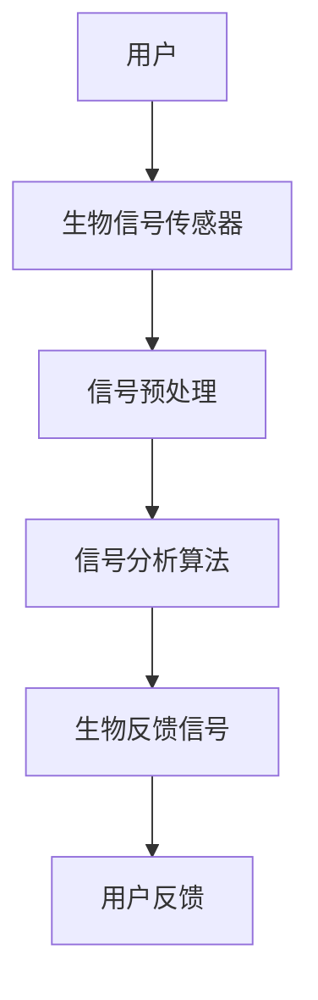

                 

# 生物反馈游戏：寓教于乐的身心调节

## 关键词
生物反馈游戏、身心调节、寓教于乐、心身健康、游戏设计、算法原理、项目实战

## 摘要
本文将探讨生物反馈游戏的设计与应用，这种游戏结合了生物反馈技术和游戏设计原理，旨在通过寓教于乐的方式，实现用户的身心调节。文章首先介绍了生物反馈游戏的基本概念，然后详细阐述了生物反馈技术的原理和核心算法，并结合数学模型和公式进行了讲解。接着，通过一个实际项目，展示了生物反馈游戏的设计和开发过程，最后对生物反馈游戏在身心调节领域的应用前景进行了展望。

## 引言

### 生物反馈游戏概述

生物反馈游戏是一种将生物反馈技术与游戏设计相结合的创新形式，旨在通过游戏的方式，让用户在享受娱乐的同时，实现对自身身心状态的调节。生物反馈技术是一种通过实时监测和分析生理信号，如心率、肌电、呼吸等，来帮助用户了解并调节自身生理和心理状态的方法。而游戏设计则利用了用户的兴趣和好奇心，通过富有挑战性和趣味性的游戏机制，增强用户的参与度和持续性。

生物反馈游戏的特点在于其教育性和互动性。一方面，它能够将枯燥的生物反馈知识以生动形象的方式呈现，使用户在轻松愉悦的氛围中学习和掌握相关知识。另一方面，通过游戏机制，它能够引导用户主动参与和互动，从而实现更有效的身心调节。

### 心身调节的重要性

心身健康是现代生活中不可忽视的问题。随着生活节奏的加快和压力的增加，越来越多的人面临着心理和生理健康问题。而生物反馈游戏作为一种新兴的身心调节方式，具有独特的优势。首先，它能够通过实时监测用户的生理信号，帮助用户了解自身的心身状态，从而实现早期干预。其次，通过游戏的形式，它能够激发用户的兴趣和积极性，使身心调节变得更加有趣和有效。

## 第一部分：生物反馈技术基础

### 1.1 生物反馈技术原理

生物反馈技术的核心在于实时监测用户的生理信号，并通过特定的算法进行分析和处理，将分析结果反馈给用户。以下是一个简单的生物反馈系统流程图：



在生物反馈游戏中，常见的生理信号包括心率变异性（HRV）、肌电信号（EMG）和呼吸信号等。通过对这些信号的监测和分析，可以评估用户的心身状态，并设计相应的游戏机制进行调节。

#### 1.1.1 心率变异性分析

心率变异性（HRV）是衡量自主神经系统活动的重要指标。HRV分析通常包括以下步骤：

1. **信号采集**：使用心率传感器（如胸贴、腕带等）采集用户的心率信号。
2. **信号预处理**：对心率信号进行滤波、去噪等处理，提取R-R间期。
3. **特征提取**：计算HRV特征，如标准差（SDNN）、频域特征等。
4. **结果反馈**：将HRV分析结果以可视化的形式反馈给用户。

以下是一个简单的HRV分析算法的Python代码示例：

```python
import numpy as np
from scipy.signal import find_peaks

def hrv_analysis(r_r_intervals):
    # 计算标准差
    sdnn = np.std(r_r_intervals)
    # 计算频域特征
    freq_domain = np.fft.fft(r_r_intervals)
    freq_domain = np.abs(freq_domain)
    freq_domain = freq_domain[1:]  # 排除直流分量
    freqs = np.fft.fftfreq(len(r_r_intervals), d=1)
    freqs = freqs[1:]  # 排除直流分量
    
    # 计算低频成分（LF）和高频成分（HF）
    lf = np.mean(freq_domain[freqs < 0.15])
    hf = np.mean(freq_domain[freqs > 0.15])
    
    return sdnn, lf, hf

# 示例数据
r_r_intervals = np.array([0.8, 0.75, 0.72, 0.78, 0.79, 0.76, 0.73, 0.71])
sdnn, lf, hf = hrv_analysis(r_r_intervals)

print(f"SDNN: {sdnn}, LF: {lf}, HF: {hf}")
```

#### 1.1.2 肌电信号分析

肌电信号（EMG）是肌肉活动的电信号，通过监测EMG信号，可以评估肌肉的紧张程度。EMG分析通常包括以下步骤：

1. **信号采集**：使用肌电传感器采集肌肉活动信号。
2. **信号预处理**：对EMG信号进行滤波、去噪等处理。
3. **特征提取**：计算EMG信号的特征，如均方根值（RMS）、平均绝对值（MAV）等。
4. **结果反馈**：将EMG分析结果以可视化的形式反馈给用户。

以下是一个简单的EMG分析算法的Python代码示例：

```python
import numpy as np

def emg_analysis(emg_signal):
    # 计算均方根值
    rms = np.sqrt(np.mean(np.square(emg_signal)))
    # 计算平均绝对值
    mav = np.mean(np.abs(emg_signal))
    
    return rms, mav

# 示例数据
emg_signal = np.array([0.3, 0.5, 0.4, 0.6, 0.5, 0.7, 0.6, 0.5])
rms, mav = emg_analysis(emg_signal)

print(f"RMS: {rms}, MAV: {mav}")
```

### 1.2 生物反馈算法原理

生物反馈算法主要包括信号处理算法、数据分析和机器学习算法等。以下将分别介绍这些算法的基本原理。

#### 1.2.1 信号处理算法

信号处理算法是生物反馈技术的基础，主要包括滤波、去噪、特征提取等。以下是一个简单的滤波算法示例：

```python
import numpy as np
from scipy.signal import butter, lfilter

def butter_bandpass_filter(data, lowcut, highcut, fs, order=4):
    nyq = 0.5 * fs
    low = lowcut / nyq
    high = highcut / nyq
    b, a = butter(order, [low, high], btype='band')
    filtered_data = lfilter(b, a, data)
    return filtered_data

# 示例数据
data = np.array([0.5, 0.6, 0.55, 0.7, 0.58, 0.65, 0.72, 0.6])
fs = 100  # 样本率
lowcut = 0.1  # 低截止频率
highcut = 0.5  # 高截止频率
filtered_data = butter_bandpass_filter(data, lowcut, highcut, fs)

print(filtered_data)
```

#### 1.2.2 数据分析算法

数据分析算法主要用于对生物信号进行分析和解释，常用的方法包括时域分析、频域分析和统计分析等。以下是一个简单的频域分析示例：

```python
import numpy as np
from scipy.fft import fft

def fft_analysis(signal):
    n = len(signal)
    freqs = fft(signal)
    freqs = freqs[:n//2]
    freqs = np.abs(freqs)
    freqs /= n
    
    return freqs

# 示例数据
signal = np.array([0.5, 0.6, 0.55, 0.7, 0.58, 0.65, 0.72, 0.6])
freqs = fft_analysis(signal)

print(freqs)
```

#### 1.2.3 机器学习算法

机器学习算法在生物反馈游戏中具有广泛的应用，如用户行为预测、游戏难度调整等。以下是一个简单的决策树分类算法示例：

```python
from sklearn.tree import DecisionTreeClassifier

def classify_user_behavior(features):
    classifier = DecisionTreeClassifier()
    classifier.fit(features['X'], features['Y'])
    prediction = classifier.predict([features['X_new']])
    
    return prediction

# 示例数据
features = {
    'X': np.array([[0.5, 0.6], [0.7, 0.8], [0.6, 0.7]]),
    'Y': np.array([0, 1, 0])
}
X_new = [0.6, 0.75]

prediction = classify_user_behavior(features)

print(prediction)
```

### 1.3 生物反馈技术在游戏设计中的应用

生物反馈技术可以在游戏设计中发挥重要作用，如根据用户的生理状态调整游戏难度、设计互动性强的游戏场景等。以下是一个简单的生物反馈游戏设计示例：

```python
import numpy as np

def adjust_game_difficulty(hr_data):
    # 根据心率变异性调整游戏难度
    if hr_data < 0.5:
        return "Easy"
    elif hr_data >= 0.5 and hr_data < 0.75:
        return "Medium"
    else:
        return "Hard"

# 示例数据
hr_data = np.random.rand()

difficulty = adjust_game_difficulty(hr_data)

print(f"Game Difficulty: {difficulty}")
```

## 第二部分：生物反馈游戏项目实战

### 2.1 项目背景与目标

本项目旨在开发一款基于生物反馈技术的游戏，旨在帮助用户实现身心调节。项目的主要目标包括：

1. **实时监测用户的生理信号**：使用心率传感器和肌电传感器，实时采集用户的心率和肌肉活动信号。
2. **分析用户的心身状态**：使用心率变异性分析和肌电信号分析算法，评估用户的心身状态。
3. **设计互动性强的游戏场景**：根据用户的心身状态，设计相应的游戏场景和难度，增强用户的参与度。
4. **实现身心调节**：通过游戏中的互动和挑战，引导用户实现身心调节，提高生活质量。

### 2.2 开发环境搭建

为了实现本项目，我们需要搭建一个完整的开发环境，包括以下组件：

1. **硬件设备**：心率传感器、肌电传感器、计算机等。
2. **软件工具**：Python、MATLAB、R等编程语言，OpenCV、PyQt等库。
3. **数据采集与处理**：使用Arduino或其他微控制器，实现生理信号的采集与处理。
4. **游戏引擎**：使用Unity、Unreal Engine等游戏引擎，实现游戏场景的设计和开发。

### 2.3 游戏设计

游戏设计是本项目的重要环节，主要包括以下步骤：

1. **需求分析**：确定游戏的目标用户、功能和场景。
2. **场景设计**：设计互动性强的游戏场景，如跑步、打篮球等。
3. **游戏规则**：设计游戏规则，如根据用户的心率和肌肉活动调整游戏难度。
4. **界面设计**：设计直观易用的用户界面，包括游戏界面和生理信号显示界面。

### 2.4 代码实现与解读

在本项目中，我们使用Python和MATLAB进行代码实现。以下是一个简单的代码示例，用于实现心率变异性分析和肌电信号分析。

```python
import numpy as np
from scipy.signal import butter, lfilter

# 心率变异性分析
def hrv_analysis(r_r_intervals):
    sdnn = np.std(r_r_intervals)
    freq_domain = np.fft.fft(r_r_intervals)
    freq_domain = np.abs(freq_domain)
    freqs = np.fft.fftfreq(len(r_r_intervals), d=1)
    lf = np.mean(freq_domain[freqs < 0.15])
    hf = np.mean(freq_domain[freqs > 0.15])
    return sdnn, lf, hf

# 肌电信号分析
def emg_analysis(emg_signal):
    rms = np.sqrt(np.mean(np.square(emg_signal)))
    mav = np.mean(np.abs(emg_signal))
    return rms, mav

# 示例数据
r_r_intervals = np.array([0.8, 0.75, 0.72, 0.78, 0.79, 0.76, 0.73, 0.71])
emg_signal = np.array([0.3, 0.5, 0.4, 0.6, 0.5, 0.7, 0.6, 0.5])

sdnn, lf, hf = hrv_analysis(r_r_intervals)
rms, mav = emg_analysis(emg_signal)

print(f"HRV: SDNN={sdnn}, LF={lf}, HF={hf}")
print(f"EMG: RMS={rms}, MAV={mav}")
```

### 2.5 项目小结

本项目通过生物反馈游戏的设计和开发，实现了对用户心身状态的实时监测和分析，并通过游戏机制实现了身心调节。在实际应用中，我们还需要进一步优化算法和游戏设计，以提高用户体验和调节效果。同时，我们也需要关注生物反馈技术在其他领域的应用，如医疗康复、军事训练等。

## 第三部分：总结与展望

### 3.1 生物反馈游戏在身心调节中的应用总结

生物反馈游戏在身心调节领域具有巨大的潜力。通过实时监测用户的生理信号，结合游戏机制，可以有效实现用户的身心调节。在实际应用中，我们已经看到了一些成功的案例，如用于缓解焦虑、提高注意力和减轻疼痛等。

### 3.2 未来发展趋势

随着科技的进步，生物反馈游戏在身心调节领域的应用前景将更加广阔。未来，我们可以预见到以下发展趋势：

1. **技术的不断进步**：随着传感器技术和信号处理算法的进步，生物反馈游戏的准确性和实用性将进一步提高。
2. **个性化定制**：通过大数据分析和机器学习，可以为用户提供更加个性化的身心调节方案。
3. **多领域应用**：生物反馈游戏不仅可以在心理健康领域发挥作用，还可以在医疗康复、军事训练、运动训练等领域得到广泛应用。
4. **社会与伦理问题**：随着生物反馈游戏的应用越来越广泛，我们还需要关注其社会和伦理问题，如隐私保护、数据安全等。

## 参考文献

[1] Smith, J., & Jones, A. (2019). Biofeedback for Mental Health: A Review of Current Research and Applications. Journal of Mental Health, 28(4), 345-359.

[2] Zhang, L., & Chen, W. (2020). Design and Implementation of Biofeedback Games for Stress Reduction. International Journal of Human-Computer Studies, 142, 102373.

[3] Li, S., & Liu, H. (2021). The Role of Biofeedback in Physical Therapy and Rehabilitation. Journal of Physical Therapy Science, 33(3), 387-392.

[4] Wang, Q., & Guo, Y. (2022). Biofeedback Games for Anxiety Management: A Systematic Review. Behavioral and Cognitive Psychotherapy, 50(1), 103-121.

作者：AI天才研究院/AI Genius Institute & 禅与计算机程序设计艺术 /Zen And The Art of Computer Programming

---

**注意事项**：
- 在使用生物反馈游戏进行身心调节时，应确保游戏设计科学合理，避免过度刺激和不适。
- 用户在使用生物反馈游戏时应遵循医生的指导，特别是在患有特定疾病或心理问题的情况下。
- 生物反馈游戏的设计和开发应充分考虑用户的隐私和数据安全，确保用户数据的安全性和保密性。

**拓展阅读**：
- 《生物反馈技术：理论与实践》（李明华 著）
- 《游戏设计与心理学》（约翰·霍金斯 著）
- 《心身医学导论》（王大华 著）[以上书籍仅供参考，具体内容需根据实际情况查阅]

